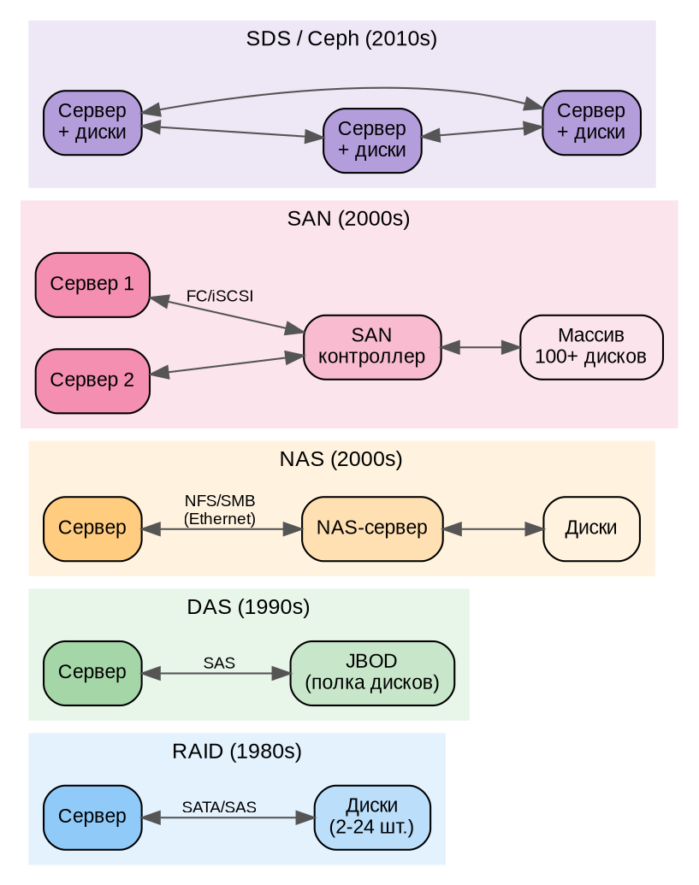
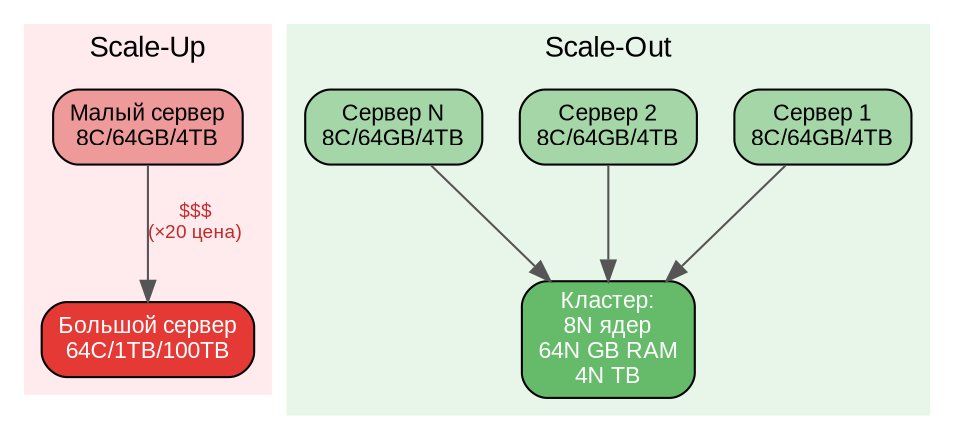
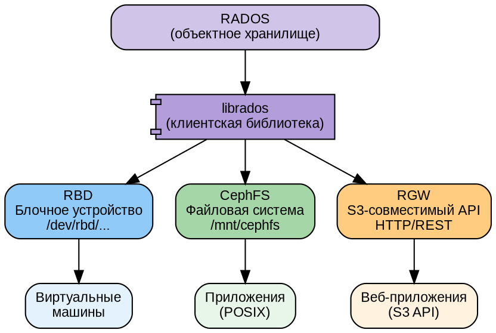

# Часть I. Основы распределённого хранения *(25 стр.)*

> **Цель:** понять, зачем нужны распределённые хранилища, в чём проблема масштабирования одного сервера и где Ceph в ландшафте решений.
> **После этой части вы сможете:** объяснить разницу между вертикальным и горизонтальным масштабированием, сформулировать CAP-теорему, выбрать тип хранилища под бизнес-задачу.

---

## Глава 1. Зачем нужно распределённое хранение *(13 стр.)*

### 1.1. От одного диска к кластеру: проблема масштаба *(2 стр.)*

#### Как компьютер хранит данные

Любой компьютер хранит данные на **запоминающих устройствах** — устройствах, которые сохраняют информацию даже после выключения питания. Исторически сложилось три основных типа:

**HDD (Hard Disk Drive — «жёсткий диск»)** — механическое устройство. Внутри герметичного корпуса вращаются магнитные пластины со скоростью 5400, 7200 или 10000 оборотов в минуту, а магнитная головка на подвижном рычаге считывает и записывает данные. Принцип похож на старый проигрыватель виниловых пластинок, только вместо иглы — магнитная головка, а пластины покрыты ферромагнитным слоем.

*Ключевые характеристики:*
- Скорость: 100–200 операций в секунду (IOPS — Input/Output Operations Per Second)
- Пропускная способность: 150–250 мегабайт в секунду (МБ/с) для современных моделей
- Ёмкость: до 22 терабайт (ТБ) на один диск
- Цена: ~1–3 копейки за гигабайт
- Слабые места: механический износ, чувствительность к вибрации и ударам

**SSD (Solid-State Drive — «твердотельный накопитель»)** — полностью электронное устройство, без движущихся частей. Данные хранятся в микросхемах флеш-памяти NAND. Каждая ячейка памяти представляет собой транзистор с «плавающим затвором», который может удерживать электрический заряд, кодируя биты информации.

*Ключевые характеристики:*
- Скорость: 5 000–100 000 IOPS (в 50–500 раз быстрее HDD)
- Пропускная способность: 500–550 МБ/с (SATA) или до 7 000 МБ/с (NVMe)
- Ёмкость: до 100 ТБ в корпоративных моделях
- Цена: ~3–8 копеек за гигабайт
- Слабые места: ограниченное количество циклов перезаписи ячеек (износ)

**NVMe (Non-Volatile Memory Express — «энергонезависимая память с быстрым доступом»)** — это не тип памяти, а **протокол доступа** к SSD. Обычные SSD подключаются через SATA (как HDD) — этот интерфейс был спроектирован для медленных механических дисков. NVMe подключает SSD напрямую к шине PCI Express (той же, через которую подключается видеокарта), снимая ограничения SATA.

*Ключевые характеристики:*
- Скорость: до 1 000 000 IOPS
- Пропускная способность: до 14 000 МБ/с (PCIe 5.0 ×4)
- Задержка (latency): менее 10 микросекунд (против 4–10 миллисекунд у HDD — в 400 раз быстрее)
- Форм-факторы: карты расширения PCIe, M.2 (маленькая плата), U.2 (для серверов)

**Ключевая метафора:**
> HDD — это библиотекарь, который идёт к стеллажу, ищет книгу и возвращается. SSD — это библиотекарь, который помнит наизусть, где каждая книга. NVMe — это библиотекарь с телепортацией.

#### Проблема масштаба одного сервера

Типичный сервер может вместить 8–24 диска. Возьмём верхнюю границу: сервер с 24 дисками по 20 ТБ. Казалось бы, это 480 ТБ — огромный объём. Но на практике мы сталкиваемся с тремя проблемами:

**1. Предел ёмкости.** Современные данные растут экспоненциально. Видеонаблюдение на 100 камер за месяц генерирует 50–100 ТБ. Научный эксперимент (например, Большой адронный коллайдер) — десятки петабайт (1 ПБ = 1000 ТБ) в год. 480 ТБ заканчиваются быстрее, чем кажется.

**2. Предел производительности.** Один сервер имеет ограниченный сетевой интерфейс. Даже 100-гигабитный Ethernet (100GbE) — это «всего» 12.5 гигабайт в секунду. Если к хранилищу одновременно обращаются сотни серверов, сетевая карта становится «бутылочным горлышком» (bottleneck) — самым узким местом системы.

**3. Единая точка отказа (SPOF — Single Point Of Failure).** Если в этом сервере выходит из строя блок питания, материнская плата, или просто перекусывают сетевой кабель — **все данные становятся недоступны для всех пользователей**. Бизнес встаёт.

```
Один сервер = одна точка отказа.
Отказал → данных нет.
```

Уже на этом этапе понятно: **один сервер не может быть надёжным хранилищем для больших и важных данных**. Нужен другой подход.

---

### 1.2. RAID, DAS, NAS, SAN: эволюция хранилищ *(3 стр.)*

Человечество прошло долгий путь, прежде чем прийти к распределённым хранилищам. Рассмотрим ключевые этапы.

#### RAID — защита на уровне дисков внутри одного сервера

**RAID** (Redundant Array of Independent Disks — «избыточный массив независимых дисков») — технология объединения нескольких физических дисков в один логический том.

> **Логический том** — это виртуальный диск, который операционная система видит как одно устройство, хотя физически данные распределены по нескольким реальным дискам.

Основные уровни RAID:

| Уровень | Описание | Минимум дисков | Полезная ёмкость | Отказоустойчивость |
|---------|----------|---------------|-----------------|-------------------|
| **RAID 0** | Чередование (striping). Данные пишутся «полосками» попеременно на все диски | 2 | 100% | ❌ Никакой — отказ любого диска = потеря всех данных |
| **RAID 1** | Зеркалирование (mirroring). Точная копия на втором диске | 2 | 50% | ✅ Выдерживает отказ 1 диска |
| **RAID 5** | Чередование + контрольные суммы. Блоки данных и паритет (математическая контрольная сумма) распределены по всем дискам | 3 | (N−1)/N | ✅ Выдерживает отказ 1 диска |
| **RAID 6** | Как RAID 5, но две независимых контрольных суммы | 4 | (N−2)/N | ✅ Выдерживает отказ 2 дисков |
| **RAID 10** | Комбинация RAID 1 + RAID 0: зеркалирование + чередование | 4 | 50% | ✅ Выдерживает отказ 1–2 дисков (из разных зеркал) |

**Как работает контрольная сумма (parity) в RAID 5:**

Представьте три диска и простейшую операцию XOR (исключающее ИЛИ):
```
Диск 1: 1010
Диск 2: 0110
Parity: 1100  (вычислено как 1010 XOR 0110 = 1100)
```

Если диск 2 выходит из строя, его данные можно восстановить: `1010 XOR 1100 = 0110`. Такая математическая избыточность позволяет восстановить потерянный диск без хранения полной копии данных.

**Главный недостаток RAID:** он защищает только от отказа дисков внутри **одного** сервера. Если отказывает сам сервер — данные недоступны.

#### DAS (Direct-Attached Storage — «хранилище, подключённое напрямую»)

Диски, подключённые непосредственно к серверу (внутренние или внешняя полка JBOD — Just a Bunch Of Disks). Самый простой вариант: сервер сам управляет своими дисками через RAID-контроллер.

**Плюсы:** простота, низкая задержка (диски рядом).
**Минусы:** данные привязаны к одному серверу, нельзя расшарить между несколькими серверами без дополнительного ПО.

#### NAS (Network-Attached Storage — «сетевое хранилище»)

Специализированный сервер (или просто компьютер с дисками), который предоставляет доступ к файлам по сети через протоколы **NFS** (Network File System, для Linux/Unix) или **SMB** (Server Message Block, для Windows). Клиенты «видят» сетевую папку как обычный каталог у себя в системе.

```
[Сервер приложений] ──NFS/SMB── [NAS-сервер с дисками]
```

**Плюсы:** можно расшарить между многими серверами, централизованное управление.
**Минусы:** одно устройство — одна точка отказа; производительность ограничена сетью; плохо масштабируется (купить NAS мощнее — дорого).

#### SAN (Storage Area Network — «сеть хранения данных»)

Выделенная высокоскоростная сеть (обычно Fibre Channel или iSCSI), которая соединяет серверы с дисковыми массивами на **блочном** уровне. Сервер видит диск, как будто он подключён локально, хотя физически диск находится в другом конце дата-центра.

```
[Сервер] ──Fibre Channel── [SAN-контроллер] ── [Массив дисков (100+ шт.)]
[Сервер] ──Fibre Channel──/
[Сервер] ──Fibre Channel──/
```

**Плюсы:** высокая производительность, отказоустойчивость на уровне контроллера (дублированные контроллеры).
**Минусы:** дорого (Fibre Channel-коммутаторы, лицензии), сложно, один вендор, **контроллер остаётся единой точкой отказа** (хотя и дублированной). И главное: плохо масштабируется горизонтально — чтобы добавить ёмкость, часто нужно заменить контроллер на более мощный.

#### DOT-схема: эволюция хранилищ



**Ключевая проблема всех этих подходов:** контроллер хранилища (сервер NAS, контроллер SAN) остаётся бутылочным горлышком и единой точкой отказа, даже если он дублирован. При росте данных до петабайт эти архитектуры перестают справляться.

**Вывод:** нужна архитектура, где **нет центрального контроллера**, а данные и управление распределены по всем узлам. Именно это и предлагает Ceph.

---

### 1.3. Горизонтальное vs вертикальное масштабирование *(2 стр.)*

#### Вертикальное масштабирование (Scale-Up)

**Идея:** взять сервер и сделать его мощнее. Добавить больше процессоров, больше оперативной памяти, больше дисков, более быструю сетевую карту.

```
Сервер (8 ядер, 64 GB RAM, 4 диска)
     ↓ Scale-Up
Сервер (64 ядра, 1 TB RAM, 24 диска)
```

**Плюсы:** просто — не нужно менять архитектуру приложения.
**Минусы:**
- **Физический предел.** Материнская плата может принять ограниченное количество процессора/памяти. Серверная стойка вмещает максимум 24–36 дисков.
- **Стоимость растёт нелинейно.** Сервер на 64 ядра стоит не в 8 раз дороже 8-ядерного, а в 15–30 раз (меньший спрос, сложнее производство).
- **Единая точка отказа.** Сервер стал мощнее, но он по-прежнему один.
- **Простой при обслуживании.** Чтобы добавить память, сервер нужно выключить.

#### Горизонтальное масштабирование (Scale-Out)

**Идея:** взять много одинаковых стандартных (commodity) серверов и объединить их в **кластер** — группу серверов, работающих как единое целое.

```
Сервер 1 (8 ядер, 64 GB, 4 диска)
Сервер 2 (8 ядер, 64 GB, 4 диска)    } кластер: 24 ядра, 192 GB, 12 дисков
Сервер 3 (8 ядер, 64 GB, 4 диска)
```

**Плюсы:**
- **Линейный рост.** Добавили сервер — получили +100% ресурсов. Добавили ещё — ещё +100%. Нет физического предела: можно объединить тысячи серверов.
- **Линейная стоимость.** Стандартные серверы стоят одинаково. 100 серверов = 100 × цена одного сервера.
- **Отказоустойчивость.** Отказ одного сервера — это потеря лишь небольшой части общей ёмкости и производительности, а не всей системы.
- **Обслуживание без простоя.** Можно отключить один сервер на замену диска, пока остальные работают.

**Минусы:**
- **Сложность.** Нужно специальное программное обеспечение, которое объединяет серверы в кластер и управляет распределением данных.
- **Сеть.** Серверы должны общаться между собой по сети, а сеть добавляет задержку.

#### DOT-схема: два типа масштабирования



**Ceph реализует именно Scale-Out подход.** Кластер растёт добавлением стандартных серверов, и никакого «главного» сервера-контроллера нет.

---

### 1.4. CAP-теорема: жертвуем консистентностью или доступностью? *(3 стр.)*

#### Что такое CAP

**CAP-теорема** (теорема Брюера, сформулирована Эриком Брюером в 2000 году) — фундаментальный принцип распределённых систем. Она гласит:

> В распределённой системе при сетевом разделении (Partition) можно обеспечить **либо** согласованность (Consistency), **либо** доступность (Availability), но **не то и другое одновременно**.

Разберём каждое понятие.

**C — Consistency (согласованность, консистентность).** Все узлы кластера в любой момент времени видят **одинаковые** данные. Если клиент записал данные на узел A и тут же прочитал с узла B, он получит те же самые данные (самые свежие).

**A — Availability (доступность).** Каждый запрос к кластеру (чтение или запись) обязательно получает ответ — либо успех, либо ошибку. Система не может просто «зависнуть» и не ответить. Важно: ответ «ошибка» — тоже ответ. Доступность не означает «всегда успех».

**P — Partition tolerance (устойчивость к разделению).** Кластер продолжает работать, даже если сеть между узлами разорвана и они не могут общаться друг с другом. В реальном мире разделение сети — не экзотика, а регулярное событие: перегруженный коммутатор, обрыв кабеля, сбой сетевой карты.

#### «Выбери два из трёх» — что это значит на практике

В реальности **P (устойчивость к разделению) — не выбор, а данность**. Сеть **будет** отказывать. Поэтому выбор на практике стоит между C и A:

```
При разделении сети:
  Либо → все узлы согласованы (C), но часть запросов не получает ответа (¬A)
  Либо → все запросы получают ответ (A), но данные могут быть несогласованными (¬C)
```

**Пример CP-системы (жертвуем доступностью):**
Банковский перевод денег. Если сеть между дата-центрами разорвана, лучше **не дать** клиенту снять деньги (отказать в ответе — нет A), чем позволить снять одни и те же деньги дважды в разных отделениях (рассогласование — нет C).

**Пример AP-системы (жертвуем согласованностью):**
Лента социальной сети. Если сеть разделена, лучше показать пользователю «почти свежие» посты (допустить небольшое рассогласование — нет C), чем показать пустую страницу с ошибкой (нет A).

#### Где Ceph на треугольнике CAP?

Ceph по умолчанию — **CP-система** с настраиваемым компромиссом.

- Ceph обеспечивает **строгую согласованность (C)** при записи: клиент получает подтверждение только после того, как все реплики подтвердили запись.
- При разделении сети Ceph может потерять **доступность (A)**: если потерян кворум MON, кластер перестаёт отвечать на запросы, чтобы не допустить рассогласования (split-brain — ситуация «два мозга», когда обе половинки кластера считают себя главными).

Однако Ceph даёт администратору **ручку настройки**:
- Параметр `min_size` у пула: если количество доступных реплик падает ниже `min_size`, запись блокируется (CP). Если снизить `min_size`, кластер продолжит принимать запись, жертвуя согласованностью (AP).

```
Ceph default: CP (согласованность > доступность)
Ceph tuned: может быть ближе к AP
```

Это важное проектное решение: Ceph **никогда не пожертвует данными** ради доступности. Лучше не ответить, чем потерять или исказить данные.

---

### 1.5. Практикум: считаем ёмкость и стоимость кластера *(3 стр.)*

#### Задача

Руководство поставило задачу: нужно хранилище на **100 терабайт полезного пространства**. Данные критичны, потеря даже одного файла недопустима.

Вы — молодой специалист. Вам нужно рассчитать и сравнить два варианта:
- **Вариант A:** классический SAN от вендора (например, Dell/NetApp/HPE)
- **Вариант B:** Ceph-кластер на стандартных серверах (commodity hardware)

#### Расчёт для Ceph

**Дано:**
- Полезная ёмкость: 100 ТБ
- Репликация: 3 копии каждого объекта (стандарт для Ceph)
- Диски: HDD 20 ТБ (SATA, ~35 000 ₽ за штуку)
- Сервер: 12-дисковый, 64 GB RAM, 2× Xeon Silver (~500 000 ₽)
- В одном сервере максимум 12 дисков

**Шаг 1. Сырая ёмкость.**
При трёхкратной репликации для 100 ТБ полезных нужно 300 ТБ сырой ёмкости:
```
Сырая ёмкость = Полезная × репликация = 100 × 3 = 300 ТБ
```

**Шаг 2. Количество дисков.**
Диски по 20 ТБ:
```
Дисков = 300 / 20 = 15 штук
```

**Шаг 3. Количество серверов.**
В одном сервере 12 дисков, нужно 15 → 2 сервера:
```
Серверов = ceil(15 / 12) = 2
```

Итого дисков: 2 × 12 = 24 (с запасом — 480 ТБ сырых, 160 ТБ полезных).

**Шаг 4. Расчёт стоимости Ceph.**

| Компонент | Кол-во | Цена за шт. | Сумма |
|-----------|--------|-------------|-------|
| Сервер (12-дисковый) | 2 | 500 000 ₽ | 1 000 000 ₽ |
| Диски HDD 20 ТБ | 24 | 35 000 ₽ | 840 000 ₽ |
| Сетевой коммутатор 25GbE | 1 | 300 000 ₽ | 300 000 ₽ |
| Сетевые карты 25GbE | 2 | 50 000 ₽ | 100 000 ₽ |
| **Итого Ceph** | | | **2 240 000 ₽** |

#### Сравнение с SAN

SAN аналогичной ёмкости (100 ТБ полезных, отказоустойчивый, два контроллера):

| Компонент | Цена |
|-----------|------|
| Контроллер SAN (2 шт., дублированные) | 3 000 000 ₽ |
| Полка дисков (24 × 20 ТБ) | 1 200 000 ₽ |
| FC-коммутатор (2 шт.) | 800 000 ₽ |
| FC-HBA адаптеры | 200 000 ₽ |
| Лицензии, поддержка (3 года) | 1 500 000 ₽ |
| **Итого SAN** | **6 700 000 ₽** |

**Результат:** Ceph дешевле SAN в 3 раза на старте. При росте до 500 ТБ разрыв увеличивается: Ceph — просто добавить ещё серверов (линейный рост), SAN — может потребоваться замена контроллера на более мощный.

#### Вывод

Ceph на стандартном оборудовании не просто дешевле — его стоимость растёт **линейно** с ростом ёмкости. SAN растёт **ступенчато** (замена контроллера при превышении порога).

---

## Глава 2. Что такое Ceph *(12 стр.)*

### 2.1. SDS — Software-Defined Storage *(2 стр.)*

#### Определение

**Software-Defined Storage (SDS — «программно-определяемое хранилище»)** — это подход, при котором логика управления хранением данных **отделена от физического оборудования** и реализована в программном обеспечении.

В традиционных SAN логика встроена в «железо» (микрокод контроллера), и вы привязаны к вендору. В SDS вы берёте стандартное оборудование (commodity hardware) и устанавливаете программное обеспечение, которое управляет всеми дисками как единым пулом.

```
Традиционное хранилище:
[Железо + Логика вместе] → привязаны к вендору

SDS / Ceph:
[Стандартное железо] ← → [Программная логика]
                             ↕
                    Можно менять железо,
                    можно менять ПО —
                    независимо!
```

#### Что даёт SDS

- **Независимость от вендора.** Можно купить серверы любого производителя — Dell, HPE, Supermicro, российские YADRO/Аквариус. Ceph работает на всех.
- **Экономия.** Стандартное оборудование стоит в разы дешевле специализированного.
- **API-управление.** Всё управление — через команды, REST API, YAML-манифесты. Полная автоматизация.
- **Единый пул.** Диски всех серверов объединяются в одно виртуальное хранилище. Нет «диск сервера 1» и «диск сервера 2» — есть «пул Ceph на 300 ТБ».
- **Самообслуживание.** Ceph автоматически восстанавливается после отказа диска, перераспределяет данные, балансирует нагрузку.

---

### 2.2. Ceph vs конкуренты *(3 стр.)*

Сравним Ceph с основными альтернативами в мире распределённых хранилищ:

| Характеристика | **Ceph** | **GlusterFS** | **MinIO** | **Linstor/DRBD** | **VMware vSAN** |
|---------------|----------|---------------|-----------|-----------------|-----------------|
| Тип доступа | Блочный + файловый + объектный (S3) | Файловый | Объектный (S3) | Блочный | Блочный |
| Масштабируемость | До 1000+ узлов | До 100+ узлов | До 32 узлов (free) | До 32 узлов | До 64 узлов |
| Репликация | ×2, ×3, Erasure Coding | ×2, ×3, disperse | Erasure Coding (Erasure Code — аналог RAID 5/6 для распределённых систем; позволяет хранить больше полезных данных при той же избыточности) | ×2, ×3 | ×1, ×2, ×3, RAID |
| Само-восстановление | ✅ Автоматическое | ❌ Ручное | ✅ Автоматическое | ❌ Ручное | ✅ Автоматическое |
| Консенсус | Paxos (встроен в MON) | Нет (центральный) | Нет (центральный) | Нет | Нет |
| Кворум MON | Да (3/5/7) | — | — | — | — |
| Лицензия | LGPL (свободная) | GPL (свободная) | AGPL / коммерческая | GPL (свободная) | Проприетарная (платная) |
| OpenStack | ✅ Нативный | ✅ Через драйвер | ❌ | ❌ | ❌ |
| Kubernetes CSI | ✅ RBD + CephFS | ✅ | ✅ | ✅ | ✅ |
| Сложность | Высокая | Средняя | Низкая | Средняя | Низкая (интеграция в vSphere) |

#### Когда выбрать НЕ Ceph

- **Меньше 3 серверов:** Ceph не рассчитан на 1–2 узла (для этого есть DRBD/Linstor).
- **Только S3 API:** MinIO проще в установке и обслуживании, если нужен только S3.
- **VMware-среда целиком:** vSAN интегрирован в vSphere «из коробки».
- **Только файловый доступ:** GlusterFS может быть проще в настройке для небольших инсталляций.

#### Когда выбрать Ceph

- Нужны все три интерфейса одновременно (блок, файл, S3) на одном кластере
- Кластер от 5 узлов, с перспективой роста до сотен
- Требуется автоматическое самовосстановление без ручного вмешательства
- Нужна работа в замкнутом контуре без интернета (после настройки зеркал — полностью offline)
- Важна свобода от вендора и лицензионных платежей

---

### 2.3. Три в одном: RBD, CephFS, RGW *(2 стр.)*

Уникальная особенность Ceph: **один кластер предоставляет три разных интерфейса доступа** к одним и тем же данным (на самом деле к разным пулам, но внутри одного RADOS).

**RBD (RADOS Block Device — «блочное устройство RADOS»):**
- Виртуальный жёсткий диск — аналог `/dev/sda`, который можно примонтировать к серверу или виртуальной машине
- Используется для: дисков ВМ в OpenStack/Proxmox, томов Kubernetes (PVC), блочных устройств для СУБД
- Производительность на уровне локального SSD, но с сетевой репликацией

**CephFS (Ceph File System — «файловая система Ceph»):**
- Распределённая POSIX-совместимая файловая система — аналог NFS, но с репликацией и без единой точки отказа
- Можно смонтировать как обычную папку: `mount -t ceph ... /mnt/data`
- Несколько серверов могут одновременно читать и писать в одну директорию (RWX в Kubernetes)

**RGW (RADOS Gateway — «шлюз RADOS»):**
- Объектное хранилище с S3-совместимым API (тем же, что у Amazon S3)
- Используется для: хранения файлов через HTTP, бэкапов, статики веб-сайтов, данных приложений
- Любой инструмент, работающий с Amazon S3 (boto3, rclone, s3cmd), работает с Ceph RGW без изменений

#### DOT-схема: три интерфейса Ceph



**Важно:** RBD, CephFS и RGW — это **протоколы доступа** к одному и тому же кластеру RADOS. Данные хранятся как объекты RADOS, а каждый интерфейс предоставляет свой способ работы с ними.

---

### 2.4. Экосистема: Red Hat, SUSE, сообщество, версии *(3 стр.)*

#### Краткая история Ceph

- **2004–2006:** Сейдж Вейл (Sage Weil) начинает проект как докторскую диссертацию в Калифорнийском университете (UC Santa Cruz). Идея: создать самовосстанавливающееся распределённое хранилище без единой точки отказа.
- **2008:** DreamHost (хостинг-компания) нанимает Сейджа и инвестирует в разработку.
- **2012:** Создана компания Inktank для коммерческой поддержки Ceph.
- **2014:** Red Hat покупает Inktank за 175 млн долларов. Ceph становится частью портфеля Red Hat.
- **2018:** Основан Ceph Foundation (под эгидой Linux Foundation) для управления проектом независимо от Red Hat.
- **2023:** Reef (v18) — стабильный релиз.
- **2024:** Squid (v19) — текущая основная версия.
- **2025:** Tentacle (v20) — новейший релиз.

#### Версии Ceph (на июль 2026)

| Версия | Кодовое имя | Дата релиза | Статус | EOL (End Of Life) |
|--------|-------------|-------------|--------|-------------------|
| **Tentacle 20.2.2** | Tentacle | 2025-11-18 | ✅ Активен, рекомендован | — |
| **Squid 19.2.4** | Squid | 2024-09-26 | ✅ Активен | 2026-09-19 |
| **Reef 18.2.8** | Reef | 2023-08-07 | 🔴 EOL | 2026-03-31 |

> **Данный учебник использует Squid 19.2.x как основную версию.** Отличия от Tentacle 20.2.x даны врезками «🔮 Tentacle» в соответствующих главах.

#### Red Hat Ceph Storage vs upstream Ceph

- **Upstream Ceph** (ceph.com) — свободная версия, сообщество, релизы раз в 12–18 месяцев.
- **Red Hat Ceph Storage (RHCS)** — платная корпоративная версия: сертифицированное оборудование, расширенная поддержка, длительный цикл обновлений (2 года на минорную версию), интеграция с Red Hat Satellite.

Для обучения используется upstream Ceph — он идентичен по функциональности и бесплатен.

#### Сообщество

- **GitHub:** [github.com/ceph/ceph](https://github.com/ceph/ceph) — исходный код
- **Ceph.io:** документация, блог, анонсы релизов
- **Mailing lists:** ceph-users@ceph.io (основной канал поддержки сообщества)
- **Slack:** Ceph Community Slack
- **Ceph Foundation:** координирует развитие, включает Red Hat, Intel, Samsung, Cisco, SUSE и др.

---

### 2.5. Практикум: выбираем хранилище под задачу *(2 стр.)*

#### Задание

Для каждой из 5 типовых бизнес-задач выберите оптимальный тип хранилища и **аргументируйте** выбор (письменно — 2–3 предложения на задачу).

**Задача 1. Файловый сервер для отдела из 50 человек.**
Нужно общее файловое пространство на 20 ТБ, доступ по SMB/NFS. Бюджет ограничен. Данные важно не потерять, но простой на час допустим.

**Задача 2. База данных PostgreSQL для ERP-системы.**
Нужен блочный доступ с низкой задержкой (< 5 мс), 2 ТБ, отказоустойчивость критична (простой = бизнес стоит), бюджет не ограничен.

**Задача 3. Хранилище бэкапов на 500 ТБ.**
Данные пишутся раз в сутки, читаются редко (только при аварии). Скорость не критична, главное — низкая стоимость гигабайта.

**Задача 4. S3-совместимое хранилище для веб-приложения.**
Приложение загружает и раздаёт изображения через HTTP (S3 API). Нагрузка: 1000 загрузок в секунду, 10 ТБ данных.

**Задача 5. Kubernetes-кластер на 100 узлов.**
Нужны Persistent Volumes для подов — блочные (RWO) и общие (RWX). Кластер растёт, нужен линейный Scale-Out без замены оборудования.

#### Ожидаемые ответы (сверьтесь после выполнения):

1. **NAS** — простой файловый доступ, бюджетное решение. Ceph избыточен для 50 пользователей.
2. **SAN (FC) или локальный NVMe RAID 10** — минимальная задержка, максимальная надёжность. Ceph добавит сетевую задержку, что критично для СУБД.
3. **Ceph на HDD с Erasure Coding** — минимальная стоимость гигабайта, автоматическое восстановление при отказе дисков.
4. **Ceph RGW** — нативный S3 API, горизонтальное масштабирование под нагрузку, дешевле AWS S3 на своих объёмах.
5. **Ceph с Rook CSI** — линейный Scale-Out, RBD (RWO) + CephFS (RWX), полная автоматизация через K8s-оператор.

---

| Навигация | |
|-----------|---|
| ← Оглавление | [TOC.md](TOC.md) |
| → Часть II | [part-II.md](part-II.md) |
