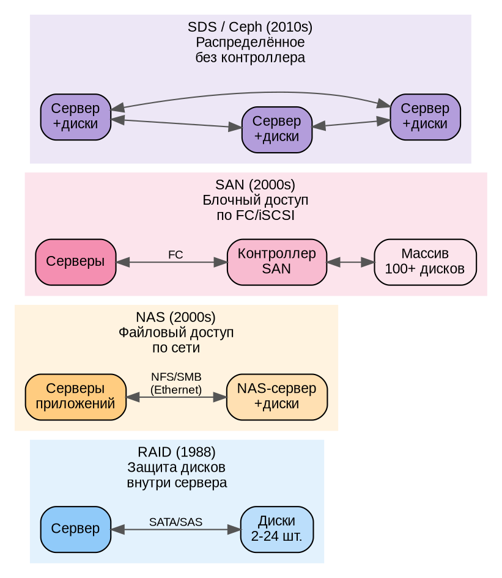
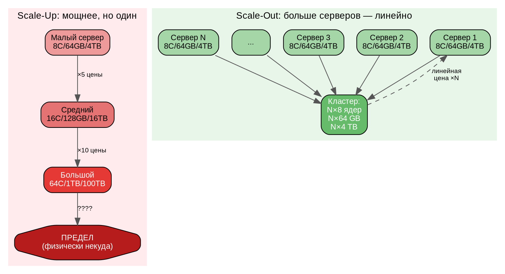
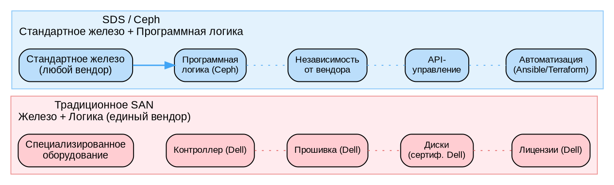
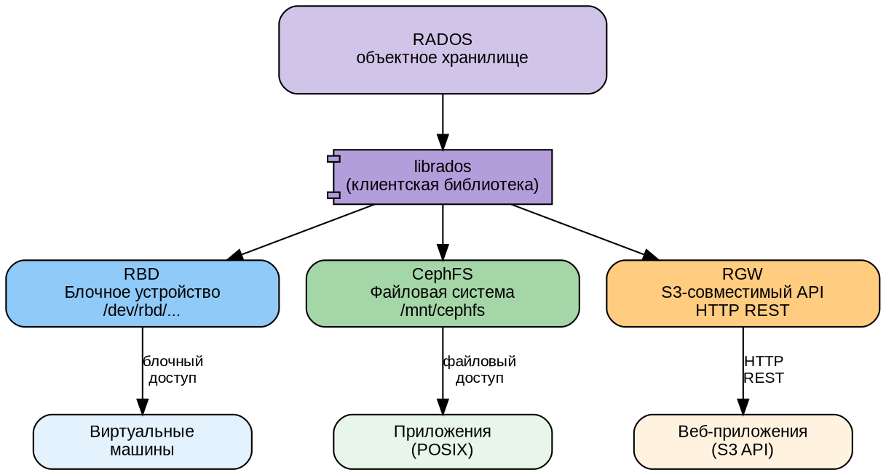

# Часть I. Основы распределённого хранения *(25 стр.)*

> **Цель:** понять, зачем нужны распределённые хранилища, в чём проблема масштабирования одного сервера и где Ceph в ландшафте решений.
> **После этой части вы сможете:** объяснить разницу между вертикальным и горизонтальным масштабированием, сформулировать CAP-теорему, выбрать тип хранилища под бизнес-задачу.

---

## Глава 1. Зачем нужно распределённое хранение *(13 стр.)*

### 1.1. От одного диска к кластеру: проблема масштаба *(2 стр.)*

#### Как компьютер хранит данные

Любой компьютер хранит данные на **запоминающих устройствах** — устройствах, которые сохраняют информацию даже после выключения питания. Исторически сложилось три основных типа:

**HDD (Hard Disk Drive — «накопитель на жёстких магнитных дисках», сокращённо «жёсткий диск»).** Механическое устройство. Внутри герметичного корпуса вращаются алюминиевые или стеклянные пластины с магнитным покрытием со скоростью 5400, 7200 или 10 000 оборотов в минуту. Над каждой пластиной на микроскопическом расстоянии (15 нанометров — в 1000 раз тоньше человеческого волоса) парит магнитная головка на подвижном рычаге-актуаторе. Принцип похож на проигрыватель виниловых пластинок: пластина вращается, головка перемещается поперёк — считывает или записывает данные, намагничивая микроскопические участки поверхности.

*Ключевые характеристики:*
- **IOPS (Input/Output Operations Per Second — «операций ввода-вывода в секунду»):** 100–200. Ограничены механикой — головка физически перемещается к нужной дорожке, и пластина должна довернуться до нужного сектора.
- **Пропускная способность:** 150–250 мегабайт в секунду (МБ/с) для современных моделей. Последовательное чтение быстрее произвольного — головка движется плавно вдоль дорожки.
- **Ёмкость:** до 22 терабайт (ТБ) на один диск. Достигается за счёт технологий CMR (Conventional Magnetic Recording) и SMR (Shingled — «черепичная» запись с перекрытием дорожек).
- **Цена:** ~1–3 копейки за гигабайт. Самое дешёвое хранение на сегодня.
- **Слабые места:** механический износ (подвижные части), чувствительность к вибрации (соседние диски в массиве создают резонанс), чувствительность к ударам (падение с высоты 5 см может быть фатальным).

**SSD (Solid-State Drive — «твердотельный накопитель»).** Полностью электронное устройство, без единой движущейся части. Данные хранятся в микросхемах флеш-памяти NAND (Not-AND — название логической схемы ячейки). Каждая ячейка памяти — это транзистор с «плавающим затвором» (floating gate), который изолирован слоем оксида кремния. Электрический заряд, «запертый» в плавающем затворе, сохраняется годами и кодирует биты информации.

> **Метафора:** HDD — это библиотекарь, который идёт к стеллажу, находит книгу, открывает на нужной странице и возвращается. Каждое действие — секунды. SSD — это библиотекарь, который помнит наизусть содержание всех книг и мгновенно отвечает на любой вопрос. NVMe — библиотекарь с телепортацией.

*Ключевые характеристики:*
- **IOPS:** 5 000–100 000 (в 50–500 раз быстрее HDD). Нет механики — нет задержек на позиционирование.
- **Пропускная способность:** 500–550 МБ/с (SATA — Serial ATA, интерфейс, унаследованный от HDD) или до 7 000 МБ/с (NVMe).
- **Ёмкость:** до 100 ТБ в корпоративных моделях.
- **Цена:** ~3–8 копеек за гигабайт. Дороже HDD, но дешевеет с каждым годом.
- **Слабые места:** ограниченное количество циклов перезаписи ячеек — каждая ячейка «изнашивается» после 3 000–100 000 циклов (в зависимости от типа памяти: SLC/MLC/TLC/QLC).

**NVMe (Non-Volatile Memory Express — «энергонезависимая память с быстрым доступом»).** Это не тип памяти, а **протокол доступа** к SSD. Обычные SSD (SATA) подключаются через интерфейс, спроектированный в 2003 году для медленных механических дисков — с очередью команд глубиной 32. NVMe подключает SSD напрямую к шине PCI Express — той же скоростной магистрали, через которую подключается видеокарта. Глубина очереди: 64 000 команд.

*Ключевые характеристики:*
- **IOPS:** до 1 000 000 (миллион операций в секунду).
- **Пропускная способность:** до 14 000 МБ/с (PCIe 5.0 ×4 — четыре линии пятого поколения).
- **Задержка (latency):** менее 10 микросекунд (против 4–10 миллисекунд у HDD — **в 400 раз быстрее**).
- **Форм-факторы:** карты расширения PCIe (как видеокарта), M.2 (маленькая плата 22×80 мм), U.2 (серверный формат с возможностью горячей замены).

#### Почему масштаб одного сервера — проблема

Представьте серверную стойку с мощным сервером: 24 диска по 20 ТБ. Казалось бы, **480 ТБ** — половина петабайта. Огромный объём.

Но реальность:

**Проблема 1 — предел ёмкости.** Мир генерирует данные экспоненциально:
- 100 камер видеонаблюдения (Full HD, 30 кадров/с) — **50–100 ТБ в месяц** при умеренном сжатии
- Один метеорологический спутник — **50 ТБ в день** (многоспектральные снимки)
- Большой адронный коллайдер (ЦЕРН) — **петабайты в год** (столкновения частиц, трекинг)
- Крупный интернет-магазин — **терабайты логов** ежедневно (клики, покупки, рекомендации)

480 ТБ заканчиваются за несколько месяцев эксплуатации. А данные — это актив. Их нельзя просто «удалить».

**Проблема 2 — предел производительности.** Один сервер имеет ограниченную сетевую карту. Даже 100-гигабитный Ethernet (100GbE) обеспечивает *теоретически* 12.5 гигабайт в секунду. Если к хранилищу одновременно обращаются сотни серверов с сотнями тысяч пользователей — сетевая карта становится «бутылочным горлышком» (bottleneck — самое узкое место системы, ограничивающее общую производительность).

**Проблема 3 — единая точка отказа (SPOF — Single Point Of Failure).** Отказ любого критического компонента:
- Блок питания (даже дублированный — оба могут выйти из строя при скачке напряжения)
- Материнская плата
- RAID-контроллер
- Физическое повреждение (пожар, затопление, землетрясение)
- Человеческая ошибка (перекушен кабель, случайное выключение)

**Все данные становятся недоступны для всех пользователей.** Бизнес стоит. Деньги теряются.

```
Один сервер = одна точка отказа.
Отказал → все данные недоступны → убытки.
```

Вывод неизбежен: **один сервер не может быть надёжным хранилищем для критичных данных.** Нужна архитектура, где данные распределены между многими серверами так, что отказ любого из них не приводит к потере доступности.

---

### 1.2. RAID, DAS, NAS, SAN: эволюция хранилищ *(3 стр.)*

Человечество прошло долгий путь, прежде чем прийти к распределённым хранилищам. Рассмотрим каждый этап — что он решал и в чём был ограничен.

#### RAID — защита на уровне дисков внутри одного сервера

**RAID** (Redundant Array of Independent Disks — «избыточный массив независимых дисков») — технология, разработанная в конце 1980-х в Калифорнийском университете Беркли. Идея: объединить несколько физических дисков в один **логический том** (виртуальный диск, который ОС видит как одно устройство), распределяя данные по дискам с избыточностью.

| Уровень | Описание | Мин. дисков | Полезная ёмкость | Отказоустойчивость | Пример |
|---------|----------|------------|-----------------|-------------------|--------|
| **RAID 0** | Striping: данные пишутся «полосками» попеременно на все диски | 2 | 100% | ❌ Никакой. Отказ любого диска = потеря **всех** данных | 2×10 ТБ = 20 ТБ, 0 защиты |
| **RAID 1** | Mirroring: точная копия на втором диске | 2 | 50% | ✅ 1 диск | 2×10 ТБ = 10 ТБ полезных |
| **RAID 5** | Striping + распределённая чётность (parity) | 3 | (N−1)/N | ✅ 1 диск | 4×10 ТБ = 30 ТБ полезных |
| **RAID 6** | Как RAID 5, но две независимых чётности | 4 | (N−2)/N | ✅ 2 диска | 6×10 ТБ = 40 ТБ полезных |
| **RAID 10** | Mirroring + Striping (RAID 1+0) | 4 | 50% | ✅ 1–2 диска (из разных зеркал) | 4×10 ТБ = 20 ТБ полезных |

**Как работает чётность (parity) — ключевая идея RAID 5/6:**

Представьте три диска. Вместо хранения полной копии данных, мы храним **контрольную сумму**, из которой можно восстановить любой потерянный диск. Простейшая операция — XOR (исключающее ИЛИ):

```
Диск A:  1010  (данные)
Диск B:  0110  (данные)
Parity:  1100  (вычислено: 1010 XOR 0110 = 1100)
```

Если диск B отказывает, данные восстанавливаются:
```
Диск A:      1010
Parity:      1100
Диск B (восст.): 0110  ← вычислено: 1010 XOR 1100 = 0110
```

Математическая магия: **любой один диск из трёх восстанавливается по двум оставшимся.** Для RAID 6 используется два независимых многочлена — можно восстановить два отказавших диска.

**Главный недостаток RAID:** защищает только от отказа **дисков** внутри **одного сервера**. Не защищает от:
- Отказа RAID-контроллера (специализированная плата или микросхема, управляющая массивом)
- Отказа материнской платы
- Отказа блока питания
- Пожара/затопления
- Ошибки администратора (`rm -rf /`)

RAID — отличная технология, но она решает проблему на **уровне диска**, а не на **уровне сервера**.

#### DAS (Direct-Attached Storage — «хранилище, подключённое напрямую»)

Диски, подключённые непосредственно к серверу. Это может быть:
- Внутренние диски в корпусе сервера
- Внешняя дисковая полка JBOD (Just a Bunch Of Disks — «просто куча дисков»), подключённая кабелем SAS

```
[Сервер] ──── кабель SAS ──── [JBOD: 24 диска]
```

Сервер сам управляет дисками через RAID-контроллер. Просто, дёшево, минимальная задержка (прямой доступ без сети). Но:
- Данные привязаны к **одному** серверу
- Нельзя одновременно предоставить доступ нескольким серверам (без дополнительного ПО типа кластерной файловой системы)
- Сервер = точка отказа

#### NAS (Network-Attached Storage — «сетевое хранилище»)

Специализированный сервер (или просто компьютер с кучей дисков), который предоставляет доступ к файлам по сети через протоколы **NFS** (Network File System — для Linux/Unix) или **SMB/CIFS** (Server Message Block — для Windows). Клиенты «видят» сетевую папку как обычный каталог:

```
[Сервер приложений 1] ─┐
[Сервер приложений 2] ─┼── NFS/SMB ── [NAS: 12 дисков, RAID-6]
[Сервер приложений 3] ─┘
```

*Плюсы:* можно расшарить между многими серверами, централизованное управление правами, снапшоты на уровне файловой системы (ZFS, btrfs).
*Минусы:* NAS-сервер — единая точка отказа. Производительность ограничена одним сетевым интерфейсом NAS. Масштабируется плохо: когда диски заканчиваются — нужно покупать новый NAS.

#### SAN (Storage Area Network — «сеть хранения данных»)

Выделенная высокоскоростная сеть (Fibre Channel — оптоволокно, или iSCSI — SCSI-команды поверх Ethernet), соединяющая серверы с дисковым массивом на **блочном** уровне. Сервер видит диск, как будто он подключён локально, хотя физически находится в другом конце дата-центра.

```
[Сервер 1] ──┐                    ┌── [SAN-контроллер A]
[Сервер 2] ──┼── FC-коммутатор ──┼── [SAN-контроллер B] ── [Массив: 100+ дисков]
[Сервер N] ──┘                    └── [SAN-контроллер B]
```

*Плюсы:*
- Высочайшая производительность (Fibre Channel 32 Gbps на порт)
- Отказоустойчивость на уровне контроллера (два дублированных контроллера)
- Блочный доступ — сервер «видит» диск, форматирует в свою ФС, управляет как локальным
- Multipathing — несколько путей к диску, отказ одного не прерывает I/O

*Минусы:*
- **Очень дорого.** FC-коммутаторы, HBA-адаптеры (Host Bus Adapter — сетевая карта для FC), лицензии на контроллеры. Стоимость 100 ТБ SAN может достигать 5–10 млн рублей
- **Сложно.** Требуются сертифицированные специалисты, знающие конкретного вендора
- **Контроллер — бутылочное горлышко.** Даже дублированный контроллер имеет предел производительности. При росте до петабайт может потребоваться замена на более мощный — и это не «добавить ещё один», а «выбросить старый, купить новый»
- **Vendor lock-in (привязка к вендору).** Микрокод контроллера, проприетарные протоколы, лицензии. Перейти с HPE на Dell — это миграция, а не замена

#### DOT-схема: эволюция хранилищ



**Ключевой вывод из всей эволюции:** RAID, NAS и SAN решают проблему защиты данных на уровне **устройств**, но оставляют **центральный компонент** (сервер, контроллер) единой точкой отказа и бутылочным горлышком. Для масштабов петабайт и тысяч клиентов нужна архитектура **без единого центра** — полностью распределённая. Именно её реализует Ceph.

---

### 1.3. Горизонтальное vs вертикальное масштабирование *(2 стр.)*

#### Вертикальное масштабирование (Scale-Up)

**Идея:** взять сервер и сделать его мощнее. Добавить процессоров, памяти, дисков.

```
Было:  Сервер (8 ядер, 64 GB RAM, 4 HDD, 1GbE)
       ↓ Scale-Up (покупаем мощнее)
Стало: Сервер (64 ядер, 1 TB RAM, 24 NVMe, 100GbE)
```

*Плюсы:*
- **Просто.** Приложение не нужно менять — оно видит тот же сервер, просто более мощный. Закончилось место на диске — купили диск побольше.
- **Знакомо.** Традиционный подход, все инструменты заточены под один сервер.

*Минусы:*
- **Физический предел.** Материнская плата имеет конечное количество слотов. В серверную стойку физически помещается 24–36 дисков формата 3.5". Самый мощный процессор в мире имеет предел ядер. Дальше расти некуда.
- **Стоимость растёт нелинейно.** Сервер на 64 ядра стоит не в 8 раз дороже 8-ядерного, а в 15–30 раз. Это связано с малым спросом (такие серверы покупают единицы), сложностью производства (меньше брака — выше требования), и ценовой политикой вендоров («верхние» модели позиционируются как премиум).
- **Единая точка отказа.** Сервер стал мощнее, но он по-прежнему **один**. Отказ любого компонента — всё.
- **Окно обслуживания.** Чтобы добавить память или заменить блок питания, сервер нужно выключить. Простой. Бизнес теряет деньги.

#### Горизонтальное масштабирование (Scale-Out)

**Идея:** взять много стандартных (commodity) серверов и объединить в **кластер** — группу независимых серверов, работающих как единая система.

```
Было:  Сервер 1 (8 ядер, 64 GB, 4 HDD)
       + Сервер 2 (8 ядер, 64 GB, 4 HDD)    = кластер: 16 ядер, 128 GB, 8 HDD
       + Сервер 3 (8 ядер, 64 GB, 4 HDD)    = кластер: 24 ядра, 192 GB, 12 HDD
       ...
       + Сервер N                            = кластер: N×8 ядер, N×64 GB, N×4 HDD
```

*Плюсы:*
- **Линейный рост.** Добавили сервер → получили +100% ресурсов. Добавили ещё → ещё +100%. Нет физического предела: можно объединить тысячи серверов (крупнейшие кластеры Ceph — более 1000 узлов).
- **Линейная стоимость.** Стандартные серверы в стандартной конфигурации стоят одинаково. 100 серверов = 100 × цена одного. Никакого «премиум-коэффициента».
- **Отказоустойчивость.** Отказ одного сервера — это потеря лишь **небольшой части** (1/N) общей ёмкости и производительности. Система продолжает работать на остальных N−1 серверах.
- **Обслуживание без простоя.** Можно отключить один сервер для замены диска, пока остальные продолжают обслуживать запросы.

*Минусы:*
- **Сложность.** Нужно специальное программное обеспечение (кто-то должен решить, как распределить данные, как найти нужный кусочек на одном из N серверов, как восстановить данные после отказа). Именно эту задачу решает Ceph.
- **Сеть.** Серверы должны общаться между собой по сети, а сеть добавляет задержку. При масштабировании до тысяч узлов сетевая архитектура становится критичной.

**Ceph реализует Scale-Out.** Это не просто «программа для хранения файлов», а полноценная распределённая система, превращающая сотни стандартных серверов в единое отказоустойчивое хранилище.

#### DOT-схема: два подхода к масштабированию



---

### 1.4. CAP-теорема: жертвуем консистентностью или доступностью? *(3 стр.)*

#### Что такое CAP

**CAP-теорема** (теорема Брюера, сформулирована Эриком Брюером в 2000 году, формально доказана Гилбертом и Линчем в 2002) — фундаментальный принцип, ограничивающий возможности любой распределённой системы. Она утверждает:

> В распределённой системе при сетевом разделении (Partition) можно одновременно обеспечить **либо** согласованность (Consistency), **либо** доступность (Availability), но **не оба свойства сразу**.

Разберём каждое свойство на бытовом примере.

**Пример — библиотека с двумя филиалами:**

Есть центральная библиотека (филиал А в Москве) и филиал Б в Санкт-Петербурге. Они ведут **общий каталог** — в любой момент должно быть понятно, у кого находится книга.

**C — Consistency (согласованность, консистентность).** В любой момент времени все филиалы возвращают **одинаковые** данные. Если читатель в Москве взял книгу — читатель в Петербурге сразу видит «книга на руках». Нет ситуации, когда книга «и выдана, и на полке одновременно».

**A — Availability (доступность).** Каждый запрос получает ответ. Читатель пришёл — библиотекарь обязан ответить: «вот книга» или «книги нет». Библиотека не может «зависнуть» и молчать. Важно: ответ «книги нет» — это **тоже** ответ. Доступность не гарантирует, что ответ — «успех». Она гарантирует, что ответ **есть**.

**P — Partition tolerance (устойчивость к разделению).** Сеть между Москвой и Петербургом разорвана (обрыв оптоволокна, авария на магистрали). Библиотеки не могут синхронизировать каталоги. Но каждая должна продолжать работать с читателями.

#### Дилемма при разделении сети

Когда сеть между Москвой (филиал А) и Петербургом (филиал Б) разорвана, библиотека должна выбрать:

**Вариант CP (Consistency + Partition, жертвуем доступностью):**
- Филиал Б **отказывается обслуживать** читателей: «Извините, связи с центром нет, мы не знаем, у кого книги. Приходите позже.»
- Данные согласованны (нет риска, что книгу выдадут дважды)
- Но часть читателей **не получает ответ** (им отказывают — нет А)

**Вариант AP (Availability + Partition, жертвуем согласованностью):**
- Филиал Б продолжает выдавать книги, **предполагая**, что они свободны
- Все читатели получают ответ (А)
- Но есть риск: книгу выдадут и в Москве, и в Петербурге одновременно (рассогласование — нет С)

**В реальности P (разделение сети) — не выбор, а данность.** Сеть **будет** отказывать: перегруженный коммутатор, обрыв кабеля экскаватором, сбой сетевой карты, DDoS-атака. Поэтому практический выбор: жертвовать **C** или **A**.

#### Где Ceph на шкале CAP?

Ceph по умолчанию — **CP-система** с настраиваемым компромиссом.

- При записи объекта Ceph требует подтверждения от **всех** реплик (при `min_size = size`). Это гарантирует согласованность: никто не прочитает устаревшие данные.
- Если сеть разделена и потеряна часть реплик — Ceph **блокирует запись** (нет А), но **не теряет данные** (есть С). Клиент получает ошибку, а не несогласованные данные.

Однако Ceph даёт администратору **ручку настройки** — параметр `min_size`:

```bash
# По умолчанию: size=3, min_size=2
# Запись требует подтверждения от минимум 2 реплик
# При отказе 1 OSD — запись продолжается (риск: упадёт вторая — потеря данных)

# Ужесточение: min_size=3 (чистый CP)
# При отказе любого OSD — запись блокируется (жертвуем А ради С)

# Ослабление: min_size=1 (ближе к AP)
# Запись работает даже с 1 репликой (жертвуем С ради А)
```

**Ключевое проектное решение Ceph:** данные не должны теряться или искажаться. Лучше не ответить клиенту (пожертвовать доступностью), чем вернуть неверные данные или потерять их.

---

### 1.5. Практикум: считаем ёмкость и стоимость кластера *(3 стр.)*

#### Задача

Руководство поставило задачу: нужно хранилище на **100 терабайт полезного пространства**. Данные критичны — потеря даже одного файла недопустима. Бюджет не бесконечен.

Вы — молодой специалист. Рассчитайте и сравните:

- **Вариант A:** классический SAN (Dell/HPE/NetApp, два контроллера, FC-подключение)
- **Вариант B:** Ceph-кластер на стандартных серверах (commodity hardware)

#### Расчёт варианта B: Ceph

**Дано:**
- Полезная ёмкость: **100 ТБ**
- Репликация: **×3** (каждый объект хранится в трёх экземплярах) — стандарт для product-среды
- Диски: **HDD 20 ТБ** (SATA, ~35 000 ₽ за штуку, розничная цена)
- Сервер: **12-дисковый**, 64 GB RAM, 2× Xeon Silver 16C, 2×25GbE (~600 000 ₽ в базовой конфигурации)
- Коммутатор 25GbE: ~300 000 ₽

**Шаг 1. Сырая ёмкость.**
При трёхкратной репликации каждый байт полезных данных требует 3 байта на дисках:
```
Сырая ёмкость = Полезная × репликация = 100 × 3 = 300 ТБ
```

**Шаг 2. Количество дисков.**
Диски по 20 ТБ (учтём, что 20 ТБ — это «производительские», реально доступно ~18.2 ТБ после форматирования):
```
Дисков = 300 / 18.2 ≈ 16.5 → округляем до 18 (кратно 6, с запасом)
```

**Шаг 3. Количество серверов.**
В каждом сервере 12 отсеков. Равномерно распределим 18 дисков:
```
Серверов = ceil(18 / 12) = 2 сервера по 9 дисков (или 2 × 12 с запасом)
```
С запасом: 2 сервера × 12 дисков = 24 диска. Сырая ёмкость: 24 × 18.2 = **436.8 ТБ**. Полезная: 436.8 / 3 = **145.6 ТБ** (запас 45% к плану — правильно, данные растут).

**Шаг 4. Расчёт стоимости Ceph.**

| Компонент | Кол-во | Цена за шт., ₽ | Сумма, ₽ |
|-----------|--------|---------------|----------|
| Сервер (12-дисковый, 64 GB, 2×25GbE) | 2 | 600 000 | 1 200 000 |
| Диски HDD 20 ТБ | 24 | 35 000 | 840 000 |
| Коммутатор 25GbE (24 порта) | 1 | 300 000 | 300 000 |
| Кабели SFP28 DAC (прямого подключения) | 4 | 5 000 | 20 000 |
| **Итого Ceph** | | | **2 360 000 ₽** |

Стоимость гигабайта полезного: 2 360 000 / 145 600 = **~16.2 ₽/ГБ**.

#### Расчёт варианта A: SAN

| Компонент | Кол-во | Цена за шт., ₽ | Сумма, ₽ |
|-----------|--------|---------------|----------|
| Контроллер SAN (дублированный, средний класс) | 1 (2 контроллера) | 3 500 000 | 3 500 000 |
| Дисковая полка на 24 отсека | 1 | 800 000 | 800 000 |
| Диски HDD 20 ТБ (вендорские, сертифицированные) | 24 | 55 000 | 1 320 000 |
| FC-коммутатор (16 Gbps, 24 порта) | 2 | 400 000 | 800 000 |
| FC-HBA адаптеры (2-портовые) | 4 | 70 000 | 280 000 |
| Лицензии + поддержка (3 года) | 1 | 2 000 000 | 2 000 000 |
| **Итого SAN** | | | **8 700 000 ₽** |

Стоимость гигабайта полезного: 8 700 000 / 145 600 = **~60 ₽/ГБ**.

#### Вывод

| Параметр | SAN | Ceph | Разница |
|----------|-----|------|---------|
| Стоимость | 8 700 000 ₽ | 2 360 000 ₽ | **Ceph в 3.7 раза дешевле** |
| Цена 1 ГБ | ~60 ₽ | ~16 ₽ | |
| Расширение +100 ТБ | ~4 000 000 ₽ (полка + диски) | ~1 200 000 ₽ (1 сервер + 12 дисков) | Линейный vs ступенчатый рост |
| Отказоустойчивость | Двойной контроллер | Распределённая (3 реплики на разных серверах) | |
| Замена компонента | Вендор, сертификация, EOL | Любой поставщик, commodity | |

**Главный вывод не только в цене.** SAN требует дорогих сертифицированных дисков конкретного вендора. Ceph работает на стандартном оборудовании. При росте объёмов разрыв только увеличивается.

#### Контрольные вопросы к главе 1

1. Почему RAID-контроллер — это бутылочное горлышко, а CRUSH в Ceph — нет?
2. Объясните своими словами: почему Scale-Out выгоднее Scale-Up при больших объёмах данных?
3. Ваш кластер из 3 узлов потерял связь с одним узлом. Что произойдёт с записью при `min_size=3`? А при `min_size=1`?
4. Сколько нужно HDD по 20 ТБ для 200 ТБ полезных при репликации ×3? А при erasure coding k=4, m=2?

---

## Глава 2. Что такое Ceph *(12 стр.)*

### 2.1. SDS — Software-Defined Storage *(2 стр.)*

**Software-Defined Storage (SDS — «программно-определяемое хранилище»)** — архитектурный подход, при котором **логика управления данными отделена от физического оборудования** и реализована как программное обеспечение, работающее на стандартных серверах.

В традиционных системах (SAN, NAS) логика хранения «зашита» в микрокод специализированного контроллера. Вы покупаете не просто диски, а **закрытую экосистему**: контроллер, полки, прошивки, лицензии. В SDS вы покупаете стандартные серверы и устанавливаете на них ПО, которое управляет всеми дисками как единым пулом.



**Что даёт SDS:**

- **Независимость от вендора.** Серверы любого производителя — Dell, HPE, Supermicro, российские YADRO, Аквариус, F+ tech. Ceph работает на всех x86-64 серверах с Linux.
- **Экономия.** Стандартное оборудование в разы дешевле специализированного. Нет лицензионных платежей (Ceph — LGPL, свободная лицензия).
- **API-управление.** Всё настраивается через CLI (`ceph`), REST API (Dashboard), YAML-манифесты (cephadm), Kubernetes CRD (Rook). Полная автоматизация через Ansible/Terraform.
- **Единый пул.** Диски всех серверов объединяются в одно виртуальное хранилище. Нет «диск сервера 1» и «диск сервера 2» — есть «пул Ceph data на 300 ТБ». Вы оперируете логическими сущностями, а Ceph сам решает физику.
- **Самообслуживание.** Ceph автоматически восстанавливается после отказа диска, перераспределяет данные, балансирует нагрузку. Без участия администратора.

---

### 2.2. Ceph vs конкуренты *(3 стр.)*

Сравним Ceph с основными системами того же класса (распределённые SDS) по ключевым критериям:

| Характеристика | **Ceph** | **GlusterFS** | **MinIO** | **Linstor/DRBD** | **VMware vSAN** |
|---------------|----------|---------------|-----------|-----------------|-----------------|
| Тип доступа | Блок (RBD) + файл (CephFS) + объект S3 (RGW) | Файловый | Объектный S3 | Блочный | Блочный |
| Интерфейсы | RBD, CephFS, NFS, S3/Swift, iSCSI | NFS, SMB, FUSE | S3 (HTTP) | iSCSI, DRBD | VMDK |
| Масштабируемость | 1000+ узлов | 100+ узлов | 32 узла (community) | 32 узла | 64 узла (max) |
| Репликация | ×2, ×3, Erasure Coding | ×2, ×3, disperse | Erasure Coding | ×2, ×3 (синхр.) | ×1, ×2, ×3, RAID |
| Самовосстановление | ✅ Автоматическое | ❌ Ручное | ✅ Автоматическое | ❌ Ручное | ✅ Автоматическое |
| Консенсус | Paxos (встроен в MON) | Нет (центральный) | Нет (центральный) | Нет (DRBD — пара) | Нет (vCenter) |
| OpenStack | ✅ Нативный драйвер | ✅ Через драйвер | ❌ | ❌ | ❌ |
| Kubernetes CSI | ✅ RBD + CephFS + NFS | ✅ | ✅ DirectPV | ✅ Linstor CSI | ✅ vSphere CSI |
| Кворум MON | Да (3/5/7) | — | — | — | — |
| Сжатие | ✅ (BlueStore) | ❌ | ✅ | ❌ | ✅ |
| Дедупликация | ❌ (в планах) | ❌ | ❌ | ❌ | ✅ |
| Шифрование | ✅ (LUKS + TLS) | ❌ (только сеть) | ✅ (TLS) | ✅ (LUKS) | ✅ |
| Лицензия | LGPL (свободная) | GPL (свободная) | AGPL / коммерч. | GPL | Проприетарная |
| Сложность внедрения | Высокая | Средняя | Низкая | Средняя | Низкая (в vSphere) |

#### Когда выбрать **не** Ceph

- **< 3 серверов.** Ceph требует минимум 3 узла (для MON-кворума). Для 1–2 серверов лучше DRBD/Linstor (блочная репликация) или простой NAS.
- **Только S3 API.** MinIO значительно проще в установке (один бинарник) и обслуживании. Ceph + RGW требует развёртывания всего кластера RADOS.
- **VMware-инфраструктура целиком.** vSAN интегрирован в vSphere «из коробки», не требует отдельных серверов под Ceph.
- **Только файловый доступ малого масштаба.** GlusterFS может быть проще в настройке для небольшой (5–10 узлов) инсталляции.

#### Когда выбрать Ceph

- Нужны **все три интерфейса** (блок, файл, S3) в одной системе на одном кластере
- Кластер от **5 узлов** с перспективой роста до сотен
- Требуется **автоматическое самовосстановление** без вмешательства администратора
- Нужна работа в **замкнутом контуре** без интернета
- Критична **свобода от вендора**: нет лицензионных платежей, нет привязки к конкретному оборудованию
- Планируется интеграция с **Kubernetes** (Rook + CSI), **OpenStack** или **Proxmox**

---

### 2.3. Три в одном: RBD, CephFS, RGW *(2 стр.)*

Уникальная особенность Ceph: **один кластер, один RADOS, три интерфейса доступа:**

**RBD (RADOS Block Device — «блочное устройство RADOS»):**
- Виртуальный жёсткий диск — аналог `/dev/sdb`, который можно примонтировать к серверу или виртуальной машине
- Блочное устройство, форматируется в ext4/xfs/NTFS
- Используется для: дисков виртуальных машин в OpenStack/Proxmox, томов Kubernetes (PVC), блочных устройств для СУБД
- Производительность близка к локальному NVMe (при правильном тюнинге — Глава 15), но с трёхкратной сетевой репликацией

**CephFS (Ceph File System — «файловая система Ceph»):**
- Распределённая POSIX-совместимая файловая система — аналог NFS, но с репликацией и без единой точки отказа
- Монтируется как обычная папка: `mount -t ceph mon1,mon2,mon3:/ /mnt/data`
- Поддерживает POSIX-семантику: блокировки, права доступа, rename, hard links
- Несколько серверов могут одновременно читать и писать в одну директорию (RWX в Kubernetes)

**RGW (RADOS Gateway — «шлюз RADOS»):**
- Объектное хранилище с S3-совместимым REST API — замена Amazon S3 на своём оборудовании
- Любой инструмент с поддержкой S3 (boto3, rclone, s3cmd, AWS CLI) работает с Ceph RGW без изменений
- Используется для: хранения статики веб-сайтов, бэкапов, данных IoT, data lakes (озёр данных)

#### DOT-схема: три интерфейса Ceph



**Важнейшее понимание:** RBD, CephFS и RGW — это **разные протоколы доступа** к одному и тому же кластеру RADOS. Физически данные всегда хранятся как объекты RADOS. Каждый интерфейс предоставляет свой способ организации этих объектов — дисковые блоки, файлы с каталогами или HTTP-доступ к объектам.

---

### 2.4. Экосистема: Red Hat, SUSE, сообщество, версии *(3 стр.)*

#### Краткая история Ceph

- **2004–2006:** Сейдж Вейл (Sage Weil) начинает проект как докторскую диссертацию в Калифорнийском университете (UC Santa Cruz). Цель: создать самовосстанавливающееся распределённое хранилище без единой точки отказа, масштабируемое до экзабайт.
- **2008:** DreamHost (хостинг-провайдер) нанимает Сейджа, инвестирует в разработку. Первый production-кластер.
- **2012:** Создана компания Inktank для коммерциализации Ceph. Первый крупный заказчик — CERN.
- **2014:** Red Hat покупает Inktank за 175 млн долларов. Ceph становится стратегическим продуктом в портфеле Red Hat — как основа для Red Hat OpenStack Platform и Red Hat OpenShift Data Foundation.
- **2018:** Создан Ceph Foundation под эгидой Linux Foundation. Цель: управлять проектом независимо от одного вендора, привлекать новых участников.
- **2023:** Reef (v18) — стабильный LTS-релиз.
- **2024:** Squid (v19) — текущая основная версия.
- **2025:** Tentacle (v20) — новейший релиз, включает Crimson OSD (переписанный на Seastar — высокопроизводительный фреймворк на C++ с архитектурой shared-nothing).

#### Версии Ceph (на июль 2026)

| Версия | Кодовое имя | Дата релиза | Статус | EOL |
|--------|------------|-------------|--------|-----|
| **Tentacle 20.2.2** | Tentacle | 2025-11-18 | ✅ Активен, рекомендован | — |
| **Squid 19.2.4** | Squid | 2024-09-26 | ✅ Активен | 2026-09-19 |
| **Reef 18.2.8** | Reef | 2023-08-07 | 🔴 EOL | 2026-03-31 |

> **Данный учебник использует Squid 19.2.x как основную версию.** Это зрелый релиз, широко развёрнутый в production. Отличия от Tentacle 20.2.x даны врезками «🔮 Tentacle». Обновление с Squid на Tentacle — штатная процедура `ceph orch upgrade`.

#### Red Hat Ceph Storage vs upstream Ceph

- **Upstream Ceph** (ceph.com) — свободная версия, развиваемая сообществом. Релизы каждые 12–18 месяцев. Поддержка сообщества через mailing lists, GitHub, Slack.
- **Red Hat Ceph Storage (RHCS)** — коммерческая версия от Red Hat. Сертифицированное оборудование, расширенная поддержка 24/7, длительный цикл обновлений (2 года на минорную версию), интеграция с Red Hat Satellite для управления обновлениями в закрытых сетях. Лицензия — подписка.

Для обучения используется **upstream Ceph** — по функциональности он идентичен RHCS и полностью бесплатен.

#### Основные участники и пользователи

- **CERN:** 100+ петабайт, десятки тысяч OSD. Крупнейшая инсталляция Ceph в мире. Хранение данных Большого адронного коллайдера.
- **Red Hat:** основной мейнтейнер кода, RHCS.
- **SUSE:** SUSE Enterprise Storage (на базе Ceph).
- **CloudFerro:** европейский облачный провайдер, ~100 ПБ на Ceph.
- **DigitalOcean:** блочные тома (Block Storage) — Ceph RBD для десятков тысяч виртуальных машин.
- **Clyso, 42on:** компании, специализирующиеся на консалтинге и поддержке Ceph.

---

### 2.5. Практикум: выбираем хранилище под задачу *(2 стр.)*

#### Задание

Для каждой из 5 бизнес-задач выберите оптимальный тип хранилища и **письменно аргументируйте** выбор (2–3 предложения).

**Задача 1. Файловый сервер для отдела из 50 человек.** Общее файловое пространство на 20 ТБ, доступ по SMB/NFS. Бюджет ограничен (200 000 ₽). Данные важно не потерять, но простой на час допустим.

**Задача 2. База данных PostgreSQL для ERP-системы.** Блочный доступ с низкой задержкой (< 1 мс), 2 ТБ. Простой — бизнес стоит (100 000 ₽/час). Бюджет не ограничен.

**Задача 3. Хранилище бэкапов на 500 ТБ.** Данные пишутся раз в сутки (ночной бэкап), читаются редко (только при аварии). Скорость записи не критична, главное — минимальная стоимость гигабайта.

**Задача 4. S3-совместимое хранилище для веб-приложения.** Приложение загружает и раздаёт изображения через HTTP (S3 API). Нагрузка пиковая: 1000 запросов в секунду. Объём: 10 ТБ, растёт на 1 ТБ/месяц.

**Задача 5. Kubernetes-кластер на 100 узлов.** Нужны Persistent Volumes для подов: блочные RWO (базы данных) и общие RWX (статический контент, кеш). Планируется рост до 300 узлов за 2 года.

#### Ожидаемые ответы (сверьте после выполнения)

1. **NAS (готовое решение) или CephFS на 3 узлах.** Простой SMB/NFS-доступ. 3 узла Ceph с HDD — ~350 000 ₽ (укладывается в бюджет с запасом), отказоустойчивость, снапшоты CephFS. Альтернатива: Synology/QNAP за 150 000 ₽ (проще, но одна точка отказа).

2. **Локальный NVMe RAID 10 на сервере БД.** Задержка < 0.1 мс — недостижима для любого сетевого хранилища. Сетевая задержка даже в InfiniBand — 2–5 мкс, что добавляет 30% к latency. Для критичной БД лучше локальные диски + потоковая репликация на standby-сервер.

3. **Ceph на HDD с Erasure Coding (k=4, m=2).** Минимальная стоимость гигабайта (~10 ₽/ГБ). EC даёт overhead всего 50% (против 200% при ×3). Автоматическое самовосстановление при отказе дисков. Недостаток скорости не важен — бэкап ночной.

4. **Ceph RGW.** Нативный S3 API, горизонтальное масштабирование (добавить RGW-экземпляры под нагрузкой), эластичное расширение ёмкости. Дешевле AWS S3 на своих объёмах при сроке > 2 лет.

5. **Ceph с Rook CSI.** RBD для RWO-томов (базы данных), CephFS для RWX-томов (статический контент). Линейный Scale-Out: +1 узел с дисками = +ёмкость. Полная автоматизация через K8s CRD. Проверенное решение в enterprise (OpenShift Data Foundation).

#### Контрольные вопросы к главе 2

1. В чём ключевое отличие SDS от традиционного SAN? Почему это важно для бизнеса?
2. Назовите situation, когда Ceph — неправильный выбор. Почему?
3. Чем отличаются RBD, CephFS и RGW на уровне протокола? В какой ситуации нужен каждый?
4. Почему Ceph Foundation выделили в отдельную организацию под Linux Foundation, а не оставили внутри Red Hat?

---

| Навигация | |
|-----------|---|
| ← Оглавление | [TOC.md](TOC.md) |
| → Часть II | [part-II.md](part-II.md) |
