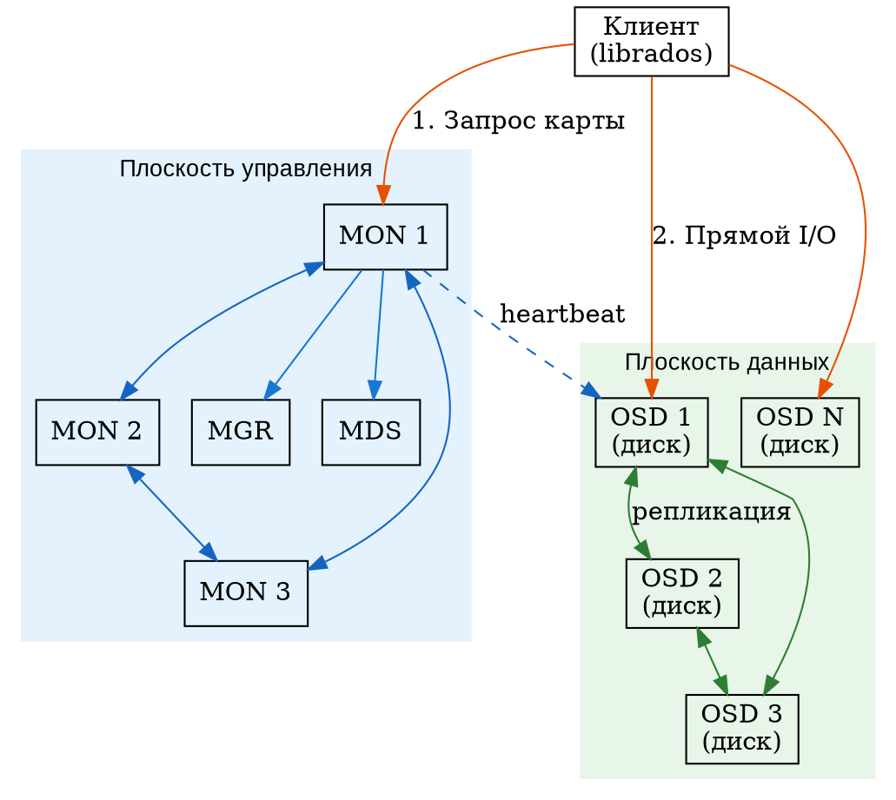
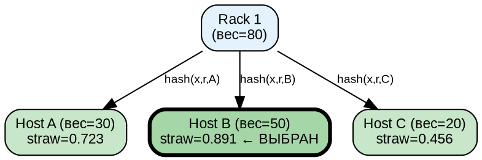
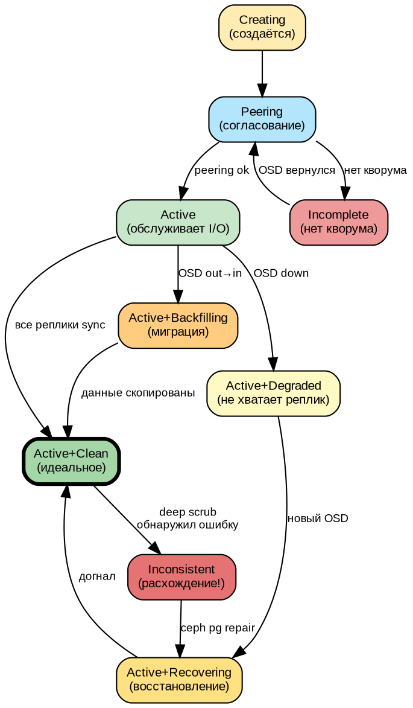
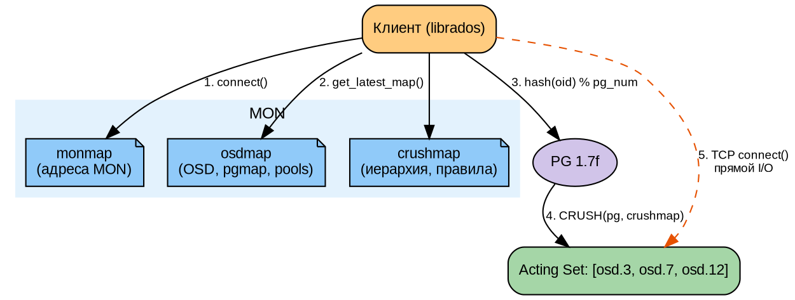
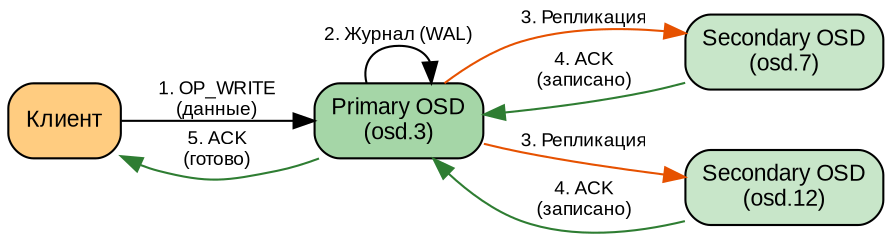
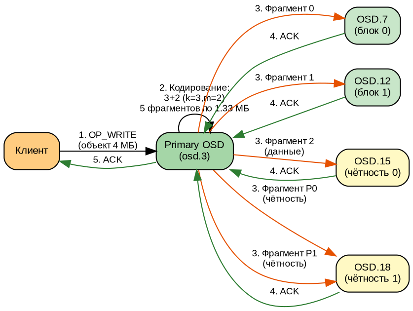
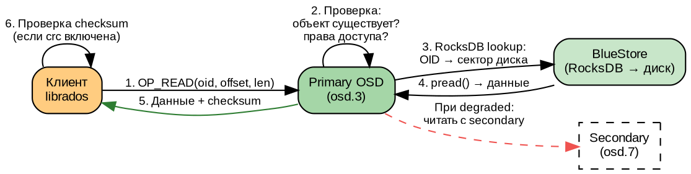

# Часть II. Архитектура Ceph *(70 стр.)*

> **Цель:** разобрать внутреннее устройство Ceph до уровня «могу нарисовать на доске и объяснить каждую стрелку».
> **После этой части вы сможете:** рассказать, как RADOS хранит объекты, как CRUSH вычисляет размещение без центральной таблицы, и проследить путь клиентского запроса от приложения до диска.

---

### 3.8. MSGR-протокол: как компоненты Ceph общаются друг с другом

Все компоненты Ceph (клиенты, MON, OSD, MGR, MDS) общаются через протокол **MSGR (Messenger)**. Это асинхронный, событийно-ориентированный слой, работающий поверх TCP.

#### MSGR v1 vs v2

Ceph поддерживает две версии протокола:

| Версия | Порт | Шифрование | Сжатие | Статус |
|--------|------|-----------|--------|--------|
| **MSGR v1** | 6789 (MON), 6800+ (OSD) | Нет | Нет | Устаревший |
| **MSGR v2** | 3300 (MON), 6800+ (OSD) | AES-128-GCM (TLS-подобный) | Да (zlib, snappy) | Рекомендуемый (Nautilus+) |

**MSGR v2** появился в Nautilus (v14, 2019) и решает ключевые проблемы v1:
- **Шифрование на проводе:** все данные между компонентами шифруются (защита от перехвата)
- **Аутентификация при подключении:** cephx (взаимная аутентификация)
- **Сжатие:** уменьшает сетевой трафик на 30-50%

```bash
# Проверить, какой протокол используют MON'ы
ceph mon dump | grep -E "v1|v2"
# v2:10.0.1.10:3300/0 — используется v2

# Настроить принудительно v2
ceph config set mon ms_bind_msgr2 true
ceph config set mon ms_bind_msgr1 false
```

#### Устройство MSGR

MSGR работает как event loop (цикл событий):

```
[Приложение] → [MSGR::send_message(msg)] → [Очередь отправки]
                                                  ↓
[Сетевой поток] ← [TCP socket] ← [Асинхронный ввод-вывод (epoll)]
       ↓
[MSGR::Dispatch] → [Приложение] (вызов колбэка при получении сообщения)
```

**Типы сообщений:**
| Тип | Номер | Назначение |
|-----|-------|------------|
| `MOSDOp` | 42 | Операция с объектом (чтение/запись) |
| `MOSDPGNotify` | 50 | Уведомление о состоянии PG |
| `MOSDPGLog` | 53 | Пересылка PG Log при peering |
| `MOSDRepScrub` | 58 | Сообщение scrubbing |
| `MOSDBeacon` | 73 | Heartbeat между OSD |
| `MPing` | 93 | Проверка связности |

**Практическая отладка MSGR:**
```bash
# Включить отладку messenger на OSD
ceph daemon osd.3 config set debug_ms 5

# Посмотреть активные соединения OSD
ceph daemon osd.3 dump_historic_ops

# Дамп всех подключений
ceph daemon osd.3 ops
```

---

## Глава 3. RADOS — фундамент *(24 стр.)*

### 3.1. Reliable Autonomic Distributed Object Store: разбор каждого слова *(3 стр.)*

**RADOS** — это не просто аббревиатура; каждое слово раскрывает ключевое архитектурное решение Ceph. Разберём по порядку.

**Object Store (объектное хранилище).** RADOS хранит данные в виде **объектов** — фундаментальной единицы хранения. Объект — это не файл и не блок:

- **Файл** — последовательность байтов, организованная в иерархию каталогов, с метаданными (имя, размер, дата, владелец). Файловая система сама решает, в какие физические блоки диска записать файл.
- **Блок** — фиксированный участок диска (обычно 512 байт или 4 килобайта), минимальная единица чтения/записи для блочного устройства. Никакой семантики: просто сектор.
- **Объект** — «плоский» набор данных (без иерархии каталогов), идентифицируемый уникальным именем (OID — Object ID). Объект может содержать произвольные данные, плюс метаданные (xattrs — extended attributes, расширенные атрибуты) и OMAPA (object map — key-value store внутри объекта).

```
Файл:    /home/user/photo.jpg  → ОС знает путь, имя, размер
Блок:    /dev/sda, сектор 42   → просто 512 байт
Объект:  oid=abc123def          → данные + атрибуты + key-value хранилище
```

В Ceph объект идентифицируется по OID (object ID — уникальный идентификатор), а не по пути в файловой системе. Все объекты лежат «плоским списком» внутри **пула** (pool) — логического раздела, аналогичного разделу диска. Клиент говорит: «дай мне объект X из пула Y».

**Distributed (распределённый).** Объекты не хранятся на одном сервере. Они **распределены** между OSD (Object Storage Daemon — демонами хранения объектов) на разных физических узлах. Нет «главного OSD» или «центрального сервера метаданных для объектов» (MDS обслуживает только CephFS, не объекты RADOS!). Каждый OSD равноправен: любой может принять запрос от клиента.

**Autonomic (автономный, самоуправляемый).** RADOS сам решает, что делать при отказе диска, сервера или сети — без администратора:

- Заметил, что OSD упал? Помечает его `down`.
- Прошло 10 минут (`mon_osd_down_out_interval`)? Помечает `out` и запускает перераспределение данных (recovery/backfill).
- Появился новый OSD? Автоматически начинает миграцию части данных на него (балансировка).

**Reliable (надёжный).** Данные защищены репликацией или erasure coding. По умолчанию каждый объект хранится в 3 экземплярах на разных OSD (и, благодаря CRUSH, на разных серверах, в разных стойках — при правильной настройке). Отказ одного или даже двух дисков не приводит к потере данных.

#### Объектная модель RADOS — глубже

Каждый объект в RADOS имеет несколько ключевых атрибутов, которые стоит понимать для отладки и эксплуатации:

| Атрибут | Назначение | Пример |
|---------|-----------|--------|
| **OID (Object ID)** | Уникальное имя объекта в пуле | `rbd_data.abc123.0000000000000001` |
| **Pool** | Логический раздел, изолирует объекты | `rbd`, `cephfs_data`, `.rgw.buckets.index` |
| **Namespace** | Дополнительный уровень изоляции внутри пула | `domain1`, `tenant-42` |
| **Locator (key)** | Ключ для CRUSH (по умолчанию = OID) | Можно задать вручную для группировки объектов |
| **XATTRs** | Расширенные атрибуты (метаданные) | `user.rbd.id`, `user.rbd.snap` |
| **OMAP** | Key-value хранилище внутри объекта | Индексы RGW-бакетов, метаданные RBD-образов |

**Namespace — изоляция без пулов.** Namespace позволяет нескольким приложениям использовать один пул, не конфликтуя по именам объектов. Например, RGW создаёт namespace для каждого tenant'а:

```bash
# Создать объект в конкретном namespace
rados -p mypool -N tenant-42 put report.txt /tmp/report.txt

# Объект tenant-42/report.txt не пересекается с default/report.txt
rados -p mypool ls                    # объекты в namespace по умолчанию
rados -p mypool -N tenant-42 ls      # объекты в tenant-42
```

**Locator — управление размещением.** По умолчанию CRUSH вычисляет PG по хешу OID. Но если задать locator явно, несколько объектов с разными OID можно «склеить» в одну PG (и, следовательно, на одни OSD). Это используется в RGW для группировки объектов одного бакета:

```python
# Python librados: задать locator
ioctx.set_locator("bucket-index-locator")
ioctx.write_full("obj1", data1)
ioctx.write_full("obj2", data2)
# obj1 и obj2 физически окажутся в одной PG и на одних OSD
```

#### Модель согласованности RADOS

RADOS обеспечивает **строгую согласованность** (strong consistency) для операций с одним объектом:

- **Чтение после записи:** если клиент A записал объект и получил ACK, клиент B при чтении гарантированно увидит новую версию (нет «stale read»)
- **Атомарность:** запись объекта либо полностью выполнена, либо полностью отвергнута — нет частично записанных объектов
- **Изоляция на уровне объекта:** две параллельные записи в один объект сериализуются (primary OSD обрабатывает их последовательно)

Это достигается тем, что все операции с объектом проходят через primary OSD, который координирует репликацию (подробно разобрано в §5.3).

---

### 3.2. MON (Monitor): мозг кластера *(5 стр.)*

#### Что хранит MON

**MON (Monitor — «наблюдатель»)** хранит **карту кластера** (cluster map) — совокупность всех метаданных, описывающих состояние кластера. Без MON клиент не знал бы, к каким OSD обращаться.

Cluster map включает (каждая «подкарта» имеет номер версии — эпоху):

| Подкарта | Содержание | Что в ней |
|----------|-----------|-----------|
| **monmap** | Карта MON-серверов | FSID кластера, имена/адреса всех MON, возраст (epoch) |
| **osdmap** | Карта OSD | Список всех OSD (id, состояние up/down, in/out), веса, пулы, параметры |
| **pgmap** | Карта Placement Groups | Состояние PG (active, clean, degraded…), статистика использования |
| **mdsmap** | Карта MDS | Список серверов метаданных CephFS, ранги, состояние |
| **crushmap** | Карта CRUSH | Иерархия устройств и правила размещения данных |

> **Важно:** MON хранит метаданные (карты, состояние), но **не хранит сами данные**. Данные хранят OSD. MON — это «мозг», OSD — «руки».

#### Кворум и нечётное количество

MON-ы принимают решения коллективно, через алгоритм консенсуса (согласования) Paxos. Чтобы принять решение, нужно **большинство голосов** (кворум).

**Почему нечётное количество:**
- 3 MON: кворум = 2 (способен пережить отказ 1 MON)
- 5 MON: кворум = 3 (способен пережить отказ 2 MON)
- 2 MON: кворум = 2 (отказ любого MON — потеря кворума, кластер недоступен!)

Формула кворума: `большинство = ⌊N/2⌋ + 1`

| MON-ов | Кворум | Выдерживает отказ |
|--------|--------|------------------|
| 1 | 1 | 0 (деградация) |
| 3 | 2 | 1 |
| 5 | 3 | 2 |
| 7 | 4 | 3 |

#### Paxos — упрощённо

Алгоритм Paxos — это способ, которым несколько серверов (MON) приходят к единому решению, даже если часть из них временно недоступна. Упрощённая модель:

1. **Лидер** (leader) — один из MON, выбранный на роль координатора. Только он может предлагать изменения.
2. **Предложение (propose):** лидер предлагает изменение («OSD 5 теперь up»).
3. **Голосование (accept):** каждый MON принимает или отклоняет предложение.
4. **Кворум (commit):** если большинство приняло — изменение фиксируется, увеличивается эпоха карты.

```
[MON 1 — лидер] ──propose──→ [MON 2] ←──accept──
                              [MON 3] ←──accept── → КВОРУМ! Epoch N+1
```

Если лидер падает — оставшиеся MON выбирают нового лидера (фаза leader election).

#### Paxos — детальный разбор фаз

Paxos — не просто «предложил-приняли». Протокол работает в трёх фазах для **каждого** изменения карты. Разберём их на примере: OSD.42 только что поднялся, и MON должен зафиксировать его состояние `up`.

**Фаза 1: Prepare (подготовка)**
```
Лидер (MON.A) рассылает Prepare(N) всем MON:
  «Предлагаю начать раунд N для изменения osdmap epoch 10500 → 10501»

Каждый MON (включая лидера) отвечает Promise:
  «Обещаю: не принимаю предложения с номером < N.
   Кстати, я уже принял предложение M в прошлом раунде (если было).»
```

Номер раунда N должен быть **строго больше** всех ранее использованных номеров. Обычно это монотонно возрастающий счётчик (epoch + номер попытки).

**Фаза 2: Accept (принятие)**
```
Лидер, получив Promise от КВОРУМА, рассылает Accept(N, value):
  «Раунд N: принимаем значение {osdmap epoch 10501: OSD.42 up}»

Каждый MON записывает предложение в локальный журнал (WAL) и отвечает Accepted:
  «Записал. Согласен.»
```

**Фаза 3: Commit (фиксация)**
```
Лидер, получив Accepted от кворума, рассылает Commit(N):
  «Раунд N завершён. Все применяют изменение.»

Каждый MON обновляет свою копию osdmap в памяти и на диске.
Epoch увеличивается: 10500 → 10501.
```

**Почему журнал (WAL) критичен:** MON пишет предложение в RocksDB-журнал ДО ответа `Accepted`. Если MON упадёт после `Accepted`, но до `Commit`, при восстановлении он «вспомнит», что уже принял предложение N, и завершит фиксацию.

#### MON DB: что внутри

Каждый MON хранит своё состояние в RocksDB (ключ-значение БД) на локальном диске. Типичный путь: `/var/lib/ceph/mon/ceph-<hostname>/store.db/`. Внутри — несколько column families (аналоги таблиц):

| Column Family | Содержание |
|---------------|-----------|
| `default` | Основные ключи кластера (fsid, имя, глобальные настройки) |
| `logm` | Paxos-лог: все предложения и их статус (prepare/accepted/committed) |
| `monmap` | История версий monmap |
| `osdmap` | История версий osdmap (full + incremental) |
| `pgmap` | Текущее состояние PG |
| `mdsmap` | История версий mdsmap |
| `auth` | Ключи аутентификации (cephx) |
| `config` | Конфигурационные параметры кластера |

**Размер MON DB:** в больших кластерах (тысячи OSD, миллионы PG) MON DB может достигать десятков гигабайт, в основном из-за хранения истории osdmap (full-версии + инкрементальные). Рекомендуется размещать `/var/lib/ceph/mon/` на SSD для быстрой работы Paxos.

#### Практический разбор: восстановление MON после сбоя

Предположим, MON.B упал на 2 часа, а кластер продолжал работать. Что происходит при его возвращении:

```bash
# 1. MON.B стартует, подключается к остальным MON
# 2. Обнаруживает, что его osdmap отстал (epoch у него 9500, у лидера 10500)
# 3. Запрашивает инкрементальные обновления:
#    «Пришли мне osdmap с 9501 по 10500»
# 4. Лидер отправляет 1000 инкрементальных обновлений
# 5. MON.B применяет их, синхронизируется
# 6. Входит в кворум
```

Этот механизм называется **sync** — и он позволяет MON нагонять кластер без полной перезагрузки всех данных.

Команда для проверки синхронизации:
```bash
ceph mon stat
# e3: 3 mons at {...}, election epoch 42, leader 0 mon1, quorum 0,1,2
# Если MON не в кворуме — он в состоянии synchronizing или probing
```

#### MONы и сеть: clock skew

MON чувствительны к расхождению часов. Если часы на разных MON расходятся более чем на `mon_clock_drift_allowed` (по умолчанию 0.05 секунд), MON выдаст HEALTH_WARN. Решение: настроить NTP/chrony на всех узлах:

```bash
# Проверить синхронизацию времени
ceph time-sync-status
# или
ceph health detail | grep clock
```

#### Практические команды

```bash
# Состояние MON
ceph mon stat
# Вывод: e3: 3 mons at {mon1=10.0.1.10:6789,mon2=10.0.1.11:6789,mon3=10.0.1.12:6789},
#        election epoch 42, leader 0 mon1, quorum 0,1,2

# Детальный дамп monmap
ceph mon dump
# Показывает fsid, эпохи, адреса всех MON
```

---

### 3.3. OSD (Object Storage Daemon): рабочие руки *(5 стр.)*

#### Функция OSD

OSD — это процесс, который работает на каждом диске в кластере. **Один OSD = один диск** (или раздел, или LVM-том). Именно OSD:

- Хранит объекты RADOS на диске
- Обслуживает запросы клиентов (чтение/запись объектов)
- Реплицирует данные между собой (отправляет копии на другие OSD)
- Восстанавливает данные после отказов (backfill, recovery)
- Проверяет целостность данных (scrubbing)

#### BlueStore: что внутри

С версии Luminous (v12, 2017) Ceph использует **BlueStore** — движок хранения, который пишет данные напрямую на блочное устройство, минуя файловую систему. Это даёт прирост производительности в 2–3 раза по сравнению с предшественником FileStore.

**Структура BlueStore (снизу вверх):**

```
Объекты RADOS (пользовательские данные)
        ↓
[BlueStore — движок хранения]
        ↓
  ┌──────────────────────────┐
  │ RocksDB                  │ ← key-value БД для метаданных объектов (OID → расположение на диске)
  │  (метаданные)            │
  └──────────┬───────────────┘
             │
  ┌──────────┴───────────────┐
  │ BlueFS                   │ ← мини-файловая система для RocksDB
  │  (мелкие файлы БД)       │
  └──────────┬───────────────┘
             │
  ┌──────────┴───────────────┐
  │ BlockDevice              │ ← raw-доступ к диску (никакой XFS/ext4!)
  │  (сырой раздел)          │
  └──────────────────────────┘
```

**Почему так сложно?** RocksDB (встраиваемая key-value база данных от Facebook) хранит метаданные объектов: «объект X начинается с сектора 100500, длина 4 МБ». Сами данные объекта лежат на сыром разделе. RocksDB требует файловую систему для своих файлов — но это не полноценная ext4/XFS, а микроскопическая BlueFS, оптимизированная только для RocksDB.

#### WAL и DB

BlueStore использует два вспомогательных раздела (опционально, для ускорения):

- **WAL (Write-Ahead Log — «журнал предзаписи»).** Прежде чем записать данные в основное хранилище, OSD пишет их в WAL. Если OSD упадёт во время записи — данные не потеряются, их можно восстановить из WAL. На HDD WAL лучше разместить на быстром NVMe-разделе.
- **DB (база данных RocksDB).** Хранит метаданные. Если разместить на быстром NVMe, поиск объектов ускоряется в 10–50 раз по сравнению с хранением DB на том же медленном HDD.

```
Медленный HDD 20 ТБ          Быстрый NVMe 512 ГБ
┌──────────────────┐        ┌──────────────────┐
│ Данные объектов   │        │ WAL (2 ГБ)       │ ← журнал
│ (18 ТБ)           │        │ DB (30 ГБ)       │ ← метаданные
└──────────────────┘        └──────────────────┘
```

Такая конфигурация (WAL+DB на NVMe, данные на HDD) даёт производительность, близкую к SSD, при стоимости HDD.

#### BlueStore: устройство аллокатора и метаданных

**Аллокаторы свободного места.** BlueStore должен быстро находить свободные блоки на диске. Поддерживаются два аллокатора:

| Аллокатор | Алгоритм | Применение |
|-----------|----------|------------|
| **Stupid** | Простой битовый массив + линейный поиск | Малые диски, отладка |
| **Bitmap** | Иерархический битовый массив (дерево битовых карт) | По умолчанию для всех |
| **Hybrid** | Bitmap для больших блоков + AVL-дерево для мелких | Экспериментальный |
| **Avl** | AVL-дерево свободных экстентов | Альтернатива bitmap |

Выбор аллокатора:
```bash
ceph config set osd bluestore_allocator bitmap   # или stupid, hybrid, avl
```

**Фрагментация.** При длительной работе BlueStore диск фрагментируется (свободное место разбивается на мелкие куски). Периодически OSD дефрагментирует данные. Контролировать:

```bash
# Запросить статистику фрагментации OSD
ceph daemon osd.3 bluestore allocator dump

# Принудительная дефрагментация
ceph daemon osd.3 compact
```

#### RocksDB внутри BlueStore: схема ключей

RocksDB (внутри BlueStore) хранит отображение «логический адрес объекта» → «физическое расположение на диске»:

```
Ключ:   PREFIX + OID + offset
Значение: PREFIX + физический_экстент (смещение + длина)

где PREFIX:
  'O' = object metadata (владелец, размер, атрибуты)
  'L' = lextent (логический экстент = кусок объекта)
  'B' = blob (физический блок данных)
  'P' = pextent (физический экстент на диске)
  'S' = shared blob (разделяемый блок — для снапшотов/клонов)
```

**Пример поиска:** клиент хочет прочитать объект `rbd_data.abc.00001`, байты 4096-8191:

1. RocksDB: `GET 'O' + 'rbd_data.abc.00001'` → узнаём размер, атрибуты
2. RocksDB: `SEEK 'L' + 'rbd_data.abc.00001' + 0x00001000` → находим логический экстент
3. RocksDB: разыменовываем blob → получаем физический экстент (сектор на диске)
4. Читаем данные с диска через `pread()`

#### BlueStore: compression (сжатие)

BlueStore поддерживает прозрачное сжатие данных на лету:

```bash
# Включить сжатие для пула (агрессивное)
ceph osd pool set mypool compression_algorithm snappy
ceph osd pool set mypool compression_mode aggressive

# Режимы сжатия:
# none       - не сжимать
# passive    - сжимать, только если данные уже сжаты клиентом
# aggressive - сжимать все данные
# force      - сжимать даже если невыгодно
```

Поддерживаемые алгоритмы: `snappy`, `zlib`, `zstd`, `lz4`. Zstd даёт наилучшее соотношение скорость/степень сжатия. Сжатие снижает нагрузку на WAL и уменьшает занимаемое место на 30–60% (зависит от данных).

#### Практическая отладка BlueStore

```bash
# Посмотреть использование пространства OSD
ceph daemon osd.3 bluestore bluefs available

# Статистика кеша RocksDB
ceph daemon osd.3 perf dump | grep -E "bluestore.*(submit|lat|read|write)"

# Ручная проверка целостности BlueStore
ceph-bluestore-tool fsck --path /var/lib/ceph/osd/ceph-3

# Дамп метаданных объекта (требует остановки OSD!)
ceph-bluestore-tool show-object --path /var/lib/ceph/osd/ceph-3 \
  --object oid_string
```

---

### 3.4. MDS (Metadata Server): файловая система *(3 стр.)*

**MDS (Metadata Server — «сервер метаданных»)** обслуживает **только CephFS**, но не RBD и не RGW. Его задача — хранить иерархию файловой системы (каталоги, имена файлов, права доступа, временные метки).

**Как MDS работает:**
```
Пользователь:  открыть /home/user/report.txt
                    ↓
Клиент CephFS → MDS: «где лежит inode файла report.txt?»
                    ↓
MDS: «inode 0x10000000abc, смотри в пуле cephfs_data, объект 0x...»
                    ↓
Клиент → OSD: «дай объект 0x... из пула cephfs_data»
```

MDS хранит **только метаданные** (дерево каталогов, атрибуты файлов). Сами данные файлов лежат как объекты RADOS в пулах `cephfs_data`. Это разделение позволяет:
- Масштабировать метаданные и данные независимо
- Не терять производительность операций с метаданными при большом объёме данных

**Журнал MDS:** все изменения сначала записываются в журнал. При падении MDS журнал воспроизводится (replay) — и файловая система восстанавливает согласованное состояние. Standby MDS обеспечивает горячий резерв: если активный MDS упал, standby занимает его место за секунды.

#### MDS: ранги и subtree partitioning

CephFS поддерживает **несколько активных MDS** для масштабирования метаданных. Каждый активный MDS получает **ранг (rank)** — логический номер 0, 1, 2… Ранг определяет, за какую часть дерева каталогов отвечает MDS.

**Subtree partitioning (секционирование поддеревьев):** дерево каталогов CephFS делится на эпохи (auth pins). Каждый rank отвечает за свой набор поддеревьев:

```
Ранг 0:  /home, /var, /etc
Ранг 1:  /data/project_a, /data/project_b
Ранг 2:  /backup, /archive
```

Экспорт/импорт поддеревьев между рангами происходит динамически:
- MDS rank 0 перегружен? Экспортирует `/var` на rank 1
- rank 2 упал? Его поддеревья переезжают на rank 0 (failover)

```bash
# Посмотреть ранги и статус
ceph mds stat
# e45: cephfs:1 {0=cephfs.host1=up:active,1=cephfs.host2=up:active} 2 up:standby

# Детальная информация по рангу
ceph tell mds.cephfs:0 status
```

#### MDS: журнал (MDLog) и сегменты

Журнал MDS (MDLog) — это циклический лог всех операций с метаданными. Ключевые понятия:

- **Сегмент (segment):** непрерывный участок журнала (~100 МБ), хранится как объект RADOS в пуле метаданных
- **Anchor table:** индексы объектов в бэкенде (какой объект RADOS содержит какие метаданные)
- **Journal trim:** периодическая очистка старых сегментов (похоже на контрольную точку в БД)

При падении MDS:
1. Standby MDS читает последний сегмент журнала
2. Воспроизводит операции (replay)
3. Перестраивает in-memory кеш метаданных
4. Занимает место упавшего ранга

Время восстановления зависит от размера журнала: обычно 5–30 секунд для журнала в 100 МБ при активной работе.

#### MDS: практические настройки

```bash
# Увеличить лимит памяти для кеша MDS (по умолчанию 1G)
ceph config set mds mds_cache_memory_limit 4294967296  # 4 GB

# Посмотреть использование кеша
ceph daemon mds.cephfs.host1 cache status

# Сбросить кеш MDS (осторожно — временное замедление)
ceph tell mds.cephfs:0 cache drop

# Добавить standby MDS с привязкой к конкретной FS
ceph mds standby add cephfs:host3
```

---

### 3.5. MGR (Manager): панель управления *(3 стр.)*

**MGR (Manager — «менеджер»)** появился в версии Kraken (v11, 2017). До этого мониторинг и управление были размазаны между MON, что создавало нагрузку. MGR берёт на себя:

- **Сбор метрик** со всех OSD, MON, MDS, RGW
- **Модули:** балансировщик (balancer), autoscaler PG, Prometheus-экспортёр, Ceph Dashboard, Zabbix-интеграция
- **Веб-интерфейс (Dashboard):** графики, статус, управление кластером

**Ключевые модули MGR:**

| Модуль | Назначение |
|--------|-----------|
| `prometheus` | Отдаёт метрики в формате Prometheus |
| `dashboard` | Веб-интерфейс управления кластером |
| `balancer` | Автоматическая балансировка PG по OSD |
| `pg_autoscaler` | Автоматическая настройка количества PG |
| `snap_schedule` | Расписание снапшотов CephFS |
| `nfs` | Управление NFS-Ganesha экспортами |

MGR не хранит данные и не участвует в критическом пути ввода-вывода. Его отказ не останавливает кластер — теряется только мониторинг и Dashboard до восстановления.

#### MGR модули — подробно

**Balancer (балансировщик).** Автоматически перемещает PG между OSD для равномерного распределения данных. Включается командой:

```bash
ceph mgr module enable balancer
ceph balancer on
ceph balancer mode upmap   # upmap — самый эффективный режим (перемещает отдельные PG)
```

Режимы balancer:
| Режим | Описание | Перемещение данных |
|-------|----------|-------------------|
| `upmap` | Индивидуальные PG-маппинги (Nautilus+) | Минимальное |
| `crush-compat` | Изменяет веса CRUSH-устройств | Умеренное |
| `none` | Выключен | — |

**Prometheus-экспортёр.** Отдаёт метрики кластера для сбора системами мониторинга:

```bash
ceph mgr module enable prometheus
# Метрики доступны на http://<mgr-host>:9283/metrics
```

Ключевые метрики (более 500 параметров):
- `ceph_osd_op_w_total` — количество записей на OSD
- `ceph_osd_op_r_latency_sum` — суммарная задержка чтения
- `ceph_pg_total` — распределение PG по состояниям
- `ceph_health_status` — текущий статус здоровья (0=OK, 1=WARN, 2=ERR)

**PG Autoscaler.** Автоматически корректирует `pg_num` для пулов:

```bash
ceph mgr module enable pg_autoscaler
# Посмотреть рекомендации
ceph osd pool autoscale-status
# Вывод: POOL  SIZE  TARGET SIZE  RATE  RAW CAPACITY  RATIO  TARGET RATIO  PG_NUM  NEW PG_NUM  AUTOSCALE
```

Autoscaler использует формулу: `pg_num = (pool_bytes / total_capacity_bytes) * pg_target_total`, где `pg_target_total = OSD_count * 100`.

**Dashboard.** Веб-интерфейс управления кластером (Nautilus+):

```bash
ceph mgr module enable dashboard
ceph dashboard create-self-signed-cert
ceph dashboard set-login-credentials admin <password>
# Доступ: https://<mgr-host>:8443
```

Возможности Dashboard: просмотр статуса кластера, управление OSD/пулами, графики производительности, управление RBD-образами, CephFS-снапшотами, NFS-экспортами, создание RGW-пользователей.

**Другие полезные модули:**
| Модуль | Назначение |
|--------|-----------|
| `restful` | REST API для управления кластером |
| `zabbix` | Интеграция с Zabbix-мониторингом |
| `influx` | Отправка метрик в InfluxDB |
| `telemetry` | Анонимная статистика использования (отправляется в Ceph community) |
| `iostat` | Аналог `iostat` для всего кластера |
| `volumes` | Управление CephFS-снапшотами (команды уровня `ceph fs volume`) |

```bash
# Посмотреть все модули и их статус
ceph mgr module ls

# Пример: iostat — статистика по всем OSD
ceph iostat
#      osd.0   osd.1   osd.2   osd.3   osd.4   osd.5   osd.6   osd.7
# Read   45      32      0       67      12      0       0       0
# Write  120     98      0       201     45      0       0       0
```

---

### 3.9. Производительность и тюнинг OSD

#### Ключевые параметры производительности

Производительность OSD зависит от нескольких слоёв, и каждый имеет свои «ручки» настройки:

**Уровень ОС (Linux):**
```bash
# Планировщик ввода-вывода: mq-deadline для HDD, none (NVMe) для SSD
echo mq-deadline > /sys/block/sdb/queue/scheduler

# Увеличение очереди запросов
echo 1024 > /sys/block/sdb/queue/nr_requests

# Отключение кеширования записи для надёжности (HDD)
hdparm -W0 /dev/sdb  # ОСТОРОЖНО: снижает производительность!
```

**Уровень BlueStore:**
```bash
# Кеш BlueStore (размер по умолчанию зависит от типа диска)
ceph config set osd bluestore_cache_size_hdd 1073741824   # 1 ГБ
ceph config set osd bluestore_cache_size_ssd 4294967296   # 4 ГБ

# Размер кеша RocksDB
ceph config set osd bluestore_rocksdb_options \
    "max_background_jobs=4,compaction_readahead_size=2097152"

# Минимальный размер аллокации (по умолчанию 64K для HDD, 16K для SSD)
ceph config set osd bluestore_min_alloc_size_hdd 65536
ceph config set osd bluestore_min_alloc_size_ssd 16384
```

**Уровень OSD:**
```bash
# Количество потоков OSD (по умолчанию 2)
ceph config set osd osd_op_num_threads_per_shard 4

# Очередь операций (по умолчанию 100)
ceph config set osd osd_op_queue_cut_off high

# Максимальное число одновременных операций
ceph config set osd osd_max_write_size 100
```

#### Мониторинг производительности OSD

```bash
# Детальная статистика операций OSD
ceph daemon osd.3 perf dump | jq '.osd.op_w, .osd.op_r, .osd.op_latency'

# iostat-статистика внутри OSD (без внешних инструментов!)
ceph iostat
# Показывает IOPS на каждом OSD в реальном времени

# Гистограмма задержек OSD
ceph daemon osd.3 perf histogram schema
ceph daemon osd.3 perf histogram dump osd_op_latency

# Статистика использования процессора OSD
ceph daemon osd.3 perf dump | jq '.osd'

# Проверка, не «тормозит» ли OSD на медленных операциях
ceph daemon osd.3 dump_historic_slow_ops
```

#### Типичные проблемы производительности

| Симптом | Возможная причина | Решение |
|---------|------------------|---------|
| Высокая задержка записи (>100ms) | WAL на медленном диске | Перенести WAL на NVMe |
| Высокая задержка чтения (>50ms) | RocksDB на HDD | Перенести DB на NVMe |
| OSD «флушит» (flapping — частые перезапуски) | OOM (out of memory) | Увеличить RAM на узле |
| PG stuck peering | Проблема сети между OSD | Проверить MTU, firewall |
| Slow ops (>30 сек) | Проблемный диск | Проверить SMART, заменить |
| Высокая утилизация CPU | Сжатие (compression) | Сменить алгоритм на snappy/lz4 |

#### Оптимизация сети для Ceph

Ceph требует минимум 10GbE для production-нагрузки. Рекомендации:

```
Рекомендуемая топология:
  ┌─────────────────────────────────────┐
  │ public_network (front): 10.0.1.0/24 │ ← клиенты ↔ OSD/MON
  │ cluster_network (back): 10.0.2.0/24 │ ← OSD ↔ OSD (репликация)
  └─────────────────────────────────────┘
```

```bash
# Настройка раздельных сетей
[global]
public_network = 10.0.1.0/24
cluster_network = 10.0.2.0/24

# Jumbo frames (MTU 9000) для уменьшения накладных расходов TCP
ip link set eth0 mtu 9000

# Проверка связности между OSD
ceph tell 'osd.*' version  # все ли отвечают?
```

**Почему cluster_network отдельно:** репликация и recovery могут забить клиентскую сеть трафиком. Разделение гарантирует: клиентский I/O не страдает от внутреннего трафика кластера.

---

### 3.6. Взаимодействие компонентов *(3 стр.)*



**Ключевые потоки:**

1. **Плоскость управления (control plane):** MON ↔ MON (Paxos), MON → OSD (heartbeat — проверка живости), MON → MGR/MDS (конфигурация).
2. **Плоскость данных (data plane):** Клиент → OSD (прямой I/O), OSD ↔ OSD (репликация, recovery, backfill).

**Важнейшее свойство Ceph:** клиент **не ходит через MON за данными**. MON нужен только чтобы получить карту кластера. После этого клиент общается с OSD напрямую. Нет центрального прокси, нет бутылочного горлышка.

#### OSD heartbeat и обнаружение отказов

Как кластер узнаёт, что OSD упал? Механизм **heartbeat (пульс/сердцебиение):**

**1. Прямые heartbeat'ы между OSD:**
- Каждый OSD периодически (раз в 2 сек) отправляет heartbeat соседям (тем, с кем делит PG)
- Если OSD не получает ответ 20 сек (`osd_heartbeat_grace`) — помечает соседа `down`
- Heartbeat идёт по **двум каналам**: front-сеть (клиентская) и back-сеть (репликация/cluster). Падение одной сети не должно вызывать ложное срабатывание

**2. Отчёт MON'ам:**
- OSD сообщает MON'у об упавших соседях
- MON собирает отчёты от нескольких OSD
- Если кворум OSD подтверждает `down` → MON фиксирует в osdmap

**3. Таймер `mon_osd_down_out_interval` (по умолчанию 600 сек):**
- Если OSD `down` дольше этого интервала → MON помечает его `out` (исключён из acting set)
- CRUSH перерасчитывает размещение PG
- Запускается **backfill** — миграция данных на другие OSD

```bash
# Проверить heartbeat соседей OSD
ceph daemon osd.3 status | grep heartbeat

# Посмотреть, какие OSD считаются down
ceph osd down
```

**Важное различие State OSD:**
| Состояние | Значение | Действие кластера |
|-----------|----------|------------------|
| `up` + `in` | Норма | Обслуживает запросы |
| `up` + `out` | Администратор исключил | Данные мигрируют с OSD |
| `down` + `in` | Временно упал | Ждём (до `mon_osd_down_out_interval`) |
| `down` + `out` | Упал надолго | Запущен backfill на другие OSD |

#### Практический разбор: полный цикл OSD

```bash
# 1. Вывести OSD с детальным статусом
ceph osd dump | grep "^osd\."

# 2. Принудительно пометить OSD down (для теста)
ceph osd down osd.5

# 3. Смотреть, как меняется состояние PG
watch -n 2 'ceph pg stat'

# 4. Вернуть OSD
ceph osd up osd.5

# 5. Посмотреть историю изменений osdmap
ceph osd dump 100 105  # эпохи со 100 по 105
```

---

### 3.7. Практикум: «собери RADOS» *(2 стр.)*

На работающем кластере (лабораторный стенд `ceph-ha-lab`) выполните:

```bash
# 1. Общее состояние
ceph status

# 2. Дерево OSD — кто где, статус, вес
ceph osd tree

# 3. Состояние MON — кворум, лидер
ceph mon stat

# 4. Дамп monmap — эпохи, адреса
ceph mon dump

# 5. Активные MGR
ceph mgr stat

# 6. Активные MDS
ceph mds stat
```

**Задание:** на листе бумаги (или в draw.io) нарисуйте схему своего кластера:
- Узлы (прямоугольники)
- MON, MGR, MDS на соответствующих узлах
- OSD на узлах (сколько на каждом)
- Стрелки: MON ↔ MON, MON → OSD, клиент → OSD

Сравните с DOT-схемой из §3.6. Найдите соответствие каждой стрелки.

#### Практический кейс: OSD failover — пошаговый разбор

Разберём полный сценарий отказа OSD на основе всех изученных компонентов.

**Исходное состояние:**
```
Кластер: 3 MON, 1 MGR, 12 OSD (4 узла × 3 диска)
Пул: mypool, size=3, min_size=2, pg_num=128

OSD.5 на узле host2: up+in, обслуживает ~32 PG как primary/secondary
```

**t=0: OSD.5 падает (процесс убит, диск вышел из строя)**

```
Что происходит немедленно (0-2 сек):
- Клиенты, подключённые к OSD.5, получают разрыв TCP-соединения
- Клиенты переподключаются к другим OSD из acting set

Что происходит через 2-20 сек:
- Соседние OSD (heartbeat peers) замечают: OSD.5 не отвечает
- Несколько OSD сообщают MON: «OSD.5 не отвечает на heartbeat»
- MON получает кворум сообщений = OSD.5 down
- osdmap обновляется: OSD.5 = down+in
```

```bash
# Проверка состояния в этот момент (t=20):
ceph osd tree | grep osd.5
# 5  hdd 10.00000  host host2  down  # нет active!

ceph pg stat | grep -E "degraded|stale"
# 32 pgs: 96 active+clean, 32 active+degraded
# 32 PG потеряли одну реплику (OSD.5), но обслуживают I/O
```

**t=600 сек (10 мин): `mon_osd_down_out_interval` истекает**

```
- MON помечает OSD.5 = out
- CRUSH перерасчитывает размещение: для 32 PG, где OSD.5 был в acting set,
  назначается новый OSD
- osdmap epoch увеличивается (например, 15000 → 15001)

Для каждой из 32 PG:
  1. PG узнаёт новый acting set из osdmap
  2. Peering: новый OSD включается в acting set
  3. Состояние PG: active+degraded+backfilling
  4. Primary OSD начинает копировать данные на новый OSD (backfill)
  5. Когда backfill завершён: active+clean
```

```bash
# Проверка (t=610):
ceph pg stat
# 128 pgs: 96 active+clean, 32 active+clean+backfilling

# Следим за backfill:
ceph pg dump | grep backfilling | wc -l
# постепенно уменьшается: 32 → 25 → 18 → ...

# Через ~20 минут (зависит от данных):
ceph pg stat
# 128 pgs: 128 active+clean
# Кластер полностью восстановлен!
```

**Что происходит с клиентским I/O во время backfill:**

- Клиенты продолжают читать и писать — primary OSD обслуживает запросы
- Backfill идёт в фоне с пониженным приоритетом
- Если клиент пишет объект, который ещё не backfill'нут — primary пишет и на старый acting set (если живы), и на новый OSD
- После завершения backfill старый OSD исключается из acting set

#### Ключевые параметры для управления скоростью восстановления

```bash
# Максимальное количество одновременных backfill'ов на OSD
ceph config set osd osd_max_backfills 4

# Максимальное количество recovery операций на OSD
ceph config set osd osd_recovery_max_active 3

# Приоритет recovery относительно клиентского I/O (чем выше, тем быстрее recovery)
ceph config set osd osd_recovery_op_priority 5

# Ограничение на скорость recovery (МБ/с на OSD) — чтобы не забить сеть
ceph config set osd osd_recovery_max_chunk 8388608  # 8 МБ
ceph config set osd osd_recovery_sleep 0.1           # пауза между чанками

# Интервал перед пометкой OSD out (сек)
ceph config set mon mon_osd_down_out_interval 600
```

---

### Контрольные вопросы к Главе 3

1. **Объясните каждое слово аббревиатуры RADOS.** Почему Ceph выбрал объектную модель вместо файловой или блочной на уровне RADOS?

2. **Что произойдёт при потере кворума MON?** Опишите по шагам: как кластер обнаруживает проблему, что перестаёт работать, что продолжает работать, и как администратор восстанавливает кворум.

3. **Нарисуйте и объясните три фазы Paxos** для случая добавления нового OSD в кластер. Какие сообщения отправляются на каждом шаге? В какой момент изменение видно клиентам?

4. **Сравните FileStore и BlueStore.** Почему BlueStore быстрее? Какие компоненты BlueStore отвечают за метаданные, а какие — за данные? Где разместить WAL и DB для максимальной производительности на кластере с HDD + NVMe?

5. **Расшифруйте схему ключей RocksDB в BlueStore.** Дан OID `rbd_data.xyz.00002`, объясните, как BlueStore находит физическое расположение байтов 0–4095 этого объекта на диске.

6. **Зачем нужен MDS?** Почему нельзя хранить метаданные CephFS в том же пуле RADOS, что и данные? Какие проблемы это решило бы и какие создало бы?

7. **Опишите процесс восстановления MDS** после сбоя. Что такое replay? Что такое standby? Сколько времени занимает failover в типичной конфигурации?

8. **Перечислите 5 модулей MGR** и объясните, какую задачу каждый решает. Почему MGR был выделен в отдельный демон, а не оставлен внутри MON?

9. **Нарисуйте полную схему взаимодействия** компонентов Ceph (MON, MGR, MDS, OSD, клиент) с указанием протоколов на каждой стрелке. Какие стрелки работают через Paxos, какие через TCP/MSGR, какие через heartbeat?

10. **Что происходит при падении OSD?** Опишите временную шкалу: t=0 (падение), t=20 сек, t=600 сек. Какие состояния проходит OSD и PG, за ним закреплённые?

---

---

## Глава 4. CRUSH — алгоритм размещения *(23 стр.)*

### 4.1. Controlled Replication Under Scalable Hashing *(2 стр.)*

**CRUSH** — это алгоритм, который решает фундаментальную проблему распределённых хранилищ: **как найти, на каком диске лежит объект, без центральной таблицы?**

Перевод и смысл названия:
- **Controlled (контролируемый):** администратор задаёт правила размещения (например, «три копии на разных серверах в разных стойках»)
- **Replication (репликация):** каждый объект имеет несколько копий
- **Under Scalable Hashing (через масштабируемое хеширование):** поиск через хеш-функцию, работающую за O(1) независимо от размера кластера

**Ключевое свойство CRUSH: псевдослучайное, но детерминированное размещение.**

- **Псевдослучайное:** объекты распределены по OSD равномерно, без «горячих точек» (hot spots — перегруженных OSD)
- **Детерминированное:** для одного и того же OID, пула и карты CRUSH всегда вычисляется один и тот же набор OSD. Никакой центральный сервер не хранит таблицу «объект → OSD»

Клиент **сам вычисляет** OSD через CRUSH, имея на руках crushmap и osdmap (полученные от MON при старте). Никакого запроса к MON при каждом чтении/записи!

#### Математика CRUSH: хеш-функция rjenkins1

CRUSH использует хеш-функцию **rjenkins1** (Robert Jenkins' hash). Это не криптографический хеш, а быстрая функция с хорошим распределением (лавинный эффект: изменение 1 бита на входе меняет ~50% бит на выходе).

Формула выбора OSD для одного placement:

```
hash(x, r, item_id) → значение (0..2^32-1)

где:
  x = 32-битный хеш PG (вычислен из pool_id + hash(oid_or_locator))
  r = номер реплики (0=primary, 1=первая реплика, 2=вторая…)
  item_id = идентификатор bucket'а (OSD, host, rack…)
```

**Алгоритм CRUSH (упрощённо):**
1. Взять `x = hash(pool_id + hash(oid))` — 32-битное число
2. Для реплики r=0:
   - Начать с корневого bucket'а
   - В каждом промежуточном bucket'е (rack, host...) вычислить `hash(x, r, item_id)` для каждого элемента
   - Выбрать элемент с наибольшим значением хеша (straw2) или ближайший по бинарному поиску (tree)
   - Повторять, пока не достигнут лист (OSD)
3. Для r=1, 2, 3... — повторить, но с модификацией r

**Почему straw2?** Алгоритм straw2 даёт каждому элементу «соломинку» (straw), длина которой пропорциональна весу элемента. Выигрывает тот, чья соломинка длиннее. При добавлении/удалении элемента пересчитываются только соломинки внутри одного bucket'а — другие bucket'ы не затрагиваются. Это минимизирует миграцию данных (теоретически: только (изменённый_вес / общий_вес) данных перемещается).



**Численный пример:**
```
Дано: 3 OSD с весами osd.0=10, osd.1=20, osd.2=30. Сумма = 60.
Для PG с hash=0xABC12345:
  osd.0: hash(0xABC, r=1, 0) * weight(10) → 42.7
  osd.1: hash(0xABC, r=1, 1) * weight(20) → 73.1  ← максимум! Выбран как primary
  osd.2: hash(0xABC, r=1, 2) * weight(30) → 68.2

Для r=2 (вторая реплика):
  osd.0: hash(0xABC, r=2, 0) * weight(10) → 55.0  ← максимум!
  osd.1: hash(0xABC, r=2, 1) * weight(20) → 31.4
  osd.2: hash(0xABC, r=2, 2) * weight(30) → 44.8

Итог: Acting Set = [osd.1, osd.0, ...]
```

**Важно:** значения хешей детерминированы. Каждый клиент, независимо вычислив `hash(0xABC, r=1, 1) * 20`, получит 73.1 и выберет osd.1.

---

### 4.2. Проблема 10⁹ объектов *(3 стр.)*

#### Почему нельзя таблицу

В кластере Ceph могут быть **миллиарды объектов** (крупные инсталляции CERN: > 10⁹ объектов). Если бы MON хранил таблицу «объект → OSD», это потребовало бы:

- Объект: OID (32 байта) → 3 OSD (3 × 4 байта) = 44 байта на объект
- Для 10⁹ объектов: 44 ГБ — таблица
- При каждом изменении (OSD упал/поднялся): обновить таблицу и разослать всем клиентам 44 ГБ
- Клиент не может кешировать: завтра OSD может быть уже другим

**Вывод:** централизованная таблица размещения не масштабируется.

#### Почему не DHT

**DHT (Distributed Hash Table — «распределённая хеш-таблица»)** — подход, используемый в некоторых P2P-системах. Каждый узел отвечает за свой диапазон хешей. Проблема: DHT не даёт **контроля над доменами отказа**.

Пример: DHT может разместить три реплики объекта на дисках одного сервера (они попадут в близкие диапазоны хешей). Отказ сервера → потеря всех трёх реплик → потеря данных.

CRUSH решает эту проблему через иерархическую карту (crushmap), где заданы домены отказа: диски внутри хоста, хосты внутри стойки, стойки внутри дата-центра. Алгоритм гарантирует, что реплики всегда попадут в разные домены отказа на нужном уровне.

---

### 4.3. CRUSH map: иерархия, типы, веса *(5 стр.)*

**CRUSH map** — это текстовое (в декомпилированном виде) описание топологии кластера и правил размещения данных. Получить его можно командой:

```bash
ceph osd getcrushmap -o /tmp/crush.bin   # бинарный формат
crushtool -d /tmp/crush.bin -o /tmp/crush.txt  # декомпиляция в текст
```

Разберём типичную crushmap построчно.

#### Иерархия устройств

```
# buckets
host mon1 {
    id -3           # уникальный отрицательный ID
    alg straw2      # алгоритм выбора (straw2 — оптимальный)
    hash 0          # hash algorithm (0 = rjenkins1)
    item osd.0 weight 20.000
}
host mon2 {
    id -4
    alg straw2
    hash 0
    item osd.1 weight 20.000
    item osd.2 weight 20.000
}
host osd1 {
    id -5
    alg straw2
    hash 0
    item osd.3 weight 20.000
}
rack rack1 {
    id -10
    alg straw2
    hash 0
    item mon1 weight 20.000
    item mon2 weight 40.000
    item osd1 weight 20.000
}
root default {
    id -1
    alg straw2
    hash 0
    item rack1 weight 80.000
}
```

**Что здесь происходит:**
- **OSD** (диски) — листья дерева, положительные ID (osd.0, osd.1…)
- **host** — сервер, содержит OSD. ID отрицательные.
- **rack** — стойка, содержит серверы. Вес стойки = сумма весов серверов.
- **root** — корень всего дерева, вес = сумма весов всех OSD в кластере.
- **Вес (weight):** пропорционален ёмкости диска. OSD на 20 ТБ имеет вес 20.0. OSD на 10 ТБ — вес 10.0. Данные распределяются пропорционально весам.

**Алгоритмы выбора (alg):**
| Тип | Описание |
|-----|----------|
| `uniform` | Равномерное распределение, все элементы с одинаковым весом (устаревший) |
| `list` | Связанный список (для очень больших кластеров, устаревший) |
| `tree` | Бинарное дерево поиска (устаревший) |
| `straw` | Пропорционально весу: «кто вытянул самую длинную соломинку» |
| `straw2` | Улучшенный straw: корректно работает при добавлении/удалении элементов без лишних перемещений данных. **Рекомендуемый для всех новых кластеров.** |

---

### 4.4. Правила CRUSH *(5 стр.)*

Правила (rules) определяют, **как** выбирать OSD для размещения данных. Правило привязывается к пулу:

```bash
ceph osd pool create ssd_pool 128
ceph osd pool set ssd_pool crush_rule ssd_rule
```

#### Правило 1. Репликация по хостам (стандартное)

```
rule replicated_rule {
    id 0
    type replicated
    min_size 1
    max_size 10

    step take default        # 1. Берём корень дерева (все устройства)
    step chooseleaf firstn 3 type host  # 2. Выбираем 3 листа (OSD),
                              #    каждый в РАЗНЫХ хостах (type host)
    step emit                 # 3. Выдаём результат
}
```

**Разбор:**
- `take default` — начинаем с корневого bucket'а `default`
- `chooseleaf firstn 3 type host` — выбираем 3 OSD, каждый в **разном** хосте. `chooseleaf` значит «выбрать лист (OSD) напрямую, но так, чтобы каждый был в уникальном контейнере типа host». Это гарантирует: 3 реплики на 3 разных серверах.
- `emit` — выдать результат клиенту

#### Правило 2. SSD-only пул

```
rule ssd_rule {
    id 1
    type replicated
    min_size 1
    max_size 10

    step take default class ssd   # Берём только OSD класса SSD
    step chooseleaf firstn 3 type host
    step emit
}
```

**Классы устройств** (device class) — это метки: `hdd`, `ssd`, `nvme`. Ceph автоматически определяет класс по типу устройства (ротационное — hdd, твердотельное — ssd, NVMe — nvme). Правило `class ssd` выберет только SSD-диски, игнорируя HDD.

#### Правило 3. Erasure Coding (k=3, m=2)

```
rule ec_rule {
    id 2
    type erasure
    min_size 3
    max_size 5

    step set_chooseleaf_tries 5
    step take default
    step choose indep 3 type host   # k=3: три блока данных в разных хостах
    step choose indep 2 type host   # m=2: два блока чётности в разных хостах
    step emit
}
```

Erasure Coding (EC) — это аналог RAID 5/6 для распределённых систем. Вместо хранения 3 полных копий (300% overhead) EC хранит k блоков данных + m блоков чётности (overhead = m/k). Например, k=3, m=2: для хранения 3 МБ данных нужно 5 МБ на дисках (overhead 67% вместо 200% при ×3 репликации).

**EC подходит для:** холодных данных, бэкапов, архивов (где редко перезаписывают).
**EC НЕ подходит для:** RBD (виртуальных машин), баз данных (из-за накладных расходов на частичную запись).

#### Erasure Coding в деталях: математика и алгоритмы

**Как работает кодирование (на примере k=3, m=2):**

Исходный объект размером 12 МБ разбивается на k=3 полосы (stripes) по 4 МБ:
```
Объект (12 МБ): [AAAAAAAA] [BBBBBBBB] [CCCCCCCC]
                  stripe 0    stripe 1    stripe 2
```

Для каждого набора из k полос вычисляются m блоков чётности с помощью матричного умножения над полем Галуа GF(2^w):

```
[ P0 ]   [ 1  1  1 ]   [ A ]
[ P1 ] = [ 1  2  4 ] × [ B ]  (матрица Вандермонда над GF(2^8))
                        [ C ]
```

Результат:
```
Объект = A + B + C (12 МБ данных)
+ P0, P1 (2 × 4 МБ чётности = 8 МБ)
= 20 МБ на диске (overhead = 8/12 = 67%)
```

**Сравнение EC-профилей:**

| Профиль | k | m | Overhead | Выдерживает отказ | Рекомендация |
|---------|---|---|----------|-------------------|-------------|
| 2+1 | 2 | 1 | 50% | 1 OSD | Минимальный, для тестов |
| 3+2 | 3 | 2 | 67% | 2 OSD | Холодные данные, RGW |
| 4+2 | 4 | 2 | 50% | 2 OSD | Оптимально: хороший баланс |
| 6+3 | 6 | 3 | 50% | 3 OSD | Большие кластеры |
| 8+3 | 8 | 3 | 37.5% | 3 OSD | Архивы, минимальный overhead |
| 8+4 | 8 | 4 | 50% | 4 OSD | Максимальная надёжность |

**Алгоритмы кодирования (плагины EC):**

| Плагин | Скорость | Требования | Примечания |
|--------|----------|-----------|------------|
| **jerasure** | Средняя | CPU (generic) | Базовый, работает везде |
| **isa** | Высокая (2× jerasure) | Intel CPU (SSE4.2/AVX) | Оптимизация Intel ISA-L |
| **shec** | Средняя | CPU (generic) | Shingled Erasure Code: может восстановить данные при отказе более m OSD (читая больше k) |
| **clay** | Средняя | CPU (generic) | Снижает сетевой трафик при recovery |

```bash
# Вывести доступные плагины EC
ceph osd erasure-code-profile ls

# Создать профиль EC с плагином ISA
ceph osd erasure-code-profile set isa-profile \
    plugin=isa \
    k=4 \
    m=2 \
    technique=reed_sol_van

# Создать пул с этим профилем
ceph osd pool create ec-pool 128 erasure isa-profile
```

**Хранение EC-объектов на диске:**

EC-объект не пишется как цельное целое. Каждый OSD хранит только свой фрагмент (shard) как отдельный RADOS-объект:
```
PG 4.7a на OSD:
  osd.5:  объект "oid___fragment_0"  ← shard 0 (данные)
  osd.12: объект "oid___fragment_1"  ← shard 1 (данные)
  osd.3:  объект "oid___fragment_2"  ← shard 2 (данные)
  osd.19: объект "oid___fragment_3"  ← shard 3 (чётность P0)
  osd.7:  объект "oid___fragment_4"  ← shard 4 (чётность P1)
```

Для EC k=3, m=2 объект занимает место на 5 OSD, но каждый OSD хранит ~(размер_объекта / k) байт.

#### Правило 4. Разделение по датацентрам

```
rule dc_rule {
    id 3
    type replicated
    min_size 1
    max_size 10

    step take default
    step choose firstn 2 type datacenter   # Сначала 2 разных DC
    step chooseleaf firstn 2 type host     # В каждом DC по 2 разных хоста
    step emit
}
```

`choose firstn 2 type datacenter` выбирает 2 разных дата-центра. Затем внутри каждого выбирается по 2 OSD на разных хостах. Итого 4 реплики с отказоустойчивостью «любой DC целиком может упасть».

#### Правило 5. Ручная привязка (кон konkrete OSD)

```
rule manual_rule {
    id 4
    type replicated
    min_size 1
    max_size 3

    step take osd.0
    step chooseleaf firstn 2 type host
    step emit
}
```

Начинаем **не с root**, а с конкретного OSD. Полезно для тестов или специальных конфигураций.

#### Пошаговый разбор выполнения правила CRUSH

Рассмотрим правило `replicated_rule` на конкретном примере. Дана карта:

```
root default (id=-1, вес=100)
├── rack rack1 (id=-10, вес=60)
│   ├── host osd1 (id=-5, вес=20)
│   │   ├── osd.0 (вес=10)
│   │   └── osd.1 (вес=10)
│   └── host osd2 (id=-6, вес=20)
│       ├── osd.2 (вес=10)
│       └── osd.3 (вес=10)
└── rack rack2 (id=-11, вес=40)
    ├── host osd3 (id=-7, вес=20)
    │   ├── osd.4 (вес=10)
    │   └── osd.5 (вес=10)
    └── host osd4 (id=-8, вес=20)
        ├── osd.6 (вес=10)
        └── osd.7 (вес=10)
```

Правило:
```
rule replicated_rule {
    step take default
    step chooseleaf firstn 3 type host
    step emit
}
```

Выполнение для PG с hash=0xDEF (реплика r=0, первая реплика):

```
Шаг 1: take default → текущее множество = {default}
Шаг 2: chooseleaf firstn 3 type host:
  - Внутри default ищем 3 разных host
  - r=0: hash(x=0xDEF, r=0, item_id=-1 (default))
         → внутри all items:
           hash(0xDEF, 0, -10) * w(60) = 45.2
           hash(0xDEF, 0, -11) * w(40) = 38.1
         → выбрали rack1 (-10)
         → внутри rack1:
           hash(0xDEF, 0, -5) * w(20) = 15.0
           hash(0xDEF, 0, -6) * w(20) = 18.7 ← выбрали osd2 (-6)
         → внутри osd2 (лист):
           hash(0xDEF, 0, 2) * w(10) = 8.2
           hash(0xDEF, 0, 3) * w(10) = 9.1 ← выбрали osd.3
  - Итог r=0: osd.3 (host osd2, rack rack1)

  - r=1: аналогично, но r=1
    → hash(0xDEF, 1, -10) * 60 = 52.1
    → hash(0xDEF, 1, -11) * 40 = 34.7
    → rack1 (-10)
    → но host osd2 УЖЕ занят (там osd.3 для r=0!)
    → перебор: hash(0xDEF, 1, -5) * 20 = 17.3
    → host osd1 → osd.1 (вес 10)
  - Итог r=1: osd.1 (host osd1, rack rack1)

  - r=2: используем rack2 (rack1 — уже 2 реплики, «firstn 3 type host» не запрещает
          несколько реплик в одной стойке, только в разных хостах!)
    → hash(0xDEF, 2, -11) * 40 = 36.0
    → rack2 → host osd3 → osd.4
  - Итог r=2: osd.4 (host osd3, rack rack2)

Финальный Acting Set: [osd.3, osd.1, osd.4]
```

**Обратите внимание:** реплики оказались в двух стойках (rack1 и rack2), что хуже, чем «по одной в каждой стойке». Для гарантированного разделения по стойкам нужно правило с двумя шагами `choose` (как `dc_rule` в §4.4.4).

#### Ещё одно правило: разделение по стойкам (RAID-уровень)

```
rule rack_aware_rule {
    id 5
    type replicated
    min_size 1
    max_size 4

    step take default
    step choose firstn 3 type rack     # СНАЧАЛА 3 разных стойки
    step chooseleaf firstn 1 type host # В КАЖДОЙ стойке по 1 OSD в уникальном хосте
    step emit
}
```

Отличие от `dc_rule`:
- Сначала выбираем 3 стойки (а не 2 дата-центра)
- В каждой стойке — ровно 1 OSD (а не 2)
- Итого 3 реплики, гарантированно в 3 разных стойках

#### Практическая проверка CRUSH

```bash
# Проверить, куда CRUSH поместит объект (без реальной записи)
ceph osd map mypool myobject
# osdmap e105 pool 'mypool' (3) object 'myobject' ->
# pg 3.7a2d (3.7a2d) -> up ([5,11,23], p5) acting ([5,11,23], p5)

# Протестировать правило на разных PG
for pgid in $(ceph pg ls-by-pool mypool | awk '{print $1}' | head -5); do
    ceph pg map $pgid
done

# Сравнить распределение PG по OSD
ceph osd df tree

# Посмотреть, как CRUSH распределит ВСЕ PG
crushtool -i /tmp/crush.bin --test --min-x 0 --max-x 511 \
  --num-rep 3 --rule 0 --output-csv /tmp/crush_test.csv
# Показывает распределение 512 PG по OSD
```

---

### 4.5. Placement Groups *(4 стр.)*

#### Что такое PG

Когда в кластере миллиард объектов, отслеживать состояние каждого объекта (на каких OSD он лежит, синхронизирован ли) — слишком дорого. Поэтому Ceph группирует объекты в **Placement Groups (PG — группы размещения)**.

**PG — это логическая группа объектов, которые лежат на одном и том же наборе OSD.**

```
Объекты:    [obj1] [obj2] [obj3] [obj4] [obj5] [obj6] ...
                ↘     ↙           ↘     ↙
PG:          [ PG 1.2a ]       [ PG 1.7f ]
                ↓                  ↓
OSD:      [osd.3] [osd.7]    [osd.1] [osd.5]
              (реплики)          (реплики)
```

PG отображается на OSD через **Acting Set** — список OSD, отвечающих за эту PG:
```
PG 1.2a → acting set: [3, 7, 12]
```

С объектами внутри PG работает хеш-функция: `pg = hash(oid) % num_pg`. Поскольку хеш-функция детерминированная, все клиенты вычисляют PG для объекта одинаково и не конфликтуют.

#### Формула PG

```
pg_num = (OSD_count × 100) / replica_count
```

**Пример:** 15 OSD, репликация ×3:
```
pg_num = (15 × 100) / 3 = 500
```

**Почему 100?** Эмпирическое правило Ceph: на каждый OSD должно приходиться ~100 PG. Это даёт:
- Достаточную гранулярность для равномерного распределения
- Не слишком много (каждый PG потребляет память и CPU)

#### PG Autoscaler

Начиная с версии Nautilus (v14), Ceph может автоматически настраивать количество PG через модуль MGR `pg_autoscaler`:

```bash
ceph mgr module enable pg_autoscaler
ceph osd pool set <pool> pg_autoscale_mode on
```

Autoscaler следит за количеством OSD в пуле и корректирует `pg_num` в разумных пределах. **Рекомендуется включать для всех пулов.**

#### Состояния PG (краткий справочник)

| Состояние | Значение |
|-----------|----------|
| **active** | PG обслуживает запросы клиентов |
| **clean** | Все реплики синхронизированы, идеальное состояние |
| **degraded** | Не все реплики доступны (OSD down), но данные не потеряны |
| **undersized** | Реплик меньше, чем `size` пула |
| **peered** | PG выбирает новый acting set (переходный процесс) |
| **inconsistent** | Реплики не совпадают — ошибка данных! |
| **stale** | PG не обновлялась дольше `mon_pg_stuck_threshold` |
| **remapped** | PG временно перенесена на другие OSD |

**Идеальное состояние всех PG: active+clean.**

#### PG Peering: как PG договариваются о согласованном состоянии

**Peering** — это процесс, которым PG определяют текущий acting set и синхронизируют состояние реплик. Происходит при каждом изменении osdmap (новый OSD, упал OSD, изменилась CRUSH map).

Фазы peering:

```
[peering start]
    ↓
[GetInfo] — Primary OSD опрашивает все OSD из acting set:
           «Какая у вас последняя версия PG log?»
    ↓
[GetLog] — Primary собирает PG log'и со всех реплик,
           определяет «authoritative history»
    ↓
[GetMissing] — Primary вычисляет, каких объектов не хватает
               каждой реплике
    ↓
[Active] — Все реплики согласованы, PG обслуживает запросы
```

**PG Log** — это журнал операций над объектами в PG. Хранится на каждом OSD в памяти и на диске. Содержит последние N операций (по умолчанию ~3000). Используется для определения «кто прав» при расхождении реплик.

**Authoritative history:** если реплики разошлись (одна приняла запись, другая — нет), peering определяет «авторитетную историю» — набор операций, подтверждённых большинством реплик. Реплика с меньшинством голосов помечается как нуждающаяся в восстановлении.

#### Полный жизненный цикл PG



#### Состояния PG — подробный справочник

| Состояние | Причина | Действие для восстановления |
|-----------|---------|---------------------------|
| **creating** | PG только создана (новый пул) | Ждать, MON раздаст OSD |
| **peering** | PG определяет acting set | Ждать (обычно <1 сек) |
| **active** | PG принимает запросы | — (норма) |
| **clean** | Все реплики на месте и синхронны | — (идеал) |
| **degraded** | Часть реплик недоступна (OSD down) | Ждать восстановления OSD или его замены |
| **undersized** | Реплик меньше чем pool `size` | Ждать добавления OSD |
| **recovering** | PG синхронизирует отставшие реплики | Ждать завершения recovery |
| **backfilling** | PG копирует данные на новый OSD | Ждать завершения backfill |
| **backfill_toofull** | Целевой OSD почти заполнен | Освободить место на OSD |
| **remapped** | PG временно обслуживается другими OSD | Ждать возврата исходных OSD |
| **stale** | PG не обновлялась (primary OSD не отвечает) | Проверить primary OSD |
| **inconsistent** | Данные на репликах не совпадают | `ceph pg repair <pgid>` |
| **incomplete** | Нет кворума для операций | Вернуть упавшие OSD |
| **snaptrim** | PG чистит старые снапшоты | Ждать |
| **snaptrim_error** | Ошибка при чистке снапшотов | Ручное вмешательство |

#### Мониторинг PG в реальном времени

```bash
# Состояние всех PG — одной строкой
ceph pg stat
# 1024 pgs: 1024 active+clean; 12 TiB data, 36 TiB used, 48 TiB / 84 TiB avail

# Распределение PG по состояниям
ceph pg dump | awk '{print $NF}' | sort | uniq -c | sort -rn

# Найти застрявшие (stuck) PG
ceph pg dump_stuck inactive
ceph pg dump_stuck degraded
ceph pg dump_stuck stale

# Детальный статус конкретной PG
ceph pg 3.7a query | jq '.state, .peering_blocked_by, .recovery_state'

# Следить за прогрессом recovery
ceph pg dump | grep -E "recovering|backfilling" | wc -l
```

---

### 4.6. Практикум: работа с CRUSH map *(4 стр.)*

```bash
# 1. Получить текущую CRUSH map
ceph osd getcrushmap -o /tmp/crush.bin

# 2. Декомпилировать в текст
crushtool -d /tmp/crush.bin -o /tmp/crush.txt

# 3. Посмотреть структуру
cat /tmp/crush.txt | head -100

# 4. Найти правило replicated_rule
grep -A 10 "rule replicated_rule" /tmp/crush.txt

# 5. Посмотреть дерево устройств
ceph osd crush tree

# 6. Посмотреть классы устройств
ceph osd crush class ls

# 7. Создать новое правило (SSD-only)
ceph osd crush rule create-replicated ssd_rule default host ssd

# 8. Посмотреть, какие пулы используют какие правила
for pool in $(ceph osd pool ls); do
    echo "$pool: $(ceph osd pool get $pool crush_rule)"
done
```

**Задание:** отредактируйте `crush.txt` — добавьте вымышленный rack и перенесите в него OSD. Скомпилируйте обратно и примените. Проверьте `ceph osd tree`. Обратите внимание: **изменение CRUSH map вызывает массовую миграцию данных!** На реальном кластере всегда проверяйте на тестовом.

#### Дополнительные CRUSH-инструменты и отладка

**1. Визуализация распределения PG по OSD:**

```bash
# Создать CSV с распределением
crushtool -i /tmp/crush.bin --test \
  --min-x 0 --max-x 1023 \
  --num-rep 3 --rule 0 \
  --output-csv /tmp/dist.csv

# Анализ: сколько PG на каждом OSD
awk -F',' '{print $2}' /tmp/dist.csv | sort -n | uniq -c | sort -rn
# Показывает: если на osd.0 — 350 PG, на osd.5 — 290 PG → дисбаланс!
```

**2. Оценка миграции данных при изменении CRUSH:**

```bash
# До изменения
crushtool -i crush_before.bin --test --min-x 0 --max-x 1023 \
  --num-rep 3 --rule 0 --output-csv before.csv

# После изменения
crushtool -i crush_after.bin --test --min-x 0 --max-x 1023 \
  --num-rep 3 --rule 0 --output-csv after.csv

# Сравнение: сколько PG сменили OSD
diff <(cut -d',' -f2- before.csv | sort) <(cut -d',' -f2- after.csv | sort) | wc -l
# Результат: количество «переехавших» PG
```

**3. Проверка корректности CRUSH-правила:**

```bash
# Проверить, что правило не нарушает доменов отказа
crushtool -i crush.bin --test --show-mappings --rule 0 \
  --min-x 0 --max-x 99 --num-rep 3 | head -40

# Ручная проверка: все ли реплики в разных хостах?
crushtool -i crush.bin --test --show-statistics --rule 0 \
  --min-x 0 --max-x 1023 --num-rep 3
```

**4. Решение проблемы: «у меня в host три OSD, и CRUSH выбрал два из них для одной PG»**

```
Проблема: правило chooseleaf firstn 3 type host выбирает OSD в разных host'ах,
но в ОДНОМ host'е может быть несколько OSD. CRUSH выберет один OSD из host'а 
(любой — детерминированно, но не гарантированно «первый»).

Решение 1: изменить правило на:
  step chooseleaf firstn 3 type osd
  (гарантирует уникальные OSD, но не хосты!)

Решение 2: использовать device class:
  step take default class hdd
  step chooseleaf firstn 3 type host
  (выбирает 3 OSD в 3 разных хостах, но каждый — конкретного класса)

Решение 3: ввести промежуточный bucket:
  Каждый OSD = отдельный host (не рекомендуется для больших кластеров)
```

**5. Проверка, что EC-правило корректно:**

```bash
# Создать EC-правило
ceph osd crush rule create-erasure ec-rule ec-profile

# Тест: хватит ли OSD?
crushtool -i crush.bin --test --rule ec-rule \
  --min-x 0 --max-x 99 --num-rep 5
# Если ошибка «not enough items» → не хватает OSD нужного класса
```

---

### Контрольные вопросы к Главе 4

1. **Объясните название CRUSH.** Почему «Controlled», «Replication», «Scalable Hashing»? Какой компонент отвечает за «Controlled», а какой за «Scalable Hashing»?

2. **Почему таблица «объект → OSD» не масштабируется?** Посчитайте конкретные цифры для кластера с 10⁹ объектами: размер таблицы, время на обновление, пропускную способность сети для рассылки.

3. **Сравните CRUSH и DHT.** Почему DHT не может гарантировать размещение реплик в разных доменах отказа? Приведите конкретный пример с 3 репликами на 5 серверах.

4. **Что делает алгоритм straw2?** Объясните на примере bucket'а с OSD весом 10, 20, 30. Почему при добавлении нового OSD (вес 10) перемещается только ~10/70 = 14% данных?

5. **Напишите CRUSH-правило** для пула с 4 репликами, где реплики размещаются: по одной в 2 разных дата-центрах, в каждом дата-центре по 2 реплики в разных стойках. Объясните каждый `step`.

6. **Что такое PG и зачем она нужна?** Почему Ceph не отслеживает состояние каждого объекта индивидуально? Какая формула связывает количество OSD и количество PG?

7. **Опишите процесс peering.** В какой момент он запускается? Какие фазы проходит? Что такое PG Log и authoritative history?

8. **Нарисуйте жизненный цикл PG.** Какие переходы возможны из состояния `active+clean`? Какие — невозможны? Почему?

9. **Что происходит с PG при падении OSD?** Опишите последовательность состояний PG от `active+clean` до `active+clean` после восстановления. Какие состояния промежуточные?

10. **Практическая задача:** дана crushmap с 8 OSD на 4 хостах (по 2 OSD на хост), все в одном rack. Предложите правило для 3 реплик так, чтобы отказ любого хоста не приводил к потере данных. Проверьте: что будет, если упадёт rack целиком?

---

---

### 4.7. Пулы: типы, свойства и жизненный цикл

#### Типы пулов

Ceph поддерживает два типа пулов на уровне RADOS:

| Тип | Хранение | Overhead | Производительность | Применение |
|-----|----------|----------|-------------------|------------|
| **replicated** | Полные копии (×size) | size× | Высокая | RBD, CephFS data, RGW index |
| **erasure** | k+m фрагментов | (k+m)/k× | Средняя (запись), высокая (чтение) | RGW data, бэкапы, архивы |

**Необратимость выбора:** после создания пула нельзя изменить его тип (replicated ↔ erasure). Нужно создать новый пул и мигрировать данные.

#### Свойства пулов (pool properties)

Каждый пул имеет набор настраиваемых свойств:

```bash
# Посмотреть все свойства пула
ceph osd pool get mypool all
```

| Свойство | Тип | По умолчанию | Описание |
|----------|-----|-------------|----------|
| `size` | int | 3 | Количество реплик (для replicated) |
| `min_size` | int | 2 | Минимальное число реплик для приёма записи |
| `pg_num` | int | расчётное | Количество PG |
| `pgp_num` | int | =pg_num | Количество PG для размещения (не может быть > pg_num) |
| `crush_rule` | str | replicated_rule | Правило CRUSH для размещения |
| `hashpspool` | bool | true | Включает хеш Pool ID в OID (стабильность PG при операциях с пулами) |
| `nodelete` | bool | false | Запрет удаления пула |
| `nopgchange` | bool | false | Запрет изменения pg_num |
| `nosizechange` | bool | false | Запрет изменения size |
| `target_size_bytes` | int | 0 | Ожидаемый размер пула (для pg_autoscaler) |
| `compression_algorithm` | str | — | Алгоритм сжатия (snappy, zlib, zstd, lz4) |
| `compression_mode` | str | none | Режим сжатия (none, passive, aggressive, force) |
| `pg_autoscale_mode` | str | on | Автомасштабирование PG (on, off, warn) |

#### Жизненный цикл пула

**Создание:**

```bash
# Replicated pool
ceph osd pool create mypool 128
# 128 = pg_num. Ceph создаст и pgp_num = 128

# Erasure coded pool
ceph osd pool create ecpool 64 64 erasure my-ec-profile
# 64 = pg_num, 64 = pgp_num (при создании EC pgp_num можно указать отдельно)

# С проверкой доступности OSD
ceph osd pool create mypool 128 --autoscale-mode=on
```

**Настройка:**

```bash
# Базовые настройки
ceph osd pool set mypool size 3
ceph osd pool set mypool min_size 2
ceph osd pool set mypool target_size_bytes 1099511627776  # 1 ТБ

# Защита от случайных действий
ceph osd pool set mypool nodelete true
ceph osd pool set mypool nopgchange true
```

**Удаление:**

```bash
# По умолчанию удаление пулов запрещено на уровне MON
ceph config set mon mon_allow_pool_delete true

# Удаление с подтверждением (дважды имя пула!)
ceph osd pool delete mypool mypool --yes-i-really-really-mean-it
```

**Переименование:**

```bash
ceph osd pool rename old_name new_name
# Переименование меняет только метаданные, данные не перемещаются
```

#### Практика: миграция данных между пулами

```bash
# 1. Создать новый пул с нужными параметрами
ceph osd pool create new_pool 128

# 2. Скопировать все объекты (RADOS-уровень)
rados cppool mypool new_pool
# ИЛИ через RBD (если в пуле образы):
for img in $(rbd ls mypool); do
    rbd cp mypool/$img new_pool/$img
done

# 3. Проверить целостность
diff <(rados -p mypool ls | sort) <(rados -p new_pool ls | sort)

# 4. Переключить клиентов на new_pool

# 5. Удалить старый пул
ceph osd pool delete mypool mypool --yes-i-really-really-mean-it
```

#### Snapshot пулов (на уровне RADOS)

```bash
# Создать снапшот пула
ceph osd pool mksnap mypool snap-2025-07

# Список снапшотов
rados -p mypool listsnaps

# Чтение объекта из снапшота
rados -p mypool --snap snap-2025-07 get myobject /tmp/restored

# Удаление снапшота
ceph osd pool rmsnap mypool snap-2025-07
```

**Важно:** снапшоты на уровне RADOS работают через механизм copy-on-write (COW). При создании снапшота данные не копируются — просто помечаются как «принадлежащие снапшоту». При перезаписи объекта создаётся новая версия, а старая сохраняется для снапшота.

---

## Глава 5. Путь данных: от клиента до диска *(23 стр.)*

### 5.1. librados: как клиент говорит с кластером *(3 стр.)*

**librados** — это библиотека (C/C++), через которую приложения взаимодействуют с RADOS. Именно librados реализует всю клиентскую логику: CRUSH-вычисления, кеширование карт, подключение к OSD.

> **Клиент Ceph — это не отдельный сервис.** Это библиотека, встроенная в приложение. Каждое приложение, работающее с Ceph, само содержит всю логику навигации по кластеру.

Языковые привязки:
- **C/C++:** родная `librados`, `librbd`, `libcephfs`
- **Python:** `rados`, `rbd`, `cephfs` (обёртки над C-библиотеками)
- **Java:** `librados-java`
- **Go:** `go-ceph`
- **REST:** RGW (S3/Swift API) — через HTTP, без librados

**Модель взаимодействия:**
1. Клиент при старте подключается к MON и получает **последнюю копию cluster map** (monmap + osdmap + crushmap)
2. Клиент **подписывается на обновления** (subscribe): MON уведомляет клиента, когда карта изменилась (новый OSD, упал OSD…)
3. Для каждого запроса клиент **сам вычисляет** OSD через CRUSH
4. Клиент открывает TCP-соединение напрямую с OSD и отправляет запрос
5. MON **не участвует** в пути данных — только обновляет карту

#### Пример: клиентский код на Python (librados)

```python
import rados
import json

# Подключение к кластеру
cluster = rados.Rados(conffile='/etc/ceph/ceph.conf')
cluster.connect()
print(f"Cluster FSID: {cluster.get_fsid()}")
print(f"Cluster stats: {json.dumps(cluster.get_cluster_stats(), indent=2)}")

# Открыть пул (I/O Context)
ioctx = cluster.open_ioctx('mypool')

# Запись объекта
ioctx.write_full('test-obj', b'Hello Ceph from Python!')
print(f"  Written {len(b'Hello Ceph from Python!')} bytes")

# Чтение объекта
data = ioctx.read('test-obj')
print(f"  Read: {data.decode()}")

# Запись с xattrs (расширенные атрибуты)
ioctx.write_full('obj-with-xattr', b'data payload')
ioctx.set_xattr('obj-with-xattr', 'user.author', b'Nous Research')
ioctx.set_xattr('obj-with-xattr', 'user.version', b'1.0')

# Чтение xattrs
author = ioctx.get_xattr('obj-with-xattr', 'user.author')
print(f"  XATTR author: {author.decode()}")

# Список объектов в пуле
print("\nObjects in pool:")
for obj in ioctx.list_objects():
    print(f"  {obj.key} — size={obj.size()}")

# Запись с OMAP (key-value внутри объекта)
with rados.WriteOpCtx() as write_op:
    ioctx.set_omap(write_op, ('key1', 'value1'), ('key2', 'value2'))
    ioctx.operate_write_op(write_op, 'omap-obj')

# Чтение OMAP
with rados.ReadOpCtx() as read_op:
    omap_iter, ret = ioctx.get_omap_vals(read_op, '', '', 10)
    ioctx.operate_read_op(read_op, 'omap-obj')
    print(f"\nOMAP keys for omap-obj: {list(omap_iter)}")

# Статистика пула
pool_stats = ioctx.get_stats()
print(f"\nPool stats: {pool_stats}")

ioctx.close()
cluster.shutdown()
```

#### Librados: асинхронный ввод-вывод

Librados поддерживает асинхронные операции (AIO) — клиент отправляет запрос и не ждёт ответа:

```python
# Асинхронная запись
comp = ioctx.aio_write_full('async-obj', b'async data')
comp.wait_for_complete()           # ждать завершения
print(f"Async write result: {comp.get_return_value()}")

# Асинхронное чтение
comp = ioctx.aio_read('async-obj', 1024, 0)
comp.wait_for_complete()
data = comp.get_return_value()     # bytes или None при ошибке

# Пул асинхронных операций
comps = []
for i in range(100):
    comp = ioctx.aio_write_full(f'batch-obj-{i}', f'data-{i}'.encode())
    comps.append(comp)
for comp in comps:
    comp.wait_for_complete()
```

#### Клиентский кеш карт

Клиент не запрашивает новую карту кластера при каждом запросе. Вместо этого:

1. При старте получает **полную копию** osdmap + crushmap
2. Подписывается на обновления (subscribe) — MON шлёт **инкрементальные** обновления (только изменившиеся OSD/PG)
3. Кеширует карту в памяти
4. Обновляет локально: применяет инкремент к полной карте

```bash
# Посмотреть, какую версию osdmap знает клиент
ceph daemon client.admin status 2>/dev/null || \
  ceph tell 'client.*' version

# Административные сокеты клиента
ls /var/run/ceph/ceph-client.*.asok
ceph daemon /var/run/ceph/ceph-client.admin.12345.asok status
```

---

### 5.2. Навигация без карты: monmap → osdmap → CRUSH *(4 стр.)*

**DOT-схема: цепочка поиска OSD для объекта**



**По шагам:**

1. Клиент подключается к MON (из monmap знает адреса). Получает osdmap и crushmap.
2. Для объекта `foo` в пуле `data`:
   - Хешируем OID: `hash('foo') = 0x1a2b...`
   - Вычисляем PG: `pg = hash % pg_num_pool_data`
   - Например: `pg_num = 512`, `hash % 512 = 127` → PG 1.7f
3. CRUSH вычисляет Acting Set для PG 1.7f: `[osd.3, osd.7, osd.12]`
4. Клиент открывает TCP-соединение с osd.3 (primary) и отправляет запрос.

**Весь процесс — чистое вычисление, без сетевых запросов к MON после получения карты.**

---

### 5.3. Запись: primary OSD → replication → ack *(5 стр.)*

**DOT-схема: временна́я диаграмма записи**



**По шагам (детально):**

**Шаг 1:** Клиент отправляет `OP_WRITE` (операцию записи) на primary OSD. Данные идут по TCP (MSGR2 — async messenger v2).

**Шаг 2:** Primary OSD записывает данные в **WAL (Write-Ahead Log)** — это быстрая операция, т.к. WAL обычно на NVMe. Запись в WAL гарантирует: если OSD упадёт сейчас, данные не пропадут (они в журнале и будут «дозаписаны» при восстановлении).

**Шаг 3:** Primary OSD **одновременно** (параллельно) отправляет данные на secondary OSD. Каждый secondary так же пишет в свой WAL.

**Шаг 4:** Каждый secondary, записав в WAL, отправляет **ACK (acknowledgement — подтверждение)** primary OSD.

**Шаг 5:** Когда primary получил ACK от **всех** secondary (или от кворума, если `min_size < size`), он подтверждает клиенту: «запись выполнена».

**Важно:** Клиент ждёт подтверждения от **всех** реплик (при size=3, min_size=3). Это гарантирует строгую согласованность (CP): никто не прочитает «старые» данные, пока запись не завершена на всех репликах.

#### Когда данные физически попадают на диск

- **WAL (журнал):** синхронная запись (fsync) — данные гарантированно на диске после ACK
- **Основное хранилище (BlueStore):** отложенная запись (асинхронно, пачками, оптимизированно)

Если OSD упадёт после ACK клиенту, но до переноса из WAL в основное хранилище — при восстановлении OSD «проиграет» WAL и дозапишет данные.

#### Запись с Erasure Coding: отличие от реплицированной

При EC пуле запись работает иначе — нет «primary координирует репликацию». EC разбивает объект на k частей + m чётности, и каждая часть пишется на свой OSD:



**EC-запись по шагам:**
1. Клиент отправляет объект на primary OSD (определённый CRUSH)
2. Primary OSD **кодирует** объект: разбивает на k фрагментов данных, вычисляет m фрагментов чётности (алгоритм: jerasure, isa-l, shec...)
3. Каждый из (k+m) фрагментов отправляется на свой OSD
4. Каждый OSD пишет фрагмент в свой WAL
5. Primary ждёт ACK от **всех** (k+m) OSD
6. Отправляет ACK клиенту

**Важное ограничение EC:** partial write (частичная перезапись) требует read-modify-write цикла, что в 3-5 раз медленнее. Поэтому EC рекомендуется только для **full-object write** сценариев (RGW, бэкапы). RBD на EC работает с ограничениями (только с достаточно новыми клиентами).

#### Partial write: смещение и длина

RADOS поддерживает запись не всего объекта, а его части — смещение (offset) + длина (length):

```python
# Записать 100 байт со смещения 500
ioctx.write('partial-obj', b'A' * 100, offset=500)

# Прочитать байты 500-599
data = ioctx.read('partial-obj', length=100, offset=500)
```

На уровне OSD это приводит к **read-modify-write** (прочитать-изменить-записать) циклу:
1. OSD читает текущий блок (обычно 4 КБ — минимальная единица)
2. Модифицирует нужные байты
3. Записывает блок обратно

Это медленнее, чем full-write. Поэтому для RBD рекомендуется выравнивать запись по границе 4 КБ (что современные ОС и делают).

#### Что такое min_size и почему он важен

Параметр `min_size` пула определяет **минимальное количество реплик**, при котором PG продолжает обслуживать запись:

```
pool size = 3, min_size = 2
```

- Если доступны ≥2 реплики: запись выполняется (клиент получает ACK после 2 ACK)
- Если доступна 1 реплика: PG переходит в `incomplete`, запись блокируется
- При size=3, min_size=2 кластер может потерять 1 OSD без остановки записи

```bash
# Настройка min_size
ceph osd pool set mypool min_size 2

# Рекомендация для production:
# size=3, min_size=2 — стандарт
# size=4, min_size=2 — высокая надёжность (выдерживает потерю 2 OSD)
```

---

### 5.4. Чтение: primary vs local, балансировка *(3 стр.)*

По умолчанию Ceph использует **primary read**: клиент читает только с primary OSD.

```
Клиент → primary OSD → данные
```

Это гарантирует строгую согласованность: primary всегда в курсе последней версии объекта (он координирует запись). Но создаёт нагрузку на primary OSD.

**Local read (чтение с ближайшего):** можно разрешить клиенту читать с ближайшего по CRUSH OSD (не обязательно primary):

```bash
ceph osd set-require-min-compat-client luminous
```

Это снижает нагрузку на primary и уменьшает сетевую задержку (клиент читает с OSD в своей стойке или даже на своём узле). Но требует, чтобы все клиенты были достаточно новыми (Luminous+).

**Degraded read:** если primary недоступен, но есть реплики — клиент может читать с secondary OSD. Данные будут согласованными (primary координировал запись), но возможна небольшая задержка.

#### Read path: детальная временная диаграмма



**Оптимизации чтения:**

1. **Read from replica (balance reads):** при включённом `rados_read_from_replica`, клиент может читать с ближайшего (по CRUSH) OSD, не обязательно primary. Снижает нагрузку на primary.

```bash
# В конфиге клиента (/etc/ceph/ceph.conf):
[client]
rados_read_from_replica = true
```

2. **Read cache (BlueStore):** BlueStore имеет встроенный read cache (RocksDB block cache). Повторные чтения одних и тех же блоков обслуживаются из кеша без доступа к диску.

```bash
# Размер read cache BlueStore (по умолчанию 512 МБ для HDD, 3 ГБ для SSD)
ceph config set osd bluestore_cache_size_hdd 536870912
ceph config set osd bluestore_cache_size_ssd 3221225472
```

3. **Client-side CRC:** клиент может проверять контрольную сумму данных при чтении (защита от повреждения данных в сети или памяти OSD):

```bash
[client]
rados_mon_op_timeout = 5
rados_osd_op_timeout = 5
# CRC проверка включена по умолчанию для новых клиентов
```

#### Чтение с EC-пула

При EC чтение работает так же, как с реплицированным пулом, если все фрагменты доступны. Если часть OSD недоступна — клиент (или primary OSD) восстанавливает данные из оставшихся фрагментов:

```
EC k=3, m=2: нужно 3 из 5 фрагментов для чтения.

Если доступны OSD с фрагментами 0, 1, P1 → восстанавливаем фрагмент 2 
и данные из 0, 1, 2 → собираем объект.

Если доступны < 3 фрагментов → чтение невозможно (ошибка).
```

EC-чтение при деградации **в 2-10 раз медленнее** из-за вычислительных затрат на декодирование.

---

### 5.5. Scrubbing: лёгкая и глубокая проверка *(4 стр.)*

**Scrubbing (очистка/проверка)** — процесс, которым Ceph проверяет целостность данных. Как антивирус, который периодически проверяет, не повреждены ли файлы.

#### Light scrub (лёгкая проверка)

- **Частота:** ежедневно (`osd_scrub_min_interval = 86400` секунд)
- **Что проверяет:** контрольные суммы (checksums) метаданных объектов
- **Нагрузка:** минимальная, почти незаметна
- **Механизм:** primary OSD читает метаданные объекта и сравнивает контрольную сумму с репликами

#### Deep scrub (глубокая проверка)

- **Частота:** еженедельно (`osd_deep_scrub_interval = 604800` секунд)
- **Что проверяет:** побитовое сравнение **самих данных** (не только метаданных!)
- **Нагрузка:** значительная — читаются все данные объекта со всех реплик
- **Механизм:** primary OSD читает весь объект с диска, secondary читают свои копии, вычисляется SHA256 — если не совпадает, PG помечается `inconsistent`

#### Что происходит при расхождении

Если deep scrub находит расхождение:
1. PG получает статус `inconsistent`
2. Кластер: `HEALTH_ERR`
3. Администратор должен выяснить причину (сбойный диск, bit rot, ошибка памяти) и выполнить `ceph pg repair <pgid>` — принудительную перезапись «правильной» копии на проблемный OSD

#### Настройка scrubbing

```bash
# Ограничить scrubbing ночным окном (с 2 до 6 утра)
ceph config set osd osd_scrub_begin_hour 2
ceph config set osd osd_scrub_end_hour 6

# Максимальное количество одновременно скрабящихся PG
ceph config set osd osd_max_scrubs 1
```

#### Recovery vs Backfill: два механизма восстановления данных

Когда OSD падает и возвращается (или заменяется), Ceph восстанавливает данные двумя механизмами:

**Recovery (восстановление):** для OSD, который временно отставал (был down, но не out). Использует PG Log для определения отсутствующих операций:

- Быстро — воспроизводятся только пропущенные операции из PG Log
- Ограничение: если OSD отставал слишком долго, PG Log «переполнен» (log exceeds `osd_max_pg_log_entries` ~3000)
- Тогда recovery невозможен → запускается backfill

**Backfill (заполнение):** полное копирование всех объектов PG на новый/вернувшийся OSD:

- Медленно — пересылаются все данные PG
- Запускается при: добавлении нового OSD, возврате OSD после out, изменении CRUSH map
- Прогресс можно отслеживать:
```bash
ceph pg dump | grep backfilling
ceph tell 'osd.*' status | grep backfill
```

**Сравнение:**

| Характеристика | Recovery | Backfill |
|---------------|----------|----------|
| Скорость | Быстро (лог) | Медленно (все данные) |
| Данные | Только изменения | Полная копия PG |
| Когда | OSD down < несколько часов | OSD out, новый OSD, CRUSH change |
| Триггер | Автоматически при peering | MON командует |
| Параллелизм | `osd_max_backfills` (по умолчанию 1) | `osd_max_backfills` |

#### Приоритеты восстановления

Ceph различает PG по важности восстановления:

| Приоритет | Тип PG | Описание |
|-----------|--------|----------|
| Высокий | degraded + inactive | Нет кворума, данные недоступны |
| Средний | degraded | Не хватает реплик, но данные доступны |
| Низкий | undersized | Реплик < size, но > min_size |
| Минимальный | clean+remapped | Просто переезд на другие OSD |

```bash
# Настроить параллелизм recovery
ceph config set osd osd_max_backfills 4
ceph config set osd osd_recovery_max_active 3

# Приоритет recovery над клиентским I/O
ceph config set osd osd_recovery_op_priority 5  # по умолчанию 3
# Приоритет клиентского I/O = 63 (максимальный)
```

---

### 5.6. Практикум: трассировка записи *(4 стр.)*

```bash
# 1. Создадим тестовый объект
echo "Hello Ceph!" | rados put test-obj -p test_pool

# 2. Найдём, на каких OSD лежит объект
ceph osd map test_pool test-obj
# Вывод: osdmap e123 pool 'test_pool' (1) object 'test-obj' ->
#        pg 1.abc123 (1.abc123) -> up ([3,7,12], p3) acting ([3,7,12], p3)

# 3. Посмотрим perf counters primary OSD
ceph daemon osd.3 perf dump | grep -E "op_w|op_r|op_latency"

# 4. Включим отладку на primary OSD (осторожно — много логов!)
ceph daemon osd.3 config set debug_osd 10
ceph daemon osd.3 config set debug_ms 5

# 5. Сделаем ещё одну запись
echo "Hello again!" | rados put test-obj-2 -p test_pool

# 6. Посмотрим логи primary OSD
journalctl -u ceph-$(ceph fsid)@osd.3 --since "1 minute ago" | grep -E "op_write|replicate"

# 7. Выключим отладку
ceph daemon osd.3 config set debug_osd 0
ceph daemon osd.3 config set debug_ms 0

# 8. Сравним perf counters до и после
ceph daemon osd.3 perf dump | grep -E "op_w|op_r|op_latency"
```

**Задание:** запишите объект, проследите по логам:
- Какой OSD был primary?
- На какие OSD реплицировались данные?
- Сколько времени заняла запись?

Сравните с теоретической моделью из §5.3.

---

### Контрольные вопросы к Главе 5

1. **Опишите полный путь клиентского запроса на запись** от приложения до диска. Какие шаги выполняются на клиенте (librados), какие — на primary OSD, какие — на secondary OSD? Какие сетевые соединения открываются?

2. **Чем отличается запись в реплицированном пуле от записи в EC-пуле?** Нарисуйте обе схемы. В каком случае overhead по данным меньше? В каком случае запись быстрее?

3. **Что происходит при partial write?** Почему запись 100 байт со смещением 500 может быть медленнее, чем запись всего объекта? Что такое read-modify-write?

4. **Объясните разницу между recovery и backfill.** В каких случаях используется каждый? Как узнать, какой процесс сейчас идёт в кластере?

5. **Что проверяет deep scrub?** Чем он отличается от light scrub? Что происходит, если deep scrub находит расхождение данных между репликами?

6. **Как клиент Ceph узнаёт об изменениях в кластере?** Опишите механизм подписки на обновления карт. Что такое инкрементальные osdmap? Почему это эффективнее полной рассылки?

7. **Практическая задача:** дано: pool size=3, min_size=2, 20 OSD, один OSD упал. Какие PG затронуты? В каком состоянии они окажутся? Обслуживается ли запись в эти PG? Что изменится через 10 минут?

8. **Объясните понятие min_size.** Почему нельзя установить min_size=1 при size=3? В каком сценарии это могло бы привести к «split-brain» (раздвоению данных)?

9. **Какие оптимизации чтения доступны в Ceph?** Опишите read from replica, client-side CRC, BlueStore read cache. В каких сценариях каждая полезна?

10. **Практическая задача:** напишите скрипт на Python (librados), который подключается к кластеру, записывает тестовый объект, читает его обратно, проверяет контрольную сумму и выводит acting set для этого объекта.

---

---

### 5.7. Сквозной пример: путь объекта от клиента до диска

Соберём всё вместе на одном конкретном примере.

**Исходные данные:**
```
Кластер: ceph-ha-lab
  3 MON (mon1, mon2, mon3)
  1 MGR (mgr1)
  4 узла OSD (osd1-osd4), 2 OSD на узел = 8 OSD
  CRUSH: 4 хоста в одном rack, правило replicated_rule (chooseleaf firstn 3 type host)
  Пул: test_pool, size=3, min_size=2, pg_num=128
  Объект: oid="myreport.pdf", данные — "Important Document Content"
```

**Шаг 1: Клиент подключается к кластеру**

```bash
# Клиент читает /etc/ceph/ceph.conf, узнаёт mon_host = mon1,mon2,mon3
# Открывает TCP-соединение MSGRv2 к mon1:3300
# Аутентификация cephx: обменивается ключами
# Запрашивает: monmap, osdmap, crushmap
```

```python
# В коде librados (Python):
cluster = rados.Rados(conffile='/etc/ceph/ceph.conf')
cluster.connect()
# В этот момент librados:
# 1. Подключился к MON
# 2. Получил cluster map (osdmap epoch 15234, crushmap)
# 3. Подписался на обновления
```

**Шаг 2: Вычисление целевых OSD (CRUSH)**

```python
ioctx = cluster.open_ioctx('test_pool')
# pool_id = 3 (узнали из osdmap)
# oid = "myreport.pdf"

# 1. Вычисляем PG:
# pg_num = 128
# hash = rjenkins1("myreport.pdf") → 0x7A3F2C91
# pg_id = 0x7A3F2C91 % 128 = 45
# pg = 3.2d (pool 3, pg 0x2d)

# 2. В CRUSH:
# hash(3 + hash("myreport.pdf"), r=0) → primary
#   → root(default) → rack1 → host_osd2 → osd.4 (primary)
# hash(3 + hash("myreport.pdf"), r=1) → replica 1
#   → root(default) → rack1 → host_osd1 → osd.1
# hash(3 + hash("myreport.pdf"), r=2) → replica 2
#   → root(default) → rack1 → host_osd3 → osd.5
#
# Acting Set: [4, 1, 5]
# Primary: osd.4
```

**Шаг 3: TCP-подключение к OSD**

```
Клиент открывает TCP-соединение (MSGRv2) → osd.4:6812
(адрес osd.4 известен из osdmap)
```

**Шаг 4: Запись объекта**

```
Клиент → osd.4:  OP_WRITE(pg=3.2d, oid="myreport.pdf", data="Important Document Content")
                              ↓
osd.4 (primary): 1. Пишет в WAL (BlueStore, NVMe, ~50 мкс)
                 2. Отправляет на osd.1 (TCP, cluster_network)
                 3. Отправляет на osd.5 (TCP, cluster_network)
                              ↓
osd.1: Пишет в WAL → ACK → osd.4
osd.5: Пишет в WAL → ACK → osd.4
                              ↓
osd.4: Получил оба ACK (min_size=2, оба живы) → ACK клиенту
                              ↓
Клиент получил ACK (запись успешна, задержка ~2-5 мс в пределах одной стойки)
```

**Шаг 5: Чтение объекта (позже)**

```
Другой клиент (или тот же):
  1. Подключается к MON → получает актуальный osdmap
  2. CRUSH вычисляет тот же acting set: [4, 1, 5]
  3. Подключается к osd.4 (primary)
  4. OP_READ(pg=3.2d, oid="myreport.pdf")
  5. osd.4: RocksDB lookup → OID → физический сектор 1024000
  6. pread(1024000, 25 байт) → "Important Document Content"
  7. Возвращает клиенту + checksum
  8. Клиент проверяет checksum → данные корректны
```

**Шаг 6: Административная проверка**

```bash
# Поиск объекта администратором
ceph osd map test_pool myreport.pdf
# osdmap e15234 pool 'test_pool' (3) object 'myreport.pdf' ->
# pg 3.2d (3.2d) -> up ([4,1,5], p4) acting ([4,1,5], p4)

# Проверка объекта напрямую через RADOS
rados -p test_pool get myreport.pdf /tmp/check.pdf
cat /tmp/check.pdf
# Important Document Content

# Проверка целостности PG
ceph pg 3.2d query | jq '.state'
# "active+clean"
```

**Шаг 7: Отказ OSD.4 (симуляция)**

```bash
# Администратор останавливает OSD.4
systemctl stop ceph-osd@4

# Клиент, пытающийся читать PG 3.2d:
# 1. TCP-соединение с osd.4 разорвано
# 2. Клиент проверяет osdmap: osd.4 всё ещё up (обновление ещё не пришло)
# 3. Повторная попытка подключения → неудача
# 4. MON получает heartbeat-сообщения: osd.4 down
# 5. osdmap обновляется: osd.4 = down+in
# 6. Клиент получает обновление osdmap через subscription
# 7. Новый acting set: [1, 5, X] (peering, выбор нового primary)
# 8. Клиент переподключается к новому primary (osd.1)
# 9. Чтение успешно (данные есть на osd.1 и osd.5)

# Время простоя клиента: ~20-30 секунд (до получения обновлённого osdmap)
```

**Шаг 8: Автоматическое восстановление**

```bash
# Через 10 минут (mon_osd_down_out_interval):
# MON: osd.4 = out
# CRUSH перерасчитывает: новый acting set для PG 3.2d
# PG 3.2d: active+degraded+backfilling → active+clean
# Данные скопированы на новый OSD (например, osd.6)
```

**Ключевой вывод:** на каждом шаге Ceph делает ровно то, что описано в теории:
- CRUSH детерминированно вычислил OSD
- Клиент общался с OSD напрямую
- Primary OSD скоординировал репликацию
- При отказе кластер самовосстановился (autonomic)

### Полная команда для трассировки любого объекта

```bash
#!/bin/bash
# save as: trace-object.sh
OBJ=$1
POOL=${2:-rbd}

echo "=== Трассировка объекта: $OBJ в пуле $POOL ==="

# 1. PG и Acting Set
echo -e "\n--- CRUSH mapping ---"
ceph osd map $POOL $OBJ

# 2. Извлекаем PG ID
PG=$(ceph osd map $POOL $OBJ -f json | jq -r '.pgid')
echo -e "\n--- PG: $PG ---"

# 3. Детали PG
echo -e "\n--- PG state ---"
ceph pg $PG query | jq '{state: .state, acting: .acting, up: .up, peering_blocked_by: .peering_blocked_by}'

# 4. OSD статус
echo -e "\n--- OSD status ---"
for osd in $(ceph pg $PG query -f json | jq -r '.acting[]'); do
    echo "osd.$osd: $(ceph osd find $osd | jq '{host: .crush_location.host, status: .status}')"
done

# 5. Прочитать объект и проверить целостность
echo -e "\n--- Read object ---"
rados -p $POOL get $OBJ /tmp/ceph_trace_$$.tmp 2>&1
echo "Size: $(stat -c%s /tmp/ceph_trace_$$.tmp 2>/dev/null) bytes"
echo "SHA256: $(sha256sum /tmp/ceph_trace_$$.tmp 2>/dev/null | cut -d' ' -f1)"
rm -f /tmp/ceph_trace_$$.tmp
```

---

| Навигация | |
|-----------|---|
| ← Часть I | [part-I.md](part-I.md) |
| ↑ Оглавление | [TOC.md](TOC.md) |
| → Часть III | [part-III.md](part-III.md) |
