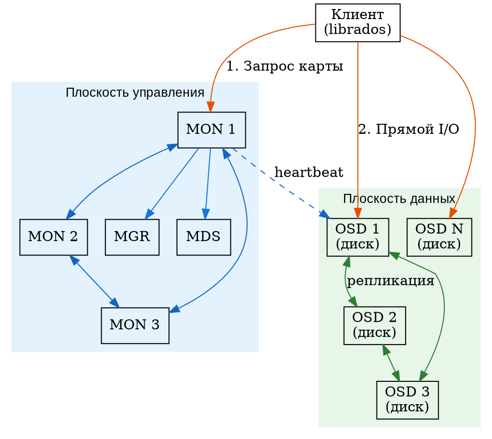
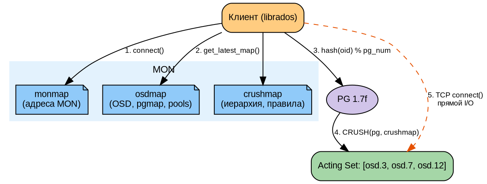
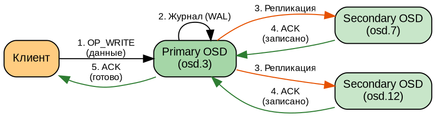

# Часть II. Архитектура Ceph *(70 стр.)*

> **Цель:** разобрать внутреннее устройство Ceph до уровня «могу нарисовать на доске и объяснить каждую стрелку».
> **После этой части вы сможете:** рассказать, как RADOS хранит объекты, как CRUSH вычисляет размещение без центральной таблицы, и проследить путь клиентского запроса от приложения до диска.

---

## Глава 3. RADOS — фундамент *(24 стр.)*

### 3.1. Reliable Autonomic Distributed Object Store: разбор каждого слова *(3 стр.)*

**RADOS** — это не просто аббревиатура; каждое слово раскрывает ключевое архитектурное решение Ceph. Разберём по порядку.

**Object Store (объектное хранилище).** RADOS хранит данные в виде **объектов** — фундаментальной единицы хранения. Объект — это не файл и не блок:

- **Файл** — последовательность байтов, организованная в иерархию каталогов, с метаданными (имя, размер, дата, владелец). Файловая система сама решает, в какие физические блоки диска записать файл.
- **Блок** — фиксированный участок диска (обычно 512 байт или 4 килобайта), минимальная единица чтения/записи для блочного устройства. Никакой семантики: просто сектор.
- **Объект** — «плоский» набор данных (без иерархии каталогов), идентифицируемый уникальным именем (OID — Object ID). Объект может содержать произвольные данные, плюс метаданные (xattrs — extended attributes, расширенные атрибуты) и OMAPA (object map — key-value store внутри объекта).

```
Файл:    /home/user/photo.jpg  → ОС знает путь, имя, размер
Блок:    /dev/sda, сектор 42   → просто 512 байт
Объект:  oid=abc123def          → данные + атрибуты + key-value хранилище
```

В Ceph объект идентифицируется по OID (object ID — уникальный идентификатор), а не по пути в файловой системе. Все объекты лежат «плоским списком» внутри **пула** (pool) — логического раздела, аналогичного разделу диска. Клиент говорит: «дай мне объект X из пула Y».

**Distributed (распределённый).** Объекты не хранятся на одном сервере. Они **распределены** между OSD (Object Storage Daemon — демонами хранения объектов) на разных физических узлах. Нет «главного OSD» или «центрального сервера метаданных для объектов» (MDS обслуживает только CephFS, не объекты RADOS!). Каждый OSD равноправен: любой может принять запрос от клиента.

**Autonomic (автономный, самоуправляемый).** RADOS сам решает, что делать при отказе диска, сервера или сети — без администратора:

- Заметил, что OSD упал? Помечает его `down`.
- Прошло 10 минут (`mon_osd_down_out_interval`)? Помечает `out` и запускает перераспределение данных (recovery/backfill).
- Появился новый OSD? Автоматически начинает миграцию части данных на него (балансировка).

**Reliable (надёжный).** Данные защищены репликацией или erasure coding. По умолчанию каждый объект хранится в 3 экземплярах на разных OSD (и, благодаря CRUSH, на разных серверах, в разных стойках — при правильной настройке). Отказ одного или даже двух дисков не приводит к потере данных.

---

### 3.2. MON (Monitor): мозг кластера *(5 стр.)*

#### Что хранит MON

**MON (Monitor — «наблюдатель»)** хранит **карту кластера** (cluster map) — совокупность всех метаданных, описывающих состояние кластера. Без MON клиент не знал бы, к каким OSD обращаться.

Cluster map включает (каждая «подкарта» имеет номер версии — эпоху):

| Подкарта | Содержание | Что в ней |
|----------|-----------|-----------|
| **monmap** | Карта MON-серверов | FSID кластера, имена/адреса всех MON, возраст (epoch) |
| **osdmap** | Карта OSD | Список всех OSD (id, состояние up/down, in/out), веса, пулы, параметры |
| **pgmap** | Карта Placement Groups | Состояние PG (active, clean, degraded…), статистика использования |
| **mdsmap** | Карта MDS | Список серверов метаданных CephFS, ранги, состояние |
| **crushmap** | Карта CRUSH | Иерархия устройств и правила размещения данных |

> **Важно:** MON хранит метаданные (карты, состояние), но **не хранит сами данные**. Данные хранят OSD. MON — это «мозг», OSD — «руки».

#### Кворум и нечётное количество

MON-ы принимают решения коллективно, через алгоритм консенсуса (согласования) Paxos. Чтобы принять решение, нужно **большинство голосов** (кворум).

**Почему нечётное количество:**
- 3 MON: кворум = 2 (способен пережить отказ 1 MON)
- 5 MON: кворум = 3 (способен пережить отказ 2 MON)
- 2 MON: кворум = 2 (отказ любого MON — потеря кворума, кластер недоступен!)

Формула кворума: `большинство = ⌊N/2⌋ + 1`

| MON-ов | Кворум | Выдерживает отказ |
|--------|--------|------------------|
| 1 | 1 | 0 (деградация) |
| 3 | 2 | 1 |
| 5 | 3 | 2 |
| 7 | 4 | 3 |

#### Paxos — упрощённо

Алгоритм Paxos — это способ, которым несколько серверов (MON) приходят к единому решению, даже если часть из них временно недоступна. Упрощённая модель:

1. **Лидер** (leader) — один из MON, выбранный на роль координатора. Только он может предлагать изменения.
2. **Предложение (propose):** лидер предлагает изменение («OSD 5 теперь up»).
3. **Голосование (accept):** каждый MON принимает или отклоняет предложение.
4. **Кворум (commit):** если большинство приняло — изменение фиксируется, увеличивается эпоха карты.

```
[MON 1 — лидер] ──propose──→ [MON 2] ←──accept──
                              [MON 3] ←──accept── → КВОРУМ! Epoch N+1
```

Если лидер падает — оставшиеся MON выбирают нового лидера (фаза leader election).

#### Практические команды

```bash
# Состояние MON
ceph mon stat
# Вывод: e3: 3 mons at {mon1=10.0.1.10:6789,mon2=10.0.1.11:6789,mon3=10.0.1.12:6789},
#        election epoch 42, leader 0 mon1, quorum 0,1,2

# Детальный дамп monmap
ceph mon dump
# Показывает fsid, эпохи, адреса всех MON
```

---

### 3.3. OSD (Object Storage Daemon): рабочие руки *(5 стр.)*

#### Функция OSD

OSD — это процесс, который работает на каждом диске в кластере. **Один OSD = один диск** (или раздел, или LVM-том). Именно OSD:

- Хранит объекты RADOS на диске
- Обслуживает запросы клиентов (чтение/запись объектов)
- Реплицирует данные между собой (отправляет копии на другие OSD)
- Восстанавливает данные после отказов (backfill, recovery)
- Проверяет целостность данных (scrubbing)

#### BlueStore: что внутри

С версии Luminous (v12, 2017) Ceph использует **BlueStore** — движок хранения, который пишет данные напрямую на блочное устройство, минуя файловую систему. Это даёт прирост производительности в 2–3 раза по сравнению с предшественником FileStore.

**Структура BlueStore (снизу вверх):**

```
Объекты RADOS (пользовательские данные)
        ↓
[BlueStore — движок хранения]
        ↓
  ┌──────────────────────────┐
  │ RocksDB                  │ ← key-value БД для метаданных объектов (OID → расположение на диске)
  │  (метаданные)            │
  └──────────┬───────────────┘
             │
  ┌──────────┴───────────────┐
  │ BlueFS                   │ ← мини-файловая система для RocksDB
  │  (мелкие файлы БД)       │
  └──────────┬───────────────┘
             │
  ┌──────────┴───────────────┐
  │ BlockDevice              │ ← raw-доступ к диску (никакой XFS/ext4!)
  │  (сырой раздел)          │
  └──────────────────────────┘
```

**Почему так сложно?** RocksDB (встраиваемая key-value база данных от Facebook) хранит метаданные объектов: «объект X начинается с сектора 100500, длина 4 МБ». Сами данные объекта лежат на сыром разделе. RocksDB требует файловую систему для своих файлов — но это не полноценная ext4/XFS, а микроскопическая BlueFS, оптимизированная только для RocksDB.

#### WAL и DB

BlueStore использует два вспомогательных раздела (опционально, для ускорения):

- **WAL (Write-Ahead Log — «журнал предзаписи»).** Прежде чем записать данные в основное хранилище, OSD пишет их в WAL. Если OSD упадёт во время записи — данные не потеряются, их можно восстановить из WAL. На HDD WAL лучше разместить на быстром NVMe-разделе.
- **DB (база данных RocksDB).** Хранит метаданные. Если разместить на быстром NVMe, поиск объектов ускоряется в 10–50 раз по сравнению с хранением DB на том же медленном HDD.

```
Медленный HDD 20 ТБ          Быстрый NVMe 512 ГБ
┌──────────────────┐        ┌──────────────────┐
│ Данные объектов   │        │ WAL (2 ГБ)       │ ← журнал
│ (18 ТБ)           │        │ DB (30 ГБ)       │ ← метаданные
└──────────────────┘        └──────────────────┘
```

Такая конфигурация (WAL+DB на NVMe, данные на HDD) даёт производительность, близкую к SSD, при стоимости HDD.

---

### 3.4. MDS (Metadata Server): файловая система *(3 стр.)*

**MDS (Metadata Server — «сервер метаданных»)** обслуживает **только CephFS**, но не RBD и не RGW. Его задача — хранить иерархию файловой системы (каталоги, имена файлов, права доступа, временные метки).

**Как MDS работает:**
```
Пользователь:  открыть /home/user/report.txt
                    ↓
Клиент CephFS → MDS: «где лежит inode файла report.txt?»
                    ↓
MDS: «inode 0x10000000abc, смотри в пуле cephfs_data, объект 0x...»
                    ↓
Клиент → OSD: «дай объект 0x... из пула cephfs_data»
```

MDS хранит **только метаданные** (дерево каталогов, атрибуты файлов). Сами данные файлов лежат как объекты RADOS в пулах `cephfs_data`. Это разделение позволяет:
- Масштабировать метаданные и данные независимо
- Не терять производительность операций с метаданными при большом объёме данных

**Журнал MDS:** все изменения сначала записываются в журнал. При падении MDS журнал воспроизводится (replay) — и файловая система восстанавливает согласованное состояние. Standby MDS обеспечивает горячий резерв: если активный MDS упал, standby занимает его место за секунды.

---

### 3.5. MGR (Manager): панель управления *(3 стр.)*

**MGR (Manager — «менеджер»)** появился в версии Kraken (v11, 2017). До этого мониторинг и управление были размазаны между MON, что создавало нагрузку. MGR берёт на себя:

- **Сбор метрик** со всех OSD, MON, MDS, RGW
- **Модули:** балансировщик (balancer), autoscaler PG, Prometheus-экспортёр, Ceph Dashboard, Zabbix-интеграция
- **Веб-интерфейс (Dashboard):** графики, статус, управление кластером

**Ключевые модули MGR:**

| Модуль | Назначение |
|--------|-----------|
| `prometheus` | Отдаёт метрики в формате Prometheus |
| `dashboard` | Веб-интерфейс управления кластером |
| `balancer` | Автоматическая балансировка PG по OSD |
| `pg_autoscaler` | Автоматическая настройка количества PG |
| `snap_schedule` | Расписание снапшотов CephFS |
| `nfs` | Управление NFS-Ganesha экспортами |

MGR не хранит данные и не участвует в критическом пути ввода-вывода. Его отказ не останавливает кластер — теряется только мониторинг и Dashboard до восстановления.

---

### 3.6. Взаимодействие компонентов *(3 стр.)*



**Ключевые потоки:**

1. **Плоскость управления (control plane):** MON ↔ MON (Paxos), MON → OSD (heartbeat — проверка живости), MON → MGR/MDS (конфигурация).
2. **Плоскость данных (data plane):** Клиент → OSD (прямой I/O), OSD ↔ OSD (репликация, recovery, backfill).

**Важнейшее свойство Ceph:** клиент **не ходит через MON за данными**. MON нужен только чтобы получить карту кластера. После этого клиент общается с OSD напрямую. Нет центрального прокси, нет бутылочного горлышка.

---

### 3.7. Практикум: «собери RADOS» *(2 стр.)*

На работающем кластере (лабораторный стенд `ceph-ha-lab`) выполните:

```bash
# 1. Общее состояние
ceph status

# 2. Дерево OSD — кто где, статус, вес
ceph osd tree

# 3. Состояние MON — кворум, лидер
ceph mon stat

# 4. Дамп monmap — эпохи, адреса
ceph mon dump

# 5. Активные MGR
ceph mgr stat

# 6. Активные MDS
ceph mds stat
```

**Задание:** на листе бумаги (или в draw.io) нарисуйте схему своего кластера:
- Узлы (прямоугольники)
- MON, MGR, MDS на соответствующих узлах
- OSD на узлах (сколько на каждом)
- Стрелки: MON ↔ MON, MON → OSD, клиент → OSD

Сравните с DOT-схемой из §3.6. Найдите соответствие каждой стрелки.

---

## Глава 4. CRUSH — алгоритм размещения *(23 стр.)*

### 4.1. Controlled Replication Under Scalable Hashing *(2 стр.)*

**CRUSH** — это алгоритм, который решает фундаментальную проблему распределённых хранилищ: **как найти, на каком диске лежит объект, без центральной таблицы?**

Перевод и смысл названия:
- **Controlled (контролируемый):** администратор задаёт правила размещения (например, «три копии на разных серверах в разных стойках»)
- **Replication (репликация):** каждый объект имеет несколько копий
- **Under Scalable Hashing (через масштабируемое хеширование):** поиск через хеш-функцию, работающую за O(1) независимо от размера кластера

**Ключевое свойство CRUSH: псевдослучайное, но детерминированное размещение.**

- **Псевдослучайное:** объекты распределены по OSD равномерно, без «горячих точек» (hot spots — перегруженных OSD)
- **Детерминированное:** для одного и того же OID, пула и карты CRUSH всегда вычисляется один и тот же набор OSD. Никакой центральный сервер не хранит таблицу «объект → OSD»

Клиент **сам вычисляет** OSD через CRUSH, имея на руках crushmap и osdmap (полученные от MON при старте). Никакого запроса к MON при каждом чтении/записи!

---

### 4.2. Проблема 10⁹ объектов *(3 стр.)*

#### Почему нельзя таблицу

В кластере Ceph могут быть **миллиарды объектов** (крупные инсталляции CERN: > 10⁹ объектов). Если бы MON хранил таблицу «объект → OSD», это потребовало бы:

- Объект: OID (32 байта) → 3 OSD (3 × 4 байта) = 44 байта на объект
- Для 10⁹ объектов: 44 ГБ — таблица
- При каждом изменении (OSD упал/поднялся): обновить таблицу и разослать всем клиентам 44 ГБ
- Клиент не может кешировать: завтра OSD может быть уже другим

**Вывод:** централизованная таблица размещения не масштабируется.

#### Почему не DHT

**DHT (Distributed Hash Table — «распределённая хеш-таблица»)** — подход, используемый в некоторых P2P-системах. Каждый узел отвечает за свой диапазон хешей. Проблема: DHT не даёт **контроля над доменами отказа**.

Пример: DHT может разместить три реплики объекта на дисках одного сервера (они попадут в близкие диапазоны хешей). Отказ сервера → потеря всех трёх реплик → потеря данных.

CRUSH решает эту проблему через иерархическую карту (crushmap), где заданы домены отказа: диски внутри хоста, хосты внутри стойки, стойки внутри дата-центра. Алгоритм гарантирует, что реплики всегда попадут в разные домены отказа на нужном уровне.

---

### 4.3. CRUSH map: иерархия, типы, веса *(5 стр.)*

**CRUSH map** — это текстовое (в декомпилированном виде) описание топологии кластера и правил размещения данных. Получить его можно командой:

```bash
ceph osd getcrushmap -o /tmp/crush.bin   # бинарный формат
crushtool -d /tmp/crush.bin -o /tmp/crush.txt  # декомпиляция в текст
```

Разберём типичную crushmap построчно.

#### Иерархия устройств

```
# buckets
host mon1 {
    id -3           # уникальный отрицательный ID
    alg straw2      # алгоритм выбора (straw2 — оптимальный)
    hash 0          # hash algorithm (0 = rjenkins1)
    item osd.0 weight 20.000
}
host mon2 {
    id -4
    alg straw2
    hash 0
    item osd.1 weight 20.000
    item osd.2 weight 20.000
}
host osd1 {
    id -5
    alg straw2
    hash 0
    item osd.3 weight 20.000
}
rack rack1 {
    id -10
    alg straw2
    hash 0
    item mon1 weight 20.000
    item mon2 weight 40.000
    item osd1 weight 20.000
}
root default {
    id -1
    alg straw2
    hash 0
    item rack1 weight 80.000
}
```

**Что здесь происходит:**
- **OSD** (диски) — листья дерева, положительные ID (osd.0, osd.1…)
- **host** — сервер, содержит OSD. ID отрицательные.
- **rack** — стойка, содержит серверы. Вес стойки = сумма весов серверов.
- **root** — корень всего дерева, вес = сумма весов всех OSD в кластере.
- **Вес (weight):** пропорционален ёмкости диска. OSD на 20 ТБ имеет вес 20.0. OSD на 10 ТБ — вес 10.0. Данные распределяются пропорционально весам.

**Алгоритмы выбора (alg):**
| Тип | Описание |
|-----|----------|
| `uniform` | Равномерное распределение, все элементы с одинаковым весом (устаревший) |
| `list` | Связанный список (для очень больших кластеров, устаревший) |
| `tree` | Бинарное дерево поиска (устаревший) |
| `straw` | Пропорционально весу: «кто вытянул самую длинную соломинку» |
| `straw2` | Улучшенный straw: корректно работает при добавлении/удалении элементов без лишних перемещений данных. **Рекомендуемый для всех новых кластеров.** |

---

### 4.4. Правила CRUSH *(5 стр.)*

Правила (rules) определяют, **как** выбирать OSD для размещения данных. Правило привязывается к пулу:

```bash
ceph osd pool create ssd_pool 128
ceph osd pool set ssd_pool crush_rule ssd_rule
```

#### Правило 1. Репликация по хостам (стандартное)

```
rule replicated_rule {
    id 0
    type replicated
    min_size 1
    max_size 10

    step take default        # 1. Берём корень дерева (все устройства)
    step chooseleaf firstn 3 type host  # 2. Выбираем 3 листа (OSD),
                              #    каждый в РАЗНЫХ хостах (type host)
    step emit                 # 3. Выдаём результат
}
```

**Разбор:**
- `take default` — начинаем с корневого bucket'а `default`
- `chooseleaf firstn 3 type host` — выбираем 3 OSD, каждый в **разном** хосте. `chooseleaf` значит «выбрать лист (OSD) напрямую, но так, чтобы каждый был в уникальном контейнере типа host». Это гарантирует: 3 реплики на 3 разных серверах.
- `emit` — выдать результат клиенту

#### Правило 2. SSD-only пул

```
rule ssd_rule {
    id 1
    type replicated
    min_size 1
    max_size 10

    step take default class ssd   # Берём только OSD класса SSD
    step chooseleaf firstn 3 type host
    step emit
}
```

**Классы устройств** (device class) — это метки: `hdd`, `ssd`, `nvme`. Ceph автоматически определяет класс по типу устройства (ротационное — hdd, твердотельное — ssd, NVMe — nvme). Правило `class ssd` выберет только SSD-диски, игнорируя HDD.

#### Правило 3. Erasure Coding (k=3, m=2)

```
rule ec_rule {
    id 2
    type erasure
    min_size 3
    max_size 5

    step set_chooseleaf_tries 5
    step take default
    step choose indep 3 type host   # k=3: три блока данных в разных хостах
    step choose indep 2 type host   # m=2: два блока чётности в разных хостах
    step emit
}
```

Erasure Coding (EC) — это аналог RAID 5/6 для распределённых систем. Вместо хранения 3 полных копий (300% overhead) EC хранит k блоков данных + m блоков чётности (overhead = m/k). Например, k=3, m=2: для хранения 3 МБ данных нужно 5 МБ на дисках (overhead 67% вместо 200% при ×3 репликации).

**EC подходит для:** холодных данных, бэкапов, архивов (где редко перезаписывают).
**EC НЕ подходит для:** RBD (виртуальных машин), баз данных (из-за накладных расходов на частичную запись).

#### Правило 4. Разделение по датацентрам

```
rule dc_rule {
    id 3
    type replicated
    min_size 1
    max_size 10

    step take default
    step choose firstn 2 type datacenter   # Сначала 2 разных DC
    step chooseleaf firstn 2 type host     # В каждом DC по 2 разных хоста
    step emit
}
```

`choose firstn 2 type datacenter` выбирает 2 разных дата-центра. Затем внутри каждого выбирается по 2 OSD на разных хостах. Итого 4 реплики с отказоустойчивостью «любой DC целиком может упасть».

#### Правило 5. Ручная привязка (кон konkrete OSD)

```
rule manual_rule {
    id 4
    type replicated
    min_size 1
    max_size 3

    step take osd.0
    step chooseleaf firstn 2 type host
    step emit
}
```

Начинаем **не с root**, а с конкретного OSD. Полезно для тестов или специальных конфигураций.

---

### 4.5. Placement Groups *(4 стр.)*

#### Что такое PG

Когда в кластере миллиард объектов, отслеживать состояние каждого объекта (на каких OSD он лежит, синхронизирован ли) — слишком дорого. Поэтому Ceph группирует объекты в **Placement Groups (PG — группы размещения)**.

**PG — это логическая группа объектов, которые лежат на одном и том же наборе OSD.**

```
Объекты:    [obj1] [obj2] [obj3] [obj4] [obj5] [obj6] ...
                ↘     ↙           ↘     ↙
PG:          [ PG 1.2a ]       [ PG 1.7f ]
                ↓                  ↓
OSD:      [osd.3] [osd.7]    [osd.1] [osd.5]
              (реплики)          (реплики)
```

PG отображается на OSD через **Acting Set** — список OSD, отвечающих за эту PG:
```
PG 1.2a → acting set: [3, 7, 12]
```

С объектами внутри PG работает хеш-функция: `pg = hash(oid) % num_pg`. Поскольку хеш-функция детерминированная, все клиенты вычисляют PG для объекта одинаково и не конфликтуют.

#### Формула PG

```
pg_num = (OSD_count × 100) / replica_count
```

**Пример:** 15 OSD, репликация ×3:
```
pg_num = (15 × 100) / 3 = 500
```

**Почему 100?** Эмпирическое правило Ceph: на каждый OSD должно приходиться ~100 PG. Это даёт:
- Достаточную гранулярность для равномерного распределения
- Не слишком много (каждый PG потребляет память и CPU)

#### PG Autoscaler

Начиная с версии Nautilus (v14), Ceph может автоматически настраивать количество PG через модуль MGR `pg_autoscaler`:

```bash
ceph mgr module enable pg_autoscaler
ceph osd pool set <pool> pg_autoscale_mode on
```

Autoscaler следит за количеством OSD в пуле и корректирует `pg_num` в разумных пределах. **Рекомендуется включать для всех пулов.**

#### Состояния PG (краткий справочник)

| Состояние | Значение |
|-----------|----------|
| **active** | PG обслуживает запросы клиентов |
| **clean** | Все реплики синхронизированы, идеальное состояние |
| **degraded** | Не все реплики доступны (OSD down), но данные не потеряны |
| **undersized** | Реплик меньше, чем `size` пула |
| **peered** | PG выбирает новый acting set (переходный процесс) |
| **inconsistent** | Реплики не совпадают — ошибка данных! |
| **stale** | PG не обновлялась дольше `mon_pg_stuck_threshold` |
| **remapped** | PG временно перенесена на другие OSD |

**Идеальное состояние всех PG: active+clean.**

---

### 4.6. Практикум: работа с CRUSH map *(4 стр.)*

```bash
# 1. Получить текущую CRUSH map
ceph osd getcrushmap -o /tmp/crush.bin

# 2. Декомпилировать в текст
crushtool -d /tmp/crush.bin -o /tmp/crush.txt

# 3. Посмотреть структуру
cat /tmp/crush.txt | head -100

# 4. Найти правило replicated_rule
grep -A 10 "rule replicated_rule" /tmp/crush.txt

# 5. Посмотреть дерево устройств
ceph osd crush tree

# 6. Посмотреть классы устройств
ceph osd crush class ls

# 7. Создать новое правило (SSD-only)
ceph osd crush rule create-replicated ssd_rule default host ssd

# 8. Посмотреть, какие пулы используют какие правила
for pool in $(ceph osd pool ls); do
    echo "$pool: $(ceph osd pool get $pool crush_rule)"
done
```

**Задание:** отредактируйте `crush.txt` — добавьте вымышленный rack и перенесите в него OSD. Скомпилируйте обратно и примените. Проверьте `ceph osd tree`. Обратите внимание: **изменение CRUSH map вызывает массовую миграцию данных!** На реальном кластере всегда проверяйте на тестовом.

---

## Глава 5. Путь данных: от клиента до диска *(23 стр.)*

### 5.1. librados: как клиент говорит с кластером *(3 стр.)*

**librados** — это библиотека (C/C++), через которую приложения взаимодействуют с RADOS. Именно librados реализует всю клиентскую логику: CRUSH-вычисления, кеширование карт, подключение к OSD.

> **Клиент Ceph — это не отдельный сервис.** Это библиотека, встроенная в приложение. Каждое приложение, работающее с Ceph, само содержит всю логику навигации по кластеру.

Языковые привязки:
- **C/C++:** родная `librados`, `librbd`, `libcephfs`
- **Python:** `rados`, `rbd`, `cephfs` (обёртки над C-библиотеками)
- **Java:** `librados-java`
- **Go:** `go-ceph`
- **REST:** RGW (S3/Swift API) — через HTTP, без librados

**Модель взаимодействия:**
1. Клиент при старте подключается к MON и получает **последнюю копию cluster map** (monmap + osdmap + crushmap)
2. Клиент **подписывается на обновления** (subscribe): MON уведомляет клиента, когда карта изменилась (новый OSD, упал OSD…)
3. Для каждого запроса клиент **сам вычисляет** OSD через CRUSH
4. Клиент открывает TCP-соединение напрямую с OSD и отправляет запрос
5. MON **не участвует** в пути данных — только обновляет карту

---

### 5.2. Навигация без карты: monmap → osdmap → CRUSH *(4 стр.)*

**DOT-схема: цепочка поиска OSD для объекта**



**По шагам:**

1. Клиент подключается к MON (из monmap знает адреса). Получает osdmap и crushmap.
2. Для объекта `foo` в пуле `data`:
   - Хешируем OID: `hash('foo') = 0x1a2b...`
   - Вычисляем PG: `pg = hash % pg_num_pool_data`
   - Например: `pg_num = 512`, `hash % 512 = 127` → PG 1.7f
3. CRUSH вычисляет Acting Set для PG 1.7f: `[osd.3, osd.7, osd.12]`
4. Клиент открывает TCP-соединение с osd.3 (primary) и отправляет запрос.

**Весь процесс — чистое вычисление, без сетевых запросов к MON после получения карты.**

---

### 5.3. Запись: primary OSD → replication → ack *(5 стр.)*

**DOT-схема: временна́я диаграмма записи**



**По шагам (детально):**

**Шаг 1:** Клиент отправляет `OP_WRITE` (операцию записи) на primary OSD. Данные идут по TCP (MSGR2 — async messenger v2).

**Шаг 2:** Primary OSD записывает данные в **WAL (Write-Ahead Log)** — это быстрая операция, т.к. WAL обычно на NVMe. Запись в WAL гарантирует: если OSD упадёт сейчас, данные не пропадут (они в журнале и будут «дозаписаны» при восстановлении).

**Шаг 3:** Primary OSD **одновременно** (параллельно) отправляет данные на secondary OSD. Каждый secondary так же пишет в свой WAL.

**Шаг 4:** Каждый secondary, записав в WAL, отправляет **ACK (acknowledgement — подтверждение)** primary OSD.

**Шаг 5:** Когда primary получил ACK от **всех** secondary (или от кворума, если `min_size < size`), он подтверждает клиенту: «запись выполнена».

**Важно:** Клиент ждёт подтверждения от **всех** реплик (при size=3, min_size=3). Это гарантирует строгую согласованность (CP): никто не прочитает «старые» данные, пока запись не завершена на всех репликах.

#### Когда данные физически попадают на диск

- **WAL (журнал):** синхронная запись (fsync) — данные гарантированно на диске после ACK
- **Основное хранилище (BlueStore):** отложенная запись (асинхронно, пачками, оптимизированно)

Если OSD упадёт после ACK клиенту, но до переноса из WAL в основное хранилище — при восстановлении OSD «проиграет» WAL и дозапишет данные.

---

### 5.4. Чтение: primary vs local, балансировка *(3 стр.)*

По умолчанию Ceph использует **primary read**: клиент читает только с primary OSD.

```
Клиент → primary OSD → данные
```

Это гарантирует строгую согласованность: primary всегда в курсе последней версии объекта (он координирует запись). Но создаёт нагрузку на primary OSD.

**Local read (чтение с ближайшего):** можно разрешить клиенту читать с ближайшего по CRUSH OSD (не обязательно primary):

```bash
ceph osd set-require-min-compat-client luminous
```

Это снижает нагрузку на primary и уменьшает сетевую задержку (клиент читает с OSD в своей стойке или даже на своём узле). Но требует, чтобы все клиенты были достаточно новыми (Luminous+).

**Degraded read:** если primary недоступен, но есть реплики — клиент может читать с secondary OSD. Данные будут согласованными (primary координировал запись), но возможна небольшая задержка.

---

### 5.5. Scrubbing: лёгкая и глубокая проверка *(4 стр.)*

**Scrubbing (очистка/проверка)** — процесс, которым Ceph проверяет целостность данных. Как антивирус, который периодически проверяет, не повреждены ли файлы.

#### Light scrub (лёгкая проверка)

- **Частота:** ежедневно (`osd_scrub_min_interval = 86400` секунд)
- **Что проверяет:** контрольные суммы (checksums) метаданных объектов
- **Нагрузка:** минимальная, почти незаметна
- **Механизм:** primary OSD читает метаданные объекта и сравнивает контрольную сумму с репликами

#### Deep scrub (глубокая проверка)

- **Частота:** еженедельно (`osd_deep_scrub_interval = 604800` секунд)
- **Что проверяет:** побитовое сравнение **самих данных** (не только метаданных!)
- **Нагрузка:** значительная — читаются все данные объекта со всех реплик
- **Механизм:** primary OSD читает весь объект с диска, secondary читают свои копии, вычисляется SHA256 — если не совпадает, PG помечается `inconsistent`

#### Что происходит при расхождении

Если deep scrub находит расхождение:
1. PG получает статус `inconsistent`
2. Кластер: `HEALTH_ERR`
3. Администратор должен выяснить причину (сбойный диск, bit rot, ошибка памяти) и выполнить `ceph pg repair <pgid>` — принудительную перезапись «правильной» копии на проблемный OSD

#### Настройка scrubbing

```bash
# Ограничить scrubbing ночным окном (с 2 до 6 утра)
ceph config set osd osd_scrub_begin_hour 2
ceph config set osd osd_scrub_end_hour 6

# Максимальное количество одновременно скрабящихся PG
ceph config set osd osd_max_scrubs 1
```

---

### 5.6. Практикум: трассировка записи *(4 стр.)*

```bash
# 1. Создадим тестовый объект
echo "Hello Ceph!" | rados put test-obj -p test_pool

# 2. Найдём, на каких OSD лежит объект
ceph osd map test_pool test-obj
# Вывод: osdmap e123 pool 'test_pool' (1) object 'test-obj' ->
#        pg 1.abc123 (1.abc123) -> up ([3,7,12], p3) acting ([3,7,12], p3)

# 3. Посмотрим perf counters primary OSD
ceph daemon osd.3 perf dump | grep -E "op_w|op_r|op_latency"

# 4. Включим отладку на primary OSD (осторожно — много логов!)
ceph daemon osd.3 config set debug_osd 10
ceph daemon osd.3 config set debug_ms 5

# 5. Сделаем ещё одну запись
echo "Hello again!" | rados put test-obj-2 -p test_pool

# 6. Посмотрим логи primary OSD
journalctl -u ceph-$(ceph fsid)@osd.3 --since "1 minute ago" | grep -E "op_write|replicate"

# 7. Выключим отладку
ceph daemon osd.3 config set debug_osd 0
ceph daemon osd.3 config set debug_ms 0

# 8. Сравним perf counters до и после
ceph daemon osd.3 perf dump | grep -E "op_w|op_r|op_latency"
```

**Задание:** запишите объект, проследите по логам:
- Какой OSD был primary?
- На какие OSD реплицировались данные?
- Сколько времени заняла запись?

Сравните с теоретической моделью из §5.3.

---

| Навигация | |
|-----------|---|
| ← Часть I | [part-I.md](part-I.md) |
| ↑ Оглавление | [TOC.md](TOC.md) |
| → Часть III | [part-III.md](part-III.md) |
