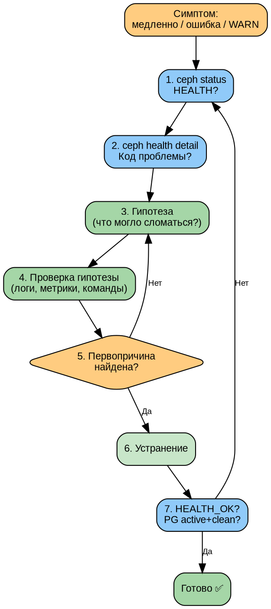

# Часть IV. Мониторинг и диагностика *(95 стр., 10 кейсов)*

> **Цель:** освоить полный цикл наблюдаемости Ceph — от чтения `ceph status` до системной диагностики неисправностей и моделирования отказов.
> **После этой части вы сможете:** настроить Prometheus + Grafana + Dashboard, расшифровать любой HEALTH-код, найти первопричину по симптомам, отработать 10 типовых отказов.

---

## Глава 10. Мониторинг: полный обзор *(25 стр.)*

### 10.1. `ceph status` — построчный разбор *(4 стр.)*

`ceph status` — первая команда, которую выполняет администратор при любой проблеме. Разберём каждую строку:

```
# ceph status
  cluster:
    id:     51fa3f5c-7da8-11f1-b7ed-bc2411ed0aef
    health: HEALTH_OK

  services:
    mon: 3 daemons, quorum mon1,mon2,mon3 (age 3d)
    mgr: mon1(active, since 3d), standbys: mon2
    osd: 5 osds: 5 up (since 3d), 5 in (since 3d)
    mds: 1/1 daemons up, 1 standby
    rgw: 2 daemons active (2 zones)

  data:
    pools:   4 pools, 81 pgs
    objects: 1.23k objects, 4.5 GiB
    usage:   15 GiB used, 95 GiB / 110 GiB avail
    pgs:     81 active+clean

  io:
    client:   45 MiB/s rd, 12 MiB/s wr, 234 op/s rd, 89 op/s wr
    recovery: 0 B/s rd, 0 B/s wr, 0 op/s rd, 0 op/s wr
```

**Разбор полей:**

| Поле | Значение | Когда тревога |
|------|----------|--------------|
| `id` | FSID кластера | Никогда не меняется |
| `health` | HEALTH_OK / WARN / ERR | WARN — внимание, ERR — срочно |
| `mon: 3 daemons, quorum` | Все MON живы, кворум есть | Если < кворума — кластер недоступен |
| `mgr: active` | MGR работает | Без active MGR нет Dashboard, мониторинга |
| `osd: 5 up` | OSD процессы запущены | `down` — процесс упал или нет связи |
| `osd: 5 in` | OSD участвуют в кластере | `out` — данные мигрируют с этого OSD |
| `pools: 4` | Количество пулов | — |
| `pgs: 81` | Все PG в одном состоянии | Если разные — проблема |
| `usage` | Занято / Доступно | > 85% = nearfull (WARN), > 95% = full (ERR) |
| `client io` | Текущий клиентский трафик | — |
| `recovery io` | Трафик восстановления | Ненулевой при проблемах |

**Ключевое правило:** `health: HEALTH_OK` + `pgs: N active+clean` = кластер здоров.

---

### 10.2. `ceph health detail` — классификация HEALTH-кодов *(4 стр.)*

`ceph health detail` показывает **конкретные** проблемы, если `health != HEALTH_OK`.

**Полная таблица HEALTH-кодов:**

| Код | Severity | Причина | Решение |
|-----|----------|---------|---------|
| `OSD_DOWN` | WARN | OSD процесс упал | Проверить `systemctl`, диски, память |
| `OSD_<id>_DOWN` | WARN | Конкретный OSD | `ceph osd tree` |
| `OSD_FULL` | ERR | OSD заполнен > 95% | Добавить OSD, освободить место |
| `OSD_NEARFULL` | WARN | OSD заполнен > 85% | Планировать расширение |
| `OSD_BACKFILLFULL` | WARN | OSD > 90%, backfill заблокирован | Срочно добавить OSD |
| `PG_DEGRADED` | WARN | PG не все реплики доступны | Ждать recovery или `ceph pg <id> query` |
| `PG_STUCK_INACTIVE` | ERR | PG не может выбрать acting set | Проверить OSD, сеть |
| `PG_STUCK_UNCLEAN` | WARN | PG не синхронизированы долго | Проверить backfill |
| `PG_INCONSISTENT` | ERR | Данные на репликах не совпадают | `ceph pg repair` |
| `MON_DOWN` | WARN | 1 MON упал (кворум есть) | Перезапустить MON |
| `MON_CLOCK_SKEW` | WARN | Расхождение часов > 0.05s | `chronyc -a makestep` |
| `MON_MSGR2_NOT_ENABLED` | WARN | Старый протокол MSGR1 | Обновить клиентов |
| `MDS_DAMAGED` | ERR | Повреждён журнал MDS | `cephfs-journal-tool` |
| `MDS_UP_LESS_THAN_MAX` | WARN | Меньше активных MDS, чем max_mds | Проверить standby MDS |
| `POOL_FULL` | ERR | Пул заполнен | Увеличить квоту или удалить данные |
| `TOO_MANY_PGS` | WARN | Слишком много PG на OSD (>200) | `pg_autoscaler` или уменьшить pg_num |

**HEALTH_ERR — требует немедленного вмешательства.** HEALTH_WARN — требует внимания, но кластер работает.

---

### 10.3. Prometheus: экспортёры и метрики *(5 стр.)*

Prometheus — система мониторинга, которая собирает метрики (числовые показатели) с серверов и сервисов и умеет оповещать (alert) при выходе за пороги.

#### Экспортёры Ceph

**1. Модуль MGR `prometheus`** (встроен в Ceph):
```bash
ceph mgr module enable prometheus
# Метрики доступны на http://<mgr>:9283/metrics
```

Ключевые метрики MGR:
```
ceph_osd_up           # OSD в статусе up (1=up, 0=down)
ceph_osd_in           # OSD в статусе in (1=in, 0=out)
ceph_osd_utilization  # % использования диска
ceph_pg_active        # PG в статусе active
ceph_pg_clean         # PG в статусе clean
ceph_pg_degraded      # PG в статусе degraded
ceph_health_status    # 0=OK, 1=WARN, 2=ERR
ceph_osd_perf_apply_latency_ms  # Latency OSD
ceph_rbd_mirror_status          # Статус RBD Mirror
```

**2. node_exporter** (на каждом узле, не часть Ceph):
```bash
# Сбор системных метрик: CPU, RAM, диск, сеть
apt install prometheus-node-exporter
# Метрики: http://<host>:9100/metrics
```

#### Prometheus alerts (правила оповещения)

```yaml
# alerts/ceph.yml
groups:
- name: ceph
  rules:
  - alert: CephHealthError
    expr: ceph_health_status > 0
    for: 5m
    labels:
      severity: critical
    annotations:
      summary: "Ceph HEALTH не OK ({{ $value }})"

  - alert: CephOSDNearFull
    expr: ceph_osd_utilization > 85
    for: 10m
    labels:
      severity: warning
    annotations:
      summary: "OSD {{ $labels.osd }} заполнен на {{ $value }}%"

  - alert: CephMonDown
    expr: ceph_mon_quorum_count < 3
    for: 1m
    labels:
      severity: critical
    annotations:
      summary: "Кворум MON нарушен: {{ $value }} из 3"
```

---

### 10.4. Grafana: дашборды *(4 стр.)*

Grafana визуализирует метрики из Prometheus в виде графиков и панелей.

#### Официальные дашборды Ceph

Ceph поставляет готовые дашборды (ID в Grafana.com):

| ID | Название | Что показывает |
|----|----------|---------------|
| 2842 | Ceph — Cluster | Общее состояние: HEALTH, IOPS, ёмкость |
| 5336 | Ceph — OSD | Per-OSD: latency, utilisation, IO |
| 5342 | Ceph — Pools | Per-pool: IOPS, throughput, объекты |
| 5345 | Ceph — RBD | RBD-образы: throughput, IOPS |

#### Кастомные панели

**Latency heatmap (тепловая карта задержек):**
```
PromQL: ceph_osd_perf_apply_latency_seconds
Тип: Heatmap
Показывает распределение latency по OSD — сразу видно «медленные» диски.
```

**PG state timeline (временна́я шкала состояний PG):**
```
PromQL: ceph_pg_active, ceph_pg_degraded, ceph_pg_peered
Тип: Stacked graph
Показывает, как менялось состояние PG во времени.
```

---

### 10.5. Ceph Dashboard *(3 стр.)*

```bash
# Активация Dashboard
ceph mgr module enable dashboard

# Создание пользователя
ceph dashboard ac-user-create admin -i <password-file> administrator

# Настройка SSL (или самоподписанный сертификат)
ceph dashboard create-self-signed-cert

# Проверка
ceph mgr services
# "dashboard": "https://ceph-mon1:8443"
```

**Разделы Dashboard:**
- **Cluster:** статус, HEALTH, версия, FSID
- **Hosts:** список узлов, запущенные сервисы
- **OSDs:** список OSD, использование, latency, статус
- **Pools:** пулы, PG, использование, crush rule
- **Block (RBD):** образы, снапшоты, Mirror
- **Filesystem (CephFS):** MDS, клиенты, квоты
- **Object (RGW):** пользователи, бакеты, multi-site

---

### 10.6. Логи: куда смотреть *(3 стр.)*

```bash
# Кластерный журнал
ceph log last 100

# Логи конкретного демона (journald)
journalctl -u ceph-<fsid>@osd.0 -n 100

# Файлы на диске (внутри контейнера)
# /var/log/ceph/ceph-osd.0.log

# Повысить детализацию логов (для отладки)
ceph tell osd.0 injectargs --debug_osd 10 --debug_ms 5
# Вернуть обратно
ceph tell osd.0 injectargs --debug_osd 0 --debug_ms 0
```

**Уровни логирования:** 0 (критические ошибки) → 20 (всё, включая каждый пакет). Повышать ТОЛЬКО для отладки и сразу возвращать — при debug=20 лог растёт на гигабайты.

---

### 10.7. Практикум: настрой мониторинг *(2 стр.)*

```bash
# 1. Включить Prometheus-модуль
ceph mgr module enable prometheus
curl http://<mgr>:9283/metrics | head -20

# 2. Установить node_exporter на всех узлах
ansible all -m apt -a "name=prometheus-node-exporter"

# 3. Развернуть Prometheus (можно на том же mgr-узле)
# prometheus.yml — scrape_configs на MGR:9283 + node_exporters:9100

# 4. Развернуть Grafana, импортировать дашборд 2842

# 5. Настроить алерт на OSD > 80%
# В Prometheus rules: ceph_osd_utilization > 80
# Проверить: забить тестовый OSD до 85% и убедиться, что алерт сработал
```

---

## Глава 11. Диагностика неисправностей *(28 стр.)*

### 11.1. Методика диагностики: системный подход *(3 стр.)*

**Алгоритм диагностики (DOT-схема — дерево решений):**



**Золотое правило:** не применять «случайные исправления»! Сначала понять, ЧТО сломалось и ПОЧЕМУ, затем — как исправить.

---

### 11.2. HEALTH_WARN: 20 предупреждений *(5 стр.)*

| Код | Порог | Причина | Диагностика | Исправление |
|-----|-------|---------|------------|------------|
| `OSD_DOWN` | 1 OSD | Процесс упал | `systemctl status ceph-*@osd.X` | `systemctl restart` |
| `OSD_NEARFULL` | 85% | Диск заполняется | `ceph osd df` | Reweight или добавить OSD |
| `OSD_BACKFILLFULL` | 90% | Backfill заблокирован | `ceph osd df` | Срочно добавить OSD |
| `PG_DEGRADED` | Любое | Реплик меньше size | `ceph pg <id> query` | Ждать backfill |
| `PG_STUCK_UNCLEAN` | > 300s | PG не чистая долго | `ceph pg <id> query` | Проверить OSD, сеть |
| `MON_CLOCK_SKEW` | > 0.05s | Расхождение часов | `chronyc sources -v` | `chronyc makestep` |
| `MON_DOWN` | 1 из 3 | MON процесс упал | `systemctl status` | `systemctl restart` |
| `MGR_DOWN` | 1 | MGR упал | `systemctl status` | `systemctl restart` |
| `POOL_NEARFULL` | 85% | Пул заполняется | `ceph df` | Квоты или очистка |
| `POOL_PG_NUM_NOT_POWER_OF_TWO` | — | Неоптимальное pg_num | — | Округлить до степени 2 |
| `TOO_MANY_PGS` | > 200/OSD | Слишком много PG | `ceph pg stat` | Уменьшить pg_num |
| `SLOW_OPS` | > 30s | Медленная операция | `ceph daemon osd.X dump_historic_ops` | Найти медленный диск/сеть |
| `OBJECT_MISPLACED` | > 0.01% | Объекты не там где надо | `ceph health detail` | Ждать backfill |
| `DEVICE_HEALTH` | — | SMART-ошибка диска | `ceph device ls-by-host` | Заменить диск |
| `CACHE_POOL_NEAR_FULL` | 85% | Cache pool (устар.) | — | Отказаться от cache tiering |
| `RECENT_CRASH` | 1+ | Падение демона | `ceph crash ls` | `ceph crash archive-all` |
| `TELEMETRY_CHANGED` | — | Изменился модуль телеметрии | — | `ceph telemetry on/off` |

---

### 11.3. HEALTH_ERR: 10 критических ошибок *(4 стр.)*

| Код | Причина | Срочность | План действий |
|-----|---------|----------|--------------|
| `OSD_FULL` | OSD > 95% | КРИТИЧЕСКАЯ — запись остановлена | Добавить OSD или освободить данные |
| `PG_DAMAGED` | Повреждение данных | КРИТИЧЕСКАЯ — потеря данных | `ceph pg repair`, или `ceph-objectstore-tool` |
| `MON_DOWN (2/3)` | Потеря кворума MON | КРИТИЧЕСКАЯ — кластер недоступен | Запустить упавшие MON |
| `MDS_DAMAGED` | Повреждён журнал MDS | КРИТИЧЕСКАЯ — CephFS недоступна | `cephfs-journal-tool` recovery |
| `POOL_FULL` | Пул > quota | Запись в пул остановлена | Увеличить квоту или очистить |
| `PG_INCONSISTENT` | Данные реплик различаются | ВЫСОКАЯ — риск потери данных | `ceph pg repair <pgid>` |
| `PG_STUCK_INACTIVE` | PG не может активироваться | ВЫСОКАЯ — данные недоступны | Проверить OSD, acting set |
| `MDS_ALL_DOWN` | Все MDS упали | КРИТИЧЕСКАЯ — CephFS недоступна | Запустить MDS |
| `NO_ACTIVE_MGR` | Нет активного MGR | СРЕДНЯЯ — нет мониторинга | Запустить standby MGR |
| `BLUEFS_SPILLOVER` | BlueFS переполнен | ВЫСОКАЯ — OSD degraded | Увеличить размер DB/WAL |

---

### 11.4. OSD down/out: диагностика *(4 стр.)*

OSD может быть в четырёх состояниях относительно двух осей:

```
          up              down
    ┌─────────────┬──────────────┐
 in │ Здоровый    │ Процесс упал │
    │ (читает и   │ (нет heart-  │
    │  пишет)     │  beat, но    │
    │             │  данные тут) │
    ├─────────────┼──────────────┤
out │ Выводится   │ Мёртвый      │
    │ (миграция   │ (удалён)     │
    │  данных)    │              │
    └─────────────┴──────────────┘
```

**up/down** — жив ли процесс OSD (heartbeat).
**in/out** — участвует ли OSD в распределении данных (CRUSH).

**Почему OSD становится down:**
1. Процесс `ceph-osd` упал (OOM killer, segfault, ручная остановка)
2. Диск отмонтировался или отказал
3. Сетевая недоступность (heartbeat не доходит до MON)

**Диагностика:**
```bash
# 1. Статус OSD
ceph osd tree
ceph osd find 0            # на каком хосте OSD 0

# 2. Проверить процесс на хосте
systemctl status ceph-<fsid>@osd.0

# 3. Проверить диск
lsblk | grep sdb
smartctl -a /dev/sdb

# 4. Логи OSD
journalctl -u ceph-<fsid>@osd.0 -n 50 --no-pager

# 5. Admin socket (если OSD всё же up, но проблемы)
ceph daemon osd.0 status
```

**Почему OSD становится out (автоматически):** через `mon_osd_down_out_interval` (по умолчанию 600 секунд = 10 минут) после того, как OSD стал `down`, MON помечает его `out`, и начинается перераспределение данных.

---

### 11.5. PG stuck: разбор каждого диагноза *(5 стр.)*

**Inactive** — PG не может выбрать acting set.
- Причины: недостаточно OSD для размещения реплик, CRUSH не может найти подходящие OSD, OSD down+out
- Диагностика: `ceph pg <pgid> query | jq .`
- Исправление: поднять упавшие OSD, проверить CRUSH rule

**Unclean** — не все реплики синхронизированы.
- Причины: backfill не завершён, OSD down
- Диагностика: `ceph pg <pgid> query | jq .state`
- Исправление: ждать backfill, ускорить: `ceph tell osd.* injectargs --osd_max_backfills=4`

**Inconsistent** — реплики не совпадают! Данные повреждены.
- Причины: bit rot (деградация данных на диске), ошибка памяти, баг
- Диагностика: `ceph pg <pgid> query | jq .info.stats`
- Исправление:
  1. `ceph pg repair <pgid>` — попытаться автоматически
  2. Если не помогло — найти «хорошую» копию вручную и скопировать

**Degraded** — реплик меньше, чем `size` пула.
- Причины: OSD down, backfill в процессе
- Исправление: поднять OSD или ждать

**Peered** — PG выбирает новый acting set (переходное состояние).
- Обычно проходит за секунды. Если stuck — проблема с MON или сетью.

**Stale** — PG не обновлялась > `mon_pg_stuck_threshold` (300s).
- Причины: primary OSD не отвечает, сеть

**Undersized** — реплик меньше, чем `size`, и это не временно (OSD out).
- Причины: недостаточно OSD в кластере или CRUSH не может найти нужное количество

---

### 11.6. Сетевая диагностика *(3 стр.)*

**Clock skew (расхождение часов):**
```bash
# Проверить синхронизацию
chronyc tracking
# System time: offset должен быть < 0.05 секунд

# Принудительно синхронизировать
chronyc -a makestep 1.0 -1
```

**Проверка MTU (Jumbo Frames):**
```bash
# Пинг с указанием размера пакета и запретом фрагментации
ping -M do -s 8972 10.0.1.11
# Если MTU=9000: пакет проходит
# Если MTU=1500: "message too long"

# Трассировка MTU вдоль пути
tracepath 10.0.1.11
```

**Потеря пакетов:**
```bash
# Длительный пинг с большими пакетами
ping -M do -s 8972 -c 1000 10.0.1.11
# Потери > 1% — проблема с сетью

# Пропускная способность
iperf3 -c 10.0.1.11 -t 30
```

---

### 11.7. Инструменты диагностики *(4 стр.)*

**`ceph daemon`** — admin socket (прямой доступ к работающему процессу):
```bash
ceph daemon osd.0 help              # все доступные команды
ceph daemon osd.0 status            # состояние OSD
ceph daemon osd.0 perf dump         # все счётчики производительности
ceph daemon osd.0 dump_historic_ops # история медленных операций
ceph daemon osd.0 config show       # текущая конфигурация
ceph daemon osd.0 dump_mempools     # потребление памяти
```

**`ceph tell`** — отправка команд демонам удалённо:
```bash
ceph tell osd.0 injectargs --debug_osd 20
ceph tell osd.0 bench 1024 10       # бенчмарк OSD
ceph tell osd.* heap stats          # потребление heap всеми OSD
```

**`ceph-objectstore-tool`** — аварийный инструмент:
```bash
# Экспорт OSD (все объекты в файл)
ceph-objectstore-tool --op export --data-path /var/lib/ceph/osd/ceph-0 \
    --file /tmp/osd0-export.bin

# Импорт (восстановление)
ceph-objectstore-tool --op import --data-path /var/lib/ceph/osd/ceph-0 \
    --file /tmp/osd0-export.bin
```

**`ceph-kvstore-tool`** — низкоуровневый доступ к RocksDB:
```bash
# Список всех ключей
ceph-kvstore-tool /var/lib/ceph/osd/ceph-0 kv list

# Получить значение по ключу
ceph-kvstore-tool /var/lib/ceph/osd/ceph-0 kv get <key>
```

---

## Глава 12. Моделирование неисправностей: 10 кейсов *(22 стр.)*

### 12.1. Кейс 1: отказ одного OSD-диска *(2 стр.)*

**Модель:**
```bash
systemctl stop ceph-<fsid>@osd.0
```

**Симптомы:**
```
HEALTH_WARN: 1 osds down
PG_DEGRADED: 12 pgs degraded
```
- PG, где osd.0 был primary — переключаются на новый primary
- PG, где osd.0 был secondary — просто degraded (меньше реплик)

**Восстановление:**
```bash
systemctl start ceph-<fsid>@osd.0
# OSD → up → PG backfill → active+clean
```

**Вывод:** при репликации ×3 отказ одного OSD — не проблема. Данные доступны, degraded автоматически восстанавливается.

---

### 12.2. Кейс 2: потеря сети на OSD-узле *(2 стр.)*

**Модель:**
```bash
iptables -A INPUT -j DROP       # на OSD-хосте
iptables -A OUTPUT -j DROP
```

**Симптомы:**
```
HEALTH_WARN: 2 osds down
PG_DEGRADED: 24 pgs degraded
```
- Все OSD на узле перестают отправлять heartbeats
- Через `mon_osd_down_out_interval` (600s) MON помечает их `out`

**Восстановление:**
```bash
iptables -F  # снять блокировку
# OSD восстанавливают heartbeats
# MON помечает их up → PG backfill
```

**Вывод:** важно не паниковать при массовом `OSD down`. Если это сеть, а не диски, — после восстановления сети всё вернётся. Установите `mon_osd_down_out_interval = 900` (15 минут), чтобы не начинать backfill при кратковременных сбоях.

---

### 12.3. Кейс 3: split-brain MON *(2 стр.)*

**Модель:**
```bash
# На mon2 блокируем его от остальных
iptables -A INPUT -s 10.0.1.10 -j DROP
iptables -A INPUT -s 10.0.1.12 -j DROP
iptables -A OUTPUT -d 10.0.1.10 -j DROP
iptables -A OUTPUT -d 10.0.1.12 -j DROP
```

**Симптомы:**
```
HEALTH_WARN: 1 mons down, quorum mon1,mon3
MON_CLOCK_SKEW: mon2 clock skew > 0.05s
```
- mon2 исключён из кворума (он думает, что он лидер, но остальные 2 образовали кворум без него)

**Восстановление:**
```bash
iptables -F  # снять блокировку
# mon2 синхронизируется с mon1/mon3 и возвращается в кворум
```

---

### 12.4. Кейс 4: отказ двух OSD одновременно *(2 стр.)*

**Модель:**
```bash
systemctl stop ceph-<fsid>@osd.0
systemctl stop ceph-<fsid>@osd.1
```

**Симптомы:**
```
HEALTH_WARN: 2 osds down
PG_DEGRADED: PG, где были обе реплики на osd.0 и osd.1
```
- **Риск:** если PG имела size=3 и osd.0+osd.1 — две из трёх реплик, осталась одна. Если и она откажет — **потеря данных**.

**Восстановление:**
```bash
systemctl start ceph-<fsid>@osd.0 osd.1
```

**Вывод:** при репликации ×3 одновременный отказ 2 OSD с общими PG — на грани. Это демонстрирует, почему CRUSH должен разносить реплики по **разным хостам**.

---

### 12.5. Кейс 5: зависший OSD (hung process) *(2 стр.)*

**Модель:**
```bash
kill -STOP $(cat /var/run/ceph/ceph-osd.0.pid)
# Процесс заморожен, но не убит. Не отвечает на heartbeats.
```

**Симптомы:**
```
HEALTH_WARN: osd.0 down
SLOW_OPS: операции на osd.0 не завершаются
```
- В `ceph daemon osd.0 dump_historic_ops` — операции stuck в `in progress`

**Диагностика:**
```bash
strace -p $(pgrep ceph-osd)  # висит на чём-то
ceph daemon osd.0 perf dump | jq .throttle
```

**Восстановление:**
```bash
kill -9 $(pgrep ceph-osd)     # жёсткое убийство
systemctl start ceph-<fsid>@osd.0  # перезапуск
```

---

### 12.6. Кейс 6: OSD nearfull *(2 стр.)*

**Модель:**
```bash
# Забить диск тестовыми данными до 85%
rados -p test_pool bench 600 write --no-cleanup
# Проверить
ceph osd df | grep osd.0
```

**Симптомы:**
```
HEALTH_WARN: 1 nearfull osd(s)
OSD_NEARFULL: osd.0 87%
```

**Эвакуация:**
```bash
# Уменьшаем вес OSD — данные начнут мигрировать
ceph osd reweight osd.0 0.8
# Ждать HEALTH_OK
# Если не помогло — добавить новый OSD
```

---

### 12.7. Кейс 7: медленный диск *(2 стр.)*

**Модель:**
```bash
# Имитация медленного диска через device-mapper
dmsetup create slow-disk --table "0 $(blockdev --getsz /dev/sdb) delay /dev/sdb 0 50000"
# Добавляет 50ms задержки ко всем операциям на /dev/sdb
```

**Симптомы:**
```
HEALTH_WARN: slow ops
ceph osd perf: osd.0 apply_latency_ms = 120ms (норма: <10ms)
```

**Диагностика:**
```bash
iostat -x 1 | grep sdb    # await > 50ms — проблема
ceph daemon osd.0 dump_historic_ops | jq '.ops[].duration'
```

**Устранение:**
```bash
ceph osd out osd.0         # вывести из эксплуатации
# Заменить диск
ceph osd destroy osd.0 --force
ceph orch daemon add osd <host>:/dev/sdb
```

---

### 12.8. Кейс 8: MDS rank damage *(2 стр.)*

**Модель:**
```bash
kill -9 $(pgrep ceph-mds)  # убить MDS во время активной записи
```

**Симптомы:**
```
HEALTH_WARN: MDS_DAMAGED
CephFS: недоступна, клиенты в ожидании
```

**Восстановление:**
```bash
# 1. MDS replay (автоматически при запуске)
systemctl start ceph-mds@<host>

# 2. Если не помогло — ручное восстановление журнала
cephfs-journal-tool journal export /tmp/journal.bin
cephfs-journal-tool journal reset
```

---

### 12.9. Кейс 9: PG inconsistent *(2 стр.)*

**Модель:**
```bash
# Намеренно испортить объект на одном OSD
# Найти объект и перезаписать его на диске "мусором"
dd if=/dev/urandom of=/var/lib/ceph/osd/ceph-0/current/1.7f_head/... bs=1M count=1
```

**Симптомы:**
```
HEALTH_ERR: 1 pgs inconsistent
PG_INCONSISTENT: pg 1.7f
```

**Диагностика:**
```bash
ceph pg 1.7f query | jq '.info.stats'
# Проверить, на каких OSD расхождение
```

**Восстановление:**
```bash
ceph pg repair 1.7f
# Если не помогло:
# 1. Найти "хорошую" копию объекта
# 2. Экспортировать с хорошего OSD → импортировать на проблемный
ceph-objectstore-tool --op export --pgid 1.7f --data-path ... --file ...
ceph-objectstore-tool --op import --pgid 1.7f --data-path ... --file ...
```

---

### 12.10. Кейс 10: потеря MON majority *(3 стр.)*

**Модель:**
```bash
# Остановить 2 из 3 MON
systemctl stop ceph-mon@mon2
systemctl stop ceph-mon@mon3
```

**Симптомы:**
```
Кластер не отвечает на запросы
ceph status: "Error connecting to cluster: No such file or directory"
```
- Кворум потерян (1/3 — не большинство)
- Клиенты не могут получить карту → I/O заморожен

**Ручное восстановление:**
```bash
# 1. Извлечь monmap из единственного живого MON
ceph-mon -i mon1 --extract-monmap /tmp/monmap.bin
monmaptool --print /tmp/monmap.bin

# 2. Удалить упавшие MON из monmap
monmaptool /tmp/monmap.bin --rm mon2 --rm mon3

# 3. Сформировать новый кворум из одного MON
ceph-mon -i mon1 --inject-monmap /tmp/monmap.bin
# MON1 теперь образует кворум сам с собой (1/1)

# 4. Кластер снова доступен!
ceph status

# 5. Развернуть MON заново
ceph orch apply mon --placement="mon1,mon2,mon3"
```

---

### 12.11. Практикум: самостоятельная отработка *(1 стр.)*

Выберите 5 кейсов из 10. Для каждого:
1. Смоделируйте отказ (повторите команды из кейса)
2. Зафиксируйте симптомы (`ceph status`, `ceph health detail`)
3. Выполните диагностику
4. Устраните проблему
5. Запишите лог (`script` + `ceph log`)

**Критерий:** после отработки всех 5 кейсов кластер должен быть `HEALTH_OK`.

---

## Глава 13. Инструментарий диагностики *(20 стр.)*

### 13.1. Admin socket *(4 стр.)*

```bash
# Полный список команд
ceph daemon osd.0 help

# Ключевые:
ceph daemon osd.0 status
ceph daemon osd.0 version
ceph daemon osd.0 perf dump                    # Все метрики
ceph daemon osd.0 perf schema                  # Описание метрик
ceph daemon osd.0 dump_historic_ops            # История операций
ceph daemon osd.0 dump_ops_in_flight           # Текущие операции
ceph daemon osd.0 dump_watchers                # Клиенты-наблюдатели
ceph daemon osd.0 config show                  # Конфигурация
ceph daemon osd.0 config diff                  # Отличия от дефолтной
ceph daemon osd.0 dump_mempools                # Потребление памяти
ceph daemon osd.0 dump_reservations            # Зарезервированное место
ceph daemon osd.0 bluestore_compression_stats  # Статистика сжатия
```

### 13.2. `ceph tell` *(3 стр.)*

```bash
# Отправить команду всем OSD
ceph tell 'osd.*' injectargs --debug_osd 5

# Конкретному OSD
ceph tell osd.0 bench 1024 10

# Всем MON
ceph tell 'mon.*' mon_status

# Проверить потребление памяти
ceph tell 'osd.*' heap stats
```

### 13.3. `ceph pg` — полная справка *(4 стр.)*

```bash
ceph pg dump                    # Дамп всех PG
ceph pg dump_summary            # Сводка
ceph pg <pgid> query            # Полная информация о PG
ceph pg map <pgid>              # Acting set PG
ceph pg ls                      # Список PG
ceph pg ls-by-pool <pool>       # PG конкретного пула
ceph pg ls-by-osd osd.0         # PG на конкретном OSD
ceph pg <pgid> scrub            # Запустить scrub
ceph pg <pgid> deep-scrub       # Запустить deep-scrub
ceph pg <pgid> repair           # Попытаться восстановить
```

### 13.4. `rados` CLI *(3 стр.)*

```bash
rados lspools
rados ls -p <pool>               # Объекты в пуле (осторожно — миллионы!)
rados get <obj> <file> -p <pool>
rados put <file> <obj> -p <pool>
rados rm <obj> -p <pool>
rados stat <obj> -p <pool>
rados listomapkeys <obj> -p <pool>
rados listxattr <obj> -p <pool>
rados bench 60 write -p <pool>
rados cleanup -p <pool>          # Удалить объекты бенчмарка
```

### 13.5. `ceph-objectstore-tool` *(3 стр.)*

```bash
# Экспорт PG
ceph-objectstore-tool --op export --pgid 1.7f \
    --data-path /var/lib/ceph/osd/ceph-0 \
    --file /tmp/pg-1.7f-export.bin

# Импорт PG
ceph-objectstore-tool --op import --pgid 1.7f \
    --data-path /var/lib/ceph/osd/ceph-0 \
    --file /tmp/pg-1.7f-export.bin

# Удаление PG (осторожно!)
ceph-objectstore-tool --op remove --pgid 1.7f \
    --data-path /var/lib/ceph/osd/ceph-0
```

### 13.6. `ceph-kvstore-tool` *(3 стр.)*

```bash
# Доступ к RocksDB OSD
DB=/var/lib/ceph/osd/ceph-0

ceph-kvstore-tool $DB kv list | head
ceph-kvstore-tool $DB kv get <key>
ceph-kvstore-tool $DB store-crc  # Проверка целостности БД
```

---

| Навигация | |
|-----------|---|
| ← Часть III | [part-III.md](part-III.md) |
| ↑ Оглавление | [TOC.md](TOC.md) |
| → Часть V | [part-V.md](part-V.md) |
