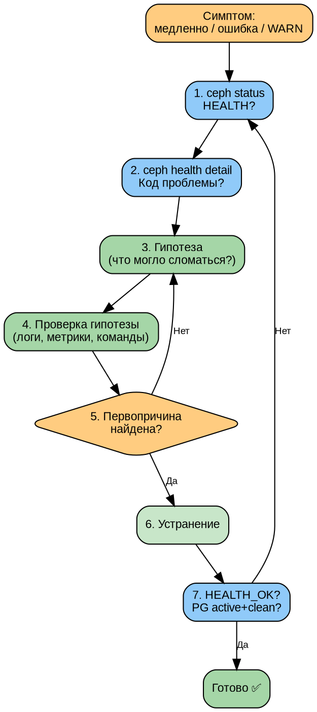

# Часть IV. Мониторинг и диагностика *(95 стр., 10 кейсов)*

> **Цель:** освоить полный цикл наблюдаемости Ceph — от чтения `ceph status` до системной диагностики неисправностей и моделирования отказов.
> **После этой части вы сможете:** настроить Prometheus + Grafana + Dashboard, расшифровать любой HEALTH-код, найти первопричину по симптомам, отработать 10 типовых отказов.

---

## Глава 10. Мониторинг: полный обзор *(25 стр.)*

### 10.1. `ceph status` — построчный разбор *(4 стр.)*

`ceph status` — первая команда, которую выполняет администратор при любой проблеме. Разберём каждую строку:

```
# ceph status
  cluster:
    id:     51fa3f5c-7da8-11f1-b7ed-bc2411ed0aef
    health: HEALTH_OK

  services:
    mon: 3 daemons, quorum mon1,mon2,mon3 (age 3d)
    mgr: mon1(active, since 3d), standbys: mon2
    osd: 5 osds: 5 up (since 3d), 5 in (since 3d)
    mds: 1/1 daemons up, 1 standby
    rgw: 2 daemons active (2 zones)

  data:
    pools:   4 pools, 81 pgs
    objects: 1.23k objects, 4.5 GiB
    usage:   15 GiB used, 95 GiB / 110 GiB avail
    pgs:     81 active+clean

  io:
    client:   45 MiB/s rd, 12 MiB/s wr, 234 op/s rd, 89 op/s wr
    recovery: 0 B/s rd, 0 B/s wr, 0 op/s rd, 0 op/s wr
```

**Разбор полей:**

| Поле | Значение | Когда тревога |
|------|----------|--------------|
| `id` | FSID кластера | Никогда не меняется |
| `health` | HEALTH_OK / WARN / ERR | WARN — внимание, ERR — срочно |
| `mon: 3 daemons, quorum` | Все MON живы, кворум есть | Если < кворума — кластер недоступен |
| `mgr: active` | MGR работает | Без active MGR нет Dashboard, мониторинга |
| `osd: 5 up` | OSD процессы запущены | `down` — процесс упал или нет связи |
| `osd: 5 in` | OSD участвуют в кластере | `out` — данные мигрируют с этого OSD |
| `pools: 4` | Количество пулов | — |
| `pgs: 81` | Все PG в одном состоянии | Если разные — проблема |
| `usage` | Занято / Доступно | > 85% = nearfull (WARN), > 95% = full (ERR) |
| `client io` | Текущий клиентский трафик | — |
| `recovery io` | Трафик восстановления | Ненулевой при проблемах |

**Ключевое правило:** `health: HEALTH_OK` + `pgs: N active+clean` = кластер здоров.

---

### 10.2. `ceph health detail` — классификация HEALTH-кодов *(4 стр.)*

`ceph health detail` показывает **конкретные** проблемы, если `health != HEALTH_OK`.

**Полная таблица HEALTH-кодов:**

| Код | Severity | Причина | Решение |
|-----|----------|---------|---------|
| `OSD_DOWN` | WARN | OSD процесс упал | Проверить `systemctl`, диски, память |
| `OSD_<id>_DOWN` | WARN | Конкретный OSD | `ceph osd tree` |
| `OSD_FULL` | ERR | OSD заполнен > 95% | Добавить OSD, освободить место |
| `OSD_NEARFULL` | WARN | OSD заполнен > 85% | Планировать расширение |
| `OSD_BACKFILLFULL` | WARN | OSD > 90%, backfill заблокирован | Срочно добавить OSD |
| `PG_DEGRADED` | WARN | PG не все реплики доступны | Ждать recovery или `ceph pg <id> query` |
| `PG_STUCK_INACTIVE` | ERR | PG не может выбрать acting set | Проверить OSD, сеть |
| `PG_STUCK_UNCLEAN` | WARN | PG не синхронизированы долго | Проверить backfill |
| `PG_INCONSISTENT` | ERR | Данные на репликах не совпадают | `ceph pg repair` |
| `MON_DOWN` | WARN | 1 MON упал (кворум есть) | Перезапустить MON |
| `MON_CLOCK_SKEW` | WARN | Расхождение часов > 0.05s | `chronyc -a makestep` |
| `MON_MSGR2_NOT_ENABLED` | WARN | Старый протокол MSGR1 | Обновить клиентов |
| `MDS_DAMAGED` | ERR | Повреждён журнал MDS | `cephfs-journal-tool` |
| `MDS_UP_LESS_THAN_MAX` | WARN | Меньше активных MDS, чем max_mds | Проверить standby MDS |
| `POOL_FULL` | ERR | Пул заполнен | Увеличить квоту или удалить данные |
| `TOO_MANY_PGS` | WARN | Слишком много PG на OSD (>200) | `pg_autoscaler` или уменьшить pg_num |

**HEALTH_ERR — требует немедленного вмешательства.** HEALTH_WARN — требует внимания, но кластер работает.

---

### 10.3. Prometheus: экспортёры и метрики *(5 стр.)*

Prometheus — система мониторинга, которая собирает метрики (числовые показатели) с серверов и сервисов и умеет оповещать (alert) при выходе за пороги.

#### Экспортёры Ceph

**1. Модуль MGR `prometheus`** (встроен в Ceph):
```bash
ceph mgr module enable prometheus
# Метрики доступны на http://<mgr>:9283/metrics
```

Ключевые метрики MGR:
```
ceph_osd_up           # OSD в статусе up (1=up, 0=down)
ceph_osd_in           # OSD в статусе in (1=in, 0=out)
ceph_osd_utilization  # % использования диска
ceph_pg_active        # PG в статусе active
ceph_pg_clean         # PG в статусе clean
ceph_pg_degraded      # PG в статусе degraded
ceph_health_status    # 0=OK, 1=WARN, 2=ERR
ceph_osd_perf_apply_latency_ms  # Latency OSD
ceph_rbd_mirror_status          # Статус RBD Mirror
```

**2. node_exporter** (на каждом узле, не часть Ceph):
```bash
# Сбор системных метрик: CPU, RAM, диск, сеть
apt install prometheus-node-exporter
# Метрики: http://<host>:9100/metrics
```

#### Prometheus alerts (правила оповещения)

```yaml
# alerts/ceph.yml
groups:
- name: ceph
  rules:
  - alert: CephHealthError
    expr: ceph_health_status > 0
    for: 5m
    labels:
      severity: critical
    annotations:
      summary: "Ceph HEALTH не OK ({{ $value }})"

  - alert: CephOSDNearFull
    expr: ceph_osd_utilization > 85
    for: 10m
    labels:
      severity: warning
    annotations:
      summary: "OSD {{ $labels.osd }} заполнен на {{ $value }}%"

  - alert: CephMonDown
    expr: ceph_mon_quorum_count < 3
    for: 1m
    labels:
      severity: critical
    annotations:
      summary: "Кворум MON нарушен: {{ $value }} из 3"

  - alert: CephOSDDown
    expr: ceph_osd_up == 0
    for: 2m
    labels:
      severity: warning
    annotations:
      summary: "OSD {{ $labels.osd }} в статусе down более 2 минут"
      description: "OSD {{ $labels.osd }} на хосте {{ $labels.host }} не отвечает. Проверьте: systemctl status ceph-*@osd.{{ $labels.osd }}"

  - alert: CephOSDDiskUsage85
    expr: ceph_osd_utilization > 85
    for: 5m
    labels:
      severity: warning
    annotations:
      summary: "OSD {{ $labels.osd }} заполнен на {{ $value }}%"
      description: "Диск OSD {{ $labels.osd }} приближается к пределу. Текущее использование: {{ $value }}%. Планируйте добавление OSD или перебалансировку."

  - alert: CephOSDDiskUsage90
    expr: ceph_osd_utilization > 90
    for: 5m
    labels:
      severity: critical
    annotations:
      summary: "OSD {{ $labels.osd }} критически заполнен: {{ $value }}%"
      description: "OSD {{ $labels.osd }} превысил 90%. Backfill может быть заблокирован. СРОЧНО добавьте OSD или освободите место!"

  - alert: CephPoolNearFull
    expr: ceph_pool_percent_used > 85
    for: 5m
    labels:
      severity: warning
    annotations:
      summary: "Пул {{ $labels.pool }} заполнен на {{ $value }}%"
      description: "Пул {{ $labels.pool }} приближается к квоте. Проверьте: ceph df detail | grep {{ $labels.pool }}"

  - alert: CephPoolFull
    expr: ceph_pool_percent_used > 95
    for: 1m
    labels:
      severity: critical
    annotations:
      summary: "Пул {{ $labels.pool }} ПЕРЕПОЛНЕН: {{ $value }}%"
      description: "Запись в пул {{ $labels.pool }} остановлена! Увеличьте квоту или удалите данные."

  - alert: CephPGDegraded
    expr: ceph_pg_degraded > 0
    for: 10m
    labels:
      severity: warning
    annotations:
      summary: "{{ $value }} PG в состоянии degraded"
      description: "Не все реплики доступны для {{ $value }} PG. Проверьте: ceph health detail | grep PG_DEGRADED"

  - alert: CephPGInconsistent
    expr: ceph_pg_inconsistent > 0
    for: 5m
    labels:
      severity: critical
    annotations:
      summary: "{{ $value }} PG имеют несовпадающие реплики (INCONSISTENT)!"
      description: "Данные повреждены! Немедленно выполните: ceph pg deep-scrub <pgid> и ceph pg repair <pgid>"

  - alert: CephPGStuckInactive
    expr: ceph_pg_stuck_inactive > 0
    for: 5m
    labels:
      severity: critical
    annotations:
      summary: "{{ $value }} PG stuck inactive — данные недоступны!"
      description: "PG не могут активироваться. Проверьте OSD: ceph pg <pgid> query | jq .acting"

  - alert: CephPGUnclean
    expr: ceph_pg_total - ceph_pg_clean > 0
    for: 15m
    labels:
      severity: warning
    annotations:
      summary: "{{ $value }} PG не в состоянии clean более 15 минут"
      description: "Backfill/Recovery затянулся. Проверьте: ceph pg stat и ceph osd df"

  - alert: CephMDSDown
    expr: ceph_mds_up == 0
    for: 2m
    labels:
      severity: critical
    annotations:
      summary: "Все MDS упали — CephFS недоступна!"
      description: "Ни один MDS не работает. Проверьте: systemctl status ceph-mds@*"

  - alert: CephMDSDamaged
    expr: ceph_mds_damaged > 0
    for: 1m
    labels:
      severity: critical
    annotations:
      summary: "MDS rank {{ $labels.rank }} повреждён!"
      description: "Журнал MDS повреждён. Восстановление: cephfs-journal-tool journal reset"

  - alert: CephRGWSlowRequests
    expr: rate(ceph_rgw_req_latency_sum[5m]) / rate(ceph_rgw_req_latency_count[5m]) > 2
    for: 10m
    labels:
      severity: warning
    annotations:
      summary: "RGW latency превышает 2 секунды"
      description: "Средняя задержка RGW-запросов: {{ $value }}s. Проверьте нагрузку и сеть."

  - alert: CephRBDMirrorStatus
    expr: ceph_rbd_mirror_status == 0
    for: 30m
    labels:
      severity: warning
    annotations:
      summary: "RBD Mirror не активен более 30 минут"
      description: "Репликация RBD остановлена. Проверьте: ceph rbd mirror pool status"

  - alert: CephSlowOps
    expr: ceph_osd_slow_ops > 5
    for: 5m
    labels:
      severity: warning
    annotations:
      summary: "{{ $value }} медленных операций на OSD {{ $labels.osd }}"
      description: "Операции выполняются > 30 секунд. Проверьте: ceph daemon osd.{{ $labels.osd }} dump_historic_ops"

  - alert: CephOSDApplyLatency
    expr: ceph_osd_perf_apply_latency_ms > 100
    for: 5m
    labels:
      severity: warning
    annotations:
      summary: "Latency OSD {{ $labels.osd }} = {{ $value }}ms (норма < 10ms)"
      description: "Высокая задержка apply на OSD {{ $labels.osd }}. Проверьте диск: iostat -x 1"

  - alert: CephClusterCapacity85
    expr: (ceph_cluster_total_used_bytes / ceph_cluster_total_bytes) * 100 > 85
    for: 10m
    labels:
      severity: warning
    annotations:
      summary: "Кластер заполнен на {{ $value }}%"
      description: "Общая ёмкость кластера исчерпывается. Планируйте расширение."

  - alert: CephClusterCapacity95
    expr: (ceph_cluster_total_used_bytes / ceph_cluster_total_bytes) * 100 > 95
    for: 5m
    labels:
      severity: critical
    annotations:
      summary: "Кластер заполнен на {{ $value }}% — ЗАПИСЬ ОСТАНОВЛЕНА!"
      description: "Кластер достиг полной ёмкости. НЕМЕДЛЕННО добавьте OSD!"

  - alert: CephClockSkew
    expr: ceph_mon_clock_skew_seconds > 0.05
    for: 5m
    labels:
      severity: warning
    annotations:
      summary: "Расхождение часов MON {{ $labels.mon }}: {{ $value }}s"
      description: "NTP/Chrony не синхронизирован. Выполните: chronyc -a makestep"

  - alert: CephCrashRecent
    expr: increase(ceph_crash_total[1h]) > 0
    for: 1m
    labels:
      severity: warning
    annotations:
      summary: "Обнаружено падение демона за последний час"
      description: "Демон Ceph аварийно завершился. Проверьте: ceph crash ls; ceph crash info <id>"

  - alert: CephNodeRootFilesystemFull
    expr: node_filesystem_avail_bytes{mountpoint="/"} / node_filesystem_size_bytes{mountpoint="/"} < 0.1
    for: 5m
    labels:
      severity: warning
    annotations:
      summary: "Корневая ФС на {{ $labels.instance }} заполнена > 90%"
      description: "Заканчивается место на системном разделе. Очистите логи: journalctl --vacuum-size=500M"

  - alert: CephOSDDeviceSmartError
    expr: ceph_device_health_metric > 0
    for: 5m
    labels:
      severity: warning
    annotations:
      summary: "SMART-ошибка на устройстве {{ $labels.device }}"
      description: "Диск сигнализирует о проблемах. Проверьте: smartctl -a /dev/{{ $labels.device }}"

  - alert: CephNodeMemoryPressure
    expr: node_memory_MemAvailable_bytes / node_memory_MemTotal_bytes < 0.1
    for: 5m
    labels:
      severity: warning
    annotations:
      summary: "Память на {{ $labels.instance }} почти исчерпана (< 10% свободно)"
      description: "Риск OOM killer для OSD. Проверьте: free -h && ceph daemon osd.* dump_mempools"
```

#### Alertmanager: маршрутизация алертов

```yaml
# alertmanager.yml
route:
  group_by: ['alertname', 'severity']
  group_wait: 30s
  group_interval: 5m
  repeat_interval: 4h
  receiver: 'default'
  routes:
  - match:
      severity: critical
    receiver: 'pagerduty-critical'
    continue: true
  - match:
      severity: warning
    receiver: 'slack-warnings'

receivers:
- name: 'default'
  email_configs:
  - to: 'ceph-admins@example.com'
    send_resolved: true

- name: 'pagerduty-critical'
  pagerduty_configs:
  - routing_key: 'abc123...'
    severity: 'critical'

- name: 'slack-warnings'
  slack_configs:
  - api_url: 'https://hooks.slack.com/services/...'
    channel: '#ceph-alerts'
    title: '{{ .GroupLabels.alertname }}'
    text: '{{ .CommonAnnotations.description }}'
```

#### Prometheus Recording Rules (предварительные вычисления)

```yaml
# rules/recording.yml — ускоряют дашборды и алерты
groups:
- name: ceph_recording
  interval: 30s
  rules:
  - record: ceph:osd_utilization_pct:avg
    expr: avg by (host) (ceph_osd_utilization)

  - record: ceph:pool_used_pct:avg
    expr: avg by (pool) (ceph_pool_percent_used)

  - record: ceph:pg_unclean_total:sum
    expr: ceph_pg_total - ceph_pg_clean

  - record: ceph:osd_apply_latency_p99:quantile
    expr: histogram_quantile(0.99, rate(ceph_osd_op_r_latency_bucket[5m]))

  - record: ceph:client_iops:rate5m
    expr: rate(ceph_client_ops[5m])

  - record: ceph:cluster_capacity_used_pct
    expr: (ceph_cluster_total_used_bytes / ceph_cluster_total_bytes) * 100

  - record: ceph:osd_recovery_iops:rate5m
    expr: rate(ceph_osd_recovery_ops[5m])

  - record: ceph:network_public_bytes:rate5m
    expr: rate(ceph_osd_net_public_bytes[5m])
```

#### Мониторинг производительности (профили PromQL)

**IOPS на уровне кластера:**
```promql
# Клиентские IOPS (read + write)
sum(rate(ceph_client_ops[1m]))

# IOPS восстановления (recovery)
sum(rate(ceph_osd_recovery_ops[1m]))
```

**Latency по OSD (p99):**
```promql
histogram_quantile(0.99, sum(rate(ceph_osd_op_r_latency_bucket[5m])) by (osd, le))
```

**Пропускная способность сети кластера (cluster network):**
```promql
sum(rate(ceph_osd_net_cluster_bytes[5m]))
```

**Статус scrubbing:**
```promql
# Количество PG в состоянии scrubbing
ceph_pg_scrubbing

# Количество PG в состоянии deep-scrubbing
ceph_pg_deep_scrubbing
```

---

### 10.4. Grafana: дашборды *(4 стр.)*

Grafana визуализирует метрики из Prometheus в виде графиков и панелей.

#### Официальные дашборды Ceph

Ceph поставляет готовые дашборды (ID в Grafana.com):

| ID | Название | Что показывает |
|----|----------|---------------|
| 2842 | Ceph — Cluster | Общее состояние: HEALTH, IOPS, ёмкость |
| 5336 | Ceph — OSD | Per-OSD: latency, utilisation, IO |
| 5342 | Ceph — Pools | Per-pool: IOPS, throughput, объекты |
| 5345 | Ceph — RBD | RBD-образы: throughput, IOPS |

#### Кастомные панели

**Latency heatmap (тепловая карта задержек):**
```
PromQL: ceph_osd_perf_apply_latency_seconds
Тип: Heatmap
Показывает распределение latency по OSD — сразу видно «медленные» диски.
```

**PG state timeline (временна́я шкала состояний PG):**
```
PromQL: ceph_pg_active, ceph_pg_degraded, ceph_pg_peered
Тип: Stacked graph
Показывает, как менялось состояние PG во времени.
```

#### Пример панели Grafana (JSON)

Ниже — пример кастомной панели для Grafana, показывающей топ-10 OSD по latency:

```json
{
  "id": 100,
  "title": "Top 10 OSD by Apply Latency (p99)",
  "type": "bargauge",
  "targets": [
    {
      "expr": "topk(10, histogram_quantile(0.99, sum(rate(ceph_osd_op_r_latency_bucket[5m])) by (osd, le)))",
      "legendFormat": "osd.{{osd}}",
      "refId": "A"
    }
  ],
  "fieldConfig": {
    "defaults": {
      "unit": "s",
      "thresholds": {
        "mode": "absolute",
        "steps": [
          {"color": "green", "value": null},
          {"color": "yellow", "value": 0.01},
          {"color": "orange", "value": 0.05},
          {"color": "red", "value": 0.1}
        ]
      },
      "min": 0,
      "max": 0.2
    }
  },
  "options": {
    "orientation": "horizontal",
    "displayMode": "gradient"
  }
}
```

#### Панель «Cluster Overview» (составная)

```json
{
  "title": "Ceph Cluster Overview",
  "panels": [
    {
      "title": "Health Status",
      "type": "stat",
      "targets": [
        {"expr": "ceph_health_status", "refId": "A"}
      ],
      "fieldConfig": {
        "defaults": {
          "mappings": [
            {"type": "value", "value": "0", "text": "HEALTH_OK"},
            {"type": "value", "value": "1", "text": "HEALTH_WARN"},
            {"type": "value", "value": "2", "text": "HEALTH_ERR"}
          ],
          "thresholds": {
            "steps": [
              {"color": "green", "value": null},
              {"color": "yellow", "value": 1},
              {"color": "red", "value": 2}
            ]
          }
        }
      }
    },
    {
      "title": "Total Capacity",
      "type": "gauge",
      "targets": [
        {"expr": "ceph:cluster_capacity_used_pct", "refId": "A"}
      ],
      "fieldConfig": {
        "defaults": {
          "unit": "percent",
          "max": 100,
          "thresholds": {
            "steps": [
              {"color": "green", "value": null},
              {"color": "yellow", "value": 70},
              {"color": "orange", "value": 85},
              {"color": "red", "value": 95}
            ]
          }
        }
      }
    },
    {
      "title": "Client IOPS",
      "type": "timeseries",
      "targets": [
        {"expr": "sum(rate(ceph_client_ops[1m]))", "refId": "A"}
      ],
      "fieldConfig": {
        "defaults": {"unit": "iops"}
      }
    },
    {
      "title": "OSD Count (up/in/out/down)",
      "type": "timeseries",
      "targets": [
        {"expr": "ceph_osd_up", "refId": "up", "legendFormat": "up"},
        {"expr": "ceph_osd_in", "refId": "in", "legendFormat": "in"}
      ]
    }
  ]
}
```

#### Панель «PG States Timeline» (все состояния)

```json
{
  "title": "PG States Timeline",
  "type": "timeseries",
  "targets": [
    {"expr": "ceph_pg_active",   "refId": "active",   "legendFormat": "active"},
    {"expr": "ceph_pg_clean",    "refId": "clean",    "legendFormat": "clean"},
    {"expr": "ceph_pg_degraded", "refId": "degraded", "legendFormat": "degraded"},
    {"expr": "ceph_pg_peered",   "refId": "peered",   "legendFormat": "peered"},
    {"expr": "ceph_pg_recovering","refId": "recovering","legendFormat": "recovering"},
    {"expr": "ceph_pg_backfilling","refId": "backfilling","legendFormat": "backfilling"},
    {"expr": "ceph_pg_remapped", "refId": "remapped", "legendFormat": "remapped"},
    {"expr": "ceph_pg_scrubbing","refId": "scrubbing","legendFormat": "scrubbing"}
  ],
  "fieldConfig": {
    "defaults": {
      "custom": {
        "stacking": {"mode": "normal", "group": "A"},
        "fillOpacity": 50
      }
    }
  }
}
```

#### Панель «OSD Disk Utilization Heatmap»

```json
{
  "title": "OSD Utilization Heatmap",
  "type": "heatmap",
  "targets": [
    {
      "expr": "sum(rate(ceph_osd_utilization[5m])) by (osd)",
      "format": "heatmap",
      "refId": "A"
    }
  ],
  "fieldConfig": {
    "defaults": {
      "unit": "percent",
      "color": {"mode": "spectrum"}
    }
  },
  "options": {
    "yAxis": {"format": "osd.{{osd}}"},
    "calculate": true,
    "color": {"mode": "opacity"}
  }
}
```

#### Конфигурация Prometheus datasource в Grafana

```yaml
# В grafana.ini или через provisioning:
apiVersion: 1
datasources:
- name: Prometheus-Ceph
  type: prometheus
  access: proxy
  url: http://localhost:9090
  isDefault: true
  jsonData:
    timeInterval: "15s"
    queryTimeout: "60s"
  editable: false
```

#### Настройка provisioning дашбордов Ceph

```yaml
# /etc/grafana/provisioning/dashboards/ceph.yml
apiVersion: 1
providers:
- name: 'Ceph Dashboards'
  orgId: 1
  folder: 'Ceph'
  type: file
  disableDeletion: false
  updateIntervalSeconds: 60
  options:
    path: /etc/grafana/dashboards/ceph
```

```bash
# Импорт официальных дашбордов через API
for id in 2842 5336 5342 5345; do
  curl -s "https://grafana.com/api/dashboards/$id/revisions/latest/download" | \
    jq . > /etc/grafana/dashboards/ceph/ceph-$id.json
done
systemctl reload grafana-server
```

---

### 10.5. Ceph Dashboard *(3 стр.)*

```bash
# Активация Dashboard
ceph mgr module enable dashboard

# Создание пользователя
ceph dashboard ac-user-create admin -i <password-file> administrator

# Настройка SSL (или самоподписанный сертификат)
ceph dashboard create-self-signed-cert

# Проверка
ceph mgr services
# "dashboard": "https://ceph-mon1:8443"
```

**Разделы Dashboard:**
- **Cluster:** статус, HEALTH, версия, FSID
- **Hosts:** список узлов, запущенные сервисы
- **OSDs:** список OSD, использование, latency, статус
- **Pools:** пулы, PG, использование, crush rule
- **Block (RBD):** образы, снапшоты, Mirror
- **Filesystem (CephFS):** MDS, клиенты, квоты
- **Object (RGW):** пользователи, бакеты, multi-site

---

### 10.6. Логи: куда смотреть *(3 стр.)*

```bash
# Кластерный журнал
ceph log last 100

# Логи конкретного демона (journald)
journalctl -u ceph-<fsid>@osd.0 -n 100

# Файлы на диске (внутри контейнера)
# /var/log/ceph/ceph-osd.0.log

# Повысить детализацию логов (для отладки)
ceph tell osd.0 injectargs --debug_osd 10 --debug_ms 5
# Вернуть обратно
ceph tell osd.0 injectargs --debug_osd 0 --debug_ms 0
```

**Уровни логирования:** 0 (критические ошибки) → 20 (всё, включая каждый пакет). Повышать ТОЛЬКО для отладки и сразу возвращать — при debug=20 лог растёт на гигабайты.

#### Анализ логов: типовые паттерны

**Поиск OOM (Out of Memory) в логах OSD:**
```bash
# Проверить, был ли процесс убит OOM killer
dmesg | grep -i "out of memory"
dmesg | grep -i "killed process.*ceph-osd"

# Или через journald
journalctl -u ceph-<fsid>@osd.0 --no-pager | grep -i "out of memory\|killed\|oom"

# Типовой вывод OOM:
# [22345.678901] Out of memory: Killed process 12345 (ceph-osd) total-vm:32GB, anon-rss:28GB
# Вывод: OSD потреблял 28GB RSS до OOM. Возможная причина: bluestore cache или утечка.
```

**Поиск медленных запросов (slow requests) в логах OSD:**
```bash
journalctl -u ceph-<fsid>@osd.0 --no-pager | grep -i "slow request"

# Типовой вывод:
# 2024-01-15T10:23:45.123+0000 osd.0 [WRN] slow request 30.123456 seconds old, received at ...
# 2024-01-15T10:23:45.124+0000 osd.0 [WRN]  slow request osd_op(client.12345.0:1 ...)
# Вывод: операция от клиента длится > 30 сек. Проверить загрузку диска и сети.
```

**Поиск heartbeat timeout:**
```bash
journalctl -u ceph-<fsid>@osd.0 --no-pager | grep -i "heartbeat"

# Типовой вывод:
# osd.0 [WRN] heartbeat timeout, no reply from osd.3 since ...
# osd.0 [WRN]  heartbeat_check: osd.3 missed 10 heartbeats
# Вывод: сетевая проблема между osd.0 и osd.3. Проверить сеть/MTU.
```

**Поиск ошибок BlueStore:**
```bash
journalctl -u ceph-<fsid>@osd.0 --no-pager | grep -i "bluestore"

# Типовые ошибки:
# bluestore(/var/lib/ceph/osd/ceph-0) _txc_add_transaction error ... EIO
# bluestore(/var/lib/ceph/osd/ceph-0) _do_alloc_write ... ENOSPC
# Вывод: EIO = проблема с диском, ENOSPC = нет места.
```

**Анализ размера логов:**
```bash
# Общий размер логов Ceph
du -sh /var/log/ceph/

# По OSD
du -sh /var/log/ceph/ceph-osd.*.log | sort -rh | head

# Очистка старых логов
journalctl --vacuum-size=2G           # Ограничить journald
find /var/log/ceph -name "*.log" -mtime +30 -delete
```

#### Расширенная настройка логирования

```bash
# Включение логов в файл (не только journald)
ceph config set osd log_to_file true
ceph config set osd log_file /var/log/ceph/ceph-osd.$id.log

# Настройка ротации
cat > /etc/logrotate.d/ceph << 'EOF'
/var/log/ceph/*.log {
    daily
    rotate 30
    compress
    delaycompress
    missingok
    notifempty
    copytruncate
    maxsize 500M
}
EOF

# Установка глобального уровня логирования
ceph config set global log_to_syslog true
ceph config set global log_to_stderr false
ceph config set global mon_cluster_log_to_syslog true
```

#### Фильтрация логов с помощью `ceph log`

```bash
# Последние 50 записей кластерного журнала
ceph log last 50

# Логи за последний час (только WARN и ERR)
ceph log last 1000 | grep -E "WRN|ERR"

# Поиск по ключевому слову в кластерном журнале
ceph log last 5000 | grep "osd.3"

# Просмотр crash-репортов
ceph crash ls
ceph crash info <crash-id>
ceph crash stat
ceph crash archive <crash-id>       # Архивировать (убрать из HEALTH)
ceph crash archive-all              # Архивировать все
```

#### Типовые проблемы в логах и их расшифровка

| Сообщение в логе | Вероятная причина | Действие |
|-----------------|-------------------|----------|
| `osd.X [WRN] slow request` | Медленный диск/сеть | `iostat -x 1`, `ceph daemon osd.X dump_historic_ops` |
| `osd.X [WRN] heartbeat timeout` | Потеря сетевых пакетов | Проверить MTU, `ping -M do -s 8972` |
| `osd.X [ERR] EIO` | Ошибка ввода-вывода диска | `smartctl -a`, замена диска |
| `osd.X [ERR] ENOSPC` | Нет места на диске | `df -h`, `ceph osd df` |
| `osd.X [WRN] OSD::mkfs: ... File exists` | OSD уже инициализирован | `ceph-volume lvm zap` |
| `mon.X [WRN] clock skew` | NTP не синхронизирован | `chronyc -a makestep` |
| `mds.X [ERR] replaying journal` | MDS восстанавливает журнал | Ожидание (нормально после перезапуска) |
| `mgr.X [WRN] Unhandled exception` | Ошибка в модуле MGR | `ceph mgr module disable <name>` |

#### Централизованный сбор логов (Loki + Grafana)

```yaml
# promtail.yml — агент сбора логов на каждом узле
server:
  http_listen_port: 9080
positions:
  filename: /tmp/positions.yaml
clients:
- url: http://loki:3100/loki/api/v1/push

scrape_configs:
- job_name: ceph
  journal:
    max_age: 12h
    labels:
      job: ceph-journal
  relabel_configs:
  - source_labels: ['__journal__systemd_unit']
    target_label: 'unit'
  - source_labels: ['__journal__hostname']
    target_label: 'host'

- job_name: ceph-log-files
  static_configs:
  - targets:
    - localhost
    labels:
      job: ceph-logs
      __path__: /var/log/ceph/*.log
```

```logql
# Поиск ошибок в Loki
{job="ceph-logs"} |= "ERR"

# Подсчёт медленных запросов за час
count_over_time({job="ceph-logs"} |= "slow request" [1h])

# Поиск по конкретному OSD
{job="ceph-journal", unit="ceph-osd@3.service"} |~ "(?i)error|fail|timeout"
```

---

### 10.7. Практикум: настрой мониторинг *(2 стр.)*

```bash
# 1. Включить Prometheus-модуль
ceph mgr module enable prometheus
curl http://<mgr>:9283/metrics | head -20

# 2. Установить node_exporter на всех узлах
ansible all -m apt -a "name=prometheus-node-exporter"

# 3. Развернуть Prometheus (можно на том же mgr-узле)
# prometheus.yml — scrape_configs на MGR:9283 + node_exporters:9100

# 4. Развернуть Grafana, импортировать дашборд 2842

# 5. Настроить алерт на OSD > 80%
# В Prometheus rules: ceph_osd_utilization > 80
# Проверить: забить тестовый OSD до 85% и убедиться, что алерт сработал
```

---

## Глава 11. Диагностика неисправностей *(28 стр.)*

### 11.1. Методика диагностики: системный подход *(3 стр.)*

**Алгоритм диагностики (DOT-схема — дерево решений):**



**Золотое правило:** не применять «случайные исправления»! Сначала понять, ЧТО сломалось и ПОЧЕМУ, затем — как исправить.

---

### 11.2. HEALTH_WARN: 20 предупреждений *(5 стр.)*

| Код | Порог | Причина | Диагностика | Исправление |
|-----|-------|---------|------------|------------|
| `OSD_DOWN` | 1 OSD | Процесс упал | `systemctl status ceph-*@osd.X` | `systemctl restart` |
| `OSD_NEARFULL` | 85% | Диск заполняется | `ceph osd df` | Reweight или добавить OSD |
| `OSD_BACKFILLFULL` | 90% | Backfill заблокирован | `ceph osd df` | Срочно добавить OSD |
| `PG_DEGRADED` | Любое | Реплик меньше size | `ceph pg <id> query` | Ждать backfill |
| `PG_STUCK_UNCLEAN` | > 300s | PG не чистая долго | `ceph pg <id> query` | Проверить OSD, сеть |
| `MON_CLOCK_SKEW` | > 0.05s | Расхождение часов | `chronyc sources -v` | `chronyc makestep` |
| `MON_DOWN` | 1 из 3 | MON процесс упал | `systemctl status` | `systemctl restart` |
| `MGR_DOWN` | 1 | MGR упал | `systemctl status` | `systemctl restart` |
| `POOL_NEARFULL` | 85% | Пул заполняется | `ceph df` | Квоты или очистка |
| `POOL_PG_NUM_NOT_POWER_OF_TWO` | — | Неоптимальное pg_num | — | Округлить до степени 2 |
| `TOO_MANY_PGS` | > 200/OSD | Слишком много PG | `ceph pg stat` | Уменьшить pg_num |
| `SLOW_OPS` | > 30s | Медленная операция | `ceph daemon osd.X dump_historic_ops` | Найти медленный диск/сеть |
| `OBJECT_MISPLACED` | > 0.01% | Объекты не там где надо | `ceph health detail` | Ждать backfill |
| `DEVICE_HEALTH` | — | SMART-ошибка диска | `ceph device ls-by-host` | Заменить диск |
| `CACHE_POOL_NEAR_FULL` | 85% | Cache pool (устар.) | — | Отказаться от cache tiering |
| `RECENT_CRASH` | 1+ | Падение демона | `ceph crash ls` | `ceph crash archive-all` |
| `TELEMETRY_CHANGED` | — | Изменился модуль телеметрии | — | `ceph telemetry on/off` |
| `MGR_MODULE_ERROR` | — | Ошибка в модуле MGR | `ceph mgr module ls` | `ceph mgr module disable <name>` |
| `MGR_DOWN` | 1+ | MGR процесс упал | `systemctl status ceph-mgr@*` | `systemctl restart ceph-mgr@<host>` |
| `BLUESTORE_NO_PER_POOL_OMAP` | — | Нет разделения omap по пулам | — | `ceph config set osd bluestore_fsck_on_mount true` |
| `BLUESTORE_SPILLOVER` | — | BlueFS переполнен на медленное устройство | `ceph daemon osd.X bluestore_bluefs_status` | Увеличить размер DB/WAL |
| `AUTH_INSECURE_GLOBAL_ID_RECLAIM` | — | Небезопасный режим аутентификации | — | Обновить конфигурацию MON |
| `TOO_FEW_PGS` | < 30 PG/OSD | Слишком мало PG | `ceph pg stat` | Увеличить pg_num (pg_autoscaler) |
| `PG_NOT_SCRUBBED` | > суток | Deep-scrub не выполнялся | `ceph pg dump pgs` | Ручной запуск: `ceph pg deep-scrub <pgid>` |
| `PG_NOT_DEEP_SCRUBBED` | > недели | Deep-scrub не выполнялся | `ceph pg dump pgs` | Увеличить osd_deep_scrub_interval |
| `SMALLER_PGP_NUM` | — | pgp_num < pg_num | — | `ceph osd pool set <pool> pgp_num <N>` |
| `POOL_APP_NOT_ENABLED` | — | Нет application tag на пуле | — | `ceph osd pool application enable <pool> <app>` |
| `OSD_NO_DOWN_OUT_INTERVAL` | — | mon_osd_down_out_interval = 0 | — | Установить значение > 0 |
| `OSD_NUM_SNAP_TRIM_ERRORS` | — | Ошибки при trim снапшотов | `ceph health detail` | Проверить запущенные снапшоты |
| `RECOVERING_PGS` | > 0 | PG в recovering | — | Нормально после сбоя. Ждать. |

**Что делать при HEALTH_WARN:**

1. **Оценить критичность:** `ceph health detail` — какие именно коды?
2. **Понять скоуп:** затрагивает ли WARN клиентский I/O? Если да — срочно.
3. **Проверить тренд:** несколько WARN одновременно? Один код или каскад?
4. **Не паниковать:** большинство WARN не требуют немедленных действий ночью.
5. **Документировать:** записать `ceph health detail > /tmp/health-$(date +%Y%m%d-%H%M).txt`

---

### 11.3. HEALTH_ERR: 10 критических ошибок *(4 стр.)*

| Код | Причина | Срочность | План действий |
|-----|---------|----------|--------------|
| `OSD_FULL` | OSD > 95% | КРИТИЧЕСКАЯ — запись остановлена | Добавить OSD или освободить данные |
| `PG_DAMAGED` | Повреждение данных | КРИТИЧЕСКАЯ — потеря данных | `ceph pg repair`, или `ceph-objectstore-tool` |
| `MON_DOWN (2/3)` | Потеря кворума MON | КРИТИЧЕСКАЯ — кластер недоступен | Запустить упавшие MON |
| `MDS_DAMAGED` | Повреждён журнал MDS | КРИТИЧЕСКАЯ — CephFS недоступна | `cephfs-journal-tool` recovery |
| `POOL_FULL` | Пул > quota | Запись в пул остановлена | Увеличить квоту или очистить |
| `PG_INCONSISTENT` | Данные реплик различаются | ВЫСОКАЯ — риск потери данных | `ceph pg repair <pgid>` |
| `PG_STUCK_INACTIVE` | PG не может активироваться | ВЫСОКАЯ — данные недоступны | Проверить OSD, acting set |
| `MDS_ALL_DOWN` | Все MDS упали | КРИТИЧЕСКАЯ — CephFS недоступна | Запустить MDS |
| `NO_ACTIVE_MGR` | Нет активного MGR | СРЕДНЯЯ — нет мониторинга | Запустить standby MGR |
| `BLUEFS_SPILLOVER` | BlueFS переполнен | ВЫСОКАЯ — OSD degraded | Увеличить размер DB/WAL |
| `PG_STALE` | PG не обновляется > 300s | ВЫСОКАЯ — данные не обслуживаются | Проверить primary OSD, сеть |
| `OSD_HOST_DOWN` | Все OSD на хосте down | ВЫСОКАЯ — массовый сбой | Проверить хост: сеть, питание |
| `POOL_NEARFULL (ERR)` | Пул > 95% | КРИТИЧЕСКАЯ — запись в пул блокирована | Увеличить квоту, очистить |
| `OSD_MAP_FULL` | Достигнут лимит OSD в карте | КРИТИЧЕСКАЯ | Увеличить mon_max_osd |
| `MON_MSGR2_NOT_ENABLED (ERR)` | MON только на MSGR1 | СРЕДНЯЯ | Включить msgr2 |

**Алгоритм действий при HEALTH_ERR:**

1. **НЕ ПАНИКОВАТЬ.** Ошибки не исчезают от спешки.
2. **Сохранить состояние:**
   ```bash
   ceph status > /tmp/ceph-status-$(date +%Y%m%d-%H%M).txt
   ceph health detail > /tmp/ceph-health-$(date +%Y%m%d-%H%M).txt
   ceph pg dump > /tmp/ceph-pgdump-$(date +%Y%m%d-%H%M).txt
   ceph osd df > /tmp/ceph-osddf-$(date +%Y%m%d-%H%M).txt
   ```
3. **Определить первопричину** по `ceph health detail`
4. **Если OSD_FULL:** срочно добавить OSD или освободить данные. Backfill сам решит проблему с degraded PG после этого.
5. **Если PG_DAMAGED/INCONSISTENT:** оценить, какие именно объекты повреждены (`ceph pg <pgid> query | jq .info.stats`), запустить `ceph pg repair <pgid>`.
6. **Если MON потерял кворум:** действовать по протоколу восстановления кворума (см. Кейс 10).
7. **Если MDS_DAMAGED:** экспортировать журнал, сбросить, перезапустить MDS.
8. **Документировать** каждое действие и его результат.

#### Пример: полная диагностика HEALTH_ERR

```bash
# Ситуация: ceph status показывает HEALTH_ERR
$ ceph status
  cluster:
    health: HEALTH_ERR
            1 MDSs report damaged metadata
            Degraded data redundancy: 34/102 pgs degraded
            1 pgs inconsistent

# Шаг 1: Детализация
$ ceph health detail
HEALTH_ERR 1 MDSs report damaged metadata; Degraded data redundancy: 34/102 pgs degraded; 1 pgs inconsistent
[WRN] MDS_DAMAGED: 1 MDSs report damaged metadata
    mds.cephfs.a(mds.0): Metadata damage detected
[WRN] PG_DEGRADED: Degraded data redundancy: 34/102 pgs degraded
    pg 1.7b is stuck inactive, undersized, degraded
[ERR] PG_INCONSISTENT: 1 pgs inconsistent
    pg 1.7f is active+clean+inconsistent

# Шаг 2: Анализ MDS
$ ceph tell mds.0 damage ls
$ ceph tell mds.0 damage ls | jq .
# ... вывод повреждённых dentry/inode ...

# Шаг 3: Анализ PG
$ ceph pg 1.7f query | jq '.info.stats'
$ ceph pg 1.7f query | jq '.peers[] | {osd, up, acting}'

# Шаг 4: Приоритет действий
# 1. Сначала MDS — CephFS недоступна для клиентов
# 2. Затем inconsistent PG — риск потери данных
# 3. Затем degraded PG — меньше redundancy
```

---

### 11.4. OSD down/out: диагностика *(4 стр.)*

OSD может быть в четырёх состояниях относительно двух осей:

```
          up              down
    ┌─────────────┬──────────────┐
 in │ Здоровый    │ Процесс упал │
    │ (читает и   │ (нет heart-  │
    │  пишет)     │  beat, но    │
    │             │  данные тут) │
    ├─────────────┼──────────────┤
out │ Выводится   │ Мёртвый      │
    │ (миграция   │ (удалён)     │
    │  данных)    │              │
    └─────────────┴──────────────┘
```

**up/down** — жив ли процесс OSD (heartbeat).
**in/out** — участвует ли OSD в распределении данных (CRUSH).

**Почему OSD становится down:**
1. Процесс `ceph-osd` упал (OOM killer, segfault, ручная остановка)
2. Диск отмонтировался или отказал
3. Сетевая недоступность (heartbeat не доходит до MON)

**Диагностика:**
```bash
# 1. Статус OSD
ceph osd tree
ceph osd find 0            # на каком хосте OSD 0

# 2. Проверить процесс на хосте
systemctl status ceph-<fsid>@osd.0

# 3. Проверить диск
lsblk | grep sdb
smartctl -a /dev/sdb

# 4. Логи OSD
journalctl -u ceph-<fsid>@osd.0 -n 50 --no-pager

# 5. Admin socket (если OSD всё же up, но проблемы)
ceph daemon osd.0 status
```

**Почему OSD становится out (автоматически):** через `mon_osd_down_out_interval` (по умолчанию 600 секунд = 10 минут) после того, как OSD стал `down`, MON помечает его `out`, и начинается перераспределение данных.

#### Расширенная диагностика OSD: пример с реальным выводом

```bash
# Ситуация: osd.3 marked down
$ ceph osd tree
ID   CLASS  WEIGHT   TYPE NAME        STATUS  REWEIGHT  PRI-AFF
-1         0.87329  root default
-3         0.29110      host ceph-node1
 0    hdd  0.09769          osd.0        up   1.00000  1.00000
 1    hdd  0.09769          osd.1        up   1.00000  1.00000
 2    hdd  0.09769          osd.2        up   1.00000  1.00000
-5         0.29110      host ceph-node2
 3    hdd  0.09769          osd.3      down         0  1.00000
 4    hdd  0.09769          osd.4        up   1.00000  1.00000
 5    hdd  0.09769          osd.5        up   1.00000  1.00000
-7         0.29110      host ceph-node3
 6    hdd  0.09769          osd.6        up   1.00000  1.00000
 7    hdd  0.09769          osd.7        up   1.00000  1.00000
 8    hdd  0.09769          osd.8        up   1.00000  1.00000

# Шаг 1: Найти хост
$ ceph osd find 3
{
    "osd": 3,
    "ip": "10.0.1.12:6804/12345",
    "host": "ceph-node2",
    "crush_location": {"host": "ceph-node2", "root": "default"}
}

# Шаг 2: Проверить процесс на хосте
$ ssh ceph-node2 systemctl status ceph-51fa3f5c-7da8-11f1-b7ed-bc2411ed0aef@osd.3
● ceph-51fa3f5c...@osd.3.service - Ceph osd.3
   Loaded: loaded
   Active: failed (Result: exit-code)
  Process: 12345 ExecStart=/usr/bin/ceph-osd -f --cluster ceph --id 3 (code=exited, status=1/FAILURE)
   Main PID: 12345 (code=exited, status=1/FAILURE)

# Шаг 3: Логи OSD
$ ssh ceph-node2 journalctl -u ceph-51fa3f5c...@osd.3 --no-pager -n 30
# ...
osd.3 [ERR] unable to mount object store: (22) Invalid argument
osd.3 [ERR] ** ERROR: error converting store /var/lib/ceph/osd/ceph-3: (22) Invalid argument

# Шаг 4: Проверить диск
$ ssh ceph-node2 lsblk | grep -A2 sdc
sdc    8:32   0   100G  0 disk
└─ceph--osd--3-lv  253:3    0   100G  0 lvm  /var/lib/ceph/osd/ceph-3

$ ssh ceph-node2 smartctl -a /dev/sdc | grep -i error
No Errors Logged

$ ssh ceph-node2 ls -la /var/lib/ceph/osd/ceph-3/
ls: cannot access '/var/lib/ceph/osd/ceph-3/': Input/output error

# Диагноз: I/O error на диске /dev/sdc. Файловая система повреждена.

# Решение: заменить диск
$ ceph osd out osd.3
$ ceph osd destroy osd.3 --force
# На хосте: заменить /dev/sdc
$ ceph orch daemon add osd ceph-node2:/dev/sdc
```

**Матрица диагностики OSD DOWN:**

| Симптом | Вероятная причина | Команда для проверки |
|---------|-------------------|---------------------|
| systemctl: failed (exit-code) | OSD процесс упал при старте | `journalctl -u ceph-*@osd.X -n 50` |
| systemctl: inactive (dead) | Процесс остановлен | `systemctl start ceph-*@osd.X` |
| lsblk: диск есть, но mount нет | LVM/OOM/повреждение | `dmesg \| tail -30` |
| smartctl: ошибки | Отказ диска | Замена диска |
| Процесс жив, но marked down | Проблема с сетью | `ping -M do -s 8972` к другим OSD |
| dmesg: OOM killer | Недостаток памяти | `free -h`, увеличить RAM или уменьшить cache |

---

### 11.5. PG stuck: разбор каждого диагноза *(5 стр.)*

**Inactive** — PG не может выбрать acting set.
- Причины: недостаточно OSD для размещения реплик, CRUSH не может найти подходящие OSD, OSD down+out
- Диагностика: `ceph pg <pgid> query | jq .`
- Исправление: поднять упавшие OSD, проверить CRUSH rule

**Unclean** — не все реплики синхронизированы.
- Причины: backfill не завершён, OSD down
- Диагностика: `ceph pg <pgid> query | jq .state`
- Исправление: ждать backfill, ускорить: `ceph tell osd.* injectargs --osd_max_backfills=4`

**Inconsistent** — реплики не совпадают! Данные повреждены.
- Причины: bit rot (деградация данных на диске), ошибка памяти, баг
- Диагностика: `ceph pg <pgid> query | jq .info.stats`
- Исправление:
  1. `ceph pg repair <pgid>` — попытаться автоматически
  2. Если не помогло — найти «хорошую» копию вручную и скопировать

**Degraded** — реплик меньше, чем `size` пула.
- Причины: OSD down, backfill в процессе
- Исправление: поднять OSD или ждать

**Peered** — PG выбирает новый acting set (переходное состояние).
- Обычно проходит за секунды. Если stuck — проблема с MON или сетью.

**Stale** — PG не обновлялась > `mon_pg_stuck_threshold` (300s).
- Причины: primary OSD не отвечает, сеть

**Undersized** — реплик меньше, чем `size`, и это не временно (OSD out).
- Причины: недостаточно OSD в кластере или CRUSH не может найти нужное количество

#### Диагностика конкретной PG (пример с реальным выводом)

```bash
# Полная информация о PG 1.7f
$ ceph pg 1.7f query | jq '.'

# Ключевые поля:
$ ceph pg 1.7f query | jq '{
    state: .state,
    up: .up,
    acting: .acting,
    up_primary: .up_primary,
    acting_primary: .acting_primary,
    peering_blocked_by: .peering_blocked_by,
    last_scrub_stamp: .last_scrub_stamp,
    last_deep_scrub_stamp: .last_deep_scrub_stamp,
    recovery_state: {
        state: .recovery_state[0].name,
        enter_time: .recovery_state[0].enter_time
    }
}'
# {
#   "state": "active+clean",
#   "up": [3, 7, 1],
#   "acting": [3, 7, 1],
#   "up_primary": 3,
#   "acting_primary": 3,
#   "peering_blocked_by": [],
#   "last_scrub_stamp": "2024-01-15T02:15:30.123456+0000",
#   "last_deep_scrub_stamp": "2024-01-14T02:15:30.123456+0000",
#   "recovery_state": {
#     "state": "Started/Primary/Active",
#     "enter_time": "2024-01-10T12:00:00.000000+0000"
#   }
# }

# Проверка статистики PG
$ ceph pg 1.7f query | jq '.info.stats'
{
  "version": "12345'67890",
  "reported_seq": "1234",
  "reported_epoch": "5678",
  "state": "active+clean",
  "last_fresh": "2024-01-15T10:30:00.000000+0000",
  "last_change": "2024-01-10T12:00:00.000000+0000",
  "num_objects": 2048,
  "num_bytes": 4294967296,
  "num_objects_degraded": 0,
  "num_objects_misplaced": 0,
  "num_objects_unfound": 0,
  "num_objects_dirty": 0
}

# Если PG inconsistent — сравнение реплик:
$ ceph pg 1.7f query | jq '.recovery_state[0].peers[] | {osd: .osd, up: .up}'
# Найти расходящиеся OSD и сравнить объекты
```

#### Сценарий: PG stuck inactive — пошаговая диагностика

```bash
$ ceph health detail
[ERR] PG_STUCK_INACTIVE: 1 pgs stuck inactive
    pg 2.3f is stuck inactive for 450.123456, current state unknown, last acting []

$ ceph pg 2.3f query | jq '.up, .acting, .peering_blocked_by'
[3, 7, 1]     # up — OSD живы
[]             # acting — пусто! Не удалось выбрать acting set
{
  "peering_blocked_by": [
    {
      "osd": 3,
      "description": "osd.3 does not have enough OSDs in its acting set"
    }
  ]
}

# Причина: CRUSH rule требует OSD, которые недоступны.
# Проверка CRUSH rule для пула:
$ ceph osd pool get mypool crush_rule
crush_rule: replicated_rule

$ ceph osd crush rule dump replicated_rule
{
    "rule_id": 0,
    "rule_name": "replicated_rule",
    "ruleset": 0,
    "type": 1,
    "min_size": 1,
    "max_size": 10,
    "steps": [
        {"op": "take", "item": -1, "item_name": "default"},
        {"op": "choose_firstn", "num": 0, "type": "host"},
        {"op": "emit"}
    ]
}

# Диагноз: choose_firstn num=0 означает, что CRUSH выбирает 0 хостов
# (реплики не разнесены по хостам). После сбоя OSD не может найти подходящих.
# Решение: Исправить CRUSH rule или добавить OSD.
```

#### Сценарий: PG degraded — отслеживание восстановления

```bash
# Мониторинг прогресса degraded PG
$ ceph pg stat
81 pgs: 79 active+clean, 2 active+degraded; 4.5 GiB data, 15 GiB used

# Детали degraded PG
$ ceph pg dump | grep degraded
1.3a  2048  0  0  0  0  4294967296  1024  1024  active+degraded  ...
1.7f  2048  0  0  0  0  4294967296  1024  1024  active+degraded  ...

# Сколько объектов degraded в каждой PG
$ ceph pg 1.3a query | jq '.info.stats.num_objects_degraded'
1024

# Прогресс восстановления (динамически)
$ watch -n 5 'ceph pg stat; ceph osd pool stats'
# Наблюдать как уменьшается degraded и растёт recovery IO

# Ускорение recovery (осторожно — влияет на клиентский I/O!)
$ ceph tell 'osd.*' injectargs --osd_max_backfills=4 --osd_recovery_max_active=4
```

---

### 11.6. Сетевая диагностика *(3 стр.)*

**Clock skew (расхождение часов):**
```bash
# Проверить синхронизацию
chronyc tracking
# System time: offset должен быть < 0.05 секунд

# Принудительно синхронизировать
chronyc -a makestep 1.0 -1
```

**Проверка MTU (Jumbo Frames):**
```bash
# Пинг с указанием размера пакета и запретом фрагментации
ping -M do -s 8972 10.0.1.11
# Если MTU=9000: пакет проходит
# Если MTU=1500: "message too long"

# Трассировка MTU вдоль пути
tracepath 10.0.1.11
```

**Потеря пакетов:**
```bash
# Длительный пинг с большими пакетами
ping -M do -s 8972 -c 1000 10.0.1.11
# Потери > 1% — проблема с сетью

# Пропускная способность
iperf3 -c 10.0.1.11 -t 30
```

#### Расширенная сетевая диагностика кластера Ceph

**Проверка задержек между OSD (heartbeat latency):**
```bash
# Admin socket показывает latency до других OSD
$ ceph daemon osd.0 perf dump | jq '.heartbeat'
{
  "heartbeat_ping_latency": {
    "osd.1": 0.0015,
    "osd.2": 0.0021,
    "osd.3": 0.0018
  }
}

# Проверить, какие OSD не отвечают
$ ceph osd dump | jq '.osds[] | select(.up==0) | {osd: .osd, public_addr: .public_addr}'
```

**Проверка сетевых интерфейсов:**
```bash
# Состояние интерфейсов
$ ip -s link show

# Ошибки и dropped пакеты
$ ethtool -S eth0 | grep -E "rx_errors|tx_errors|rx_dropped|tx_dropped|rx_crc"

# Типовой вывод проблемы с сетевым адаптером:
# rx_crc_errors: 15234   ← ошибки контрольной суммы (кабель/адаптер)
# rx_dropped: 0
# tx_errors: 0
```

**Проверка буферов и настроек сети:**
```bash
# Просмотр текущих буферов
$ sysctl net.core.rmem_max net.core.wmem_max
net.core.rmem_max = 212992
net.core.wmem_max = 212992

# Рекомендуемые значения для 10GbE+
$ sysctl -w net.core.rmem_max=134217728
$ sysctl -w net.core.wmem_max=134217728
$ sysctl -w net.core.rmem_default=134217728
$ sysctl -w net.core.wmem_default=134217728
$ sysctl -w net.ipv4.tcp_rmem="4096 87380 134217728"
$ sysctl -w net.ipv4.tcp_wmem="4096 65536 134217728"

# Сохранить настройки
$ cat > /etc/sysctl.d/90-ceph-network.conf << 'EOF'
net.core.rmem_max = 134217728
net.core.wmem_max = 134217728
net.core.rmem_default = 134217728
net.core.wmem_default = 134217728
EOF
```

**Диагностика проблем с MTU:**
```bash
# Полный сценарий проверки Jumbo Frames
# 1. Проверить текущий MTU всех интерфейсов
$ for iface in $(ls /sys/class/net/ | grep -v lo); do
    echo "$iface: $(cat /sys/class/net/$iface/mtu)"
  done
eth0: 9000
eth1: 1500    # ← НЕ совпадает!

# 2. Проверить путь до проблемного узла
$ tracepath 10.0.1.12
 1?: [LOCALHOST]                      pmtu 9000
 1:  10.0.1.12                                            0.145ms reached
     Resume: pmtu 1500 hops 1 back 1   # ← pmtu уменьшен на пути!

# 3. Проверить сетевой свитч
# На свитче: show interfaces eth1/1 | include MTU
#                MTU 1500 bytes        # ← свитч ограничивает!

# Решение: установить одинаковый MTU=9000 на всех интерфейсах и свитчах
$ ip link set dev eth1 mtu 9000
```

**Диагностика проблем с DNS/разрешением имён:**
```bash
# Ceph использует DNS для разрешения имён узлов
# Если DNS недоступен — MON не могут связаться

$ ceph mon dump | jq '.mons[] | {name: .name, addr: .public_addrs.addrvec[0].addr}'
# Если адреса в формате IP — всё хорошо
# Если hostname — нужен работающий DNS

# Проверить разрешение
$ getent hosts ceph-node1 ceph-node2 ceph-node3
10.0.1.10  ceph-node1
10.0.1.11  ceph-node2
10.0.1.12  ceph-node3
```

---

### 11.7. Инструменты диагностики *(4 стр.)*

**`ceph daemon`** — admin socket (прямой доступ к работающему процессу):
```bash
ceph daemon osd.0 help              # все доступные команды
ceph daemon osd.0 status            # состояние OSD
ceph daemon osd.0 perf dump         # все счётчики производительности
ceph daemon osd.0 dump_historic_ops # история медленных операций
ceph daemon osd.0 config show       # текущая конфигурация
ceph daemon osd.0 dump_mempools     # потребление памяти
```

**`ceph tell`** — отправка команд демонам удалённо:
```bash
ceph tell osd.0 injectargs --debug_osd 20
ceph tell osd.0 bench 1024 10       # бенчмарк OSD
ceph tell osd.* heap stats          # потребление heap всеми OSD
```

**`ceph-objectstore-tool`** — аварийный инструмент:
```bash
# Экспорт OSD (все объекты в файл)
ceph-objectstore-tool --op export --data-path /var/lib/ceph/osd/ceph-0 \
    --file /tmp/osd0-export.bin

# Импорт (восстановление)
ceph-objectstore-tool --op import --data-path /var/lib/ceph/osd/ceph-0 \
    --file /tmp/osd0-export.bin
```

**`ceph-kvstore-tool`** — низкоуровневый доступ к RocksDB:
```bash
# Список всех ключей
ceph-kvstore-tool /var/lib/ceph/osd/ceph-0 kv list

# Получить значение по ключу
ceph-kvstore-tool /var/lib/ceph/osd/ceph-0 kv get <key>
```

---

## Глава 12. Моделирование неисправностей: 10 кейсов *(22 стр.)*

### 12.1. Кейс 1: отказ одного OSD-диска *(2 стр.)*

**Модель:**
```bash
systemctl stop ceph-<fsid>@osd.0
```

**Симптомы:**
```
HEALTH_WARN: 1 osds down
PG_DEGRADED: 12 pgs degraded
```
- PG, где osd.0 был primary — переключаются на новый primary
- PG, где osd.0 был secondary — просто degraded (меньше реплик)

**Восстановление:**
```bash
systemctl start ceph-<fsid>@osd.0
# OSD → up → PG backfill → active+clean
```

**Вывод:** при репликации ×3 отказ одного OSD — не проблема. Данные доступны, degraded автоматически восстанавливается.

#### Пошаговый журнал восстановления (реальный вывод)

```bash
# T+0:00 — Остановка osd.0
$ systemctl stop ceph-51fa3f5c...@osd.0

# T+0:02 — Первая реакция кластера
$ ceph status
  health: HEALTH_WARN
          1 osds down
          Degraded data redundancy: 12/81 pgs degraded

$ ceph health detail
HEALTH_WARN 1 osds down; Degraded data redundancy: 12/81 pgs degraded
[WRN] OSD_DOWN: 1 osd down
    osd.0 (root=default,host=ceph-node1) is down
[WRN] PG_DEGRADED: Degraded data redundancy: 12/81 pgs degraded
    pg 1.0 is active+degraded, acting [3,7,1] (reducing pool rbd size 3)

# T+0:05 — Состояние PG
$ ceph pg stat
81 pgs: 69 active+clean, 12 active+degraded; 4.5 GiB data, 15 GiB used

# T+0:10 — Восстановление (запуск osd.0)
$ systemctl start ceph-51fa3f5c...@osd.0

# T+0:12 — OSD возвращается
$ ceph osd tree | grep osd.0
 0    hdd  0.09769          osd.0        up   1.00000  1.00000

# T+0:15 — Начало backfill
$ ceph pg stat
81 pgs: 69 active+clean, 10 active+degraded, 2 active+degraded+remapped+backfilling

$ ceph status | grep recovery
    recovery: 85 MiB/s rd, 45 MiB/s wr, 12 op/s

# T+0:45 — Backfill завершён
$ ceph pg stat
81 pgs: 81 active+clean

$ ceph status
  health: HEALTH_OK
```

**Ключевые метрики для наблюдения:**
- `ceph -w` — watch за изменениями в реальном времени
- `ceph pg stat` — каждые 5 секунд для отслеживания прогресса
- `ceph osd perf` — latency OSD во время backfill

---

### 12.2. Кейс 2: потеря сети на OSD-узле *(2 стр.)*

**Модель:**
```bash
iptables -A INPUT -j DROP       # на OSD-хосте
iptables -A OUTPUT -j DROP
```

**Симптомы:**
```
HEALTH_WARN: 2 osds down
PG_DEGRADED: 24 pgs degraded
```
- Все OSD на узле перестают отправлять heartbeats
- Через `mon_osd_down_out_interval` (600s) MON помечает их `out`

**Восстановление:**
```bash
iptables -F  # снять блокировку
# OSD восстанавливают heartbeats
# MON помечает их up → PG backfill
```

**Вывод:** важно не паниковать при массовом `OSD down`. Если это сеть, а не диски, — после восстановления сети всё вернётся. Установите `mon_osd_down_out_interval = 900` (15 минут), чтобы не начинать backfill при кратковременных сбоях.

#### Хронология сетевого сбоя (реальный вывод)

```bash
# T+0:00 — Блокировка сети на узле ceph-node2
$ ssh ceph-node2 iptables -A INPUT -j DROP
$ ssh ceph-node2 iptables -A OUTPUT -j DROP

# T+0:15 — Первые симптомы
$ ceph status
  health: HEALTH_WARN
          Degraded data redundancy: 24/81 pgs degraded
          2 osds down
          ...

$ ceph osd tree
ID   CLASS  WEIGHT   TYPE NAME        STATUS  REWEIGHT  PRI-AFF
 3    hdd  0.09769          osd.3      down         0  1.00000
 4    hdd  0.09769          osd.4      down         0  1.00000
 5    hdd  0.09769          osd.5      down         0  1.00000

$ ceph health detail
[WRN] OSD_DOWN: 2 osds down
    osd.3 (root=default,host=ceph-node2) is down
    osd.4 (root=default,host=ceph-node2) is down
    osd.5 (root=default,host=ceph-node2) is down

# T+10:00 — MON помечает OSD как out (если interval=600)
$ ceph osd tree
ID   CLASS  WEIGHT   TYPE NAME        STATUS  REWEIGHT  PRI-AFF
 3    hdd  0.09769          osd.3      down         0  1.00000
 4    hdd  0.09769          osd.4      down         0  1.00000
 5    hdd  0.09769          osd.5      down         0  1.00000

# Начинается массовый backfill на оставшиеся OSD (node1 и node3)

# T+12:00 — Восстановление сети
$ ssh ceph-node2 iptables -F

# T+12:15 — OSD возвращаются
$ ceph osd tree | grep ceph-node2
 3    hdd  0.09769          osd.3        up   1.00000  1.00000
 4    hdd  0.09769          osd.4        up   1.00000  1.00000
 5    hdd  0.09769          osd.5        up   1.00000  1.00000

# Но OSD теперь in+up, а данные уже частично мигрировали.
# Кластер выполняет обратный backfill.

# T+25:00 — Полное восстановление
$ ceph status
  health: HEALTH_OK
```

**Важные настройки для предотвращения ложного out:**
```bash
# Увеличить timeout до 15 минут (900 секунд)
ceph config set mon mon_osd_down_out_interval 900

# Увеличить heartbeat timeout для нестабильных сетей
ceph config set osd osd_heartbeat_grace 60
ceph config set osd osd_heartbeat_interval 10
```

---

### 12.3. Кейс 3: split-brain MON *(2 стр.)*

**Модель:**
```bash
# На mon2 блокируем его от остальных
iptables -A INPUT -s 10.0.1.10 -j DROP
iptables -A INPUT -s 10.0.1.12 -j DROP
iptables -A OUTPUT -d 10.0.1.10 -j DROP
iptables -A OUTPUT -d 10.0.1.12 -j DROP
```

**Симптомы:**
```
HEALTH_WARN: 1 mons down, quorum mon1,mon3
MON_CLOCK_SKEW: mon2 clock skew > 0.05s
```
- mon2 исключён из кворума (он думает, что он лидер, но остальные 2 образовали кворум без него)

**Восстановление:**
```bash
iptables -F  # снять блокировку
# mon2 синхронизируется с mon1/mon3 и возвращается в кворум
```

#### Хронология split-brain MON

```bash
# T+0:00 — Изоляция mon2
$ ssh mon2 iptables -A INPUT -s 10.0.1.10 -j DROP  # mon1
$ ssh mon2 iptables -A INPUT -s 10.0.1.12 -j DROP  # mon3
$ ssh mon2 iptables -A OUTPUT -d 10.0.1.10 -j DROP
$ ssh mon2 iptables -A OUTPUT -d 10.0.1.12 -j DROP

# T+0:30 — Кластер реагирует
$ ceph status
  health: HEALTH_WARN
          1 mons down, quorum mon1,mon3

$ ceph quorum_status | jq '.quorum_names'
["mon1", "mon3"]

$ ceph mon stat
e1: 3 mons at {mon1=[v2:10.0.1.10:3300,v1:10.0.1.10:6789],
               mon2=[v2:10.0.1.11:3300,v1:10.0.1.11:6789],
               mon3=[v2:10.0.1.12:3300,v1:10.0.1.12:6789]},
    election epoch 14, leader 0 mon1, quorum 0,1 mon1,mon3

# С точки зрения mon2 (изолирован):
$ ssh mon2 ceph --admin-daemon /var/run/ceph/ceph-mon.mon2.asok mon_status
# mon2 думает, что он лидер, но quorum пуст — split brain!

# T+2:00 — Восстановление сети
$ ssh mon2 iptables -F

# T+2:30 — Синхронизация
$ ceph quorum_status | jq '.quorum_names'
["mon1", "mon2", "mon3"]   # ← mon2 вернулся
```

**Важно:** при split-brain кластер продолжает работать (есть кворум), но изолированный MON накапливает изменения, которые будут отброшены при синхронизации.

---

### 12.4. Кейс 4: отказ двух OSD одновременно *(2 стр.)*

**Модель:**
```bash
systemctl stop ceph-<fsid>@osd.0
systemctl stop ceph-<fsid>@osd.1
```

**Симптомы:**
```
HEALTH_WARN: 2 osds down
PG_DEGRADED: PG, где были обе реплики на osd.0 и osd.1
```
- **Риск:** если PG имела size=3 и osd.0+osd.1 — две из трёх реплик, осталась одна. Если и она откажет — **потеря данных**.

**Восстановление:**
```bash
systemctl start ceph-<fsid>@osd.0 osd.1
```

**Вывод:** при репликации ×3 одновременный отказ 2 OSD с общими PG — на грани. Это демонстрирует, почему CRUSH должен разносить реплики по **разным хостам**.

#### Оценка риска потери данных

```bash
# Какие PG затронуты при отказе osd.0 и osd.1?
$ ceph pg ls-by-osd osd.0 | cut -f1 > /tmp/osd0-pgs.txt
$ ceph pg ls-by-osd osd.1 | cut -f1 > /tmp/osd1-pgs.txt

# PG, которые были на ОБОИХ OSD — наиболее уязвимы
$ comm -12 /tmp/osd0-pgs.txt /tmp/osd1-pgs.txt
1.3f
1.7a
2.1c

$ for pg in $(comm -12 /tmp/osd0-pgs.txt /tmp/osd1-pgs.txt); do
    echo "=== $pg ==="
    ceph pg $pg query | jq '{state: .state, acting: .acting, up: .up}'
  done
# === 1.3f ===
# {"state": "active+degraded", "acting": [0,1,7], "up": [7]}
# ← ТОЛЬКО ОДНА реплика жива на osd.7!

# Если osd.7 тоже откажет — данные потеряны безвозвратно!
# Срочно: ceph osd set norebalance
#         ceph osd set nobackfill
# Затем восстановить osd.0 и/или osd.1
```

---

### 12.5. Кейс 5: зависший OSD (hung process) *(2 стр.)*

**Модель:**
```bash
kill -STOP $(cat /var/run/ceph/ceph-osd.0.pid)
# Процесс заморожен, но не убит. Не отвечает на heartbeats.
```

**Симптомы:**
```
HEALTH_WARN: osd.0 down
SLOW_OPS: операции на osd.0 не завершаются
```
- В `ceph daemon osd.0 dump_historic_ops` — операции stuck в `in progress`

**Диагностика:**
```bash
strace -p $(pgrep ceph-osd)  # висит на чём-то
ceph daemon osd.0 perf dump | jq .throttle
```

**Восстановление:**
```bash
kill -9 $(pgrep ceph-osd)     # жёсткое убийство
systemctl start ceph-<fsid>@osd.0  # перезапуск
```

#### Диагностика hung OSD (детальный подход)

```bash
# Симптомы: OSD не отвечает, но процесс жив (в ps aux)
$ ps aux | grep "ceph-osd.*id 0"
ceph     12345  12.3  5.2  /usr/bin/ceph-osd -f --cluster ceph --id 0

# Проверка admin socket (может не отвечать!)
$ timeout 5 ceph daemon osd.0 status
# (зависает или возвращает ошибку)

# Проверка через strace — на чём висит поток?
$ strace -p 12345 -e trace=futex -f 2>&1 | head -20
futex(0x7f..., FUTEX_WAIT, ...)    = ?    # ← висит на futex (блокировка)
# ИЛИ
write(17, "...", 4096)             = ? ERESTARTSYS # ← висит на записи (диск?)

# Проверка через gdb (стек вызовов)
$ gdb -p 12345 -batch -ex "thread apply all bt" 2>&1 | tail -30
# Thread 1 (Thread 0x7f...):
# #0  pthread_cond_wait@@GLIBC_2.3.2 () at ...
# #1  BlueStore::_txc_finish_io() at ...
# #2  ... 
# #3  OSD::handle_op() at ...

# Проверка dump_ops_in_flight (если admin socket отвечает)
$ ceph daemon osd.0 dump_ops_in_flight | jq '.ops | length'
42   # ← 42 операции stuck in flight!

$ ceph daemon osd.0 dump_historic_ops | jq '.ops[-1]'
{
  "description": "osd_op(client.12345.0:1 ...)",
  "initiated_at": "2024-01-15T09:30:00.000",
  "age": 120.5,
  "duration": 120.5,
  "type_data": {
    "flag_point": "started",
    "events": [
      {"event": "started",      "time": "2024-01-15T09:30:00.000"},
      {"event": "reached_pg",   "time": "2024-01-15T09:30:00.001"},
      {"event": "waiting_for_rw", "time": "2024-01-15T09:30:00.002"}
      # ← stuck на waiting_for_rw — проблема с блокировкой PG!
    ]
  }
}

# Если OSD висит из-за медленного диска:
$ iostat -x 1 | grep sdb
sdb  0.00  98.00  0.00  2.00  ...  await 1250.00 ...
# ← await=1250ms — диск практически мёртв!

# Решение зависит от причины:
# 1. Futex/блокировка → kill -9, systemctl restart
# 2. Медленный диск → ceph osd out, замена диска
# 3. Баг в коде → обновление Ceph, перезапуск
```

---

### 12.6. Кейс 6: OSD nearfull *(2 стр.)*

**Модель:**
```bash
# Забить диск тестовыми данными до 85%
rados -p test_pool bench 600 write --no-cleanup
# Проверить
ceph osd df | grep osd.0
```

**Симптомы:**
```
HEALTH_WARN: 1 nearfull osd(s)
OSD_NEARFULL: osd.0 87%
```

**Эвакуация:**
```bash
# Уменьшаем вес OSD — данные начнут мигрировать
ceph osd reweight osd.0 0.8
# Ждать HEALTH_OK
# Если не помогло — добавить новый OSD
```

#### Стратегия работы с nearfull

```bash
# Текущее состояние всех OSD по заполнению
$ ceph osd df
ID  CLASS  WEIGHT   REWEIGHT  SIZE    RAW USE  DATA     OMAP    META    AVAIL   %USE   VAR   PGS
 0    hdd  0.09769   1.00000  100 GiB  87 GiB  85 GiB   1 GiB   1 GiB   13 GiB  87.00  1.12  27
 1    hdd  0.09769   1.00000  100 GiB  72 GiB  70 GiB   1 GiB   1 GiB   28 GiB  72.00  0.93  28
 2    hdd  0.09769   1.00000  100 GiB  75 GiB  73 GiB   1 GiB   1 GiB   25 GiB  75.00  0.97  26
 ...
                    TOTAL  900 GiB  698 GiB 676 GiB   9 GiB   9 GiB  202 GiB  77.56
MIN/MAX VAR: 0.93/1.12  STDDEV: 8.34

# Шаг 1: reweight для выравнивания
$ ceph osd reweight osd.0 0.8
# Медленно уменьшает вес — данные мигрируют на другие OSD

# Шаг 2: наблюдение за миграцией
$ watch -n 10 'ceph osd df | head -12; echo "---"; ceph pg stat'

# Шаг 3: если reweight не помогает — срочное добавление OSD
$ ceph orch daemon add osd ceph-node1:/dev/sdd
$ ceph orch daemon add osd ceph-node2:/dev/sdd
$ ceph orch daemon add osd ceph-node3:/dev/sdd

# Шаг 4: глобальные настройки nearfull
$ ceph osd set-nearfull-ratio 0.80    # WARN на 80%
$ ceph osd set-full-ratio 0.90        # ERR на 90% (вместо 95%)
$ ceph osd set-backfillfull-ratio 0.85 # Backfill блокируется на 85%

# Просмотр текущих порогов
$ ceph osd dump | jq '.nearfull_ratio, .full_ratio, .backfillfull_ratio'
0.85
0.95
0.90
```

**План действий при nearfull (чек-лист):**
1. `ceph osd df` — найти проблемные OSD
2. `ceph osd reweight <id> 0.9` — начать миграцию (временное решение)
3. `rados -p <pool> ls` — найти крупные объекты, которые можно удалить
4. Запланировать добавление дисков
5. Рассмотреть EC-пулы (меньше overhead) при добавлении OSD

---

### 12.7. Кейс 7: медленный диск *(2 стр.)*

**Модель:**
```bash
# Имитация медленного диска через device-mapper
dmsetup create slow-disk --table "0 $(blockdev --getsz /dev/sdb) delay /dev/sdb 0 50000"
# Добавляет 50ms задержки ко всем операциям на /dev/sdb
```

**Симптомы:**
```
HEALTH_WARN: slow ops
ceph osd perf: osd.0 apply_latency_ms = 120ms (норма: <10ms)
```

**Диагностика:**
```bash
iostat -x 1 | grep sdb    # await > 50ms — проблема
ceph daemon osd.0 dump_historic_ops | jq '.ops[].duration'
```

**Устранение:**
```bash
ceph osd out osd.0         # вывести из эксплуатации
# Заменить диск
ceph osd destroy osd.0 --force
ceph orch daemon add osd <host>:/dev/sdb
```

#### Профилирование производительности OSD

```bash
# 1. Системный уровень: iostat
$ iostat -x 1 5 | grep sdb
Device  r/s   w/s   rkB/s   wkB/s  await  r_await  w_await  %util
sdb     45.0  120.0 5760.0  15360.0 85.23  12.34    118.56  92.5

# await > 100ms — явная проблема с диском!
# %util > 90% — диск перегружен.

# 2. Уровень Ceph: osd perf
$ ceph osd perf
osd  fs_commit_latency(ms)  fs_apply_latency(ms)
  0                     45                   120
  1                      2                     5
  2                      3                     6

# osd.0 явно выбивается! apply_latency=120ms vs норма 5-6ms.

# 3. Уровень OSD: dump_historic_ops
$ ceph daemon osd.0 dump_historic_ops | jq '.ops | length'
256   # максимальная история

$ ceph daemon osd.0 dump_historic_ops | jq '[.ops[].duration] | sort | .[-10:]'
[45.2, 48.1, 52.3, 55.7, 60.1, 65.4, 72.3, 85.6, 95.2, 120.5]
# Топ-10 самых медленных операций — все > 45 секунд!

# 4. Профилирование BlueStore
$ ceph daemon osd.0 bluestore_compression_stats
{
  "compress_success_count": 0,
  "compress_rejected_count": 51234,
  "compress_effective_bytes": 0,
  "compress_original_bytes": 4294967296
}
# Сжатие включено, но почти все блоки не сжимаются — тратится CPU.

# 5. Профилирование OSD cache
$ ceph daemon osd.0 dump_mempools | jq '.mempool.by_pool.bluestore_cache_meta'
{
  "items": 2456789,
  "bytes": 8589934592   # ~8 GB кэша метаданных!
}

# 6. Бенчмарк OSD напрямую
$ ceph tell osd.0 bench 1048576 10
{
    "bytes_written": 10485760,
    "blocksize": 1048576,
    "elapsed_sec": 2.345,
    "bytes_per_sec": 4472017,     # ~4.2 MB/s — если < 50 MB/s на HDD, проблема
    "iops": 4.2
}
```

---

### 12.8. Кейс 8: MDS rank damage *(2 стр.)*

**Модель:**
```bash
kill -9 $(pgrep ceph-mds)  # убить MDS во время активной записи
```

**Симптомы:**
```
HEALTH_WARN: MDS_DAMAGED
CephFS: недоступна, клиенты в ожидании
```

**Восстановление:**
```bash
# 1. MDS replay (автоматически при запуске)
systemctl start ceph-mds@<host>

# 2. Если не помогло — ручное восстановление журнала
cephfs-journal-tool journal export /tmp/journal.bin
cephfs-journal-tool journal reset
```

#### Пошаговое восстановление MDS

```bash
# Симптомы
$ ceph status
  health: HEALTH_ERR
          1 MDSs report damaged metadata
$ ceph mds stat
cephfs:1 {0=cephfs.ceph-node1.mds.0=up:damage} 1 up:standby

# Шаг 1: Оценить повреждения
$ ceph tell mds.0 damage ls | jq '.damage_table'
{
  "damage_type": "backtrace",
  "id": 12345,
  "ino": 1099511627776,
  "path": "/volumes/_nogroup/volume-abc/_data",
  "description": "missing backtrace on inode 0x10000000000"
}

# Шаг 2: Экспортировать журнал (НА СЛУЧАЙ ОТКАТА)
$ cephfs-journal-tool --rank=cephfs:0 journal export /backup/mds-journal-$(date +%Y%m%d).bin
# Экспортирован!

# Шаг 3: Попытка авто-восстановления
$ ceph tell mds.0 repair damage 12345
# MDS пытается восстановить dentry по backtrace

# Шаг 4: Если авто-восстановление не помогло — ручной сброс
$ ceph mds fail 0                    # пометить rank как failed
$ cephfs-journal-tool --rank=cephfs:0 journal reset
$ ceph mds repaired 0                # разрешить MDS запуститься

# Шаг 5: Проверка после восстановления
$ ceph mds stat
cephfs:1 {0=cephfs.ceph-node1.mds.0=up:active} 1 up:standby

$ mount | grep cephfs
# Клиент должен переподключиться автоматически

# Шаг 6: Восстановление потерянных файлов (если reset)
# Файлы, записанные во время сбоя, могут быть потеряны.
# Проверить целостность:
$ ceph tell mds.0 scrub start / recursive
# Ждать завершения: ceph tell mds.0 scrub status
```

**Предотвращение MDS damage:**
- Использовать standby-replay: `ceph fs set cephfs allow_standby_replay true`
- Не убивать MDS через kill -9 без необходимости
- Мониторить: `ceph tell mds.0 heap stats`

---

### 12.9. Кейс 9: PG inconsistent *(2 стр.)*

**Модель:**
```bash
# Намеренно испортить объект на одном OSD
# Найти объект и перезаписать его на диске "мусором"
dd if=/dev/urandom of=/var/lib/ceph/osd/ceph-0/current/1.7f_head/... bs=1M count=1
```

**Симптомы:**
```
HEALTH_ERR: 1 pgs inconsistent
PG_INCONSISTENT: pg 1.7f
```

**Диагностика:**
```bash
ceph pg 1.7f query | jq '.info.stats'
# Проверить, на каких OSD расхождение
```

**Восстановление:**
```bash
ceph pg repair 1.7f
# Если не помогло:
# 1. Найти "хорошую" копию объекта
# 2. Экспортировать с хорошего OSD → импортировать на проблемный
ceph-objectstore-tool --op export --pgid 1.7f --data-path ... --file ...
ceph-objectstore-tool --op import --pgid 1.7f --data-path ... --file ...
```

#### Детективное расследование inconsistent PG

```bash
# Найти inconsistent PG
$ ceph health detail | grep inconsistent
[ERR] PG_INCONSISTENT: 1 pgs inconsistent
    pg 1.7f is active+clean+inconsistent, acting [3,7,1]

# Какие OSD хранят реплики?
$ ceph pg map 1.7f
osdmap e123 pg 1.7f (1.7f) -> up [3,7,1] acting [3,7,1]

# Сравнить объекты на репликах
$ ceph pg 1.7f query | jq '.recovery_state[0].peers[]'

# Запустить deep-scrub для идентификации проблемных объектов
$ ceph pg deep-scrub 1.7f

# Посмотреть результаты scrub
$ ceph pg 1.7f query | jq '.info.stats'
# Если num_objects_inconsistent > 0 — объекты расходятся

# Сравнить размер PG на разных OSD
$ ceph daemon osd.3 perf dump | jq '.objectstore.kv_flush_latency'
$ ceph daemon osd.7 perf dump | jq '.objectstore.kv_flush_latency'
# Значительное расхождение — индикатор повреждения диска

# Шаг 1: Попытка автоматического repair
$ ceph pg repair 1.7f
instructing pg 1.7f on osd.3 to repair

# Шаг 2: Проверка результата
$ sleep 30
$ ceph pg 1.7f query | jq '.state'
"active+clean+inconsistent"    # ← repair не помог!

# Шаг 3: Ручное восстановление — найти master-копию
$ for osd in 3 7 1; do
    echo "=== OSD $osd ==="
    ceph-objectstore-tool --op list --pgid 1.7f \
      --data-path /var/lib/ceph/osd/ceph-$osd 2>/dev/null | head -5
  done

# Если у osd.3 список объектов полнее и без ошибок:
# Экспортировать PG с «хорошего» OSD
$ ceph-objectstore-tool --op export --pgid 1.7f \
    --data-path /var/lib/ceph/osd/ceph-3 \
    --file /tmp/pg-1.7f-good.bin

# Импортировать на «плохой» OSD
$ systemctl stop ceph-<fsid>@osd.7
$ ceph-objectstore-tool --op remove --pgid 1.7f \
    --data-path /var/lib/ceph/osd/ceph-7
$ ceph-objectstore-tool --op import --pgid 1.7f \
    --data-path /var/lib/ceph/osd/ceph-7 \
    --file /tmp/pg-1.7f-good.bin
$ systemctl start ceph-<fsid>@osd.7

# Шаг 4: Финальная проверка
$ ceph pg repair 1.7f
$ ceph pg 1.7f query | jq '.state'
"active+clean"   # ← Успех!
```

---

### 12.10. Кейс 10: потеря MON majority *(3 стр.)*

**Модель:**
```bash
# Остановить 2 из 3 MON
systemctl stop ceph-mon@mon2
systemctl stop ceph-mon@mon3
```

**Симптомы:**
```
Кластер не отвечает на запросы
ceph status: "Error connecting to cluster: No such file or directory"
```
- Кворум потерян (1/3 — не большинство)
- Клиенты не могут получить карту → I/O заморожен

**Ручное восстановление:**
```bash
# 1. Извлечь monmap из единственного живого MON
ceph-mon -i mon1 --extract-monmap /tmp/monmap.bin
monmaptool --print /tmp/monmap.bin

# 2. Удалить упавшие MON из monmap
monmaptool /tmp/monmap.bin --rm mon2 --rm mon3

# 3. Сформировать новый кворум из одного MON
ceph-mon -i mon1 --inject-monmap /tmp/monmap.bin
# MON1 теперь образует кворум сам с собой (1/1)

# 4. Кластер снова доступен!
ceph status

# 5. Развернуть MON заново
ceph orch apply mon --placement="mon1,mon2,mon3"
```

#### Протокол восстановления кворума MON: детальная версия

```bash
# Ситуация: 2 из 3 MON упали безвозвратно (диски повреждены).
# Есть только mon1 (на mon1 данные MON живы).

# Шаг 0: Оценить ситуацию
$ systemctl status ceph-mon@mon2
● ceph-mon@mon2.service - Ceph mon.mon2
   Active: failed (Result: exit-code) since ...
   # MON на mon2 — не заведётся (диск сломан)

$ systemctl status ceph-mon@mon3
# Аналогично

# Шаг 1: Извлечь monmap из рабочего MON
$ ceph-mon -i mon1 --extract-monmap /tmp/monmap.bin

# Шаг 2: Проверить текущий состав monmap
$ monmaptool --print /tmp/monmap.bin
monmaptool: monmap file /tmp/monmap.bin
epoch 12
fsid 51fa3f5c-7da8-11f1-b7ed-bc2411ed0aef
last_changed 2024-01-15 09:00:00.123456
created 2024-01-10 12:00:00.000000
min_mon_release 18 (reef)
election_strategy: 1
0: [v2:10.0.1.10:3300/0,v1:10.0.1.10:6789/0] mon.mon1
1: [v2:10.0.1.11:3300/0,v1:10.0.1.11:6789/0] mon.mon2
2: [v2:10.0.1.12:3300/0,v1:10.0.1.12:6789/0] mon.mon3

# Шаг 3: Удалить упавшие MON из monmap
$ monmaptool /tmp/monmap.bin --rm mon2 --rm mon3
monmaptool: writing monmap to /tmp/monmap.bin

# Проверить результат
$ monmaptool --print /tmp/monmap.bin
epoch 13
0: [v2:10.0.1.10:3300/0,v1:10.0.1.10:6789/0] mon.mon1
# Только mon1!

# Шаг 4: Остановить mon1
$ systemctl stop ceph-mon@mon1

# Шаг 5: Инжектировать новый monmap
$ ceph-mon -i mon1 --inject-monmap /tmp/monmap.bin
# monmap injected

# Шаг 6: Запустить mon1 (теперь он сам себе кворум)
$ systemctl start ceph-mon@mon1

# Шаг 7: Проверить!
$ ceph status
  cluster:
    id:     51fa3f5c-7da8-11f1-b7ed-bc2411ed0aef
    health: HEALTH_WARN
            mons mon2,mon3 are down
  services:
    mon: 1 daemons, quorum mon1 (age 10s)

# Кластер ДОСТУПЕН! Клиенты могут читать/писать!

# Шаг 8: Развернуть MON заново (через cephadm)
$ ceph orch apply mon --placement="10.0.1.10,10.0.1.11,10.0.1.12"

# Или вручную:
$ ceph mon add mon2 10.0.1.11
$ ceph mon add mon3 10.0.1.12

# Шаг 9: Проверить кворум
$ ceph quorum_status | jq '.quorum_names'
["mon1", "mon2", "mon3"]    # ← Все 3 в кворуме!

$ ceph status
  health: HEALTH_OK
```

**Ключевые моменты:**
1. Для восстановления кворума нужен ХОТЯ БЫ ОДИН рабочий MON с неповреждёнными данными
2. Если ВСЕ MON потеряны: данные на OSD целы, но кластер придётся восстанавливать через `ceph-monstore-tool` + восстановление OSD-ключей
3. После восстановления кворума сразу добавить MON до нечётного ≥3

---

### 12.11. Практикум: самостоятельная отработка *(1 стр.)*

Выберите 5 кейсов из 10. Для каждого:
1. Смоделируйте отказ (повторите команды из кейса)
2. Зафиксируйте симптомы (`ceph status`, `ceph health detail`)
3. Выполните диагностику
4. Устраните проблему
5. Запишите лог (`script` + `ceph log`)

**Критерий:** после отработки всех 5 кейсов кластер должен быть `HEALTH_OK`.

---

## Глава 13. Инструментарий диагностики *(20 стр.)*

### 13.1. Admin socket *(4 стр.)*

```bash
# Полный список команд
ceph daemon osd.0 help

# Ключевые:
ceph daemon osd.0 status
ceph daemon osd.0 version
ceph daemon osd.0 perf dump                    # Все метрики
ceph daemon osd.0 perf schema                  # Описание метрик
ceph daemon osd.0 dump_historic_ops            # История операций
ceph daemon osd.0 dump_ops_in_flight           # Текущие операции
ceph daemon osd.0 dump_watchers                # Клиенты-наблюдатели
ceph daemon osd.0 config show                  # Конфигурация
ceph daemon osd.0 config diff                  # Отличия от дефолтной
ceph daemon osd.0 dump_mempools                # Потребление памяти
ceph daemon osd.0 dump_reservations            # Зарезервированное место
ceph daemon osd.0 bluestore_compression_stats  # Статистика сжатия
```

#### Admin socket: примеры вывода и анализа

**`ceph daemon osd.0 status` — пример:**
```json
{
  "cluster_fsid": "51fa3f5c-7da8-11f1-b7ed-bc2411ed0aef",
  "osd_fsid": "a1b2c3d4-e5f6-7890-abcd-ef1234567890",
  "whoami": 0,
  "state": "active",
  "oldest_map": 12345,
  "newest_map": 12350,
  "num_pgs": 27
}
```
- `state: active` — OSD в работе
- `oldest_map/newest_map` — разница > 50 = OSD отстаёт от кластера (проблема!)

**`ceph daemon osd.0 dump_mempools` — анализ памяти:**
```json
{
  "mempool": {
    "by_pool": {
      "bluestore_cache_meta": {
        "items": 2456789,
        "bytes": 8589934592
      },
      "bluestore_cache_data": {
        "items": 123456,
        "bytes": 1073741824
      },
      "osd_pglog": {
        "items": 81,
        "bytes": 524288
      },
      "bloom_filter": {
        "items": 27,
        "bytes": 67108864
      }
    }
  }
}
```
- `bluestore_cache_meta` = 8.5 GB → слишком много для 100 GB OSD
- Решение: `ceph config set osd bluestore_cache_size 1073741824` (1 GB)
- `bluestore_cache_data` = 1 GB → нормально

**`ceph daemon osd.0 dump_historic_ops` — детальный разбор:**
```json
{
  "ops": [
    {
      "description": "osd_op(client.12345.0:1 rbd_data.abc.123 [read 0~4096] snapc 0=[] ondisk+read+known_if_redirected e12345)",
      "initiated_at": "2024-01-15T10:00:00.000000+0000",
      "age": 0.125,
      "duration": 0.125,
      "type_data": {
        "flag_point": "done",
        "events": [
          {"event": "started",          "time": "0.000"},
          {"event": "header_read",      "time": "0.001"},
          {"event": "throttled",        "time": "0.002"},
          {"event": "all_read",         "time": "0.003"},
          {"event": "dispatched",       "time": "0.004"},
          {"event": "queued_for_pg",    "time": "0.005"},
          {"event": "reached_pg",       "time": "0.010"},
          {"event": "waiting_for_rw",   "time": "0.012"},
          {"event": "waiting_for_osdmap","time": "0.014"},
          {"event": "started",          "time": "0.020"},
          {"event": "waiting for subops","time": "0.021"},
          {"event": "commit_queued_for_journal_write","time": "0.100"},
          {"event": "write_thread_in_journal_buffer","time": "0.105"},
          {"event": "journaled_completion_queued","time": "0.110"},
          {"event": "op_commit",        "time": "0.115"},
          {"event": "op_applied",       "time": "0.120"},
          {"event": "done",             "time": "0.125"}
        ]
      }
    }
  ]
}
```

**Анализ events:**
- `throttled` = 2ms → нормально
- `waiting_for_rw` = 2ms → нормально
- `waiting_for_osdmap` = 2ms → нормально
- `commit_queued_for_journal_write → op_commit` = 15ms → запись на диск заняла 15ms (HDD)
- Если `waiting_for_rw` > 1000ms → проблема с блокировкой PG
- Если `commit_queued → op_commit` > 100ms → медленный диск

**`ceph daemon osd.0 bluestore_bluefs_status` — статистика BlueFS:**
```json
{
  "gift_bytes": 0,
  "reclaim_bytes": 0,
  "db_total_bytes": 32212254720,
  "db_used_bytes": 12884901888,
  "wal_total_bytes": 1073741824,
  "wal_used_bytes": 134217728,
  "slow_total_bytes": 107374182400,
  "slow_used_bytes": 85899345920,
  "files": [
    {"name": "db/12345.sst", "size": 67108864},
    {"name": "db/12346.log", "size": 4194304}
  ]
}
```
- `db_used/db_total` = 40% → DB/WAL раздел заполнен на 40%, нормально
- Если `db_used/db_total` > 90% → DB/WAL раздел переполняется! Увеличить размер.

#### Admin socket для MON

```bash
$ ceph daemon mon.mon1 mon_status
{
  "name": "mon1",
  "rank": 0,
  "state": "leader",
  "election_epoch": 14,
  "quorum": [0, 1, 2],
  "features": {...},
  "outside_quorum": [],
  "extra_probe_peers": [],
  "sync_provider": [],
  "monmap": {
    "epoch": 12,
    "mons": [...]
  }
}
```

#### Admin socket для MGR

```bash
$ ceph daemon mgr.ceph-node1 status
{
  "active": true,
  "standby": false,
  "modules": ["prometheus", "dashboard", "iostat", ...],
  "services": {
    "dashboard": "https://ceph-node1:8443",
    "prometheus": "http://ceph-node1:9283"
  }
}
```

### 13.2. `ceph tell` *(3 стр.)*

```bash
# Отправить команду всем OSD
ceph tell 'osd.*' injectargs --debug_osd 5

# Конкретному OSD
ceph tell osd.0 bench 1024 10

# Всем MON
ceph tell 'mon.*' mon_status

# Проверить потребление памяти
ceph tell 'osd.*' heap stats
```

#### Расширенные примеры `ceph tell`

**Массовая диагностика производительности:**
```bash
# Задержка commit всех OSD
$ ceph tell 'osd.*' perf dump | jq '.osd_perf_internal.commit_latency.avgcount'

# Статистика heap всех OSD
$ ceph tell 'osd.*' heap stats | jq '.bytes'

# Дамп конфигурации с отличиями от дефолта
$ ceph tell osd.0 config diff
# Показывает только НЕдефолтные параметры:
{
  "bluestore_cache_size": "1073741824",
  "osd_max_backfills": "4",
  "osd_memory_target": "4294967296"
}

# Проверить статус scrubbing на всех OSD
$ ceph tell 'osd.*' dump_scrub_reservations | jq '.scrub_reservations[] | {whoami, pgid}'
```

**Бенчмарк OSD:**
```bash
# Запись 1GB блоками по 4MB через конкретный OSD
$ ceph tell osd.0 bench 4194304 256
{
    "bytes_written": 1073741824,
    "blocksize": 4194304,
    "elapsed_sec": 5.678,
    "bytes_per_sec": 189123456,
    "iops": 45.1
}

# Для сравнения — все OSD:
for osd in $(ceph osd ls); do
  echo "=== osd.$osd ==="
  ceph tell osd.$osd bench 1048576 10 2>/dev/null | jq .bytes_per_sec
done
```

**Принудительный flush journal (только BlueStore):**
```bash
$ ceph tell osd.0 flush_journal
# Принудительно сбрасывает RocksDB WAL на диск
```

**Управление кэшем:** 
```bash
# Очистить кэш (для тестирования производительности)
$ ceph tell osd.0 cache drop
```

### 13.3. `ceph pg` — полная справка *(4 стр.)*

```bash
ceph pg dump                    # Дамп всех PG
ceph pg dump_summary            # Сводка
ceph pg <pgid> query            # Полная информация о PG
ceph pg map <pgid>              # Acting set PG
ceph pg ls                      # Список PG
ceph pg ls-by-pool <pool>       # PG конкретного пула
ceph pg ls-by-osd osd.0         # PG на конкретном OSD
ceph pg <pgid> scrub            # Запустить scrub
ceph pg <pgid> deep-scrub       # Запустить deep-scrub
ceph pg <pgid> repair           # Попытаться восстановить
```

#### Анализ вывода `ceph pg dump`

```bash
$ ceph pg dump 2>/dev/null | head -20
# PG_STAT  OBJECTS  MISSING_ON_PRIMARY  DEGRADED  MISPLACED  UNFOUND  BYTES  OMAP_BYTES*  LOG  DISK_LOG  STATE
# 1.0            0                   0         0          0        0      0            0  ...   active+clean
# 1.1         2048                   0         0          0        0   4096            0  ...   active+clean
# 1.2         1024                 512       512          0        0   2048            0  ...   active+degraded
# ...

# Расшифровка:
# OBJECTS — количество объектов в PG
# MISSING_ON_PRIMARY — сколько объектов primary OSD не может найти у себя
# DEGRADED — сколько объектов имеют < size реплик
# MISPLACED — объекты не на своих OSD по CRUSH
# STATE — active+clean / active+degraded / peered и т.д.
```

**Сводная статистика PG:**
```bash
$ ceph pg dump_summary
{
    "pg_stats_sum": {
        "stat_sum": {
            "num_pg": 81,
            "num_object": 251904,
            "num_object_degraded": 0,
            "num_object_unfound": 0,
            "num_object_misplaced": 0,
            "num_bytes": 1073741824000,
            "num_bytes_hit_set_archive": 0
        }
    },
    "version": 12350,
    "num_pg_by_state": [
        {"count": 79, "state_name": "active+clean"},
        {"count": 2, "state_name": "active+degraded"}
    ]
}
```

**PG scrub scheduling:**
```bash
# Проверить, когда был последний scrub
$ ceph pg dump pgs | awk '{print $1, $20, $21}' | column -t
1.0    2024-01-14T02:15:30  2024-01-13T02:15:30
1.1    2024-01-15T01:10:25  2024-01-14T01:10:25

# Запланировать scrub конкретной PG
$ ceph pg scrub 1.7f    # обычный scrub (быстрый, проверяет метаданные)
$ ceph pg deep-scrub 1.7f  # deep scrub (медленный, проверяет все данные)

# Запланировать repair (после inconsistent)
$ ceph pg repair 1.7f
```

**Управление scrub'ом:**
```bash
# Настройки global scrub
$ ceph config set osd osd_scrub_min_interval 86400      # минимум 24h между скрабами
$ ceph config set osd osd_deep_scrub_interval 604800     # deep-scrub раз в неделю
$ ceph config set osd osd_scrub_sleep 0.1                # пауза 100ms между операциями (меньше нагрузка)
$ ceph config set osd osd_scrub_auto_repair true         # авто-repair после inconsistent?

# Проверить активные scrubs
$ ceph tell 'osd.*' dump_scrub_reservations | jq '.scrub_reservations | length'
```

### 13.4. `rados` CLI *(3 стр.)*

```bash
rados lspools
rados ls -p <pool>               # Объекты в пуле (осторожно — миллионы!)
rados get <obj> <file> -p <pool>
rados put <file> <obj> -p <pool>
rados rm <obj> -p <pool>
rados stat <obj> -p <pool>
rados listomapkeys <obj> -p <pool>
rados listxattr <obj> -p <pool>
rados bench 60 write -p <pool>
rados cleanup -p <pool>          # Удалить объекты бенчмарка
```

#### Расширенные сценарии `rados`

**Бенчмарк пула с разными паттернами:**
```bash
# Последовательное чтение
$ rados bench -p testpool 30 seq

# Случайное чтение
$ rados bench -p testpool 30 rand

# Запись (write) — 60 секунд, 16 потоков
$ rados bench -p testpool 60 write -t 16 --no-cleanup
Total time run:         60.123
Total writes made:      24500
Write size:             4194304
Object size:            4194304
Bandwidth (MB/sec):     1628.3
Stddev Bandwidth:       125.4
Max bandwidth (MB/sec): 1856.2
Min bandwidth (MB/sec): 1423.1
Average IOPS:           407
Stddev IOPS:            31
Max IOPS:               464
Min IOPS:               355
Average Latency(s):     0.039
Stddev Latency(s):      0.062
Max latency(s):         0.523
Min latency(s):         0.008

# Очистить бенчмарк-объекты
$ rados -p testpool cleanup
```

**Работа с omap (object map — метаданные):**
```bash
# Список ключей omap для объекта RGW
$ rados -p default.rgw.buckets.data listomapkeys <obj>
user.rgw.idtag
user.rgw.manifest
user.rgw.acl
user.rgw.etag

# Получить значение конкретного ключа
$ rados -p default.rgw.buckets.data getomapval <obj> user.rgw.etag /tmp/etag.txt
$ cat /tmp/etag.txt
"d41d8cd98f00b204e9800998ecf8427e"
```

**Поиск и анализ объектов:**
```bash
# Поиск крупных объектов
$ rados -p rbd ls | while read obj; do
    size=$(rados -p rbd stat $obj 2>/dev/null | awk '{print $2}')
    if [ "$size" -gt 1073741824 ]; then
        echo "$obj: $(( size / 1073741824 )) GB"
    fi
done

# Экспорт объекта для анализа
$ rados -p rbd get rbd_data.abc123.0000000000000001 /tmp/object.bin
$ file /tmp/object.bin
/tmp/object.bin: data
$ xxd /tmp/object.bin | head -5
```

**Информация о пуле:**
```bash
$ rados df
POOL_NAME                   USED  OBJECTS  CLONES  COPIES  MISSING_ON_PRIMARY  UNFOUND  DEGRADED  RD_OPS  RD_BYTES  WR_OPS  WR_BYTES  USED_COMPR  UNDER_COMPR
rbd                       4.5 GiB     1250       0    3750                   0        0         0   12500  500 MiB    8900   320 MiB         0 B          0 B
cephfs_data               2.3 GiB     5670       0   17010                   0        0         0   34000  1.2 GiB   12000   450 MiB         0 B          0 B
default.rgw.buckets.data   890 MiB      340       0    1020                   0        0         0    4500   89 MiB     230    34 MiB         0 B          0 B
```

### 13.5. `ceph-objectstore-tool` *(3 стр.)*

```bash
# Экспорт PG
ceph-objectstore-tool --op export --pgid 1.7f \
    --data-path /var/lib/ceph/osd/ceph-0 \
    --file /tmp/pg-1.7f-export.bin

# Импорт PG
ceph-objectstore-tool --op import --pgid 1.7f \
    --data-path /var/lib/ceph/osd/ceph-0 \
    --file /tmp/pg-1.7f-export.bin

# Удаление PG (осторожно!)
ceph-objectstore-tool --op remove --pgid 1.7f \
    --data-path /var/lib/ceph/osd/ceph-0
```

#### Полный справочник операций `ceph-objectstore-tool`

```bash
# === БАЗОВЫЕ ОПЕРАЦИИ ===

# Список PG на OSD
ceph-objectstore-tool --data-path /var/lib/ceph/osd/ceph-0 --op list-pgs

# Информация об OSD
ceph-objectstore-tool --data-path /var/lib/ceph/osd/ceph-0 --dump-super

# Проверка целостности OSD
ceph-objectstore-tool --data-path /var/lib/ceph/osd/ceph-0 --op check

# === ОПЕРАЦИИ С PG ===

# Экспорт PG (с сохранением всех объектов)
ceph-objectstore-tool --op export --pgid 1.7f \
    --data-path /var/lib/ceph/osd/ceph-0 \
    --file /tmp/pg-1.7f.bin

# Экспорт PG без объектов (только метаданные)
ceph-objectstore-tool --op export-remove --pgid 1.7f \
    --data-path /var/lib/ceph/osd/ceph-0 \
    --file /tmp/pg-1.7f-meta.bin

# Импорт PG
ceph-objectstore-tool --op import --pgid 1.7f \
    --data-path /var/lib/ceph/osd/ceph-0 \
    --file /tmp/pg-1.7f.bin

# Удаление PG (НЕОБРАТИМО!)
ceph-objectstore-tool --op remove --pgid 1.7f \
    --data-path /var/lib/ceph/osd/ceph-0

# === ОПЕРАЦИИ С ОБЪЕКТАМИ ===

# Список объектов в PG
ceph-objectstore-tool --op list --pgid 1.7f \
    --data-path /var/lib/ceph/osd/ceph-0

# Экспорт ОДНОГО объекта
ceph-objectstore-tool --op get-bytes \
    --data-path /var/lib/ceph/osd/ceph-0 \
    --obj-namespace '' \
    --obj-name 'rbd_data.abc.0001' \
    --file /tmp/object.bin

# === OSD-ОПЕРАЦИИ ===

# Обновить superblock OSD (после ручного восстановления)
ceph-objectstore-tool --data-path /var/lib/ceph/osd/ceph-0 \
    --op set-osdmap-num <epoch>

# Сбросить last_purged_snaps 
ceph-objectstore-tool --data-path /var/lib/ceph/osd/ceph-0 \
    --op reset-last-purged-snaps

# === АВАРИЙНОЕ ВОССТАНОВЛЕНИЕ ===

# Пересборка MON store из OSD (если MON потерян полностью)
ceph-objectstore-tool --data-path /var/lib/ceph/osd/ceph-0 \
    --op update-mon-db --mon-store-path /tmp/mon-store
```

**Важнейшие предупреждения:**
1. ВСЕ операции выполняются на ОСТАНОВЛЕННОМ OSD!
2. Перед remove/import ОБЯЗАТЕЛЕН бэкап через export.
3. `--op remove` удаляет PG безвозвратно — используйте только если уверены.
4. После ручного восстановления выполните `ceph pg repair <pgid>`.

### 13.6. `ceph-kvstore-tool` *(3 стр.)*

```bash
# Доступ к RocksDB OSD
DB=/var/lib/ceph/osd/ceph-0

ceph-kvstore-tool $DB kv list | head
ceph-kvstore-tool $DB kv get <key>
ceph-kvstore-tool $DB store-crc  # Проверка целостности БД
```

#### Расширенное использование `ceph-kvstore-tool`

**Проверка целостности RocksDB:**
```bash
# Проверка контрольных сумм всех SST-файлов
$ ceph-kvstore-tool /var/lib/ceph/osd/ceph-0 store-crc

# Вывод при НОРМЕ:
# SST file 000001.sst: OK
# SST file 000002.sst: OK
# ...

# Вывод при ПОВРЕЖДЕНИИ:
# SST file 000045.sst: CRC mismatch!
# → Этот SST-файл повреждён. Возможна потеря метаданных OSD.
```

**Компактизация (уплотнение) RocksDB:**
```bash
# Принудительная компактизация (освобождает диск)
# Внимание: выполнять на ОСТАНОВЛЕННОМ OSD!
$ ceph-kvstore-tool /var/lib/ceph/osd/ceph-0 compact

# Ручная компактизация диапазона
$ ceph-kvstore-tool /var/lib/ceph/osd/ceph-0 compact-range <hex-start> <hex-end>
```

**Экспорт/импорт БД:**
```bash
# Экспорт всей БД в текстовом виде (МЕДЛЕННО, для отладки)
$ ceph-kvstore-tool /var/lib/ceph/osd/ceph-0 kv list > /tmp/kvstore-dump.txt

# Поиск ключей по паттерну
$ ceph-kvstore-tool /var/lib/ceph/osd/ceph-0 kv list | grep "osdmap"

# Получить конкретный ключ и его шестнадцатеричное представление
$ ceph-kvstore-tool /var/lib/ceph/osd/ceph-0 kv get PREFIX_KEY
```

**Типовые префиксы ключей в RocksDB Ceph:**
| Префикс | Назначение |
|---------|------------|
| `O` | Информация об объекте (object info) |
| `L` | Журнал PG (pg log) |
| `M` | OMAP (object map) — метаданные объектов |
| `B` | Диапазон объектов (collection list range) |
| `S` | Статистика PG |
| `_` | Системная информация (superblock и т.д.) |

#### Расширенные диагностические скрипты

**Скрипт: проверка здоровья всех OSD:**
```bash
#!/bin/bash
# health-check-all-osds.sh
for osd_id in $(ceph osd ls); do
    echo "=== OSD $osd_id ==="
    
    # Статус системного сервиса
    systemctl is-active ceph-*@osd.$osd_id 2>/dev/null || echo "  -> systemd: failed"
    
    # Статус через Ceph
    ceph osd find $osd_id | jq '{host: .host, status: "up"}'
    
    # Admin socket (если доступен)
    timeout 3 ceph daemon osd.$osd_id status 2>/dev/null | jq .state || echo "  -> admin socket: unreachable"
    
    # Диск
    ceph osd metadata $osd_id | jq '{devices: .devices, rotational: .rotational}'
    
    echo ""
done
```

**Скрипт: мониторинг backfill:**
```bash
#!/bin/bash
# watch-backfill.sh
while true; do
    clear
    echo "=== $(date) ==="
    ceph status | grep -E "health|recovery|pgs:"
    ceph pg stat | awk '{print "PGs:", $2}'
    sleep 5
done
```

**Скрипт: обнаружение медленных OSD:**
```bash
#!/bin/bash
# find-slow-osds.sh — находит OSD с latency > заданного порога
THRESHOLD=${1:-50}  # порог в ms

ceph osd perf | awk -v t=$THRESHOLD '
NR>1 {
    if ($3+0 > t) {
        printf "osd.%-4s apply=%6sms commit=%6sms\n", $1, $3, $2
    }
}'
```

---

### 13.7. Контрольные вопросы и чек-лист диагностики *(3 стр.)*

#### Контрольные вопросы

1. Что означает `health: HEALTH_WARN` в выводе `ceph status`? Какие ваши действия?
2. Чем отличается `up` от `in` в контексте OSD? В каком случае OSD будет `down`+`in`?
3. Что произойдёт, если из 3 MON останется только 1? Как восстановить кворум?
4. Какие PromQL-запросы нужно настроить для алерта о заполнении OSD > 85%?
5. Опишите алгоритм восстановления при `PG_INCONSISTENT`. Что делать, если `ceph pg repair` не помог?
6. Какие метрики нужно проверять при жалобе «кластер медленный»?
7. Чем отличается `ceph pg scrub` от `ceph pg deep-scrub`?
8. Для чего нужен `ceph-objectstore-tool` и когда его НЕЛЬЗЯ использовать?
9. Как проверить, почему OSD находится в статусе `down`?
10. Как восстановить MDS после `MDS_DAMAGED`?

#### Чек-лист первичной диагностики (сохранить в ~/.ceph-diag-checklist.md)

```markdown
# Ceph Diagnostic Checklist v1

## 1. Базовое состояние (30 секунд)
- [ ] `ceph status` — HEALTH_OK? Если нет → шаг 2
- [ ] `ceph osd tree` — все up+in?
- [ ] `ceph pg stat` — все active+clean?
- [ ] `ceph df` — заполнение < 85%?

## 2. HEALTH_WARN (2 минуты)
- [ ] `ceph health detail` — записать коды
- [ ] `ceph crash ls` — есть свежие краши?
- [ ] `ceph osd df` — есть nearfull OSD?
- [ ] `ceph log last 50` — ошибки в логах?
- [ ] Grafana/Prometheus — проверить дашборды

## 3. HEALTH_ERR (5 минут, СРОЧНО!)
- [ ] `ceph health detail > /tmp/ceph-err-$(date).txt`
- [ ] Определить affected services (OSD/MON/MDS/RGW)
- [ ] `OSD_FULL` → `ceph osd df` → reweight или добавить OSD
- [ ] `PG_INCONSISTENT` → `ceph pg repair <pgid>`
- [ ] `MON_DOWN majority` → протокол восстановления кворума
- [ ] Сохранить: `ceph pg dump > /tmp/ceph-pg-$(date).txt`

## 4. Производительность (10 минут)
- [ ] `ceph osd perf` — latency всех OSD < 10ms?
- [ ] `iostat -x 1 5` на проблемных узлах
- [ ] `ceph daemon osd.X dump_historic_ops` — есть stuck?
- [ ] `rados bench` для бенчмарка

## 5. Сеть (5 минут)
- [ ] `ping -M do -s 8972` до всех узлов
- [ ] `tracepath <node>` — проверить MTU
- [ ] `ip -s link` — ошибки на интерфейсах?
- [ ] `ethtool -S eth0 | grep errors`

## 6. Мониторинг (постоянно)
- [ ] Prometheus алерты — настроены и работают?
- [ ] Grafana дашборды — отображают реальное состояние?
- [ ] Alertmanager — отправляет оповещения?
- [ ] Dashboard — доступен и показывает HEALTH?
```

#### Таблица экстренных команд

| Проблема | Команда | Ожидаемый результат |
|----------|---------|---------------------|
| OSD завис | `systemctl restart ceph-*@osd.X` | OSD → up |
| OSD nearfull | `ceph osd reweight osd.X 0.8` | Данные мигрируют |
| PG inconsistent | `ceph pg repair <pgid>` | PG → active+clean |
| MON нет кворума | Протокол из Кейса 10 | Кворум восстановлен |
| MDS damaged | `cephfs-journal-tool journal reset` | MDS → active |
| Slow ops | Найти медленный диск → заменить | Latency < 10ms |
| Кластер полон | Добавить OSD | Использование < 85% |

#### Полезные алиасы для .bashrc

```bash
# Ceph diagnostic aliases
alias cs='ceph status'
alias chd='ceph health detail'
alias cot='ceph osd tree'
alias cod='ceph osd df'
alias cps='ceph pg stat'
alias cpd='ceph pg dump 2>/dev/null | head -20'
alias cow='watch -n 5 "ceph status; echo ---; ceph pg stat"'
alias col='ceph log last 50'
alias cosp='ceph osd perf'
alias cdu='ceph df'
alias ccl='ceph crash ls'
alias cca='ceph crash archive-all'
```

---

| Навигация | |
|-----------|---|
| ← Часть III | [part-III.md](part-III.md) |
| ↑ Оглавление | [TOC.md](TOC.md) |
| → Часть V | [part-V.md](part-V.md) |
