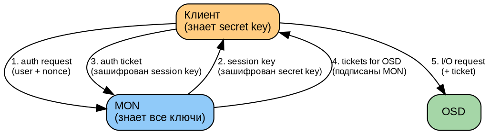
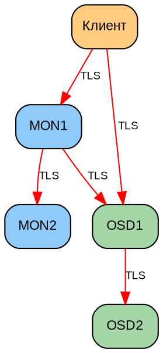
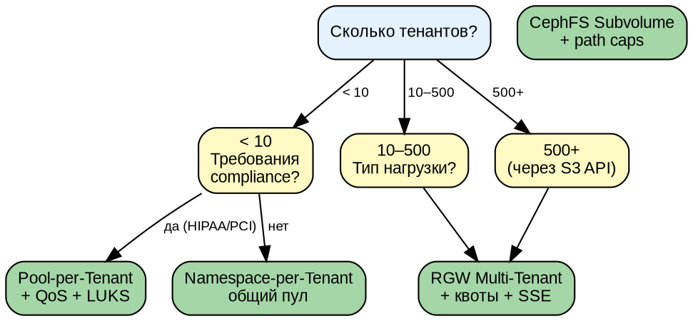
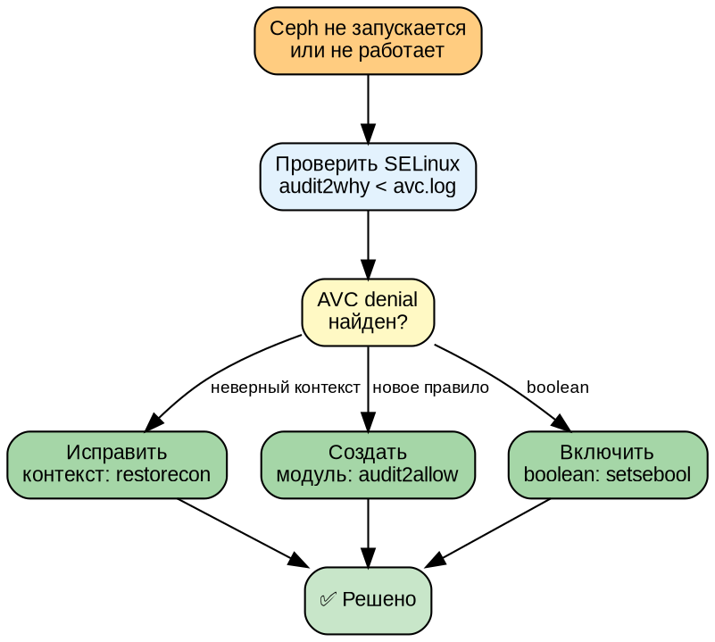

# Часть IX. Безопасность *(30 стр.)*

> **Цель:** освоить модель безопасности Ceph — CephX, авторизацию (caps), шифрование at-rest и in-transit.
> **После этой части вы сможете:** создать пользователя с минимальными правами, ограничить доступ по пулам и подсетям, включить шифрование дисков и сети.

---

## Глава 31. CephX: аутентификация и авторизация *(18 стр.)*

### 31.1. CephX: цепочка доверия *(3 стр.)*

**CephX** (Ceph eXtended Authentication) — протокол аутентификации и авторизации, встроенный в Ceph. Он обеспечивает:

- **Аутентификацию** (кто ты?) — клиент доказывает MON, что он тот, за кого себя выдаёт
- **Авторизацию** (что тебе можно?) — MON выдаёт клиенту capabilities (разрешения)
- **Целостность и конфиденциальность** — канал между клиентом и Ceph шифруется (MSGR2 secure mode)

**Как работает CephX (рукопожатие):**



1. Клиент отправляет MON запрос: «я client.admin, вот случайное число (nonce)»
2. MON генерирует сессионный ключ и шифрует его секретным ключом клиента (который знает и MON, и клиент из keyring). Только настоящий клиент сможет расшифровать.
3. Клиент расшифровывает сессионный ключ, создаёт «билет» (ticket) и отправляет MON
4. MON проверяет билет и выдаёт клиенту tickets для OSD — подписанные MON разрешения на доступ. OSD доверяют MON (у них общий секрет).
5. Клиент отправляет запросы напрямую OSD с приложенным ticket-ом. OSD проверяет подпись MON и выполняет операцию.

**Сессионные ключи:** временные, автоматически обновляются. Даже если злоумышленник перехватит сессионный ключ — он действителен ограниченное время.

---

### 31.2. keyring, caps, profiles *(4 стр.)*

**keyring** — файл, содержащий секретные ключи пользователя:

```bash
cat /etc/ceph/ceph.client.admin.keyring
# [client.admin]
#     key = AQDs...==
#     caps mds = "allow *"
#     caps mon = "allow *"
#     caps osd = "allow *"
```

**Capabilities (caps — разрешения):** определяют, что пользователь может делать. Синтаксис:

```
caps <daemon_type> = "<permissions>"
```

| Префикс | Значение |
|---------|----------|
| `allow r` | Только чтение |
| `allow rw` | Чтение и запись |
| `allow rwx` | Чтение, запись, выполнение (управляющие операции) |
| `allow *` | Всё разрешено (полный доступ) |
| `allow class-read` | Читать объекты определённого класса (RBD) |
| `allow class-write` | Писать объекты класса |
| `profile <name>` | Предустановленный профиль прав |

**Ограничение по пулам:**
```bash
allow rwx pool=app_data          # только пул app_data
allow rwx pool=app_data,logs     # несколько пулов
allow rw pool=cephfs_data        # только rw на cephfs_data
allow r pool=prod                # только чтение prod
allow rwx                        # все пулы
```

**Ограничение по namespace:**
```bash
# Namespace — логический раздел внутри пула
allow rwx pool=data namespace=tenant_a  # только namespace tenant_a
```

**Ограничение по подсети:**
```bash
ceph auth caps client.app mon 'allow r' \
    osd 'allow rwx pool=app_data' \
    network 10.0.1.0/24
# Пользователь client.app может подключаться только из подсети 10.0.1.0/24!
```

**Построчный разбор `ceph auth get`:**

```bash
ceph auth get client.admin
# exported keyring for client.admin
# [client.admin]
#     key = AQD...==
#     caps mds = "allow *"    # полный доступ к MDS (CephFS)
#     caps mon = "allow *"    # полный доступ к MON (управление)
#     caps osd = "allow *"    # полный доступ ко всем OSD
```

**Profiles (предустановленные профили):**

```bash
ceph auth get client.bootstrap-osd
# caps mon = "allow profile bootstrap-osd"
# profile bootstrap-osd включает: rwx на mon + rwx на osd для создания OSD
```

---

### 31.3. Пользователи: создание, отзыв, аудит *(3 стр.)*

```bash
# Создать пользователя
ceph auth add client.myapp \
    mon 'allow r' \
    osd 'allow rwx pool=app_data, allow r pool=logs'

# Создать пользователя с генерацией ключа
ceph auth get-or-create client.myapp \
    mon 'allow r' \
    osd 'allow rwx pool=app_data' \
    -o /etc/ceph/ceph.client.myapp.keyring

# Просмотр всех пользователей
ceph auth ls

# Детальная информация о пользователе
ceph auth get client.myapp

# Изменить права (caps)
ceph auth caps client.myapp \
    mon 'allow r' \
    osd 'allow rwx pool=new_pool'

# Отозвать пользователя
ceph auth del client.myapp

# Экспорт ключей (бэкап)
ceph auth export > /backup/auth-export-$(date +%Y%m%d).txt

# Импорт ключей (восстановление)
ceph auth import < /backup/auth-export.txt
```

---

### 31.4. Ограничение доступа: пулы, namespaces, подсети *(3 стр.)*

**Сценарий: SaaS-платформа, изолируем тенантов:**

```bash
# Тенант A: namespace tenant_a в общем пуле data
ceph auth add client.tenant_a \
    mon 'allow r' \
    osd 'allow rwx pool=data namespace=tenant_a'

# Тенант B: namespace tenant_b в том же пуле
ceph auth add client.tenant_b \
    mon 'allow r' \
    osd 'allow rwx pool=data namespace=tenant_b'

# tenant_a НЕ видит объекты tenant_b и наоборот!
```

**Сценарий: приложение имеет доступ только на чтение production-пула:**
```bash
ceph auth add client.readonly \
    mon 'allow r' \
    osd 'allow r pool=prod'
```

**Сценарий: ограничение по IP (защита от утечки ключа):**
```bash
ceph auth add client.secure \
    mon 'allow r' \
    osd 'allow rwx pool=secure_data' \
    network 10.0.5.0/24,10.0.6.10/32
# Ключ client.secure работает ТОЛЬКО с IP 10.0.5.x или 10.0.6.10
```

---

### 31.5. Практикум *(5 стр.)*

**Задача:** создать трёх пользователей с разными уровнями доступа.

```bash
# 1. Администратор (полный доступ)
# Уже есть: client.admin. Убедимся:
ceph auth get client.admin | grep caps

# 2. Разработчик (rw в dev-пул, r в prod-пул)
ceph auth add client.developer \
    mon 'allow r' \
    osd 'allow rwx pool=dev, allow r pool=prod'
ceph auth get client.developer -o /etc/ceph/ceph.client.developer.keyring

# Проверим:
rados -n client.developer -k /etc/ceph/ceph.client.developer.keyring \
    lspools
# Должен видеть dev и prod

rados -n client.developer -k /etc/ceph/ceph.client.developer.keyring \
    put test-obj /etc/hostname -p dev
# OK — запись в dev

rados -n client.developer -k /etc/ceph/ceph.client.developer.keyring \
    put test-obj /etc/hostname -p prod
# ERROR: Permission denied! (только r на prod)

# 3. Читатель (только r в prod)
ceph auth add client.reader \
    mon 'allow r' \
    osd 'allow r pool=prod'
ceph auth get client.reader -o /etc/ceph/ceph.client.reader.keyring

rados -n client.reader -k /etc/ceph/ceph.client.reader.keyring \
    get test-obj -p prod
# OK — чтение

rados -n client.reader -k /etc/ceph/ceph.client.reader.keyring \
    put test-obj /etc/hostname -p prod
# ERROR: Permission denied! (нет write)

# 4. Ограничение пула (dev — только dev-пул)
rados -n client.developer -k ... lspools
# Должен видеть: dev, prod

rados -n client.developer -k ... ls -p admin_pool
# ERROR: Permission denied! (нет доступа к admin_pool)
```

**Контрольные вопросы:**
1. Может ли `client.reader` прочитать данные из пула `dev`? (Нет — только `prod`)
2. Может ли `client.developer` удалить объект из `dev`? (Да — `rwx`)
3. Что произойдёт, если `client.developer` попытается выполнить `ceph osd tree`?
   (Ошибка — для этого нужен `allow rwx` на mon, а у него только `allow r`)

---

## Глава 32. Шифрование *(12 стр.)*

### 32.1. At-rest (LUKS) и in-transit (TLS) *(4 стр.)*

**Шифрование at-rest (данные на диске):**

Используется LUKS (Linux Unified Key Setup) — стандарт шифрования дисков в Linux поверх dm-crypt:

```bash
# При создании OSD указать шифрование
ceph orch daemon add osd <host>:/dev/sdb --encrypted

# Или в OSD spec (YAML):
service_type: osd
service_id: encrypted_osd
placement:
  host_pattern: '*'
data_devices:
  paths:
    - /dev/sdb
  encrypted: true
```

**Как работает LUKS на OSD:**
```
Приложение → OSD → BlueStore → LUKS (шифрует) → диск
```
- Данные шифруются/расшифровываются «на лету» на уровне блочного устройства
- Ключи LUKS управляются через `ceph config-key`
- Производительность: −5–10% (аппаратное ускорение AES-NI в современных CPU)

**Шифрование in-transit (данные в сети):**

Ceph использует MSGR2 с TLS для шифрования всех сетевых соединений:

```bash
# Включить secure mode (требует MSGR2)
ceph config set mon ms_mode secure
ceph config set osd ms_mode secure
ceph config set client ms_mode secure
```

**Что шифруется при `ms_mode=secure`:**
- MON ↔ MON (Paxos-сообщения, синхронизация)
- MON → Клиент (карты кластера, аутентификация)
- Клиент ↔ OSD (данные)
- OSD ↔ OSD (репликация, recovery)



**Проверка:**
```bash
tcpdump -i eth0 port 6789 -c 10 -X
# До secure: видно содержимое пакетов (ceph status...)
# После secure: только зашифрованные данные
```

---

### 32.2. SSE-S3 на RGW *(3 стр.)*

**SSE (Server-Side Encryption)** — шифрование объектов на стороне сервера. RGW поддерживает три режима:

| Режим | Где ключи | Описание |
|-------|----------|----------|
| **SSE-S3** | Ceph (внутреннее) | Ключи управляются Ceph. Клиент просто указывает заголовок |
| **SSE-KMS** | Внешний KMIP (HashiCorp Vault, etc.) | Ключи во внешней системе управления |
| **SSE-C** | Клиент | Клиент передаёт ключ с каждым запросом |

**SSE-S3 (самый простой):**

Клиент (boto3):
```python
s3.put_object(
    Bucket='my-bucket',
    Key='secret-doc.pdf',
    Body=open('secret-doc.pdf', 'rb'),
    ServerSideEncryption='AES256'
)
# Объект хранится в Ceph в зашифрованном виде
```

**Настройка SSE-KMS с HashiCorp Vault:**
```bash
radosgw-admin zone modify --rgw-zone=default \
    --rgw_crypt_s3_kms_backend=vault \
    --rgw_crypt_vault_auth=token \
    --rgw_crypt_vault_token_file=/etc/ceph/vault.token \
    --rgw_crypt_vault_addr=http://vault:8200
```

---

### 32.3. Практикум *(5 стр.)*

**Часть 1: LUKS на тестовом OSD**

```bash
# 1. Создать OSD с шифрованием
ceph orch daemon add osd ceph-osd1:/dev/sdc --encrypted

# 2. Проверить, что диск зашифрован
lsblk | grep sdc
# sdc                  8:32   0   20G  0 disk
# └─ceph-<uuid>      253:0    0   20G  0 crypt  ← LUKS!
#   └─ceph--block    253:1    0   20G  0 lvm

# 3. Проверить ключи LUKS
ceph config-key ls | grep dm-crypt
# dm-crypt/osd/<fsid>/luks
```

**Часть 2: MSGR2 secure mode**

```bash
# 1. Проверить текущий режим
ceph config get mon ms_mode
# async secure (если включён)

# 2. Включить TLS на MON
ceph config set mon ms_mode secure
ceph config set osd ms_mode secure

# 3. Перехватить трафик ДО
tcpdump -i eth0 -c 10 -X port 6789
# Видно: client.admin...

# 4. Перехватить трафик ПОСЛЕ
tcpdump -i eth0 -c 10 -X port 6789
# Видно только: ... (бинарные зашифрованные данные)

# 5. Проверить, что кластер работает
ceph status  # HEALTH_OK
```

**Часть 3: Замер производительности**

```bash
# До шифрования:
rados bench -p test 60 write --no-cleanup
# Bandwidth: 456 MB/s

# После включения LUKS + TLS:
rados bench -p test 60 write --no-cleanup
# Bandwidth: 410 MB/s (~10% снижение)
```

---

## Глава 33. Автоматизация управления ключами CephX *(14 стр.)*

### 33.1. Проблематика ручного управления ключами *(2 стр.)*

Ручное управление ключами CephX через `ceph auth add/del/caps` работает в небольших кластерах, но в production-окружении возникают проблемы:

- **Ротация ключей.** Секретные ключи должны периодически обновляться (best practice: раз в 90 дней). Без автоматизации это трудозатратно и чревато ошибками.
- **Аудит.** Кто, когда и какие права выдал? Без логирования операций с ключами невозможно провести расследование инцидента.
- **Orphan keys.** Разработчик уволился, а его ключ продолжает существовать. Висящие ключи — уязвимость.
- **Consistency.** В кластере из сотен OSD бутстрап-ключи должны быть синхронизированы.

**Принципы автоматизации:**

1. Ключи — конфигурация как код (Keyring-as-Code)
2. Ротация по расписанию (cron/systemd timer)
3. Централизованный аудит (логирование в SIEM)
4. Интеграция с системами оркестрации (Ansible, Kubernetes, Vault)

### 33.2. Сценарий 1: Ротация ключей клиентов через cron *(3 стр.)*

```bash
#!/bin/bash
# /usr/local/bin/ceph-key-rotator.sh
# Автоматическая ротация ключей клиентов

set -euo pipefail

LOG_FILE="/var/log/ceph/key-rotation.log"
ROTATION_PERIOD_DAYS=90
BACKUP_DIR="/etc/ceph/keyring-backups/$(date +%Y%m%d)"
CLIENTS_FILE="/etc/ceph/rotatable-clients.conf"  # список клиентов для ротации

log() {
    echo "[$(date '+%Y-%m-%dT%H:%M:%S')] $*" | tee -a "$LOG_FILE"
}

mkdir -p "$BACKUP_DIR"

while IFS= read -r client; do
    [[ -z "$client" || "$client" =~ ^# ]] && continue
    
    log "Ротирую ключ для $client..."
    
    # 1. Экспорт текущих caps
    CAPS_FILE=$(mktemp)
    ceph auth get "$client" > "$CAPS_FILE" 2>/dev/null || {
        log "WARN: клиент $client не найден, пропускаю"
        rm -f "$CAPS_FILE"
        continue
    }
    
    # 2. Бэкап текущего ключа
    ceph auth get "$client" -o "$BACKUP_DIR/${client}.keyring"
    
    # 3. Извлечение caps
    MON_CAPS=$(grep "caps mon" "$CAPS_FILE" | cut -d'"' -f2)
    OSD_CAPS=$(grep "caps osd" "$CAPS_FILE" | cut -d'"' -f2)
    MDS_CAPS=$(grep "caps mds" "$CAPS_FILE" | cut -d'"' -f2)
    
    # 4. Удаление старого ключа
    ceph auth del "$client"
    
    # 5. Создание нового ключа с теми же caps
    ceph auth get-or-create "$client" \
        ${MON_CAPS:+mon "$MON_CAPS"} \
        ${OSD_CAPS:+osd "$OSD_CAPS"} \
        ${MDS_CAPS:+mds "$MDS_CAPS"} \
        -o "/etc/ceph/ceph.${client}.keyring"
    
    log "OK: $client обновлён, старый ключ в $BACKUP_DIR/${client}.keyring"
    rm -f "$CAPS_FILE"
done < "$CLIENTS_FILE"

log "Ротация завершена. Бэкапы: $BACKUP_DIR"
```

**Файл `/etc/ceph/rotatable-clients.conf`:**
```
# Клиенты, подлежащие автоматической ротации
# Формат: client.<name>
client.app1
client.app2
client.monitoring
```

**Установка cron (systemd timer — предпочтительный вариант):**

```bash
# /etc/systemd/system/ceph-key-rotation.service
[Unit]
Description=CephX Key Rotation
After=network.target

[Service]
Type=oneshot
ExecStart=/usr/local/bin/ceph-key-rotator.sh
User=root
StandardOutput=journal
StandardError=journal

# /etc/systemd/system/ceph-key-rotation.timer
[Unit]
Description=Rotate CephX keys every 90 days

[Timer]
OnCalendar=*-01,04,07,10-01 03:00:00
Persistent=true

[Install]
WantedBy=timers.target
```

```bash
systemctl enable ceph-key-rotation.timer
systemctl start ceph-key-rotation.timer
systemctl list-timers | grep ceph
```

### 33.3. Сценарий 2: Keyring-as-Code с Ansible *(3 стр.)*

Управление ключами через Ansible позволяет хранить определения пользователей в Git и применять их к кластеру декларативно.

**Инвентарь (inventory):**

```yaml
# group_vars/all/ceph_users.yml
ceph_users:
  - name: client.app_prod
    mon_caps: "allow r"
    osd_caps: "allow rwx pool=prod"
    state: present
    
  - name: client.app_stage
    mon_caps: "allow r"
    osd_caps: "allow rwx pool=stage"
    state: present
    
  - name: client.former_employee
    state: absent  # ключ будет удалён при следующем прогоне!
```

**Ansible playbook:**

```yaml
# ceph-users.yml
- name: Manage CephX users
  hosts: mons[0]
  gather_facts: false
  vars:
    ceph_conf_dir: /etc/ceph

  tasks:
    - name: Получить список текущих пользователей
      command: ceph auth ls -f json
      register: current_users_raw
      changed_when: false

    - name: Распарсить JSON
      set_fact:
        current_users: "{{ current_users_raw.stdout | from_json | dict2items
                          | selectattr('key', 'match', '^client\\.')
                          | map(attribute='key') | list }}"

    - name: Создать или обновить пользователя
      command: >
        ceph auth get-or-create {{ item.name }}
        mon '{{ item.mon_caps | default("allow r") }}'
        osd '{{ item.osd_caps | default("") }}'
        mds '{{ item.mds_caps | default("") }}'
        -o "{{ ceph_conf_dir }}/ceph.{{ item.name }}.keyring"
      when: item.state | default('present') == 'present'
      loop: "{{ ceph_users }}"

    - name: Удалить отсутствующих пользователей
      command: ceph auth del {{ item.name }}
      when: item.state | default('present') == 'absent'
      loop: "{{ ceph_users }}"

    - name: Найти орфанные ключи (есть в Ceph, нет в Ansible)
      set_fact:
        managed_users: "{{ ceph_users | selectattr('state', 'undefined') | map(attribute='name') | list
                          + ceph_users | selectattr('state', 'equalto', 'present') | map(attribute='name') | list }}"
        orphaned_users: "{{ current_users | difference(managed_users | default([])) }}"

    - name: Вывести орфанные ключи
      debug:
        msg: "Орфанный ключ: {{ item }} (не управляется Ansible)"
      loop: "{{ orphaned_users }}"
```

**GitOps workflow:**

```bash
# Разработчик создаёт PR с добавлением пользователя:
git checkout -b feat/add-user-app3
vim group_vars/all/ceph_users.yml
git commit -m "feat: add client.app3 with rw to pool=data"
git push origin feat/add-user-app3

# После мёрджа PR CI/CD запускает Ansible:
ansible-playbook -i inventory/prod ceph-users.yml --diff
# Показывает diff — кто добавлен, кто удалён, кто изменён
```

### 33.4. Сценарий 3: Интеграция с HashiCorp Vault *(3 стр.)*

Vault выступает центральным хранилищем секретов и движком динамической генерации ключей с автоматическим TTL и отзывом.

**Архитектура:**

```
┌──────────┐     ┌─────────────┐     ┌──────────┐
│  Клиент  │────▶│ Vault Agent │────▶│   Ceph   │
│  (k8s)   │     │ (injector)  │     │ Cluster  │
└──────────┘     └─────────────┘     └──────────┘
                       │
                       ▼
                ┌──────────┐
                │  Vault   │
                │  Server  │
                └──────────┘
```

**Настройка Vault Ceph Secret Engine:**

```bash
# 1. Активировать Ceph backend в Vault
vault secrets enable -path=ceph vault-plugin-secrets-ceph

# 2. Настроить подключение к Ceph
vault write ceph/config/connection \
    admin_key="$(ceph auth get client.admin -f json | jq -r '.[0].key')" \
    mon_hosts="mon1:6789,mon2:6789,mon3:6789"

# 3. Создать роль для динамических ключей
vault write ceph/roles/myapp \
    mon_caps="allow r" \
    osd_caps="allow rwx pool=app_data" \
    ttl="24h" \
    max_ttl="168h"  # 7 дней максимум
```

**Получение временного ключа:**

```bash
# Клиент запрашивает временный ключ:
vault read ceph/creds/myapp
# Key              Value
# ---              -----
# lease_id         ceph/creds/myapp/abc123
# lease_duration   24h
# lease_renewable  true
# client_name      client.v_token_myapp_xyz
# key              AQDs...==

# Vault автоматически:
# 1. Создал пользователя client.v_token_myapp_xyz в Ceph
# 2. По истечении TTL (24h) — автоматически удалит ключ из Ceph
```

**Интеграция с Kubernetes (Vault Sidecar Injector):**

```yaml
# pod-spec.yaml
apiVersion: v1
kind: Pod
metadata:
  annotations:
    vault.hashicorp.com/agent-inject: "true"
    vault.hashicorp.com/role: "myapp-ceph"
    vault.hashicorp.com/agent-inject-secret-ceph-keyring: "ceph/creds/myapp"
spec:
  containers:
    - name: app
      image: myapp:latest
      # Vault sidecar автоматически записывает ключ в:
      # /vault/secrets/ceph-keyring
      env:
        - name: CEPH_KEYRING
          value: /vault/secrets/ceph-keyring
```

**Безопасность Vault-подхода:**

- Ключи живут ограниченное время (TTL), после чего Ceph их автоматически забывает
- Отзыв ключа через `vault lease revoke`
- Vault audit log содержит все операции выдачи/отзыва
- Нет долгоживущих статических ключей на дисках клиента

### 33.5. Аудит и уведомления *(3 стр.)*

**Включение аудита Ceph:**

```bash
# Ceph сохраняет аудит-лог всех операций MON
ceph config set mon mon_cluster_log_to_syslog true
# Аудит-лог пишется в /var/log/ceph/ceph-mon.*.log

# Парсинг аудита:
grep "from='client" /var/log/ceph/ceph-mon.$(hostname).log | \
    grep -E "auth (add|del|caps|get-or-create)"
```

**Скрипт мониторинга изменений:**

```bash
#!/bin/bash
# /usr/local/bin/ceph-auth-watcher.sh
# Отслеживает изменения в ключах и отправляет алерт

WATCH_LOG="/var/log/ceph/ceph-mon.$(hostname).log"
LAST_POS="/var/tmp/ceph-auth-watch.pos"
WEBHOOK_URL="https://hooks.slack.com/..."

# Инициализация позиции
[[ ! -f "$LAST_POS" ]] && wc -c < "$WATCH_LOG" > "$LAST_POS"

tail -c +$(($(cat "$LAST_POS") + 1)) "$WATCH_LOG" | \
    grep -E "auth (add|del|caps|get-or-create)" | while read -r line; do
    
    curl -s -X POST "$WEBHOOK_URL" \
        -H "Content-Type: application/json" \
        -d "{\"text\": \"🔑 CephX change: $line\"}"
done

wc -c < "$WATCH_LOG" > "$LAST_POS"
```

**Интеграция с SIEM (на примере ELK):**

```yaml
# filebeat.yml — отправка логов Ceph в Elasticsearch
filebeat.inputs:
  - type: log
    enabled: true
    paths:
      - /var/log/ceph/ceph-mon.*.log
    include_lines: ['auth ', 'from=']
    fields:
      component: ceph_auth
      cluster: prod

output.elasticsearch:
  hosts: ["elasticsearch:9200"]
  index: "ceph-audit-%{+yyyy.MM.dd}"
```

**Grafana dashboard для аудита:**

```sql
-- PromQL: количество операций auth за последний час
rate(ceph_mon_auth_requests_total[1h])

-- PromQL: активные пользователи (метрика из ceph-exporter)
ceph_num_clients_by_type{type="client"}

-- Алерт: новый пользователь за 5 минут
changes(ceph_auth_users_total[5m]) > 0
```

**Чек-лист аудита ключей (раз в квартал):**

| Проверка | Команда | Ожидание |
|----------|---------|----------|
| Все пользователи задокументированы | `ceph auth ls` → сравнить с inventory | 100% совпадение |
| Нет `allow *` кроме admin | `ceph auth ls \| grep 'allow \*'` | Только client.admin |
| Нет пользователей без network restriction | Ручная проверка | Все внешние клиенты ограничены IP |
| Срок действия ключей < 90 дней | `stat /etc/ceph/ceph.client.*.keyring` | Не старше 90 дней |
| Нет орфанных ключей | Сравнить с Ansible inventory | Расхождений нет |

---

## Глава 34. Multi-Tenant: паттерны изоляции *(12 стр.)*

### 34.1. Модели multi-tenancy в Ceph *(2 стр.)*

Ceph поддерживает несколько уровней изоляции тенантов (арендаторов). Выбор модели зависит от требований к безопасности, стоимости и сложности:

| Уровень | Механизм | Изоляция | Сложность | Overhead |
|---------|----------|----------|-----------|----------|
| **Логический** | Namespace + caps CephX | Средняя | Низкая | Минимальный |
| **Pool-based** | Отдельный пул на тенанта | Высокая | Средняя | Средний (PG) |
| **RADOS Namespace** | namespace внутри пула | Средняя | Низкая | Минимальный |
| **RGW Multi-site** | Отдельная зона/группа размещения | Максимальная | Высокая | Высокий |

### 34.2. Паттерн 1: Namespace-per-Tenant (логическая изоляция) *(3 стр.)*

Самый лёгкий паттерн. Все тенанты используют один пул, но каждый имеет доступ только к своему namespace.

```bash
# Общий пул для всех тенантов
ceph osd pool create tenant_data 128 128

# Тенант A
ceph auth add client.tenant_a \
    mon 'allow r' \
    osd 'allow rwx pool=tenant_data namespace=tenant_a'

# Тенант B
ceph auth add client.tenant_b \
    mon 'allow r' \
    osd 'allow rwx pool=tenant_data namespace=tenant_b'
```

**Проверка изоляции:**

```bash
# Тенант A пишет свой объект
rados -n client.tenant_a -k keyring.a \
    put obj1 /etc/hostname \
    -p tenant_data -N tenant_a

# Тенант B не видит объект тенанта A
rados -n client.tenant_b -k keyring.b \
    ls -p tenant_data -N tenant_b
# (пусто — obj1 не виден)

# Тенант B не может читать namespace тенанта A
rados -n client.tenant_b -k keyring.b \
    get obj1 -p tenant_data -N tenant_a
# ERROR: Permission denied
```

**Плюсы и минусы Namespace-per-Tenant:**

| Плюсы | Минусы |
|-------|--------|
| ✅ Минимальный overhead (нет лишних PG) | ❌ Нет изоляции на уровне производительности (noisy neighbour) |
| ✅ Простота управления | ❌ Квоты сложнее настроить (на уровне namespace) |
| ✅ Быстрое создание тенанта | ❌ Снапшоты и клоны — на весь пул |
| ✅ Подходит для сотен мелких тенантов | ❌ Не подходит для требований compliance (PCI DSS, HIPAA) |

### 34.3. Паттерн 2: Pool-per-Tenant (физическая изоляция) *(3 стр.)*

Каждый тенант получает собственный пул. Изоляция на уровне данных, производительности и снапшотов.

```bash
#!/bin/bash
# Создание нового тенанта с отдельным пулом

TENANT=$1
PG_NUM=32  # Можно увеличить для крупных тенантов

# 1. Создать пул
ceph osd pool create "tenant_${TENANT}_data" $PG_NUM
ceph osd pool create "tenant_${TENANT}_metadata" $PG_NUM

# 2. Создать пользователя с доступом только к своим пулам
ceph auth add client.${TENANT} \
    mon "allow r" \
    osd "allow rwx pool=tenant_${TENANT}_data, allow rwx pool=tenant_${TENANT}_metadata" \
    -o /etc/ceph/ceph.client.${TENANT}.keyring

# 3. Настроить квоты
ceph osd pool set-quota "tenant_${TENANT}_data" max_objects 1000000
ceph osd pool set-quota "tenant_${TENANT}_data" max_bytes 1073741824000  # 1TB

# 4. Создать RBD image для тенанта (опционально)
rbd -n client.${TENANT} pool init "tenant_${TENANT}_data"
rbd -n client.${TENANT} create "tenant_${TENANT}_data/volume1" --size 100G

echo "Тенант $TENANT создан. Keyring: /etc/ceph/ceph.client.${TENANT}.keyring"
```

**Изоляция производительности (QoS):**

```bash
# Ограничить IOPS и пропускную способность на пул тенанта
ceph osd pool set "tenant_${TENANT}_data" rbd_qos_iops_limit 1000
ceph osd pool set "tenant_${TENANT}_data" rbd_qos_bps_limit 104857600  # 100 MB/s
ceph osd pool set "tenant_${TENANT}_data" rbd_qos_read_iops_limit 700
ceph osd pool set "tenant_${TENANT}_data" rbd_qos_write_iops_limit 300
```

### 34.4. Паттерн 3: RGW Multi-Tenant (S3-совместимая изоляция) *(2 стр.)*

RGW (RADOS Gateway) предоставляет S3/Swift-совместимый API с нативной поддержкой multi-tenancy через **тенанты (tenants) в S3**.

```bash
# Создать пользователя в тенанте
radosgw-admin user create \
    --uid=tenant_a/user1 \
    --display-name="Tenant A — User 1" \
    --tenant=tenant_a \
    --access-key=A1B2C3D4E5F6G7H8 \
    --secret=abcdef1234567890abcdef1234567890

# Создать bucket в тенанте
# (через S3 клиент с access/secret ключом user1)
aws s3 mb s3://my-bucket --endpoint-url http://rgw:7480
# Bucket создан как tenant_a:my-bucket (префикс с двоеточием)

# Пользователь tenant_b не видит bucket'ы tenant_a
# RGW автоматически изолирует их на уровне API
```

**Квоты на уровне RGW пользователя:**

```bash
# Ограничить пользователя тенанта
radosgw-admin quota set \
    --uid=tenant_a/user1 \
    --quota-scope=user \
    --max-size=107374182400  # 100GB
    --max-objects=100000

# Включить квоту
radosgw-admin quota enable \
    --uid=tenant_a/user1 \
    --quota-scope=user
```

### 34.5. Паттерн 4: CephFS Subvolume с изоляцией *(2 стр.)*

CephFS поддерживает subvolume — изолированные файловые деревья с независимыми снапшотами и квотами.

```bash
# Создать subvolume для тенанта
ceph fs subvolumegroup create cephfs tenants
ceph fs subvolume create cephfs tenant_a_vol \
    --group_name=tenants \
    --size=107374182400  # 100GB

# Создать пользователя с доступом только к своему subvolume
ceph auth add client.tenant_a_fs \
    mon 'allow r' \
    osd 'allow rwx pool=cephfs_data' \
    mds "allow rw path=/volumes/tenants/tenant_a_vol"

# Монтирование на клиенте
mount -t ceph mon1:6789:/volumes/tenants/tenant_a_vol \
    /mnt/tenant_a \
    -o name=tenant_a_fs,secretfile=/etc/ceph/ceph.client.tenant_a_fs.keyring

# Tenant A видит только свой subvolume:
ls /mnt/tenant_a
# (корень subvolume, только файлы tenant_a)
```

**Path-based ограничения в CephFS:**

```bash
# Тенант видит только /tenants/acme-corp/
ceph auth caps client.acme_corp \
    mon 'allow r' \
    osd 'allow rw pool=cephfs_data' \
    mds 'allow rw path=/tenants/acme_corp'

# Read-only доступ к shared/
ceph auth caps client.acme_corp_readonly \
    mon 'allow r' \
    osd 'allow r pool=cephfs_data' \
    mds 'allow r path=/shared'
```

### 34.6. Сравнительная таблица и выбор паттерна *(2 стр.)*



**Ключевой принцип безопасности multi-tenant:**
> Каждый тенант должен иметь **уникальный ключ CephX**, ограниченный только его ресурсами (пул, namespace, путь). Ни при каких условиях не используйте один ключ для нескольких тенантов. При компрометации ключа пострадает только один тенант.

---

## Глава 35. Управление жизненным циклом TLS-сертификатов *(10 стр.)*

### 35.1. Архитектура TLS в Ceph *(2 стр.)*

Ceph использует TLS на двух уровнях:

| Уровень | Протокол | Защищает | Сертификаты |
|---------|----------|----------|-------------|
| **MSGR2** | Встроенный TLS | MON↔MON, MON↔OSD, Клиент↔Ceph | Автоматические (self-signed) |
| **RGW** | HTTPS (OpenSSL) | Клиент↔RGW (S3/Swift) | Внешние (CA-подписанные) |
| **Dashboard** | HTTPS | Администратор↔Dashboard | Внешние (CA-подписанные) |
| **Prometheus/Grafana** | HTTPS | Метрики | Внешние |

**MSGR2 (встроенный TLS):**

При `ms_mode=secure` Ceph автоматически генерирует self-signed сертификаты для каждого демона. Эти сертификаты хранятся в `ceph config-key`:

```bash
# Просмотр сертификатов MSGR2
ceph config-key dump | grep msgr2

# Сертификат MON хранится в:
# /var/lib/ceph/mon/ceph-$(hostname)/keyring
# и распространяется через MON store
```

**RGW HTTPS:**

RGW требует ручной настройки TLS-сертификатов:

```bash
# /etc/ceph/ceph.conf
[client.rgw.$(hostname)]
rgw_frontends = beast port=7480 ssl_port=7481 ssl_certificate=/etc/ceph/rgw.pem
```

### 35.2. cert-manager: автоматизация TLS для RGW в Kubernetes *(3 стр.)*

В Kubernetes-окружении cert-manager (CNCF-проект) автоматизирует выпуск и обновление TLS-сертификатов.

**Установка cert-manager:**

```bash
helm repo add jetstack https://charts.jetstack.io
helm install cert-manager jetstack/cert-manager \
    --namespace cert-manager --create-namespace \
    --set installCRDs=true
```

**Настройка Let's Encrypt ClusterIssuer:**

```yaml
apiVersion: cert-manager.io/v1
kind: ClusterIssuer
metadata:
  name: letsencrypt-prod
spec:
  acme:
    server: https://acme-v02.api.letsencrypt.org/directory
    email: admin@example.com
    privateKeySecretRef:
      name: letsencrypt-prod-account-key
    solvers:
      - http01:
          ingress:
            class: nginx
```

**Выпуск сертификата для RGW:**

```yaml
apiVersion: cert-manager.io/v1
kind: Certificate
metadata:
  name: rgw-tls
  namespace: ceph
spec:
  secretName: rgw-tls-secret
  issuerRef:
    name: letsencrypt-prod
    kind: ClusterIssuer
  commonName: s3.example.com
  dnsNames:
    - s3.example.com
    - rgw.example.com
  duration: 2160h   # 90 дней
  renewBefore: 720h  # обновить за 30 дней до истечения
  privateKey:
    algorithm: RSA
    size: 2048
```

**Интеграция с Rook-Ceph (если Ceph развёрнут через Rook):**

```yaml
apiVersion: ceph.rook.io/v1
kind: CephCluster
spec:
  network:
    security:
      tls:
        enabled: true
        # Rook автоматически использует cert-manager для MSGR2!
        certManagerIssuerRef:
          name: rook-ceph-issuer
          kind: Issuer
```

### 35.3. Ручное управление сертификатами для bare-metal *(2 стр.)*

Для bare-metal кластеров без Kubernetes — ручной lifecycle сертификатов RGW.

**Генерация CA и сертификата:**

```bash
#!/bin/bash
# Генерация самоподписанного CA (для внутреннего использования)
# или подписанного корпоративным CA

CA_DIR="/etc/ceph/tls"
mkdir -p "$CA_DIR"

# 1. Создать CA
openssl genrsa -out "$CA_DIR/ca.key" 4096
openssl req -new -x509 -days 3650 -key "$CA_DIR/ca.key" \
    -out "$CA_DIR/ca.crt" \
    -subj "/CN=Ceph Internal CA/O=MyOrg"

# 2. Создать ключ и CSR для RGW
openssl genrsa -out "$CA_DIR/rgw.key" 2048
openssl req -new -key "$CA_DIR/rgw.key" -out "$CA_DIR/rgw.csr" \
    -subj "/CN=s3.example.com" \
    -addext "subjectAltName=DNS:s3.example.com,DNS:rgw.example.com"

# 3. Подписать сертификат
openssl x509 -req -days 365 -in "$CA_DIR/rgw.csr" \
    -CA "$CA_DIR/ca.crt" -CAkey "$CA_DIR/ca.key" \
    -CAcreateserial -out "$CA_DIR/rgw.crt" \
    -extfile <(printf "subjectAltName=DNS:s3.example.com,DNS:rgw.example.com")

# 4. Объединить ключ и сертификат для RGW
cat "$CA_DIR/rgw.key" "$CA_DIR/rgw.crt" > /etc/ceph/rgw.pem
chmod 600 /etc/ceph/rgw.pem
chown ceph:ceph /etc/ceph/rgw.pem

# 5. Применить
ceph config set client.rgw rgw_frontends \
    "beast port=80 ssl_port=443 ssl_certificate=/etc/ceph/rgw.pem"
```

**Скрипт мониторинга истечения сертификатов:**

```bash
#!/bin/bash
# /usr/local/bin/ceph-cert-check.sh
# Проверка срока действия сертификатов Ceph

CERT_DIR="/etc/ceph/tls"
ALERT_DAYS=30  # Алерт за 30 дней до истечения
CRITICAL_DAYS=14

check_cert() {
    local cert_file=$1
    local label=$2
    
    if [[ ! -f "$cert_file" ]]; then
        echo "WARN: $label — файл не найден: $cert_file"
        return
    fi
    
    local expiry
    expiry=$(openssl x509 -enddate -noout -in "$cert_file" \
        | cut -d= -f2)
    local expiry_ts=$(date -d "$expiry" +%s)
    local now_ts=$(date +%s)
    local days_left=$(( ($expiry_ts - $now_ts) / 86400 ))
    
    if [[ $days_left -lt $CRITICAL_DAYS ]]; then
        echo "CRITICAL: $label истекает через $days_left дней ($expiry)"
        /usr/local/bin/send-alert.sh "CRITICAL: Ceph TLS cert expires in $days_left days"
    elif [[ $days_left -lt $ALERT_DAYS ]]; then
        echo "WARNING: $label истекает через $days_left дней ($expiry)"
    else
        echo "OK: $label — $days_left дней до истечения"
    fi
}

check_cert /etc/ceph/rgw.pem "RGW HTTPS"
check_cert "/var/lib/ceph/*/keyring" "MON/OSD MSGR2"

# Крон для ежедневной проверки
# 0 7 * * * /usr/local/bin/ceph-cert-check.sh
```

### 35.4. Обновление сертификатов без даунтайма *(1 стр.)*

**RGW: Hot-reload сертификатов:**

```bash
# 1. Положить новый сертификат
cp new-rgw.pem /etc/ceph/rgw.pem

# 2. Перезагрузить RGW (graceful, без разрыва соединений)
systemctl reload ceph-radosgw@rgw.$(hostname)
# Или через cephadm:
ceph orch daemon restart rgw.$(hostname)

# 3. Проверить
curl -vI https://s3.example.com 2>&1 | grep -A5 "Server certificate"
# Должен показать новый сертификат
```

**Dashboard:**

```bash
# Обновление сертификата Dashboard
ceph config set mgr mgr/dashboard/key /path/to/key.pem
ceph config set mgr mgr/dashboard/crt /path/to/crt.pem
ceph mgr module disable dashboard
ceph mgr module enable dashboard
# Dashboard перезапустится с новым сертификатом
```

### 35.5. Mutual TLS (mTLS) для service-to-service *(2 стр.)*

Mutual TLS требует, чтобы и сервер, и клиент предъявили сертификаты. Это дополнительный уровень аутентификации для критичных сервисов.

**Настройка mTLS на RGW:**

```bash
# RGW с mTLS
ceph config set client.rgw rgw_frontends \
    "beast port=80 ssl_port=443 \
     ssl_certificate=/etc/ceph/rgw.pem \
     ssl_verify_client=on \
     ssl_ca_certificate=/etc/ceph/tls/ca.crt"

# Клиентский запрос с mTLS:
curl --cert /etc/ceph/tls/client.crt \
     --key /etc/ceph/tls/client.key \
     --cacert /etc/ceph/tls/ca.crt \
     https://s3.example.com
```

**mTLS между демонами Ceph (MSGR2):**

```bash
# По умолчанию MSGR2 secure mode использует self-signed сертификаты.
# Для строгой mTLS-аутентификации нужны CA-подписанные сертификаты:

ceph config set global ms_mon_client_mode secure
ceph config set global ms_cluster_mode secure
ceph config set global ms_service_mode secure
ceph config set global ms_client_mode secure

# При использовании общих CA-сертификатов демоны проверяют сертификаты друг друга.
```

**Таблица: сравнение TLS и mTLS:**

| | TLS | mTLS |
|---|---|---|
| Сервер предъявляет сертификат | ✅ | ✅ |
| Клиент проверяет сервер | ✅ | ✅ |
| Клиент предъявляет сертификат | ❌ | ✅ |
| Сервер проверяет клиента | ❌ | ✅ |
| Защита от MITM | ✅ | ✅ |
| Защита от подмены клиента | ❌ | ✅ |
| Overhead | Минимальный | Двойное рукопожатие |

---

## Глава 36. FIPS 140-2 Compliance *(8 стр.)*

### 36.1. Что такое FIPS 140-2 *(1 стр.)*

**FIPS 140-2 (Federal Information Processing Standard)** — стандарт США для криптографических модулей. Требуется для:

- Государственных систем США (NIST)
- Финансовых организаций (FFIEC)
- Медицинских систем (HIPAA — опционально, но рекомендуется)
- Контрактов с правительством США

**Уровни FIPS 140-2:**

| Уровень | Требования |
|---------|------------|
| **Level 1** | Базовые криптоалгоритмы, ПО-реализация |
| **Level 2** | + Tamper-evident защита, ролевая аутентификация |
| **Level 3** | + Физическая защита от вскрытия, identity-based auth |
| **Level 4** | + Защита от физических атак (температура, напряжение) |

Ceph может работать в окружении с FIPS-валидированной криптографией на уровне ОС (RHEL/Fedora crypto policy).

### 36.2. Включение FIPS-режима на RHEL/Rocky *(2 стр.)*

```bash
# Проверить текущий статус FIPS
fips-mode-setup --check
# FIPS mode is disabled.

# Включить FIPS (требует перезагрузки!)
fips-mode-setup --enable

# После перезагрузки:
fips-mode-setup --check
# FIPS mode is enabled.
sysctl crypto.fips_enabled
# crypto.fips_enabled = 1

# Проверить, что ядро в FIPS-режиме
cat /proc/sys/crypto/fips_enabled
# 1
```

**Влияние FIPS на Ceph:**

```bash
# В FIPS-режиме запрещены не-FIPS алгоритмы:
# MD5, SHA-1 (для подписи), DES, RC4, IDEA, Blowfish

# Ceph использует AES-256-GCM, SHA-256, SHA-512 — все FIPS-валидны.
# MSGR2 использует AES-128-GCM и AES-256-GCM — FIPS-совместимо.

# Проверить доступные шифры:
openssl ciphers -v 'FIPS:!LOW:!aNULL:!eNULL' | head -20
```

### 36.3. FIPS-совместимый Ceph: контрольный список *(2 стр.)*

```bash
#!/bin/bash
# /usr/local/bin/ceph-fips-check.sh
# Проверка FIPS-совместимости Ceph

echo "=== FIPS Compliance Check ==="
echo

# 1. Проверить FIPS-режим ОС
echo "1. FIPS mode:"
if [[ "$(cat /proc/sys/crypto/fips_enabled 2>/dev/null)" == "1" ]]; then
    echo "   ✅ FIPS mode enabled"
else
    echo "   ❌ FIPS mode disabled — необходимо включить"
fi

# 2. Проверить ms_mode
echo "2. Messenger mode:"
MS_MODE=$(ceph config get mon ms_mode 2>/dev/null)
if [[ "$MS_MODE" == "secure" ]]; then
    echo "   ✅ ms_mode=secure (TLS для всех соединений)"
else
    echo "   ❌ ms_mode=$MS_MODE — рекомендуется 'secure'"
fi

# 3. Проверить шифрование OSD (LUKS)
echo "3. OSD encryption:"
ENCRYPTED=$(ceph osd metadata | jq -r '.[].encrypted' | sort -u)
if [[ "$ENCRYPTED" == "true" ]]; then
    echo "   ✅ Все OSD зашифрованы (LUKS)"
else
    echo "   ⚠️  Не все OSD зашифрованы (LUKS рекомендуется для FIPS)"
fi

# 4. Проверить алгоритмы подписи
echo "4. Ceph auth signature algorithm:"
ceph config get global auth_cluster_required 2>/dev/null || echo "default"
ceph config get global auth_service_required 2>/dev/null || echo "default"
ceph config get global auth_client_required 2>/dev/null || echo "default"
# Должны быть cephx (основан на AES + HMAC-SHA256)

# 5. Проверить RGW SSE
echo "5. RGW encryption:"
ceph config get client.rgw rgw_crypt_require_encryption 2>/dev/null
# true — включает обязательное SSE
ceph config get client.rgw rgw_crypt_sse_s3_backend 2>/dev/null
# Должен быть FIPS-совместимый бэкенд

# 6. Крипто-политика на уровне ОС
echo "6. System crypto policy:"
update-crypto-policies --show 2>/dev/null
# Должно быть FIPS или FIPS:AD-SUPPORT
```

**Обязательные настройки для FIPS-совместимого Ceph:**

```bash
# 1. Включить шифрование всех OSD
# (см. Главу 32, LUKS)

# 2. Включить secure mode
ceph config set mon ms_mode secure
ceph config set osd ms_mode secure
ceph config set client ms_mode secure

# 3. Отключить не-FIPS алгоритмы
ceph config set global ms_mon_client_sign_algos AES128GCM
ceph config set global ms_mon_cluster_sign_algos AES128GCM

# 4. Включить обязательное SSE на RGW
ceph config set client.rgw rgw_crypt_require_encryption true
ceph config set client.rgw rgw_crypt_sse_s3_backend aes-256

# 5. Настроить ротацию сессионных ключей
ceph config set global auth_mon_ticket_ttl 3600   # 1 час
ceph config set global auth_service_ticket_ttl 7200 # 2 часа
```

### 36.4. Аудит на соответствие FIPS (OpenSCAP) *(2 стр.)*

**SCAP (Security Content Automation Protocol)** — стандарт NIST для автоматической проверки compliance. OpenSCAP — open-source реализация.

```bash
# Установка OpenSCAP
dnf install -y openscap-scanner scap-security-guide

# Проверка ОС на FIPS compliance
oscap xccdf eval \
    --profile xccdf_org.ssgproject.content_profile_fips140_2 \
    --results fips-results.xml \
    --report fips-report.html \
    /usr/share/xml/scap/ssg/content/ssg-rhel9-ds.xml

# Просмотр отчёта:
firefox fips-report.html
# Показывает: compliance score, failed rules, remediation steps
```

**Автоматическое исправление (remediation):**

```bash
# Автоматически исправить найденные несоответствия
oscap xccdf eval --remediate \
    --profile xccdf_org.ssgproject.content_profile_fips140_2 \
    /usr/share/xml/scap/ssg/content/ssg-rhel9-ds.xml
```

**Интеграция SCAP-проверок в CI/CD:**

```yaml
# Пример GitHub Actions для проверки FIPS-compliance инфраструктуры
- name: Run OpenSCAP FIPS check
  run: |
    ansible all -m shell -a "
      oscap xccdf eval \
        --profile fips140_2 \
        --report /tmp/fips-{{ inventory_hostname }}.html \
        /usr/share/xml/scap/ssg/content/ssg-rhel9-ds.xml
    "
- name: Collect reports
  run: ansible all -m fetch -a "src=/tmp/fips-*.html dest=./reports/ flat=yes"
```

### 36.5. FIPS и производительность *(1 стр.)*

```bash
# Замер до FIPS
rados bench -p test 60 write
# Bandwidth: ~450 MB/s

# Замер после включения FIPS
rados bench -p test 60 write
# Bandwidth: ~440 MB/s (снижение ~2–3%)

# FIPS использует аппаратное ускорение AES-NI,
# поэтому влияние минимально на современных CPU (post-2011)
openssl speed -evp aes-256-gcm
# FIPS mode: ~2.5 GB/s на ядро (с AES-NI)
```

---

## Глава 37. Процедуры аудита безопасности *(10 стр.)*

### 37.1. Периодический аудит безопасности Ceph *(2 стр.)*

Регулярные проверки безопасности (quarterly — ежеквартально) должны покрывать:

| Область | Частота | Инструмент |
|---------|---------|------------|
| Пользователи и caps | Ежемесячно | `ceph auth ls` + ручная проверка |
| Сетевые правила | Ежеквартально | `ceph auth ls` + grep network |
| TLS-сертификаты | Еженедельно | cert-check.sh |
| LUKS-статус | Ежеквартально | `ceph osd metadata` |
| Версии и CVE | Ежемесячно | `ceph versions` + CVE database |
| Логи аудита | Непрерывно | SIEM (ELK, Splunk) |
| SELinux violations | Непрерывно | `ausearch -m avc` |

### 37.2. Экспресс-аудит: скрипт `ceph-security-audit.sh` *(3 стр.)*

```bash
#!/bin/bash
# ceph-security-audit.sh — комплексная проверка безопасности Ceph

set -euo pipefail
OUTPUT="/tmp/ceph-security-audit-$(date +%Y%m%d-%H%M%S).txt"
PASS=0; FAIL=0; WARN=0

log_section()  { echo -e "\n===== $1 =====" | tee -a "$OUTPUT"; }
log_pass()     { echo -e "  ✅ PASS: $1" | tee -a "$OUTPUT"; ((PASS++)); }
log_fail()     { echo -e "  ❌ FAIL: $1" | tee -a "$OUTPUT"; ((FAIL++)); }
log_warn()     { echo -e "  ⚠️  WARN: $1" | tee -a "$OUTPUT"; ((WARN++)); }

# ─── 1. CephX Audit ───
log_section "1. CephX Users & Caps"

# 1.1. Проверить client.admin — единственный с allow *
USERS=$(ceph auth ls -f json)
ADMIN_COUNT=$(echo "$USERS" | jq '[.[].key | select(contains("allow *"))] | length')
if [[ "$ADMIN_COUNT" -le 1 ]]; then
    log_pass "Только 1 пользователь с полными правами (admin)"
else
    log_fail "Найдено $ADMIN_COUNT пользователей с 'allow *'"
fi

# 1.2. Нет пользователей без network restrictions (для не-admin)
UNRESTRICTED=$(echo "$USERS" | jq '[.[] | select(.entity != "client.admin" and (.caps.osd | contains("network") | not))] | length')
if [[ "$UNRESTRICTED" -eq 0 ]]; then
    log_pass "Все клиентские пользователи имеют network restrictions"
else
    log_warn "$UNRESTRICTED пользователей без network restrictions"
fi

# 1.3. Проверить, нет ли MDS caps у non-CephFS пользователей
# (опционально — зависит от использования CephFS)

# ─── 2. Encryption Audit ───
log_section "2. Encryption"

# 2.1. MSGR2 secure mode
MON_MODE=$(ceph config get mon ms_mode 2>/dev/null)
OSD_MODE=$(ceph config get osd ms_mode 2>/dev/null)
if [[ "$MON_MODE" == "secure" && "$OSD_MODE" == "secure" ]]; then
    log_pass "MSGR2 secure mode включён (MON: $MON_MODE, OSD: $OSD_MODE)"
else
    log_fail "MSGR2 secure mode НЕ включён (MON: $MON_MODE, OSD: $OSD_MODE)"
fi

# 2.2. OSD encryption (LUKS)
ENCRYPTED=$(ceph osd metadata -f json | jq '[.[] | select(.encrypted == "true")] | length')
TOTAL_OSD=$(ceph osd metadata -f json | jq 'length')
if [[ "$ENCRYPTED" -eq "$TOTAL_OSD" ]]; then
    log_pass "Все OSD зашифрованы ($ENCRYPTED/$TOTAL_OSD)"
else
    log_warn "Не все OSD зашифрованы ($ENCRYPTED/$TOTAL_OSD)"
fi

# ─── 3. Access Control ───
log_section "3. Access Control"

# 3.1. FIPS mode
if [[ "$(cat /proc/sys/crypto/fips_enabled 2>/dev/null)" == "1" ]]; then
    log_pass "FIPS mode включён"
else
    log_warn "FIPS mode не включён"
fi

# 3.2. SELinux enforcing?
if command -v getenforce &>/dev/null; then
    SELINUX_MODE=$(getenforce)
    if [[ "$SELINUX_MODE" == "Enforcing" ]]; then
        log_pass "SELinux в режиме Enforcing"
    else
        log_fail "SELinux в режиме $SELINUX_MODE (должен быть Enforcing)"
    fi
fi

# ─── 4. TLS Certificates ───
log_section "4. TLS Certificates"

# 4.1. RGW HTTPS
if ceph config get client.rgw rgw_frontends 2>/dev/null | grep -q ssl; then
    log_pass "RGW настроен с HTTPS"
else
    log_warn "RGW не использует HTTPS (или не настроен)"
fi

# 4.2. Dashboard HTTPS
if ceph config get mgr mgr/dashboard/ssl 2>/dev/null | grep -q true; then
    log_pass "Dashboard использует HTTPS"
else
    log_warn "Dashboard не использует HTTPS"
fi

# ─── 5. Patch Level ───
log_section "5. Version & CVE"

CEPH_VER=$(ceph version | awk '{print $3}')
log_pass "Ceph версия: $CEPH_VER"

# Можно добавить сверку с CVE database (trivy, grype)
if command -v trivy &>/dev/null; then
    trivy image "quay.io/ceph/ceph:v${CEPH_VER}" --severity HIGH,CRITICAL \
        | tee -a "$OUTPUT"
fi

# ─── Summary ───
log_section "AUDIT SUMMARY"
echo "Total: $((PASS + FAIL + WARN)) checks" | tee -a "$OUTPUT"
echo "  ✅ PASS: $PASS" | tee -a "$OUTPUT"
echo "  ❌ FAIL: $FAIL" | tee -a "$OUTPUT"
echo "  ⚠️  WARN: $WARN" | tee -a "$OUTPUT"
echo "Report saved to: $OUTPUT"
```

### 37.3. Интеграция с Lynis и CIS Benchmark *(2 стр.)*

**Lynis** — open-source инструмент аудита безопасности Linux:

```bash
# Установка
dnf install -y lynis

# Запуск аудита для Ceph-узлов
lynis audit system --tests-from-group "authentication,kernel,networking,storage" \
    | tee /var/log/lynis-ceph-audit.log

# Lynis проверяет:
# - Права доступа к /etc/ceph/* (600 для keyring)
# - Firewall правила для портов Ceph
# - Версии пакетов на CVE
# - Параметры ядра (ASLR, NX bit)
```

**CIS Benchmark (Center for Internet Security):**

CIS предоставляет бенчмарки для различных ОС. Для Ceph нет отдельного CIS-бенчмарка, но применяются бенчмарки ОС + специфичные для storage проверки.

```bash
# Использование OpenSCAP с CIS-профилем
oscap xccdf eval \
    --profile xccdf_org.ssgproject.content_profile_cis \
    --results cis-results.xml \
    --report cis-report.html \
    /usr/share/xml/scap/ssg/content/ssg-rhel9-ds.xml

# Ручная проверка CIS-рекомендаций для Ceph:
# 1. /etc/ceph/*.keyring имеют права 0600
# 2. Ceph-порты (6789, 3300, 6800–7300) ограничены файрволом
# 3. Аудит включён (auditd)
# 4. Ceph демоны запущены от пользователя ceph (не root)
# 5. SSH root login запрещён на Ceph-узлах
```

### 37.4. Сканирование на уязвимости (Trivy, Grype) *(2 стр.)*

```bash
# Trivy — сканер уязвимостей в контейнерах и пакетах
# Установка:
curl -sfL https://raw.githubusercontent.com/aquasecurity/trivy/main/contrib/install.sh | sh

# Сканирование Ceph-образа
trivy image quay.io/ceph/ceph:v18.2.2 --severity HIGH,CRITICAL

# Результат:
# quay.io/ceph/ceph:v18.2.2 (debian 12.5)
#
# Total: 2 (HIGH: 2)
# ├── CVE-2024-xxxx (HIGH) — libcurl 7.88.1
# └── CVE-2024-yyyy (HIGH) — openssl 1.1.1

# Сканирование файловой системы Ceph-узла
trivy fs --severity CRITICAL /usr/bin/ceph-mon
trivy fs --severity CRITICAL /usr/bin/ceph-osd
```

**Интеграция в CI/CD:**

```yaml
# .github/workflows/ceph-security-scan.yml
name: Ceph Security Scan
on:
  schedule:
    - cron: '0 6 * * 1'  # Каждый понедельник в 06:00

jobs:
  scan:
    runs-on: self-hosted
    steps:
      - name: Trivy scan
        run: |
          trivy image quay.io/ceph/ceph:v18 \
            --severity HIGH,CRITICAL \
            --format sarif \
            -o trivy-results.sarif
      - name: Upload results
        uses: github/codeql-action/upload-sarif@v3
        with:
          sarif_file: trivy-results.sarif
```

### 37.5. Аудит логов на инциденты безопасности *(1 стр.)*

**Что искать в логах:**

```bash
# Попытки несанкционированного доступа
grep "Permission denied" /var/log/ceph/ceph-mon.*.log | \
    awk '{print $1, $NF}' | sort | uniq -c | sort -rn | head -20

# Необычная активность (пики запросов)
journalctl -u ceph-osd@* --since "1 hour ago" | \
    grep -c "op request"

# Изменения конфигурации
grep -E "config set|config rm" /var/log/ceph/ceph-mon.*.log

# Попытки подключения с необычных IP
grep "from=" /var/log/ceph/ceph-mon.*.log | \
    grep -v "10\.0\." | grep -v "127\.0\.0\.1"
```

**Сбор логов для forensic analysis:**

```bash
#!/bin/bash
# forensic-collect.sh — сбор всех логов для расследования

FORENSIC_DIR="/tmp/ceph-forensic-$(date +%Y%m%d-%H%M%S)"
mkdir -p "$FORENSIC_DIR"

# Логи Ceph
cp -r /var/log/ceph "$FORENSIC_DIR/"

# System journal
journalctl --since "7 days ago" > "$FORENSIC_DIR/journal.txt"

# Ceph состояние
ceph status > "$FORENSIC_DIR/status.txt"
ceph auth ls > "$FORENSIC_DIR/auth-users.txt"
ceph osd tree > "$FORENSIC_DIR/osd-tree.txt"
ceph df > "$FORENSIC_DIR/df.txt"
ceph versions > "$FORENSIC_DIR/versions.txt"

# Бэкап конфигурации
cp /etc/ceph/ceph.conf "$FORENSIC_DIR/"
cp -r /etc/ceph/*.keyring "$FORENSIC_DIR/"

# Создать архив
tar czf "$FORENSIC_DIR.tar.gz" -C /tmp "$(basename "$FORENSIC_DIR")"
echo "Архив: $FORENSIC_DIR.tar.gz"
```

---

## Глава 38. Hardening Guide *(10 стр.)*

### 38.1. Security Hardening Checklist *(2 стр.)*

**Уровни hardening (по нарастающей):**

| Уровень | Описание | Применение |
|---------|----------|------------|
| **Basic** | Минимальная безопасность | Dev/Test-окружения |
| **Standard** | Соответствие best practices | Staging, внутренние сервисы |
| **Strict** | Compliance-ready (PCI, HIPAA, FIPS) | Production, финансы, медицина |

**Basic Hardening Checklist:**

```
☐ 1. MSGR2 secure mode (ms_mode=secure)
☐ 2. Firewall: закрыты все не-Ceph порты
☐ 3. client.admin НЕ используется приложениями
☐ 4. Пользователи созданы с минимальными правами
☐ 5. ceph.conf имеет права 0640, keyring 0600
☐ 6. Dashboad защищён паролем (не дефолтный admin/admin)
☐ 7. NTP синхронизирован (для корректности аутентификации)
```

**Standard Hardening (дополнительно):**

```
☐ 8. OSD зашифрованы (LUKS)
☐ 9. Каждый пользователь ограничен по пулу/namespace
☐ 10. Внешние клиенты ограничены по IP (network restriction)
☐ 11. TLS-сертификаты от доверенного CA (не self-signed)
☐ 12. RGW требует HTTPS (редирект HTTP → HTTPS)
☐ 13. Ведётся аудит изменений ключей
```

**Strict Hardening (дополнительно):**

```
☐ 14. FIPS 140-2 mode на всех узлах
☐ 15. SELinux Enforcing + кастомные политики Ceph
☐ 16. Mutual TLS (mTLS) для межсервисных соединений
☐ 17. Автоматическая ротация ключей (max 90 дней)
☐ 18. Обязательное SSE на RGW (все объекты зашифрованы)
☐ 19. SIEM-интеграция (все security-события в Splunk/ELK)
☐ 20. Регулярный SCAP-аудит на FIPS/CIS
☐ 21. Vulnerability scanning (Trivy) еженедельно
☐ 22. Аудит-логи защищены от модификации (append-only)
```

### 38.2. Hardening Firewall *(1 стр.)*

```bash
# iptables/nftables — разрешить только необходимые порты

# Публичная сеть (клиенты):
# 6789    — MON (ceph-mon)
# 3300    — MON v2 (MSGR2)
# 7480/7481 — RGW HTTP/HTTPS
# 8443    — Dashboard HTTPS

# Кластерная сеть (между демонами):
# 6800–7300 — OSD
# 6789, 3300 — MON

# Пример nftables:
nft add table inet ceph-filter
nft add chain inet ceph-filter input { type filter hook input priority 0\; policy drop\; }

# Разрешить Ceph-порты из доверенной сети
nft add rule inet ceph-filter input ip saddr 10.0.0.0/8 tcp dport { 6789, 3300, 6800-7300 } accept
# RGW
nft add rule inet ceph-filter input tcp dport { 7480, 7481 } accept
# Dashboard
nft add rule inet ceph-filter input ip saddr 10.0.0.0/8 tcp dport 8443 accept
# SSH для управления
nft add rule inet ceph-filter input ip saddr 10.0.0.0/8 tcp dport 22 accept
```

### 38.3. Hardening файлов и процессов *(1 стр.)*

```bash
# Файлы конфигурации
chmod 640 /etc/ceph/ceph.conf
chown ceph:ceph /etc/ceph/ceph.conf

# Keyring-файлы
chmod 600 /etc/ceph/*.keyring
chown ceph:ceph /etc/ceph/*.keyring

# Каталог данных Ceph
chown -R ceph:ceph /var/lib/ceph/
chmod 750 /var/lib/ceph/

# Проверить, что демоны не запущены от root
ps aux | grep ceph | grep -v root
# Все демоны должны быть от пользователя ceph

# Убедиться, что core dumps отключены для ceph-процессов
# (core dumps могут содержать ключи в памяти)
echo '* hard core 0' >> /etc/security/limits.d/95-ceph.conf
echo 'kernel.core_pattern=|/bin/false' >> /etc/sysctl.d/95-ceph.conf
sysctl -p /etc/sysctl.d/95-ceph.conf

# ASLR (Address Space Layout Randomization)
sysctl kernel.randomize_va_space=2
```

### 38.4. Hardening RGW *(2 стр.)*

```bash
# 1. Редирект HTTP → HTTPS
ceph config set client.rgw rgw_frontends \
    "beast port=80 ssl_port=443 ssl_certificate=/etc/ceph/rgw.pem"

# 2. Обязательное шифрование SSE
ceph config set client.rgw rgw_crypt_require_encryption true

# 3. Блокировать публичные bucket'ы
ceph config set client.rgw rgw_enforce_swift_acls true

# 4. Ограничить CORS (не разрешать *)
radosgw-admin cors set --cors-rules='[
    {
        "AllowedOrigins": ["https://myapp.example.com"],
        "AllowedMethods": ["GET", "PUT", "HEAD"],
        "AllowedHeaders": ["*"],
        "MaxAgeSeconds": 3600
    }
]'

# 5. Включить логирование запросов
ceph config set client.rgw rgw_enable_ops_log true
ceph config set client.rgw rgw_ops_log_rados true
# Логи: radosgw-admin log show

# 6. Ограничить максимальный размер объекта
ceph config set client.rgw rgw_max_put_size 5368709120  # 5 GB
```

**Политика bucket (S3 Bucket Policy) — пример минимальных прав:**

```json
{
  "Version": "2012-10-17",
  "Statement": [
    {
      "Effect": "Allow",
      "Principal": {"AWS": ["arn:aws:iam::tenant_a:user/user1"]},
      "Action": ["s3:GetObject", "s3:PutObject"],
      "Resource": ["arn:aws:s3:::tenant_a:my-bucket/*"]
    },
    {
      "Effect": "Deny",
      "Principal": "*",
      "Action": "s3:*",
      "Resource": ["arn:aws:s3:::tenant_a:my-bucket/*"],
      "Condition": {"Bool": {"aws:SecureTransport": "false"}}
    }
  ]
}
```

### 38.5. Hardening Dashboard *(1 стр.)*

```bash
# 1. HTTPS + строгие шифры
ceph config set mgr mgr/dashboard/ssl true
ceph config set mgr mgr/dashboard/key /etc/ceph/dashboard.key
ceph config set mgr mgr/dashboard/crt /etc/ceph/dashboard.crt

# 2. Сменить дефолтный пароль
echo "SuperStrongPassword123!" > /tmp/dash-pass
ceph dashboard ac-user-set-password admin -i /tmp/dash-pass
rm -f /tmp/dash-pass

# 3. Ограничить IP для Dashboard
ceph config set mgr mgr/dashboard/server_addr 10.0.0.1
# Dashboard слушает только на внутреннем IP

# 4. Отключить неиспользуемые модули
ceph mgr module disable nfs
ceph mgr module disable iscsi

# 5. Включить аудит действий в Dashboard
ceph config set mgr mgr/dashboard/AUDIT_API_ENABLED true

# 6. Session timeout
ceph config set mgr mgr/dashboard/SESSION_EXPIRE_AT_BROWSER_CLOSE true
ceph config set mgr mgr/dashboard/COOKIE_AGE 3600  # 1 час
```

### 38.6. Hardening CephFS *(1 стр.)*

```bash
# 1. Ограничить доступ по пути (path restriction)
ceph auth caps client.cephfs_user \
    mon 'allow r' \
    osd 'allow rw pool=cephfs_data' \
    mds 'allow rw path=/projects'

# 2. Отключить snapshot для пользователей без прав
ceph auth caps client.cephfs_user mds 'allow rw path=/data'

# Без разрешения 's' (snapshot) пользователь не может создавать снапшоты

# 3. CephFS quotas (предотвращение исчерпания)
setfattr -n ceph.quota.max_bytes -v 107374182400 /mnt/cephfs/user1  # 100 GB
setfattr -n ceph.quota.max_files -v 1000000 /mnt/cephfs/user1

# 4. Ограничение по сети для CephFS-клиентов
ceph auth add client.cephfs_secure \
    mon 'allow r' \
    osd 'allow rw pool=cephfs_data' \
    mds 'allow rw path=/' \
    network 10.0.10.0/24
```

### 38.7. Kernel hardening для Ceph-узлов *(2 стр.)*

```bash
# /etc/sysctl.d/99-ceph-hardening.conf

# Защита сетевого стека
net.ipv4.tcp_syncookies = 1
net.ipv4.tcp_timestamps = 0
net.ipv4.tcp_rfc1337 = 1
net.ipv4.conf.all.rp_filter = 1
net.ipv4.conf.default.rp_filter = 1
net.ipv4.conf.all.accept_redirects = 0
net.ipv4.conf.default.accept_redirects = 0
net.ipv4.conf.all.secure_redirects = 0
net.ipv4.conf.default.secure_redirects = 0
net.ipv4.conf.all.send_redirects = 0
net.ipv4.conf.default.send_redirects = 0
net.ipv6.conf.all.accept_redirects = 0
net.ipv6.conf.default.accept_redirects = 0

# ASLR и защита памяти
kernel.randomize_va_space = 2
kernel.kptr_restrict = 2
kernel.dmesg_restrict = 1
kernel.perf_event_paranoid = 3

# Защита от fork-бомб
kernel.pid_max = 65536

# Yama ptrace protection
kernel.yama.ptrace_scope = 2

# Применить
sysctl -p /etc/sysctl.d/99-ceph-hardening.conf
```

**Аудит kernel-параметров:**

```bash
#!/bin/bash
# Проверить все hardening-параметры ядра
declare -A EXPECTED=(
    [net.ipv4.tcp_syncookies]=1
    [kernel.randomize_va_space]=2
    [kernel.kptr_restrict]=2
    [kernel.dmesg_restrict]=1
)

for param in "${!EXPECTED[@]}"; do
    current=$(sysctl -n "$param" 2>/dev/null)
    expected="${EXPECTED[$param]}"
    if [[ "$current" == "$expected" ]]; then
        echo "✅ $param = $current"
    else
        echo "❌ $param = $current (expected: $expected)"
    fi
done
```

---

## Глава 39. SELinux и AppArmor *(8 стр.)*

### 39.1. SELinux для Ceph *(3 стр.)*

**SELinux (Security-Enhanced Linux)** — система мандатного контроля доступа (MAC). В отличие от дискреционного DAC (chmod/chown), SELinux накладывает обязательные политики независимо от пользователя.

Ceph поставляется с SELinux-политиками в пакете `ceph-selinux`.

**Установка:**

```bash
# RHEL/Rocky/Alma
dnf install -y ceph-selinux

# Проверить, что политика загружена
semodule -l | grep ceph
# ceph    1.0.0

# Включить Enforcing
setenforce 1
sed -i 's/SELINUX=.*/SELINUX=enforcing/' /etc/selinux/config
```

**Что защищает SELinux в Ceph:**

| Домен | Доступ | Описание |
|-------|--------|----------|
| `ceph_t` | `/var/lib/ceph/*`, `/etc/ceph/*` | Демоны Ceph (MON, OSD, MDS) |
| `ceph_log_t` | `/var/log/ceph/*` | Файлы логов |
| `ceph_var_lib_t` | `/var/lib/ceph/*` | Данные Ceph |
| `ceph_etc_t` | `/etc/ceph/*` | Конфигурационные файлы |

```bash
# Просмотр контекстов SELinux для Ceph
ls -lZ /etc/ceph/
# drwxr-x---. ceph ceph system_u:object_r:ceph_etc_t:s0 .

ls -lZ /var/lib/ceph/
# drwxr-x---. ceph ceph system_u:object_r:ceph_var_lib_t:s0 osd
```

**Решение проблем с SELinux (avc denials):**

```bash
# 1. Проверить AVC-сообщения (SELinux denials)
ausearch -m avc -ts recent | grep ceph

# Пример AVC denial:
# type=AVC msg=audit(...): avc: denied { write } for
#   pid=12345 comm="ceph-osd" name="custom_block"
#   dev="sdb1" ino=123 scontext=system_u:system_r:ceph_t:s0
#   tcontext=system_u:object_r:default_t:s0 tclass=blk_file

# 2. Создать локальную политику
ausearch -m avc -ts today | audit2allow -M ceph-custom
# Создаёт: ceph-custom.te (Type Enforcement) и ceph-custom.pp (Policy Package)

# 3. Проверить сгенерированную политику
cat ceph-custom.te
# module ceph-custom 1.0;
# require { type ceph_t; type default_t; class blk_file write; }
# allow ceph_t default_t:blk_file write;

# 4. Установить
semodule -i ceph-custom.pp

# 5. Проверить, что проблема решена
ausearch -m avc -ts recent | grep ceph
# (пусто — denials больше нет)
```

### 39.2. SELinux booleans для Ceph *(1 стр.)*

```bash
# Просмотр SELinux-переключателей для Ceph
getsebool -a | grep ceph

# Основные booleans:
# ceph_use_fusefs  — разрешить Ceph использовать FUSE
# ceph_run_ganesha — разрешить Ceph запускать NFS Ganesha
# ceph_manage_nfs  — разрешить Ceph управлять NFS-экспортами

# Включить при необходимости:
setsebool -P ceph_use_fusefs on
setsebool -P ceph_run_ganesha on
```

**SELinux troubleshooting flow:**



### 39.3. Кастомные SELinux-политики для Ceph *(2 стр.)*

**Пример: Ceph OSD использует нестандартный путь для WAL/DB:**

```bash
# Проблема: WAL на NVMe, путь не охвачен стандартной политикой
# /var/lib/ceph/osd/ceph-0/block.wal -> /dev/nvme0n1p1

# AVC denial:
# denied { read write } for comm="ceph-osd" name="nvme0n1p1"
#   dev="tmpfs" scontext=system_u:system_r:ceph_t:s0
#   tcontext=system_u:object_r:device_t:s0 tclass=blk_file

# Решение: создать кастомную политику
cat > /tmp/ceph-osd-nvme.te << 'EOF'
module ceph-osd-nvme 1.0;

require {
    type ceph_t;
    type device_t;
    class blk_file { read write open ioctl getattr };
}

# Разрешить ceph_t работать с блочными устройствами
allow ceph_t device_t:blk_file { read write open ioctl getattr };
EOF

checkmodule -M -m -o /tmp/ceph-osd-nvme.mod /tmp/ceph-osd-nvme.te
semodule_package -o /tmp/ceph-osd-nvme.pp -m /tmp/ceph-osd-nvme.mod
semodule -i /tmp/ceph-osd-nvme.pp

# Проверить:
semodule -l | grep ceph-osd-nvme
```

**Пример: RGW на нестандартном порту:**

```bash
# Проблема: RGW слушает порт 8080 вместо 80/443
# SELinux по умолчанию разрешает httpd_port_t только для 80, 443, 8443 и т.д.

# Решение 1: добавить порт в тип http_port_t
semanage port -a -t http_port_t -p tcp 8080

# Решение 2: через boolean (если есть)
setsebool -P httpd_connect_any on  # (менее безопасно)

# Проверить:
semanage port -l | grep 8080
```

### 39.4. AppArmor для Ceph (Ubuntu/Debian) *(2 стр.)*

AppArmor — альтернатива SELinux на Ubuntu/Debian. Поставляется с профилями для Ceph.

```bash
# Проверить статус AppArmor
aa-status | grep ceph

# Профили Ceph (обычно в complain mode):
# /etc/apparmor.d/usr.bin.ceph-mon
# /etc/apparmor.d/usr.bin.ceph-osd
# /etc/apparmor.d/usr.bin.ceph-mds
# /etc/apparmor.d/usr.bin.radosgw

# Перевести профиль в enforce mode:
aa-enforce /etc/apparmor.d/usr.bin.ceph-mon
aa-enforce /etc/apparmor.d/usr.bin.ceph-osd

# Проверить, что профиль в enforce:
aa-status | grep ceph-mon
# usr.bin.ceph-mon (enforce)
```

**Создание кастомного AppArmor профиля:**

```bash
# Генерация профиля на основе audit-лога
aa-genprof /usr/bin/ceph-osd
# (запускает интерактивный режим, перехватывает обращения и строит профиль)

# Просмотр нарушений
aa-logprof
# Показывает все AppArmor denials, позволяет добавить правила

# Пример: OSD нужен доступ к /dev/nvme*
# Добавить в /etc/apparmor.d/usr.bin.ceph-osd:
#   /dev/nvme* rw,

aa-logprof  # применить изменения через интерактивный режим
systemctl reload apparmor
```

**Типичный AppArmor профиль для Ceph OSD:**

```bash
# /etc/apparmor.d/usr.bin.ceph-osd (упрощённый)
#include <tunables/global>

/usr/bin/ceph-osd {
    #include <abstractions/base>
    #include <abstractions/nameservice>

    capability ipc_lock,
    capability dac_override,
    capability sys_admin,
    capability sys_rawio,

    # Ceph data directories
    /var/lib/ceph/** rwk,
    /etc/ceph/** r,

    # Block devices
    /dev/sd* rwk,
    /dev/nvme* rwk,
    /dev/dm-* rwk,

    # Network
    network tcp,
    network udp,

    # Logs
    /var/log/ceph/** w,
}
```

**Миграция AppArmor-профилей в enforce mode:**

```bash
# 1. Убедиться, что профили существуют и в complain
aa-status | grep ceph

# 2. Перевести в enforce по одному
for profile in ceph-mon ceph-osd ceph-mds radosgw; do
    echo "Enforcing: $profile"
    aa-enforce /usr/bin/$profile
    sleep 5
    # Проверить, что сервис работает
    systemctl is-active ceph-$profile.target 2>/dev/null || true
done

# 3. Мониторить denials в первые 24 часа
journalctl -f | grep -i apparmor
# ИЛИ
dmesg -w | grep -i apparmor
```

---

## Контрольные вопросы ко всей Части IX

### CephX (Глава 31)

1. Опишите последовательность CephX-рукопожатия. Какую роль играет MON в этом процессе?
2. Чем отличается `allow r`, `allow rw`, `allow rwx` и `allow *`?
3. Можно ли ограничить пользователя по namespace внутри пула? Приведите синтаксис.
4. Зачем нужно ограничение по подсети (`network`)? Какую атаку оно предотвращает?
5. Что такое `profile bootstrap-osd` и почему его нельзя выдавать обычным пользователям?

### CephX Automation (Глава 33)

6. Почему ротация ключей важна? Какой скрипт или механизм вы бы использовали для автоматической ротации?
7. Чем Keyring-as-Code (Ansible) лучше ручного `ceph auth add`? Какие преимущества даёт GitOps-подход?
8. Как Vault dynamic secrets решает проблему «вечных» ключей?
9. Какой TTL вы бы установили для Vault-generated ключей в production? Почему?

### Multi-Tenant (Глава 34)

10. Сравните Namespace-per-Tenant и Pool-per-Tenant. Когда какой паттерн предпочтительнее?
11. Как обеспечить изоляцию производительности между тенантами (noisy neighbour)?
12. Какие механизмы CephFS обеспечивают multi-tenancy? Чем subvolume отличается от обычной директории?
13. Какие меры нужно принять, чтобы скомпрометированный ключ одного тенанта не повлиял на других?

### TLS (Глава 35)

14. Какие компоненты Ceph шифрует MSGR2 secure mode? Что остаётся незащищённым?
15. В чём разница между TLS и mTLS? В каком случае стоит использовать mTLS?
16. Как автоматизировать lifecycle TLS-сертификатов в Kubernetes-окружении?
17. Опишите процесс обновления сертификата RGW без даунтайма.

### FIPS 140-2 (Глава 36)

18. Что такое FIPS 140-2 и для каких организаций он обязателен?
19. Какие настройки Ceph необходимо изменить для FIPS compliance?
20. Какие криптографические алгоритмы запрещены в FIPS-режиме? Использует ли их Ceph по умолчанию?

### Security Audit (Глава 37)

21. Как часто нужно проводить аудит безопасности Ceph? Какие проверки вы включили бы в ежеквартальный аудит?
22. Какие инструменты (кроме ручной проверки) можно использовать для аудита Ceph?
23. Как интегрировать сканирование уязвимостей в CI/CD пайплайн?

### Hardening (Глава 38)

24. Перечислите 5 наиболее важных шагов из hardening checklist для production-кластера.
25. Почему важно отключать core dumps для Ceph-процессов?
26. Какие сетевые порты Ceph должны быть открыты в файрволе для клиентов? А для кластерной сети?
27. Какие sysctl-параметры ядра критичны для безопасности Ceph-узла?

### SELinux/AppArmor (Глава 39)

28. В чём принципиальная разница между DAC (chmod) и MAC (SELinux/AppArmor)?
29. Что делать, если вы видите AVC denial для ceph-osd в `ausearch`?
30. Чем отличается `complain mode` от `enforce mode` в AppArmor? Почему при внедрении стоит начинать с complain?

---

| Навигация | |
|-----------|---|
| ← Часть VIII | [part-VIII.md](part-VIII.md) |
| ↑ Оглавление | [TOC.md](TOC.md) |
| → Приложения | [appendix.md](appendix.md) |
