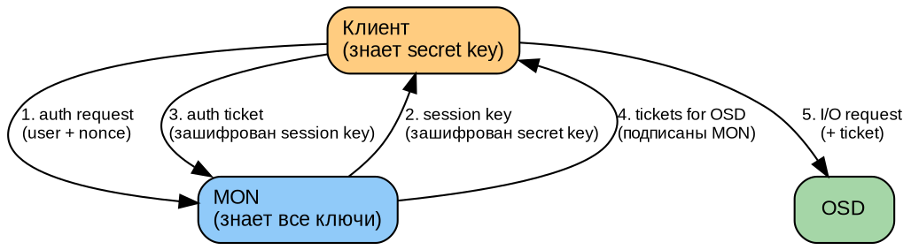
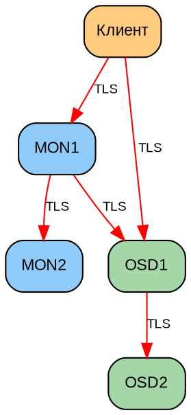

# Часть IX. Безопасность *(30 стр.)*

> **Цель:** освоить модель безопасности Ceph — CephX, авторизацию (caps), шифрование at-rest и in-transit.
> **После этой части вы сможете:** создать пользователя с минимальными правами, ограничить доступ по пулам и подсетям, включить шифрование дисков и сети.

---

## Глава 31. CephX: аутентификация и авторизация *(18 стр.)*

### 31.1. CephX: цепочка доверия *(3 стр.)*

**CephX** (Ceph eXtended Authentication) — протокол аутентификации и авторизации, встроенный в Ceph. Он обеспечивает:

- **Аутентификацию** (кто ты?) — клиент доказывает MON, что он тот, за кого себя выдаёт
- **Авторизацию** (что тебе можно?) — MON выдаёт клиенту capabilities (разрешения)
- **Целостность и конфиденциальность** — канал между клиентом и Ceph шифруется (MSGR2 secure mode)

**Как работает CephX (рукопожатие):**



1. Клиент отправляет MON запрос: «я client.admin, вот случайное число (nonce)»
2. MON генерирует сессионный ключ и шифрует его секретным ключом клиента (который знает и MON, и клиент из keyring). Только настоящий клиент сможет расшифровать.
3. Клиент расшифровывает сессионный ключ, создаёт «билет» (ticket) и отправляет MON
4. MON проверяет билет и выдаёт клиенту tickets для OSD — подписанные MON разрешения на доступ. OSD доверяют MON (у них общий секрет).
5. Клиент отправляет запросы напрямую OSD с приложенным ticket-ом. OSD проверяет подпись MON и выполняет операцию.

**Сессионные ключи:** временные, автоматически обновляются. Даже если злоумышленник перехватит сессионный ключ — он действителен ограниченное время.

---

### 31.2. keyring, caps, profiles *(4 стр.)*

**keyring** — файл, содержащий секретные ключи пользователя:

```bash
cat /etc/ceph/ceph.client.admin.keyring
# [client.admin]
#     key = AQDs...==
#     caps mds = "allow *"
#     caps mon = "allow *"
#     caps osd = "allow *"
```

**Capabilities (caps — разрешения):** определяют, что пользователь может делать. Синтаксис:

```
caps <daemon_type> = "<permissions>"
```

| Префикс | Значение |
|---------|----------|
| `allow r` | Только чтение |
| `allow rw` | Чтение и запись |
| `allow rwx` | Чтение, запись, выполнение (управляющие операции) |
| `allow *` | Всё разрешено (полный доступ) |
| `allow class-read` | Читать объекты определённого класса (RBD) |
| `allow class-write` | Писать объекты класса |
| `profile <name>` | Предустановленный профиль прав |

**Ограничение по пулам:**
```bash
allow rwx pool=app_data          # только пул app_data
allow rwx pool=app_data,logs     # несколько пулов
allow rw pool=cephfs_data        # только rw на cephfs_data
allow r pool=prod                # только чтение prod
allow rwx                        # все пулы
```

**Ограничение по namespace:**
```bash
# Namespace — логический раздел внутри пула
allow rwx pool=data namespace=tenant_a  # только namespace tenant_a
```

**Ограничение по подсети:**
```bash
ceph auth caps client.app mon 'allow r' \
    osd 'allow rwx pool=app_data' \
    network 10.0.1.0/24
# Пользователь client.app может подключаться только из подсети 10.0.1.0/24!
```

**Построчный разбор `ceph auth get`:**

```bash
ceph auth get client.admin
# exported keyring for client.admin
# [client.admin]
#     key = AQD...==
#     caps mds = "allow *"    # полный доступ к MDS (CephFS)
#     caps mon = "allow *"    # полный доступ к MON (управление)
#     caps osd = "allow *"    # полный доступ ко всем OSD
```

**Profiles (предустановленные профили):**

```bash
ceph auth get client.bootstrap-osd
# caps mon = "allow profile bootstrap-osd"
# profile bootstrap-osd включает: rwx на mon + rwx на osd для создания OSD
```

---

### 31.3. Пользователи: создание, отзыв, аудит *(3 стр.)*

```bash
# Создать пользователя
ceph auth add client.myapp \
    mon 'allow r' \
    osd 'allow rwx pool=app_data, allow r pool=logs'

# Создать пользователя с генерацией ключа
ceph auth get-or-create client.myapp \
    mon 'allow r' \
    osd 'allow rwx pool=app_data' \
    -o /etc/ceph/ceph.client.myapp.keyring

# Просмотр всех пользователей
ceph auth ls

# Детальная информация о пользователе
ceph auth get client.myapp

# Изменить права (caps)
ceph auth caps client.myapp \
    mon 'allow r' \
    osd 'allow rwx pool=new_pool'

# Отозвать пользователя
ceph auth del client.myapp

# Экспорт ключей (бэкап)
ceph auth export > /backup/auth-export-$(date +%Y%m%d).txt

# Импорт ключей (восстановление)
ceph auth import < /backup/auth-export.txt
```

---

### 31.4. Ограничение доступа: пулы, namespaces, подсети *(3 стр.)*

**Сценарий: SaaS-платформа, изолируем тенантов:**

```bash
# Тенант A: namespace tenant_a в общем пуле data
ceph auth add client.tenant_a \
    mon 'allow r' \
    osd 'allow rwx pool=data namespace=tenant_a'

# Тенант B: namespace tenant_b в том же пуле
ceph auth add client.tenant_b \
    mon 'allow r' \
    osd 'allow rwx pool=data namespace=tenant_b'

# tenant_a НЕ видит объекты tenant_b и наоборот!
```

**Сценарий: приложение имеет доступ только на чтение production-пула:**
```bash
ceph auth add client.readonly \
    mon 'allow r' \
    osd 'allow r pool=prod'
```

**Сценарий: ограничение по IP (защита от утечки ключа):**
```bash
ceph auth add client.secure \
    mon 'allow r' \
    osd 'allow rwx pool=secure_data' \
    network 10.0.5.0/24,10.0.6.10/32
# Ключ client.secure работает ТОЛЬКО с IP 10.0.5.x или 10.0.6.10
```

---

### 31.5. Практикум *(5 стр.)*

**Задача:** создать трёх пользователей с разными уровнями доступа.

```bash
# 1. Администратор (полный доступ)
# Уже есть: client.admin. Убедимся:
ceph auth get client.admin | grep caps

# 2. Разработчик (rw в dev-пул, r в prod-пул)
ceph auth add client.developer \
    mon 'allow r' \
    osd 'allow rwx pool=dev, allow r pool=prod'
ceph auth get client.developer -o /etc/ceph/ceph.client.developer.keyring

# Проверим:
rados -n client.developer -k /etc/ceph/ceph.client.developer.keyring \
    lspools
# Должен видеть dev и prod

rados -n client.developer -k /etc/ceph/ceph.client.developer.keyring \
    put test-obj /etc/hostname -p dev
# OK — запись в dev

rados -n client.developer -k /etc/ceph/ceph.client.developer.keyring \
    put test-obj /etc/hostname -p prod
# ERROR: Permission denied! (только r на prod)

# 3. Читатель (только r в prod)
ceph auth add client.reader \
    mon 'allow r' \
    osd 'allow r pool=prod'
ceph auth get client.reader -o /etc/ceph/ceph.client.reader.keyring

rados -n client.reader -k /etc/ceph/ceph.client.reader.keyring \
    get test-obj -p prod
# OK — чтение

rados -n client.reader -k /etc/ceph/ceph.client.reader.keyring \
    put test-obj /etc/hostname -p prod
# ERROR: Permission denied! (нет write)

# 4. Ограничение пула (dev — только dev-пул)
rados -n client.developer -k ... lspools
# Должен видеть: dev, prod

rados -n client.developer -k ... ls -p admin_pool
# ERROR: Permission denied! (нет доступа к admin_pool)
```

**Контрольные вопросы:**
1. Может ли `client.reader` прочитать данные из пула `dev`? (Нет — только `prod`)
2. Может ли `client.developer` удалить объект из `dev`? (Да — `rwx`)
3. Что произойдёт, если `client.developer` попытается выполнить `ceph osd tree`?
   (Ошибка — для этого нужен `allow rwx` на mon, а у него только `allow r`)

---

## Глава 32. Шифрование *(12 стр.)*

### 32.1. At-rest (LUKS) и in-transit (TLS) *(4 стр.)*

**Шифрование at-rest (данные на диске):**

Используется LUKS (Linux Unified Key Setup) — стандарт шифрования дисков в Linux поверх dm-crypt:

```bash
# При создании OSD указать шифрование
ceph orch daemon add osd <host>:/dev/sdb --encrypted

# Или в OSD spec (YAML):
service_type: osd
service_id: encrypted_osd
placement:
  host_pattern: '*'
data_devices:
  paths:
    - /dev/sdb
  encrypted: true
```

**Как работает LUKS на OSD:**
```
Приложение → OSD → BlueStore → LUKS (шифрует) → диск
```
- Данные шифруются/расшифровываются «на лету» на уровне блочного устройства
- Ключи LUKS управляются через `ceph config-key`
- Производительность: −5–10% (аппаратное ускорение AES-NI в современных CPU)

**Шифрование in-transit (данные в сети):**

Ceph использует MSGR2 с TLS для шифрования всех сетевых соединений:

```bash
# Включить secure mode (требует MSGR2)
ceph config set mon ms_mode secure
ceph config set osd ms_mode secure
ceph config set client ms_mode secure
```

**Что шифруется при `ms_mode=secure`:**
- MON ↔ MON (Paxos-сообщения, синхронизация)
- MON → Клиент (карты кластера, аутентификация)
- Клиент ↔ OSD (данные)
- OSD ↔ OSD (репликация, recovery)



**Проверка:**
```bash
tcpdump -i eth0 port 6789 -c 10 -X
# До secure: видно содержимое пакетов (ceph status...)
# После secure: только зашифрованные данные
```

---

### 32.2. SSE-S3 на RGW *(3 стр.)*

**SSE (Server-Side Encryption)** — шифрование объектов на стороне сервера. RGW поддерживает три режима:

| Режим | Где ключи | Описание |
|-------|----------|----------|
| **SSE-S3** | Ceph (внутреннее) | Ключи управляются Ceph. Клиент просто указывает заголовок |
| **SSE-KMS** | Внешний KMIP (HashiCorp Vault, etc.) | Ключи во внешней системе управления |
| **SSE-C** | Клиент | Клиент передаёт ключ с каждым запросом |

**SSE-S3 (самый простой):**

Клиент (boto3):
```python
s3.put_object(
    Bucket='my-bucket',
    Key='secret-doc.pdf',
    Body=open('secret-doc.pdf', 'rb'),
    ServerSideEncryption='AES256'
)
# Объект хранится в Ceph в зашифрованном виде
```

**Настройка SSE-KMS с HashiCorp Vault:**
```bash
radosgw-admin zone modify --rgw-zone=default \
    --rgw_crypt_s3_kms_backend=vault \
    --rgw_crypt_vault_auth=token \
    --rgw_crypt_vault_token_file=/etc/ceph/vault.token \
    --rgw_crypt_vault_addr=http://vault:8200
```

---

### 32.3. Практикум *(5 стр.)*

**Часть 1: LUKS на тестовом OSD**

```bash
# 1. Создать OSD с шифрованием
ceph orch daemon add osd ceph-osd1:/dev/sdc --encrypted

# 2. Проверить, что диск зашифрован
lsblk | grep sdc
# sdc                  8:32   0   20G  0 disk
# └─ceph-<uuid>      253:0    0   20G  0 crypt  ← LUKS!
#   └─ceph--block    253:1    0   20G  0 lvm

# 3. Проверить ключи LUKS
ceph config-key ls | grep dm-crypt
# dm-crypt/osd/<fsid>/luks
```

**Часть 2: MSGR2 secure mode**

```bash
# 1. Проверить текущий режим
ceph config get mon ms_mode
# async secure (если включён)

# 2. Включить TLS на MON
ceph config set mon ms_mode secure
ceph config set osd ms_mode secure

# 3. Перехватить трафик ДО
tcpdump -i eth0 -c 10 -X port 6789
# Видно: client.admin...

# 4. Перехватить трафик ПОСЛЕ
tcpdump -i eth0 -c 10 -X port 6789
# Видно только: ... (бинарные зашифрованные данные)

# 5. Проверить, что кластер работает
ceph status  # HEALTH_OK
```

**Часть 3: Замер производительности**

```bash
# До шифрования:
rados bench -p test 60 write --no-cleanup
# Bandwidth: 456 MB/s

# После включения LUKS + TLS:
rados bench -p test 60 write --no-cleanup
# Bandwidth: 410 MB/s (~10% снижение)
```

---

| Навигация | |
|-----------|---|
| ← Часть VIII | [part-VIII.md](part-VIII.md) |
| ↑ Оглавление | [TOC.md](TOC.md) |
| → Приложения | [appendix.md](appendix.md) |
