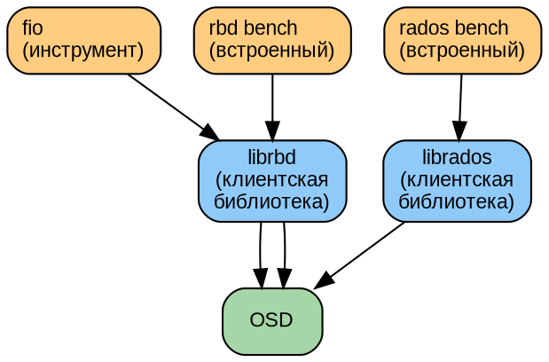
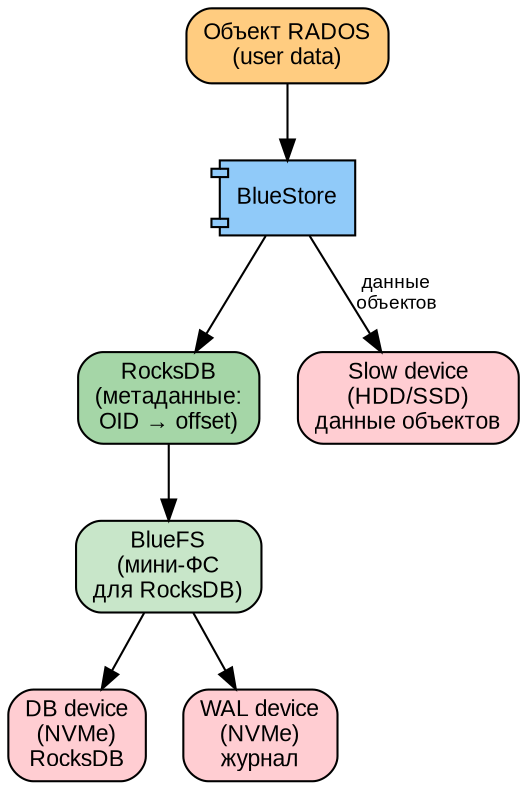
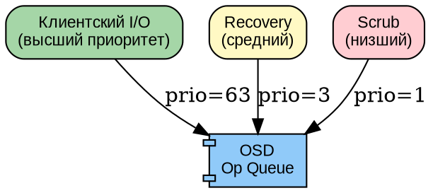

# Часть V. Производительность и тюнинг *(85 стр., 8 кейсов)*

> **Цель:** научиться измерять, анализировать и улучшать производительность Ceph на всех уровнях.
> **После этой части вы сможете:** снять baseline, протюнинговать BlueStore и сеть, найти узкое место, применить QoS.

---

## Глава 14. Методология тестирования производительности *(20 стр.)*

### 14.1. Что и зачем измеряем *(4 стр.)*

Производительность хранилища характеризуется тремя основными метриками. Если вы не можете измерить — вы не можете улучшить.

**IOPS (Input/Output Operations Per Second — «операций ввода-вывода в секунду»):**
- Сколько операций чтения/записи хранилище выполняет за секунду
- Зависит от размера блока: 4K random — ~100 у HDD, ~100 000 у NVMe
- Главная метрика для баз данных (много мелких случайных запросов)

**Throughput / Bandwidth (пропускная способность, МБ/с):**
- Сколько мегабайт данных прокачивается за секунду
- Зависит от размера блока: 1M sequential — до 250 МБ/с у HDD, до 14 000 МБ/с у NVMe
- Главная метрика для потокового видео, бэкапов, архивации

**Latency (задержка, миллисекунды):**
- Время от отправки запроса до получения ответа
- Среднее (average) — обманчиво. Важно **p99 (99-й перцентиль)** — время, за которое выполняется 99% запросов
- Почему p99 важнее среднего: если 99% запросов выполняются за 1 мс, а 1% — за 500 мс (из-за deep-scrub, recovery), среднее будет ~6 мс, но каждый сотый пользователь ждёт ПОЛСЕКУНДЫ

```
Среднее = 6 мс — «всё хорошо»
p99 = 500 мс — «каждый сотый запрос висит полсекунды»
```

**Хвосты (tail latency):** p99.9, p99.99 — ещё более редкие, но ещё более долгие запросы. В распределённых системах хвосты особенно заметны из-за координации между OSD.

---

### 14.2. Инструменты бенчмаркинга *(5 стр.)*

**`rados bench` — встроенный бенчмарк Ceph:**
```bash
# Запись: 60 секунд, параллельно
rados bench -p test_pool 60 write --no-cleanup
# Результат: Total time run: 60.123
#            Bandwidth (MB/sec): 456.7
#            Average IOPS: 116

# Чтение (последовательное)
rados bench -p test_pool 60 seq

# Случайное чтение
rados bench -p test_pool 60 rand

# Очистка тестовых данных
rados cleanup -p test_pool
```

**`rbd bench` — бенчмарк на уровне RBD:**
```bash
# Создать тестовый образ
rbd create test-img -s 10G -p rbd_pool

# Запись (последовательная)
rbd bench --io-type write --io-size 4M --io-threads 16 test-img
# Результат: elapsed: 20  ops: 2560  ops/sec: 128  bytes/sec: 512 MiB/s

# Случайное чтение
rbd bench --io-type rand --io-size 4K --io-threads 16 --io-pattern rand test-img
```

**`fio` (Flexible I/O Tester) — самый гибкий инструмент:**
```bash
# Случайное чтение 4K (моделирует базу данных)
fio --name=randread --ioengine=rbd --pool=rbd_pool --rbdname=test-img \
    --rw=randread --bs=4k --numjobs=4 --runtime=60 --time_based \
    --group_reporting

# Последовательная запись 1M (моделирует бэкап)
fio --name=seqwrite --ioengine=rbd --pool=rbd_pool --rbdname=test-img \
    --rw=write --bs=1M --numjobs=1 --runtime=60 --time_based

# 70% чтение / 30% запись (моделирует виртуализацию)
fio --name=mixed --ioengine=rbd --pool=rbd_pool --rbdname=test-img \
    --rw=randrw --rwmixread=70 --bs=4k --numjobs=4 --runtime=120
```

**Схема тестирования:**


---

### 14.3. Профили нагрузки *(3 стр.)*

| Профиль | Описание | BS | RW | Применение | Ключевая метрика |
|---------|----------|----|----|-----------|-----------------|
| OLTP | Мелкое случайное чтение | 4K | randread | Базы данных | IOPS, p99 latency |
| Streaming | Крупная последовательная запись | 1M | write | Бэкапы, видео | MB/s |
| Virtualisation | 70/30 случайное | 4K–64K | randrw | Виртуальные машины | IOPS, latency |
| HPC | Крупное случайное | 1M | randrw | Научные вычисления | MB/s |
| S3 Objects | Разное | смешанный | — | Объектное хранилище | ops/sec, latency |

---

### 14.4. Снятие baseline *(3 стр.)*

**Baseline (эталонный замер)** — это замер производительности до любого тюнинга, с которым вы будете сравнивать все дальнейшие изменения.

**Что обязательно фиксировать:**
```bash
# Версия Ceph
ceph version

# Топология
ceph osd tree
ceph osd df

# Параметры пула
ceph osd pool get <pool> all

# Аппаратная конфигурация
lscpu | grep "Model name"
free -h
lsblk -o NAME,SIZE,TYPE,MOUNTPOINT,ROTA

# Сеть
ip link show
ethtool eth0 | grep Speed
```

**Скрипт снятия baseline:**
```bash
#!/bin/bash
POOL=test_pool
DATE=$(date +%Y%m%d_%H%M)

# 1. Запись
rados bench -p $POOL 60 write --no-cleanup > baseline_${DATE}_write.txt

# 2. Последовательное чтение
rados bench -p $POOL 60 seq > baseline_${DATE}_seq.txt

# 3. Случайное чтение
rados bench -p $POOL 60 rand > baseline_${DATE}_rand.txt

rados cleanup -p $POOL
echo "Baseline saved: baseline_${DATE}_*.txt"
```

---

### 14.5. Практикум: сними baseline *(5 стр.)*

1. Создайте тестовый пул: `ceph osd pool create bench 64`
2. Выполните скрипт baseline (см. §14.4)
3. Постройте графики в gnuplot:
```gnuplot
set terminal png size 800,400
set output 'bench.png'
set title "Ceph Performance Baseline"
set xlabel "Test"
set ylabel "MB/s"
set style data histogram
plot 'results.dat' using 2:xtic(1) title 'Write', '' using 3 title 'Read'
```
4. Сохраните результаты в Grafana (snapshot)
5. **Это ваш эталон.** Все дальнейшие тюнинги сравнивайте с ним.

---

## Глава 15. Тюнинг OSD и BlueStore *(22 стр.)*

### 15.1. BlueStore: путь байта *(4 стр.)*

**DOT-схема слоёв BlueStore:**



**Путь записи объекта:**
1. Клиент отправляет запись → OSD
2. Данные пишутся в WAL (на NVMe, синхронно)
3. Метаданные (OID → offset, контрольная сумма) — в RocksDB (на DB-устройстве, через BlueFS)
4. Чуть позже (асинхронно) данные переносятся из WAL в основной раздел (slow)
5. Подтверждение клиенту (ACK) отправляется после шага 2!

---

### 15.2. WAL и DB на быстрых дисках *(4 стр.)*

**Когда это нужно:**
- Если OSD на HDD, а в сервере есть NVMe
- WAL синхронный: каждый ACK ждёт fsync на WAL. Чем быстрее WAL-устройство, тем ниже latency записи
- DB хранит метаданные: чем быстрее DB, тем быстрее поиск объекта (read latency)

**Как настроить (при создании OSD):**
```bash
# Разбить NVMe на разделы
parted /dev/nvme0n1 mklabel gpt
parted /dev/nvme0n1 mkpart primary 0% 2G   # WAL для OSD 0
parted /dev/nvme0n1 mkpart primary 2G 4G   # WAL для OSD 1
# ... и так далее

# Создать OSD с WAL и DB на NVMe
ceph orch daemon add osd <host>:/dev/sdb \
    --block-db /dev/nvme0n1p1 \
    --block-wal /dev/nvme0n1p2
```

**Эффект (типичные цифры):**

| Конфигурация | Write IOPS (4K) | Write latency | Read latency |
|-------------|----------------|---------------|--------------|
| HDD only | 100–150 | 8–12 ms | 6–10 ms |
| HDD + NVMe WAL | 300–500 | 2–4 ms | 6–8 ms |
| HDD + NVMe WAL+DB | 500–800 | 1–3 ms | 1–3 ms |
| NVMe only | 200 000+ | <0.1 ms | <0.1 ms |

---

### 15.3. Параметры OSD *(3 стр.)*

```bash
# Потоки обработки операций
ceph config set osd osd_op_num_shards 8         # больше shards = больше параллелизма
ceph config set osd osd_op_threads 4            # потоков на shard

# Приоритет recovery над клиентом (меньше = приоритетнее)
ceph config set osd osd_recovery_op_priority 3  # default: 3
ceph config set osd osd_client_op_priority 63   # default: 63

# Ограничения backfill (чтобы не перегрузить кластер)
ceph config set osd osd_max_backfills 1         # default: 1
ceph config set osd osd_recovery_max_active 3   # default: 3

# При полной остановке recovery (срочный тюнинг при деградации)
ceph config set osd osd_recovery_sleep 1        # default: 0 (без задержки)
```

---

### 15.4. bluestore_cache_size *(3 стр.)*

BlueStore кеширует метаданные объектов в RAM. Чем больше кеш — тем меньше обращений к RocksDB (медленной).

```bash
# Автотюнинг (Squid+, рекомендовано)
ceph config set osd bluestore_cache_autotune true

# Ручная настройка
ceph config set osd bluestore_cache_size_hdd 4294967296   # 4 GB для HDD
ceph config set osd bluestore_cache_size_ssd 8589934592   # 8 GB для SSD
```

**Эффект:** увеличение cache_size с 1 ГБ до 4 ГБ на HDD-OSD даёт +20–40% к read IOPS (меньше обращений к RocksDB на диске).

---

### 15.5. bluestore_compression *(3 стр.)*

Сжатие данных на лету экономит место (иногда до 50%), но тратит CPU.

```bash
# Включить zstd сжатие для пула
ceph osd pool set <pool> compression_algorithm zstd
ceph osd pool set <pool> compression_mode aggressive
ceph osd pool set <pool> compression_required_ratio 0.875  # Сжимать, если экономия >12.5%
```

**Алгоритмы:**
| Алгоритм | Сжатие | CPU | Применение |
|----------|--------|-----|-----------|
| snappy | ~1.5–2× | Низко | Быстрое, но слабое сжатие |
| zlib | ~3–5× | Средне | Хорошее сжатие, медленнее |
| **zstd** | ~2–4× | Низко-Средне | **Оптимальный баланс (рекомендуется)** |
| lz4 | ~1.5–2× | Очень низко | Минимальный CPU overhead |

**Когда помогает:** текстовые данные, логи, образы ВМ (много нулей).
**Когда вредит:** уже сжатые данные (JPEG, видео, ZIP) — CPU тратится, сжатия почти нет.

---

### 15.6. Практикум: A/B-тест BlueStore *(5 стр.)*

```bash
# ДО: замер baseline с дефолтными настройками
# (см. §14.4)

# Тюнинг:
ceph config set osd bluestore_cache_autotune true
ceph config set osd osd_op_num_shards 8
ceph osd pool set bench compression_algorithm zstd
ceph osd pool set bench compression_mode aggressive

# ПОСЛЕ: повторный замер
# Сравнить: IOPS, MB/s, latency p99, CPU utilisation

# Ожидаемые результаты:
# IOPS:      +15–40%
# MB/s:      +10–20% (за счёт сжатия)
# Latency:   -10–30%
# CPU:       +5–15% (плата за сжатие и кеш)
```

---

## Глава 16. Тюнинг сети *(18 стр.)*

### 16.1. Сетевая модель Ceph *(3 стр.)*

Ceph использует **Async Messenger v2 (MSGR2)** — асинхронный многопоточный сетевой фреймворк:

- TCP/TLS транспорт (по умолчанию)
- Многопоточная обработка соединений
- Встроенное сжатие (опционально)
- Шифрование (MSGR2 secure mode)

```bash
# Посмотреть текущий messenger
ceph config get mon ms_type
# async+posix — TCP (по умолчанию)
# async+rdma — RDMA (экспериментально)
```

---

### 16.2. Jumbo Frames *(3 стр.)*

**MTU 9000 vs MTU 1500 — количественно:**

Объект 4 МБ при MTU 1500: 4 194 304 / 1460 = ~2873 фрейма (с заголовками)
Объект 4 МБ при MTU 9000: 4 194 304 / 8960 = ~468 фреймов

**В 6 раз меньше фреймов** → в 6 раз меньше прерываний CPU → ниже latency, выше throughput.

**Практический эффект (типичный):**

| Метрика | MTU 1500 | MTU 9000 | Улучшение |
|---------|----------|----------|-----------|
| Throughput | 9.1 Gbps | 9.8 Gbps | +7% |
| CPU util | 45% | 22% | −51% |
| Latency p99 | 4.2 ms | 3.6 ms | −14% |

**Как включить:**
```bash
# На ВСЕХ узлах + коммутаторе!
ip link set eth1 mtu 9000
# Проверить
ip link show eth1 | grep mtu
# Убедиться, что между всеми узлами ping -M do -s 8972 работает
```

**Важно:** если хотя бы ОДНО устройство в сети имеет MTU 1500, а Jumbo включены не везде — фрагментация сведёт на нет весь выигрыш.

---

### 16.3. TCP vs RDMA *(3 стр.)*

**RDMA (Remote Direct Memory Access)** — технология прямого доступа к памяти удалённого узла через сетевую карту, минуя CPU и ядро ОС.

```
TCP/IP:
Приложение → буфер → ядро → TCP/IP стек → драйвер → сетевая карта
Latency: 50–100 µs

RDMA (RoCE/InfiniBand):
Приложение → сетевая карта (прямой доступ к памяти)
Latency: 2–10 µs
```

**Когда RDMA оправдан:**
- NVMe-OF кластеры (latency диска < 10 µs — сеть не должна быть узким местом)
- HPC-нагрузки
- Бюджет позволяет InfiniBand (дороже Ethernet в 2–5 раз)

**Для большинства инсталляций:** 25/100GbE TCP — оптимально по цене/производительности.

---

### 16.4. QoS и приоритезация *(3 стр.)*

В Ceph есть несколько классов трафика с разными приоритетами. Идея: клиентский I/O не должен страдать из-за recovery/scrub.



```bash
# Приоритеты (меньше = приоритетнее)
ceph config set osd osd_client_op_priority 63
ceph config set osd osd_recovery_op_priority 3
ceph config set osd osd_scrub_priority 1

# Динамический QoS (mclock scheduler — Squid+)
ceph config set osd osd_op_queue mclock_scheduler
ceph config set osd osd_mclock_profile high_client_ops
```

---

### 16.5. Балансировка: LACP *(3 стр.)*

```bash
# Создание bond-интерфейса (LACP mode 4)
# /etc/netplan/01-netcfg.yaml
network:
  bonds:
    bond0:
      interfaces: [eth0, eth1]
      parameters:
        mode: 802.3ad       # LACP
        mii-monitor-interval: 100
      addresses: [10.0.1.10/24]
```

**Mode 4 (802.3ad):** балансировка по хешу (src MAC/IP + dst MAC/IP + порты). Один TCP-поток всегда идёт по одному физическому линку (ограничение LACP). Но так как у Ceph много соединений (клиент ↔ OSD), они распределятся по линкам.

**Multi-home (альтернатива LACP):**
```bash
# Просто несколько IP на OSD для разных сетей
# public_network = 10.0.1.0/24,10.0.3.0/24
# Ceph сам распределит соединения
```

---

### 16.6. Практикум: Jumbo Frames *(3 стр.)*

1. Замерьте baseline latency (`ping -s 64 -c 1000 <другой узел>`)
2. Включите Jumbo Frames (MTU 9000) на двух узлах
3. Повторите замер
4. Сравните:
   - Средняя RTT latency
   - CPU utilisation (`mpstat 1`)
5. Проведите `rados bench` до и после — сравните MB/s

```bash
# Проверка, что Jumbo Frames работают на всём пути
for host in ceph-mon1 ceph-mon2 ceph-osd1 ceph-osd2; do
    ping -M do -s 8972 -c 3 $host && echo "$host: OK" || echo "$host: FAIL"
done
```

---

## Глава 17. Моделирование снижения производительности: 8 кейсов *(25 стр.)*

### 17.1. Кейс 1: медленный диск *(3 стр.)*

**Имитация:**
```bash
# Device-mapper delay: добавляет 50ms ко всем операциям
dmsetup create slow-sdb --table "0 $(blockdev --getsz /dev/sdb) delay /dev/sdb 0 50000"

# Пересоздать OSD на /dev/mapper/slow-sdb
```

**Симптомы:**
```bash
ceph osd perf
# osd.0  apply_latency_ms: 52  commit_latency_ms: 55
# (норма: < 5ms)

iostat -x 1 | grep sdb
# await: 55ms (норма: < 5ms)
```

**Диагностика:**
```bash
ceph daemon osd.0 dump_historic_ops | jq '.ops[] | {desc, duration}'
# "duration": 0.052 — операции длятся 52ms вместо 2ms
```

**Устранение:** замена диска через `ceph osd out` → `ceph osd destroy` → новый OSD на новом диске.

---

### 17.2. Кейс 2: перегрузка сети *(3 стр.)*

**Имитация:**
```bash
# Насыщение сети фоновым трафиком
iperf3 -c <другой узел> -t 300 -P 8 -b 10G &
```

**Симптомы:**
```
ceph osd perf: latency растёт на всех OSD
Клиентские операции: рост p99 latency ×3–10
```

**Диагностика:**
```bash
iftop -i eth0       # видим, кто забил канал
nicstat 1           # % утилизации сети
ping -c 100 <host>  # потери пакетов
```

**Тюнинг:**
```bash
# Применить QoS — клиент выше recovery
ceph config set osd osd_client_op_priority 63
ceph config set osd osd_recovery_op_priority 1

# Или отдельная cluster network (физически/VLAN)
```

---

### 17.3. Кейс 3: deep-scrub во время нагрузки *(3 стр.)*

**Имитация:**
```bash
# Найти PG и запустить deep-scrub
ceph pg deep-scrub 1.7f &
# Параллельно запустить бенчмарк
rados bench -p test_pool 60 write &
```

**Симптомы:**
```
Клиентская latency вырастает в 2–5 раз
OSD utilisation (CPU/disk) близка к 100%
```

**Тюнинг:**
```bash
# Ограничить scrub ночным окном
ceph config set osd osd_scrub_begin_hour 2
ceph config set osd osd_scrub_end_hour 6
ceph config set osd osd_max_scrubs 1

# Добавить sleep между scrub-операциями
ceph config set osd osd_scrub_sleep 0.1  # 100ms паузы между chunk-ами
```

---

### 17.4. Кейс 4: recovery после отказа *(3 стр.)*

**Имитация:**
```bash
ceph osd out osd.0
# Запускается backfill на других OSD
# Параллельно бенчмарк
rados bench -p test_pool 60 write &
```

**Симптомы:**
```
Клиентский трафик degraded — конкуренция с backfill
PG: active+clean+remapped (переходное)
```

**Тюнинг:**
```bash
# Замедлить recovery, чтобы не мешать клиентам
ceph config set osd osd_recovery_op_priority 1
ceph config set osd osd_max_backfills 1
ceph config set osd osd_recovery_sleep 0.1
```

---

### 17.5. Кейс 5: hot spot OSD *(3 стр.)*

**Имитация:**
```bash
# Неравномерный вес в CRUSH
ceph osd crush reweight osd.0 5.0   # намного больше других
```

**Симптомы:**
```bash
ceph osd df
# osd.0: 85% used, остальные: 30% used
# osd.0: IOPS ×3 выше остальных
```

**Решение:**
```bash
# Включить автоматический balancer
ceph mgr module enable balancer
ceph balancer on
ceph balancer mode upmap      # оптимальный режим (Squid+)
ceph balancer status

# Или вручную:
ceph osd reweight-by-utilization
```

---

### 17.6. Кейс 6: OSD nearfull *(3 стр.)*

**Имитация:**
```bash
rados bench -p test_pool 600 write --no-cleanup
# Ждать, пока OSD заполнится >85%
```

**Симптомы:**
```
HEALTH_WARN: nearfull osd(s)
Клиенты: throttling — операции замедляются
```

**Решение:**
```bash
# 1. Срочно: уменьшить вес
ceph osd reweight osd.X 0.8

# 2. Среднесрочно: добавить OSD
ceph orch daemon add osd <host>:/dev/sdZ

# 3. Долгосрочно: мониторинг + алерт Prometheus при >80%
#    (чтобы успеть добавить диски до nearfull)
```

---

### 17.7. Кейс 7: memory pressure *(3 стр.)*

**Имитация:**
```bash
# Слишком много PG на OSD (>200/OSD)
ceph osd pool create many_pgs 1024
# Каждый PG потребляет ~5–10 MB RAM на OSD
# 200 PG × 10 MB = 2 GB только на PG-структуры
```

**Симптомы:**
```
OSD: RSS растёт (ps aux | grep ceph-osd)
OOM killer убивает OSD → OSD flapping (down/up/down/up)
```

**Решение:**
```bash
# pg_autoscaler (если выключен — включить)
ceph osd pool set many_pgs pg_autoscale_mode on

# memory target (Squid+)
ceph config set osd osd_memory_target 4294967296  # 4 GB на OSD

# Проверить текущие PG/OSD
ceph osd pool autoscale-status
```

---

### 17.8. Кейс 8: клиентский шторм *(3 стр.)*

**Имитация:**
```bash
# 100 одновременных fio-клиентов
for i in $(seq 1 100); do
    fio --name=storm$i --ioengine=rbd --pool=rbd --rbdname=test$i \
        --rw=randrw --bs=4k --runtime=120 &>/dev/null &
done
```

**Симптомы:**
```
OSD: op queue переполнена
ceph daemon osd.0 perf dump | grep throttle
Latency p99: взлетает с 2ms до 500ms+
```

**Тюнинг:**
```bash
# Увеличить op queue
ceph config set osd osd_op_queue_cut_off high

# Throttling на стороне клиента
# (в приложении: ограничить concurrent requests)
```

---

### 17.9. Практикум: чёрный ящик *(1 стр.)*

Преподаватель вносит одну из 8 проблем (выше) на тестовый кластер. Студент должен:
1. Заметить проблему (мониторинг)
2. Диагностировать (какая именно из 8)
3. Устранить
4. Вернуть кластер к baseline-производительности

**Без подсказок.** Только `ceph status`, `ceph osd perf`, `iostat`, логи.

---

| Навигация | |
|-----------|---|
| ← Часть IV | [part-IV.md](part-IV.md) |
| ↑ Оглавление | [TOC.md](TOC.md) |
| → Часть VI | [part-VI.md](part-VI.md) |
