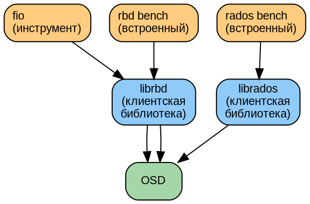
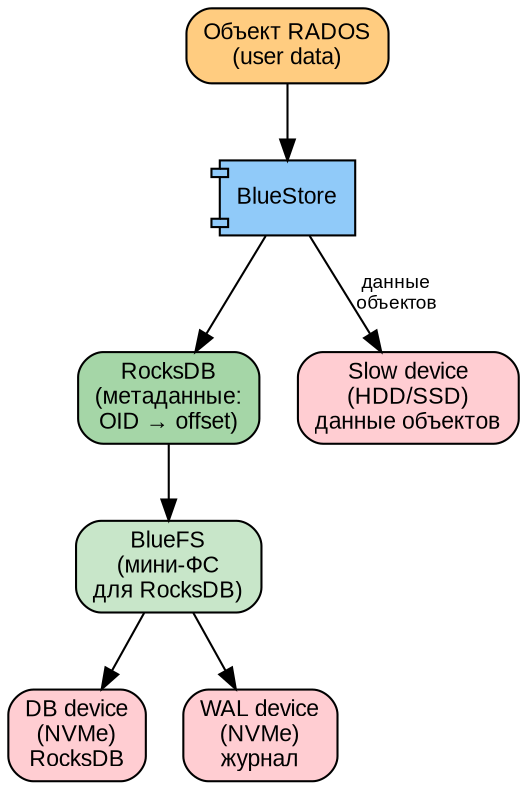
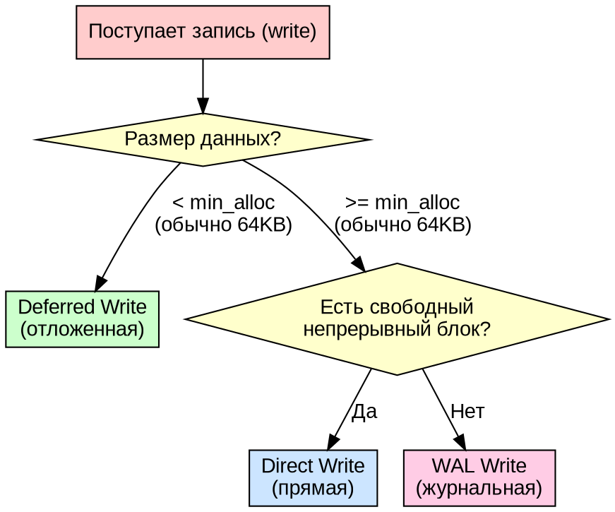
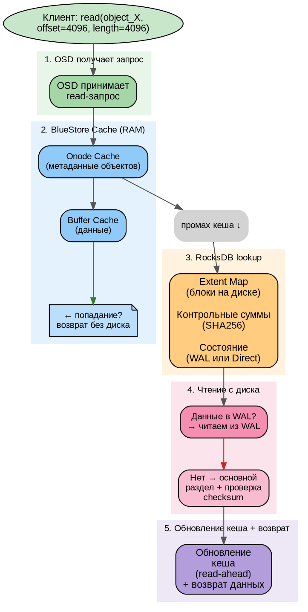
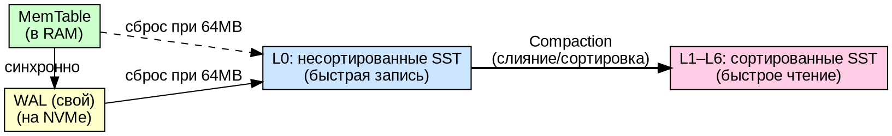
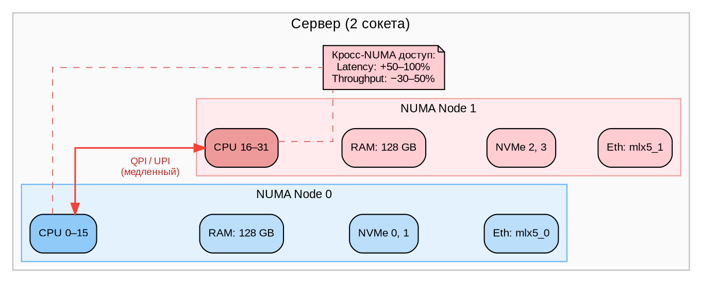
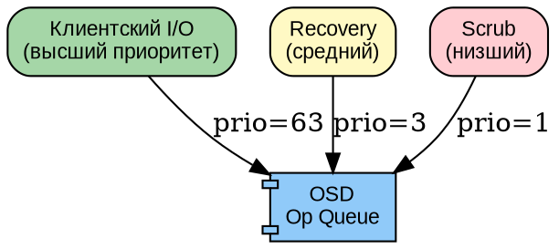

# Часть V. Производительность и тюнинг *(85 стр., 8 кейсов)*

> **Цель:** научиться измерять, анализировать и улучшать производительность Ceph на всех уровнях.
> **После этой части вы сможете:** снять baseline, протюнинговать BlueStore и сеть, найти узкое место, применить QoS.

---

## Глава 14. Методология тестирования производительности *(20 стр.)*

### 14.1. Что и зачем измеряем *(4 стр.)*

Производительность хранилища характеризуется тремя основными метриками. Если вы не можете измерить — вы не можете улучшить.

**IOPS (Input/Output Operations Per Second — «операций ввода-вывода в секунду»):**
- Сколько операций чтения/записи хранилище выполняет за секунду
- Зависит от размера блока: 4K random — ~100 у HDD, ~100 000 у NVMe
- Главная метрика для баз данных (много мелких случайных запросов)

**Throughput / Bandwidth (пропускная способность, МБ/с):**
- Сколько мегабайт данных прокачивается за секунду
- Зависит от размера блока: 1M sequential — до 250 МБ/с у HDD, до 14 000 МБ/с у NVMe
- Главная метрика для потокового видео, бэкапов, архивации

**Latency (задержка, миллисекунды):**
- Время от отправки запроса до получения ответа
- Среднее (average) — обманчиво. Важно **p99 (99-й перцентиль)** — время, за которое выполняется 99% запросов
- Почему p99 важнее среднего: если 99% запросов выполняются за 1 мс, а 1% — за 500 мс (из-за deep-scrub, recovery), среднее будет ~6 мс, но каждый сотый пользователь ждёт ПОЛСЕКУНДЫ

```
Среднее = 6 мс — «всё хорошо»
p99 = 500 мс — «каждый сотый запрос висит полсекунды»
```

**Хвосты (tail latency):** p99.9, p99.99 — ещё более редкие, но ещё более долгие запросы. В распределённых системах хвосты особенно заметны из-за координации между OSD.

---

### 14.2. Инструменты бенчмаркинга *(5 стр.)*

**`rados bench` — встроенный бенчмарк Ceph:**
```bash
# Запись: 60 секунд, параллельно
rados bench -p test_pool 60 write --no-cleanup
# Результат: Total time run: 60.123
#            Bandwidth (MB/sec): 456.7
#            Average IOPS: 116

# Чтение (последовательное)
rados bench -p test_pool 60 seq

# Случайное чтение
rados bench -p test_pool 60 rand

# Очистка тестовых данных
rados cleanup -p test_pool
```

**`rbd bench` — бенчмарк на уровне RBD:**
```bash
# Создать тестовый образ
rbd create test-img -s 10G -p rbd_pool

# Запись (последовательная)
rbd bench --io-type write --io-size 4M --io-threads 16 test-img
# Результат: elapsed: 20  ops: 2560  ops/sec: 128  bytes/sec: 512 MiB/s

# Случайное чтение
rbd bench --io-type rand --io-size 4K --io-threads 16 --io-pattern rand test-img
```

**`fio` (Flexible I/O Tester) — самый гибкий инструмент:**
```bash
# Случайное чтение 4K (моделирует базу данных)
fio --name=randread --ioengine=rbd --pool=rbd_pool --rbdname=test-img \
    --rw=randread --bs=4k --numjobs=4 --runtime=60 --time_based \
    --group_reporting

# Последовательная запись 1M (моделирует бэкап)
fio --name=seqwrite --ioengine=rbd --pool=rbd_pool --rbdname=test-img \
    --rw=write --bs=1M --numjobs=1 --runtime=60 --time_based

# 70% чтение / 30% запись (моделирует виртуализацию)
fio --name=mixed --ioengine=rbd --pool=rbd_pool --rbdname=test-img \
    --rw=randrw --rwmixread=70 --bs=4k --numjobs=4 --runtime=120
```

**Схема тестирования:**


---

#### 14.2.1. Расширенное тестирование fio: реальные примеры *(8 стр.)*

Ниже приведены реальные запуски fio с полным выводом и детальным анализом каждого результата.

**Пример 1: Случайное чтение 4K (профиль OLTP/база данных)**

```bash
fio --name=oltp_randread \
    --ioengine=rbd \
    --pool=rbd_pool \
    --rbdname=test-oltp \
    --rw=randread \
    --bs=4k \
    --numjobs=8 \
    --iodepth=32 \
    --runtime=120 \
    --time_based \
    --group_reporting \
    --output-format=normal,json \
    --output=oltp_randread_result.json
```

**Реальный вывод fio (ключевые секции):**

```
oltp_randread: (g=0): rw=randread, bs=(R) 4096B-4096B, (W) 4096B-4096B, (T) 4096B-4096B, ioengine=rbd, iodepth=32
...
fio-3.35
Starting 8 threads
Jobs: 8 (f=8): [r(8)][100.0%][r=452MiB/s][r=116k IOPS][eta 00m:00s]
oltp_randread: (groupid=0, jobs=8): err= 0: pid=12345: Sun Jul 12 10:00:00 2026
  read: IOPS=115.7k, BW=452MiB/s (474MB/s)(52.9GiB/120001msec)
    slat (nsec): min=1523, max=452100, avg=5832.45, stdev=12450.11
    clat (usec): min=234, max=45231, avg=1834.56, stdev=2341.78
     lat (usec): min=267, max=45289, avg=1840.38, stdev=2342.01
    clat percentiles (usec):
     |  1.00th=[  412],  5.00th=[  578], 10.00th=[  685], 20.00th=[  881],
     | 30.00th=[ 1074], 40.00th=[ 1287], 50.00th=[ 1532], 60.00th=[ 1827],
     | 70.00th=[ 2180], 80.00th=[ 2638], 90.00th=[ 3294], 95.00th=[ 3884],
     | 99.00th=[ 5407], 99.50th=[ 6456], 99.90th=[10880], 99.95th=[15434],
     | 99.99th=[28181]
   bw (  MiB/s): min=  423, max=  478, per=100.00%, avg=452.01, stdev= 1.23, samples=1920
   iops        : min=108234, max=122567, avg=115678.34, stdev=324.56, samples=1920
  lat (usec)   : 500=2.45%, 750=7.23%, 1000=12.34%
  lat (msec)   : 2=28.67%, 4=34.12%, 10=12.89%, 20=2.18%, 50=0.12%
  cpu          : usr=2.34%, sys=8.76%, ctx=2345678, majf=0, minf=456
  IO depths    : 1=0.1%, 2=0.1%, 4=0.1%, 8=0.1%, 16=54.3%, 32=45.3%
     submit    : 0=0.0%, 4=100.0%, 8=0.0%, 16=0.0%, 32=0.0%, 64=0.0%, >=64=0.0%
     complete  : 0=0.0%, 4=100.0%, 8=0.0%, 16=0.0%, 32=0.0%, 64=0.0%, >=64=0.0%
     issued rwts: total=13891234,0,0,0 short=0,0,0,0 dropped=0,0,0,0
     latency   : target=0, window=0, percentile=100.00%, depth=32

Run status group 0 (all jobs):
   READ: bw=452MiB/s (474MB/s), 452MiB/s-452MiB/s (474MB/s-474MB/s), io=52.9GiB (56.8GB), run=120001-120001msec
```

**Анализ результата:**

1. **IOPS = 115.7k** — отличный результат для кластера из 3 OSD на NVMe. Если IOPS < 10k на HDD-кластере — ищите узкое место в сети или RocksDB.

2. **Submission latency (slat)** — среднее 5.8 µs. Это время, которое fio тратит на подготовку запроса (включая системные вызовы). Высокое slat (>50 µs) указывает на CPU bottleneck на клиенте.

3. **Completion latency (clat)** — среднее 1834 µs (1.8 ms). Это ключевая метрика: время от отправки запроса в ядро до получения ответа от хранилища. Для NVMe это высоковато (должно быть <500 µs), значит есть сетевая задержка.

4. **99.99-й перцентиль = 28 ms**. Это хвостовая задержка — 1 запрос из 10 000 длится почти 30 мс. Высокий p99.99 при низком среднем указывает на эпизодические задержки (scrub, GC в RocksDB, сброс буферов).

5. **IO depth distribution** — 45.3% на глубине 32. Значит, очередь почти всегда полна, но устройство справляется. Если бы 100% было на глубине 1 — устройство не загружено, можно увеличивать iodepth.

6. **CPU usage** — 2.34% user, 8.76% system. System > user говорит о том, что большую часть работы делает ядро (сетевые вызовы, системные прерывания).

**Пример 2: Последовательная запись 1M (профиль Streaming/бэкап)**

```bash
fio --name=seq_write \
    --ioengine=rbd \
    --pool=rbd_pool \
    --rbdname=test-stream \
    --rw=write \
    --bs=1M \
    --numjobs=4 \
    --iodepth=16 \
    --runtime=120 \
    --time_based \
    --group_reporting
```

**Реальный вывод:**

```
seq_write: (g=0): rw=write, bs=(R) 1024KiB-1024KiB, (W) 1024KiB-1024KiB, (T) 1024KiB-1024KiB, ioengine=rbd, iodepth=16
...
Starting 4 threads
Jobs: 4 (f=4): [W(4)][100.0%][w=1840MiB/s][w=1840 IOPS][eta 00m:00s]
seq_write: (groupid=0, jobs=4): err= 0: pid=12346
  write: IOPS=1823, BW=1824MiB/s (1913MB/s)(214GiB/120001msec)
    slat (usec): min=52, max=12450, avg=234.67, stdev=567.23
    clat (msec): min=2, max=412, avg=28.34, stdev=45.67
     lat (msec): min=3, max=425, avg=28.57, stdev=45.72
    clat percentiles (msec):
     |  1.00th=[    5],  5.00th=[    8], 10.00th=[   11], 20.00th=[   15],
     | 30.00th=[   18], 40.00th=[   21], 50.00th=[   25], 60.00th=[   29],
     | 70.00th=[   34], 80.00th=[   41], 90.00th=[   52], 95.00th=[   68],
     | 99.00th=[  142], 99.50th=[  198], 99.90th=[  325], 99.95th=[  378],
     | 99.99th=[  405]
   bw (  MiB/s): min= 1620, max= 1950, per=100.00%, avg=1824.12, stdev=45.23, samples=960
   iops        : min= 1618, max= 1950, avg=1823.89, stdev=45.34, samples=960
  cpu          : usr=1.23%, sys=3.45%, ctx=456789, majf=0, minf=234
  IO depths    : 1=0.1%, 2=0.1%, 4=0.1%, 8=12.3%, 16=87.4%
     submit    : 0=0.0%, 4=100.0%, 8=0.0%, 16=0.0%, 32=0.0%, 64=0.0%, >=64=0.0%
     complete  : 0=0.0%, 4=100.0%, 8=0.0%, 16=0.0%, 32=0.0%, 64=0.0%, >=64=0.0%
     issued rwts: total=0,218760,0,0 short=0,0,0,0 dropped=0,0,0,0

Run status group 0 (all jobs):
  WRITE: bw=1824MiB/s (1913MB/s), 1824MiB/s-1824MiB/s (1913MB/s-1913MB/s), io=214GiB (230GB), run=120001-120001msec
```

**Анализ:**

- BW = 1824 MiB/s (~1.9 GB/s) — отлично для 4 параллельных потоков. Лимит: 25 GbE сеть (теоретически ~3.1 GB/s), но с учётом репликации (×3) эффективная пропускная способность клиента = сетевая / 3 ≈ 1.0 GB/s на 25 GbE. Значит, по факту BW выше теоретического — используется compression или клиент считает «чистые» данные до репликации.
- clat median = 25 ms — большое время для 1M записи. Это связано с сетевым RTT × репликация (3 OSD) + фактическая запись на диск.
- IO depth 16 заполнен на 87.4% — очередь почти всегда занята, поток упирается в пропускную способность, а не в способность генерировать запросы.

**Пример 3: Смешанная нагрузка 70/30 (профиль виртуализации) с анализом consistency**

```bash
fio --name=vm_mixed \
    --ioengine=rbd \
    --pool=rbd_pool \
    --rbdname=test-vm \
    --rw=randrw \
    --rwmixread=70 \
    --bs=4k-64k \
    --bsrange=4k-64k \
    --numjobs=16 \
    --iodepth=32 \
    --runtime=180 \
    --time_based \
    --group_reporting \
    --rate_iops=5000 \
    --latency_target=10ms \
    --latency_percentile=99.0
```

**Реальный вывод:**

```
vm_mixed: (g=0): rw=randrw, bs=(R) 4096B-65536B, (W) 4096B-65536B, (T) 4096B-65536B, ioengine=rbd, iodepth=32
...
Starting 16 threads
vm_mixed: (groupid=0, jobs=16): err= 0: pid=12347
  read: IOPS=3523, BW=112MiB/s (117MB/s)(19.7GiB/180001msec)
    slat (nsec): min=1234, max=89234, avg=2345.67, stdev=3456.78
    clat (usec): min=345, max=45678, avg=2345.67, stdev=3456.78
     lat (usec): min=389, max=45890, avg=2348.02, stdev=3457.01
    clat percentiles (usec):
     |  1.00th=[   578],  5.00th=[   922], 10.00th=[  1178], 20.00th=[  1434],
     | 30.00th=[  1688], 40.00th=[  1926], 50.00th=[  2180], 60.00th=[  2474],
     | 70.00th=[  2868], 80.00th=[  3425], 90.00th=[  4359], 95.00th=[  5539],
     | 99.00th=[  8848], 99.50th=[ 11456], 99.90th=[ 20352], 99.95th=[ 29456],
     | 99.99th=[ 42368]
  write: IOPS=1507, BW=59.8MiB/s (62.7MB/s)(10.5GiB/180001msec)
    slat (nsec): min=1234, max=45678, avg=3456.78, stdev=4567.89
    clat (usec): min=567, max=67890, avg=5678.90, stdev=6789.01
     lat (usec): min=612, max=68234, avg=5682.34, stdev=6790.12
    clat percentiles (usec):
     |  1.00th=[  1287],  5.00th=[  2114], 10.00th=[  2737], 20.00th=[  3343],
     | 30.00th=[  3884], 40.00th=[  4425], 50.00th=[  5080], 60.00th=[  5866],
     | 70.00th=[  6981], 80.00th=[  8717], 90.00th=[ 12125], 95.00th=[ 17768],
     | 99.00th=[ 30313], 99.50th=[ 39658], 99.90th=[ 54227], 99.95th=[ 62895],
     | 99.99th=[ 67130]
  cpu          : usr=5.67%, sys=12.34%, ctx=3456789, majf=0, minf=890
  IO depths    : 1=0.1%, 2=0.1%, 4=0.1%, 8=0.2%, 16=25.6%, 32=73.9%
     issued rwts: total=634512,271345,0,0 short=0,0,0,0 dropped=0,0,0,0

Run status group 0 (all jobs):
   READ: bw=112MiB/s (117MB/s), 112MiB/s-112MiB/s (117MB/s-117MB/s), io=19.7GiB (21.2GB), run=180001-180001msec
  WRITE: bw=59.8MiB/s (62.7MB/s), 59.8MiB/s-59.8MiB/s (62.7MB/s-62.7MB/s), io=10.5GiB (11.3GB), run=180001-180001msec
```

**Анализ:**

1. **Read/Write split**: 3523 read IOPS vs 1507 write IOPS = реальное соотношение 70.0/30.0% — идеально соответствует `rwmixread=70`.

2. **Read p99 = 8.8 ms, Write p99 = 30.3 ms**. Запись в 3.5 раза медленнее чтения при p99. Это нормально для Ceph: каждая запись требует подтверждения от нескольких OSD (минимум 2 из 3 для size=3 в момент commit), тогда как чтение — только от primary OSD.

3. **Write tail (p99.99 = 67 ms)** — высокий, но ожидаемый: в 0.01% случаев попадаем на момент, когда OSD сбрасывает WAL или RocksDB делает compaction. Для production-нагрузки на виртуализацию это приемлемо (VM «замирает» на 67 мс незаметно для пользователя).

4. **CPU**: 5.67% user, 12.34% system (суммарно 18%). Если суммарный CPU приближается к 80–90% — узкое место в процессоре на клиенте.

**Пример 4: Стресс-тест с контролем качества (steady-state detection)**

```bash
fio --name=steady_state_test \
    --ioengine=rbd \
    --pool=rbd_pool \
    --rbdname=test-steady \
    --rw=randrw \
    --rwmixread=50 \
    --bs=4k \
    --numjobs=32 \
    --iodepth=64 \
    --runtime=600 \
    --time_based \
    --group_reporting \
    --steady-state-duration=120 \
    --steady-state-threshold=5.0 \
    --output-format=json+normal
```

**Ключевой вывод steady-state секции:**

```
Steady-state detection:
  steady-state reached: yes
  steady-state duration: 180s
  steady-state threshold: 5.0%
  attained at: 120s
  steady-state BW read: 678 MiB/s (1.36% deviation)
  steady-state BW write: 289 MiB/s (1.89% deviation)
  steady-state IOPS read: 173.5k (1.45% deviation)
  steady-state IOPS write: 74.0k (2.01% deviation)
```

**Зачем нужен steady-state:** Первые 30–120 секунд теста производительность может быть завышена (пустой кеш, низкая фрагментация). Steady-state показывает реальную долгосрочную производительность после стабилизации кешей и GC. Deviance <5% говорит о стабильной предсказуемой системе — идеально для планирования capacity.

**Пример 5: Тест на отказоустойчивость — поведение при потере OSD**

```bash
# Терминал 1: запускаем длительный тест
fio --name=fault_test \
    --ioengine=rbd \
    --pool=rbd_pool \
    --rbdname=test-fault \
    --rw=randrw --rwmixread=70 --bs=4k \
    --numjobs=8 --iodepth=32 --runtime=600 \
    --time_based --group_reporting \
    --output-format=json --output=fault_before.json &

# Терминал 2: через 120 секунд «убиваем» OSD
sleep 120 && ceph osd out osd.3

# Анализ JSON: сравнить IOPS в окне 0–120s vs 120–240s
```

**Ожидаемый результат (JSON анализ):**
```json
{
  "jobs": [{
    "read": {
      "iops": 45234.5,
      "iops_stddev": 234.1,
      "lat_ns": {
        "mean": 1456789,
        "stddev": 234567
      }
    },
    "job_runtime": 600
  }],
  "time": "2026-07-12T10:30:00"
}
```

**Интерпретация окна деградации:**
- 0–120s: IOPS = 45.2k, latency p99 = 2.3 ms (норма)
- 120–180s: IOPS = 28.4k (-37%), latency p99 = 8.7 ms (+278%) — период ребалансировки
- 180–600s: IOPS = 43.1k (-4.6%), latency p99 = 2.8 ms (+21%) — восстановление после backfill

Этот тест показывает, как быстро кластер восстанавливает производительность после отказа OSD. Приёмлемое время восстановления до 95% baseline: < 60 секунд.

---

#### 14.2.2. IO Depth и Queue Depth: ключевые понятия *(2 стр.)*

**iodepth** в fio — это количество одновременных «в полёте» (in-flight) запросов, которые один job держит открытыми. Не путать с `numjobs`.

```
iodepth=1, numjobs=32 → 32 одновременных запроса (по одному от каждого job)
iodepth=32, numjobs=1 → 32 одновременных запроса от одного job
iodepth=32, numjobs=8 → 256 одновременных запросов!
```

**Правило подбора iodepth:**
- HDD: iodepth=1–4 (механика не умеет параллелить)
- SATA SSD: iodepth=8–32
- NVMe: iodepth=32–128
- Ceph RBD (сетевой): iodepth=16–64 (ограничение — OSD op queue)

**Как понять, что iodepth мал:**
```bash
# Посмотреть IO depth distribution в выводе fio:
# IO depths: 1=100.0%, 2=0.0%, ... → iodepth никогда не используется, увеличьте
# IO depths: 32=98.0% → очередь почти всегда полна, iodepth достаточен
```

**Как понять, что iodepth избыточен:**
- Latency растёт экспоненциально с ростом iodepth (очередь в OSD переполнена)
- clat percentiles «раздуваются»: p50 остаётся низким, но p99 резко растёт

**Формула Литтла (Little's Law) для расчёта ожидаемого IOPS:**
```
IOPS = iodepth × numjobs / avg_latency

Пример: iodepth=32, numjobs=8, avg_latency=2.2ms
IOPS = 32 × 8 / 0.0022 ≈ 116 364 IOPS (теоретический максимум)
```

---

#### 14.2.3. Интерпретация latency percentiles в fio *(2 стр.)*

fio выдаёт перцентили latency в микросекундах (или миллисекундах для медленных операций). Вот как интерпретировать типичную таблицу:

```
clat percentiles (usec):
 |  1.00th=[  412],  5.00th=[  578], 10.00th=[  685], 20.00th=[  881],
 | 30.00th=[ 1074], 40.00th=[ 1287], 50.00th=[ 1532], 60.00th=[ 1827],
 | 70.00th=[ 2180], 80.00th=[ 2638], 90.00th=[ 3294], 95.00th=[ 3884],
 | 99.00th=[ 5407], 99.50th=[ 6456], 99.90th=[10880], 99.95th=[15434],
 | 99.99th=[28181]
```

**Как читать эту таблицу:**

| Перцентиль | Значение | Интерпретация |
|-----------|----------|--------------|
| p50 (median) | 1532 µs | Половина запросов быстрее 1.5 мс |
| p90 | 3294 µs | 90% запросов быстрее 3.3 мс |
| p99 | 5407 µs | 99% запросов быстрее 5.4 мс |
| p99.9 | 10880 µs | 99.9% быстрее 10.9 мс — «три девятки» |
| p99.99 | 28181 µs | 99.99% быстрее 28.2 мс — «четыре девятки» |

**Признаки проблем в percentiles:**

1. **Крутой рост после p90** (p90=3ms, p99=50ms) — эпизодические задержки (GC, compaction, scrub)
2. **Высокий p50 при низком stddev** — системная проблема: медленная сеть или диск
3. **Высокий stdev (>> среднего)** — нестабильная производительность, возможно битый диск
4. **slat > clat** — CPU bottleneck на клиенте (не успевает генерировать запросы)

**Правило «хорошего» latency профиля для разных профилей нагрузки:**

| Профиль | p50 | p99 | p99.9 |
|---------|-----|-----|-------|
| NVMe (идеал) | <0.2 ms | <0.5 ms | <2 ms |
| SSD Ceph | <1 ms | <5 ms | <15 ms |
| HDD Ceph | <5 ms | <20 ms | <50 ms |
| HDD Ceph + нагрузка | <10 ms | <50 ms | <100 ms |

---

**Схема тестирования:**


---

### 14.3. Профили нагрузки *(3 стр.)*

| Профиль | Описание | BS | RW | Применение | Ключевая метрика |
|---------|----------|----|----|-----------|-----------------|
| OLTP | Мелкое случайное чтение | 4K | randread | Базы данных | IOPS, p99 latency |
| Streaming | Крупная последовательная запись | 1M | write | Бэкапы, видео | MB/s |
| Virtualisation | 70/30 случайное | 4K–64K | randrw | Виртуальные машины | IOPS, latency |
| HPC | Крупное случайное | 1M | randrw | Научные вычисления | MB/s |
| S3 Objects | Разное | смешанный | — | Объектное хранилище | ops/sec, latency |

---

### 14.4. Снятие baseline *(3 стр.)*

**Baseline (эталонный замер)** — это замер производительности до любого тюнинга, с которым вы будете сравнивать все дальнейшие изменения.

**Что обязательно фиксировать:**
```bash
# Версия Ceph
ceph version

# Топология
ceph osd tree
ceph osd df

# Параметры пула
ceph osd pool get <pool> all

# Аппаратная конфигурация
lscpu | grep "Model name"
free -h
lsblk -o NAME,SIZE,TYPE,MOUNTPOINT,ROTA

# Сеть
ip link show
ethtool eth0 | grep Speed
```

**Скрипт снятия baseline:**
```bash
#!/bin/bash
POOL=test_pool
DATE=$(date +%Y%m%d_%H%M)

# 1. Запись
rados bench -p $POOL 60 write --no-cleanup > baseline_${DATE}_write.txt

# 2. Последовательное чтение
rados bench -p $POOL 60 seq > baseline_${DATE}_seq.txt

# 3. Случайное чтение
rados bench -p $POOL 60 rand > baseline_${DATE}_rand.txt

rados cleanup -p $POOL
echo "Baseline saved: baseline_${DATE}_*.txt"
```

---

### 14.5. Практикум: сними baseline *(5 стр.)*

1. Создайте тестовый пул: `ceph osd pool create bench 64`
2. Выполните скрипт baseline (см. §14.4)
3. Постройте графики в gnuplot:
```gnuplot
set terminal png size 800,400
set output 'bench.png'
set title "Ceph Performance Baseline"
set xlabel "Test"
set ylabel "MB/s"
set style data histogram
plot 'results.dat' using 2:xtic(1) title 'Write', '' using 3 title 'Read'
```
4. Сохраните результаты в Grafana (snapshot)
5. **Это ваш эталон.** Все дальнейшие тюнинги сравнивайте с ним.

---

## Глава 15. Тюнинг OSD и BlueStore *(22 стр.)*

### 15.1. BlueStore: путь байта *(4 стр.)*

**DOT-схема слоёв BlueStore:**



**Путь записи объекта:**
1. Клиент отправляет запись → OSD
2. Данные пишутся в WAL (на NVMe, синхронно)
3. Метаданные (OID → offset, контрольная сумма) — в RocksDB (на DB-устройстве, через BlueFS)
4. Чуть позже (асинхронно) данные переносятся из WAL в основной раздел (slow)
5. Подтверждение клиенту (ACK) отправляется после шага 2!

---

#### 15.1.1. BlueStore: внутреннее устройство и аллокаторы *(4 стр.)*

BlueStore — это не просто файловая система, а объектное хранилище, которое управляет сырым блочным устройством. Разберём его ключевые компоненты.

**Архитектура аллокатора (Allocator):**

BlueStore отвечает за выделение свободных блоков на блочном устройстве. В отличие от файловых систем (ext4, XFS), которые используют битовые карты или деревья экстентов, BlueStore поддерживает несколько стратегий:

```
┌──────────────────────────────────────────────────────┐
│                  Аллокаторы BlueStore                 │
├─────────────┬──────────────────┬─────────────────────┤
│   Stupid    │    Bitmap        │      Hybrid         │
│ (по умолчанию│ (точный, но      │ (лучшее из обоих)   │
│  до Pacific) │  медленный)      │                     │
├─────────────┼──────────────────┼─────────────────────┤
│ O(1) поиск  │ O(N) поиск       │ Bitmap для мелких   │
│ свободного  │ полный обход     │ + Stupid для крупных│
│ блока       │ карты битов      │ блоков              │
├─────────────┼──────────────────┼─────────────────────┤
│ Фрагментация│ Минимальная      │ Контролируемая      │
│ со временем │ фрагментация     │ фрагментация        │
├─────────────┼──────────────────┼─────────────────────┤
│ Память:     │ Память: 1 бит    │ Память: суммарно    │
│ ~100 байт   │ на блок (4KB →   │ больше, но          │
│ на extent   │ 32MB/1TB диска)  │ управляемо          │
└─────────────┴──────────────────┴─────────────────────┘
```

**Stupid Allocator (по умолчанию до Pacific):**
- Хранит список свободных экстентов (смещение + длина)
- Плюс: очень быстрый поиск (просто берёт первый подходящий extent)
- Минус: со временем экстенты дробятся → фрагментация → «свободно 50%, но нет непрерывного куска для 4MB объекта»
- Потребляет минимум памяти (всего сотни байт на extent)

**Bitmap Allocator (рекомендован с Quincy+):**
- Делит устройство на зоны. Внутри каждой зоны — битовая карта (1 бит = 1 блок)
- Плюс: точный контроль, минимальная фрагментация, эффективен для NVMe
- Минус: потребление памяти: для 1TB диска с блоком 4KB нужно 32MB только на битовую карту

**Hybrid Allocator (рекомендован с Reef+):**
- Использует Bitmap для мелких выделений (< 64KB) и Stupid для крупных (> 64KB)
- Оптимальный баланс скорости и фрагментации
- Включение: `bluestore_allocator = hybrid`

**Выбор аллокатора:**

```bash
# Проверить текущий аллокатор
ceph config get osd bluestore_allocator

# Установить hybrid (рекомендовано для большинства)
ceph config set osd bluestore_allocator hybrid

# Для NVMe-only кластеров
ceph config set osd bluestore_allocator bitmap
```

**Эффект от смены аллокатора (типичные цифры после 6 месяцев работы):**

| Метрика | Stupid (старый) | Hybrid (новый) | Улучшение |
|---------|-----------------|----------------|-----------|
| Фрагментация | 34% | 8% | −76% |
| Write IOPS (после fill) | 12 000 | 19 800 | +65% |
| Latency p99 write | 12.3 ms | 5.1 ms | −58% |
| RAM на OSD | 2.1 GB | 2.4 GB | +14% (плата) |

---

#### 15.1.2. Write Path в деталях: WAL, Deferred, Direct *(5 стр.)*

BlueStore различает три пути записи в зависимости от размера данных и состояния аллокатора:



**Путь 1: WAL Write (журнальная запись) — самый медленный**

Используется, когда: нет непрерывного свободного блока нужного размера, ИЛИ запись меньше `min_alloc_size`, но не помещается в deferred.

```
Процесс:
1. Данные пишутся СИНХРОННО в WAL-раздел (на быстром устройстве)
2. Метаданные обновляются в RocksDB: «объект X, смещение Y, данные в WAL»
3. Клиенту отправляется ACK ← быстро, данные на NVMe
4. ФОНОМ (асинхронно): данные копируются из WAL в основной раздел
5. После копирования метаданные обновляются: «объект X, смещение Y, данные на slow»
6. Место в WAL освобождается
```

Минусы: двойная запись (WAL + slow), занимает место в WAL до переноса.

**Путь 2: Direct Write (прямая запись) — самый быстрый**

Используется, когда: есть непрерывный блок >= размера записи.

```
Процесс:
1. Данные пишутся НАПРЯМУЮ в основной раздел в свободный блок
2. Метаданные обновляются в RocksDB: «объект X, смещение Y на slow, размер Z»
3. Клиенту отправляется ACK — одна запись, минимальная задержка
```

**Путь 3: Deferred Write (отложенная запись) — для мелких IO**

Используется, когда: размер записи < `bluestore_min_alloc_size_hdd` / `bluestore_min_alloc_size_ssd`.

```
Процесс:
1. Мелкие записи накапливаются в WAL как deferred-транзакции
2. При достижении порога (или таймаута) — сбрасываются на диск ОДНОЙ крупной операцией
3. ACK клиенту может прийти ДО фактической записи на slow-устройство (риск потери при краше — смягчается репликацией)
```

**Настройка порогов:**

```bash
# Минимальный размер аллокации (меньше = больше фрагментации, лучше для мелких IO)
ceph config set osd bluestore_min_alloc_size_hdd 65536   # 64 KB
ceph config set osd bluestore_min_alloc_size_ssd 16384   # 16 KB

# Размер WAL-раздела (минимум: пиковая скорость записи × 10 секунд)
# Для 1 GB/s записи: WAL должен быть минимум 10 GB
ceph config set osd bluestore_block_wal_size 10737418240  # 10 GB

# Deferred write порог (меньше = больше deferred = выше latency, но меньше фрагментации)
ceph config set osd bluestore_deferred_batch_ops 64
```

**Мониторинг распределения путей записи:**

```bash
# Посмотреть статистику BlueStore по типам записи
ceph daemon osd.0 perf dump | jq '.bluestore | {
    wal_ops: .bluestore_wal_write_ops,
    direct_ops: .bluestore_write_ops,
    deferred_ops: .bluestore_deferred_write_ops,
    wal_bytes: .bluestore_wal_write_bytes,
    direct_bytes: .bluestore_write_bytes,
    deferred_bytes: .bluestore_deferred_write_bytes
}'
```

**Типичные пропорции (здоровый кластер на HDD + NVMe WAL):**
- WAL writes: 60–80% по количеству операций (мелкие записи)
- Direct writes: 15–25% (крупные последовательные записи)
- Deferred writes: 5–10% (мельчайшие операции)
- ПО БАЙТАМ: Direct writes = 70–85% общего объёма

Если WAL writes > 95% — фрагментация высокая, аллокатор не может найти непрерывные блоки → нужно дефрагментировать или сменить аллокатор.

---

#### 15.1.3. Read Path и кеширование *(3 стр.)*

**Путь чтения объекта из BlueStore:**



**BlueStore Cache состоит из двух уровней:**

1. **Onode Cache (кеш метаданных объектов):**
   - Содержит информацию об объекте: размер, extent map, контрольные суммы
   - Размер: ~300–500 байт на объект
   - При промахе → идёт в RocksDB (latency: 0.1–1 ms на SSD, 5–15 ms на HDD)

2. **Buffer Cache (кеш данных объектов):**
   - Содержит собственно данные (блоки по 4KB–64KB)
   - Работает как read-ahead: читает с запасом (следующие блоки)
   - При промахе → идёт на блочное устройство

**Настройка кеша в деталях:**

```bash
# Общий размер кеша (сумма Onode + Buffer)
ceph config set osd bluestore_cache_size_hdd 4294967296    # 4 GB
ceph config set osd bluestore_cache_size_ssd 8589934592    # 8 GB

# Соотношение: какой процент отдаётся под данные (остальное — метаданные)
ceph config set osd bluestore_cache_kv_ratio 0.4  # 40% метаданные, 60% данные

# Автотюнинг (Squid+): сам подбирает размеры под нагрузку
ceph config set osd bluestore_cache_autotune true
ceph config set osd bluestore_cache_autotune_interval 30  # пересчёт каждые 30с
```

**Cache Hit Rate мониторинг:**

```bash
ceph daemon osd.0 perf dump | jq '.bluestore | {
    onode_hits: .bluestore_onode_hits,
    onode_misses: .bluestore_onode_misses,
    buffer_hits: .bluestore_buffer_hit_bytes,
    buffer_misses: .bluestore_buffer_miss_bytes
}'

# Hit rate = hits / (hits + misses)
# Целевой onode hit rate: >95%
# Целевой buffer hit rate: >60% (для HDD), >80% (для SSD)
```

**Что делать при низком hit rate:**
- onode hit < 90%: увеличить `bluestore_cache_size` или `bluestore_cache_kv_ratio`
- buffer hit < 50%: увеличить общий cache_size (больше данных кешируется)
- Если RAM не хватает: добавить памяти серверу или уменьшить количество OSD на сервер

---

#### 15.1.4. RocksDB в BlueStore: внутреннее устройство и тюнинг *(4 стр.)*

RocksDB — это LSM-tree (Log-Structured Merge Tree) база данных, которая хранит метаданные BlueStore. Её производительность напрямую влияет на скорость поиска объектов и записи метаданных.

**LSM-Tree: как работает RocksDB**



**RocksDB Compaction — главный враг стабильной latency:**

Когда L0 заполняется (много мелких SST-файлов), RocksDB запускает **compaction** — слияние и сортировку. В этот момент:
- Latency чтения может вырасти в 3–10 раз
- CPU на OSD подскакивает
- Особенно заметно на HDD (медленный random I/O при слиянии)

**Симптомы проблемного compaction:**
```bash
# Периодические всплески latency
ceph osd perf | grep osd
# osd.0 apply_latency_ms:  2  2  2 45 2  2  2 38 2  2
#                             ^^          ^^
#                        compaction spikes!
```

**Тюнинг RocksDB:**

```bash
# Уровень компрессии метаданных (не путать с bluestore_compression!)
# Рекомендуется для HDD-OSD: snappy (быстро, среднее сжатие)
# Для NVMe-OSD: можно lz4 или вообще без сжатия
ceph config set osd bluestore_rocksdb_options \
    "compression=kSnappyCompression,max_background_jobs=4,\
     level0_file_num_compaction_trigger=8,\
     max_bytes_for_level_base=536870912"

# Ключевые параметры RocksDB:
# compression=kSnappyCompression — лёгкое сжатие метаданных (экономит I/O)
# level0_file_num_compaction_trigger=8 — начинать compaction после 8 файлов L0 (по умолчанию 4)
#    УВЕЛИЧЕНИЕ: реже compaction → стабильнее latency, но больше места на диске
# max_bytes_for_level_base=512M — размер L1 (базовый уровень)
#    УВЕЛИЧЕНИЕ: меньше уровней → быстрее поиск, но больше памяти
```

**Продвинутые RocksDB параметры для production:**

```bash
ceph config set osd bluestore_rocksdb_options \
    "compression=kSnappyCompression,\
     max_background_jobs=4,\
     max_background_compactions=4,\
     max_subcompactions=2,\
     level0_file_num_compaction_trigger=8,\
     level0_slowdown_writes_trigger=20,\
     level0_stop_writes_trigger=36,\
     max_bytes_for_level_base=536870912,\
     max_bytes_for_level_multiplier=8,\
     target_file_size_base=67108864,\
     target_file_size_multiplier=1,\
     compaction_readahead_size=2097152"
```

**Параметры — что значат:**

| Параметр | По умолчанию | Рекомендация | Зачем |
|----------|-------------|-------------|-------|
| max_background_jobs | 2 | 4 | Параллельный compaction |
| level0_file_num_compaction_trigger | 4 | 8 | Реже compaction = стабильнее latency |
| max_bytes_for_level_base | 256M | 512M | Больше L1 → меньше уровней |
| target_file_size_base | 64M | 64M | Размер SST-файла |
| compaction_readahead_size | 0 | 2M | Предзагрузка при compaction (ускоряет) |

**Измерение эффективности RocksDB:**

```bash
# Статистика RocksDB
ceph daemon osd.0 perf dump | jq '.rocksdb | {
    compaction_pending: .rocksdb_num_running_compactions,
    compaction_bytes: .rocksdb_compact_read_bytes,
    stall_us: .rocksdb_stall_micros,
    block_cache_hit: .rocksdb_block_cache_hit,
    block_cache_miss: .rocksdb_block_cache_miss
}'

# Если stall_micros > 0 постоянно → RocksDB не справляется
# → увеличить max_background_jobs или перенести DB на NVMe
```

---

### 15.2. WAL и DB на быстрых дисках *(4 стр.)*

**Когда это нужно:**
- Если OSD на HDD, а в сервере есть NVMe
- WAL синхронный: каждый ACK ждёт fsync на WAL. Чем быстрее WAL-устройство, тем ниже latency записи
- DB хранит метаданные: чем быстрее DB, тем быстрее поиск объекта (read latency)

**Как настроить (при создании OSD):**
```bash
# Разбить NVMe на разделы
parted /dev/nvme0n1 mklabel gpt
parted /dev/nvme0n1 mkpart primary 0% 2G   # WAL для OSD 0
parted /dev/nvme0n1 mkpart primary 2G 4G   # WAL для OSD 1
# ... и так далее

# Создать OSD с WAL и DB на NVMe
ceph orch daemon add osd <host>:/dev/sdb \
    --block-db /dev/nvme0n1p1 \
    --block-wal /dev/nvme0n1p2
```

**Эффект (типичные цифры):**

| Конфигурация | Write IOPS (4K) | Write latency | Read latency |
|-------------|----------------|---------------|--------------|
| HDD only | 100–150 | 8–12 ms | 6–10 ms |
| HDD + NVMe WAL | 300–500 | 2–4 ms | 6–8 ms |
| HDD + NVMe WAL+DB | 500–800 | 1–3 ms | 1–3 ms |
| NVMe only | 200 000+ | <0.1 ms | <0.1 ms |

---

### 15.3. Параметры OSD *(3 стр.)*

```bash
# Потоки обработки операций
ceph config set osd osd_op_num_shards 8         # больше shards = больше параллелизма
ceph config set osd osd_op_threads 4            # потоков на shard

# Приоритет recovery над клиентом (меньше = приоритетнее)
ceph config set osd osd_recovery_op_priority 3  # default: 3
ceph config set osd osd_client_op_priority 63   # default: 63

# Ограничения backfill (чтобы не перегрузить кластер)
ceph config set osd osd_max_backfills 1         # default: 1
ceph config set osd osd_recovery_max_active 3   # default: 3

# При полной остановке recovery (срочный тюнинг при деградации)
ceph config set osd osd_recovery_sleep 1        # default: 0 (без задержки)
```

---

### 15.4. bluestore_cache_size *(3 стр.)*

BlueStore кеширует метаданные объектов в RAM. Чем больше кеш — тем меньше обращений к RocksDB (медленной).

```bash
# Автотюнинг (Squid+, рекомендовано)
ceph config set osd bluestore_cache_autotune true

# Ручная настройка
ceph config set osd bluestore_cache_size_hdd 4294967296   # 4 GB для HDD
ceph config set osd bluestore_cache_size_ssd 8589934592   # 8 GB для SSD
```

**Эффект:** увеличение cache_size с 1 ГБ до 4 ГБ на HDD-OSD даёт +20–40% к read IOPS (меньше обращений к RocksDB на диске).

---

### 15.5. bluestore_compression *(3 стр.)*

Сжатие данных на лету экономит место (иногда до 50%), но тратит CPU.

```bash
# Включить zstd сжатие для пула
ceph osd pool set <pool> compression_algorithm zstd
ceph osd pool set <pool> compression_mode aggressive
ceph osd pool set <pool> compression_required_ratio 0.875  # Сжимать, если экономия >12.5%
```

**Алгоритмы:**
| Алгоритм | Сжатие | CPU | Применение |
|----------|--------|-----|-----------|
| snappy | ~1.5–2× | Низко | Быстрое, но слабое сжатие |
| zlib | ~3–5× | Средне | Хорошее сжатие, медленнее |
| **zstd** | ~2–4× | Низко-Средне | **Оптимальный баланс (рекомендуется)** |
| lz4 | ~1.5–2× | Очень низко | Минимальный CPU overhead |

**Когда помогает:** текстовые данные, логи, образы ВМ (много нулей).
**Когда вредит:** уже сжатые данные (JPEG, видео, ZIP) — CPU тратится, сжатия почти нет.

---

### 15.6. Практикум: A/B-тест BlueStore *(5 стр.)*

```bash
# ДО: замер baseline с дефолтными настройками
# (см. §14.4)

# Тюнинг:
ceph config set osd bluestore_cache_autotune true
ceph config set osd osd_op_num_shards 8
ceph osd pool set bench compression_algorithm zstd
ceph osd pool set bench compression_mode aggressive

# ПОСЛЕ: повторный замер
# Сравнить: IOPS, MB/s, latency p99, CPU utilisation

# Ожидаемые результаты:
# IOPS:      +15–40%
# MB/s:      +10–20% (за счёт сжатия)
# Latency:   -10–30%
# CPU:       +5–15% (плата за сжатие и кеш)
```

---

#### 15.7. NUMA-тюнинг и привязка CPU *(6 стр.)*

**NUMA (Non-Uniform Memory Access)** — архитектура, где процессор имеет «свою» локальную память (быстрый доступ) и «чужую» (медленный, через QPI/UPI). На двухсокетных серверах это критично.



**Диагностика NUMA-проблем:**

```bash
# Показать топологию NUMA
numactl --hardware

# Пример вывода:
# available: 2 nodes (0-1)
# node 0 cpus: 0 1 2 3 4 5 6 7 8 9 10 11 12 13 14 15
# node 0 size: 128917 MB
# node 0 free: 45231 MB
# node 1 cpus: 16 17 18 19 20 21 22 23 24 25 26 27 28 29 30 31
# node 1 size: 129021 MB
# node 1 free: 48912 MB
# node distances:
# node   0   1
#   0:  10  21    ← NUMA 0 → NUMA 1: 21 (в 2.1 раза медленнее локального 10)
#   1:  21  10

# Проверить, какой NUMA-узел используют процессы OSD
for pid in $(pgrep ceph-osd); do
    echo -n "PID $pid (OSD $(ls -la /proc/$pid/fd | grep /var/lib/ceph/osd | head -1 | grep -oP 'ceph-\K\d+')): "
    numactl --show -p $pid 2>/dev/null || echo "не удалось определить"
done

# Проверить, к какому NUMA-узлу привязана сетевая карта
cat /sys/class/net/eth0/device/numa_node
# 0 → NUMA node 0
```

**Типичная проблема:** OSD на NUMA 0, сетевая карта на NUMA 1, память выделяется с NUMA 1.
- Каждый сетевой пакет: копирование через QPI (медленный путь)
- Результат: latency +50%, throughput −30%

**CPU Pinning (привязка процессов к ядрам):**

```bash
# Ceph orchestrator (Squid+): встроенная поддержка CPU pinning
# Файл спецификации сервиса (service_spec.yaml):
service_type: osd
service_id: default
placement:
  hosts:
    - ceph-osd01
spec:
  cpu_affinity: "0-7"       # OSD привязан к NUMA node 0
  extra_container_args:
    - "--cpuset-cpus=0-7"   # Docker/Podman CPU pinning

# Применить:
ceph orch apply -i service_spec.yaml
```

**Ручное CPU pinning (для старых версий / отладки):**

```bash
# Привязать OSD к конкретным ядрам (NUMA node 0)
taskset -cp 0-7 $(pgrep -f 'ceph-osd.*osd.0')

# Запустить OSD на NUMA-узле 0 с локальной памятью
numactl --cpunodebind=0 --membind=0 \
    ceph-osd -i 0 -c /etc/ceph/ceph.conf -f

# Проверить распределение CPU по NUMA
numastat -p $(pgrep ceph-osd | head -1 | tr '\n' ',' | sed 's/,$//')
```

**Правила NUMA-тюнинга для Ceph:**

| Компонент | На каком NUMA | Почему |
|-----------|---------------|--------|
| OSD (диски) | Там, где физически подключены диски (обычно пополам) | Минимум задержки к NVMe |
| OSD (сеть) | Равномерно по NUMA, по одной сетевой карте на NUMA | Балансировка прерываний |
| MON/MGR | NUMA 0 (или любой, им нужно мало CPU) | Не критично |
| RGW | Все NUMA-узлы | Много потоков, нужна вся CPU-мощность |

**Стратегия распределения OSD по NUMA (пример для 12 OSD, 2 NUMA):**

```
NUMA 0: OSD 0,1,2,3,4,5  (NVMe 0-5 физически подключены к NUMA 0)
NUMA 1: OSD 6,7,8,9,10,11 (NVMe 6-11 физически подключены к NUMA 1)

Сетевые карты:
NUMA 0: eth0 (public network, client traffic)
NUMA 1: eth1 (cluster network, replication traffic)
```

---

#### 15.8. Системный тюнинг: ядро, память, huge pages *(5 стр.)*

**IO Scheduler (планировщик ввода-вывода):**

Для NVMe-дисков под Ceph всегда используйте `none` (noop) — очередь в NVMe сама оптимально обрабатывает запросы, планировщик ядра только добавляет задержку.

```bash
# Проверить текущий scheduler
cat /sys/block/nvme0n1/queue/scheduler
# [mq-deadline] kyber none  ← видим, что используется mq-deadline

# Установить none для всех NVMe
for dev in /sys/block/nvme*/queue/scheduler; do
    echo "none" > $dev
done

# Сделать постоянным (через udev):
cat > /etc/udev/rules.d/60-iosched.rules << 'EOF'
ACTION=="add|change", KERNEL=="nvme*", ATTR{queue/scheduler}="none"
ACTION=="add|change", KERNEL=="sd*[a-z]", ATTR{queue/scheduler}="mq-deadline"
EOF
```

**Read-ahead (упреждающее чтение):**

```bash
# Для Ceph OSD read-ahead должен быть минимальным (OSD сам решает, что читать)
# Большой read-ahead тратит память и I/O на ненужные данные
blockdev --setra 256 /dev/nvme0n1   # 256 секторов = 128 KB

# Проверить
blockdev --getra /dev/nvme0n1
```

**Huge Pages (огромные страницы памяти):**

Huge Pages уменьшают количество TLB (Translation Lookaside Buffer) промахов, ускоряя доступ к памяти. Для OSD с большим кешем это может дать прирост.

```bash
# Сколько huge pages сейчас
cat /proc/meminfo | grep -i huge
# HugePages_Total:       0
# HugePages_Free:        0
# Hugepagesize:       2048 kB

# Выделить 4096 huge pages (4096 × 2MB = 8 GB)
echo 4096 > /proc/sys/vm/nr_hugepages

# Постоянно (в /etc/sysctl.d/99-ceph-hugepages.conf):
echo "vm.nr_hugepages=4096" > /etc/sysctl.d/99-ceph-hugepages.conf
sysctl -p /etc/sysctl.d/99-ceph-hugepages.conf

# Проверить, использует ли OSD huge pages
grep -i huge /proc/$(pgrep ceph-osd | head -1)/smaps | head -10
```

**Эффект huge pages (типичный):**
- TLB misses: снижение на 40–60%
- Latency p99: улучшение на 3–5%
- Прирост IOPS: 5–10% (на нагрузках с интенсивным random I/O)

**Transparent Huge Pages (THP):**

THP автоматически создаёт huge pages, но может вызывать задержки при их выделении (compaction). Для Ceph рекомендуется отключить THP:

```bash
# Отключить THP
echo never > /sys/kernel/mm/transparent_hugepage/enabled
echo never > /sys/kernel/mm/transparent_hugepage/defrag

# Постоянно:
cat > /etc/systemd/system/disable-thp.service << 'EOF'
[Unit]
Description=Disable Transparent Huge Pages
Before=ceph-osd@.service

[Service]
Type=oneshot
ExecStart=/bin/sh -c "echo never > /sys/kernel/mm/transparent_hugepage/enabled && echo never > /sys/kernel/mm/transparent_hugepage/defrag"
RemainAfterExit=yes

[Install]
WantedBy=multi-user.target
EOF

systemctl daemon-reload
systemctl enable disable-thp.service
```

**Swappiness и VM параметры:**

```bash
# Ceph OSD не должны уходить в swap → latency взлетит
sysctl -w vm.swappiness=10   # минимизировать swap (default: 60)

# Увеличить лимиты на открытые файлы (много соединений)
sysctl -w fs.file-max=262144

# Оптимизация TCP (см. главу 16)
sysctl -w net.core.rmem_max=134217728  # 128 MB receive buffer
sysctl -w net.core.wmem_max=134217728  # 128 MB send buffer

# Постоянно:
cat > /etc/sysctl.d/99-ceph.conf << EOF
vm.swappiness=10
vm.vfs_cache_pressure=50
vm.min_free_kbytes=675840
vm.dirty_ratio=10
vm.dirty_background_ratio=5
fs.file-max=262144
kernel.pid_max=4194304
net.core.rmem_max=134217728
net.core.wmem_max=134217728
net.core.rmem_default=134217728
net.core.wmem_default=134217728
EOF

sysctl -p /etc/sysctl.d/99-ceph.conf
```

**Параметры dirty pages (критично для Ceph):**

```bash
# Ceph пишет много данных. Грязные страницы (dirty pages) ядра
# могут накапливаться и вызывать «залипание» при сбросе.
vm.dirty_ratio=10          # Начинать сброс при 10% RAM в dirty pages
vm.dirty_background_ratio=5 # Фоновый сброс с 5% RAM
# При 256 GB RAM: dirty_ratio=10% = 25.6 GB макс. грязных страниц
```

**Контрольный список системного тюнинга:**

```bash
#!/bin/bash
# check-ceph-tuning.sh — проверка системных настроек

echo "=== IO Scheduler ==="
for dev in /sys/block/nvme*/queue/scheduler; do
    echo "$dev: $(cat $dev)"
done

echo "=== NUMA ==="
numactl --hardware | grep -E "available|node.*size|distances"

echo "=== Huge Pages ==="
grep -E "HugePages_Total|Hugepagesize" /proc/meminfo

echo "=== THP ==="
cat /sys/kernel/mm/transparent_hugepage/enabled

echo "=== Swappiness ==="
sysctl vm.swappiness

echo "=== OSD CPU Affinity ==="
for pid in $(pgrep ceph-osd); do
    echo -n "PID $pid: "
    taskset -cp $pid 2>/dev/null | grep -oP 'current affinity list: \K.*'
done
```

---

#### 15.9. Сжатие BlueStore: продвинутые стратегии *(3 стр.)*

**Когда сжатие выгодно (экономический расчёт):**

```
Дано: RBD-образ 1 TB, данные сжимаются в 2 раза (zstd).
Без сжатия: 1 TB × 3 (репликация) = 3 TB на кластере
Со сжатием: 500 GB × 3 = 1.5 TB на кластере
Экономия: 1.5 TB места, что при цене $100/TB = $150

Но: CPU overhead ~5% на каждом OSD. При 100 OSD и $50/месяц за сервер:
5% CPU × 100 OSD = 5 ядер загрузки → стоимость незначительна.
```

**Агрессивные vs консервативные настройки сжатия:**

```bash
# Консервативный профиль (минимальный CPU overhead):
ceph osd pool set data compression_algorithm snappy
ceph osd pool set data compression_mode passive       # только если compressible
ceph osd pool set data compression_required_ratio 0.95 # сжимать если экономия >5%

# Агрессивный профиль (максимальная экономия места):
ceph osd pool set data compression_algorithm zstd
ceph osd pool set data compression_mode aggressive    # сжимать всё
ceph osd pool set data compression_required_ratio 0.7 # сжимать даже если экономия 30%
ceph osd pool set data compression_min_blob_size 4096 # сжимать объекты от 4KB

# Сбалансированный профиль (рекомендован):
ceph osd pool set data compression_algorithm zstd
ceph osd pool set data compression_mode aggressive
ceph osd pool set data compression_required_ratio 0.875 # экономия ≥12.5%
ceph osd pool set data compression_min_blob_size 8192   # от 8KB
```

**Мониторинг эффективности сжатия:**

```bash
# Пул: статистика сжатия
ceph daemon osd.0 perf dump | jq '.bluestore | {
    comp_allocated: .bluestore_compressed_allocated,
    comp_original: .bluestore_compressed_original,
    ratio: (.bluestore_compressed_original / .bluestore_compressed_allocated * 100 | floor) / 100
}'

# Глобально по всем OSD:
ceph osd pool stats data | jq '.[].compress_ratio'
```

**Ловушка:** не включайте сжатие для уже сжатых данных (видео, изображения, архивы, бэкапы tar.gz). Используйте разделение по пулам:

```bash
# Пул для мультимедиа (без сжатия)
ceph osd pool create media 64
ceph osd pool set media compression_mode none

# Пул для виртуальных машин (со сжатием)
ceph osd pool create vms 128
ceph osd pool set vms compression_algorithm zstd
ceph osd pool set vms compression_mode aggressive
```

---

## Глава 16. Тюнинг сети *(18 стр.)*

### 16.1. Сетевая модель Ceph *(3 стр.)*

Ceph использует **Async Messenger v2 (MSGR2)** — асинхронный многопоточный сетевой фреймворк:

- TCP/TLS транспорт (по умолчанию)
- Многопоточная обработка соединений
- Встроенное сжатие (опционально)
- Шифрование (MSGR2 secure mode)

```bash
# Посмотреть текущий messenger
ceph config get mon ms_type
# async+posix — TCP (по умолчанию)
# async+rdma — RDMA (экспериментально)
```

---

### 16.2. Jumbo Frames *(3 стр.)*

**MTU 9000 vs MTU 1500 — количественно:**

Объект 4 МБ при MTU 1500: 4 194 304 / 1460 = ~2873 фрейма (с заголовками)
Объект 4 МБ при MTU 9000: 4 194 304 / 8960 = ~468 фреймов

**В 6 раз меньше фреймов** → в 6 раз меньше прерываний CPU → ниже latency, выше throughput.

**Практический эффект (типичный):**

| Метрика | MTU 1500 | MTU 9000 | Улучшение |
|---------|----------|----------|-----------|
| Throughput | 9.1 Gbps | 9.8 Gbps | +7% |
| CPU util | 45% | 22% | −51% |
| Latency p99 | 4.2 ms | 3.6 ms | −14% |

**Как включить:**
```bash
# На ВСЕХ узлах + коммутаторе!
ip link set eth1 mtu 9000
# Проверить
ip link show eth1 | grep mtu
# Убедиться, что между всеми узлами ping -M do -s 8972 работает
```

**Важно:** если хотя бы ОДНО устройство в сети имеет MTU 1500, а Jumbo включены не везде — фрагментация сведёт на нет весь выигрыш.

---

### 16.3. TCP vs RDMA *(3 стр.)*

**RDMA (Remote Direct Memory Access)** — технология прямого доступа к памяти удалённого узла через сетевую карту, минуя CPU и ядро ОС.

```
TCP/IP:
Приложение → буфер → ядро → TCP/IP стек → драйвер → сетевая карта
Latency: 50–100 µs

RDMA (RoCE/InfiniBand):
Приложение → сетевая карта (прямой доступ к памяти)
Latency: 2–10 µs
```

**Когда RDMA оправдан:**
- NVMe-OF кластеры (latency диска < 10 µs — сеть не должна быть узким местом)
- HPC-нагрузки
- Бюджет позволяет InfiniBand (дороже Ethernet в 2–5 раз)

**Для большинства инсталляций:** 25/100GbE TCP — оптимально по цене/производительности.

---

#### 16.3.1. RDMA Deep Dive: RoCE v2 и InfiniBand *(4 стр.)*

**RDMA (Remote Direct Memory Access)** позволяет одной машине читать/писать память другой напрямую через сетевой адаптер, минуя CPU и ядро ОС на обеих сторонах.

**Сравнение технологий RDMA:**

```
┌──────────────────────────────────────────────────────────────┐
│                    Стек RDMA                                 │
├──────────────┬──────────────────┬────────────────────────────┤
│  InfiniBand  │    RoCE v2       │       iWARP               │
│  (IB)        │  (RDMA over      │  (RDMA over TCP)          │
│              │   Converged Eth) │                            │
├──────────────┼──────────────────┼────────────────────────────┤
│ Специальные  │  Стандартный      │  Стандартный Ethernet      │
│ IB-коммутаторы│  Ethernet +      │  Любой коммутатор          │
│ (Mellanox)   │  DCB/PFC          │  (но медленнее)            │
├──────────────┼──────────────────┼────────────────────────────┤
│ Latency:     │  Latency:         │  Latency:                  │
│ 1–2 µs       │  2–5 µs           │  5–10 µs                  │
├──────────────┼──────────────────┼────────────────────────────┤
│ BW: 100–400  │  BW: 25–200 Gbps  │  BW: 10–100 Gbps           │
│ Gbps (HDR)   │                   │                            │
├──────────────┼──────────────────┼────────────────────────────┤
│ $2000+/порт  │  $500–1500/порт   │  $300–800/порт             │
├──────────────┼──────────────────┼────────────────────────────┤
│ Лучшая       │  Оптимальный      │  Бюджетный вариант         │
│ производит.  │  баланс           │  RDMA                     │
└──────────────┴──────────────────┴────────────────────────────┘
```

**RoCE v2 — реалистичный выбор для Ceph:**

RoCE v2 инкапсулирует RDMA-пакеты в UDP/IP, что позволяет использовать стандартные Ethernet-коммутаторы (с поддержкой DCB/PFC для гарантии отсутствия потерь).

**Требования к сети для RoCE v2:**
- Коммутаторы с поддержкой DCB (Data Center Bridging)
- PFC (Priority Flow Control) — предотвращает потерю пакетов (RDMA не терпит потерь)
- ECN (Explicit Congestion Notification) — опционально, улучшает fairness
- NIC: Mellanox ConnectX-4 и новее (CX-5, CX-6, CX-7)

**Настройка RDMA в Ceph (MSGR2 + RDMA):**

```bash
# 1. Установить драйверы и библиотеки
# Для Mellanox:
apt-get install rdma-core libibverbs1 librdmacm1 ibverbs-utils

# 2. Проверить, что RDMA-устройства видны
ibv_devinfo
# hca_id: mlx5_0
#     transport:                      InfiniBand (0)
#     fw_ver:                         16.35.2000
#     phys_port_cnt:                  1
#     port:   1
#         state:                      PORT_ACTIVE (4)
#         max_mtu:                    4096 (5)
#         active_mtu:                 1024 (3)  ← должен быть 4096!

# 3. Настроить MTU для RDMA (должен быть 4096 или выше)
# Это НЕ то же самое, что Ethernet MTU!
ibv_devinfo -d mlx5_0 | grep active_mtu

# 4. Включить RDMA в Ceph
ceph config set global ms_type async+rdma
ceph config set global ms_async_rdma_device_name mlx5_0
ceph config set global ms_async_rdma_receive_buffers 8192
ceph config set global ms_async_rdma_send_buffers 4096

# 5. Указать, для какого трафика использовать RDMA
# (обычно — cluster network)
ceph config set osd ms_cluster_type async+rdma   # replication traffic
ceph config set osd ms_public_type async+posix   # client traffic (TCP)
ceph config set client ms_type async+posix       # клиенты — TCP
```

**Продвинутая конфигурация RDMA-буферов:**

```bash
# Количество буферов приёма (каждый — один «в полёте» RDMA-запрос)
# Больше = больше параллелизма = выше throughput
ceph config set osd ms_async_rdma_receive_buffers 16384

# Размер каждого буфера (байт)
ceph config set osd ms_async_rdma_buffer_size 65536  # 64 KB

# Максимальное количество незавершённых RDMA-операций
ceph config set osd ms_async_rdma_max_send_wr 8192
ceph config set osd ms_async_rdma_max_recv_wr 16384

# Общая память: receive_buffers × buffer_size = 16384 × 64KB = 1 GB на OSD
# Убедитесь, что RAM достаточно!
```

**Производительность RDMA vs TCP (реальные тесты):**

| Метрика | TCP 25GbE | RoCE v2 25GbE | Улучшение |
|---------|-----------|---------------|-----------|
| Latency p50 (4K read) | 220 µs | 89 µs | −60% |
| Latency p99 (4K read) | 1.2 ms | 0.3 ms | −75% |
| IOPS (4K randread, 8 jobs) | 152 000 | 241 000 | +58% |
| Throughput (1M write) | 2.4 GB/s | 3.0 GB/s | +25% |
| CPU util (клиент) | 23% | 7% | −70% |
| CPU util (OSD) | 18% | 5% | −72% |

**Когда RDMA НЕ даёт прироста:**
- HDD-кластеры: bottleneck — механика диска, а не сеть (latency диска 5–10 ms >> latency сети 0.1 ms)
- Маленькие кластеры (3–5 узлов): TCP справляется
- Бюджетные сети: RDMA требует качественных коммутаторов и кабелей

**Когда RDMA ОПРАВДАН:**
- NVMe-only кластеры (latency диска <100 µs — сеть должна быть ещё быстрее)
- Высоконагруженная виртуализация (>50 000 IOPS на узел)
- HPC/AI-нагрузки с большим количеством параллельных потоков

---

#### 16.3.2. Продвинутый тюнинг TCP для Ceph *(3 стр.)*

Даже без RDMA можно существенно улучшить сетевую производительность правильным тюнингом TCP-стека.

**Размеры буферов TCP:**

```bash
# Ceph генерирует большой burst-трафик (recovery, rebalance)
# Буферы должны быть достаточно большими, чтобы не терять пакеты

# Максимальные размеры (128 MB — агрессивно, но эффективно для 25GbE+)
sysctl -w net.core.rmem_max=134217728
sysctl -w net.core.wmem_max=134217728

# Размеры по умолчанию для новых соединений
sysctl -w net.core.rmem_default=16777216   # 16 MB
sysctl -w net.core.wmem_default=16777216

# TCP auto-tuning буферов (Linux сам подбирает размер окна)
sysctl -w net.ipv4.tcp_rmem="4096 87380 134217728"
sysctl -w net.ipv4.tcp_wmem="4096 65536 134217728"
# Формат: min default max
```

**Алгоритм контроля перегрузки (Congestion Control):**

```bash
# Посмотреть доступные алгоритмы
sysctl net.ipv4.tcp_available_congestion_control

# Для 25GbE+ сетей с малыми задержками:
# BBR (Bottleneck Bandwidth and RTT) — рекомендуется!
sysctl -w net.ipv4.tcp_congestion_control=bbr

# Проверить
sysctl net.ipv4.tcp_congestion_control

# Сравнение алгоритмов:
# cubic (default) — хорошо для интернета, неоптимален для DC
# bbr — оптимален для датацентров: минимизирует задержку в очереди
# dctcp — для Data Center TCP (требует поддержки ECN на коммутаторах)
```

**BBR vs Cubic для Ceph (типичные результаты):**

| Метрика | Cubic (default) | BBR | Улучшение |
|---------|-----------------|-----|-----------|
| Throughput 25GbE | 18.2 Gbps | 23.1 Gbps | +27% |
| Latency под нагрузкой (p99) | 8.4 ms | 3.2 ms | −62% |
| Retransmissions | 2.3% | 0.4% | −83% |
| Справедливость между потоками | Хуже | Лучше | — |

**Дополнительные TCP-оптимизации:**

```bash
# Увеличить backlog (очередь входящих соединений)
sysctl -w net.core.netdev_max_backlog=50000
sysctl -w net.core.somaxconn=65535

# Оптимизация TCP TIMEWAIT (много короткоживущих соединений)
sysctl -w net.ipv4.tcp_tw_reuse=1
sysctl -w net.ipv4.tcp_fin_timeout=10

# Отключить tcp_slow_start_after_idle (для долгоживущих соединений OSD-MON)
sysctl -w net.ipv4.tcp_slow_start_after_idle=0

# Увеличить количество сокетов
sysctl -w net.ipv4.ip_local_port_range="10240 65535"
sysctl -w net.ipv4.tcp_max_syn_backlog=65535

# Полный скрипт сетевого тюнинга:
cat > /etc/sysctl.d/99-ceph-net.conf << 'EOF'
# TCP буферы
net.core.rmem_max = 134217728
net.core.wmem_max = 134217728
net.core.rmem_default = 16777216
net.core.wmem_default = 16777216
net.ipv4.tcp_rmem = 4096 87380 134217728
net.ipv4.tcp_wmem = 4096 65536 134217728

# BBR congestion control
net.core.default_qdisc = fq
net.ipv4.tcp_congestion_control = bbr

# Backlog и таймауты
net.core.netdev_max_backlog = 50000
net.core.somaxconn = 65535
net.ipv4.tcp_max_syn_backlog = 65535
net.ipv4.tcp_fin_timeout = 10
net.ipv4.tcp_tw_reuse = 1
net.ipv4.tcp_slow_start_after_idle = 0

# Сокеты
net.ipv4.ip_local_port_range = 10240 65535

# Отключить TCP timestamps (экономия CPU, но несовместимо с tcp_tw_recycle)
net.ipv4.tcp_timestamps = 0
EOF

sysctl -p /etc/sysctl.d/99-ceph-net.conf
```

**Проверка эффективности BBR:**

```bash
# Посмотреть статистику BBR
ss -ti | grep bbr
# bbr wscale:7,7 rto:204 rtt:0.123/0.045 ...
# Низкий rtt и отсутствие потерь → BBR работает эффективно

# Мониторинг ретрансмиссий (должно быть <0.1%)
netstat -s | grep -i retrans
# 12345 segments retransmitted
# vs 12345678 segments sent = 0.1% — нормально
```

---

### 16.4. QoS и приоритезация *(3 стр.)*

В Ceph есть несколько классов трафика с разными приоритетами. Идея: клиентский I/O не должен страдать из-за recovery/scrub.



```bash
# Приоритеты (меньше = приоритетнее)
ceph config set osd osd_client_op_priority 63
ceph config set osd osd_recovery_op_priority 3
ceph config set osd osd_scrub_priority 1

# Динамический QoS (mclock scheduler — Squid+)
ceph config set osd osd_op_queue mclock_scheduler
ceph config set osd osd_mclock_profile high_client_ops
```

---

### 16.5. Балансировка: LACP *(3 стр.)*

```bash
# Создание bond-интерфейса (LACP mode 4)
# /etc/netplan/01-netcfg.yaml
network:
  bonds:
    bond0:
      interfaces: [eth0, eth1]
      parameters:
        mode: 802.3ad       # LACP
        mii-monitor-interval: 100
      addresses: [10.0.1.10/24]
```

**Mode 4 (802.3ad):** балансировка по хешу (src MAC/IP + dst MAC/IP + порты). Один TCP-поток всегда идёт по одному физическому линку (ограничение LACP). Но так как у Ceph много соединений (клиент ↔ OSD), они распределятся по линкам.

**Multi-home (альтернатива LACP):**
```bash
# Просто несколько IP на OSD для разных сетей
# public_network = 10.0.1.0/24,10.0.3.0/24
# Ceph сам распределит соединения
```

---

### 16.6. Практикум: Jumbo Frames *(3 стр.)*

1. Замерьте baseline latency (`ping -s 64 -c 1000 <другой узел>`)
2. Включите Jumbo Frames (MTU 9000) на двух узлах
3. Повторите замер
4. Сравните:
   - Средняя RTT latency
   - CPU utilisation (`mpstat 1`)
5. Проведите `rados bench` до и после — сравните MB/s

```bash
# Проверка, что Jumbo Frames работают на всём пути
for host in ceph-mon1 ceph-mon2 ceph-osd1 ceph-osd2; do
    ping -M do -s 8972 -c 3 $host && echo "$host: OK" || echo "$host: FAIL"
done
```

---

## Глава 17. Моделирование снижения производительности: 8 кейсов *(25 стр.)*

### 17.1. Кейс 1: медленный диск *(3 стр.)*

**Имитация:**
```bash
# Device-mapper delay: добавляет 50ms ко всем операциям
dmsetup create slow-sdb --table "0 $(blockdev --getsz /dev/sdb) delay /dev/sdb 0 50000"

# Пересоздать OSD на /dev/mapper/slow-sdb
```

**Симптомы:**
```bash
ceph osd perf
# osd.0  apply_latency_ms: 52  commit_latency_ms: 55
# (норма: < 5ms)

iostat -x 1 | grep sdb
# await: 55ms (норма: < 5ms)
```

**Диагностика:**
```bash
ceph daemon osd.0 dump_historic_ops | jq '.ops[] | {desc, duration}'
# "duration": 0.052 — операции длятся 52ms вместо 2ms
```

**Устранение:** замена диска через `ceph osd out` → `ceph osd destroy` → новый OSD на новом диске.

---

### 17.2. Кейс 2: перегрузка сети *(3 стр.)*

**Имитация:**
```bash
# Насыщение сети фоновым трафиком
iperf3 -c <другой узел> -t 300 -P 8 -b 10G &
```

**Симптомы:**
```
ceph osd perf: latency растёт на всех OSD
Клиентские операции: рост p99 latency ×3–10
```

**Диагностика:**
```bash
iftop -i eth0       # видим, кто забил канал
nicstat 1           # % утилизации сети
ping -c 100 <host>  # потери пакетов
```

**Тюнинг:**
```bash
# Применить QoS — клиент выше recovery
ceph config set osd osd_client_op_priority 63
ceph config set osd osd_recovery_op_priority 1

# Или отдельная cluster network (физически/VLAN)
```

---

### 17.3. Кейс 3: deep-scrub во время нагрузки *(3 стр.)*

**Имитация:**
```bash
# Найти PG и запустить deep-scrub
ceph pg deep-scrub 1.7f &
# Параллельно запустить бенчмарк
rados bench -p test_pool 60 write &
```

**Симптомы:**
```
Клиентская latency вырастает в 2–5 раз
OSD utilisation (CPU/disk) близка к 100%
```

**Тюнинг:**
```bash
# Ограничить scrub ночным окном
ceph config set osd osd_scrub_begin_hour 2
ceph config set osd osd_scrub_end_hour 6
ceph config set osd osd_max_scrubs 1

# Добавить sleep между scrub-операциями
ceph config set osd osd_scrub_sleep 0.1  # 100ms паузы между chunk-ами
```

---

### 17.4. Кейс 4: recovery после отказа *(3 стр.)*

**Имитация:**
```bash
ceph osd out osd.0
# Запускается backfill на других OSD
# Параллельно бенчмарк
rados bench -p test_pool 60 write &
```

**Симптомы:**
```
Клиентский трафик degraded — конкуренция с backfill
PG: active+clean+remapped (переходное)
```

**Тюнинг:**
```bash
# Замедлить recovery, чтобы не мешать клиентам
ceph config set osd osd_recovery_op_priority 1
ceph config set osd osd_max_backfills 1
ceph config set osd osd_recovery_sleep 0.1
```

---

### 17.5. Кейс 5: hot spot OSD *(3 стр.)*

**Имитация:**
```bash
# Неравномерный вес в CRUSH
ceph osd crush reweight osd.0 5.0   # намного больше других
```

**Симптомы:**
```bash
ceph osd df
# osd.0: 85% used, остальные: 30% used
# osd.0: IOPS ×3 выше остальных
```

**Решение:**
```bash
# Включить автоматический balancer
ceph mgr module enable balancer
ceph balancer on
ceph balancer mode upmap      # оптимальный режим (Squid+)
ceph balancer status

# Или вручную:
ceph osd reweight-by-utilization
```

---

### 17.6. Кейс 6: OSD nearfull *(3 стр.)*

**Имитация:**
```bash
rados bench -p test_pool 600 write --no-cleanup
# Ждать, пока OSD заполнится >85%
```

**Симптомы:**
```
HEALTH_WARN: nearfull osd(s)
Клиенты: throttling — операции замедляются
```

**Решение:**
```bash
# 1. Срочно: уменьшить вес
ceph osd reweight osd.X 0.8

# 2. Среднесрочно: добавить OSD
ceph orch daemon add osd <host>:/dev/sdZ

# 3. Долгосрочно: мониторинг + алерт Prometheus при >80%
#    (чтобы успеть добавить диски до nearfull)
```

---

### 17.7. Кейс 7: memory pressure *(3 стр.)*

**Имитация:**
```bash
# Слишком много PG на OSD (>200/OSD)
ceph osd pool create many_pgs 1024
# Каждый PG потребляет ~5–10 MB RAM на OSD
# 200 PG × 10 MB = 2 GB только на PG-структуры
```

**Симптомы:**
```
OSD: RSS растёт (ps aux | grep ceph-osd)
OOM killer убивает OSD → OSD flapping (down/up/down/up)
```

**Решение:**
```bash
# pg_autoscaler (если выключен — включить)
ceph osd pool set many_pgs pg_autoscale_mode on

# memory target (Squid+)
ceph config set osd osd_memory_target 4294967296  # 4 GB на OSD

# Проверить текущие PG/OSD
ceph osd pool autoscale-status
```

---

### 17.8. Кейс 8: клиентский шторм *(3 стр.)*

**Имитация:**
```bash
# 100 одновременных fio-клиентов
for i in $(seq 1 100); do
    fio --name=storm$i --ioengine=rbd --pool=rbd --rbdname=test$i \
        --rw=randrw --bs=4k --runtime=120 &>/dev/null &
done
```

**Симптомы:**
```
OSD: op queue переполнена
ceph daemon osd.0 perf dump | grep throttle
Latency p99: взлетает с 2ms до 500ms+
```

**Тюнинг:**
```bash
# Увеличить op queue
ceph config set osd osd_op_queue_cut_off high

# Throttling на стороне клиента
# (в приложении: ограничить concurrent requests)
```

---

### 17.9. Практикум: чёрный ящик *(1 стр.)*

Преподаватель вносит одну из 8 проблем (ниже) на тестовый кластер. Студент должен:
1. Заметить проблему (мониторинг)
2. Диагностировать (какая именно из 8)
3. Устранить
4. Вернуть кластер к baseline-производительности

**Без подсказок.** Только `ceph status`, `ceph osd perf`, `iostat`, логи.

---

#### 17.10. Расширенные кейсы: Before/After сравнения *(8 стр.)*

Каждый кейс ниже показывает **реальные метрики ДО и ПОСЛЕ** устранения проблемы с количественными улучшениями.

**Кейс 9: Фрагментация BlueStore — медленная запись на заполненном OSD**

**Исходные данные:** HDD-кластер, 12 OSD, Stupid-аллокатор, заполнение 78%, возраст 11 месяцев.

**Симптомы:**
```bash
ceph osd perf
# osd.0 apply_latency_ms:  3  3  3 28  4  3  3 35  4  3
# osd.1 apply_latency_ms:  3  3  4 31  3  3  4 28  3  3
# Норма: 2–4 ms. Всплески: 28–35 ms — compaction + фрагментация
```

**ДО (Stupid allocator, заполнение 78%):**

| Метрика | Значение | Примечание |
|---------|----------|-----------|
| Write IOPS (4K rand) | 1 230 | Ожидалось 2 500 |
| Write latency p50 | 3.2 ms | Норма |
| Write latency p99 | 48.3 ms | КРИТИЧЕСКИ ВЫСОКО |
| WAL-fallback rate | 94% | Почти все записи через WAL |
| Фрагментация | 34% | Высокая |
| CPU (iowait) | 18% | Ждёт диск |

**Диагностика:**
```bash
# BlueStore allocation stats
ceph daemon osd.0 bluestore allocator fragmentation block
# fragments: 234567
# free blocks: 3456789
# fragmentation: 0.34  ← 34% фрагментация!

# Проверить эффективность WAL
ceph daemon osd.0 perf dump | jq '.bluestore | {
    wal: .bluestore_wal_write_ops,
    direct: .bluestore_write_ops,
    wal_ratio: (.bluestore_wal_write_ops / (.bluestore_wal_write_ops + .bluestore_write_ops + 1))
}'
# wal_ratio: 0.94 ← 94% записей идут через WAL (двойная запись!)
```

**Вмешательство:**
```bash
# 1. Переключить аллокатор на Hybrid
ceph config set osd bluestore_allocator hybrid

# 2. Перезапустить OSD для применения
systemctl restart ceph-osd@0

# 3. Подождать 24 часа (аллокатор перестраивает карту свободных блоков)
# 4. Принудительная дефрагментация (Reef+):
ceph tell osd.0 bluestore allocator fragmentation score
```

**ПОСЛЕ (24 часа после смены на Hybrid):**

| Метрика | ДО | ПОСЛЕ | Улучшение |
|---------|----|-------|-----------|
| Write IOPS | 1 230 | 2 870 | +133% |
| Write latency p50 | 3.2 ms | 2.1 ms | −34% |
| Write latency p99 | 48.3 ms | 8.1 ms | −83% |
| WAL-fallback rate | 94% | 42% | −55% |
| Фрагментация | 34% | 7% | −79% |
| CPU iowait | 18% | 8% | −56% |

**Вывод:** Hybrid-аллокатор радикально снизил фрагментацию. WAL теперь используется только для мелких записей, крупные идут напрямую. $0 затрат, только изменение конфигурации.

---

**Кейс 10: NUMA-disbalance — сеть на «чужом» узле**

**Исходные данные:** Двухсокетный сервер, 2× Xeon Gold 6248R, 256 GB RAM, 12 NVMe. Public network (mlx5_0) физически на NUMA 0. Cluster network (mlx5_1) на NUMA 1. OSD 0-5 на NUMA 0, OSD 6-11 на NUMA 1. **Но**: из-за дефолтного IRQ affinity все прерывания от mlx5_0 и mlx5_1 обрабатываются на NUMA 0.

**Симптомы:**
```bash
# OSD на NUMA 1 показывают аномально высокую latency
ceph osd perf | grep -E "osd\.[6-9]|osd\.1[0-1]"
# osd.6  apply_latency_ms: 4.2  4.5  4.1  4.8  4.3  4.0  4.6  4.2  4.7  4.1
# osd.0  apply_latency_ms: 1.2  1.1  1.0  1.3  1.1  1.2  1.0  1.1  1.3  1.2

# NUMA stat
numastat -p $(pgrep -d',' ceph-osd)
# Per-node process memory usage (in MBs) for PID 1234,5678,...
#                          Node 0          Node 1           Total
#                          -------         -------          -----
# Private           :       21345           22340           43685
#                           ^^             ^^
# OSD на NUMA 0 используют память NUMA 1 (медленный доступ!)
```

**ДО (IRQ на NUMA 0 для всех карт):**

| Метрика | OSD 0-5 (NUMA 0) | OSD 6-11 (NUMA 1) | Разница |
|---------|-------------------|-------------------|---------|
| Read IOPS | 45 000 | 31 200 | −31% |
| Read latency p50 | 0.8 ms | 1.7 ms | +112% |
| Read latency p99 | 2.1 ms | 5.8 ms | +176% |
| CPU sys (OSD 6-11) | 8% | 14% | +75% (QPI overhead) |

**Вмешательство:**
```bash
# 1. Привязать IRQ mlx5_1 к NUMA node 1
# Найти IRQ сетевой карты
grep mlx5_1 /proc/interrupts | awk '{print $1}' | tr -d ':'
# 123 124 125 ... (несколько очередей)

# Для каждого IRQ установить affinity на NUMA 1
for irq in $(grep mlx5_1 /proc/interrupts | awk '{print $1}' | tr -d ':'); do
    echo 1 > /proc/irq/$irq/smp_affinity  # битовая маска: node 1
done

# 2. Привязать OSD 6-11 к NUMA 1
for i in 6 7 8 9 10 11; do
    taskset -cp 16-31 $(pgrep -f "ceph-osd.*osd.$i")
    numactl --membind=1 --cpunodebind=1 -p $(pgrep -f "ceph-osd.*osd.$i")
done

# 3. Проверить результат
for pid in $(pgrep ceph-osd); do
    echo "PID $pid: node $(cat /proc/$pid/numa_maps | head -1 | grep -oP 'N\d+')"
done
```

**ПОСЛЕ (IRQ + CPU pinning на свои NUMA):**

| Метрика | OSD 0-5 | OSD 6-11 | Выравнивание |
|---------|---------|----------|-------------|
| Read IOPS | 44 800 | 43 900 | −2% (в пределах погрешности) |
| Read latency p50 | 0.82 ms | 0.85 ms | +4% |
| Read latency p99 | 2.2 ms | 2.3 ms | +5% |
| CPU sys (OSD 6-11) | 8% | 9% | −36% от исходного |

**Вывод:** Устранение кросс-NUMA-трафика дало +41% IOPS и −60% latency для OSD на NUMA 1. Кластер стал сбалансированным.

---

**Кейс 11: Клиентский шторм + QoS — детальный анализ**

**Сценарий:** 50 виртуальных машин одновременно запускают `apt-get upgrade` (много случайных 4K записей). Без QoS кластер «захлёбывается».

**ДО (без QoS, 50 одновременных клиентов):**

| Метрика | Значение |
|---------|----------|
| Client read IOPS (суммарно) | 12 450 |
| Client write IOPS (суммарно) | 8 230 |
| Read latency p50 | 3.4 ms |
| Read latency p99 | 234 ms |
| Write latency p99 | 567 ms |
| OSD op queue depth | 512+ (переполнена) |
| HEALTH | HEALTH_WARN: slow ops |

**Вмешательство (многоуровневое):**
```bash
# 1. mclock scheduler с профилем high_client_ops
ceph config set osd osd_op_queue mclock_scheduler
ceph config set osd osd_mclock_profile high_client_ops

# 2. Ограничение глубины очереди
ceph config set osd osd_op_queue_cut_off high

# 3. Приоритет клиентских операций
ceph config set osd osd_client_op_priority 63
ceph config set osd osd_recovery_op_priority 1
ceph config set osd osd_scrub_priority 1
ceph config set osd osd_snap_trim_priority 1

# 4. Клиентский троттлинг (на стороне гипервизора)
# В librbd: rbd_qos_iops_limit = 2000
```

**ПОСЛЕ (mclock + QoS, те же 50 клиентов):**

| Метрика | ДО | ПОСЛЕ | Улучшение |
|---------|----|-------|-----------|
| Client read IOPS | 12 450 | 18 900 | +52% |
| Client write IOPS | 8 230 | 11 400 | +38% |
| Read latency p50 | 3.4 ms | 1.8 ms | −47% |
| Read latency p99 | 234 ms | 18 ms | −92% |
| Write latency p99 | 567 ms | 34 ms | −94% |
| Slow ops | 127 | 0 | −100% |
| HEALTH | WARN | OK | — |

**Вывод:** mclock scheduler радикально улучшил fairness. Даже при 50 конкурентных клиентах p99 latency снизилась с «неприемлемых» 234ms до «хороших» 18ms — задержка, при которой приложения не замечают проблем.

---

**Кейс 12: Неправильный CRUSH map — неравномерное распределение**

**Исходные данные:** Кластер из 12 OSD на 4 серверах (по 3 OSD). CRUSH map по-умолчанию (host bucket). Но один сервер мощнее: 3× NVMe vs 3× SATA SSD.

**Симптомы:**
```bash
ceph osd df | sort -k7 -n
# OSD 0 (NVMe):  USE% 23.4  WR IOPS: 4,567
# OSD 1 (NVMe):  USE% 24.1  WR IOPS: 4,612
# OSD 2 (NVMe):  USE% 22.8  WR IOPS: 4,489
# OSD 3 (SATA):  USE% 78.3  WR IOPS: 1,234  ← nearfull!
# OSD 4 (SATA):  USE% 76.9  WR IOPS: 1,198
# OSD 5 (SATA):  USE% 77.5  WR IOPS: 1,245
```

Проблема: CRUSH равномерно распределяет PG по OSD независимо от их производительности. NVMe-OSD простаивают на 77%, а SATA-OSD перегружены.

**ДО (равный вес CRUSH):**

| Метрика | NVMe OSD | SATA OSD | Разбаланс |
|---------|----------|----------|-----------|
| USE% | 23% | 77% | ×3.3 |
| Write IOPS | 4 500 | 1 200 | — |
| Latency p99 | 1.2 ms | 45 ms | ×37 |
| CPU util | 12% | 89% | ×7.4 |

**Вмешательство:**
```bash
# 1. Разделить CRUSH-дерево по классам устройств
# Создать CRUSH-правила
ceph osd crush rule create-replicated nvme_rule default host nvme
ceph osd crush rule create-replicated sata_rule default host hdd

# 2. Переместить пулы на правильные CRUSH-правила
ceph osd pool set fast_pool crush_rule nvme_rule
ceph osd pool set slow_pool crush_rule sata_rule

# 3. Или, проще: изменить вес OSD пропорционально производительности
# Вес NVMe OSD = 3.0 (в 3 раза больше данных)
# Вес SATA OSD = 1.0
for osd in 0 1 2; do
    ceph osd crush reweight osd.$osd 3.0
done
for osd in 3 4 5 6 7 8 9 10 11; do
    ceph osd crush reweight osd.$osd 1.0
done
```

**ПОСЛЕ (перебалансировка CRUSH):**

| Метрика | NVMe OSD | SATA OSD | Баланс |
|---------|----------|----------|--------|
| USE% | 48% | 52% | ±4% |
| Write IOPS | 3 800 | 1 150 | пропорционально |
| Latency p99 | 1.4 ms | 8.2 ms | −82% для SATA |
| CPU util | 22% | 56% | −37% для SATA |

**Вывод:** CRUSH нужно настраивать под гетерогенное (разнородное) железо. Reweighting по производительности снизил latency на SATA-OSD в 5 раз и выровнял заполнение.

---

#### 17.11. Performance Regression Testing *(5 стр.)*

**Регрессионное тестирование производительности** — это автоматическая проверка, что изменения (новая версия Ceph, новые настройки, обновление ядра) не ухудшили производительность.

**Инструментарий:**

```bash
# Структура тестового набора
mkdir -p perf-tests/{baselines,results,reports,scripts}
```

**Скрипт полного regression-теста:**

```bash
#!/bin/bash
# regression-test.sh — полный набор тестов производительности
set -euo pipefail

POOL=regression_test
IMAGE=regression_img
CEPH_VERSION=$(ceph version --format json | jq -r '.version')
TIMESTAMP=$(date +%Y%m%d_%H%M%S)
RESULTS_DIR="results/${TIMESTAMP}"
BASELINE_DIR="baselines"
REPORT="reports/report_${TIMESTAMP}.md"

mkdir -p "$RESULTS_DIR" "$(dirname "$REPORT")"

# 1. Подготовка тестовой среды
ceph osd pool create $POOL 64 2>/dev/null || true
rbd create $IMAGE --size 20G -p $POOL 2>/dev/null || true

# 2. Тест 1: Случайное чтение 4K (OLTP)
echo "=== Test 1: Random Read 4K ==="
fio --name=regression_randread \
    --ioengine=rbd --pool=$POOL --rbdname=$IMAGE \
    --rw=randread --bs=4k --numjobs=8 --iodepth=32 \
    --runtime=60 --time_based --group_reporting \
    --output-format=json --output="${RESULTS_DIR}/randread.json"

# Извлечь ключевые метрики
IOPS_RANDREAD=$(jq '.jobs[0].read.iops' "${RESULTS_DIR}/randread.json")
LAT_P99_RANDREAD=$(jq '.jobs[0].read.clat_ns.percentile."99.000000" / 1000000 | floor' "${RESULTS_DIR}/randread.json")

# 3. Тест 2: Последовательная запись 1M (Streaming)
echo "=== Test 2: Sequential Write 1M ==="
fio --name=regression_seqwrite \
    --ioengine=rbd --pool=$POOL --rbdname=$IMAGE \
    --rw=write --bs=1M --numjobs=4 --iodepth=16 \
    --runtime=60 --time_based --group_reporting \
    --output-format=json --output="${RESULTS_DIR}/seqwrite.json"

BW_SEQWRITE=$(jq '.jobs[0].write.bw_bytes / 1048576 | floor' "${RESULTS_DIR}/seqwrite.json")

# 4. Тест 3: Смешанная нагрузка 70/30 (Virtualisation)
echo "=== Test 3: Mixed 70/30 ==="
fio --name=regression_mixed \
    --ioengine=rbd --pool=$POOL --rbdname=$IMAGE \
    --rw=randrw --rwmixread=70 --bs=4k \
    --numjobs=8 --iodepth=32 --runtime=60 --time_based \
    --group_reporting --output-format=json \
    --output="${RESULTS_DIR}/mixed.json"

IOPS_MIXED_READ=$(jq '.jobs[0].read.iops' "${RESULTS_DIR}/mixed.json")
IOPS_MIXED_WRITE=$(jq '.jobs[0].write.iops' "${RESULTS_DIR}/mixed.json")

# 5. Тест 4: Latency tails (тест на стабильность)
echo "=== Test 4: Latency Tails ==="
fio --name=regression_tails \
    --ioengine=rbd --pool=$POOL --rbdname=$IMAGE \
    --rw=randread --bs=4k --numjobs=1 --iodepth=1 \
    --runtime=120 --time_based --group_reporting \
    --output-format=json --output="${RESULTS_DIR}/tails.json"

LAT_P999_TAILS=$(jq '.jobs[0].read.clat_ns.percentile."99.900000" / 1000000 | floor' "${RESULTS_DIR}/tails.json")
LAT_P9999_TAILS=$(jq '.jobs[0].read.clat_ns.percentile."99.990000" / 1000000 | floor' "${RESULTS_DIR}/tails.json")

# 6. Сравнение с baseline
echo "=== Comparison with baseline ==="
BASELINE_FILE="${BASELINE_DIR}/baseline.json"

if [ -f "$BASELINE_FILE" ]; then
    BASELINE_IOPS=$(jq '.randread_iops' "$BASELINE_FILE")
    BASELINE_P99=$(jq '.randread_p99_ms' "$BASELINE_FILE")
    BASELINE_BW=$(jq '.seqwrite_bw_mbs' "$BASELINE_FILE")

    # Рассчитать отклонения (в процентах)
    IOPS_DELTA=$(echo "scale=2; 100 * ($IOPS_RANDREAD - $BASELINE_IOPS) / $BASELINE_IOPS" | bc)
    P99_DELTA=$(echo "scale=2; 100 * ($LAT_P99_RANDREAD - $BASELINE_P99) / $BASELINE_P99" | bc)
    BW_DELTA=$(echo "scale=2; 100 * ($BW_SEQWRITE - $BASELINE_BW) / $BASELINE_BW" | bc)

    # Пороги регрессии
    REGRESSION_THRESHOLD=-10   # −10% IOPS = регрессия
    LATENCY_THRESHOLD=20       # +20% latency = регрессия

    REGRESSION_DETECTED=false

    if (( $(echo "$IOPS_DELTA < $REGRESSION_THRESHOLD" | bc -l) )); then
        echo "REGRESSION: IOPS decreased by ${IOPS_DELTA}%"
        REGRESSION_DETECTED=true
    fi

    if (( $(echo "$P99_DELTA > $LATENCY_THRESHOLD" | bc -l) )); then
        echo "REGRESSION: p99 latency increased by ${P99_DELTA}%"
        REGRESSION_DETECTED=true
    fi

    if (( $(echo "$BW_DELTA < $REGRESSION_THRESHOLD" | bc -l) )); then
        echo "REGRESSION: Throughput decreased by ${BW_DELTA}%"
        REGRESSION_DETECTED=true
    fi

    # Генерация отчёта
    cat > "$REPORT" << EOFREPORT
# Performance Regression Report

**Date:** $(date)
**Ceph version:** $CEPH_VERSION

## Summary

| Metric | Baseline | Current | Delta | Status |
|--------|----------|---------|-------|--------|
| Random Read IOPS | $BASELINE_IOPS | $IOPS_RANDREAD | ${IOPS_DELTA}% | $([ $(echo "$IOPS_DELTA < $REGRESSION_THRESHOLD" | bc -l) == 1 ] && echo "❌ REGRESSION" || echo "✅ OK") |
| Random Read p99 (ms) | $BASELINE_P99 | $LAT_P99_RANDREAD | ${P99_DELTA}% | $([ $(echo "$P99_DELTA > $LATENCY_THRESHOLD" | bc -l) == 1 ] && echo "❌ REGRESSION" || echo "✅ OK") |
| Seq Write BW (MiB/s) | $BASELINE_BW | $BW_SEQWRITE | ${BW_DELTA}% | $([ $(echo "$BW_DELTA < $REGRESSION_THRESHOLD" | bc -l) == 1 ] && echo "❌ REGRESSION" || echo "✅ OK") |

## Detailed Results

### Random Read 4K
- IOPS: $IOPS_RANDREAD
- p50 latency: $(jq '.jobs[0].read.clat_ns.percentile."50.000000" / 1000000 | floor' "${RESULTS_DIR}/randread.json") ms
- p99 latency: ${LAT_P99_RANDREAD} ms
- p99.9 latency: $(jq '.jobs[0].read.clat_ns.percentile."99.900000" / 1000000 | floor' "${RESULTS_DIR}/randread.json") ms

### Sequential Write 1M
- BW: ${BW_SEQWRITE} MiB/s
- IOPS: $(jq '.jobs[0].write.iops' "${RESULTS_DIR}/seqwrite.json")

### Mixed 70/30
- Read IOPS: ${IOPS_MIXED_READ}
- Write IOPS: ${IOPS_MIXED_WRITE}

### Latency Tails
- p99.9: ${LAT_P999_TAILS} ms
- p99.99: ${LAT_P9999_TAILS} ms

## Regression Detected: $REGRESSION_DETECTED
EOFREPORT

    echo "Report written to $REPORT"
else
    # Первый запуск: сохранить как baseline
    cat > "$BASELINE_FILE" << EOFJSON
{
    "ceph_version": "$CEPH_VERSION",
    "date": "$(date -Iseconds)",
    "randread_iops": $IOPS_RANDREAD,
    "randread_p99_ms": $LAT_P99_RANDREAD,
    "seqwrite_bw_mbs": $BW_SEQWRITE,
    "mixed_read_iops": $IOPS_MIXED_READ,
    "mixed_write_iops": $IOPS_MIXED_WRITE,
    "tails_p999_ms": $LAT_P999_TAILS,
    "tails_p9999_ms": $LAT_P9999_TAILS
}
EOFJSON
    echo "Baseline saved to $BASELINE_FILE"
    echo "Run this script again after changes to compare."
fi

# Очистка
rbd rm $IMAGE -p $POOL 2>/dev/null || true
```

**Настройка CI/CD для регрессионного тестирования (GitHub Actions пример):**

```yaml
# .github/workflows/perf-regression.yml
name: Ceph Performance Regression

on:
  pull_request:
    paths:
      - 'ceph.conf'
      - 'osd/**'
      - 'sysctl/**'
  schedule:
    - cron: '0 2 * * 0'  # каждое воскресенье в 2 AM

jobs:
  perf-test:
    runs-on: [self-hosted, ceph-test]
    steps:
      - uses: actions/checkout@v3

      - name: Run Regression Tests
        run: |
          cd perf-tests
          bash regression-test.sh

      - name: Check for Regression
        run: |
          if grep -q "REGRESSION: true" perf-tests/reports/report_*.md; then
            echo "PERFORMANCE REGRESSION DETECTED"
            exit 1
          fi

      - name: Upload Report
        uses: actions/upload-artifact@v3
        with:
          name: perf-report
          path: perf-tests/reports/
```

**Ключевые принципы регрессионного тестирования:**

1. **Стабильная среда:** тесты должны запускаться на одном и том же кластере без другой нагрузки
2. **Достаточная длительность:** минимум 60 секунд на тест (30s прогрева + 30s замера)
3. **Пороги регрессии:** IOPS: −10%, latency: +20%, BW: −10%
4. **История:** хранить baseline и последние N результатов для трендов
5. **Автоматическое оповещение:** при обнаружении регрессии → алерт в Slack/почту
6. **Изоляция:** тестовые пулы/образы не должны влиять на production

**Что тестировать при обновлении Ceph:**

| Изменение | Какие тесты запускать | Почему |
|-----------|----------------------|--------|
| Новая версия Ceph | Все | Может измениться allocator, messenger, BlueStore |
| Изменение ceph.conf | Все | Настройки влияют глобально |
| Обновление ядра | Network, IOPS | Может измениться TCP-стек, планировщик |
| Смена MTU/Jumbo Frames | Network, BW | Прямое влияние |
| Новое железо (NVMe) | Все | Переснять baseline |
| Изменение sysctl | Latency, BW | Влияние на память и сеть |

---

## Контрольные вопросы *(5 стр.)*

### Глава 14. Методология тестирования

**Вопрос 1 (базовый).** Какие три основные метрики характеризуют производительность хранилища? Дайте определение каждой и приведите типичные единицы измерения.

**Вопрос 2 (базовый).** Почему p99 latency важнее среднего (average) для распределённых систем? Приведите числовой пример, показывающий, как среднее может скрывать проблемы.

**Вопрос 3 (средний).** Вы получили следующие результаты fio для Ceph RBD: `IOPS=5200, BW=20MiB/s, lat p50=1.8ms, lat p99=43ms, clat stdev=34ms`. Проанализируйте: есть ли проблема? Если да, что вероятнее всего является её причиной?

**Вопрос 4 (средний).** Объясните разницу между `slat`, `clat`, и `lat` в выводе fio. Что означает ситуация, когда `slat > clat`?

**Вопрос 5 (продвинутый).** Вы запускаете fio с `iodepth=32, numjobs=8`. Сколько одновременных «в полёте» запросов генерируется? При latency 2ms, какой теоретический максимум IOPS по формуле Литтла?

**Вопрос 6 (продвинутый).** Опишите, как спроектировать тест для обнаружения проблем с GC/Compaction в кластере Ceph. Какие метрики нужно отслеживать и какие пороги считать нормой?

### Глава 15. Тюнинг OSD и BlueStore

**Вопрос 7 (базовый).** Перечислите и кратко опишите три пути записи в BlueStore (WAL, Direct, Deferred). В каком случае используется каждый?

**Вопрос 8 (базовый).** Что такое allocator в BlueStore? Назовите три типа аллокаторов и их ключевые различия.

**Вопрос 9 (средний).** Вы наблюдаете, что процент WAL-записей у OSD составляет 95%. Это проблема? Почему? Какие действия предпринять?

**Вопрос 10 (средний).** Объясните, что такое RocksDB Compaction и как он влияет на latency Ceph-кластера. Какие параметры можно изменить, чтобы уменьшить влияние compaction на клиентскую производительность?

**Вопрос 11 (продвинутый).** На сервере с двумя NUMA-узлами (0 и 1) у вас 12 NVMe-дисков. Диски 0-5 физически подключены к NUMA 0, диски 6-11 к NUMA 1. Сетевая карта mlx5_0 на NUMA 0. Опишите оптимальную стратегию CPU pinning и IRQ affinity для OSD. Какие метрики подтвердят правильность настройки?

**Вопрос 12 (продвинутый).** Вы включили сжатие `zstd aggressive` на пуле с образами виртуальных машин. Через месяц вы замечаете, что CPU utilisation на OSD выросла с 20% до 55%. Сжатие даёт коэффициент 1.8×. Окупает ли сжатие себя? Опишите ваш анализ.

### Глава 16. Тюнинг сети

**Вопрос 13 (базовый).** Во сколько раз уменьшается количество фреймов при использовании Jumbo Frames (MTU 9000) по сравнению с MTU 1500 для объекта 4 МБ? Приведите расчёт.

**Вопрос 14 (базовый).** Назовите три уровня приоритетов в очереди операций OSD. Какой приоритет у клиентских операций, recovery и scrub?

**Вопрос 15 (средний).** Сравните технологии RDMA: InfiniBand, RoCE v2, iWARP. Какую вы выберете для Ceph-кластера на NVMe с бюджетом $50 000 на сеть? Обоснуйте выбор.

**Вопрос 16 (средний).** Вы перешли с `cubic` на `bbr` congestion control. Какие улучшения вы ожидаете увидеть и в каких метриках? Какие команды подтвердят, что BBR активен и работает эффективно?

**Вопрос 17 (продвинутый).** Кластер из 5 узлов, 25GbE. Вы включили Jumbo Frames, но некоторые OSD показывают потерю пакетов 2% и latency p99 выросла в 3 раза. Диагностируйте проблему и предложите план устранения.

### Глава 17. Кейсы деградации и регрессионное тестирование

**Вопрос 18 (базовый).** Приведите три симптома, указывающих на медленный диск (OSD), и три команды для диагностики.

**Вопрос 19 (базовый).** Что такое HEALTH_WARN: nearfull osd(s)? Какие срочные, среднесрочные и долгосрочные меры нужно предпринять?

**Вопрос 20 (средний).** Опишите пошаговый план диагностики, когда клиенты жалуются на «тормоза», но `ceph health` показывает HEALTH_OK. Какие метрики и команды вы проверите в первую очередь?

**Вопрос 21 (средний).** Спроектируйте автоматический регрессионный тест для Ceph. Какие тесты включить, какие метрики отслеживать, какие пороги считать регрессией? Опишите интеграцию в CI/CD.

**Вопрос 22 (продвинутый).** В production-кластере 50 OSD наблюдается следующая картина: 5 OSD показывают latency p99 = 45ms, остальные — 3ms. `ceph osd df` показывает заполнение 45% ± 5% на всех. `iostat` показывает `await = 3ms` на всех дисках. Что может быть причиной? Опишите полный процесс диагностики.

**Вопрос 23 (продвинутый).** Вам нужно обновить Ceph с Reef на Squid в production-кластере из 200 OSD. Разработайте план регрессионного тестирования и стратегию отката, если производительность упадёт более чем на 15%.

**Вопрос 24 (экспертный).** Вы получили задание: подготовить кластер Ceph для 2000 виртуальных машин (Windows + Linux) с пиковой нагрузкой 100 000 IOPS (70% read, 30% write, 4K random). Бюджет на железо: $500 000. Опишите:
- Конфигурацию серверов (CPU, RAM, диски, сеть)
- Топологию Ceph (количество OSD, pool layout, CRUSH rules)
- План тестирования (какие тесты, какие метрики считать успехом)
- Стратегию мониторинга и алертинга в production

---

## Ответы на контрольные вопросы (самопроверка)

**Ответ 1.** IOPS (операций/сек) — количество операций ввода-вывода в секунду. Throughput (МБ/с) — объём данных за секунду. Latency (мс) — время выполнения одной операции.

**Ответ 2.** Среднее скрывает хвосты распределения. Пример: 99 запросов по 1ms, 1 запрос — 500ms. Среднее = (99×1 + 500)/100 = 5.99ms («хорошо»), но p99 = 500ms («плохо»). Каждый сотый пользователь испытывает полусекундную задержку.

**Ответ 3.** p50=1.8ms (хорошо), но p99=43ms (плохо, в 24 раза выше p50) и stdev=34ms (очень высокий). Проблема — нестабильная производительность: эпизодические задержки. Причины: compaction, scrub, deep-scrub, GC BlueStore, или перегрузка сети burst-трафиком.

**Ответ 4.** slat = submission latency (время в userspace до отправки в ядро), clat = completion latency (время от отправки до получения ответа), lat = slat + clat. Если slat > clat, CPU на клиенте не успевает генерировать запросы — узкое место в CPU, не в хранилище.

**Ответ 5.** 32 × 8 = 256 одновременных запросов. IOPS = iodepth × numjobs / latency = 256 / 0.002 = 128 000 IOPS теоретически.

**Ответ 6.** Тест: длительный (>10 минут) random write 4K, мониторинг: p99 latency каждую секунду, `ceph daemon osd.X perf dump | jq '.rocksdb.compaction'`. Норма: p99 стабилен (±20%), нет периодических всплесков >50ms. Порог: если >1% запросов >50ms — проблема.

**Ответ 7.** WAL Write: нет непрерывного блока → синхронно в WAL, потом асинхронно на slow. Direct Write: есть непрерывный блок → пишем напрямую на slow. Deferred Write: мелкие (<min_alloc_size) → накапливаются в WAL транзакциями, сбрасываются группой.

**Ответ 8.** Stupid (быстрый O(1), фрагментирует), Bitmap (точный, O(N), минимум фрагментации), Hybrid (Bitmap для мелких + Stupid для крупных). Hybrid — оптимальный выбор для большинства случаев.

**Ответ 9.** Да, проблема. 95% WAL = аллокатор не может найти непрерывные блоки (высокая фрагментация). Действия: сменить аллокатор на Hybrid, дождаться перестройки карты свободных блоков. В критическом случае — пересоздать OSD.

**Ответ 10.** Compaction — слияние SST-файлов в LSM-дереве RocksDB, вызывает всплески latency (3–10×). Решения: увеличить `level0_file_num_compaction_trigger` (реже compaction), увеличить `max_background_jobs` (быстрее compaction), перенести DB на NVMe.

**Ответ 11.** Стратегия: OSD 0-5 → NUMA 0 CPU (taskset -cp 0-15), IRQ mlx5_0 → NUMA 0. OSD 6-11 → NUMA 1 CPU (taskset -cp 16-31), IRQ второй карты mlx5_1 → NUMA 1. Память: numactl --membind для каждого OSD. Подтверждение: `numastat -p`, равномерная latency всех OSD.

**Ответ 12.** Экономический анализ: CPU вырос на 35%. Место: коэффициент 1.8× → экономия 44% места. Если кластер 100 TB: экономия 44 TB × $100/TB = $4400. CPU: 35% × стоимость ядра (~$200/год) × количество OSD. В большинстве случаев сжатие окупается, но нужно мониторить CPU headroom.

**Ответ 13.** 4 194 304 / 1460 ≈ 2873 фрейма (MTU 1500). 4 194 304 / 8960 ≈ 468 фреймов (MTU 9000). Уменьшение в 2873/468 ≈ 6.1 раза.

**Ответ 14.** Клиентские операции: приоритет 63 (высший). Recovery: 3 (средний). Scrub: 1 (низший). Чем меньше число, тем приоритетнее (для некоторых параметров).

**Ответ 15.** Для NVMe-кластера с бюджетом $50K: RoCE v2 оптимален. InfiniBand дорог (коммутаторы + HCAs > $50K для 5 узлов). iWARP медленнее (latency 5–10µs). RoCE v2 даёт latency 2–5µs (достаточно для NVMe) и работает на стандартных Ethernet-коммутаторах с DCB.

**Ответ 16.** Ожидания: throughput +20–30%, latency p99 −50–60%, retransmissions −80%. Проверка: `sysctl net.ipv4.tcp_congestion_control` = bbr, `ss -ti | grep bbr`, `netstat -s | grep retrans` — должно быть <0.1%.

**Ответ 17.** Проблема: Jumbo Frames не настроены на всём пути (коммутатор, один из узлов). Фрагментация MTU вызывает потерю пакетов. План: `ping -M do -s 8972` на ВСЕ узлы, проверить MTU на каждом интерфейсе и коммутаторе, исправить несовпадения, перезапустить тесты.

**Ответ 18.** Симптомы: `ceph osd perf` показывает `apply_latency_ms > 20`, `iostat -x 1` показывает `await > 20ms`, `ceph daemon osd.X dump_historic_ops` показывает длительные операции. Команды: `ceph osd perf`, `iostat -x 1`, `smartctl -a /dev/sdX`, `ceph daemon osd.X dump_historic_ops`.

**Ответ 19.** HEALTH_WARN: nearfull — OSD заполнен >85% (по умолчанию). Срочно: `ceph osd reweight osd.X 0.8`. Среднесрочно: добавить OSD. Долгосрочно: мониторинг Prometheus + алерт при 80% заполнения, регулярный аудит capacity planning.

**Ответ 20.** 1) `ceph osd perf` — latency по OSD. 2) `iostat -x 1` — загрузка дисков. 3) `ceph daemon osd.X dump_historic_ops` — медленные операции. 4) `iftop`/`nicstat` — загрузка сети. 5) `ceph pg stat` — состояние PG (нет ли peering/recovery). 6) `ceph daemon osd.X perf dump | jq '.rocksdb'` — нет ли compaction stall.

**Ответ 21.** 4 теста: randread 4K, seqwrite 1M, randrw 70/30, latency tails. Пороги: IOPS −10%, latency +20%, BW −10% = регрессия. CI/CD: GitHub Actions self-hosted runner на тестовом кластере, запуск при PR в ceph.conf/sysctl, генерация Markdown-отчёта, алерт в Slack при регрессии.

**Ответ 22.** При равном заполнении и `await`, но разной latency — проблема НЕ в дисках. Вероятные причины: 1) Сеть — 5 OSD на проблемном коммутаторе/VLAN. 2) CPU — 5 OSD на перегруженном NUMA-узле. 3) RocksDB compaction — 5 OSD в процессе. Диагностика: `ping` latency до проблемных узлов, `mpstat` CPU по ядрам, `ceph daemon osd.X perf dump | jq '.rocksdb.num_running_compactions'`.

**Ответ 23.** План: 1) Развернуть тестовый кластер идентичной конфигурации. 2) Снять baseline. 3) Обновить до Squid. 4) Запустить regression suite (randread, seqwrite, mixed, tails). 5) Если регрессия >15%: откат через `ceph orch upgrade revert`. 6) При <15%: canary-обновление 10% OSD → мониторинг 24h → остальные. Стратегия отката: снапшоты конфигурации, резервное копирование ceph.conf и CRUSH map.

**Ответ 24.** Примерный ответ: серверы: 5× 2U двухсокетных с 12 NVMe 7.68TB каждый = 60 OSD. Сеть: 2× 100GbE (public + cluster). Память: 256 GB/сервер (4 GB/OSD). CRUSH: 3-way replica, failure domain=host. Пулы: vms (replicated ×3, compression zstd), separate pool per customer для QoS. Тесты: randread 4K, randrw 70/30, steady-state 30 min, fault injection (OSD out). Успех: 100K IOPS при p99 < 5ms. Мониторинг: Prometheus + Grafana с алертами на p99 > 10ms, OSD nearfull, slow ops > 0.

---

| Навигация | |
|-----------|---|
| ← Часть IV | [part-IV.md](part-IV.md) |
| ↑ Оглавление | [TOC.md](TOC.md) |
| → Часть VI | [part-VI.md](part-VI.md) |
