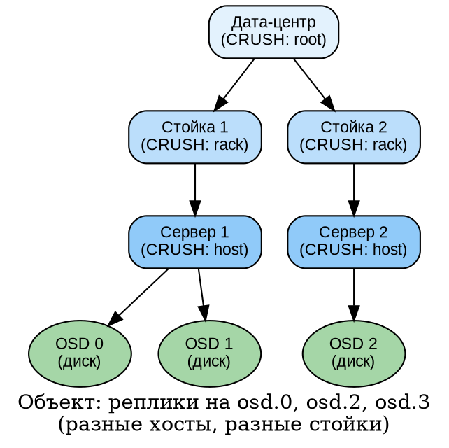
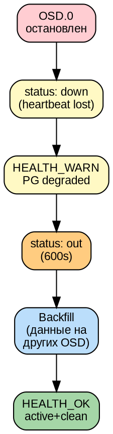
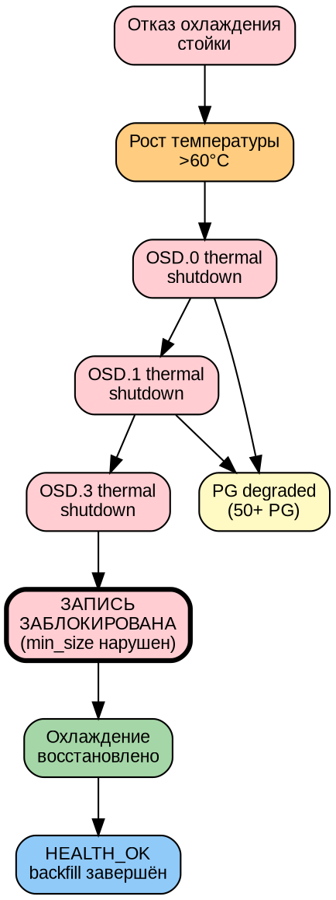
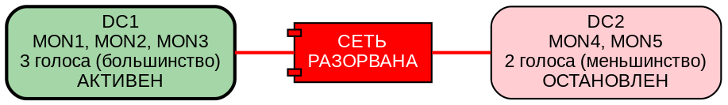
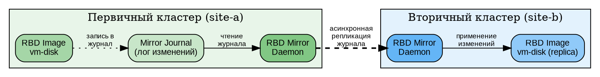
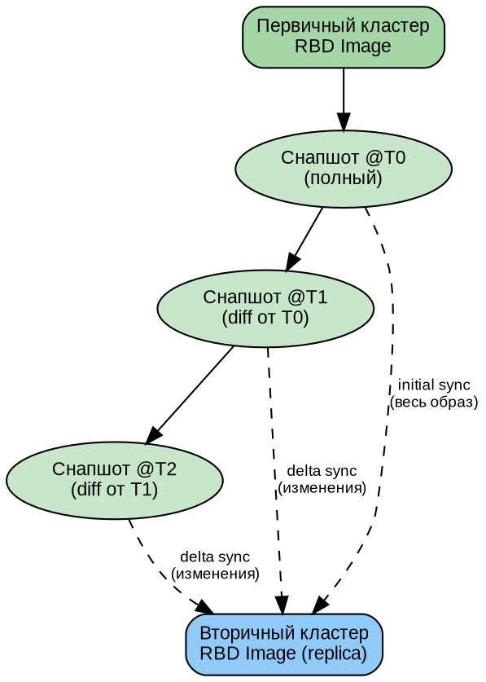
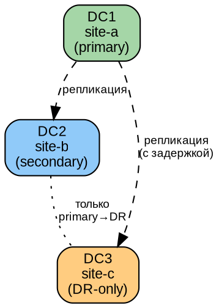
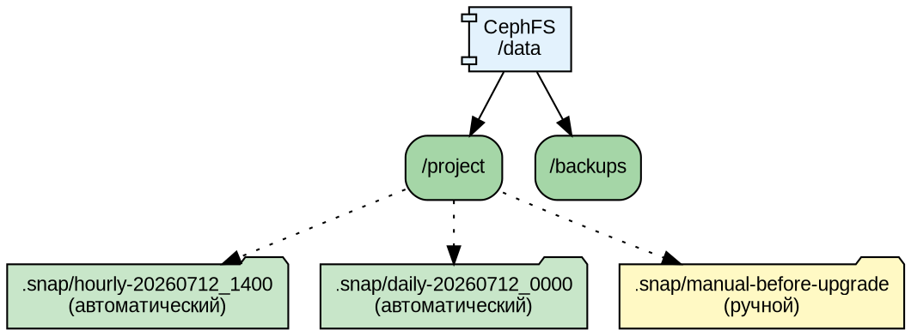
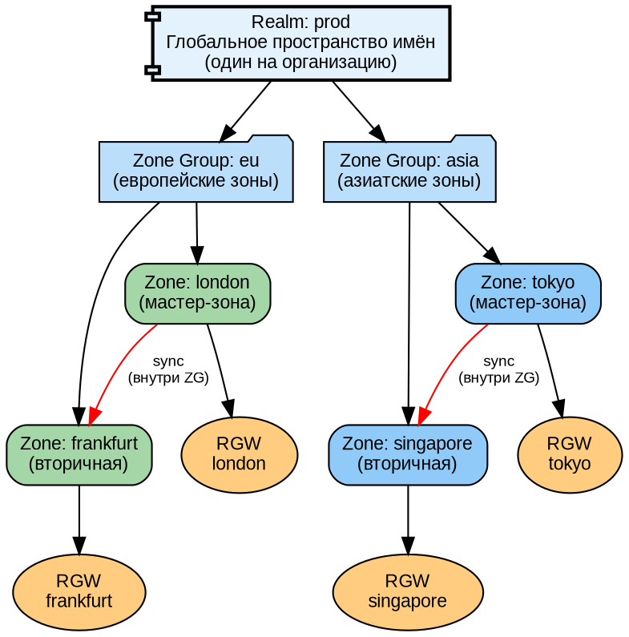
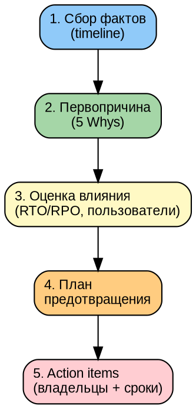

# Часть VI. Аварийные сценарии и восстановление *(90 стр., 12 кейсов)*

> **Цель:** освоить полный цикл аварийного реагирования — от классификации отказов через моделирование до post-mortem анализа.
> **После этой части вы сможете:** отработать любой аварийный сценарий, спланировать Disaster Recovery, написать post-mortem.

---

## Глава 18. Типология отказов *(12 стр.)*

### 18.1. Домен отказа *(3 стр.)*

**Домен отказа (failure domain)** — это уровень инфраструктуры, отказ которого затрагивает некоторое подмножество ресурсов. Ceph через CRUSH гарантирует, что реплики одного объекта находятся в **разных** доменах отказа на заданном уровне.



**Уровни доменов и их отказы:**

| Домен | Пример CRUSH | Что отказывает | Влияние |
|-------|-------------|---------------|---------|
| Диск (OSD) | `osd` | HDD/SSD/NVMe | 1 OSD down, PG degraded, автоматический backfill |
| Сервер (host) | `host` | Питание, сеть, ОС | Все OSD на сервере down, массовый recovery |
| Стойка (rack) | `rack` | Коммутатор стойки | Все серверы в стойке недоступны |
| Дата-центр (root) | `root` | Питание DC, канал между DC | Половина кластера недоступна |

**Принцип CRUSH:** если вы выбрали `type host`, CRUSH гарантирует, что реплики объекта попадут на разные **хосты**. Если один хост выйдет из строя — данные останутся доступны на другом хосте.

---

### 18.2. Модели отказов *(3 стр.)*

**Fail-stop (отказ-остановка):**
Компонент явно прекращает работу: процесс упал, диск отключился, сервер выключился. Самый простой для обнаружения случай. Ceph детектирует через heartbeats и `mon_osd_down_out_interval`.

**Fail-slow (отказ-замедление):**
Компонент работает, но медленно: диск с повышенной latency («умирающий» HDD с ошибками чтения), перегруженный процессор, битые сектора. **Самый опасный:** кластер не помечает OSD как `down`, но каждый запрос к нему тормозит. Диагностируется через `ceph osd perf` и `iostat`.

**Byzantine (византийский отказ):**
Компонент ведёт себя некорректно: возвращает неверные данные, искажает ответы. Может быть вызван bit flip (спонтанное изменение бита в памяти из-за космической радиации — редкое, но реальное явление), ошибкой прошивки или злонамеренным вмешательством. Ceph защищается через scrubbing (deep-scrub находит расхождения между репликами) и контрольные суммы.

**Partition (сетевое разделение):**
Сеть между узлами разорвана: две половинки кластера не видят друг друга. Каждая думает, что другая пропала. Возможен **split-brain** — ситуация «два мозга», когда обе половинки пытаются управлять кластером независимо. MON через Paxos предотвращают split-brain: только сторона с большинством голосов принимает решения.

---

### 18.3. RTO и RPO *(3 стр.)*

**RTO (Recovery Time Objective — «целевое время восстановления»):**
Сколько времени допустимо на восстановление сервиса после аварии. Измеряется от момента отказа до момента, когда сервис снова доступен.

- RTO = 5 минут: критичный сервис, требует автоматического failover
- RTO = 4 часа: можно восстановить вручную в рабочее время
- RTO = 24 часа: некритичный сервис

**RPO (Recovery Point Objective — «целевая точка восстановления»):**
Сколько данных допустимо потерять при аварии. Измеряется во времени: «можно потерять данные за последние N минут/часов».

- RPO = 0: ни байта потерь — синхронная репликация
- RPO = 1 час: допустимо потерять последний час изменений
- RPO = 24 часа: достаточно ежедневного бэкапа

**Ceph и RTO/RPO:**

| Конфигурация | RPO | RTO (типичный) |
|-------------|-----|---------------|
| Репликация ×3, size=3, min_size=2 | 0 (при отказе 1 OSD) | ~10–30 минут (backfill) |
| RBD Mirror (асинхронный) | 1–15 минут (лаг репликации) | ~5 минут (failover) |
| CephFS снапшоты (ежечасные) | 1 час | ~15 минут (восстановление) |
| RGW Multi-site | 1–5 минут | ~5 минут (переключение DNS) |

---

### 18.4. Стратегии *(3 стр.)*

- **Repair (ремонт):** починить сломанный компонент на месте — заменить диск, перезапустить процесс. Минимальное время, данные не переносятся.
- **Rebuild (перестройка):** создать компонент заново — пересоздать OSD на новом диске. Данные перераспределяются (backfill) с реплик.
- **Failover (переключение):** переключиться на резервный компонент — standby MDS занимает место active; RBD Mirror переключает клиентов на вторичный кластер.
- **Disaster Recovery (аварийное восстановление):** полное восстановление кластера из бэкапов — когда потерян весь первичный дата-центр.

---

## Глава 19. Моделирование отказов: 12 кейсов *(42 стр.)*

### 19.1. Кейс 1: отказ одного OSD *(3 стр.)*

**Модель:**
```bash
systemctl stop ceph-<fsid>@osd.0
```

**Хронометраж (типичные значения):**
```
t+0s:    osd.0 down (процесс остановлен)
t+10s:   MON замечает (heartbeat timeout)
t+300s:  HEALTH_WARN (PG degraded)
t+600s:  osd.0 out (mon_osd_down_out_interval)
t+600s:  backfill начинается (данные копируются на другие OSD)
t+900s:  HEALTH_OK (backfill завершён)
```

**DOT-схема цепочки событий:**


**Восстановление:**
```bash
systemctl start ceph-<fsid>@osd.0
# OSD up → PG backfill с данными, которые были записаны в его отсутствие → active+clean
```

---

### 19.2. Кейс 2: отказ узла с 4 OSD *(3 стр.)*

**Модель:**
```bash
ssh ceph-osd1 'shutdown -h now'
```

**Симптомы:**
```
HEALTH_WARN: 4 osds down
100+ PG degraded
Массовый backfill: recovery I/O насыщает сеть
```

**Влияние на клиентов:**
- Клиентский I/O degraded: конкуренция с recovery
- Latency растёт в 2–5 раз

**Тюнинг recovery:**
```bash
ceph config set osd osd_max_backfills 1
ceph config set osd osd_recovery_sleep 0.5
```

**Восстановление:**
- Включить сервер → OSD поднимутся → backfill догонит пропущенные изменения

---

### 19.3. Кейс 3: потеря MON (1 из 3) *(3 стр.)*

**Модель:**
```bash
systemctl stop ceph-mon@mon2
```

**Симптомы:**
```
HEALTH_WARN: 1 mons down, quorum mon1,mon3
```
- Кворум 2/3 — кластер работает
- Данные не затронуты (MON хранит метаданные, не данные)

**Восстановление:**
```bash
systemctl start ceph-mon@mon2
# MON синхронизируется с лидером (mon1) и присоединяется к кворуму
# HEALTH_OK
```

---

### 19.4. Кейс 4: потеря MON (2 из 3) *(4 стр.)*

**Модель:**
```bash
systemctl stop ceph-mon@mon2
systemctl stop ceph-mon@mon3
```

**Симптомы:**
```
ceph status: Error connecting to cluster
                No such file or directory
```
- **Кластер полностью недоступен!** MON1 один — кворума нет (1 < большинства из 3).
- Клиенты не могут получить карту кластера → не знают, к каким OSD обращаться
- Данные **физически целы на OSD**, но кластер «парализован» без управления

**Ручное восстановление (подробный разбор):**

```bash
# Шаг 1: Извлечь monmap из единственного живого MON
ceph-mon -i mon1 --extract-monmap /tmp/monmap.bin

# Шаг 2: Посмотреть, что внутри
monmaptool --print /tmp/monmap.bin
# epoch 3
# fsid 51fa3f5c-...
# mon1: 10.0.1.10:6789
# mon2: 10.0.1.11:6789
# mon3: 10.0.1.12:6789

# Шаг 3: Удалить упавшие MON из monmap
monmaptool /tmp/monmap.bin --rm mon2 --rm mon3

# Шаг 4: Внедрить урезанный monmap в MON1
ceph-mon -i mon1 --inject-monmap /tmp/monmap.bin

# Шаг 5: MON1 теперь образует кворум сам с собой (1/1)
systemctl start ceph-mon@mon1

# Шаг 6: Кластер снова доступен!
ceph status
# HEALTH_WARN: insufficient mons (1/3)

# Шаг 7: Развернуть MON заново
ceph orch apply mon --placement="mon1,mon2,mon3"
# или добавить новые узлы
ceph orch host add new-mon-node 10.0.1.20 --labels mon
```

**Почему это работает:** MON — это просто сервис, хранящий карты кластера. Если данные на OSD целы, восстановление MON из одного выжившего полностью восстанавливает управление кластером.

---

### 19.5. Кейс 5: split-brain сети *(3 стр.)*

**Модель:**
```bash
# На mon1: блокируем mon2 и mon3
iptables -A INPUT -s 10.0.1.11 -j DROP
iptables -A INPUT -s 10.0.1.12 -j DROP
iptables -A OUTPUT -d 10.0.1.11 -j DROP
iptables -A OUTPUT -d 10.0.1.12 -j DROP
```

**Что происходит:**
- **mon1:** думает, что он один — пытается стать лидером, но не может сформировать кворум (1/3 — не большинство)
- **mon2 + mon3:** видят друг друга (2/3) — формируют кворум без mon1
- **Кластер работает:** mon2+mon3 — большинство

**Разрешение:**
```bash
iptables -F  # снять блокировку
# mon1 присоединяется к кворуму 3/3
```

**Защита от split-brain в multi-DC:**
```
DC1: MON1, MON2, MON3 (3 голоса — большинство)
DC2: MON4, MON5           (2 голоса — меньшинство)
```
Если сеть между DC рвётся, DC1 продолжает работу (кворум 3/5). DC2 не может сформировать кворум (2/5) и останавливается — предотвращая split-brain.

---

### 19.6. Кейс 6: отказ стойки *(3 стр.)*

**Модель:**
```bash
# Отключение коммутатора стойки (физически или iptables на всех её серверах)
```

**Симптомы:**
```
Все OSD в стойке → down
Если CRUSH rule с type=rack: PG degraded, но данные доступны с других стоек
```

**Проверка CRUSH-изоляции:**
```bash
ceph osd crush rule dump replicated_rule
# "steps": [{"op": "chooseleaf", "num": 3, "type": "host"}]
# Тип "host" — реплики на разных хостах, но не обязательно в разных стойках!
```

**Улучшение rule для изоляции по стойкам:**
```bash
ceph osd crush rule create-replicated rack_aware default rack
ceph osd pool set <pool> crush_rule rack_aware
# Теперь 3 реплики гарантированно в 3 разных стойках
```

---

### 19.7. Кейс 7: случайное удаление пула *(3 стр.)*

**Модель:**
```bash
ceph osd pool rm important_data important_data --yes-i-really-really-mean-it
# Осторожно! Эта команда НЕОБРАТИМО удаляет пул и все данные в нём!
```

**Защита (должна быть включена ДО аварии):**
```bash
# Требовать подтверждение имени пула дважды + моникер
ceph config set mon mon_allow_pool_delete false

# Или через снапшоты
ceph osd pool mksnap important_data before_delete
```

**Восстановление (если были снапшоты):**
```bash
# Снапшот пула — это полная копия всех объектов на момент создания
# Но восстановить удалённый пул из снапшота — сложная процедура
# Лучшая защита: RBD Mirror или RGW Multi-site на другой кластер
```

---

### 19.8. Кейс 8: повреждение метаданных PG *(4 стр.)*

**Модель:**
```bash
# Найти объект на диске и перезаписать его «мусором»
dd if=/dev/urandom of=/var/lib/ceph/osd/ceph-0/current/1.7f_head/... bs=4K count=1
```

**Симптомы:**
```
HEALTH_ERR: PG_INCONSISTENT pg 1.7f
```

**Диагностика:**
```bash
ceph pg 1.7f query | jq '{state, acting, peers, stats}'
# Найти, какая реплика повреждена
```

**Автоматическое восстановление:**
```bash
ceph pg repair 1.7f
# Ceph сравнивает реплики и перезаписывает «плохую» копию «хорошей»
```

**Ручное восстановление (если repair не помог):**
```bash
# 1. Экспортировать PG с «хорошего» OSD
ceph-objectstore-tool --op export --pgid 1.7f \
    --data-path /var/lib/ceph/osd/ceph-3 --file /tmp/pg1.7f-good.bin

# 2. Импортировать на проблемный OSD (после удаления повреждённой PG)
ceph-objectstore-tool --op remove --pgid 1.7f \
    --data-path /var/lib/ceph/osd/ceph-0
ceph-objectstore-tool --op import --pgid 1.7f \
    --data-path /var/lib/ceph/osd/ceph-0 --file /tmp/pg1.7f-good.bin
```

---

### 19.9. Кейс 9: повреждение monmap *(3 стр.)*

**Модель:**
```bash
rm -rf /var/lib/ceph/mon/ceph-mon1/store.db/
```

**Симптомы:**
```
ceph-mon не запускается
journalctl -u ceph-mon@mon1: "unable to read magic"
```

**Восстановление из другого MON:**
```bash
# На mon2 (здоровом):
ceph-mon -i mon2 --extract-monmap /tmp/monmap.bin

# Скопировать на mon1:
scp /tmp/monmap.bin mon1:/tmp/

# На mon1:
ceph-mon -i mon1 --mkfs --monmap /tmp/monmap.bin --keyring /var/lib/ceph/mon/ceph-mon1/keyring
systemctl start ceph-mon@mon1
```

---

### 19.10. Кейс 10: min_size нарушен *(4 стр.)*

**Модель:**
```bash
# Пул: size=3, min_size=2 (запись требует кворума из 2 реплик)
# Остановить 2 OSD, у которых общие PG

systemctl stop ceph-<fsid>@osd.0
systemctl stop ceph-<fsid>@osd.1
# Оба OSD использовались в одних и тех же PG
```

**Симптомы:**
```
PG: active+undersized+degraded
Клиенты: блокировка записи (min_size=2, а доступна 1 реплика)
```

**Что происходит:**
- Ceph пожертвовал доступностью (нет A) ради согласованности (есть C) — см. CAP-теорему (§1.4)
- Данные **не потеряны** — они лежат на оставшейся реплике
- Запись **заблокирована** — Ceph не может гарантировать 2 реплики

**Стратегии:**
```bash
# 1. Восстановить OSD
systemctl start ceph-<fsid>@osd.0 osd.1

# 2. Временно снизить min_size (РИСК ПОТЕРИ ДАННЫХ!)
ceph osd pool set <pool> min_size 1
# Теперь запись работает с 1 репликой
# НО: если упадёт и третья — данные потеряны!
# Использовать ТОЛЬКО когда OSD восстанавливаются, и на короткое время

# 3. noout (предотвратить массовый out)
ceph osd set noout
# OSD не будут автоматически выводиться в out при временном down
# Даёт время на восстановление без запуска backfill
```

---

### 19.11. Кейс 11: восстановление из снапшотов *(4 стр.)*

**RBD:**
```bash
# Создать снапшот
rbd snap create rbd_pool/vm-disk@daily-20260707

# ... работа продолжается, данные меняются ...

# Случайное удаление важного файла в ВМ
# Восстановление:
rbd snap rollback rbd_pool/vm-disk@daily-20260707
# Образ ВМ ВОЗВРАЩЁН НА МОМЕНТ СНАПШОТА!
```

**CephFS:**
```bash
# Снапшоты CephFS доступны через скрытый каталог .snap
ls /mnt/cephfs/.snap/
# daily-20260707_000000
# hourly-20260707_140000

# Восстановить случайно удалённый файл:
cp /mnt/cephfs/.snap/hourly-20260707_140000/project/report.docx /mnt/cephfs/project/
```

**Автоматические снапшоты (snap_schedule модуль MGR):**
```bash
ceph fs snap-schedule add / 1h  # каждый час
ceph fs snap-schedule add / 1d  # каждый день
ceph fs snap-schedule retention add / h 24  # хранить 24 часовых
ceph fs snap-schedule retention add / d 7   # хранить 7 дневных
```

---

### 19.12. Кейс 12: полный DR *(4 стр.)*

**Сценарий:** потерян весь кластер (сгорел дата-центр). Остался только бэкап.

**Что должно быть забэкаплено (см. Главу 20):**
1. monmap, osdmap, crushmap
2. Ключи (`ceph auth export`)
3. RBD-образы (через RBD Mirror или экспорт)
4. CephFS-снапшоты
5. Конфигурационные файлы

**DR-процедура (общий план):**
```bash
# 1. Развернуть новый кластер
cephadm bootstrap --mon-ip <ip>

# 2. Восстановить конфигурацию
ceph auth import < auth-export.bak
crushtool -c crushmap.txt -o crushmap.bin
ceph osd setcrushmap -i crushmap.bin

# 3. Восстановить данные с бэкапов
# RBD: импортировать образы
# CephFS: скопировать из снапшотов
# RGW: переключить multi-site

# 4. Переключить клиентов
# DNS, IP, конфиги клиентов → новый кластер
```

---

### 19.13. Практикум *(1 стр.)*

**Мини-DR:**
Потеряны 2 MON из 3. Восстановите кворум из одного оставшегося MON, затем разверните MON заново.

План (DOT-схема):
1. Извлечь monmap → урезать → внедрить
2. Запустить MON1 (кворум 1/1)
3. Добавить MON2, MON3
4. HEALTH_OK

---

### 19.14. Кейс 13: каскадный отказ OSD из-за перегрева стойки *(4 стр.)*

**Сценарий:** отказ системы охлаждения в одной стойке → последовательный выход из строя дисков → массовая деградация PG.

**Модель:**

```bash
# Симулировать: остановить OSD последовательно с интервалом 60 секунд
for i in 0 1 2 3 4 5; do
    systemctl stop ceph-$(cat /etc/ceph/ceph.conf | grep fsid | awk '{print $3}')@osd.$i
    sleep 60
done
```

**Хронометраж (реальная авария):**

```
t+0m:    Температура в стойке начинает расти (кондиционер отказал)
t+15m:   SMART предупреждения: температура дисков > 60°C
t+25m:   Первый диск отключается (thermal shutdown)
t+27m:   HEALTH_WARN: 1 OSD down, PG degraded
t+30m:   Второй диск отключается
t+32m:   HEALTH_WARN: 2 OSD down, 50+ PG degraded
t+35m:   Третий диск отключается — несколько PG достигают min_size
t+38m:   Четвёртый диск — HEALTH_ERR: PG undersized, запись заблокирована
t+45m:   Дежурный инженер прибывает в дата-центр, включает резервное охлаждение
t+60m:   Температура нормализуется, диски начинают включаться
t+90m:   Все OSD up, backfill завершён, HEALTH_OK
```

**DOT-схема каскадного отказа:**



**Извлечённые уроки:**

1. **Мониторинг температуры стоек обязателен.** Добавить датчики температуры в Prometheus.
2. **Равномерное распределение OSD по стойкам.** CRUSH rule с `type=rack` предотвращает потерю данных даже при полном отказе стойки.
3. **Настроить алерты на температуру дисков** через `smartctl -A /dev/sdX | grep Temperature`.
4. **Не размещать все OSD одного узла в одной PG.** `osd_crush_chooseleaf_tries = 50` увеличивает вероятность равномерного распределения.

**Профилактика:**

```bash
# Проверить распределение OSD по стойкам
ceph osd tree

# Создать CRUSH rule с изоляцией по rack
ceph osd crush rule create-replicated rack_isolated default rack

# Применить к критичным пулам
ceph osd pool set critical_pool crush_rule rack_isolated
```

---

### 19.15. Кейс 14: разрыв сетевого соединения между дата-центрами *(4 стр.)*

**Сценарий:** два дата-центра соединены оптоволоконным каналом. Канал рвётся (строительные работы, авария на магистрали). Кластер физически разделён на две половины.

**Модель:**

```bash
# DC1 (MON1, MON2, MON3 — 3 голоса)
# DC2 (MON4, MON5 — 2 голоса)
# Блокируем трафик между DC на фаерволе
iptables -A INPUT -s 10.0.2.0/24 -j DROP
iptables -A OUTPUT -d 10.0.2.0/24 -j DROP
```

**Что происходит:**

```
DC1: MON1-MON3 формируют кворум 3/5 → продолжают работу
     OSD DC1 доступны → клиенты DC1 работают
     
DC2: MON4-MON5 — 2/5, кворума нет → MON останавливаются
     OSD DC2 физически работают, но без MON не могут обслуживать клиентов
     RGW multi-site: sync прерывается, данные накапливаются в очереди
     RBD Mirror: репликация останавливается
```

**Симптомы:**

```bash
# На DC2:
ceph status
# Error connecting to cluster: No such file or directory

# На DC1:
ceph status
# HEALTH_WARN: 2 mons down (mon4, mon5)
#               24 osds down (все OSD DC2)
#               PG degraded (реплики на DC2 недоступны)
```

**Диагностика:**

```bash
# Проверить связность между DC
ping -c 5 10.0.2.1
mtr -r 10.0.2.1

# Проверить BGP/OSPF (если используется)
birdc show route
```

**Восстановление после восстановления канала:**

```bash
# 1. Канал восстановлен — проверяем связность
ping -c 10 10.0.2.1

# 2. MON в DC2 должны автоматически подняться
# Если нет — запустить вручную:
systemctl start ceph-mon@mon4
systemctl start ceph-mon@mon5

# 3. OSD поднимутся автоматически
# 4. Начнётся backfill — контролируем:
ceph -s
ceph pg stat

# 5. RGW multi-site: sync возобновится автоматически
radosgw-admin sync status

# 6. RBD Mirror: проверить, что репликация догнала
rbd mirror pool status rbd_pool
```

**RTO факт:** 15–30 минут (время восстановления канала + backfill).

**RPO факт:** зависит от механизма репликации:
- RBD Mirror: 0–15 минут (лаг асинхронной репликации)
- RGW Multi-site: 0–5 минут (лаг sync)
- Без репликации: все данные, записанные в DC2 после разрыва — потеряны

**Защита от split-brain:**



---

### 19.16. Кейс 15: случайное удаление RBD-образа *(3 стр.)*

**Сценарий:** администратор по ошибке удалил образ виртуальной машины `prod-db-server`.

**Модель:**

```bash
# Создаём образ с данными
rbd create rbd_pool/test-vm --size 10G
rbd map rbd_pool/test-vm
mkfs.ext4 /dev/rbd0
mount /dev/rbd0 /mnt
echo "critical data" > /mnt/important.txt
umount /mnt
rbd unmap rbd_pool/test-vm

# Имитация ошибки: удаление образа (если не было защиты)
rbd rm rbd_pool/test-vm
# Образ удалён. Данные потеряны — если нет снапшотов или Mirror.
```

**Симптомы:**

```bash
rbd info rbd_pool/test-vm
# rbd: error opening image test-vm: (2) No such file or directory
```

**Способы восстановления (в порядке убывания скорости):**

**Способ 1: RBD Mirror (если настроен):**

```bash
# На вторичном кластере:
rbd mirror image status rbd_pool/test-vm
# state: up+stopped (реплика остановлена, данные скопированы)

rbd mirror image promote rbd_pool/test-vm
# Образ доступен на вторичном кластере

# Скопировать обратно на первичный:
rbd export rbd_pool/test-vm - | ssh primary 'rbd import - rbd_pool/test-vm'
```

**Способ 2: Снапшоты RBD (если были созданы):**

```bash
# Восстановить из последнего снапшота
rbd snap ls rbd_pool/test-vm
# daily-20260707_000000
# daily-20260708_000000

# Снапшоты не удаляются вместе с образом, если настроена защита:
rbd snap protect rbd_pool/test-vm@daily-20260708_000000

# Восстановление:
rbd clone rbd_pool/test-vm@daily-20260708_000000 rbd_pool/recovered-vm
rbd flatten rbd_pool/recovered-vm
# recovered-vm теперь независимый образ = данным на момент снапшота
```

**Способ 3: Trash (корзина — Ceph Pacific+):**

```bash
# Если образ был перемещён в корзину (delay перед удалением):
rbd trash ls rbd_pool
# <id>  test-vm

rbd trash restore rbd_pool/<id>
# Образ восстановлен!
```

**Защита (настроить до аварии):**

```bash
# 1. Включить перемещение в корзину с задержкой
rbd trash move rbd_pool/prod-db-server
# Образ не удалён, а перемещён в корзину

# 2. Защита снапшотов от удаления
rbd snap protect rbd_pool/prod-db-server@daily-latest

# 3. Блокировка удаления через RBD Mirror
# Если образ участвует в Mirror, удаление на первичном не удалит
# его на вторичном до подтверждения
```

---

### 19.17. Кейс 16: повреждение файловой системы BlueStore *(4 стр.)*

**Сценарий:** внезапное отключение питания сервера → повреждение метаданных RocksDB на одном OSD → OSD не может запуститься.

**Модель:**

```bash
# Симулировать: убить процесс OSD жёстко (SIGKILL) и повредить RocksDB
kill -9 <osd-pid>
# Файловая система не успела сбросить буферы
```

**Симптомы:**

```bash
systemctl status ceph-<fsid>@osd.5
# Active: failed
# ... unable to open rocksdb

journalctl -u ceph-<fsid>@osd.5 --no-pager | tail -20
# "rocksdb: Corruption: corrupted compressed block contents"
# "rocksdb: Corruption: bad block magic number"
```

**Диагностика:**

```bash
# Проверить состояние BlueStore
ceph-bluestore-tool show-label --path /var/lib/ceph/osd/ceph-5
# Если возвращает корректные метаданные — шанс на восстановление есть

# Попробовать консистентность RocksDB
ceph-bluestore-tool bluefs-export --path /var/lib/ceph/osd/ceph-5 --out-dir /tmp/osd5-export
# Если экспорт проходит — метаданные восстанавливаются
```

**Восстановление:**

```bash
# Шаг 1: Попробовать восстановить RocksDB
ceph-kvstore-tool --bluestore-kvbackend rocksdb \
    --path /var/lib/ceph/osd/ceph-5 repair

# Шаг 2: Если repair не помог — пересоздать OSD
ceph osd out 5

# Шаг 3: Полное удаление и пересоздание OSD
ceph osd destroy 5 --yes-i-really-mean-it
ceph-volume lvm zap /dev/sdX
ceph-volume lvm create --osd-id 5 --data /dev/sdX

# Шаг 4: Данные будут восстановлены через backfill с других реплик
# Длительность: зависит от объёма данных на OSD
# Типично: 1–4 часа для HDD 4TB, 30–60 минут для SSD 1TB
```

**Профилактика:**

```bash
# 1. Использовать SSD/NVMe для WAL+DB (BlueStore) — быстрее восстановление
ceph-volume lvm batch /dev/sdX /dev/nvme0n1

# 2. Батарейное резервирование (BBU/JBOD) или ИБП на каждый сервер
# 3. Настроить упреждающий мониторинг SMART
smartctl -a /dev/sdX | grep -E "Reallocated|Pending|Uncorrectable"
```

**Сравнение времени восстановления:**

| Метод восстановления | Время | Данные потеряны? |
|---------------------|-------|------------------|
| Перезапуск OSD | 5–30 сек | Нет |
| Repair RocksDB | 1–5 мин | Нет |
| Пересоздание OSD + backfill | 1–4 часа | Нет (восстановление с реплик) |
| Замена диска + backfill | 2–8 часов | Нет (если min_size не нарушен) |

---

### 19.18. Кейс 17: утечка памяти MGR и деградация производительности *(3 стр.)*

**Сценарий:** модуль MGR (например, `prometheus`) потребляет всё больше памяти → OOM-killer убивает MGR → панель мониторинга теряет данные, панель управления недоступна.

**Модель:**

```bash
# Симулировать: запустить MGR с ограничением памяти
systemd-run --user --pty -p MemoryMax=500M ceph-mgr -i node1
# MGR будет убит OOM-killer при превышении лимита
```

**Симптомы:**

```
t+0h:  MGR использует 2 GB RAM (норма)
t+12h: MGR использует 8 GB RAM (рост)
t+24h: MGR использует 16 GB RAM (аномалия)
t+36h: OOM-killer убивает MGR
       HEALTH_WARN: no active mgr
       Prometheus scrape: connection refused
       Dashboard: 502 Bad Gateway
```

**Диагностика:**

```bash
# История использования памяти MGR
ceph tell mgr.\* perf dump | jq '.mgr.mem'
# или через системный мониторинг
ps aux | grep ceph-mgr
# ceph   12345  15.2  12.4  ...  (12.4% от RAM — аномально много)

# Посмотреть активные модули
ceph mgr module ls | jq '.enabled_modules'

# Отключить проблемный модуль
ceph mgr module disable prometheus
# Если память стабилизировалась — проблема в модуле
```

**Восстановление:**

```bash
# 1. Перезапустить MGR
systemctl restart ceph-mgr@node1

# 2. Проверить, что standby MGR активировался
ceph mgr stat
# {"active_name":"node2"}  или node1 после перезапуска

# 3. Если проблема повторяется — отключить проблемный модуль
ceph mgr module disable <problem_module>

# 4. Настроить несколько standby MGR для автоматического failover
ceph orch apply mgr --placement="3 node1 node2 node3"
```

**Профилактика:**

```yaml
# Prometheus alert rule для мониторинга памяти MGR
groups:
  - name: ceph_mgr
    rules:
      - alert: CephMgrHighMemory
        expr: ceph_mgr_memory_usage_bytes / 1024^3 > 8
        for: 30m
        annotations:
          summary: "Ceph MGR использует >8 GB RAM более 30 минут"
```

---

### 19.19. Практикум: расширенный *(2 стр.)*

**Задание 1: Каскадный отказ**
Смоделируйте каскадный отказ: потеря MON majority + потеря OSD. Опишите последовательность действий по восстановлению в виде DOT-схемы.

**Задание 2: Восстановление из Trash**
Создайте RBD-образ, заполните данными, переместите в корзину, восстановите из корзины. Проверьте целостность данных.

**Задание 3: BlueStore recovery**
Создайте сценарий повреждения метаданных BlueStore. Опишите процедуру диагностики и восстановления.

---

## Глава 20. Бэкап и Disaster Recovery *(20 стр.)*

### 20.1. Что бэкапить *(3 стр.)*

**Скрипт ежедневного бэкапа:**
```bash
#!/bin/bash
BACKUP_DIR=/backup/ceph/$(date +%Y%m%d)
mkdir -p $BACKUP_DIR

# 1. Карты кластера
ceph mon getmap -o $BACKUP_DIR/monmap.bin
ceph osd getmap -o $BACKUP_DIR/osdmap.bin
ceph osd getcrushmap -o $BACKUP_DIR/crushmap.bin

# 2. Ключи
ceph auth export > $BACKUP_DIR/auth-export.txt

# 3. Конфигурация
cp /etc/ceph/ceph.conf $BACKUP_DIR/

# 4. Список пулов и их параметров
ceph osd pool ls > $BACKUP_DIR/pools.txt
for p in $(ceph osd pool ls); do
    ceph osd pool get $p all >> $BACKUP_DIR/pool-$p.txt
done

echo "Backup saved to $BACKUP_DIR"
```

---

### 20.2. RBD Mirror: расширенная настройка *(16 стр.)*

#### 20.2.1. Режимы зеркалирования

RBD Mirror поддерживает два режима синхронизации:

| Режим | Механизм | RPO | Накладные расходы | Применение |
|-------|----------|-----|-------------------|------------|
| **Journal-based** | Лог изменений на образе, реплицируется посекундно | ~1 секунда | Запись + репликация журнала (~10–15% overhead) | Критичные ВМ с низким RPO |
| **Snapshot-based** | Периодические снапшоты + diff между ними | 5–60 минут | Минимальные (только во время снапшота) | Некритичные ВМ, большие образы |

**Архитектура journal-based:**



**Архитектура snapshot-based:**



#### 20.2.2. Полная настройка RBD Mirror (journal-based)

**Шаг 1: Подготовка пулов на обоих кластерах**

```bash
# На КЛАСТЕРЕ A (первичный, site-a):
ceph osd pool create rbd_pool 128 128
ceph osd pool application enable rbd_pool rbd

# На КЛАСТЕРЕ B (вторичный, site-b):
ceph osd pool create rbd_pool 128 128
ceph osd pool application enable rbd_pool rbd
# Пул должен иметь ТОЧНО такое же имя на обоих кластерах!
```

**Шаг 2: Активация mirroring на уровне пула**

```bash
# На ОБОИХ кластерах:
rbd mirror pool enable rbd_pool image
# Режим image — mirroring на уровне отдельных образов

# Альтернатива: pool mode — все образы в пуле автоматически зеркалируются
rbd mirror pool enable rbd_pool pool

# Проверить:
rbd mirror pool info rbd_pool
# Mode: image
# Peers: none (пока нет пиров)
```

**Шаг 3: Создание пользователя для mirroring**

```bash
# На КЛАСТЕРЕ A:
ceph auth get-or-create client.rbd-mirror-peer \
    mon 'profile rbd-mirror-peer' \
    osd 'profile rbd' \
    -o /etc/ceph/ceph.client.rbd-mirror-peer.keyring

# Копируем keyring на КЛАСТЕР B
scp /etc/ceph/ceph.client.rbd-mirror-peer.keyring cluster-b:/etc/ceph/
```

**Шаг 4: Peering (установка связи между кластерами)**

```bash
# На КЛАСТЕРЕ A: генерируем bootstrap-токен
rbd mirror pool peer bootstrap create \
    --site-name site-a \
    --cluster site-a \
    --pool rbd_pool \
    rbd-mirror-peer > /tmp/bootstrap-token-site-a

# Копируем токен на КЛАСТЕР B
scp /tmp/bootstrap-token-site-a cluster-b:/tmp/

# На КЛАСТЕРЕ B: импортируем токен
rbd mirror pool peer bootstrap import \
    --site-name site-b \
    --cluster site-b \
    --pool rbd_pool \
    /tmp/bootstrap-token-site-a

# Аналогично в обратную сторону (если нужна двусторонняя репликация):
# На КЛАСТЕРЕ B:
rbd mirror pool peer bootstrap create \
    --site-name site-b \
    --cluster site-b \
    --pool rbd_pool \
    rbd-mirror-peer > /tmp/bootstrap-token-site-b

# На КЛАСТЕРЕ A:
rbd mirror pool peer bootstrap import \
    --site-name site-a \
    --cluster site-a \
    --pool rbd_pool \
    /tmp/bootstrap-token-site-b
```

**Шаг 5: Проверка peering**

```bash
# На любом кластере:
rbd mirror pool info rbd_pool
# Mode: image
# Peers:
#   UUID: 3f5c8a1b-...  Site: site-b  Direction: rx-tx
#   UUID: 9a2b7d4e-...  Site: site-a  Direction: rx-tx

rbd mirror pool status rbd_pool
# health: OK
# images: 0 total (пока нет образов)
```

**Шаг 6: Создание образа и включение mirroring**

```bash
# На КЛАСТЕРЕ A:
rbd create rbd_pool/vm-disk --size 50G

# Включить журналирование на образе (journal-based)
rbd feature enable rbd_pool/vm-disk journaling

# Включить mirroring для образа
rbd mirror image enable rbd_pool/vm-disk journal

# Проверить статус
rbd mirror image status rbd_pool/vm-disk
# vm-disk:
#   global_id:   6b8b4567-...
#   state:       up+replaying (первичный, активен)
#   description: replaying, master_position=[...]
#   last_update: 2026-07-12 14:30:15
```

**Шаг 7: Начальная синхронизация**

```bash
# При первом включении mirroring создаётся полная копия образа
# Это может занять длительное время для больших образов

# Мониторинг прогресса начальной синхронизации:
rbd mirror image status rbd_pool/vm-disk
# state: up+syncing  ← идёт начальная синхронизация

# После завершения:
# state: up+replaying  ← активная репликация
```

**Шаг 8: Развёртывание rbd-mirror daemon**

```bash
# Cephadm (рекомендуемый способ):
ceph orch apply rbd-mirror --placement="2 site-a-host1 site-a-host2"

# Вручную (без cephadm):
systemctl enable --now ceph-rbd-mirror@rbd-mirror.service

# Проверить статус daemon
ceph orch ps --daemon-type rbd-mirror
# или
systemctl status ceph-rbd-mirror@rbd-mirror
```

#### 20.2.3. Multi-cluster конфигурация (три кластера)

**Сценарий:** три дата-центра (DC1, DC2, DC3) с взаимной репликацией:



**Настройка трёхстороннего peering:**

```bash
# Настройка идентична парной, но выполняется для каждой пары:
# DC1 ↔ DC2
# DC1 ↔ DC3
# DC2 ↔ DC3 (опционально)

# На DC1:
rbd mirror pool peer bootstrap create --site-name dc1 --pool rbd_pool rbd-mirror-peer > /tmp/token-dc1
rbd mirror pool peer bootstrap import --site-name dc2 --pool rbd_pool /tmp/token-dc2
rbd mirror pool peer bootstrap import --site-name dc3 --pool rbd_pool /tmp/token-dc3

# Проверить все пиры:
rbd mirror pool info rbd_pool
# Peers:
#   UUID: aaa... Site: dc2  Direction: rx-tx
#   UUID: bbb... Site: dc3  Direction: rx-tx
```

**Особенности multi-cluster:**

1. **Один primary, много secondary.** Образ может иметь только один primary в каждый момент времени.
2. **Failover между любыми DC.** При отказе DC1 можно promote на DC2 или DC3.
3. **Разные RPO для разных DC.** DC2 может иметь RPO=5мин, DC3 — RPO=1ч (snapshot-based).
4. **Геораспределённые задержки.** Учитывать latency между DC при выборе режима.

#### 20.2.4. Failover: пошаговая процедура

**Плановый failover** (обслуживание, миграция):

```bash
# Фаза 1: Остановка клиентов на первичном кластере
# Отключить ВМ, использующие образы RBD

# Фаза 2: Demote первичного образа
# На КЛАСТЕРЕ A (первичный):
rbd mirror image demote rbd_pool/vm-disk
# state: up+stopped (репликация остановлена, все изменения синхронизированы)

# Фаза 3: Проверка синхронизации
rbd mirror image status rbd_pool/vm-disk
# description: local image is primary=false, replaying stopped
# last_update: должно быть ~несколько секунд назад

# Фаза 4: Promote вторичного образа
# На КЛАСТЕРЕ B (вторичный):
rbd mirror image status rbd_pool/vm-disk
# state: up+stopped (данные синхронизированы, ждёт promote)

rbd mirror image promote rbd_pool/vm-disk
# state: up+replaying (теперь это новый primary!)

# Фаза 5: Переключение клиентов на КЛАСТЕР B
# Обновить конфигурацию клиентов (ceph.conf, keyring) — указать MON кластера B
# Запустить ВМ на новом primary

# Фаза 6: Проверка записи
# На КЛАСТЕРЕ B:
rbd map rbd_pool/vm-disk
dd if=/dev/zero of=/dev/rbd0 bs=4K count=1000
rbd unmap rbd_pool/vm-disk

# Проверить, что изменения реплицируются на КЛАСТЕР A (теперь secondary):
# На КЛАСТЕРЕ A:
rbd mirror image status rbd_pool/vm-disk
# state: up+replaying  ← принимает изменения от нового primary
```

**Аварийный failover** (отказ первичного кластера):

```bash
# Фаза 1: Обнаружение отказа
# HEALTH_ERR или полная недоступность кластера A

# Фаза 2: Принудительный promote (demote невозможен — кластер A недоступен)
# На КЛАСТЕРЕ B:
rbd mirror image promote --force rbd_pool/vm-disk
# --force: пропустить demote на недоступном primary
# ВНИМАНИЕ: последние незасинхронизированные изменения на кластере A БУДУТ ПОТЕРЯНЫ

# Фаза 3: Проверить состояние
rbd mirror image status rbd_pool/vm-disk
# state: up+replaying (новый primary на кластере B)

# Фаза 4: Переключить клиентов
# DNS: CNAME записи или GeoDNS
# Конфигурация: обновить MON-адреса на кластер B
```

**Failback** (возврат на исходный primary после восстановления):

```bash
# Кластер A восстановлен. Хотим вернуть primary на A.

# На КЛАСТЕРЕ A:
rbd mirror image status rbd_pool/vm-disk
# state: up+replaying (A — secondary, получает изменения от B)

# Фаза 1: Demote на кластере B (текущий primary)
# На КЛАСТЕРЕ B:
rbd mirror image demote rbd_pool/vm-disk

# Фаза 2: Проверить синхронизацию
rbd mirror image status rbd_pool/vm-disk
# last_update — несколько секунд назад

# Фаза 3: Promote на кластере A (исходный primary)
# На КЛАСТЕРЕ A:
rbd mirror image promote rbd_pool/vm-disk

# Фаза 4: Переключить клиентов обратно
```

#### 20.2.5. Мониторинг и устранение неисправностей

**Мониторинг статуса:**

```bash
# Состояние всех образов в пуле
rbd mirror pool status rbd_pool --verbose
# health: OK
# images: 12 total
#   12 replaying
#   0 stopped
#   0 error

# Детальный статус образа
rbd mirror image status rbd_pool/vm-disk
# vm-disk:
#   global_id: 6b8b4567-...
#   state: up+replaying
#   description: replaying, master_position=[object_number=...]
#   service: rbd-mirror.host1 on host1
#   last_update: 2026-07-12 14:30:15
#   peer_sites:
#     site-b: bytes_sent=123456789, bytes_received=987654321
#     site-c: bytes_sent=123456789, bytes_received=987654321

# Статистика по пулу
rbd mirror pool status rbd_pool
# journal: 1024 entries, 524288 bytes
```

**Частые проблемы:**

| Проблема | Причина | Решение |
|----------|---------|---------|
| `state: up+stopped` | Demote выполнен, promote — нет | Выполнить `promote` на secondary |
| `state: down+unknown` | rbd-mirror daemon упал | `systemctl restart ceph-rbd-mirror@rbd-mirror` |
| `state: up+syncing` (долго) | Начальная синхронизация большого образа | Ожидать; ускорить: `rbd mirror image resync` |
| `state: up+error` | Ошибка репликации (сеть, аутентификация) | Проверить: `rbd mirror pool status --verbose` |
| `last_update` > 5 мин назад | Разрыв связи между кластерами | Проверить сеть, MON на обоих кластерах |
| `split-brain` | Два образа одновременно promote | Выбрать authoritative copy; resync другой |

**Диагностика отставания репликации:**

```bash
# Проверить лаг (journal-based)
rbd mirror image status rbd_pool/vm-disk | jq '.description'
# "replaying, master_position=[object_number=12345], mirror_position=[object_number=12340]"
# Отставание: 5 объектов

# Проверить лаг (snapshot-based)
rbd mirror image status rbd_pool/vm-disk
# snapshot-based: remote snapshot name: .mirror.primary.snap.20260712_143000
# local snapshot: .mirror.primary.snap.20260712_142500
# Отставание: 5 минут
```

**Resync (полная пересинхронизация):**

```bash
# Если реплика разошлась (split-brain разрешён, но данные не совпадают):
# На secondary:
rbd mirror image resync rbd_pool/vm-disk
# Полная перезапись secondary с primary
# ВНИМАНИЕ: все локальные изменения на secondary будут потеряны!
```

---

### 20.3. CephFS Snapshots: управление и политики хранения *(8 стр.)*

#### 20.3.1. Архитектура снапшотов CephFS

Снапшоты CephFS создаются на уровне директорий (а не всей файловой системы) и используют COW (Copy-on-Write). При создании снапшота данные не копируются — только метаданные. При изменении файла исходные данные сохраняются в снапшоте.



#### 20.3.2. Настройка расписания снапшотов

**Базовое расписание (snap_schedule модуль MGR):**

```bash
# Убедиться, что модуль включён
ceph mgr module enable snap_schedule

# Добавить расписание для всей файловой системы (/)
ceph fs snap-schedule add / 1h      # каждый час
ceph fs snap-schedule add / 1d      # каждый день в полночь
ceph fs snap-schedule add / 7d      # каждую неделю (воскресенье)

# Можно указать время начала:
ceph fs snap-schedule add / 1d 02:00  # каждый день в 2:00 ночи
ceph fs snap-schedule add / 1h 30m    # каждый час в :30 (14:30, 15:30, ...)
```

**Периодиректорные расписания:**

```bash
# Разные политики для разных директорий
ceph fs snap-schedule add /project     1h   # проект — каждый час
ceph fs snap-schedule add /project     1d   # проект — каждый день
ceph fs snap-schedule add /archive     7d   # архив — раз в неделю
ceph fs snap-schedule add /tmp         1d   # временные — раз в день
```

**Просмотр расписаний:**

```bash
# Все расписания
ceph fs snap-schedule list /

# Детально по директории
ceph fs snap-schedule list /project --recursive

# Статус: когда следующий снапшот
ceph fs snap-schedule status /
# Path   Schedule   Next
# /      1h         2026-07-12 15:00:00
# /      1d         2026-07-13 00:00:00
# /      7d         2026-07-19 00:00:00
```

#### 20.3.3. Политики хранения (retention)

**Настройка retention:**

```bash
# Хранить:
ceph fs snap-schedule retention add / h 24   # 24 часовых снапшота
ceph fs snap-schedule retention add / d 7    # 7 дневных
ceph fs snap-schedule retention add / w 4    # 4 недельных
ceph fs snap-schedule retention add / M 12   # 12 месячных

# Для критичных директорий — больше хранения:
ceph fs snap-schedule retention add /database h 48
ceph fs snap-schedule retention add /database d 30
ceph fs snap-schedule retention add /database w 12
```

**Просмотр retention:**

```bash
ceph fs snap-schedule retention list /
# Path   Retention
# /      count: h=24, d=7, w=4, M=12
```

**Удаление retention:**

```bash
ceph fs snap-schedule retention remove / h
ceph fs snap-schedule retention remove / d
```

#### 20.3.4. Ручные снапшоты

```bash
# Создать снапшот конкретной директории
mkdir /mnt/cephfs/project/.snap/before-upgrade

# Или через ceph CLI:
ceph fs subvolume snapshot create cephfs project before-upgrade

# Просмотр всех снапшотов
ls -la /mnt/cephfs/project/.snap/

# Информация о снапшоте:
# Снапшоты доступны только для чтения (read-only)
# Они не занимают места, пока исходные данные не изменятся
```

**Восстановление из снапшота:**

```bash
# Восстановить один файл:
cp /mnt/cephfs/project/.snap/daily-20260712_0000/report.docx \
   /mnt/cephfs/project/report.docx

# Восстановить всю директорию:
cp -a /mnt/cephfs/project/.snap/daily-20260712_0000/src \
      /mnt/cephfs/project/src_restored

# Просмотр содержимого снапшота без копирования:
ls -R /mnt/cephfs/project/.snap/hourly-20260712_1400/
```

**Удаление снапшотов:**

```bash
# Удалить конкретный снапшот:
rmdir /mnt/cephfs/project/.snap/old-snapshot

# Массовое удаление старых (старше 30 дней):
find /mnt/cephfs/project/.snap/ -maxdepth 1 -name 'daily-*' \
    -mtime +30 -exec rmdir {} \;

# Retention удаляет автоматически — ручное удаление редко требуется
```

#### 20.3.5. Мониторинг использования снапшотов

```bash
# Использование места снапшотами
ceph fs snap-schedule status / --format json | jq '.'

# Занятое место (снапшоты + активные данные)
ceph df | grep cephfs

# Количество снапшотов
ceph fs snap-schedule list / --recursive | wc -l

# Просмотр всех снапшотов в файловой системе
find /mnt/cephfs -name '.snap' -prune -o -type d -name '.snap' -exec ls {} \;
```

**Alerts Prometheus для мониторинга снапшотов:**

```yaml
groups:
  - name: cephfs_snapshots
    rules:
      - alert: CephFSSnapshotCountHigh
        expr: cephfs_snapshot_count > 1000
        for: 1h
        annotations:
          summary: "Слишком много снапшотов CephFS (>1000)"

      - alert: CephFSSnapshotAgeHigh
        expr: (time() - cephfs_snapshot_newest_timestamp) > 86400
        for: 1h
        annotations:
          summary: "Последний снапшот CephFS старше 24 часов"
```

#### 20.3.6. Практические сценарии

**Сценарий 1: Восстановление после rm -rf**

```bash
# Пользователь случайно удалил все файлы в /project
# Восстановление:
SNAPDIR=/mnt/cephfs/project/.snap/daily-$(date +%Y%m%d)_0000
if [ -d "$SNAPDIR" ]; then
    cp -a "$SNAPDIR"/* /mnt/cephfs/project/
    echo "Восстановлено из $SNAPDIR"
else
    # Попробовать последний часовой
    LATEST=$(ls -1dt /mnt/cephfs/project/.snap/hourly-* 2>/dev/null | head -1)
    cp -a "$LATEST"/* /mnt/cephfs/project/
fi
```

**Сценарий 2: Сравнение версий файла**

```bash
# Сравнить текущую версию с версией трёхдневной давности
diff /mnt/cephfs/project/config.yaml \
     /mnt/cephfs/project/.snap/daily-$(date -d '3 days ago' +%Y%m%d)_0000/config.yaml
```

**Сценарий 3: Массовое восстановление после шифровальщика**

```bash
# Если ransomware зашифровал файлы:
# 1. Найти все изменённые файлы
find /mnt/cephfs/project -type f -newer /mnt/cephfs/project/.snap/daily-20260712_0000

# 2. Восстановить из последнего снапшота до атаки
rsync -av --delete \
    /mnt/cephfs/project/.snap/daily-20260712_0000/ \
    /mnt/cephfs/project/
# --delete удалит зашифрованные файлы, которых не было в снапшоте
```

---

### 20.4. RGW Multi-site: детальная настройка *(12 стр.)*

#### 20.4.1. Иерархия понятий



**Иерархия объектов:**

| Уровень | Объект | Назначение | Пример |
|--------|--------|-----------|--------|
| 1 (верхний) | **Realm** | Глобальное пространство имён. Все Zone Groups внутри realm могут синхронизироваться | `prod`, `test` |
| 2 | **Zone Group** | Географическая/логическая группа зон. Содержит мастер-зону | `eu`, `us`, `asia` |
| 3 | **Zone** | Отдельный экземпляр RGW. Одна зона — мастер в Zone Group | `london`, `frankfurt` |
| 4 | **RGW Daemon** | Процесс RGW, обслуживающий зону | `rgw.london.host1` |

#### 20.4.2. Полная пошаговая настройка

**Шаг 1: Создание Realm (на первичном кластере — moscow)**

```bash
# Realm — верхний уровень иерархии
radosgw-admin realm create --rgw-realm=prod --default

# Проверить
radosgw-admin realm list
# {
#   "default_info": "f5a36b12-...",
#   "realms": ["prod"]
# }

radosgw-admin realm get
# {
#   "id": "f5a36b12-...",
#   "name": "prod",
#   "current_period": "..."
# }
```

**Шаг 2: Создание мастер Zone Group**

```bash
# Zone Group — группа географически близких зон
radosgw-admin zonegroup create \
    --rgw-zonegroup=ru \
    --endpoints=http://rgw.moscow.example.com:80 \
    --master \
    --default

# Проверить
radosgw-admin zonegroup list
# {"zonegroups": ["ru"]}

radosgw-admin zonegroup get
# {
#   "id": "3a7f9d1e-...",
#   "name": "ru",
#   "is_master": true,
#   "endpoints": ["http://rgw.moscow.example.com:80"],
#   "zones": []
# }
```

**Шаг 3: Создание зон**

```bash
# Мастер-зона (moscow)
radosgw-admin zone create \
    --rgw-zonegroup=ru \
    --rgw-zone=moscow \
    --endpoints=http://rgw.moscow.example.com:80 \
    --access-key=ABCDEFGHIJKLMNOP \
    --secret=0123456789abcdef0123456789abcdef01234567 \
    --master \
    --default

# Вторичная зона (spb)
radosgw-admin zone create \
    --rgw-zonegroup=ru \
    --rgw-zone=spb \
    --endpoints=http://rgw.spb.example.com:80 \
    --access-key=ZYXWVUTSRQPONMLK \
    --secret=fedcba9876543210fedcba9876543210fedcba98
```

**Шаг 4: Создание системного пользователя для синхронизации**

```bash
# На обеих зонах:
radosgw-admin user create \
    --uid=sync-user \
    --display-name="Sync User" \
    --system \
    --access-key=SYNCACCESSKEY123 \
    --secret=syncsecretkey456syncsecretkey456syncsec

# Проверить:
radosgw-admin user info --uid=sync-user
```

**Шаг 5: Коммит периода (period commit)**

```bash
# Period — это «снимок» конфигурации realm + zonegroup + zone
# После изменений нужно обновлять period:

radosgw-admin period update --commit

# Проверить:
radosgw-admin period get
# {
#   "id": "period-20260712-a1b2c3d4-...",
#   "epoch": 1,
#   "predecessor_uuid": "...",
#   "realm_name": "prod"
# }
```

**Шаг 6: Экспорт конфигурации для вторичной зоны**

```bash
# На мастер-зоне (moscow):
radosgw-admin realm pull --rgw-realm=prod \
    --url=http://rgw.moscow.example.com:80 \
    --access-key=SYNCACCESSKEY123 \
    --secret=syncsecretkey456syncsecretkey456syncsec

# Или через JSON-экспорт:
radosgw-admin realm get --rgw-realm=prod > realm-prod.json
radosgw-admin zonegroup get --rgw-zonegroup=ru > zg-ru.json
radosgw-admin zone get --rgw-zone=moscow > zone-moscow.json
radosgw-admin zone get --rgw-zone=spb > zone-spb.json

# Скопировать JSON-файлы на вторичный кластер
scp realm-prod.json zg-ru.json zone-moscow.json zone-spb.json spb:/tmp/
```

**Шаг 7: Импорт конфигурации на вторичной зоне**

```bash
# На вторичном кластере (spb):
# Запустить RGW
systemctl start ceph-radosgw@rgw.spb

# Импортировать realm
radosgw-admin realm import < /tmp/realm-prod.json
radosgw-admin realm default --rgw-realm=prod

# Импортировать zonegroup
radosgw-admin zonegroup import < /tmp/zg-ru.json
radosgw-admin zonegroup default --rgw-zonegroup=ru

# Импортировать зоны
radosgw-admin zone import < /tmp/zone-moscow.json
radosgw-admin zone import < /tmp/zone-spb.json
radosgw-admin zone default --rgw-zone=spb

# Обновить период
radosgw-admin period update --commit
```

**Шаг 8: Проверка синхронизации**

```bash
# На любой зоне:
radosgw-admin sync status
# {
#   "realm": "prod",
#   "zonegroup": "ru",
#   "zone": "moscow",
#   "status": "init",
#   "num_shards": 64,
#   "shards": [...]
# }

# После начальной синхронизации:
# "status": "init" → "syncing" → "complete"

# Полный статус с данными по шардам:
radosgw-admin sync status --rgw-zone=moscow
radosgw-admin metadata sync status
radosgw-admin data sync status
```

#### 20.4.3. Sync Policy (политики синхронизации)

**Двунаправленная (симметричная) синхронизация (по умолчанию):**

```bash
# Все bucket'ы синхронизируются в обе стороны
radosgw-admin sync policy create \
    --rgw-realm=prod \
    --group=default \
    --status=enabled
```

**Однонаправленная синхронизация:**

```bash
# Только moscow → spb (DR-реплика)
radosgw-admin sync policy group create \
    --rgw-realm=prod \
    --group=dr-sync \
    --status=enabled

radosgw-admin sync policy group flow create \
    --rgw-realm=prod \
    --group=dr-sync \
    --flow=moscow-to-spb \
    --zones=moscow,spb \
    --status=enabled

# Установить направление
radosgw-admin sync policy group flow pipe create \
    --rgw-realm=prod \
    --group=dr-sync \
    --flow=moscow-to-spb \
    --pipe=main \
    --source-zones=moscow \
    --source-buckets='*' \
    --dest-zones=spb \
    --dest-buckets='*' \
    --status=enabled
```

**Фильтрация по bucket'ам:**

```bash
# Синхронизировать только bucket'ы с префиксом "prod-"
radosgw-admin sync policy group flow pipe create \
    --rgw-realm=prod \
    --pipe=prod-only \
    --source-buckets='prod-*' \
    --dest-buckets='prod-*' \
    --status=enabled
```

#### 20.4.4. Failover и восстановление

**Плановый failover:**

```bash
# Шаг 1: Остановить запись в первичную зону
# (переключить приложение на вторичную зону)

# Шаг 2: Проверить, что sync завершён
radosgw-admin sync status
# Убедиться: все шарды в "complete"

# Шаг 3: Переключить DNS/клиентов на spb endpoint
# DNS: moscow → CNAME на spb (или GeoDNS)

# Шаг 4: Проверить доступность
curl http://rgw.spb.example.com:80
aws s3 ls --endpoint-url http://rgw.spb.example.com:80
```

**Аварийный failover:**

```bash
# Если moscow недоступна:
# Шаг 1: Проверить статус spb
radosgw-admin sync status
# Возможно: очередь sync содержит незавершённые операции
# Данные, не дошедшие до spb — потеряны (RPO факт)

# Шаг 2: Переключить клиентов
# DNS → на spb

# Шаг 3: После восстановления moscow:
# Синхронизация возобновится автоматически
# moscow получит данные, записанные в spb за время простоя
```

**Восстановление после split-brain:**

```bash
# Ситуация: обе зоны принимали записи независимо
# Решение: выбрать authoritative copy

# Шаг 1: Остановить одну зону
systemctl stop ceph-radosgw@rgw.moscow

# Шаг 2: Очистить данные в spb (если moscow — authoritative):
radosgw-admin bucket radosgw-admin bucket list --rgw-zone=spb | \
    while read bucket; do
        radosgw-admin bucket rm --bucket=$bucket --purge-objects
    done

# Шаг 3: Запустить полную пересинхронизацию
radosgw-admin sync init --rgw-zone=spb
```

#### 20.4.5. Мониторинг multi-site

```bash
# Общий статус синхронизации
radosgw-admin sync status

# Статус метаданных (пользователи, bucket'и, политики)
radosgw-admin metadata sync status
# {
#   "sync_status": {
#     "info": {"status": "sync", "num_shards": 64},
#     "markers": [...]  ← позиция в логе каждой зоны
#   }
# }

# Статус данных (объекты)
radosgw-admin data sync status --rgw-zone=moscow
# {
#   "sync_status": {
#     "info": {
#       "status": "complete",
#       "num_shards": 128
#     },
#     "markers": [
#       {"val": {"position": "..."}}
#     ]
#   }
# }

# Очередь синхронизации (отставание)
radosgw-admin bucket sync status --bucket=prod-bucket
# {
#   "status": "complete",
#   "marker": {
#     "master_zone": "moscow",
#     "pos": "..."
#   }
# }

# Непрерывный мониторинг:
watch -n 5 'radosgw-admin sync status | jq .summary'
```

**Прометеус-метрики RGW Multi-site:**

```yaml
groups:
  - name: rgw_multisite
    rules:
      - alert: RGWMultiSiteLag
        expr: rate(rgw_sync_bytes_sent[5m]) == 0
        for: 15m
        annotations:
          summary: "RGW Multi-site sync остановлен на 15+ минут"

      - alert: RGWMultiSiteError
        expr: rate(rgw_sync_error_count[5m]) > 0
        for: 5m
        annotations:
          summary: "Ошибки синхронизации RGW Multi-site"
```

#### 20.4.6. Частые проблемы

| Проблема | Причина | Диагностика | Решение |
|----------|---------|-------------|---------|
| Sync не запускается | Период не обновлён | `radosgw-admin period get` | `radosgw-admin period update --commit` |
| Отставание растёт | Сеть между зонами медленная | `ping`, `iperf` | Увеличить `rgw_sync_concurrent` |
| `metadata sync` stuck | Несовместимые метаданные | `radosgw-admin metadata sync status` | `radosgw-admin metadata sync init` |
| Bucket не синхронизируется | Bucket создан до настройки multi-site | `radosgw-admin bucket sync status` | Включить sync для bucket вручную |
| `data sync` error | Битые объекты | `radosgw-admin data sync status --source-zone=moscow` | Удалить/восстановить битые объекты |

---

### 20.5. Практикум: RBD Mirror *(4 стр.)*

1. Развернуть два Ceph-кластера (основной и резервный)
2. Настроить RBD Mirror
3. Создать образ, записать данные, проверить репликацию
4. Выполнить failover: demote → promote → переключить клиента
5. Записать данные на новый primary → убедиться, что старый primary теперь «догоняет»

---

### 20.6. DR Runbook: пошаговые процедуры *(10 стр.)*

#### 20.6.1. Runbook #1: Восстановление после отказа одного узла (4 OSD down)

**Триггер:** `HEALTH_WARN: 4 osds down` после падения сервера.

**Предполагаемые условия:**
- Размер кластера: ≥12 OSD
- Репликация: size=3, min_size=2
- Сервер не отвечает (SSH недоступен, IPMI/DRAC показывают состояние Power Off или Kernel Panic)

**Процедура:**

```bash
# ===== ШАГ 1: Оценка ситуации (T+0m) =====
ceph status
ceph osd tree | grep -A5 down
# Определить: какой сервер упал, сколько OSD на нём

# ===== ШАГ 2: Предотвращение массового backfill (T+1m) =====
ceph osd set noout
# OSD не будут автоматически выведены в out — предотвращает массовый backfill
# ВАЖНО: noout не восстановит OSD — они всё ещё down!
# noout только даёт время на восстановление без запуска backfill

# ===== ШАГ 3: Проверить клиентское влияние (T+2m) =====
ceph pg stat
# Если PG в состоянии active+undersized+degraded — данные доступны, но degraded
# Если active+undersized (без degraded) — запись блокирована (min_size нарушен)

# ===== ШАГ 4: Попытка восстановить сервер (T+3m) =====
# Вариант А: Сервер доступен по IPMI/DRAC
ipmitool -H <ipmi-ip> -U admin -P password power cycle
# Ожидать загрузки: 5–10 минут

# Вариант Б: Физический доступ в дата-центр
# Нажать кнопку питания, проверить BIOS/UEFI настройки

# Вариант В: Сервер физически недоступен — переходим к Шагу 5

# ===== ШАГ 5: Если сервер не восстанавливается быстро (T+10m) =====
# Разрешить кластеру начать backfill на другие OSD
ceph osd unset noout
# OSD выйдут в out через mon_osd_down_out_interval (по умолчанию 600s)

# Контролировать backfill параллельно с восстановлением сервера
watch -n 10 'ceph -s'

# ===== ШАГ 6: После восстановления сервера =====
# OSD поднимутся автоматически
# Проверить:
ceph osd tree
# Если OSD вернулись в up, backfill догонит пропущенные изменения

# ===== ШАГ 7: Снять noout (если не сняли в Шаге 5) =====
ceph osd unset noout

# ===== ШАГ 8: Верификация (T+30m) =====
ceph status
# HEALTH_OK
ceph pg stat
# Все PG active+clean
```

**Ожидаемые результаты:**
- RTO: 10–30 минут (если сервер восстанавливается)
- RPO: 0 (данные сохранены на других репликах)
- Потеря данных: 0

---

#### 20.6.2. Runbook #2: Восстановление кворума MON (1 из 3 жив)

**Триггер:** `Error connecting to cluster: No such file or directory` после потери 2 MON.

**Процедура:**

```bash
# ===== ШАГ 1: Подтвердить ситуацию (T+0m) =====
# На единственном живом MON:
systemctl status ceph-mon@mon1
# Убедиться, что mon1 работает, но кворума нет
# ПРОВЕРИТЬ, что mon1 не «потерял базу» — файлы на месте:
ls -la /var/lib/ceph/mon/ceph-mon1/store.db/

# ===== ШАГ 2: Извлечь monmap (T+1m) =====
ceph-mon -i mon1 --extract-monmap /tmp/monmap.bin

# ===== ШАГ 3: Просмотреть monmap (T+1m) =====
monmaptool --print /tmp/monmap.bin
# Убедиться, что видим mon1, mon2, mon3

# ===== ШАГ 4: Удалить упавшие MON (T+2m) =====
monmaptool /tmp/monmap.bin --rm mon2 --rm mon3

# ===== ШАГ 5: Проверить monmap (T+2m) =====
monmaptool --print /tmp/monmap.bin
# Только mon1

# ===== ШАГ 6: Внедрить monmap (T+3m) =====
ceph-mon -i mon1 --inject-monmap /tmp/monmap.bin

# ===== ШАГ 7: Запустить MON (T+3m) =====
systemctl restart ceph-mon@mon1

# ===== ШАГ 8: Верификация (T+4m) =====
ceph status
# Кластер должен быть доступен!
# HEALTH_WARN: insufficient mons (1/3)

# ===== ШАГ 9: Информировать команду =====
# Сообщить: кластер снова доступен, работает на 1 MON
# НЕОБХОДИМО восстановить MON как можно быстрее!

# ===== ШАГ 10: Восстановить MON2 и MON3 (T+5m) =====
# Если серверы mon2 и mon3 были временно недоступны:
#   После восстановления серверов MON запустятся автоматически
#   Или вручную: systemctl start ceph-mon@mon2

# Если серверы потеряны безвозвратно:
#   Развернуть MON на новых узлах:
ceph orch host add mon-new-2 10.0.1.20 --labels mon
ceph orch host add mon-new-3 10.0.1.21 --labels mon
ceph orch apply mon --placement="mon1,mon-new-2,mon-new-3"

# ===== ШАГ 11: Финальная верификация (T+10m) =====
ceph status
# HEALTH_OK
# mon: 3 daemons, quorum mon1,mon2,mon3
```

**Ожидаемые результаты:**
- RTO: 5 минут (до восстановления доступа к кластеру)
- Восстановление кворума: 10–30 минут
- Потеря данных: 0 (osdmap, crushmap восстанавливаются из mon1)

**Критические проверки:**
```bash
# После восстановления ОБЯЗАТЕЛЬНО проверить:
ceph health detail          # Все ли компоненты в порядке?
ceph osd tree               # Все ли OSD живы?
ceph pg stat                # Все ли PG active+clean?
ceph auth list              # Все ли ключи на месте?
```

---

#### 20.6.3. Runbook #3: RBD Mirror Failover (аварийный)

**Триггер:** Первичный кластер недоступен (HEALTH_ERR, все MON down, потерян DC1).

**Процедура:**

```bash
# ===== ШАГ 1: Подтвердить отказ первичного кластера (T+0m) =====
# Попытка подключения к первичному кластеру:
timeout 10 ceph status --cluster site-a
# Если Connection refused / timeout — кластер недоступен

# Проверить отдельные MON:
for mon in mon1.site-a mon2.site-a mon3.site-a; do
    nc -zv $mon 6789 || echo "$mon недоступен"
done

# ===== ШАГ 2: Принять решение о failover (T+2m) =====
# ВНИМАНИЕ: Решение о failover принимает ответственный инженер/менеджер!
# Не promote автоматически!

# ===== ШАГ 3: Проверить состояние вторичного кластера (T+3m) =====
ceph status --cluster site-b
# Убедиться, что site-b в HEALTH_OK

rbd mirror pool status rbd_pool --cluster site-b
# Проверить, какие образы синхронизированы

# ===== ШАГ 4: Принудительный promote образов (T+5m) =====
# Получить список образов, участвующих в mirror:
rbd mirror pool status rbd_pool --cluster site-b --verbose

# Promote все образы:
for img in $(rbd mirror image status rbd_pool --cluster site-b | \
             awk '/^  / {print $1}'); do
    echo "Promoting $img..."
    rbd mirror image promote --force rbd_pool/$img --cluster site-b
done

# Проверить:
rbd mirror pool status rbd_pool --cluster site-b
# Все образы должны быть в состоянии up+replaying

# ===== ШАГ 5: Переключение клиентов (T+10m) =====
# Вариант А: DNS (CNAME)
#   s3.prod.example.com → CNAME на site-b endpoint
#   TTL должен быть минимальным (60s)

# Вариант Б: GeoDNS / Load Balancer
#   Обновить health check endpoint → только site-b

# Вариант В: Конфигурация клиента
#   Обновить ceph.conf на клиентах: mon_host = mon1.site-b, mon2.site-b, ...
#   Или через ansible-playbook обновления конфигов

# ===== ШАГ 6: Верификация клиентов (T+15m) =====
# Проверить, что клиенты видят новый primary
rbd mirror image status rbd_pool/vm-critical --cluster site-b
# state: up+replaying

# Проверить запись от клиента:
rbd map rbd_pool/vm-test --cluster site-b
dd if=/dev/zero of=/dev/rbd0 bs=4K count=100 status=none && echo "WRITE OK"
rbd unmap rbd_pool/vm-test

# ===== ШАГ 7: Мониторинг (T+20m) =====
# Непрерывный мониторинг в течение первых часов:
watch -n 30 'ceph -s --cluster site-b'

# Настроить дополнительный alert на recovery I/O 
```

**RTO:** 10–20 минут (до переключения клиентов).
**RPO:** 0–15 минут (зависит от лага репликации на момент отказа).

---

#### 20.6.4. Runbook #4: Восстановление из CephFS снапшотов

**Триггер:** Пользователь сообщает: «Я случайно удалил все файлы в /cephfs/project».

**Процедура:**

```bash
# ===== ШАГ 1: Подтвердить и локализовать проблему (T+0m) =====
# Какая директория затронута?
# Когда произошло удаление?

ls /mnt/cephfs/project/
# Пусто? Файлы отсутствуют?

# ===== ШАГ 2: Найти подходящий снапшот (T+1m) =====
ls -ltr /mnt/cephfs/project/.snap/
# daily-20260712_0000
# hourly-20260712_1400    ← использовать последний перед инцидентом
# hourly-20260712_1500    ← уже после удаления (НЕ ИСПОЛЬЗОВАТЬ!)

# ===== ШАГ 3: Оценить объём восстановления (T+2m) =====
du -sh /mnt/cephfs/project/.snap/hourly-20260712_1400/
# 15G — объём восстанавливаемых данных

# ===== ШАГ 4: Выполнить восстановление (T+3m) =====
# Простое копирование (для небольших объёмов):
cp -av /mnt/cephfs/project/.snap/hourly-20260712_1400/* \
       /mnt/cephfs/project/

# Или rsync (для больших объёмов — можно прервать и продолжить):
rsync -av --progress \
    /mnt/cephfs/project/.snap/hourly-20260712_1400/ \
    /mnt/cephfs/project/

# ===== ШАГ 5: Верификация (T+15m) =====
# Проверить количество восстановленных файлов:
find /mnt/cephfs/project -type f | wc -l

# Сравнить со снапшотом:
diff <(find /mnt/cephfs/project -type f | sort) \
     <(find /mnt/cephfs/project/.snap/hourly-20260712_1400 -type f | sort)

# Убедиться, что приложение может прочитать файлы:
file /mnt/cephfs/project/database.sqlite
# SQLite 3.x database

# ===== ШАГ 6: Сообщить пользователю (T+16m) =====
echo "Восстановление завершено. Файлы доступны по /cephfs/project/"
echo "RPO: последний снапшот hourly-20260712_1400 (14:00)"
echo "Потери: изменения между 14:00 и временем удаления"
```

**Ожидаемые результаты:**
- RTO: 3–30 минут (зависит от объёма)
- RPO: до 1 часа (интервал между снапшотами)
- Потеря данных: изменения между последним снапшотом и удалением

---

#### 20.6.5. Runbook #5: Полный DR — восстановление кластера с нуля

**Триггер:** Полная потеря первичного дата-центра (пожар, затопление, разрушение). Кластер физически уничтожен.

**Предполагаемые условия:**
- Резервный дата-центр (DC2) с предварительно развёрнутым оборудованием
- Бэкапы конфигурации (§20.1)
- RBD Mirror / RGW Multi-site / CephFS снапшоты

**Процедура:**

```bash
# ===== ШАГ 1: Оценка ущерба и активация DR-плана (T+0m) =====
# Подтвердить: DC1 полностью недоступен
# Активировать DR-план: собрать команду, распределить роли
# Команда DR:
#   - Лидер (принимает решения)
#   - Инженер Ceph (восстановление кластера)
#   - Инженер сети (DNS, LB, сеть)
#   - Инженер приложений (переключение клиентов)

# ===== ШАГ 2: Подготовка нового кластера в DC2 (T+15m) =====
# На серверах в DC2:
# Установить Ceph (если ещё не установлен):
cephadm bootstrap --mon-ip 10.0.2.10 --cluster-network 10.0.3.0/24

# Развернуть MON (3 шт.):
ceph orch apply mon --placement="3 dc2-mon1 dc2-mon2 dc2-mon3"

# Развернуть MGR:
ceph orch apply mgr --placement="2 dc2-mgr1 dc2-mgr2"

# Развернуть OSD (используя существующие диски):
ceph orch apply osd --all-available-devices

# ===== ШАГ 3: Восстановление конфигурации из бэкапа (T+30m) =====
# Восстановить аутентификацию:
ceph auth import < /backup/ceph/auth-export.txt

# Восстановить CRUSH map:
crushtool -d /backup/ceph/crushmap.bin -o /tmp/crushmap-decoded.txt
# Отредактировать: заменить старые hostnames на новые
crushtool -c /tmp/crushmap-decoded.txt -o /tmp/crushmap-new.bin
ceph osd setcrushmap -i /tmp/crushmap-new.bin

# Создать пулы:
cat /backup/ceph/pools.txt | while read pool; do
    PG_NUM=$(grep "pg_num" /backup/ceph/pool-$pool.txt | awk '{print $NF}')
    ceph osd pool create $pool $PG_NUM
done
```

**Восстановление данных:**

```bash
# ===== ШАГ 4: RBD — восстановление из Mirror (T+45m) =====
# Если RBD Mirror был настроен:
# На вторичном кластере (mirror):
rbd mirror image promote --force rbd_pool/vm-disk1
rbd mirror image promote --force rbd_pool/vm-disk2
# ...

# Или скопировать образы из бэкапа:
rbd import /backup/rbd/vm-disk1.export rbd_pool/vm-disk1

# ===== ШАГ 5: RGW — переключение Multi-site (T+60m) =====
# Если RGW Multi-site был настроен:
# На вторичной зоне:
radosgw-admin sync status
# Убедиться, что sync завершён

# Переключить DNS на вторичную зону:
# s3.example.com → rgw.spb.example.com

# ===== ШАГ 6: CephFS — восстановление данных (T+75m) =====
# Создать файловую систему:
ceph fs volume create cephfs

# Смонтировать и скопировать данные из бэкапа:
mount -t ceph mon1.dc2:/ /mnt/cephfs
rsync -av /backup/cephfs/ /mnt/cephfs/

# ===== ШАГ 7: Переключение клиентов (T+90m) =====
# Обновить DNS:
#   *.ceph.dc1 → новые IP в DC2
#   TTL: снизить до 60s перед аварией!

# Обновить конфигурацию клиентов:
ansible-playbook -i inventory update-ceph-config.yml \
    -e "mon_hosts=10.0.2.11,10.0.2.12,10.0.2.13"

# ===== ШАГ 8: Верификация (T+120m) =====
# Проверить все сервисы:
ceph status
ceph df
ceph osd tree
ceph pg stat

# Проверить клиентские подключения:
# RBD: проверить, что ВМ запускаются
# RGW: curl <rgw-endpoint>
# CephFS: df -h /mnt/cephfs

# ===== ШАГ 9: Мониторинг (T+150m) =====
# Усиленный мониторинг в течение 24 часов после DR
# Алерты на:
#   - HEALTH_WARN и выше
#   - PG degraded
#   - OSD down
#   - Recovery I/O
```

**Сводная таблица RTO/RPO для сценариев DR:**

| Сценарий | RTO (мин) | RPO | Инструмент |
|----------|-----------|-----|-----------|
| Отказ 1 OSD | 10–30 | 0 | Автоматический backfill |
| Отказ узла | 15–45 | 0 | Backfill с других узлов |
| Потеря MON majority | 5–30 | 0 | Ручное восстановление кворума |
| Отказ первичного DC (RBD) | 10–20 | 1–15 мин | RBD Mirror failover |
| Отказ первичного DC (RGW) | 10–30 | 1–5 мин | RGW Multi-site failover |
| Полный DR | 90–180 | 1–24 ч | Ручное восстановление из бэкапов |

---

## Глава 21. Протоколирование и post-mortem *(16 стр.)*

### 21.1. Журнал аварии: чек-лист *(3 стр.)*

При любой аварии заполняйте журнал. Это поможет при post-mortem анализе и предотвращении повторения.

**Чек-лист (20 пунктов):**

| # | Пункт | Пример |
|---|-------|--------|
| 1 | Дата и время обнаружения | 2026-07-07 14:23 MSK |
| 2 | Кто обнаружил | Система мониторинга (Prometheus alert) |
| 3 | Симптомы | `HEALTH_ERR: PG_INCONSISTENT` |
| 4 | Затронутые компоненты | pg 1.7f, OSD 3, 7, 12 |
| 5 | Затронутые пользователи | CephFS клиенты на prod-web-* |
| 6 | Первое действие | `ceph health detail` |
| 7 | Диагностические команды | `ceph pg 1.7f query`, `iostat -x` |
| 8 | Гипотеза о причине | Bit rot на OSD.3 |
| 9 | Проверка гипотезы | `smartctl -a /dev/sdc` — 14 read errors |
| 10 | Первопричина подтверждена? | Да: отказавший диск |
| 11 | Действия по устранению | `ceph osd out 3` → замена диска |
| 12 | Время устранения | 2026-07-07 15:45 MSK |
| 13 | Общее время недоступности | 0 (данные доступны с других реплик) |
| 14 | Объём потерянных данных | 0 |
| 15 | RTO факт | 1h 22m |
| 16 | RPO факт | 0 |
| 17 | Что сработало хорошо | Prometheus alert за 2 мин |
| 18 | Что можно улучшить | SMART-мониторинг не показал предупреждение |
| 19 | План предотвращения | Настроить smartmontools + Prometheus |
| 20 | Action items | @admin: smartmontools на все OSD-узлы (срок: 14.07) |

---

### 21.2. Восстановление хронологии *(3 стр.)*

```bash
# Кластерный журнал
ceph log last 500 | grep "2026-07-07"

# Системные логи (journald)
journalctl --since "2026-07-07 14:00" --until "2026-07-07 16:00" \
    -u ceph-* | grep -E "error|fail|down|inconsistent"

# Аудит команд (кто что делал)
ceph log last 1000 | grep "from='client.admin"

# SMART-логи дисков
smartctl -a /dev/sdb | grep -E "Error|Reallocated|Pending"
```

---

### 21.3. Post-mortem анализ *(4 стр.)*

**Процесс (5 шагов):**



**Метод «5 Why» (5 «почему»):**

Проблема: PG INCONSISTENT.
1. Почему? — Данные на репликах не совпадают.
2. Почему? — Одна из реплик прочитала неверные данные.
3. Почему? — Диск вернул битые данные при чтении.
4. Почему? — Накопились неисправимые ошибки чтения (read errors).
5. Почему? — Диск физически деградировал (механический износ).

Первопричина: механический отказ HDD. Решение: SMART-мониторинг для раннего обнаружения.

---

### 21.4. Шаблон post-mortem *(3 стр.)*

```markdown
# Post-Mortem: [Краткое описание]

**Дата:** 2026-07-07
**Автор:** Иванов И.И.
**Severity:** ERR / WARN

## Summary
Что произошло, одной фразой.

## Timeline (MSK)
| Время | Событие |
|-------|---------|
| 14:23 | Prometheus alert: CephHealthError |
| 14:25 | Дежурный инженер подключается |
| 14:28 | Диагноз: PG 1.7f inconsistent, OSD 3 |
| 14:35 | Принято решение: ceph osd out 3 |
| 14:45 | Замена диска начата |
| 15:30 | Новый OSD развёрнут |
| 15:45 | Backfill завершён, HEALTH_OK |

## Root Cause
[Первопричина — из 5 Whys]

## Impact
- Затронутые сервисы: CephFS prod-web
- Простой: 0 (данные доступны с других реплик)
- Потеря данных: 0
- RTO: 1h 22m
- RPO: 0

## What Went Well
- Prometheus alert сработал через 2 минуты

## What Went Wrong
- SMART-мониторинг не предупредил о деградации диска

## Prevention Plan
1. Настроить smartmontools на всех OSD-узлах
2. Добавить Prometheus alert на SMART-ошибки

## Action Items
| # | Действие | Владелец | Срок |
|---|----------|----------|------|
| 1 | smartmontools на всех OSD-узлах | @admin | 14.07.2026 |
| 2 | Prometheus SMART alert | @monitoring | 14.07.2026 |
```

#### 21.4.1. Пример post-mortem: каскадный отказ OSD из-за перегрева (Кейс 13)

```markdown
# Post-Mortem: Каскадный отказ OSD в стойке R12 из-за отказа кондиционера

**Дата:** 2026-07-12
**Автор:** Петров С.В., ведущий инженер Ceph
**Severity:** ERR
**Идентификатор инцидента:** INC-2026-0712-001

## Summary
Отказ системы охлаждения в стойке R12 привёл к последовательному термическому отключению 4 OSD,
что вызвало нарушение min_size на 12 placement groups. Запись была заблокирована на 15 минут.
Данные не потеряны. Восстановление заняло 90 минут.

## Timeline (MSK)
| Время | Событие |
|-------|---------|
| 14:00 | Кондиционер стойки R12 отключается (реле защиты) |
| 14:15 | Prometheus alert: node_disk_temperature > 55°C на всех 4 узлах стойки R12 |
| 14:17 | Дежурный инженер проверяет мониторинг, видит рост температуры |
| 14:25 | OSD.12 (host12-r12) отключается — thermal shutdown при 70°C |
| 14:27 | HEALTH_WARN: 1 osd down, PG degraded |
| 14:30 | OSD.13 (host13-r12) отключается — температура 68°C |
| 14:32 | OSD.14 (host14-r12) отключается — температура 71°C |
| 14:35 | OSD.15 (host15-r12) отключается — температура 69°C |
| 14:35 | HEALTH_ERR: PG undersized на 12 PG. КЛИЕНТСКАЯ ЗАПИСЬ ЗАБЛОКИРОВАНА |
| 14:40 | Дежурный инженер прибывает в дата-центр, обнаруживает отключённый кондиционер |
| 14:42 | Включение резервного кондиционера вручную |
| 14:45 | Начало падения температуры в стойке |
| 14:50 | Клиенты жалуются на таймауты записи в CephFS (тикет #45712) |
| 15:00 | Температура опустилась ниже 50°C, диски начинают включаться |
| 15:05 | OSD.12-15 возвращаются в строй (up) |
| 15:05 | Начат backfill: 12 PG переходят в active+degraded+remapped+backfill |
| 15:10 | HEALTH_WARN (PG degraded, backfill) |
| 15:25 | Запись разблокирована |
| 15:30 | Backfill завершён, HEALTH_OK |
| 16:00 | Дежурный инженер вызывает сервисную службу для ремонта основного кондиционера |

## Root Cause (5 Whys)
1. **Почему запись была заблокирована?** — 4 OSD в одной стойке вышли из строя.
2. **Почему 4 OSD вышли из строя?** — Диски термически отключились при температуре >65°C.
3. **Почему диски перегрелись?** — Кондиционер стойки R12 отключился.
4. **Почему отключение кондиционера не было сразу замечено?** — Мониторинг температуры стоек отсутствовал.
5. **Почему мониторинг стоек не был настроен?** — Датчики температуры не были подключены к системе мониторинга.

**Первопричина:** Отсутствие мониторинга температуры окружающей среды в стойках и отсутствие
автоматического оповещения об отказе систем охлаждения.

## Impact
- Затронутые сервисы: RBD (8 ВМ), CephFS (4 клиента prod-web)
- Простой записи: 15 минут (14:35 – 14:50)
- Чтение: не затронуто
- Потеря данных: 0 (данные на других репликах вне стойки R12)
- RTO факт: 90 минут (до полного HEALTH_OK)
- RPO факт: 0
- Финансовые потери: ~5 000 руб. (простой некритичных сервисов)

## What Went Well
- Prometheus alert на температуру дисков сработал за 15 минут до первого отказа
- Дежурный инженер оперативно прибыл в дата-центр
- CRUSH rule с type=rack предотвратил потерю данных — реплики были в других стойках
- Backfill прошёл без ошибок, все PG восстановлены

## What Went Wrong
- Отсутствовал мониторинг температуры окружающей среды (датчики стоек)
- Отсутствовал автоматический failover на резервное охлаждение
- Не было процедуры эскалации для физического доступа в дата-центр (инженер не имел ключа, пришлось ждать охрану)
- Инженер не знал расположение резервного кондиционера — потеряны 5 минут на поиск

## Prevention Plan
1. Установить датчики температуры во всех стойках и подключить к системе мониторинга (Prometheus + MQTT)
2. Настроить автоматическое переключение на резервное охлаждение при отказе основного
3. Разместить план дата-центра с расположением кондиционеров на видном месте
4. Выдать ключи от дата-центра всем дежурным инженерам
5. Провести учения: «отказ охлаждения стойки» — ежеквартально

## Action Items
| # | Действие | Владелец | Срок |
|---|----------|----------|------|
| 1 | Установить датчики температуры в стойках D1-D20 | @dc-ops | 21.07.2026 |
| 2 | Настроить Prometheus alert: rack_temperature > 35°C | @monitoring | 19.07.2026 |
| 3 | Автоматизация failover кондиционеров | @dc-ops | 01.08.2026 |
| 4 | Ключи дата-центра дежурным инженерам | @security | 14.07.2026 |
| 5 | Учения «отказ охлаждения» | @ceph-team | 15.08.2026 |
```

#### 21.4.2. Пример post-mortem: потеря MON majority (Кейс 19.4)

```markdown
# Post-Mortem: Потеря кворума MON — отказ 2 из 3 мониторов

**Дата:** 2026-06-28
**Автор:** Сидоров А.В., инженер Ceph
**Severity:** ERR
**Идентификатор инцидента:** INC-2026-0628-003

## Summary
Одновременный отказ двух серверов MON (mon2 и mon3) из-за сбоя питания в сегменте сети B.
Кластер потерял кворум (1/3) и стал полностью недоступен для всех клиентов на 23 минуты.
Кворум восстановлен вручную. Данные не потеряны. MON восстановлены в течение 2 часов.

## Timeline (MSK)
| Время | Событие |
|-------|---------|
| 09:47 | Скачок напряжения в сегменте B дата-центра |
| 09:47 | mon2 (сегмент B, стойка 5) — Kernel Panic, перезагрузка |
| 09:47 | mon3 (сегмент B, стойка 8) — отказ блока питания, выключение |
| 09:47 | mon1 (сегмент A) — работает, но кворума нет (1/3) |
| 09:48 | HEALTH_ERR: 2 mons down, quorum lost |
| 09:48 | Все клиенты теряют подключение к кластеру |
| 09:49 | Prometheus alert: CephMonitorQuorumLost |
| 09:52 | Дежурный инженер (Сидоров А.В.) подключается к VPN |
| 09:54 | Попытка `ceph status` → Error connecting to cluster |
| 09:56 | Инженер проверяет mon1: статус — запущен, но без кворума |
| 09:58 | Подтверждение: mon2 и mon3 физически недоступны |
| 10:00 | Инженер начинает процедуру восстановления кворума (Runbook #2) |
| 10:02 | Извлечение monmap из mon1 → удаление mon2, mon3 → inject в mon1 |
| 10:04 | Перезапуск mon1 с новым monmap |
| 10:05 | Кворум 1/1 — `ceph status` работает! |
| 10:05 | HEALTH_WARN: insufficient mons (1/3), 16 OSDs down (сегмент B) |
| 10:06 | Клиенты постепенно переподключаются |
| 10:10 | Все клиенты работают. Запись/чтение восстановлены |
| 10:15 | Техническая служба дата-центра восстанавливает питание сегмента B |
| 10:30 | mon3: замена блока питания |
| 11:00 | mon2: загрузился после Kernel Panic, запущен |
| 11:15 | mon3: запущен после замены БП |
| 11:30 | Кворум 3/3, HEALTH_OK |
| 12:00 | Backfill OSD из сегмента B завершён |

## Root Cause (5 Whys)
1. **Почему кластер стал недоступен?** — Потерян кворум MON: 2 из 3 MON вышли из строя.
2. **Почему 2 MON вышли из строя одновременно?** — Оба находились в сегменте B, где произошёл сбой питания.
3. **Почему сбой питания затронул оба MON?** — MON2 и MON3 были размещены на серверах в одном сегменте питания.
4. **Почему MON не были распределены по разным сегментам?** — При планировании кластера не был учтён домен отказа «сегмент питания».
5. **Почему не было автоматического восстановления кворума?** — Процедура ручного восстановления не была задокументирована до инцидента.

**Первопричина:** MON были размещены в одном домене отказа (сегмент питания B) без учёта
физической топологии электропитания дата-центра.

## Impact
- Затронутые сервисы: ВСЕ сервисы кластера (RBD, CephFS, RGW)
- Простой: 23 минуты полной недоступности (09:47 – 10:10)
- Время с 1 MON: 1 час 25 минут (10:05 – 11:30)
- Потеря данных: 0 (данные на OSD не затронуты)
- RTO факт: 23 минуты (до восстановления кворума)
- RPO факт: 0
- Финансовые потери: ~150 000 руб. (простой production-сервисов)

## What Went Well
- Инженер знал процедуру восстановления кворума и выполнил её за 8 минут
- mon1 сохранил целостность данных (monmap, osdmap, ключи)
- OSD автоматически поднялись после восстановления питания
- Runbook #2 был создан ПОСЛЕ этого инцидента на основе полученного опыта

## What Went Wrong
- MON были размещены без учёта сегментов электропитания
- Не было мониторинга сегментов питания дата-центра
- Процедура ручного восстановления кворума не была написана ДО инцидента
- Инженер не знал, как быстро получить физический доступ к серверам в дата-центре

## Prevention Plan
1. Распределить MON по разным сегментам питания:
   - mon1 → сегмент A (стойка 3)
   - mon2 → сегмент C (стойка 12)
   - mon3 → сегмент E (стойка 22)
2. Добавить мониторинг питания: alert при отключении любого сегмента
3. Написать и протестировать Runbook #2 (восстановление кворума MON)
4. Провести тренировку: «потеря 2 MON» — раз в полгода

## Action Items
| # | Действие | Владелец | Срок |
|---|----------|----------|------|
| 1 | Переместить mon2 в стойку 12 (сегмент C) | @ceph-team | 05.07.2026 |
| 2 | Переместить mon3 в стойку 22 (сегмент E) | @ceph-team | 05.07.2026 |
| 3 | Настроить мониторинг питания сегментов | @dc-ops | 12.07.2026 |
| 4 | Документировать Runbook #2 в Wiki | @ceph-team | 02.07.2026 |
| 5 | Провести учения «потеря MON majority» | @ceph-team | 15.07.2026 |
```

---

### 21.5. Практикум: post-mortem *(3 стр.)*

Напишите post-mortem по кейсу 19.4 (потеря MON majority) по шаблону из §21.4. Включите:
- Timeline (с момента отказа до восстановления)
- Root cause (почему упали 2 MON?)
- Impact (сколько времени кластер был недоступен?)
- Action items (как предотвратить в будущем?)

---

### 21.6. Контрольные вопросы *(4 стр.)*

#### Глава 18. Типология отказов

1. **Что такое домен отказа (failure domain)?** Приведите примеры уровней доменов в Ceph: OSD, host, rack, datacenter. Как CRUSH использует домены для обеспечения отказоустойчивости?

2. **Чем отличается fail-stop от fail-slow?** Какой из них сложнее диагностировать и почему? Приведите по одному примеру каждого типа для OSD.

3. **Что такое Byzantine failure (византийский отказ)?** Может ли он произойти в Ceph-кластере? Какие механизмы защиты от него существуют?

4. **Дайте определения RTO и RPO.** Чем они отличаются? Приведите пример: какой RTO/RPO у пула с size=3, min_size=2? У RBD Mirror?

5. **Каковы четыре стратегии восстановления** (Repair, Rebuild, Failover, Disaster Recovery)? Для каждого приведите конкретный пример из Ceph.

#### Глава 19. Моделирование отказов

6. **Что произойдёт при остановке одного OSD?** Опишите хронологию событий: от остановки до HEALTH_OK. Какие механизмы Ceph срабатывают автоматически?

7. **Как восстановить кворум MON при потере 2 из 3?** Опишите пошаговую процедуру. Почему эта процедура работает?

8. **Что такое split-brain и как Ceph предотвращает его?** Объясните на примере кластера с 5 MON, где 3 в DC1 и 2 в DC2, при разрыве сети между DC.

9. **Что произойдёт при нарушении min_size?** Почему Ceph блокирует запись, а не продолжает писать на оставшиеся реплики? К какой теореме это относится?

10. **Какие существуют способы восстановления случайно удалённого RBD-образа?** Расположите их по убыванию скорости восстановления: Mirror, снапшоты, Trash.

11. **Опишите сценарий каскадного отказа OSD.** Какие меры профилактики предотвращают каскадные отказы? Как CRUSH rule с type=rack помогает?

12. **Что делать при повреждении BlueStore (RocksDB corruption)?** Опишите три уровня восстановления: repair, пересоздание OSD, замена диска. Каково типичное время для каждого?

#### Глава 20. Бэкап и Disaster Recovery

13. **Какие данные кластера нужно бэкапить регулярно?** Напишите скрипт ежедневного бэкапа, включающий все необходимые компоненты. Почему недостаточно бэкапить только данные?

14. **Сравните journal-based и snapshot-based RBD Mirror.** Каков RPO для каждого? В каких случаях какой режим предпочтительнее?

15. **Опишите полную настройку RBD Mirror между двумя кластерами.** Какие шаги выполняются на первичном кластере, какие — на вторичном? Что такое peering и как он настраивается через bootstrap-токены?

16. **Как выполнить плановый failover RBD Mirror?** Опишите последовательность: demote, проверка синхронизации, promote, переключение клиентов. Чем отличается аварийный failover?

17. **Что такое multi-cluster RBD Mirror?** Можно ли реплицировать один образ на три кластера одновременно? Как настроить peering для трёх кластеров?

18. **Как настроить retention для CephFS снапшотов?** Что означают параметры h, d, w, M в командах retention? Напишите конфигурацию: 24 часовых, 7 дневных, 4 недельных, 6 месячных снапшотов.

19. **Как восстановить данные из CephFS снапшота после случайного rm -rf?** Напишите полный скрипт восстановления с проверками.

20. **Опишите иерархию RGW Multi-site:** Realm → Zone Group → Zone → RGW Daemon. Зачем нужен каждый уровень? Приведите пример с тремя дата-центрами.

21. **Как настроить однонаправленную синхронизацию RGW?** В каких случаях это нужно? Приведите пример конфигурации sync policy для DR-реплики.

22. **Как выполнить failover RGW Multi-site?** Что делать, если первичная зона недоступна? Как восстановить синхронизацию после split-brain?

#### Глава 21. Протоколирование и post-mortem

23. **Какие пункты должен содержать журнал аварии?** Назовите минимум 10 из 20 пунктов чек-листа и объясните, почему важен каждый.

24. **Что такое метод «5 Whys»?** Примените его к следующей проблеме: «Кластер был недоступен 23 минуты из-за потери кворума MON». Сформулируйте первопричину и план предотвращения.

25. **Какие разделы обязательны в post-mortem отчёте?** Напишите структуру post-mortem и объясните назначение каждого раздела.

26. **Как восстановить хронологию аварии?** Какие источники логов вы будете использовать? Напишите команды для сбора информации из ceph.log, journald и SMART.

#### Практические задания

27. **Спроектируйте DR-план для production-кластера** с RPO=5 минут и RTO=15 минут. Какие технологии Ceph вы будете использовать? Как организуете мониторинг и оповещение?

28. **Напишите Runbook для сценария «отказ всего дата-центра».** Опишите роли команды DR, последовательность шагов и критерии успешного восстановления.

29. **Проведите анализ рисков (risk assessment):** какие компоненты Ceph-кластера являются единой точкой отказа (SPOF)? Как их устранить?

30. **Оцените стоимость простоя:** production-кластер обслуживает 100 ВМ, каждая ВМ приносит 10 000 руб./час. Каковы потери при отказе на 1 час? Оправдывает ли это затраты на второй дата-центр с RBD Mirror?

---

| Навигация | |
|-----------|---|
| ← Часть V | [part-V.md](part-V.md) |
| ↑ Оглавление | [TOC.md](TOC.md) |
| → Часть VII | [part-VII.md](part-VII.md) |
