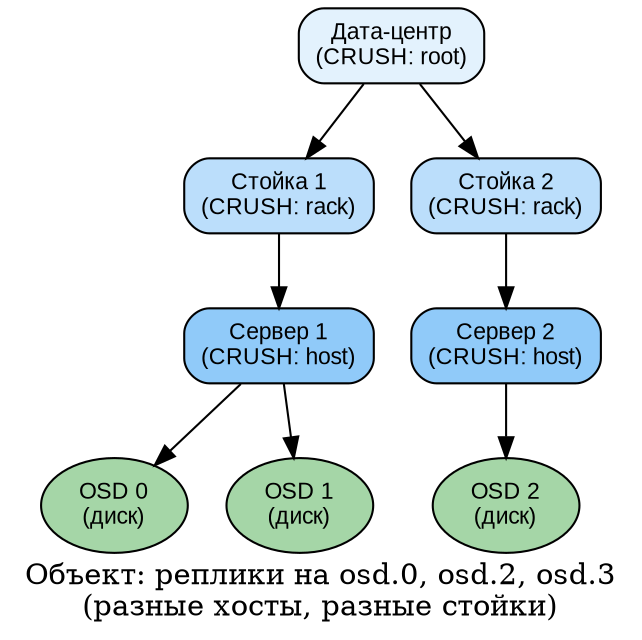
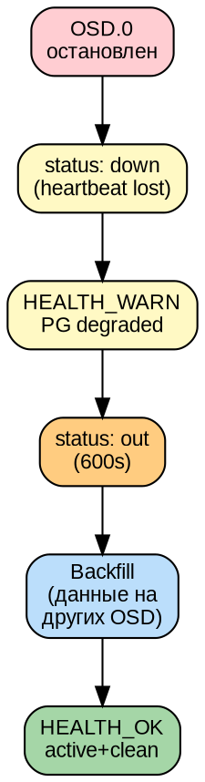
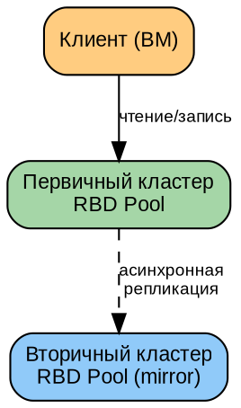
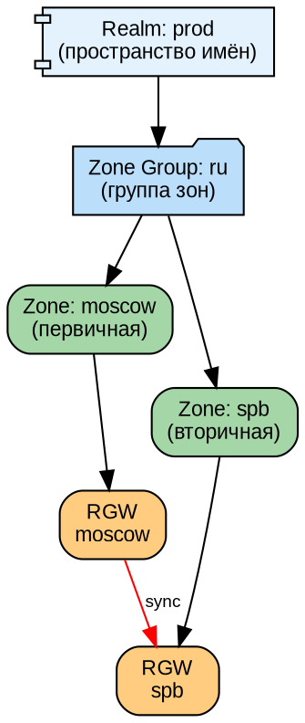
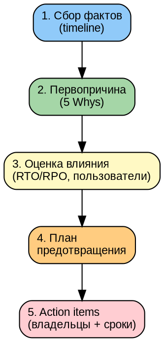

# Часть VI. Аварийные сценарии и восстановление *(90 стр., 12 кейсов)*

> **Цель:** освоить полный цикл аварийного реагирования — от классификации отказов через моделирование до post-mortem анализа.
> **После этой части вы сможете:** отработать любой аварийный сценарий, спланировать Disaster Recovery, написать post-mortem.

---

## Глава 18. Типология отказов *(12 стр.)*

### 18.1. Домен отказа *(3 стр.)*

**Домен отказа (failure domain)** — это уровень инфраструктуры, отказ которого затрагивает некоторое подмножество ресурсов. Ceph через CRUSH гарантирует, что реплики одного объекта находятся в **разных** доменах отказа на заданном уровне.



**Уровни доменов и их отказы:**

| Домен | Пример CRUSH | Что отказывает | Влияние |
|-------|-------------|---------------|---------|
| Диск (OSD) | `osd` | HDD/SSD/NVMe | 1 OSD down, PG degraded, автоматический backfill |
| Сервер (host) | `host` | Питание, сеть, ОС | Все OSD на сервере down, массовый recovery |
| Стойка (rack) | `rack` | Коммутатор стойки | Все серверы в стойке недоступны |
| Дата-центр (root) | `root` | Питание DC, канал между DC | Половина кластера недоступна |

**Принцип CRUSH:** если вы выбрали `type host`, CRUSH гарантирует, что реплики объекта попадут на разные **хосты**. Если один хост выйдет из строя — данные останутся доступны на другом хосте.

---

### 18.2. Модели отказов *(3 стр.)*

**Fail-stop (отказ-остановка):**
Компонент явно прекращает работу: процесс упал, диск отключился, сервер выключился. Самый простой для обнаружения случай. Ceph детектирует через heartbeats и `mon_osd_down_out_interval`.

**Fail-slow (отказ-замедление):**
Компонент работает, но медленно: диск с повышенной latency («умирающий» HDD с ошибками чтения), перегруженный процессор, битые сектора. **Самый опасный:** кластер не помечает OSD как `down`, но каждый запрос к нему тормозит. Диагностируется через `ceph osd perf` и `iostat`.

**Byzantine (византийский отказ):**
Компонент ведёт себя некорректно: возвращает неверные данные, искажает ответы. Может быть вызван bit flip (спонтанное изменение бита в памяти из-за космической радиации — редкое, но реальное явление), ошибкой прошивки или злонамеренным вмешательством. Ceph защищается через scrubbing (deep-scrub находит расхождения между репликами) и контрольные суммы.

**Partition (сетевое разделение):**
Сеть между узлами разорвана: две половинки кластера не видят друг друга. Каждая думает, что другая пропала. Возможен **split-brain** — ситуация «два мозга», когда обе половинки пытаются управлять кластером независимо. MON через Paxos предотвращают split-brain: только сторона с большинством голосов принимает решения.

---

### 18.3. RTO и RPO *(3 стр.)*

**RTO (Recovery Time Objective — «целевое время восстановления»):**
Сколько времени допустимо на восстановление сервиса после аварии. Измеряется от момента отказа до момента, когда сервис снова доступен.

- RTO = 5 минут: критичный сервис, требует автоматического failover
- RTO = 4 часа: можно восстановить вручную в рабочее время
- RTO = 24 часа: некритичный сервис

**RPO (Recovery Point Objective — «целевая точка восстановления»):**
Сколько данных допустимо потерять при аварии. Измеряется во времени: «можно потерять данные за последние N минут/часов».

- RPO = 0: ни байта потерь — синхронная репликация
- RPO = 1 час: допустимо потерять последний час изменений
- RPO = 24 часа: достаточно ежедневного бэкапа

**Ceph и RTO/RPO:**

| Конфигурация | RPO | RTO (типичный) |
|-------------|-----|---------------|
| Репликация ×3, size=3, min_size=2 | 0 (при отказе 1 OSD) | ~10–30 минут (backfill) |
| RBD Mirror (асинхронный) | 1–15 минут (лаг репликации) | ~5 минут (failover) |
| CephFS снапшоты (ежечасные) | 1 час | ~15 минут (восстановление) |
| RGW Multi-site | 1–5 минут | ~5 минут (переключение DNS) |

---

### 18.4. Стратегии *(3 стр.)*

- **Repair (ремонт):** починить сломанный компонент на месте — заменить диск, перезапустить процесс. Минимальное время, данные не переносятся.
- **Rebuild (перестройка):** создать компонент заново — пересоздать OSD на новом диске. Данные перераспределяются (backfill) с реплик.
- **Failover (переключение):** переключиться на резервный компонент — standby MDS занимает место active; RBD Mirror переключает клиентов на вторичный кластер.
- **Disaster Recovery (аварийное восстановление):** полное восстановление кластера из бэкапов — когда потерян весь первичный дата-центр.

---

## Глава 19. Моделирование отказов: 12 кейсов *(42 стр.)*

### 19.1. Кейс 1: отказ одного OSD *(3 стр.)*

**Модель:**
```bash
systemctl stop ceph-<fsid>@osd.0
```

**Хронометраж (типичные значения):**
```
t+0s:    osd.0 down (процесс остановлен)
t+10s:   MON замечает (heartbeat timeout)
t+300s:  HEALTH_WARN (PG degraded)
t+600s:  osd.0 out (mon_osd_down_out_interval)
t+600s:  backfill начинается (данные копируются на другие OSD)
t+900s:  HEALTH_OK (backfill завершён)
```

**DOT-схема цепочки событий:**


**Восстановление:**
```bash
systemctl start ceph-<fsid>@osd.0
# OSD up → PG backfill с данными, которые были записаны в его отсутствие → active+clean
```

---

### 19.2. Кейс 2: отказ узла с 4 OSD *(3 стр.)*

**Модель:**
```bash
ssh ceph-osd1 'shutdown -h now'
```

**Симптомы:**
```
HEALTH_WARN: 4 osds down
100+ PG degraded
Массовый backfill: recovery I/O насыщает сеть
```

**Влияние на клиентов:**
- Клиентский I/O degraded: конкуренция с recovery
- Latency растёт в 2–5 раз

**Тюнинг recovery:**
```bash
ceph config set osd osd_max_backfills 1
ceph config set osd osd_recovery_sleep 0.5
```

**Восстановление:**
- Включить сервер → OSD поднимутся → backfill догонит пропущенные изменения

---

### 19.3. Кейс 3: потеря MON (1 из 3) *(3 стр.)*

**Модель:**
```bash
systemctl stop ceph-mon@mon2
```

**Симптомы:**
```
HEALTH_WARN: 1 mons down, quorum mon1,mon3
```
- Кворум 2/3 — кластер работает
- Данные не затронуты (MON хранит метаданные, не данные)

**Восстановление:**
```bash
systemctl start ceph-mon@mon2
# MON синхронизируется с лидером (mon1) и присоединяется к кворуму
# HEALTH_OK
```

---

### 19.4. Кейс 4: потеря MON (2 из 3) *(4 стр.)*

**Модель:**
```bash
systemctl stop ceph-mon@mon2
systemctl stop ceph-mon@mon3
```

**Симптомы:**
```
ceph status: Error connecting to cluster
                No such file or directory
```
- **Кластер полностью недоступен!** MON1 один — кворума нет (1 < большинства из 3).
- Клиенты не могут получить карту кластера → не знают, к каким OSD обращаться
- Данные **физически целы на OSD**, но кластер «парализован» без управления

**Ручное восстановление (подробный разбор):**

```bash
# Шаг 1: Извлечь monmap из единственного живого MON
ceph-mon -i mon1 --extract-monmap /tmp/monmap.bin

# Шаг 2: Посмотреть, что внутри
monmaptool --print /tmp/monmap.bin
# epoch 3
# fsid 51fa3f5c-...
# mon1: 10.0.1.10:6789
# mon2: 10.0.1.11:6789
# mon3: 10.0.1.12:6789

# Шаг 3: Удалить упавшие MON из monmap
monmaptool /tmp/monmap.bin --rm mon2 --rm mon3

# Шаг 4: Внедрить урезанный monmap в MON1
ceph-mon -i mon1 --inject-monmap /tmp/monmap.bin

# Шаг 5: MON1 теперь образует кворум сам с собой (1/1)
systemctl start ceph-mon@mon1

# Шаг 6: Кластер снова доступен!
ceph status
# HEALTH_WARN: insufficient mons (1/3)

# Шаг 7: Развернуть MON заново
ceph orch apply mon --placement="mon1,mon2,mon3"
# или добавить новые узлы
ceph orch host add new-mon-node 10.0.1.20 --labels mon
```

**Почему это работает:** MON — это просто сервис, хранящий карты кластера. Если данные на OSD целы, восстановление MON из одного выжившего полностью восстанавливает управление кластером.

---

### 19.5. Кейс 5: split-brain сети *(3 стр.)*

**Модель:**
```bash
# На mon1: блокируем mon2 и mon3
iptables -A INPUT -s 10.0.1.11 -j DROP
iptables -A INPUT -s 10.0.1.12 -j DROP
iptables -A OUTPUT -d 10.0.1.11 -j DROP
iptables -A OUTPUT -d 10.0.1.12 -j DROP
```

**Что происходит:**
- **mon1:** думает, что он один — пытается стать лидером, но не может сформировать кворум (1/3 — не большинство)
- **mon2 + mon3:** видят друг друга (2/3) — формируют кворум без mon1
- **Кластер работает:** mon2+mon3 — большинство

**Разрешение:**
```bash
iptables -F  # снять блокировку
# mon1 присоединяется к кворуму 3/3
```

**Защита от split-brain в multi-DC:**
```
DC1: MON1, MON2, MON3 (3 голоса — большинство)
DC2: MON4, MON5           (2 голоса — меньшинство)
```
Если сеть между DC рвётся, DC1 продолжает работу (кворум 3/5). DC2 не может сформировать кворум (2/5) и останавливается — предотвращая split-brain.

---

### 19.6. Кейс 6: отказ стойки *(3 стр.)*

**Модель:**
```bash
# Отключение коммутатора стойки (физически или iptables на всех её серверах)
```

**Симптомы:**
```
Все OSD в стойке → down
Если CRUSH rule с type=rack: PG degraded, но данные доступны с других стоек
```

**Проверка CRUSH-изоляции:**
```bash
ceph osd crush rule dump replicated_rule
# "steps": [{"op": "chooseleaf", "num": 3, "type": "host"}]
# Тип "host" — реплики на разных хостах, но не обязательно в разных стойках!
```

**Улучшение rule для изоляции по стойкам:**
```bash
ceph osd crush rule create-replicated rack_aware default rack
ceph osd pool set <pool> crush_rule rack_aware
# Теперь 3 реплики гарантированно в 3 разных стойках
```

---

### 19.7. Кейс 7: случайное удаление пула *(3 стр.)*

**Модель:**
```bash
ceph osd pool rm important_data important_data --yes-i-really-really-mean-it
# Осторожно! Эта команда НЕОБРАТИМО удаляет пул и все данные в нём!
```

**Защита (должна быть включена ДО аварии):**
```bash
# Требовать подтверждение имени пула дважды + моникер
ceph config set mon mon_allow_pool_delete false

# Или через снапшоты
ceph osd pool mksnap important_data before_delete
```

**Восстановление (если были снапшоты):**
```bash
# Снапшот пула — это полная копия всех объектов на момент создания
# Но восстановить удалённый пул из снапшота — сложная процедура
# Лучшая защита: RBD Mirror или RGW Multi-site на другой кластер
```

---

### 19.8. Кейс 8: повреждение метаданных PG *(4 стр.)*

**Модель:**
```bash
# Найти объект на диске и перезаписать его «мусором»
dd if=/dev/urandom of=/var/lib/ceph/osd/ceph-0/current/1.7f_head/... bs=4K count=1
```

**Симптомы:**
```
HEALTH_ERR: PG_INCONSISTENT pg 1.7f
```

**Диагностика:**
```bash
ceph pg 1.7f query | jq '{state, acting, peers, stats}'
# Найти, какая реплика повреждена
```

**Автоматическое восстановление:**
```bash
ceph pg repair 1.7f
# Ceph сравнивает реплики и перезаписывает «плохую» копию «хорошей»
```

**Ручное восстановление (если repair не помог):**
```bash
# 1. Экспортировать PG с «хорошего» OSD
ceph-objectstore-tool --op export --pgid 1.7f \
    --data-path /var/lib/ceph/osd/ceph-3 --file /tmp/pg1.7f-good.bin

# 2. Импортировать на проблемный OSD (после удаления повреждённой PG)
ceph-objectstore-tool --op remove --pgid 1.7f \
    --data-path /var/lib/ceph/osd/ceph-0
ceph-objectstore-tool --op import --pgid 1.7f \
    --data-path /var/lib/ceph/osd/ceph-0 --file /tmp/pg1.7f-good.bin
```

---

### 19.9. Кейс 9: повреждение monmap *(3 стр.)*

**Модель:**
```bash
rm -rf /var/lib/ceph/mon/ceph-mon1/store.db/
```

**Симптомы:**
```
ceph-mon не запускается
journalctl -u ceph-mon@mon1: "unable to read magic"
```

**Восстановление из другого MON:**
```bash
# На mon2 (здоровом):
ceph-mon -i mon2 --extract-monmap /tmp/monmap.bin

# Скопировать на mon1:
scp /tmp/monmap.bin mon1:/tmp/

# На mon1:
ceph-mon -i mon1 --mkfs --monmap /tmp/monmap.bin --keyring /var/lib/ceph/mon/ceph-mon1/keyring
systemctl start ceph-mon@mon1
```

---

### 19.10. Кейс 10: min_size нарушен *(4 стр.)*

**Модель:**
```bash
# Пул: size=3, min_size=2 (запись требует кворума из 2 реплик)
# Остановить 2 OSD, у которых общие PG

systemctl stop ceph-<fsid>@osd.0
systemctl stop ceph-<fsid>@osd.1
# Оба OSD использовались в одних и тех же PG
```

**Симптомы:**
```
PG: active+undersized+degraded
Клиенты: блокировка записи (min_size=2, а доступна 1 реплика)
```

**Что происходит:**
- Ceph пожертвовал доступностью (нет A) ради согласованности (есть C) — см. CAP-теорему (§1.4)
- Данные **не потеряны** — они лежат на оставшейся реплике
- Запись **заблокирована** — Ceph не может гарантировать 2 реплики

**Стратегии:**
```bash
# 1. Восстановить OSD
systemctl start ceph-<fsid>@osd.0 osd.1

# 2. Временно снизить min_size (РИСК ПОТЕРИ ДАННЫХ!)
ceph osd pool set <pool> min_size 1
# Теперь запись работает с 1 репликой
# НО: если упадёт и третья — данные потеряны!
# Использовать ТОЛЬКО когда OSD восстанавливаются, и на короткое время

# 3. noout (предотвратить массовый out)
ceph osd set noout
# OSD не будут автоматически выводиться в out при временном down
# Даёт время на восстановление без запуска backfill
```

---

### 19.11. Кейс 11: восстановление из снапшотов *(4 стр.)*

**RBD:**
```bash
# Создать снапшот
rbd snap create rbd_pool/vm-disk@daily-20260707

# ... работа продолжается, данные меняются ...

# Случайное удаление важного файла в ВМ
# Восстановление:
rbd snap rollback rbd_pool/vm-disk@daily-20260707
# Образ ВМ ВОЗВРАЩЁН НА МОМЕНТ СНАПШОТА!
```

**CephFS:**
```bash
# Снапшоты CephFS доступны через скрытый каталог .snap
ls /mnt/cephfs/.snap/
# daily-20260707_000000
# hourly-20260707_140000

# Восстановить случайно удалённый файл:
cp /mnt/cephfs/.snap/hourly-20260707_140000/project/report.docx /mnt/cephfs/project/
```

**Автоматические снапшоты (snap_schedule модуль MGR):**
```bash
ceph fs snap-schedule add / 1h  # каждый час
ceph fs snap-schedule add / 1d  # каждый день
ceph fs snap-schedule retention add / h 24  # хранить 24 часовых
ceph fs snap-schedule retention add / d 7   # хранить 7 дневных
```

---

### 19.12. Кейс 12: полный DR *(4 стр.)*

**Сценарий:** потерян весь кластер (сгорел дата-центр). Остался только бэкап.

**Что должно быть забэкаплено (см. Главу 20):**
1. monmap, osdmap, crushmap
2. Ключи (`ceph auth export`)
3. RBD-образы (через RBD Mirror или экспорт)
4. CephFS-снапшоты
5. Конфигурационные файлы

**DR-процедура (общий план):**
```bash
# 1. Развернуть новый кластер
cephadm bootstrap --mon-ip <ip>

# 2. Восстановить конфигурацию
ceph auth import < auth-export.bak
crushtool -c crushmap.txt -o crushmap.bin
ceph osd setcrushmap -i crushmap.bin

# 3. Восстановить данные с бэкапов
# RBD: импортировать образы
# CephFS: скопировать из снапшотов
# RGW: переключить multi-site

# 4. Переключить клиентов
# DNS, IP, конфиги клиентов → новый кластер
```

---

### 19.13. Практикум *(1 стр.)*

**Мини-DR:**
Потеряны 2 MON из 3. Восстановите кворум из одного оставшегося MON, затем разверните MON заново.

План (DOT-схема):
1. Извлечь monmap → урезать → внедрить
2. Запустить MON1 (кворум 1/1)
3. Добавить MON2, MON3
4. HEALTH_OK

---

## Глава 20. Бэкап и Disaster Recovery *(20 стр.)*

### 20.1. Что бэкапить *(3 стр.)*

**Скрипт ежедневного бэкапа:**
```bash
#!/bin/bash
BACKUP_DIR=/backup/ceph/$(date +%Y%m%d)
mkdir -p $BACKUP_DIR

# 1. Карты кластера
ceph mon getmap -o $BACKUP_DIR/monmap.bin
ceph osd getmap -o $BACKUP_DIR/osdmap.bin
ceph osd getcrushmap -o $BACKUP_DIR/crushmap.bin

# 2. Ключи
ceph auth export > $BACKUP_DIR/auth-export.txt

# 3. Конфигурация
cp /etc/ceph/ceph.conf $BACKUP_DIR/

# 4. Список пулов и их параметров
ceph osd pool ls > $BACKUP_DIR/pools.txt
for p in $(ceph osd pool ls); do
    ceph osd pool get $p all >> $BACKUP_DIR/pool-$p.txt
done

echo "Backup saved to $BACKUP_DIR"
```

---

### 20.2. RBD Mirror *(5 стр.)*

**Архитектура:**


**Настройка:**
```bash
# На обоих кластерах:
rbd mirror pool enable rbd_pool image

# На первичном:
rbd mirror image enable rbd_pool/vm-disk snapshot

# На обоих — peering:
rbd mirror pool peer bootstrap create --site-name site-a ...
rbd mirror pool peer bootstrap import ...

# Мониторинг:
rbd mirror pool status rbd_pool
rbd mirror image status rbd_pool/vm-disk
```

**Failover (переключение на вторичный кластер):**
```bash
# На первичном: demote
rbd mirror image demote rbd_pool/vm-disk

# На вторичном: promote
rbd mirror image promote rbd_pool/vm-disk
# Теперь клиенты подключаются к вторичному!
```

---

### 20.3. CephFS Snapshots *(3 стр.)*

```bash
# Политика снапшотов
ceph fs snap-schedule add / 1h  # каждый час
ceph fs snap-schedule add / 1d  # каждый день в полночь
ceph fs snap-schedule add / 7d  # каждую неделю

# Хранение
ceph fs snap-schedule retention add / h 24
ceph fs snap-schedule retention add / d 7
ceph fs snap-schedule retention add / w 4

# Просмотр
ceph fs snap-schedule list /
```

---

### 20.4. RGW Multi-site *(5 стр.)*



**Настройка multi-site:**
```bash
# Создать realm, zonegroup, zones
radosgw-admin realm create --rgw-realm=prod --default
radosgw-admin zonegroup create --rgw-zonegroup=ru --master --default
radosgw-admin zone create --rgw-zonegroup=ru --rgw-zone=moscow --master
radosgw-admin zone create --rgw-zonegroup=ru --rgw-zone=spb

# Синхронизация
radosgw-admin sync start
radosgw-admin sync status
```

---

### 20.5. Практикум: RBD Mirror *(4 стр.)*

1. Развернуть два Ceph-кластера (основной и резервный)
2. Настроить RBD Mirror
3. Создать образ, записать данные, проверить репликацию
4. Выполнить failover: demote → promote → переключить клиента
5. Записать данные на новый primary → убедиться, что старый primary теперь «догоняет»

---

## Глава 21. Протоколирование и post-mortem *(16 стр.)*

### 21.1. Журнал аварии: чек-лист *(3 стр.)*

При любой аварии заполняйте журнал. Это поможет при post-mortem анализе и предотвращении повторения.

**Чек-лист (20 пунктов):**

| # | Пункт | Пример |
|---|-------|--------|
| 1 | Дата и время обнаружения | 2026-07-07 14:23 MSK |
| 2 | Кто обнаружил | Система мониторинга (Prometheus alert) |
| 3 | Симптомы | `HEALTH_ERR: PG_INCONSISTENT` |
| 4 | Затронутые компоненты | pg 1.7f, OSD 3, 7, 12 |
| 5 | Затронутые пользователи | CephFS клиенты на prod-web-* |
| 6 | Первое действие | `ceph health detail` |
| 7 | Диагностические команды | `ceph pg 1.7f query`, `iostat -x` |
| 8 | Гипотеза о причине | Bit rot на OSD.3 |
| 9 | Проверка гипотезы | `smartctl -a /dev/sdc` — 14 read errors |
| 10 | Первопричина подтверждена? | Да: отказавший диск |
| 11 | Действия по устранению | `ceph osd out 3` → замена диска |
| 12 | Время устранения | 2026-07-07 15:45 MSK |
| 13 | Общее время недоступности | 0 (данные доступны с других реплик) |
| 14 | Объём потерянных данных | 0 |
| 15 | RTO факт | 1h 22m |
| 16 | RPO факт | 0 |
| 17 | Что сработало хорошо | Prometheus alert за 2 мин |
| 18 | Что можно улучшить | SMART-мониторинг не показал предупреждение |
| 19 | План предотвращения | Настроить smartmontools + Prometheus |
| 20 | Action items | @admin: smartmontools на все OSD-узлы (срок: 14.07) |

---

### 21.2. Восстановление хронологии *(3 стр.)*

```bash
# Кластерный журнал
ceph log last 500 | grep "2026-07-07"

# Системные логи (journald)
journalctl --since "2026-07-07 14:00" --until "2026-07-07 16:00" \
    -u ceph-* | grep -E "error|fail|down|inconsistent"

# Аудит команд (кто что делал)
ceph log last 1000 | grep "from='client.admin"

# SMART-логи дисков
smartctl -a /dev/sdb | grep -E "Error|Reallocated|Pending"
```

---

### 21.3. Post-mortem анализ *(4 стр.)*

**Процесс (5 шагов):**



**Метод «5 Why» (5 «почему»):**

Проблема: PG INCONSISTENT.
1. Почему? — Данные на репликах не совпадают.
2. Почему? — Одна из реплик прочитала неверные данные.
3. Почему? — Диск вернул битые данные при чтении.
4. Почему? — Накопились неисправимые ошибки чтения (read errors).
5. Почему? — Диск физически деградировал (механический износ).

Первопричина: механический отказ HDD. Решение: SMART-мониторинг для раннего обнаружения.

---

### 21.4. Шаблон post-mortem *(3 стр.)*

```markdown
# Post-Mortem: [Краткое описание]

**Дата:** 2026-07-07
**Автор:** Иванов И.И.
**Severity:** ERR / WARN

## Summary
Что произошло, одной фразой.

## Timeline (MSK)
| Время | Событие |
|-------|---------|
| 14:23 | Prometheus alert: CephHealthError |
| 14:25 | Дежурный инженер подключается |
| 14:28 | Диагноз: PG 1.7f inconsistent, OSD 3 |
| 14:35 | Принято решение: ceph osd out 3 |
| 14:45 | Замена диска начата |
| 15:30 | Новый OSD развёрнут |
| 15:45 | Backfill завершён, HEALTH_OK |

## Root Cause
[Первопричина — из 5 Whys]

## Impact
- Затронутые сервисы: CephFS prod-web
- Простой: 0 (данные доступны с других реплик)
- Потеря данных: 0
- RTO: 1h 22m
- RPO: 0

## What Went Well
- Prometheus alert сработал через 2 минуты

## What Went Wrong
- SMART-мониторинг не предупредил о деградации диска

## Prevention Plan
1. Настроить smartmontools на всех OSD-узлах
2. Добавить Prometheus alert на SMART-ошибки

## Action Items
| # | Действие | Владелец | Срок |
|---|----------|----------|------|
| 1 | smartmontools на всех OSD-узлах | @admin | 14.07.2026 |
| 2 | Prometheus SMART alert | @monitoring | 14.07.2026 |
```

---

### 21.5. Практикум: post-mortem *(3 стр.)*

Напишите post-mortem по кейсу 19.4 (потеря MON majority) по шаблону из §21.4. Включите:
- Timeline (с момента отказа до восстановления)
- Root cause (почему упали 2 MON?)
- Impact (сколько времени кластер был недоступен?)
- Action items (как предотвратить в будущем?)

---

| Навигация | |
|-----------|---|
| ← Часть V | [part-V.md](part-V.md) |
| ↑ Оглавление | [TOC.md](TOC.md) |
| → Часть VII | [part-VII.md](part-VII.md) |
