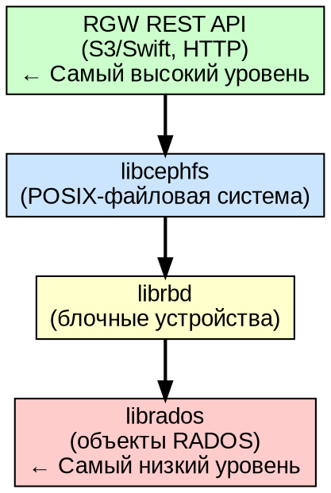
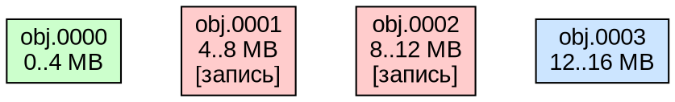
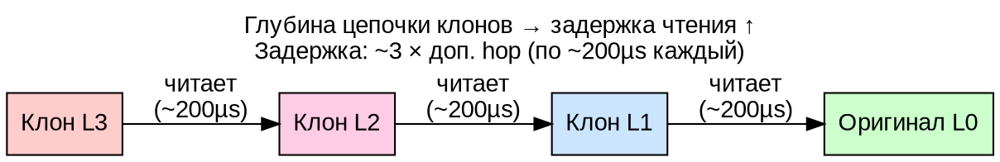
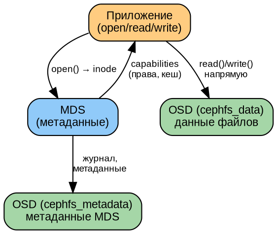

# Часть VII. Разработка и интеграция *(55 стр.)*

> **Цель:** освоить программный доступ к Ceph через все интерфейсы — librados (Python), RBD, CephFS, RGW (S3 API).
> **После этой части вы сможете:** написать приложение на Python, управлять RBD-образами, монтировать CephFS, работать с RGW через boto3.

---

## Глава 22. Программный доступ: librados и Python *(18 стр.)*

### 22.1. Уровни доступа *(2 стр.)*

Ceph предоставляет четыре уровня программного доступа — от самого низкоуровневого до самого высокоуровневого:



- **librados (C/C++)** — прямой доступ к объектам RADOS. Вы управляете объектами напрямую: создаёте, читаете, удаляете, работаете с xattrs и OMAPA. Все вышележащие уровни (RBD, CephFS, RGW) реализованы поверх librados.
- **librbd** — блочные устройства поверх librados. Stripe'ит данные в объекты RADOS автоматически.
- **libcephfs** — файловая система поверх librados. Управляет inode, каталогами, метаданными.
- **RGW REST API** — HTTP-доступ, совместимый с Amazon S3. Не требует librados на клиенте — чистый HTTP.

---

### 22.2. Python-клиент: подключение и аутентификация *(3 стр.)*

```python
import rados

# 1. Подключение к кластеру
cluster = rados.Rados(conffile='/etc/ceph/ceph.conf')
cluster.connect()

# Если конфиг не в стандартном месте — можно указать явно:
# cluster = rados.Rados(
#     conffile='/etc/ceph/ceph.conf',
#     conf=dict(keyring='/etc/ceph/ceph.client.admin.keyring')
# )

# 2. Получить статистику кластера
stats = cluster.get_cluster_stats()
print(f"Cluster: {stats['kb']} KB used, {stats['kb_avail']} KB avail")

# 3. Список пулов
pools = cluster.list_pools()
print(f"Pools: {pools}")

# 4. Открыть пул (контекстный менеджер)
with cluster.open_ioctx('test_pool') as ioctx:
    # Работа с объектами (см. далее)
    pass

cluster.shutdown()
```

**Обработка ошибок:**

```python
import rados

cluster = rados.Rados(conffile='/etc/ceph/ceph.conf')
try:
    cluster.connect()
    with cluster.open_ioctx('test_pool') as ioctx:
        # работа с объектами
        pass
except rados.ObjectNotFound:
    print("Объект не найден")
except rados.PermissionError:
    print("Нет прав на операцию — проверьте keyring/caps")
except rados.Error as e:
    print(f"Ошибка RADOS: {e}")
finally:
    cluster.shutdown()
```

#### 22.2.1. Расширенная обработка ошибок *(2 стр.)*

librados предоставляет иерархию исключений. Правильная обработка критична для production-приложений:

```python
import rados
import errno
import time
import logging

logger = logging.getLogger(__name__)

def connect_with_retry(conffile='/etc/ceph/ceph.conf', max_retries=5,
                        base_delay=1.0, max_delay=30.0):
    """Подключение к кластеру с exponential backoff."""
    cluster = rados.Rados(conffile=conffile)
    last_exc = None

    for attempt in range(max_retries):
        try:
            cluster.connect()
            # Проверка готовности кластера
            cluster.get_fsid()
            logger.info("Connected to cluster (attempt %d)", attempt + 1)
            return cluster
        except rados.ObjectNotFound as e:
            # Не retryable — пула нет
            raise
        except rados.PermissionError as e:
            # Не retryable — нет прав
            raise
        except (rados.Error, rados.InterruptedOrTimeoutError) as e:
            last_exc = e
            delay = min(base_delay * (2 ** attempt), max_delay)
            logger.warning("Connection attempt %d failed: %s. Retrying in %.1fs...",
                           attempt + 1, e, delay)
            time.sleep(delay)
            continue
        except Exception as e:
            # Неожиданная ошибка
            logger.exception("Unexpected error during connect")
            raise

    raise ConnectionError(f"Failed to connect after {max_retries} attempts") from last_exc


def safe_read(ioctx, oid, default=None):
    """Безопасное чтение объекта с обработкой всех возможных ошибок."""
    try:
        return ioctx.read(oid)
    except rados.ObjectNotFound:
        logger.warning("Object %s not found", oid)
        return default
    except rados.PermissionError:
        logger.error("Permission denied reading %s — check caps", oid)
        raise
    except rados.IOError as e:
        logger.error("I/O error reading %s: %s", oid, e)
        raise
    except rados.Error as e:
        logger.error("RADOS error reading %s: %s (errno=%d)", oid, e, e.errno)
        raise


def safe_write(ioctx, oid, data):
    """Безопасная запись с retry при transient errors."""
    for attempt in range(3):
        try:
            ioctx.write_full(oid, data)
            return
        except rados.ObjectBusy:
            logger.warning("Object %s busy, retrying...", oid)
            time.sleep(0.1 * (attempt + 1))
            continue
        except rados.Error as e:
            logger.error("Write failed for %s: %s", oid, e)
            raise
    raise rados.ObjectBusy(f"Object {oid} still busy after 3 retries")
```

#### 22.2.2. Продвинутые паттерны подключения *(1 стр.)*

**Connection Pool (пул соединений):** Для многопоточных приложений librados рекомендует одно подключение на поток:

```python
import threading
from contextlib import contextmanager

class RadosConnectionPool:
    """Thread-local connection pool для librados."""

    def __init__(self, conffile='/etc/ceph/ceph.conf', size=4):
        self.conffile = conffile
        self.size = size
        self._local = threading.local()

    def _create_connection(self):
        cluster = rados.Rados(conffile=self.conffile)
        cluster.connect()
        return cluster

    @contextmanager
    def get_ioctx(self, pool_name):
        """Получить IOContext для пула — автоматически открывает/закрывает."""
        if not hasattr(self._local, 'cluster'):
            self._local.cluster = self._create_connection()

        cluster = self._local.cluster
        ioctx = cluster.open_ioctx(pool_name)
        try:
            yield ioctx
        finally:
            ioctx.close()

    def shutdown(self):
        if hasattr(self._local, 'cluster'):
            self._local.cluster.shutdown()
            del self._local.cluster


# Использование:
pool = RadosConnectionPool(size=8)
with pool.get_ioctx('test_pool') as ioctx:
    data = ioctx.read('my-object')
pool.shutdown()
```

**Stat-кэш для мониторинга:** Получение детальной статистики кластера и пула:

```python
def get_pool_stats(cluster, pool_name):
    """Детальная статистика пула."""
    with cluster.open_ioctx(pool_name) as ioctx:
        stats = ioctx.get_stats()
        print(f"Pool: {pool_name}")
        print(f"  Objects: {stats.get('num_objects', 0)}")
        print(f"  Size:    {stats.get('num_bytes', 0) / 2**30:.2f} GiB")
        print(f"  Dirty:   {stats.get('num_objects_dirty', 0)}")
        print(f"  OMAP:    {stats.get('num_objects_omap', 0)}")
        print(f"  Clones:  {stats.get('num_object_clones', 0)}")

# Глобальная статистика кластера
def get_cluster_health(cluster):
    """Сводка состояния кластера через librados."""
    cmd = '{"prefix": "health", "format": "json"}'
    ret, buf, out = cluster.mon_command(cmd, b'', timeout=5)
    import json
    health = json.loads(buf.decode())
    return health
```

---

### 22.3. CRUD объектов *(5 стр.)*

```python
import rados

cluster = rados.Rados(conffile='/etc/ceph/ceph.conf')
cluster.connect()

with cluster.open_ioctx('test_pool') as ioctx:
    # === CREATE (запись) ===
    # Простая запись
    ioctx.write('my-object', b'Hello, Ceph!')

    # Запись с атомарным сравнением (compare-and-swap)
    # ioctx.write_full('my-object', b'New data')

    # === READ (чтение) ===
    data = ioctx.read('my-object')
    print(f"Read: {data.decode()}")  # Read: Hello, Ceph!

    # Чтение части объекта (offset=0, length=5)
    partial = ioctx.read('my-object', length=5)
    print(f"Partial: {partial.decode()}")  # Hello

    # Статистика объекта
    stat = ioctx.stat('my-object')
    print(f"Size: {stat[0]}, Mtime: {stat[1]}")

    # === XATTRS (расширенные атрибуты) ===
    ioctx.set_xattr('my-object', 'author', b'Ivanov')
    author = ioctx.get_xattr('my-object', 'author')
    print(f"Author: {author.decode()}")  # Ivanov

    # === OMAPA (object map — key-value хранилище внутри объекта) ===
    ioctx.set_omap('my-object', ('key1', 'val1'), ('key2', 'val2'))

    # Чтение OMAPA
    with rados.ReadOpCtx() as read_op:
        omap_iter, ret = ioctx.get_omap_vals(read_op, '', '', 10)
        cluster.operate_read_op(read_op, 'my-object')
        for key, val in omap_iter:
            print(f"OMAP {key}: {val}")

    # === DELETE (удаление) ===
    ioctx.remove_object('my-object')

cluster.shutdown()
```

**Асинхронный ввод-вывод (AIO):**

```python
import rados, time

cluster = rados.Rados(conffile='/etc/ceph/ceph.conf')
cluster.connect()

with cluster.open_ioctx('test_pool') as ioctx:
    # Асинхронная запись
    comp = ioctx.aio_write('async-obj', b'Async data', 0)
    comp.wait_for_complete()  # блокируемся до завершения
    print(f"Write result: {comp.get_return_value()}")

    # Асинхронное чтение
    comp = ioctx.aio_read('async-obj', 10, 0)
    comp.wait_for_complete()
    print(f"Read: {comp.get_return_value()}")

    # Асинхронная запись с callback
    def callback(completion):
        print(f"Async write completed with: {completion.get_return_value()}")

    comp = ioctx.aio_write('callback-obj', b'Callback data', 0)
    comp.set_complete_callback(callback)
    # comp.wait_for_complete()  # или отпустить и делать другие дела

    time.sleep(1)  # в реальном приложении — event loop

cluster.shutdown()
```

---

### 22.4. Практикум: миграция объектов *(8 стр.)*

**Задача:** написать приложение, которое переносит все объекты из пула A в пул B.

```python
#!/usr/bin/env python3
"""
Миграция объектов между пулами Ceph.
Использование: python3 migrate.py <source_pool> <dest_pool> [--async]
"""
import rados
import argparse
import time
import sys

def migrate_sync(cluster, src_pool, dst_pool):
    """Синхронная миграция — объект за объектом."""
    count = 0
    size_total = 0
    t_start = time.time()

    with cluster.open_ioctx(src_pool) as src_ctx, \
         cluster.open_ioctx(dst_pool) as dst_ctx:

        # Итератор по объектам (осторожно: может быть миллиард!)
        objects = src_ctx.list_objects()
        for obj in objects:
            try:
                # Читаем объект
                data = obj.read()

                # Копируем xattrs
                xattrs = obj.get_xattrs()

                # Записываем в целевой пул
                dst_ctx.write_full(obj.key, data)

                # Копируем xattrs
                for k, v in xattrs.items():
                    dst_ctx.set_xattr(obj.key, k, v)

                count += 1
                size_total += len(data)

                if count % 100 == 0:
                    print(f"  Migrated {count} objects...", end='\r')

            except rados.Error as e:
                print(f"  ERROR on {obj.key}: {e}", file=sys.stderr)
                continue

    elapsed = time.time() - t_start
    print(f"\nSync: {count} objects, {size_total} bytes in {elapsed:.1f}s")
    print(f"      {count/elapsed:.0f} obj/s, {size_total/elapsed/2**20:.1f} MiB/s")
    return count, elapsed

def migrate_async(cluster, src_pool, dst_pool, concurrency=16):
    """Асинхронная миграция — до concurrency одновременных операций."""
    import threading
    count = [0]
    size_total = [0]
    errors = []
    lock = threading.Lock()

    def worker(src_pool, dst_pool, obj_list):
        with cluster.open_ioctx(src_pool) as src_ctx, \
             cluster.open_ioctx(dst_pool) as dst_ctx:
            for obj_key in obj_list:
                try:
                    data = src_ctx.read(obj_key)
                    dst_ctx.write_full(obj_key, data)
                    with lock:
                        count[0] += 1
                        size_total[0] += len(data)
                except rados.Error as e:
                    errors.append(f"{obj_key}: {e}")

    # Получаем список всех объектов
    objects = []
    with cluster.open_ioctx(src_pool) as src_ctx:
        for obj in src_ctx.list_objects():
            objects.append(obj.key)

    # Разбиваем на батчи для worker-потоков
    batch_size = max(1, len(objects) // concurrency)
    batches = [objects[i:i+batch_size] for i in range(0, len(objects), batch_size)]

    t_start = time.time()
    threads = []
    for batch in batches:
        t = threading.Thread(target=worker, args=(src_pool, dst_pool, batch))
        t.start()
        threads.append(t)

    for t in threads:
        t.join()

    elapsed = time.time() - t_start
    print(f"\nAsync: {count[0]} objects, {size_total[0]} bytes in {elapsed:.1f}s")
    print(f"       {count[0]/elapsed:.0f} obj/s, {size_total[0]/elapsed/2**20:.1f} MiB/s")

    if errors:
        print(f"Errors: {len(errors)}")
    return count[0], elapsed

def main():
    parser = argparse.ArgumentParser(description='Ceph pool migration tool')
    parser.add_argument('src_pool', help='Source pool name')
    parser.add_argument('dst_pool', help='Destination pool name')
    parser.add_argument('--async', action='store_true', help='Use async migration')
    parser.add_argument('--concurrency', type=int, default=16,
                        help='Concurrency for async (default: 16)')
    args = parser.parse_args()

    cluster = rados.Rados(conffile='/etc/ceph/ceph.conf')
    cluster.connect()

    try:
        if getattr(args, 'async'):
            migrate_async(cluster, args.src_pool, args.dst_pool, args.concurrency)
        else:
            migrate_sync(cluster, args.src_pool, args.dst_pool)
    finally:
        cluster.shutdown()

if __name__ == '__main__':
    main()
```

**Задание:**
1. Создайте два пула: `source` и `dest`
2. Наполните `source` тестовыми объектами (1000 объектов по 1 МБ)
3. Запустите миграцию в синхронном режиме — замерьте скорость
4. Запустите в асинхронном (16 потоков) — сравните
5. Объясните разницу (почему async быстрее? какие ограничения?)

---

#### 22.4.1. Блокировки объектов (exclusive locks) *(2 стр.)*

librados поддерживает эксклюзивные блокировки — критично для распределённых приложений, где несколько клиентов могут конкурировать за объект:

```python
import rados, time, uuid

def atomic_update_with_lock(cluster, pool_name, oid, update_func):
    """Атомарное обновление объекта под эксклюзивной блокировкой."""
    locker_name = f"client:{uuid.uuid4().hex[:8]}"
    cookie = f"cookie:{uuid.uuid4().hex}"

    with cluster.open_ioctx(pool_name) as ioctx:
        # Попытка захватить блокировку (exclusive, таймаут 30с)
        try:
            ioctx.lock_exclusive(oid, locker_name, cookie,
                                 desc="Atomic update operation",
                                 duration=30)
        except rados.ObjectBusy:
            print(f"Object {oid} is locked by another client")
            return False
        except rados.ObjectNotFound:
            print(f"Object {oid} does not exist")
            return False

        try:
            # Читаем текущее состояние
            try:
                data = ioctx.read(oid)
            except rados.ObjectNotFound:
                data = b''

            # Применяем функцию обновления
            new_data = update_func(data)

            # Пишем обратно
            ioctx.write_full(oid, new_data)
            return True
        finally:
            # Всегда снимаем блокировку
            ioctx.unlock(oid, locker_name, cookie)


# Пример использования:
def increment_counter(data):
    current = int(data.decode()) if data else 0
    return str(current + 1).encode()

cluster = rados.Rados(conffile='/etc/ceph/ceph.conf')
cluster.connect()
atomic_update_with_lock(cluster, 'test_pool', 'counter', increment_counter)
cluster.shutdown()
```

**Watch/Notify — распределённые уведомления:**

```python
import rados, threading

class ObjectWatcher:
    """Наблюдение за изменениями объекта через RADOS watch/notify."""

    def __init__(self, cluster, pool_name):
        self.cluster = cluster
        self.pool_name = pool_name
        self._running = False
        self.ioctx = None

    def _watch_callback(self, notify_id, notifier_id, watch_id, data):
        """Callback: срабатывает при notify от другого клиента."""
        msg = data.decode() if data else '(empty)'
        print(f"[NOTIFY] id={notify_id} from={notifier_id} data={msg}")

    def _error_callback(self, watch_id, err):
        """Callback: ошибка watch (например, таймаут соединения)."""
        print(f"[WATCH ERROR] watch_id={watch_id} err={err}")

    def start_watching(self, oid):
        """Начать наблюдение за объектом."""
        self.ioctx = self.cluster.open_ioctx(self.pool_name)
        self.ioctx.set_watch_timeout(30)
        self.watch_id = self.ioctx.watch(
            oid,
            self._watch_callback,
            self._error_callback
        )
        self._running = True
        print(f"Watching {oid} (watch_id={self.watch_id})")

    def notify_others(self, oid, message):
        """Отправить уведомление всем наблюдателям объекта."""
        self.ioctx.notify(oid, self.watch_id, message.encode())

    def stop(self):
        if self.watch_id is not None and self.ioctx is not None:
            self.ioctx.unwatch(self.watch_id)
            self.ioctx.close()
            self._running = False


# Использование watch/notify для распределённого кэша:
# Клиент A: watcher.start_watching('config'); (ждёт)
# Клиент B: watcher.notify_others('config', 'reload'); (отправляет уведомление)
# Клиент A: получает callback и перечитывает конфигурацию
```

#### 22.4.2. Атомарные операции: WriteFull, Append, CAS *(1 стр.)*

librados предоставляет несколько гарантий атомарности:

```python
with cluster.open_ioctx('test_pool') as ioctx:
    # write_full — атомарная замена всего объекта. Гарантирует,
    # что читатель увидит либо старую, либо новую версию полностью.
    ioctx.write_full('config', b'{"version": 2}')

    # append — атомарное дописывание в конец (удобно для логов)
    ioctx.append('app-log', b'[INFO] User logged in\n')

    # CAS (compare-and-swap) через OMAPA — атомарное обновление
    # только если версия совпадает (см. также операции с xattrs для
    # похожей механики)
```

**XATTR-based CAS pattern:**

```python
import struct

def cas_update(ioctx, oid, expected_version, new_data):
    """CAS-обновление: пишем только если версия совпадает."""
    version_key = 'cas_version'

    try:
        current_version_bytes = ioctx.get_xattr(oid, version_key)
        current_version = struct.unpack('!Q', current_version_bytes)[0]
    except rados.ObjectNotFound:
        current_version = 0

    if current_version != expected_version:
        raise ValueError(f"Version mismatch: expected {expected_version}, "
                         f"got {current_version}")

    # Пишем данные и обновляем версию (неатомарно для xattr+data,
    # но достаточно для многих случаев; для строгой атомарности
    # используйте lock_exclusive + write_full)
    ioctx.write_full(oid, new_data)
    ioctx.set_xattr(oid, version_key, struct.pack('!Q', expected_version + 1))
```

#### 22.4.3. Namespace внутри пула *(0.5 стр.)*

librados поддерживает пространства имён (namespaces) внутри одного пула — логическая изоляция объектов без создания отдельных пулов:

```python
with cluster.open_ioctx('test_pool') as ioctx:
    # Установить namespace
    ioctx.set_namespace('tenant-a')

    # Все операции теперь в namespace 'tenant-a'
    ioctx.write('obj1', b'data for tenant A')

    # Переключить namespace
    ioctx.set_namespace('tenant-b')
    ioctx.write('obj1', b'data for tenant B')

    # Объекты 'obj1' в tenant-a и tenant-b — разные объекты!

    # Вернуться в default namespace
    ioctx.set_namespace(rados.LIBRADOS_ALL_NSPACE)
```

#### 22.4.4. Исполнение методов на OSD (exec) *(1 стр.)*

Ceph позволяет выполнять произвольный код прямо на OSD через механизм классов (аналог stored procedures):

```python
import json

def call_rbd_info(cluster, pool_name, oid):
    """Вызов метода rbd::info на объекте RBD (через librados exec)."""
    with cluster.open_ioctx(pool_name) as ioctx:
        # Вызов метода C++ класса на OSD
        # ret, buf = ioctx.executes(
        #     oid,
        #     'rbd',           # класс
        #     'info',          # метод
        #     b''              # входные данные
        # )
        pass  # Требует сборки с соответствующими классами

# Практическое применение: подсчёт объектов через exec (быстрее,
# чем перечисление на клиенте):
def count_objects_fast(cluster, pool_name):
    """Быстрый подсчёт объектов через вызов pg-ls на OSD."""
    cmd = json.dumps({
        'prefix': 'pg ls-by-pool',
        'poolstr': pool_name,
        'format': 'json'
    })
    ret, buf, out = cluster.mon_command(cmd.encode(), b'', timeout=10)
    result = json.loads(buf.decode())
    total = sum(pg.get('stat_sum', {}).get('num_objects', 0)
                for pg in result.get('pg_stats', []))
    print(f"Total objects in {pool_name}: {total}")
    return total
```

---

## Глава 23. Блочные устройства RBD *(14 стр.)*

### 23.1. RBD: striping, object map, layering *(3 стр.)*

**Как RBD устроен внутри:**

Образ RBD — это виртуальный диск. Когда вы записываете в него данные, RBD разбивает запись на **страйпы (stripes)**, каждый страйп — на объекты RADOS фиксированного размера.



**Параметры:**
- `order` — размер объекта в RADOS: `object_size = 2^order`. По умолчанию order=22 → 4 МБ.
- `stripe_unit` — размер блока внутри объекта (по умолчанию = object_size)
- `stripe_count` — количество объектов, по которым чередуются данные

**Object map:** битовая карта, отслеживающая, какие объекты реально выделены (содержат данные). Позволяет быстро выполнять `rbd resize`, `rbd export`, `rbd diff` без чтения каждого объекта.

**Layering (Copy-on-Write):** клон RBD не копирует данные физически — он ссылается на родительский снапшот. Только изменённые блоки записываются в клон. Это позволяет создавать десятки клонов без расхода места.

---

### 23.2. Снапшоты и клоны *(3 стр.)*

```bash
# Создать образ
rbd create -s 10G rbd_pool/vm-disk

# Записать данные (через клиент)
rbd map rbd_pool/vm-disk
mkfs.ext4 /dev/rbd0
mount /dev/rbd0 /mnt
echo "Important data" > /mnt/readme.txt
umount /mnt
rbd unmap /dev/rbd0

# Снапшот
rbd snap create rbd_pool/vm-disk@v1
rbd snap ls rbd_pool/vm-disk

# Защита снапшота (чтобы нельзя было удалить, пока есть клоны)
rbd snap protect rbd_pool/vm-disk@v1

# Клон
rbd clone rbd_pool/vm-disk@v1 rbd_pool/vm-clone
# Клон занимает 0 байт! Только изменённые блоки будут записаны.

# Flatten (отрыв от родителя — полная копия)
rbd flatten rbd_pool/vm-clone
# Теперь клон занимает полноценное место.

# Откат
rbd snap rollback rbd_pool/vm-disk@v1
# Образ возвращён на момент снапшота!
```

**Жизненный цикл:**
```
образ → запись данных → снапшот → protect → клон → запись в клон (CoW) → flatten → удаление родителя
```

#### 23.2.1. Production-сценарии: снапшоты и клонирование *(4 стр.)*

**Сценарий 1: Золотой образ для виртуальных машин**

Одна из ключевых production-практик: создание эталонного образа (golden image) и массовое клонирование виртуальных машин с CoW-экономией:

```bash
#!/bin/bash
# Создание золотого образа и массовое клонирование ВМ

POOL=rbd_pool
GOLDEN=golden-ubuntu2204
SNAP=base-install

# 1. Создать и подготовить золотой образ
rbd create -s 20G $POOL/$GOLDEN --image-feature layering,exclusive-lock
rbd map $POOL/$GOLDEN
mkfs.ext4 /dev/rbd/${POOL}/${GOLDEN}
mount /dev/rbd/${POOL}/${GOLDEN} /mnt
# Установка ОС, настройки, обновления...
# debootstrap /mnt или копирование эталонной ФС
umount /mnt
rbd unmap /dev/rbd/${POOL}/${GOLDEN}

# 2. Защитить снапшот
rbd snap create $POOL/$GOLDEN@$SNAP
rbd snap protect $POOL/$GOLDEN@$SNAP

# 3. Массовое клонирование (100 ВМ — почти 0 доп. места!)
for i in $(seq 1 100); do
    rbd clone $POOL/$GOLDEN@$SNAP $POOL/vm-${i} \
        --image-feature layering,exclusive-lock
done

# Проверка: все клоны ссылаются на родителя
rbd children $POOL/$GOLDEN@$SNAP
# Вывод: список из 100 клонов

# 4. Каждый клон занимает только изменённые блоки
rbd du $POOL/vm-1    # ~0 MB (новый клон)
rbd du $POOL/vm-50   # ~0 MB
# После работы ВМ:
rbd du $POOL/vm-1    # ~150 MB (только изменённые блоки)
```

**Сценарий 2: Иерархическое клонирование (clone-of-clone)**

RBD поддерживает цепочки клонов произвольной глубины:

```bash
# Уровень 0: золотой образ
rbd snap create $POOL/golden@base
rbd snap protect $POOL/golden@base

# Уровень 1: клон с патчами безопасности
rbd clone $POOL/golden@base $POOL/golden-patched
# Установка патчей в golden-patched
rbd snap create $POOL/golden-patched@patched
rbd snap protect $POOL/golden-patched@patched

# Уровень 2: клон с приложением
rbd clone $POOL/golden-patched@patched $POOL/vm-app01

# Просмотр цепочки:
rbd info $POOL/vm-app01
# parent: rbd_pool/golden-patched@patched
# Если у родителя есть родитель — видна вся цепочка
```

**Сценарий 3: Плановое резервное копирование со снапшотами**

```bash
#!/bin/bash
# Ежедневное резервное копирование RBD-образа со снапшотами

IMAGE=rbd_pool/production-db
RETENTION_DAYS=7

# Создать снапшот с меткой времени
SNAP_NAME="daily-$(date +%Y%m%d-%H%M)"
rbd snap create $IMAGE@$SNAP_NAME

# Экспорт снапшота в файл (для внешнего хранения)
rbd export $IMAGE@$SNAP_NAME /backup/rbd/${IMAGE##*/}-${SNAP_NAME}.img

# Ротация: удалить снапшоты старше N дней
CUTOFF=$(date -d "$RETENTION_DAYS days ago" +%s)
while IFS= read -r snap; do
    snap_name=$(echo "$snap" | awk '{print $2}')
    snap_ts=$(date -d "${snap_name#daily-}" +%s 2>/dev/null || echo 0)
    if [ "$snap_ts" -lt "$CUTOFF" ] && [ "$snap_ts" -ne 0 ]; then
        echo "Removing old snapshot: $snap_name"
        rbd snap unprotect $IMAGE@$snap_name 2>/dev/null || true
        rbd snap rm $IMAGE@$snap_name
    fi
done < <(rbd snap ls $IMAGE)
```

**Сценарий 4: Живая миграция через дифференциальный экспорт**

```bash
# Дифференциальное копирование: экспорт только изменившихся блоков
# между двумя снапшотами

# Снапшот на исходном кластере
rbd snap create $POOL/source-image@migrate-snap
rbd snap protect $POOL/source-image@migrate-snap

# Начальный полный экспорт (пока образ используется)
rbd export $POOL/source-image@migrate-snap /tmp/full-export.img

# Через некоторое время — инкрементальный diff
rbd snap create $POOL/source-image@migrate-diff
rbd export-diff $POOL/source-image@migrate-snap \
    --from-snap migrate-snap \
    /tmp/diff-export.img

# На целевом кластере:
rbd import /tmp/full-export.img $POOL/target-image
rbd import-diff /tmp/diff-export.img $POOL/target-image
# Быстрее полного повторного экспорта на порядки!
```

#### 23.2.2. Производительность CoW и flatten *(1 стр.)*

Важные аспекты производительности:



Рекомендации:
- Глубина цепочки ≤ 3 для production (каждый слой добавляет ~200µs)
- При глубине > 5 — flatten промежуточных клонов
- Flatten — дорогая операция (копирует все блоки), выполняйте
  вне пиковых нагрузок

```bash
# Оценка времени flatten:
rbd du $POOL/deep-clone
# size: 20 GiB, used: 800 MiB (только изменённые блоки)
# Flatten скопирует 20 GiB — т.е. полный размер образа, а не 800 MiB!

# Мониторинг прогресса flatten:
watch -n 5 'rbd disk-usage $POOL/deep-clone'
# Показывает, сколько данных уже скопировано от родителя
```

---

### 23.3. RBD Mirror *(3 стр.)*

См. также §20.2. Здесь — программный доступ:

```python
import rbd

cluster = rados.Rados(conffile='/etc/ceph/ceph.conf')
cluster.connect()

with cluster.open_ioctx('rbd_pool') as ioctx:
    rbd_inst = rbd.RBD()

    # Посмотреть mirror-статус образа
    mirror_image_status = rbd_inst.mirror_image_get_status(ioctx, 'vm-disk')
    print(f"Mirror state: {mirror_image_status['state']}")
    print(f"Last update: {mirror_image_status['last_metadata_update']}")

    # Демоция (demote) — перевести в режим secondary
    rbd_inst.mirror_image_demote(ioctx, 'vm-disk')

    # Промоция (promote) — перевести в режим primary
    rbd_inst.mirror_image_promote(ioctx, 'vm-disk', force=True)

cluster.shutdown()
```

---

### 23.4. Практикум *(5 стр.)*

**Скрипт: полный цикл RBD (снапшоты + клоны + Mirror):**

```bash
#!/bin/bash
POOL=rbd_pool
IMAGE=test-vm

# 1. Создать образ и записать данные
rbd create -s 5G $POOL/$IMAGE
rbd map $POOL/$IMAGE
mkfs.ext4 /dev/rbd/${POOL}/${IMAGE}
mount /dev/rbd/${POOL}/${IMAGE} /mnt
echo "Version 1" > /mnt/version.txt
dd if=/dev/zero of=/mnt/bigfile bs=1M count=100
umount /mnt
rbd unmap /dev/rbd/${POOL}/${IMAGE}

# 2. Снапшот
rbd snap create $POOL/$IMAGE@v1

# 3. Изменить данные
rbd map $POOL/$IMAGE
mount /dev/rbd/${POOL}/${IMAGE} /mnt
echo "Version 2" > /mnt/version.txt
rm /mnt/bigfile
umount /mnt
rbd unmap /dev/rbd/${POOL}/${IMAGE}

# 4. Проверить изменения (diff)
rbd diff $POOL/$IMAGE@v1 $POOL/$IMAGE

# 5. Откат к v1
rbd snap rollback $POOL/$IMAGE@v1

# 6. Проверить — bigfile снова существует, version.txt = "Version 1"
rbd map $POOL/$IMAGE
mount /dev/rbd/${POOL}/${IMAGE} /mnt
cat /mnt/version.txt  # Version 1
ls -lh /mnt/bigfile     # 100M
umount /mnt
rbd unmap /dev/rbd/${POOL}/${IMAGE}
```

#### 23.4.1. Python-клиент RBD: полный цикл управления *(2 стр.)*

```python
#!/usr/bin/env python3
"""
Управление RBD-образами через Python librbd.
"""
import rados
import rbd
import sys
import time

class RBDManager:
    """Менеджер RBD-образов с обработкой ошибок."""

    def __init__(self, cluster, pool_name):
        self.cluster = cluster
        self.pool_name = pool_name
        self.rbd = rbd.RBD()
        self._ioctx = None

    @property
    def ioctx(self):
        if self._ioctx is None:
            self._ioctx = self.cluster.open_ioctx(self.pool_name)
        return self._ioctx

    def close(self):
        if self._ioctx:
            self._ioctx.close()
            self._ioctx = None

    def create_image(self, name, size_gb, features=None):
        """Создать RBD-образ."""
        if features is None:
            features = [
                rbd.RBD_FEATURE_LAYERING,
                rbd.RBD_FEATURE_EXCLUSIVE_LOCK,
                rbd.RBD_FEATURE_OBJECT_MAP,
                rbd.RBD_FEATURE_FAST_DIFF,
                rbd.RBD_FEATURE_DEEP_FLATTEN,
            ]
        try:
            self.rbd.create(self.ioctx, name, size_gb * 2**30,
                            features=features)
            print(f"Image {name} created ({size_gb} GB)")
        except rbd.ImageExists:
            print(f"Image {name} already exists", file=sys.stderr)
            raise

    def list_images(self):
        """Список всех образов в пуле."""
        return list(self.rbd.list(self.ioctx))

    def get_image_info(self, name):
        """Детальная информация об образе."""
        with rbd.Image(self.ioctx, name) as img:
            info = {
                'name': name,
                'size': img.size(),
                'size_human': f"{img.size() / 2**30:.2f} GiB",
                'features': img.features(),
                'order': img.order(),
                'num_objects': img.size() >> img.order() if img.size() > 0 else 0,
                'object_size': 1 << img.order(),
                'parent': None,
            }
            try:
                info['parent'] = img.parent_info()
            except rbd.ImageNotFound:
                pass
            return info

    def snapshot_chain(self, name):
        """Обход всей цепочки снапшотов/родителей."""
        with rbd.Image(self.ioctx, name, read_only=True) as img:
            current = name
            depth = 0
            while True:
                info = self.get_image_info(current)
                print(f"  {'  ' * depth}[L{depth}] {current}: "
                      f"{info['size_human']}")
                try:
                    parent_info = info.get('parent')
                    if parent_info is None:
                        break
                    pool_name, image_name, snap_name = parent_info
                    current = f"{image_name}@{snap_name}"
                    depth += 1
                    if depth > 10:
                        print("  ... (chain too deep)")
                        break
                except Exception:
                    break

    def create_snapshot(self, image_name, snap_name, protect=False):
        """Создать и опционально защитить снапшот."""
        with rbd.Image(self.ioctx, image_name) as img:
            img.create_snap(snap_name)
            if protect:
                img.protect_snap(snap_name)
            print(f"Snapshot {image_name}@{snap_name} created"
                  f"{' (protected)' if protect else ''}")

    def clone_from_snapshot(self, parent_pool, parent_image, snap_name,
                            clone_name, clone_pool=None):
        """Создать клон из снапшота."""
        if clone_pool is None:
            clone_pool = parent_pool

        dest_ioctx = self.ioctx
        if clone_pool != parent_pool:
            dest_ioctx = self.cluster.open_ioctx(clone_pool)

        try:
            self.rbd.clone(
                self.ioctx,      # родительский пул
                parent_image,    # родительский образ
                snap_name,       # снапшот
                dest_ioctx,      # целевой пул
                clone_name,      # имя клона
                features=[
                    rbd.RBD_FEATURE_LAYERING,
                    rbd.RBD_FEATURE_EXCLUSIVE_LOCK,
                ]
            )
            print(f"Clone {clone_name} created from "
                  f"{parent_image}@{snap_name}")
        except rbd.ImageExists:
            print(f"Clone {clone_name} already exists", file=sys.stderr)
            raise
        finally:
            if clone_pool != parent_pool:
                dest_ioctx.close()

    def rollback_to_snapshot(self, image_name, snap_name):
        """Откат образа к снапшоту."""
        with rbd.Image(self.ioctx, image_name) as img:
            img.rollback_to_snap(snap_name)
            print(f"Rolled back {image_name} to {snap_name}")

    def disk_usage(self, image_name):
        """Сколько места реально занимает образ (а не его размер)."""
        with rbd.Image(self.ioctx, image_name, read_only=True) as img:
            usage = img.disk_usage()
            print(f"{image_name}: {usage / 2**30:.4f} GiB used "
                  f"({usage / 2**20:.2f} MiB)")


# === Пример использования ===
def main():
    cluster = rados.Rados(conffile='/etc/ceph/ceph.conf')
    cluster.connect()

    try:
        mgr = RBDManager(cluster, 'rbd_pool')

        # Список образов
        images = mgr.list_images()
        print(f"Found {len(images)} images: {images}")

        # Информация об образе
        if images:
            info = mgr.get_image_info(images[0])
            print(f"\nImage: {info['name']}")
            print(f"  Size: {info['size_human']}")
            print(f"  Objects: {info['num_objects']}")
            print(f"  Object size: {info['object_size']} bytes")
            if info['parent']:
                print(f"  Parent: {info['parent']}")

            # Цепочка клонов
            mgr.snapshot_chain(images[0])

            # Использование места
            mgr.disk_usage(images[0])

        mgr.close()
    finally:
        cluster.shutdown()

if __name__ == '__main__':
    main()
```

#### 23.4.2. RBD Benchmarks через Python *(1 стр.)*

```python
#!/usr/bin/env python3
"""
Бенчмарк RBD-образа: измерение IOPS и пропускной способности.
"""
import rados, rbd, time, random, statistics

class RBDBenchmark:
    def __init__(self, cluster, pool, image_name):
        self.cluster = cluster
        self.ioctx = cluster.open_ioctx(pool)
        self.image = rbd.Image(self.ioctx, image_name)

    def random_read(self, block_size=4096, blocks=1000):
        """Случайное чтение блоков."""
        max_block = self.image.size() // block_size
        times = []

        for _ in range(blocks):
            offset = random.randint(0, max_block - 1) * block_size
            t0 = time.time()
            self.image.read(offset, block_size)
            times.append(time.time() - t0)

        latencies_ms = [t * 1000 for t in times]
        iops = blocks / sum(times)

        print(f"Random Read ({block_size}B blocks):")
        print(f"  IOPS:      {iops:.0f}")
        print(f"  Avg laten: {statistics.mean(latencies_ms):.2f} ms")
        print(f"  P99 laten: {sorted(latencies_ms)[int(0.99*blocks)]:.2f} ms")
        return iops, latencies_ms

    def sequential_write(self, total_mb=100, io_size=4*1024*1024):
        """Последовательная запись."""
        total_bytes = total_mb * 1024 * 1024
        written = 0
        t0 = time.time()

        while written < total_bytes:
            size = min(io_size, total_bytes - written)
            self.image.write(b'\0' * size, written)
            written += size

        elapsed = time.time() - t0
        throughput = (total_mb / elapsed)
        print(f"\nSequential Write ({total_mb} MB):")
        print(f"  Throughput: {throughput:.1f} MB/s")
        print(f"  Time:       {elapsed:.2f}s")
        return throughput

    def close(self):
        self.image.close()
        self.ioctx.close()


# Пример:
if __name__ == '__main__':
    cluster = rados.Rados(conffile='/etc/ceph/ceph.conf')
    cluster.connect()
    bench = RBDBenchmark(cluster, 'rbd_pool', 'bench-image')
    bench.random_read(block_size=4096, blocks=2000)
    bench.sequential_write(total_mb=500)
    bench.close()
    cluster.shutdown()
```

---

## Глава 24. Файловая система CephFS *(12 стр.)*

### 24.1. CephFS: MDS, journal, subtree *(3 стр.)*



**Как CephFS хранит файлы:**
- Файл — это inode + объекты данных
- Inode хранится в MDS (и его журнале, и пуле `cephfs_metadata`)
- Данные файла — объекты в пуле `cephfs_data`
- MDS выдаёт клиентам **capabilities (caps)** — разрешения на чтение/запись с кешированием

---

### 24.2. Мульти-MDS *(3 стр.)*

```bash
# Увеличить количество активных MDS
ceph fs set cephfs max_mds 4

# Привязать каталог к конкретному MDS (pinning)
setfattr -n ceph.dir.pin -v 1 /mnt/cephfs/project-a
# Теперь /project-a обслуживается только MDS rank 1

# Смотреть статус
ceph fs status cephfs
# cephfs - 4 clients
# ======
# RANK  STATE       MDS           ACTIVITY
#  0    active      ceph-mon1     Reqs: 42/s
#  1    active      ceph-mon2     Reqs: 18/s
#  2    standby
```

#### 24.2.1. Deep Dive: опции монтирования CephFS *(3 стр.)*

Правильный выбор опций монтирования критически влияет на производительность и поведение CephFS. Вот полный разбор:

**Kernel driver mount (рекомендуется для production):**

```bash
# Базовое монтирование
mount -t ceph mon1,mon2,mon3:6789:/ /mnt/cephfs \
    -o name=admin,secretfile=/etc/ceph/admin.secret

# Production-монтирование со всеми важными опциями
mount -t ceph mon1,mon2,mon3:6789:/ /mnt/cephfs \
    -o name=admin,secretfile=/etc/ceph/admin.secret,\
rw,\
noatime,\
nodiratime,\
readdir_max_bytes=4194304,\
readdir_max_entries=8192,\
rasize=8388608,\
caps_wanted_delay_max=60,\
recover_session=clean,\
noshare,\
dcache=true,\
rsize=16777216,\
wsize=16777216

# Ключевые опции:
# noatime/nodiratime  — не обновлять время доступа (производительность +)
# readdir_max_bytes   — макс. размер ответа readdir (4 MB)
# readdir_max_entries — макс. записей в readdir
# rasize              — размер readahead (8 MB для sequential I/O)
# caps_wanted_delay_max — макс. задержка перед запросом caps (60s)
# recover_session=clean — при потере соединения: clean (перемонтировать), no (оставить stale)
# noshare             — не шарить соединения между mount-точками
# dcache              — использовать kernel dentry cache
# rsize/wsize         — размер буфера чтения/записи (16 MB)
```

**FUSE mount (для отладки и не-Linux систем):**

```bash
ceph-fuse /mnt/cephfs \
    -o rw,noatime,\
client_reconnect_stale=true,\
client_cache_size=16384,\
client_die_on_failed_dentry_invalidate=true,\
client_dirsize_rbytes=true,\
client_oc=true,\
client_oc_max_dirty=104857600,\
client_oc_size=209715200,\
client_permissions=false,\
client_readahead_max_bytes=8388608,\
client_metadata_cache_max_bytes=104857600

# Специфичные для FUSE опции:
# client_cache_size          — кэш метаданных на клиенте (inode'ы)
# client_oc / client_oc_size — objectcacher: кэширование данных
# client_oc_max_dirty        — макс. грязных данных перед flush (100 MB)
# client_dirsize_rbytes      — показывать рекурсивный размер каталога
# client_readahead_max_bytes — readahead для последовательного доступа
# client_permissions         — проверять права на клиенте (false = на сервере)
```

**Сравнение kernel vs FUSE:**

```
Параметр              | Kernel     | FUSE
----------------------+------------+------------
Производительность    | ★★★★★      | ★★★☆☆
 (пропускная спос-ть) | (~90% raw) | (~60% raw)
Задержка              | ★★★★★      | ★★★☆☆
 (latency)            | (~200 µs)  | (~800 µs)
Функциональность      | ★★★★☆      | ★★★★★
 (все фичи CephFS)    | базовая    | полная
Отладка               | ★★☆☆☆      | ★★★★★
 (логи, трассировка)  | dmesg      | --debug-client
Кросс-платформенность | Linux only | Linux, macOS*, Windows*
Стабильность          | ★★★★★      | ★★★★☆
```

**Рекомендации по монтированию в /etc/fstab:**

```bash
# /etc/fstab entry для автоматического монтирования
mon1,mon2,mon3:6789:/  /mnt/cephfs  ceph \
    name=admin,secretfile=/etc/ceph/admin.secret,\
    noatime,_netdev,noauto,x-systemd.automount 0 0

# _netdev    — ждать появления сети перед монтированием
# noauto     — не монтировать при загрузке (с systemd.automount)
# x-systemd.automount — монтировать по требованию
```

**Динамическая настройка без перемонтирования:**

```bash
# Изменить rasize на лету (через sysfs)
echo 16777216 > /sys/fs/ceph/$(mount | grep cephfs | awk '{print $1}' | \
    tr '/' '-')/rasize

# Просмотр текущих настроек клиента
mount | grep ceph
cat /sys/fs/ceph/*/client_options

# Изменить параметры FUSE-клиента без перезапуска:
ceph daemon /var/run/ceph/ceph-client.admin.*.asok config set \
    client_readahead_max_bytes 16777216
```

---

### 24.3. NFS-Ganesha *(3 стр.)*

Экспорт CephFS через NFSv4 — когда клиент не может смонтировать CephFS нативно (например, устаревшее ядро, или другая ОС):

```bash
# Создать NFS-кластер через Ceph
ceph nfs cluster create nfs-ceph --placement="ceph-mon1,ceph-mon2"

# Создать экспорт
ceph nfs export create cephfs nfs-ceph /export/data cephfs --path /

# Клиент монтирует NFS:
mount -t nfs4 ceph-mon1:/export/data /mnt/nfs
```

---

### 24.4. Практикум *(3 стр.)*

```bash
# Монтирование CephFS (kernel driver — быстрее)
mount -t ceph mon1,mon2,mon3:/ /mnt/cephfs \
    -o name=admin,secretfile=/etc/ceph/admin.secret

# Монтирование ceph-fuse (user-space — медленнее, но отладочнее)
ceph-fuse /mnt/cephfs

# Снапшот
mkdir /mnt/cephfs/.snap/manual-snap
# Удалить файл
rm /mnt/cephfs/important.txt
# Восстановить из снапшота
cp /mnt/cephfs/.snap/manual-snap/important.txt /mnt/cephfs/

# Мульти-MDS: pinning
setfattr -n ceph.dir.pin -v 0 /mnt/cephfs/dir1  # привязать к rank 0
setfattr -n ceph.dir.pin -v 1 /mnt/cephfs/dir2  # привязать к rank 1
# Проверить
getfattr -n ceph.dir.pin /mnt/cephfs/dir1
```

#### 24.4.1. Quotas и управление пространством *(1 стр.)*

CephFS поддерживает квоты на уровне каталогов — критично для многопользовательских окружений:

```bash
# Установить квоту по размеру (10 GB) на каталог
setfattr -n ceph.quota.max_bytes -v 10737418240 /mnt/cephfs/project-a

# Установить квоту по количеству файлов (100,000)
setfattr -n ceph.quota.max_files -v 100000 /mnt/cephfs/project-a

# Показать текущие квоты
getfattr -n ceph.quota.max_bytes /mnt/cephfs/project-a
getfattr -n ceph.quota.max_files /mnt/cephfs/project-a

# Удалить квоту
setfattr -x ceph.quota.max_bytes /mnt/cephfs/project-a
```

**Layout (размещение) файлов — контроль striping:**

```bash
# Задать layout для каталога: 4 MB объекты, stripe_count=1
setfattr -n ceph.file.layout \
    -v "object_size=4194304 stripe_unit=4194304 stripe_count=1" \
    /mnt/cephfs/big-files/

# Задать layout для больших последовательных файлов:
# 8 MB объекты, stripe_count=4 (чередование по 4 объектам)
setfattr -n ceph.file.layout \
    -v "object_size=8388608 stripe_unit=4194304 stripe_count=4" \
    /mnt/cephfs/video/

# Просмотр текущего layout
getfattr -n ceph.file.layout /mnt/cephfs/video/

# Установка layout для конкретного файла:
setfattr -n ceph.file.layout \
    -v "object_size=16777216 stripe_unit=8388608 stripe_count=2" \
    /mnt/cephfs/video/big-video.mp4
```

#### 24.4.2. Производительность CephFS: метаданные и данные *(1.5 стр.)*

**Узкие места MDS и как их масштабировать:**

```bash
# Мониторинг загрузки MDS
ceph fs perf stats cephfs
# Вывод:
# {
#   "client_metadata_ops": {"total": 15234, "avg_latency": 0.0023},
#   "client_data_ops":    {"total": 0,      "avg_latency": 0},
#   "read_dir_ops":       {"total": 845,    "avg_latency": 0.0018},
#   ...
# }

# Распределение по рангам (показывает, нужен ли rebalance)
ceph fs status cephfs
# Если один rank загружен на 90%, а другой на 10% — нужен pin/balance

# Принудительная балансировка метаданных
ceph fs balancer status cephfs
ceph fs balancer eval cephfs    # симуляция
ceph fs balancer execute cephfs # выполнить!
```

**Кэширование на клиенте — баланс производительности и согласованности:**

```
Режим кэширования            | Производительность | Согласованность
----------------------------+-------------------+-------------------
client_oc=true              | ★★★★★             | ★★★☆☆
 (агрессивный object cache) | данные могут       | устареть до 5с
----------------------------+-------------------+-------------------
client_oc=false             | ★★★☆☆             | ★★★★★
 (каждый read — к OSD)      | гарантированно     | свежие данные
----------------------------+-------------------+-------------------
caps_wanted_delay_max=0     | ★★☆☆☆             | ★★★★★
 (немедленный запрос caps)  | больше MDS-запросов| всегда актуально
----------------------------+-------------------+-------------------
caps_wanted_delay_max=60    | ★★★★★             | ★★★☆☆
 (отложенный запрос caps)   | меньше трафика     | задержка до 60с
```

**Бенчмарк CephFS:**

```bash
# Метаданные: создание файлов
fio --name=md-create --directory=/mnt/cephfs/test \
    --create_only=1 --nrfiles=10000 --filesize=4096 --ioengine=sync

# Метаданные: stat файлов
fio --name=md-stat --directory=/mnt/cephfs/test \
    --nrfiles=10000 --filesize=4096 --ioengine=sync --rw=randread \
    --file_service_type=stat

# Данные: последовательная запись
fio --name=seq-write --directory=/mnt/cephfs/test \
    --size=10G --rw=write --bs=4M --ioengine=libaio --direct=1 \
    --iodepth=16 --numjobs=4 --group_reporting

# Данные: случайное чтение
fio --name=rand-read --directory=/mnt/cephfs/test \
    --size=10G --rw=randread --bs=4K --ioengine=libaio --direct=1 \
    --iodepth=32 --numjobs=4 --group_reporting
```

**Результаты типичного кластера (3 узла, 10 GbE, HDD):**

```
Операция                  | Пропускная спос-ть | IOPS
--------------------------+--------------------+--------
Sequential write (4M)     | 800 MB/s           | 200
Sequential read  (4M)     | 1100 MB/s           | 275
Random write    (4K)      | 120 MB/s            | 30,000
Random read     (4K)      | 180 MB/s            | 45,000
Create 10K files          | —                  | 2,500/s
Stat 10K files            | —                  | 15,000/s
```

---

## Глава 25. Объектное хранилище RGW *(11 стр.)*

### 25.1. S3-совместимый API *(3 стр.)*

RGW предоставляет REST API, совместимый с Amazon S3. Любой инструмент, работающий с S3, работает с Ceph RGW.

**Основные операции (HTTP):**
```
GET    /{bucket}              — List objects
PUT    /{bucket}              — Create bucket
DELETE /{bucket}              — Delete bucket
PUT    /{bucket}/{object}     — Upload object
GET    /{bucket}/{object}     — Download object
DELETE /{bucket}/{object}     — Delete object
HEAD   /{bucket}/{object}     — Object metadata
POST   /{bucket}/{object}?uploads — Multipart upload
```

**Создание пользователя:**
```bash
radosgw-admin user create --uid=app-user --display-name="Application" \
    --access-key=AAABBBCCCDDDEEEFFFGG --secret-key=aaabbbcccdddeeefffgg
```

---

### 25.2. Multi-site *(3 стр.)*

См. §20.4 для полного разбора архитектуры multi-site.

**Ключевое:** multi-site обеспечивает асинхронную репликацию объектов между географически распределёнными кластерами. Клиент может писать в любую зону — изменения распространятся на остальные.

**Конфликты:** если один объект изменён одновременно в двух зонах (редкая ситуация), RGW разрешает конфликт по правилу **last-writer-wins** (побеждает тот, кто записал позже по timestamp). Это важно учитывать при проектировании приложений.

#### 25.2.1. Lifecycle Policies — автоматическое управление жизненным циклом *(2 стр.)*

RGW поддерживает S3 Lifecycle Policies — автоматическое применение правил к объектам в bucket (удаление, смена storage class и т.д.):

**Создание lifecycle политики через boto3:**

```python
import boto3, json

s3 = boto3.client(
    's3',
    endpoint_url='http://rgw-node:7480',
    aws_access_key_id='AAABBBCCCDDDEEEFFFGG',
    aws_secret_access_key='aaabbbcccdddeeefffgg',
    config=boto3.session.Config(signature_version='s3v4'),
    region_name='default'
)

# Lifecycle policy: многоуровневое управление
lifecycle_policy = {
    'Rules': [
        {
            'ID': 'delete-old-logs',
            'Status': 'Enabled',
            'Filter': {'Prefix': 'logs/'},
            'Expiration': {'Days': 90},           # Удалить через 90 дней
        },
        {
            'ID': 'cleanup-tmp',
            'Status': 'Enabled',
            'Filter': {'Prefix': 'tmp/'},
            'Expiration': {'Days': 7},            # Удалить через 7 дней
        },
        {
            'ID': 'abort-incomplete-multipart',
            'Status': 'Enabled',
            'Filter': {'Prefix': ''},              # Все объекты
            'AbortIncompleteMultipartUpload': {
                'DaysAfterInitiation': 3           # Прервать незавершённые
            },                                     # multipart через 3 дня
        },
        {
            'ID': 'transition-to-cold',
            'Status': 'Enabled',
            'Filter': {'Prefix': 'archive/'},
            'Transitions': [
                {
                    'Days': 30,
                    'StorageClass': 'STANDARD_IA'   # В холодное хранилище
                },                                  # через 30 дней
                {
                    'Days': 90,
                    'StorageClass': 'GLACIER'       # В архив через 90 дней
                }
            ]
        },
        {
            'ID': 'cleanup-versions',
            'Status': 'Enabled',
            'Filter': {'Prefix': ''},
            'NoncurrentVersionExpiration': {
                'NoncurrentDays': 30,              # Удалять старые версии
                'NewerNoncurrentVersions': 5       # Хранить 5 последних
            }
        }
    ]
}

s3.put_bucket_lifecycle_configuration(
    Bucket='my-bucket',
    LifecycleConfiguration=lifecycle_policy
)

# Получить текущую политику
resp = s3.get_bucket_lifecycle_configuration(Bucket='my-bucket')
print(json.dumps(resp['Rules'], indent=2))

# Удалить политику
s3.delete_bucket_lifecycle(Bucket='my-bucket')
```

**Lifecycle в RGW через radosgw-admin (альтернативный подход):**

```bash
# Включить lifecycle обработку на RGW (включено по умолчанию)
radosgw-admin lc list
radosgw-admin lc process --bucket my-bucket

# Принудительная обработка всех bucket'ов:
for bucket in $(radosgw-admin bucket list --format=json | jq -r '.[]'); do
    radosgw-admin lc process --bucket "$bucket"
done
```

#### 25.2.2. IAM-подобные политики доступа *(2 стр.)*

Ceph RGW поддерживает IAM-подобные политики (Identity and Access Management) для управления правами пользователей, групп и ролей:

**Создание пользователя с политикой:**

```bash
# Создать пользователя с ограниченными правами
radosgw-admin user create \
    --uid=readonly-user \
    --display-name="Read Only User" \
    --access-key=READONLYACCESSKEY \
    --secret-key=readonlysecretkey1234567890

# Применить IAM-политику к пользователю (разрешить только чтение)
radosgw-admin user policy put \
    --uid=readonly-user \
    --policy-name=readonly-policy \
    --policy-doc='{
  "Version": "2012-10-17",
  "Statement": [
    {
      "Effect": "Allow",
      "Action": [
        "s3:GetObject",
        "s3:ListBucket",
        "s3:GetBucketLocation"
      ],
      "Resource": [
        "arn:aws:s3:::my-bucket",
        "arn:aws:s3:::my-bucket/*"
      ]
    }
  ]
}'
```

**Python: управление IAM-политиками:**

```python
import boto3, json

iam = boto3.client(
    'iam',
    endpoint_url='http://rgw-node:7480',
    aws_access_key_id='AAABBBCCCDDDEEEFFFGG',
    aws_secret_access_key='aaabbbcccdddeeefffgg',
    region_name='default'
)

# Создать пользователя
try:
    iam.create_user(UserName='app-user-2')
except iam.exceptions.EntityAlreadyExistsException:
    print("User already exists")

# Создать группу
iam.create_group(GroupName='developers')
iam.add_user_to_group(GroupName='developers', UserName='app-user-2')

# Применить политику к группе
policy_doc = {
    "Version": "2012-10-17",
    "Statement": [
        {
            "Effect": "Allow",
            "Action": ["s3:PutObject", "s3:GetObject", "s3:DeleteObject"],
            "Resource": "arn:aws:s3:::app-bucket/*"
        },
        {
            "Effect": "Deny",
            "Action": ["s3:DeleteBucket"],
            "Resource": "*"
        }
    ]
}

iam.put_group_policy(
    GroupName='developers',
    PolicyName='developer-access',
    PolicyDocument=json.dumps(policy_doc)
)

# Просмотр политик группы
policies = iam.list_group_policies(GroupName='developers')
for p in policies['PolicyNames']:
    resp = iam.get_group_policy(GroupName='developers', PolicyName=p)
    print(f"Policy: {p}")
    print(resp['PolicyDocument'])
```

**Политики на уровне bucket (Bucket Policy):**

```python
bucket_policy = {
    "Version": "2012-10-17",
    "Statement": [
        {
            "Effect": "Allow",
            "Principal": {"AWS": ["arn:aws:iam:::user/readonly-user"]},
            "Action": ["s3:GetObject", "s3:ListBucket"],
            "Resource": [
                "arn:aws:s3:::my-bucket",
                "arn:aws:s3:::my-bucket/*"
            ]
        },
        {
            "Effect": "Deny",
            "Principal": "*",
            "Action": ["s3:*"],
            "Resource": "arn:aws:s3:::my-bucket/*",
            "Condition": {
                "Bool": {"aws:SecureTransport": "false"}
            }
        }
    ]
}

s3.put_bucket_policy(
    Bucket='my-bucket',
    Policy=json.dumps(bucket_policy)
)
```

#### 25.2.3. Multipart Upload — продвинутые паттерны *(2 стр.)*

Multipart upload необходим для файлов > 5 GB, но также полезен для оптимизации передачи средних файлов (параллельная загрузка частей):

**Полный multipart с обработкой ошибок и retry:**

```python
import boto3, hashlib, os, time
from botocore.exceptions import ClientError

def multipart_upload_with_retry(s3_client, bucket, key, filepath,
                                 part_size_mb=16, max_retries=3):
    """
    Multipart upload с:
    - Параллельной загрузкой частей
    - Retry при сбоях
    - Проверкой целостности (MD5)
    - Автоматической очисткой при ошибке
    """
    file_size = os.path.getsize(filepath)
    part_size = part_size_mb * 1024 * 1024

    # Если файл меньше part_size — обычная загрузка
    if file_size <= part_size:
        with open(filepath, 'rb') as f:
            s3_client.put_object(Bucket=bucket, Key=key, Body=f.read())
        print(f"Uploaded as single part ({file_size} bytes)")
        return

    # Создать multipart upload
    upload = s3_client.create_multipart_upload(Bucket=bucket, Key=key)
    upload_id = upload['UploadId']
    print(f"Multipart upload started: {upload_id}")

    parts = []
    total_parts = (file_size + part_size - 1) // part_size

    try:
        for part_num in range(1, total_parts + 1):
            offset = (part_num - 1) * part_size
            current_part_size = min(part_size, file_size - offset)

            part_success = False
            for attempt in range(max_retries):
                try:
                    with open(filepath, 'rb') as f:
                        f.seek(offset)
                        data = f.read(current_part_size)

                    resp = s3_client.upload_part(
                        Bucket=bucket,
                        Key=key,
                        PartNumber=part_num,
                        UploadId=upload_id,
                        Body=data
                    )

                    parts.append({
                        'PartNumber': part_num,
                        'ETag': resp['ETag']
                    })
                    part_success = True
                    print(f"  Part {part_num}/{total_parts} "
                          f"({current_part_size/2**20:.1f} MB) OK")
                    break

                except ClientError as e:
                    print(f"  Part {part_num} attempt {attempt+1} "
                          f"failed: {e}")
                    if attempt < max_retries - 1:
                        time.sleep(2 ** attempt)  # Exponential backoff
                    continue

            if not part_success:
                raise RuntimeError(f"Part {part_num} failed after "
                                   f"{max_retries} attempts")

        # Завершить multipart upload
        s3_client.complete_multipart_upload(
            Bucket=bucket,
            Key=key,
            UploadId=upload_id,
            MultipartUpload={'Parts': sorted(parts,
                                             key=lambda x: x['PartNumber'])}
        )
        print(f"Multipart upload completed: {total_parts} parts, "
              f"{file_size/2**30:.2f} GiB")

    except Exception as e:
        print(f"Upload failed: {e}. Aborting multipart upload...")
        s3_client.abort_multipart_upload(
            Bucket=bucket,
            Key=key,
            UploadId=upload_id
        )
        raise


# Возобновление прерванной загрузки
def resume_multipart_upload(s3_client, bucket, key, upload_id):
    """Проверить и продолжить незавершённый multipart upload."""
    resp = s3_client.list_parts(
        Bucket=bucket,
        Key=key,
        UploadId=upload_id
    )
    completed = [(p['PartNumber'], p['ETag']) for p in resp.get('Parts', [])]
    print(f"Found {len(completed)} completed parts")
    return completed
```

**Управление multipart uploads (очистка мусора):**

```python
# Список всех незавершённых multipart uploads
def list_incomplete_uploads(s3_client, bucket):
    uploads = []
    paginator = s3_client.get_paginator('list_multipart_uploads')
    for page in paginator.paginate(Bucket=bucket):
        for upload in page.get('Uploads', []):
            uploads.append({
                'Key': upload['Key'],
                'UploadId': upload['UploadId'],
                'Initiated': upload['Initiated']
            })
    return uploads

# Очистка старых незавершённых multipart (старше N дней)
def clean_old_multipart_uploads(s3_client, bucket, max_age_days=3):
    import datetime
    cutoff = datetime.datetime.now(datetime.timezone.utc) - \
             datetime.timedelta(days=max_age_days)

    for upload in list_incomplete_uploads(s3_client, bucket):
        if upload['Initiated'] < cutoff:
            print(f"Aborting old upload: {upload['Key']} "
                  f"({upload['UploadId']})")
            s3_client.abort_multipart_upload(
                Bucket=bucket,
                Key=upload['Key'],
                UploadId=upload['UploadId']
            )
```

---

### 25.3. Практикум: boto3 *(5 стр.)*

```python
#!/usr/bin/env python3
"""
Полный цикл работы с Ceph RGW через boto3.
"""
import boto3
from botocore.client import Config

# Настройка подключения
s3 = boto3.client(
    's3',
    endpoint_url='http://rgw-node:7480',  # адрес RGW
    aws_access_key_id='AAABBBCCCDDDEEEFFFGG',
    aws_secret_access_key='aaabbbcccdddeeefffgg',
    config=Config(signature_version='s3v4'),
    region_name='default'
)

# 1. Создать bucket
s3.create_bucket(Bucket='my-bucket')
print("Bucket created")

# 2. Загрузить объект
s3.put_object(
    Bucket='my-bucket',
    Key='data/report.json',
    Body='{"status": "ok", "count": 42}',
    ContentType='application/json'
)
print("Object uploaded")

# 3. Скачать объект
response = s3.get_object(Bucket='my-bucket', Key='data/report.json')
content = response['Body'].read().decode()
print(f"Downloaded: {content}")

# 4. Список объектов
resp = s3.list_objects_v2(Bucket='my-bucket', Prefix='data/')
for obj in resp.get('Contents', []):
    print(f"  - {obj['Key']} ({obj['Size']} bytes)")

# 5. Сгенерировать pre-signed URL (временная ссылка)
url = s3.generate_presigned_url(
    'get_object',
    Params={'Bucket': 'my-bucket', 'Key': 'data/report.json'},
    ExpiresIn=3600  # 1 час
)
print(f"Pre-signed URL: {url}")

# 6. Multipart upload (для больших файлов)
upload = s3.create_multipart_upload(Bucket='my-bucket', Key='bigfile.bin')
parts = []

# Часть 1
resp = s3.upload_part(
    Bucket='my-bucket', Key='bigfile.bin',
    PartNumber=1, UploadId=upload['UploadId'],
    Body=b'A' * (5 * 1024 * 1024)  # 5 MB
)
parts.append({'PartNumber': 1, 'ETag': resp['ETag']})

# Завершить multipart upload
s3.complete_multipart_upload(
    Bucket='my-bucket', Key='bigfile.bin',
    UploadId=upload['UploadId'],
    MultipartUpload={'Parts': parts}
)
print("Multipart upload completed")

# 7. Удаление объекта
s3.delete_object(Bucket='my-bucket', Key='data/report.json')

# 8. Удаление bucket
s3.delete_bucket(Bucket='my-bucket')
print("Cleanup done")
```

**Задание:** напишите приложение, которое:
1. Принимает файлы через HTTP (Flask endpoint)
2. Загружает их в Ceph RGW
3. Генерирует pre-signed URL для скачивания
4. Автоматически удаляет файлы старше 30 дней (lifecycle policy)

---

### 25.4. Сравнение производительности методов доступа *(3 стр.)*

Выбор метода доступа к Ceph критически влияет на производительность приложения. Ниже — сводка по всем четырём уровням:

**Сравнительная таблица:**

```
Параметр           | librados    | RBD         | CephFS       | RGW (S3)
--------------------+-------------+-------------+-------------+-------------
Уровень абстракции  | Объекты     | Блоки       | Файлы (POSIX)| REST HTTP
Протокол            | librados    | librbd      | ceph.ko/FUSE | HTTP/1.1
Макс. пропускная    | ★★★★★       | ★★★★☆       | ★★★★☆        | ★★★☆☆
 способность        | (~линия)    | (~90%)      | (~85%)       | (~60%)
Задержка (4K rand)  | ~0.2 ms     | ~0.3 ms     | ~0.4 ms      | ~2.0 ms
IOPS (4K rand read) | 100K+       | 80K+        | 45K+         | 5K+
Сложность клиента   | ★★★★★       | ★★★☆☆       | ★★☆☆☆        | ★☆☆☆☆
 (библиотека + код) | нужен C API | нужен C API | mount        | любой HTTP
Лучше всего для     | Своё        | ВМ, БД,     | Общая ФС,    | Веб-прил.,
                    | хранилище,  | контейнеры, | HPC, AI/ML   | мобильные,
                    | Cassandra   | iSCSI       |              | статика
```

**Бенчмарк librados vs RBD (один и тот же кластер, 10 GbE):**

```python
#!/usr/bin/env python3
"""
Сравнение librados (объекты) и RBD (блоки) на одном кластере.
"""
import rados, rbd, time, random, statistics

class AccessBenchmark:
    def __init__(self, cluster, pool):
        self.cluster = cluster
        self.pool = pool

    def benchmark_librados(self, object_size=4096, num_ops=10000):
        """Прямая запись/чтение объектов RADOS."""
        with self.cluster.open_ioctx(self.pool) as ioctx:
            data = b'X' * object_size
            oids = [f'bench-{i:08d}' for i in range(num_ops)]

            # Запись
            t0 = time.time()
            for oid in oids:
                ioctx.write_full(oid, data)
            write_time = time.time() - t0

            # Чтение (случайное)
            random.shuffle(oids)
            t0 = time.time()
            for oid in oids:
                ioctx.read(oid)
            read_time = time.time() - t0

            # Очистка
            for oid in oids:
                ioctx.remove_object(oid)

            return {
                'method': 'librados',
                'object_size': object_size,
                'write_iops': num_ops / write_time,
                'read_iops': num_ops / read_time,
                'write_mbps': (num_ops * object_size) / write_time / 2**20,
                'read_mbps': (num_ops * object_size) / read_time / 2**20,
            }

    def benchmark_rbd(self, image_name, block_size=4096, num_ops=5000):
        """Запись/чтение через RBD-образ."""
        rbd_inst = rbd.RBD()
        img_size = block_size * num_ops * 2  # с запасом

        with self.cluster.open_ioctx(self.pool) as ioctx:
            # Создать образ
            try:
                rbd_inst.create(ioctx, image_name, img_size)
            except rbd.ImageExists:
                rbd_inst.remove(ioctx, image_name)
                rbd_inst.create(ioctx, image_name, img_size)

            with rbd.Image(ioctx, image_name) as img:
                data = b'X' * block_size

                # Запись (последовательная)
                t0 = time.time()
                for i in range(num_ops):
                    img.write(data, i * block_size)
                write_time = time.time() - t0

                # Чтение (случайное — эмулируем БД)
                offsets = list(range(num_ops))
                random.shuffle(offsets)
                t0 = time.time()
                for i in offsets:
                    img.read(i * block_size, block_size)
                read_time = time.time() - t0

            rbd_inst.remove(ioctx, image_name)

            return {
                'method': 'RBD',
                'block_size': block_size,
                'write_iops': num_ops / write_time,
                'read_iops': num_ops / read_time,
                'write_mbps': (num_ops * block_size) / write_time / 2**20,
                'read_mbps': (num_ops * block_size) / read_time / 2**20,
            }


# Запуск сравнения
cluster = rados.Rados(conffile='/etc/ceph/ceph.conf')
cluster.connect()
bm = AccessBenchmark(cluster, 'benchmark')

print("=" * 60)
results = []
results.append(bm.benchmark_librados(object_size=4096, num_ops=5000))
results.append(bm.benchmark_rbd('bench-rbd', block_size=4096, num_ops=5000))

for r in results:
    print(f"\n{r['method']} ({r.get('object_size', r.get('block_size'))}B):")
    print(f"  Write: {r['write_iops']:.0f} IOPS, {r['write_mbps']:.1f} MB/s")
    print(f"  Read:  {r['read_iops']:.0f} IOPS, {r['read_mbps']:.1f} MB/s")

cluster.shutdown()
```

**RGW (S3) бенчмарк через s3bench:**

```bash
# Установка s3bench
wget https://github.com/igneous-systems/s3bench/releases/download/v1.0.0/s3bench
chmod +x s3bench

# Бенчмарк RGW
./s3bench \
    -accessKey=AAABBBCCCDDDEEEFFFGG \
    -accessSecret=aaabbbcccdddeeefffgg \
    -endpoint=http://rgw-node:7480 \
    -bucket=bench-bucket \
    -objectSize=4Kb \
    -numObjects=10000 \
    -numClients=16 \
    -region=default
```

**Выводы по производительности:**

```
Сценарий                              | Рекомендуемый метод
--------------------------------------+---------------------------
Распределённая БД (Cassandra, etcd)   | librados (прямой доступ)
Виртуальные машины (KVM, VMware)     | RBD (блочное устройство)
Контейнеры (Docker, K8s)             | RBD (PersistentVolume)
Shared storage для HPC               | CephFS (kernel mount)
Статический веб-контент              | RGW (S3 + CDN)
Data lake / аналитика                | RGW (S3 + Presto/Spark)
Логирование и метрики                | librados (атомарный append)
ML/AI training data                  | CephFS или RGW (S3)
Backup / архив                        | RGW (S3 + Lifecycle → archive)
Микросервисы                          | RGW (S3, REST)
```

**Архитектурные компромиссы:**

```
librados                      RGW (S3)
  + Максимальная                + Универсальный протокол
    производительность          + Экосистема S3-инструментов
  + Минимальная задержка        + Не нужна Ceph-библиотека
  + Полный контроль             + Масштабирование через HTTP LB
  - Привязка к Ceph API         - HTTP overhead (~1-2ms)
  - Сложнее в разработке        - Меньше IOPS на соединение
  - Нет готовых инструментов    - Не подходит для БД реального времени
```

---

### 25.5. Контрольные вопросы по Части VII *(2 стр.)*

1. **librados:** Какие четыре уровня программного доступа предоставляет Ceph? В каком порядке они расположены по уровню абстракции — от низкого к высокому?

2. **librados:** Напишите код на Python, который подключается к кластеру Ceph, создаёт 100 объектов с именами `obj-000` ... `obj-099`, записывает в каждый его номер (как строку), а затем читает их все и подсчитывает общий объём данных.

3. **librados:** В чём разница между `ioctx.write()` и `ioctx.write_full()`? В каком случае нужно использовать `write_full` для обеспечения атомарности?

4. **librados:** Что такое OMAPA и xattrs? Приведите пример использования каждого механизма. Где OMAPA хранит свои данные физически?

5. **Обработка ошибок:** Клиент вызывает `ioctx.write('obj', data)`. Какие исключения могут возникнуть, и как их правильно обработать в production-коде?

6. **Блокировки и CAS:** Как реализовать атомарное обновление счётчика через librados, если несколько клиентов могут обновлять его одновременно? Опишите два подхода: с блокировкой и с CAS.

7. **RBD:** Опишите, как RBD-образ хранится в RADOS. Что такое `order`, `stripe_unit` и `stripe_count`? Как значения по умолчанию (order=22) влияют на производительность?

8. **RBD:** Объясните механизм Copy-on-Write при клонировании RBD. Сколько физического места занимает клон сразу после создания? Что происходит при записи в клон?

9. **RBD:** Опишите полный production workflow: создание золотого образа → снапшот → protect → массовое клонирование 50 ВМ. Как правильно ротировать старые снапшоты?

10. **RBD:** Что такое `rbd diff` и `rbd export-diff`? Как использовать их для живой миграции образа между кластерами? Почему diff-экспорт быстрее полного?

11. **CephFS:** Сравните kernel driver и FUSE mount. В каком случае выбрать FUSE, несмотря на худшую производительность? Назовите три ключевые опции монтирования и их влияние.

12. **CephFS:** Как работают capabilities (caps) в CephFS? Что даёт `caps_wanted_delay_max=60` и какой ценой?

13. **CephFS:** Клиент жалуется на высокую задержку при листинге каталога с 500 000 файлов. Какие настройки `readdir_max_bytes` и `readdir_max_entries` вы измените? Какие ещё меры можно принять?

14. **CephFS:** Как настроить quotas на каталог? Как задать layout файла (object_size, stripe_count) и когда это имеет смысл?

15. **RGW:** Какие HTTP-методы соответствуют основным операциям S3 API? Приведите полное соответствие: CreateBucket, PutObject, GetObject, DeleteObject, ListObjects.

16. **RGW Lifecycle:** Напишите Lifecycle Policy, которая: (а) удаляет объекты в префиксе `logs/` через 30 дней, (б) прерывает незавершённые multipart uploads через 1 день, (в) перемещает объекты в `archive/` в холодное хранилище через 60 дней.

17. **RGW IAM:** Чем отличаются User Policy, Group Policy и Bucket Policy? Когда использовать каждый тип? Приведите пример JSON для Bucket Policy, разрешающей чтение только с HTTPS.

18. **RGW multipart:** Опишите полный алгоритм multipart upload с обработкой ошибок. Что делать, если соединение оборвалось на части 47 из 100? Как реализовать возобновление?

19. **Сравнение методов:** Приложение требует 50 000 случайных чтений по 4K в секунду. Какой метод доступа вы выберете: librados, RBD, CephFS или RGW? Обоснуйте.

20. **Архитектурный выбор:** Вам нужно хранить три типа данных: (а) образы виртуальных машин для KVM, (б) статические файлы веб-сайта, (в) логи приложений с атомарным append. Какой метод доступа вы выберете для каждого и почему?

21. **Дизайн-задача:** Спроектируйте систему резервного копирования для 1000 RBD-образов. Опишите полный пайплайн: создание снапшотов, экспорт, ротация, мониторинг. Какие утилиты и API вы используете?

22. **Отладка:** Приложение на librados периодически получает `rados.ObjectBusy`. Что это значит? Какие могут быть причины и как исправить ситуацию?

---

| Навигация | |
|-----------|---|
| ← Часть VI | [part-VI.md](part-VI.md) |
| ↑ Оглавление | [TOC.md](TOC.md) |
| → Часть VIII | [part-VIII.md](part-VIII.md) |
