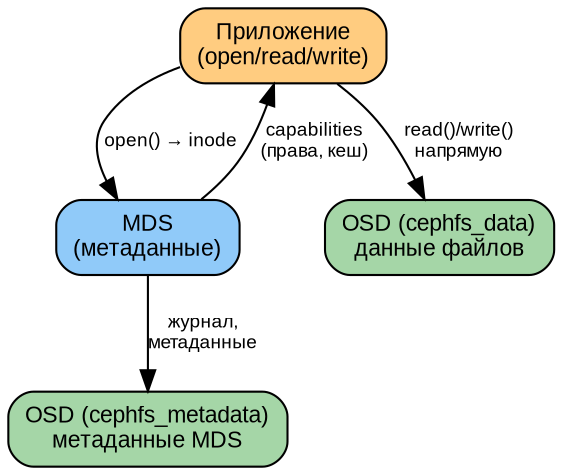

# Часть VII. Разработка и интеграция *(55 стр.)*

> **Цель:** освоить программный доступ к Ceph через все интерфейсы — librados (Python), RBD, CephFS, RGW (S3 API).
> **После этой части вы сможете:** написать приложение на Python, управлять RBD-образами, монтировать CephFS, работать с RGW через boto3.

---

## Глава 22. Программный доступ: librados и Python *(18 стр.)*

### 22.1. Уровни доступа *(2 стр.)*

Ceph предоставляет четыре уровня программного доступа — от самого низкоуровневого до самого высокоуровневого:

```
┌─────────────────────────────────────────────┐
│ RGW REST API  (S3/Swift, HTTP)              │ ← Самый высокий уровень
├─────────────────────────────────────────────┤
│ libcephfs     (POSIX-файловая система)      │
├─────────────────────────────────────────────┤
│ librbd        (блочные устройства)          │
├─────────────────────────────────────────────┤
│ librados      (объекты RADOS)               │ ← Самый низкий уровень
└─────────────────────────────────────────────┘
```

- **librados (C/C++)** — прямой доступ к объектам RADOS. Вы управляете объектами напрямую: создаёте, читаете, удаляете, работаете с xattrs и OMAPA. Все вышележащие уровни (RBD, CephFS, RGW) реализованы поверх librados.
- **librbd** — блочные устройства поверх librados. Stripe'ит данные в объекты RADOS автоматически.
- **libcephfs** — файловая система поверх librados. Управляет inode, каталогами, метаданными.
- **RGW REST API** — HTTP-доступ, совместимый с Amazon S3. Не требует librados на клиенте — чистый HTTP.

---

### 22.2. Python-клиент: подключение и аутентификация *(3 стр.)*

```python
import rados

# 1. Подключение к кластеру
cluster = rados.Rados(conffile='/etc/ceph/ceph.conf')
cluster.connect()

# Если конфиг не в стандартном месте — можно указать явно:
# cluster = rados.Rados(
#     conffile='/etc/ceph/ceph.conf',
#     conf=dict(keyring='/etc/ceph/ceph.client.admin.keyring')
# )

# 2. Получить статистику кластера
stats = cluster.get_cluster_stats()
print(f"Cluster: {stats['kb']} KB used, {stats['kb_avail']} KB avail")

# 3. Список пулов
pools = cluster.list_pools()
print(f"Pools: {pools}")

# 4. Открыть пул (контекстный менеджер)
with cluster.open_ioctx('test_pool') as ioctx:
    # Работа с объектами (см. далее)
    pass

cluster.shutdown()
```

**Обработка ошибок:**

```python
import rados

cluster = rados.Rados(conffile='/etc/ceph/ceph.conf')
try:
    cluster.connect()
    with cluster.open_ioctx('test_pool') as ioctx:
        # работа с объектами
        pass
except rados.ObjectNotFound:
    print("Объект не найден")
except rados.PermissionError:
    print("Нет прав на операцию — проверьте keyring/caps")
except rados.Error as e:
    print(f"Ошибка RADOS: {e}")
finally:
    cluster.shutdown()
```

---

### 22.3. CRUD объектов *(5 стр.)*

```python
import rados

cluster = rados.Rados(conffile='/etc/ceph/ceph.conf')
cluster.connect()

with cluster.open_ioctx('test_pool') as ioctx:
    # === CREATE (запись) ===
    # Простая запись
    ioctx.write('my-object', b'Hello, Ceph!')

    # Запись с атомарным сравнением (compare-and-swap)
    # ioctx.write_full('my-object', b'New data')

    # === READ (чтение) ===
    data = ioctx.read('my-object')
    print(f"Read: {data.decode()}")  # Read: Hello, Ceph!

    # Чтение части объекта (offset=0, length=5)
    partial = ioctx.read('my-object', length=5)
    print(f"Partial: {partial.decode()}")  # Hello

    # Статистика объекта
    stat = ioctx.stat('my-object')
    print(f"Size: {stat[0]}, Mtime: {stat[1]}")

    # === XATTRS (расширенные атрибуты) ===
    ioctx.set_xattr('my-object', 'author', b'Ivanov')
    author = ioctx.get_xattr('my-object', 'author')
    print(f"Author: {author.decode()}")  # Ivanov

    # === OMAPA (object map — key-value хранилище внутри объекта) ===
    ioctx.set_omap('my-object', ('key1', 'val1'), ('key2', 'val2'))

    # Чтение OMAPA
    with rados.ReadOpCtx() as read_op:
        omap_iter, ret = ioctx.get_omap_vals(read_op, '', '', 10)
        cluster.operate_read_op(read_op, 'my-object')
        for key, val in omap_iter:
            print(f"OMAP {key}: {val}")

    # === DELETE (удаление) ===
    ioctx.remove_object('my-object')

cluster.shutdown()
```

**Асинхронный ввод-вывод (AIO):**

```python
import rados, time

cluster = rados.Rados(conffile='/etc/ceph/ceph.conf')
cluster.connect()

with cluster.open_ioctx('test_pool') as ioctx:
    # Асинхронная запись
    comp = ioctx.aio_write('async-obj', b'Async data', 0)
    comp.wait_for_complete()  # блокируемся до завершения
    print(f"Write result: {comp.get_return_value()}")

    # Асинхронное чтение
    comp = ioctx.aio_read('async-obj', 10, 0)
    comp.wait_for_complete()
    print(f"Read: {comp.get_return_value()}")

    # Асинхронная запись с callback
    def callback(completion):
        print(f"Async write completed with: {completion.get_return_value()}")

    comp = ioctx.aio_write('callback-obj', b'Callback data', 0)
    comp.set_complete_callback(callback)
    # comp.wait_for_complete()  # или отпустить и делать другие дела

    time.sleep(1)  # в реальном приложении — event loop

cluster.shutdown()
```

---

### 22.4. Практикум: миграция объектов *(8 стр.)*

**Задача:** написать приложение, которое переносит все объекты из пула A в пул B.

```python
#!/usr/bin/env python3
"""
Миграция объектов между пулами Ceph.
Использование: python3 migrate.py <source_pool> <dest_pool> [--async]
"""
import rados
import argparse
import time
import sys

def migrate_sync(cluster, src_pool, dst_pool):
    """Синхронная миграция — объект за объектом."""
    count = 0
    size_total = 0
    t_start = time.time()

    with cluster.open_ioctx(src_pool) as src_ctx, \
         cluster.open_ioctx(dst_pool) as dst_ctx:

        # Итератор по объектам (осторожно: может быть миллиард!)
        objects = src_ctx.list_objects()
        for obj in objects:
            try:
                # Читаем объект
                data = obj.read()

                # Копируем xattrs
                xattrs = obj.get_xattrs()

                # Записываем в целевой пул
                dst_ctx.write_full(obj.key, data)

                # Копируем xattrs
                for k, v in xattrs.items():
                    dst_ctx.set_xattr(obj.key, k, v)

                count += 1
                size_total += len(data)

                if count % 100 == 0:
                    print(f"  Migrated {count} objects...", end='\r')

            except rados.Error as e:
                print(f"  ERROR on {obj.key}: {e}", file=sys.stderr)
                continue

    elapsed = time.time() - t_start
    print(f"\nSync: {count} objects, {size_total} bytes in {elapsed:.1f}s")
    print(f"      {count/elapsed:.0f} obj/s, {size_total/elapsed/2**20:.1f} MiB/s")
    return count, elapsed

def migrate_async(cluster, src_pool, dst_pool, concurrency=16):
    """Асинхронная миграция — до concurrency одновременных операций."""
    import threading
    count = [0]
    size_total = [0]
    errors = []
    lock = threading.Lock()

    def worker(src_pool, dst_pool, obj_list):
        with cluster.open_ioctx(src_pool) as src_ctx, \
             cluster.open_ioctx(dst_pool) as dst_ctx:
            for obj_key in obj_list:
                try:
                    data = src_ctx.read(obj_key)
                    dst_ctx.write_full(obj_key, data)
                    with lock:
                        count[0] += 1
                        size_total[0] += len(data)
                except rados.Error as e:
                    errors.append(f"{obj_key}: {e}")

    # Получаем список всех объектов
    objects = []
    with cluster.open_ioctx(src_pool) as src_ctx:
        for obj in src_ctx.list_objects():
            objects.append(obj.key)

    # Разбиваем на батчи для worker-потоков
    batch_size = max(1, len(objects) // concurrency)
    batches = [objects[i:i+batch_size] for i in range(0, len(objects), batch_size)]

    t_start = time.time()
    threads = []
    for batch in batches:
        t = threading.Thread(target=worker, args=(src_pool, dst_pool, batch))
        t.start()
        threads.append(t)

    for t in threads:
        t.join()

    elapsed = time.time() - t_start
    print(f"\nAsync: {count[0]} objects, {size_total[0]} bytes in {elapsed:.1f}s")
    print(f"       {count[0]/elapsed:.0f} obj/s, {size_total[0]/elapsed/2**20:.1f} MiB/s")

    if errors:
        print(f"Errors: {len(errors)}")
    return count[0], elapsed

def main():
    parser = argparse.ArgumentParser(description='Ceph pool migration tool')
    parser.add_argument('src_pool', help='Source pool name')
    parser.add_argument('dst_pool', help='Destination pool name')
    parser.add_argument('--async', action='store_true', help='Use async migration')
    parser.add_argument('--concurrency', type=int, default=16,
                        help='Concurrency for async (default: 16)')
    args = parser.parse_args()

    cluster = rados.Rados(conffile='/etc/ceph/ceph.conf')
    cluster.connect()

    try:
        if getattr(args, 'async'):
            migrate_async(cluster, args.src_pool, args.dst_pool, args.concurrency)
        else:
            migrate_sync(cluster, args.src_pool, args.dst_pool)
    finally:
        cluster.shutdown()

if __name__ == '__main__':
    main()
```

**Задание:**
1. Создайте два пула: `source` и `dest`
2. Наполните `source` тестовыми объектами (1000 объектов по 1 МБ)
3. Запустите миграцию в синхронном режиме — замерьте скорость
4. Запустите в асинхронном (16 потоков) — сравните
5. Объясните разницу (почему async быстрее? какие ограничения?)

---

## Глава 23. Блочные устройства RBD *(14 стр.)*

### 23.1. RBD: striping, object map, layering *(3 стр.)*

**Как RBD устроен внутри:**

Образ RBD — это виртуальный диск. Когда вы записываете в него данные, RBD разбивает запись на **страйпы (stripes)**, каждый страйп — на объекты RADOS фиксированного размера.

```
Образ RBD (10 GB), order=22 (object size = 4 MB)

Запись на смещение 6 MB (длина 2 MB):
┌─────────────────────────────────────────────┐
│ obj.0000  │ obj.0001  │ obj.0002  │ obj.0003│ ... до 2560 объектов
│ 0..4 MB   │ 4..8 MB   │ 8..12 MB  │         │
│           │  [запись] │  [запись] │         │
└─────────────────────────────────────────────┘
```

**Параметры:**
- `order` — размер объекта в RADOS: `object_size = 2^order`. По умолчанию order=22 → 4 МБ.
- `stripe_unit` — размер блока внутри объекта (по умолчанию = object_size)
- `stripe_count` — количество объектов, по которым чередуются данные

**Object map:** битовая карта, отслеживающая, какие объекты реально выделены (содержат данные). Позволяет быстро выполнять `rbd resize`, `rbd export`, `rbd diff` без чтения каждого объекта.

**Layering (Copy-on-Write):** клон RBD не копирует данные физически — он ссылается на родительский снапшот. Только изменённые блоки записываются в клон. Это позволяет создавать десятки клонов без расхода места.

---

### 23.2. Снапшоты и клоны *(3 стр.)*

```bash
# Создать образ
rbd create -s 10G rbd_pool/vm-disk

# Записать данные (через клиент)
rbd map rbd_pool/vm-disk
mkfs.ext4 /dev/rbd0
mount /dev/rbd0 /mnt
echo "Important data" > /mnt/readme.txt
umount /mnt
rbd unmap /dev/rbd0

# Снапшот
rbd snap create rbd_pool/vm-disk@v1
rbd snap ls rbd_pool/vm-disk

# Защита снапшота (чтобы нельзя было удалить, пока есть клоны)
rbd snap protect rbd_pool/vm-disk@v1

# Клон
rbd clone rbd_pool/vm-disk@v1 rbd_pool/vm-clone
# Клон занимает 0 байт! Только изменённые блоки будут записаны.

# Flatten (отрыв от родителя — полная копия)
rbd flatten rbd_pool/vm-clone
# Теперь клон занимает полноценное место.

# Откат
rbd snap rollback rbd_pool/vm-disk@v1
# Образ возвращён на момент снапшота!
```

**Жизненный цикл:**
```
образ → запись данных → снапшот → protect → клон → запись в клон (CoW) → flatten → удаление родителя
```

---

### 23.3. RBD Mirror *(3 стр.)*

См. также §20.2. Здесь — программный доступ:

```python
import rbd

cluster = rados.Rados(conffile='/etc/ceph/ceph.conf')
cluster.connect()

with cluster.open_ioctx('rbd_pool') as ioctx:
    rbd_inst = rbd.RBD()

    # Посмотреть mirror-статус образа
    mirror_image_status = rbd_inst.mirror_image_get_status(ioctx, 'vm-disk')
    print(f"Mirror state: {mirror_image_status['state']}")
    print(f"Last update: {mirror_image_status['last_metadata_update']}")

    # Демоция (demote) — перевести в режим secondary
    rbd_inst.mirror_image_demote(ioctx, 'vm-disk')

    # Промоция (promote) — перевести в режим primary
    rbd_inst.mirror_image_promote(ioctx, 'vm-disk', force=True)

cluster.shutdown()
```

---

### 23.4. Практикум *(5 стр.)*

**Скрипт: полный цикл RBD (снапшоты + клоны + Mirror):**

```bash
#!/bin/bash
POOL=rbd_pool
IMAGE=test-vm

# 1. Создать образ и записать данные
rbd create -s 5G $POOL/$IMAGE
rbd map $POOL/$IMAGE
mkfs.ext4 /dev/rbd/${POOL}/${IMAGE}
mount /dev/rbd/${POOL}/${IMAGE} /mnt
echo "Version 1" > /mnt/version.txt
dd if=/dev/zero of=/mnt/bigfile bs=1M count=100
umount /mnt
rbd unmap /dev/rbd/${POOL}/${IMAGE}

# 2. Снапшот
rbd snap create $POOL/$IMAGE@v1

# 3. Изменить данные
rbd map $POOL/$IMAGE
mount /dev/rbd/${POOL}/${IMAGE} /mnt
echo "Version 2" > /mnt/version.txt
rm /mnt/bigfile
umount /mnt
rbd unmap /dev/rbd/${POOL}/${IMAGE}

# 4. Проверить изменения (diff)
rbd diff $POOL/$IMAGE@v1 $POOL/$IMAGE

# 5. Откат к v1
rbd snap rollback $POOL/$IMAGE@v1

# 6. Проверить — bigfile снова существует, version.txt = "Version 1"
rbd map $POOL/$IMAGE
mount /dev/rbd/${POOL}/${IMAGE} /mnt
cat /mnt/version.txt  # Version 1
ls -lh /mnt/bigfile     # 100M
umount /mnt
rbd unmap /dev/rbd/${POOL}/${IMAGE}
```

---

## Глава 24. Файловая система CephFS *(12 стр.)*

### 24.1. CephFS: MDS, journal, subtree *(3 стр.)*



**Как CephFS хранит файлы:**
- Файл — это inode + объекты данных
- Inode хранится в MDS (и его журнале, и пуле `cephfs_metadata`)
- Данные файла — объекты в пуле `cephfs_data`
- MDS выдаёт клиентам **capabilities (caps)** — разрешения на чтение/запись с кешированием

---

### 24.2. Мульти-MDS *(3 стр.)*

```bash
# Увеличить количество активных MDS
ceph fs set cephfs max_mds 4

# Привязать каталог к конкретному MDS (pinning)
setfattr -n ceph.dir.pin -v 1 /mnt/cephfs/project-a
# Теперь /project-a обслуживается только MDS rank 1

# Смотреть статус
ceph fs status cephfs
# cephfs - 4 clients
# ======
# RANK  STATE       MDS           ACTIVITY
#  0    active      ceph-mon1     Reqs: 42/s
#  1    active      ceph-mon2     Reqs: 18/s
#  2    standby
```

---

### 24.3. NFS-Ganesha *(3 стр.)*

Экспорт CephFS через NFSv4 — когда клиент не может смонтировать CephFS нативно (например, устаревшее ядро, или другая ОС):

```bash
# Создать NFS-кластер через Ceph
ceph nfs cluster create nfs-ceph --placement="ceph-mon1,ceph-mon2"

# Создать экспорт
ceph nfs export create cephfs nfs-ceph /export/data cephfs --path /

# Клиент монтирует NFS:
mount -t nfs4 ceph-mon1:/export/data /mnt/nfs
```

---

### 24.4. Практикум *(3 стр.)*

```bash
# Монтирование CephFS (kernel driver — быстрее)
mount -t ceph mon1,mon2,mon3:/ /mnt/cephfs \
    -o name=admin,secretfile=/etc/ceph/admin.secret

# Монтирование ceph-fuse (user-space — медленнее, но отладочнее)
ceph-fuse /mnt/cephfs

# Снапшот
mkdir /mnt/cephfs/.snap/manual-snap
# Удалить файл
rm /mnt/cephfs/important.txt
# Восстановить из снапшота
cp /mnt/cephfs/.snap/manual-snap/important.txt /mnt/cephfs/

# Мульти-MDS: pinning
setfattr -n ceph.dir.pin -v 0 /mnt/cephfs/dir1  # привязать к rank 0
setfattr -n ceph.dir.pin -v 1 /mnt/cephfs/dir2  # привязать к rank 1
# Проверить
getfattr -n ceph.dir.pin /mnt/cephfs/dir1
```

---

## Глава 25. Объектное хранилище RGW *(11 стр.)*

### 25.1. S3-совместимый API *(3 стр.)*

RGW предоставляет REST API, совместимый с Amazon S3. Любой инструмент, работающий с S3, работает с Ceph RGW.

**Основные операции (HTTP):**
```
GET    /{bucket}              — List objects
PUT    /{bucket}              — Create bucket
DELETE /{bucket}              — Delete bucket
PUT    /{bucket}/{object}     — Upload object
GET    /{bucket}/{object}     — Download object
DELETE /{bucket}/{object}     — Delete object
HEAD   /{bucket}/{object}     — Object metadata
POST   /{bucket}/{object}?uploads — Multipart upload
```

**Создание пользователя:**
```bash
radosgw-admin user create --uid=app-user --display-name="Application" \
    --access-key=AAABBBCCCDDDEEEFFFGG --secret-key=aaabbbcccdddeeefffgg
```

---

### 25.2. Multi-site *(3 стр.)*

См. §20.4 для полного разбора архитектуры multi-site.

**Ключевое:** multi-site обеспечивает асинхронную репликацию объектов между географически распределёнными кластерами. Клиент может писать в любую зону — изменения распространятся на остальные.

**Конфликты:** если один объект изменён одновременно в двух зонах (редкая ситуация), RGW разрешает конфликт по правилу **last-writer-wins** (побеждает тот, кто записал позже по timestamp). Это важно учитывать при проектировании приложений.

---

### 25.3. Практикум: boto3 *(5 стр.)*

```python
#!/usr/bin/env python3
"""
Полный цикл работы с Ceph RGW через boto3.
"""
import boto3
from botocore.client import Config

# Настройка подключения
s3 = boto3.client(
    's3',
    endpoint_url='http://rgw-node:7480',  # адрес RGW
    aws_access_key_id='AAABBBCCCDDDEEEFFFGG',
    aws_secret_access_key='aaabbbcccdddeeefffgg',
    config=Config(signature_version='s3v4'),
    region_name='default'
)

# 1. Создать bucket
s3.create_bucket(Bucket='my-bucket')
print("Bucket created")

# 2. Загрузить объект
s3.put_object(
    Bucket='my-bucket',
    Key='data/report.json',
    Body='{"status": "ok", "count": 42}',
    ContentType='application/json'
)
print("Object uploaded")

# 3. Скачать объект
response = s3.get_object(Bucket='my-bucket', Key='data/report.json')
content = response['Body'].read().decode()
print(f"Downloaded: {content}")

# 4. Список объектов
resp = s3.list_objects_v2(Bucket='my-bucket', Prefix='data/')
for obj in resp.get('Contents', []):
    print(f"  - {obj['Key']} ({obj['Size']} bytes)")

# 5. Сгенерировать pre-signed URL (временная ссылка)
url = s3.generate_presigned_url(
    'get_object',
    Params={'Bucket': 'my-bucket', 'Key': 'data/report.json'},
    ExpiresIn=3600  # 1 час
)
print(f"Pre-signed URL: {url}")

# 6. Multipart upload (для больших файлов)
upload = s3.create_multipart_upload(Bucket='my-bucket', Key='bigfile.bin')
parts = []

# Часть 1
resp = s3.upload_part(
    Bucket='my-bucket', Key='bigfile.bin',
    PartNumber=1, UploadId=upload['UploadId'],
    Body=b'A' * (5 * 1024 * 1024)  # 5 MB
)
parts.append({'PartNumber': 1, 'ETag': resp['ETag']})

# Завершить multipart upload
s3.complete_multipart_upload(
    Bucket='my-bucket', Key='bigfile.bin',
    UploadId=upload['UploadId'],
    MultipartUpload={'Parts': parts}
)
print("Multipart upload completed")

# 7. Удаление объекта
s3.delete_object(Bucket='my-bucket', Key='data/report.json')

# 8. Удаление bucket
s3.delete_bucket(Bucket='my-bucket')
print("Cleanup done")
```

**Задание:** напишите приложение, которое:
1. Принимает файлы через HTTP (Flask endpoint)
2. Загружает их в Ceph RGW
3. Генерирует pre-signed URL для скачивания
4. Автоматически удаляет файлы старше 30 дней (lifecycle policy)

---

| Навигация | |
|-----------|---|
| ← Часть VI | [part-VI.md](part-VI.md) |
| ↑ Оглавление | [TOC.md](TOC.md) |
| → Часть VIII | [part-VIII.md](part-VIII.md) |
