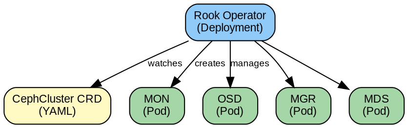
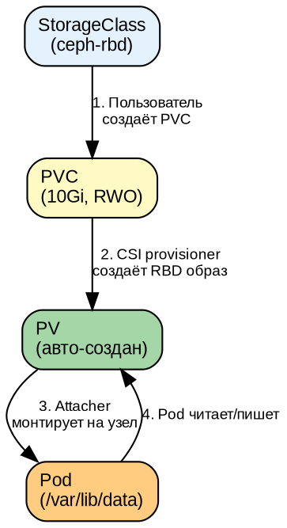
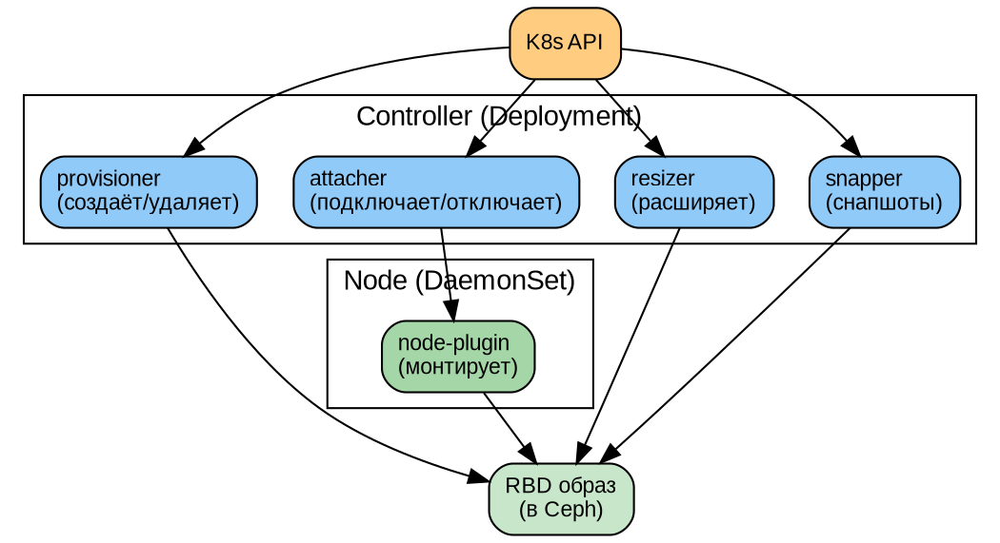
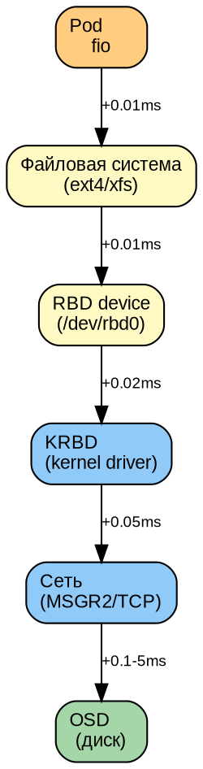

# Часть VIII. Kubernetes и CSI *(~210 стр., 8 кейсов)*

> **Цель:** освоить интеграцию Ceph с Kubernetes — от архитектуры Rook до диагностики CSI и тюнинга производительности.
> **После этой части вы сможете:** развернуть Rook+Ceph через Helm, настроить RBD/CephFS/NFS тома, реализовать topology-aware provisioning, измерить и улучшить производительность, диагностировать 8 типовых отказов CSI, выполнить миграцию PVC, ответить на контрольные вопросы.

---

## Глава 26. Ceph + Kubernetes: архитектура интеграции *(16 стр.)*

### 26.1. CSI (Container Storage Interface) *(3 стр.)*

**CSI** — стандартный интерфейс между Kubernetes и системами хранения. До CSI каждый вендор писал свой плагин, и они были несовместимы. CSI унифицирует:

```
┌─────────────────────────────────────────────┐
│ Kubernetes                                   │
│  PVC → StorageClass → PV                    │
│         ↓                                    │
│  CSI provisioner (sidecar)                   │
│         ↓                                    │
│  CSI driver (RBD/CephFS/NFS)                 │
│         ↓                                    │
│  Ceph Cluster                                │
└─────────────────────────────────────────────┘
```

**Компоненты CSI:**
- **Controller plugin** (Deployment): создаёт/удаляет тома, снапшоты
- **Node plugin** (DaemonSet): монтирует тома на узлах, где запущены поды
- **Sidecar-контейнеры:** provisioner, attacher, resizer, snapper, liveness-probe

```dot
digraph {
    bgcolor=white
    node [fontname="Arial" fontsize=11 fontcolor=black shape=box style="filled,rounded"]
    edge [fontname="Arial" fontsize=9 fontcolor=black]

    k8s [label="Kubernetes\nAPI Server" fillcolor="#FFCC80"]
    pvc [label="PVC\n(запрос тома)" fillcolor="#FFF9C4"]
    sp [label="StorageClass\n(тип тома)" fillcolor="#FFF9C4"]

    provisioner [label="csi-provisioner\n(sidecar)" fillcolor="#90CAF9"]
    attacher [label="csi-attacher\n(sidecar)" fillcolor="#90CAF9"]
    driver [label="CSI Driver\n(rbd/cephfs)" fillcolor="#64B5F6"]
    node [label="Node Plugin\n(DaemonSet)" fillcolor="#A5D6A7"]

    ceph [label="Ceph Cluster" fillcolor="#A5D6A7"]

    k8s -> pvc
    pvc -> sp
    sp -> provisioner -> driver -> ceph
    attacher -> driver
    driver -> node [label="mount"]
    node -> ceph [label="map RBD"]
}
```

---

### 26.2. Rook: оператор Ceph *(4 стр.)*

**Rook** — это Kubernetes-оператор для Ceph. Оператор — это контроллер, который следит за Custom Resources (CRD) и автоматически приводит реальное состояние кластера к желаемому.

**Архитектура Rook:**


**Reconciler (цикл согласования):**
```
1. Прочитать CephCluster CRD (желаемое состояние: "3 MON, 12 OSD")
2. Прочитать фактическое состояние (сколько MON/OSD запущено)
3. Сравнить → довести до желаемого (запустить недостающие)
4. Повторить
```

**Ключевые CRD Rook:**
- `CephCluster` — сам кластер Ceph
- `CephBlockPool` — RBD пул → StorageClass
- `CephFilesystem` — CephFS → StorageClass
- `CephObjectStore` — RGW (S3)

---

### 26.2a. CephCluster CRD: полный референс *(8 стр.)*

**CephCluster** — главный CRD Rook. Описывает топологию, конфигурацию и настройки всего кластера Ceph.

```yaml
apiVersion: ceph.rook.io/v1
kind: CephCluster
metadata:
  name: rook-ceph
  namespace: rook-ceph
spec:
  cephVersion:
    image: quay.io/ceph/ceph:v19.2.0      # Squid (или v18.2.0 для Reef)
    allowUnsupported: false                 # Запретить неподдерживаемые версии
  dataDirHostPath: /var/lib/rook            # Путь на хосте для данных MON/OSD
  mon:
    count: 3                                # Нечётное количество (3 или 5)
    allowMultiplePerNode: false             # Не размещать MON на одном узле
    volumeClaimTemplate:                    # Если хотим PVC для MON вместо hostPath
      spec:
        storageClassName: local-storage
        resources:
          requests:
            storage: 10Gi
  mgr:
    count: 2                                # Рекомендуется 2 для HA
    allowMultiplePerNode: false
    modules:
      - name: pg_autoscaler
        enabled: true
      - name: balancer
        enabled: true
  network:
    connections:
      encryption:
        enabled: false                      # Включить MSGR2 шифрование
      compression:
        enabled: false
      requireMsgr2: false                   # Требовать MSGR2 для всех соединений
    provider: host                          # host | multus
    selectors: {}                           # Метки узлов для сетей
    # Multi-homed сеть (если provider=multus):
    # provider: multus
    # selectors:
    #   public: public-net
    #   cluster: cluster-net
  storage:
    useAllNodes: true                       # Использовать все узлы
    useAllDevices: true                     # Использовать все устройства
    nodes:                                  # Поузловая конфигурация
      - name: worker-1
        devices:
          - name: /dev/sdb
          - name: /dev/sdc
        config:
          storeType: bluestore
          osdsPerDevice: "1"
      - name: worker-2
        deviceFilter: "^sd[b-c]"           # Regex-фильтр устройств
        config:
          storeType: bluestore
          metadataDevice: /dev/nvme0n1      # Отдельный NVMe для метаданных
    config:
      crushRoot: default                    # CRUSH-корень
    onlyApplyOSDPlacement: false
  disruptionManagement:
    managePodBudgets: true                  # Создавать PDB для MON/OSD
    osdMaintenanceTimeout: 30               # Минут до принудительного drain
    pgHealthCheckTimeout: 0
  healthCheck:
    daemonHealth:
      mon:
        interval: 45s
        timeout: 60s
      osd:
        interval: 60s
        timeout: 60s
      status:
        interval: 60s
        timeout: 60s
    livenessProbe:
      mon:
        disabled: false
      mgr:
        disabled: false
      osd:
        disabled: false
  dashboard:
    enabled: true
    ssl: true
    port: 8443
    urlPrefix: /
  security:
    kms:
      connectionTimeout: 15
      # Для внешнего KMS (Vault):
      # tokenSecretName: vault-token
      # vault:
      #   name: vault
      #   port: 8200
      #   backend: csi
  logCollector:
    enabled: true
    periodicity: daily
    maxLogSize: 500M
  resources:
    mon:
      requests:
        cpu: "500m"
        memory: "2Gi"
      limits:
        cpu: "2"
        memory: "4Gi"
    mgr:
      requests:
        cpu: "1000m"
        memory: "1Gi"
      limits:
        cpu: "2"
        memory: "4Gi"
    osd:
      requests:
        cpu: "2000m"
        memory: "4Gi"
      limits:
        cpu: "4"
        memory: "8Gi"
```

**Ключевые параметры, о которых часто забывают:**

| Параметр | Назначение | Ошибка при отсутствии |
|----------|-----------|----------------------|
| `mon.count=3` | Кворум MON | Если `<3`, нет HA |
| `mgr.count=2` | Балансировка MGR | Один MGR — точка отказа dashboard |
| `mon.allowMultiplePerNode=false` | Анти-аффинити MON | Один узел = потеря кворума |
| `disruptionManagement.managePodBudgets` | PDB для eviction | K8s может выселить все MON разом |
| `storage.nodes[].config.osdsPerDevice` | OSD на устройство | Для NVMe полезно >1 |
| `network.provider=multus` | Multi-homed сеть | Без неё нет изоляции public/cluster |

---

### 26.2b. CephBlockPool CRD: полный референс *(4 стр.)*

**CephBlockPool** — определяет RBD-пул, который автоматически становится доступен через StorageClass.

```yaml
apiVersion: ceph.rook.io/v1
kind: CephBlockPool
metadata:
  name: k8s-rbd-ssd
  namespace: rook-ceph
spec:
  failureDomain: host                      # host | osd | rack | datacenter
  replicated:
    size: 3                                # Реплики (Data Protection)
    requireSafeReplicaSize: true           # Не уменьшать ниже safe size
    replicasPerFailureDomain: 1            # Распределение по failure domain
    # ИЛИ erasureCoded:
    # erasureCoded:
    #   dataChunks: 4
    #   codingChunks: 2
  crushRoot: default
  deviceClass: ssd                         # Только SSD OSD
  enableRBDStats: true                     # Per-image IOPS/BW метрики
  quotaMaxBytes: 107374182400              # 100 GiB квота на пул
  parameters:
    compression_mode: aggressive           # none | passive | aggressive | force
    compression_algorithm: snappy          # snappy | zlib | lz4 | zstd
    compression_required_ratio: 0.7        # Минимальный коэффициент
    pg_num: 128                            # Начальное количество PG
    pg_autoscale_mode: "on"                # on | off | warn
    target_size_ratio: 0.3                 # Доля данных в пуле (для PG autoscaler)
  mirroring:
    enabled: false
    mode: image                            # pool | image
    # snapshotSchedules:
    #   - interval: 24h
    #     startTime: "02:00:00"
  statusCheck:
    mirror:
      disabled: false
      interval: 60s
  erasureCodeProfile: ""
```

**Аннотации для StorageClass (автоматически):**
При создании CephBlockPool, Rook генерирует StorageClass с именем `<namespace>-<pool-name>` (например, `rook-ceph-k8s-rbd-ssd`). Параметры пула автоматически подставляются в StorageClass.

**Дополнительные параметры пула (parameters):**

```yaml
parameters:
  # Производительность
  bluestore_min_alloc_size_hdd: 65536      # 64K для HDD
  bluestore_min_alloc_size_ssd: 16384      # 16K для SSD
  osd_pool_default_min_size: 2             # Минимальный размер для I/O
  # Восстановление
  osd_pool_default_flag_nodelete: "false"
  osd_pool_default_flag_nopgchange: "false"
  osd_pool_default_flag_nosizechange: "false"
  # Кеширование
  target_max_bytes: 1099511627776          # 1 TiB max
  target_max_objects: 1000000
```

---

### 26.2c. CephFilesystem CRD: полный референс *(4 стр.)*

```yaml
apiVersion: ceph.rook.io/v1
kind: CephFilesystem
metadata:
  name: cephfs-shared
  namespace: rook-ceph
spec:
  metadataPool:
    failureDomain: host
    replicated:
      size: 3
    parameters:
      compression_mode: aggressive
      pg_num: 64
      pg_autoscale_mode: "on"
  dataPools:
    - failureDomain: host
      replicated:
        size: 3
      deviceClass: ssd
      parameters:
        compression_mode: aggressive
        pg_num: 256
        pg_autoscale_mode: "on"
    # Несколько dataPool с разными deviceClass для tiering:
    - failureDomain: host
      replicated:
        size: 2
      deviceClass: hdd
      parameters:
        pg_num: 128
  metadataServer:
    activeCount: 2                         # Активных MDS для HA
    activeStandby: true                    # Standby MDS при отказе активного
    resources:
      requests:
        cpu: "2000m"
        memory: "4Gi"
      limits:
        cpu: "4"
        memory: "8Gi"
    placement: {}
    priorityClassName: system-cluster-critical
  preserveFilesystemOnDelete: false        # Удалять данные вместе с FS
  mirroring:
    enabled: false
    # peers:
    #   secretNames: ["secondary-cluster"]
  statusCheck:
    mirror:
      disabled: false
      interval: 60s
```

**Multi-tier CephFilesystem (SSD + HDD):**

```yaml
spec:
  metadataPool:
    replicated:
      size: 3
    deviceClass: ssd                       # Метаданные всегда на SSD!
  dataPools:
    - name: hot
      replicated:
        size: 3
      deviceClass: ssd                     # «Горячие» данные на SSD
      parameters:
        pg_num: 128
    - name: cold
      replicated:
        size: 2
      deviceClass: hdd                     # «Холодные» данные на HDD
      parameters:
        pg_num: 64
```

**SubvolumeGroup (Squid+):**
```yaml
apiVersion: ceph.rook.io/v1
kind: CephFilesystemSubVolumeGroup
metadata:
  name: app-data
  namespace: rook-ceph
spec:
  filesystemName: cephfs-shared
  dataPoolName: hot                        # Привязать к hot-пулу
  quotaMaxBytes: 536870912000              # 500 GiB квота на группу
```

---

### 26.2d. Развёртывание Rook через Helm *(4 стр.)*

**Helm** — предпочтительный способ установки Rook в production. В отличие от `kubectl apply`, Helm позволяет управлять версиями, значениями и апгрейдами.

**Добавление репозитория:**

```bash
helm repo add rook-release https://charts.rook.io/release
helm repo update
```

**Установка оператора:**

```bash
# Создать namespace
kubectl create namespace rook-ceph

# Установка оператора
helm install --namespace rook-ceph rook-ceph \
  rook-release/rook-ceph \
  --version v1.15.7 \
  --set csi.enableCephfsDriver=true \
  --set csi.enableRbdDriver=true \
  --set csi.enableNfsDriver=false \
  --set csi.enableVolumeGroupSnapshot=true \
  --set enableDiscoveryDaemon=true \
  --set logLevel=INFO
```

**Полный `values.yaml` для production:**

```yaml
# values-prod.yaml
image:
  repository: rook/ceph
  tag: v1.15.7
  pullPolicy: IfNotPresent

csi:
  enableRbdDriver: true
  enableCephfsDriver: true
  enableNfsDriver: false
  enableVolumeGroupSnapshot: true
  enableCSIHostNetwork: true               # Улучшает сетевую производительность
  # Тюнинг sidecar-контейнеров
  provisionerReplicas: 2                   # HA для provisioner
  csiRBDPluginVolume:
    - name: lib-modules
      hostPath:
        path: /lib/modules
  csiCephFSPluginVolume:
    - name: lib-modules
      hostPath:
        path: /lib/modules
  # Ресурсы sidecar
  csiProvisionerResource:
    requests:
      cpu: 100m
      memory: 128Mi
    limits:
      cpu: 500m
      memory: 512Mi
  csiAttacherResource:
    requests:
      cpu: 100m
      memory: 128Mi
    limits:
      cpu: 500m
      memory: 512Mi
  csiResizerResource:
    requests:
      cpu: 100m
      memory: 128Mi
    limits:
      cpu: 500m
      memory: 512Mi
  csiSnapshotterResource:
    requests:
      cpu: 200m
      memory: 256Mi
    limits:
      cpu: 1
      memory: 1Gi
  # RBD-specific
  rbdFSGroupPolicy: "File"
  rbdLivenessMetricsPort: 9080
  # CephFS-specific
  cephFSFSGroupPolicy: "File"
  cephFSLivenessMetricsPort: 9081
  # NFS-specific
  nfsLivenessMetricsPort: 9082

enableDiscoveryDaemon: true                # Авто-обнаружение дисков
discoveryDaemonInterval: "60m"

# Толерантность к taints
tolerations:
  - key: "node-role.kubernetes.io/control-plane"
    operator: "Exists"
    effect: "NoSchedule"

# Node affinity
nodeAffinity:
  requiredDuringSchedulingIgnoredDuringExecution:
    nodeSelectorTerms:
      - matchExpressions:
          - key: "node-role.kubernetes.io/worker"
            operator: "Exists"

# Приоритет
priorityClassName: system-cluster-critical

# Аудит
enableOBCWatcher: true

# Управление обновлениями
enableMachineDisruptionBudgets: true

# Логи
logLevel: INFO
```

**Установка кластера Ceph через Helm:**

```bash
helm install --namespace rook-ceph rook-ceph-cluster \
  rook-release/rook-ceph-cluster \
  --version v1.15.7 \
  --values cluster-values.yaml
```

**`cluster-values.yaml`:**

```yaml
operatorNamespace: rook-ceph
cephClusterSpec:
  cephVersion:
    image: quay.io/ceph/ceph:v19.2.0
  mon:
    count: 3
    allowMultiplePerNode: false
  mgr:
    count: 2
  dashboard:
    enabled: true
    ssl: true
  storage:
    useAllNodes: true
    useAllDevices: true
    config:
      osdsPerDevice: "1"
  disruptionManagement:
    managePodBudgets: true
    osdMaintenanceTimeout: 30

cephBlockPools:
  - name: ceph-rbd
    spec:
      failureDomain: host
      replicated:
        size: 3
  - name: ceph-rbd-ssd
    spec:
      failureDomain: host
      replicated:
        size: 3
      deviceClass: ssd

cephFileSystems:
  - name: cephfs
    spec:
      metadataPool:
        replicated:
          size: 3
      dataPools:
        - replicated:
            size: 3
      metadataServer:
        activeCount: 2
        activeStandby: true

cephObjectStores:
  - name: ceph-rgw
    spec:
      metadataPool:
        replicated:
          size: 3
      dataPool:
        replicated:
          size: 3
      gateway:
        port: 80
        instances: 2
```

**Проверка Helm-установки:**

```bash
# Список релизов
helm list -n rook-ceph
# NAME                 NAMESPACE    REVISION  STATUS    CHART
# rook-ceph            rook-ceph    1         deployed  rook-ceph-v1.15.7
# rook-ceph-cluster    rook-ceph    1         deployed  rook-ceph-cluster-v1.15.7

# Статус
helm status rook-ceph -n rook-ceph

# История (для отката)
helm history rook-ceph -n rook-ceph

# Откат к предыдущей версии
helm rollback rook-ceph -n rook-ceph
```

---

### 26.3. Ceph-CSI плагины *(3 стр.)*

**RBD CSI plugin:**
- `rbd.csi.ceph.com` — provisioner
- Создаёт RBD-образ для каждого PVC
- Поддерживает: создание, удаление, расширение, снапшоты, клоны

**CephFS CSI plugin:**
- `cephfs.csi.ceph.com` — provisioner
- Создаёт subvolume в CephFS для каждого PVC
- Поддерживает RWX (один том — много подов)

**NFS CSI plugin (Squid+):**
- Экспорт CephFS через NFS-Ganesha
- Полезен, когда ядро узла K8s не поддерживает CephFS

---

### 26.4. StorageClass, PVC, PV: жизненный цикл *(4 стр.)*



**Пример StorageClass (RBD):**
```yaml
apiVersion: storage.k8s.io/v1
kind: StorageClass
metadata:
  name: ceph-rbd
provisioner: rbd.csi.ceph.com
parameters:
  clusterID: 51fa3f5c-7da8-11f1-b7ed-bc2411ed0aef
  pool: k8s_rbd
  imageFeatures: layering
  csi.storage.k8s.io/provisioner-secret-name: ceph-secret
  csi.storage.k8s.io/provisioner-secret-namespace: rook-ceph
  csi.storage.k8s.io/controller-expand-secret-name: ceph-secret
  csi.storage.k8s.io/node-stage-secret-name: ceph-secret
reclaimPolicy: Delete
allowVolumeExpansion: true
```

**Access Modes (режимы доступа):**
| Режим | Описание | Пример |
|-------|----------|--------|
| `ReadWriteOnce` (RWO) | Один под читает/пишет | БД, один экземпляр |
| `ReadOnlyMany` (ROX) | Много подов читают | Конфигурация, статика |
| `ReadWriteMany` (RWX) | Много подов читают/пишут | Общее файловое хранилище |

**RBD поддерживает: RWO, ROX** (блочное устройство — один writer)
**CephFS поддерживает: RWO, ROX, RWX** (файловая система — много writers)

---

### 26.5. Практикум: Rook + Ceph *(2 стр.)*

```bash
# 1. Клонировать Rook
git clone https://github.com/rook/rook.git

# 2. Установить оператор
kubectl apply -f rook/deploy/examples/crds.yaml
kubectl apply -f rook/deploy/examples/common.yaml
kubectl apply -f rook/deploy/examples/operator.yaml

# 3. Создать кластер
kubectl apply -f rook/deploy/examples/cluster.yaml

# 4. Ждать (5-10 минут)
kubectl -n rook-ceph get pods
# rook-ceph-mon-a-xxx    1/1 Running
# rook-ceph-mgr-a-xxx    1/1 Running
# rook-ceph-osd-0-xxx    1/1 Running

# 5. Проверить статус Ceph
kubectl -n rook-ceph exec -it deploy/rook-ceph-tools -- ceph status
```

---

## Глава 27. CSI RBD: блочные тома *(18 стр.)*

### 27.1. RBD CSI: компоненты *(4 стр.)*



**Как работает создание PVC:**
1. Пользователь создаёт PVC → K8s вызывает CSI provisioner
2. Provisioner создаёт RBD-образ (`rbd create k8s_rbd/pvc-<uuid>`)
3. K8s создаёт PV с ссылкой на этот образ
4. При запуске пода: attacher вызывает node-plugin → `rbd map`
5. Node-plugin форматирует (mkfs) и монтирует (`mount`) в под

---

### 27.2. StorageClass: параметры *(3 стр.)*

```yaml
apiVersion: storage.k8s.io/v1
kind: StorageClass
metadata:
  name: ceph-rbd-ssd
provisioner: rbd.csi.ceph.com
parameters:
  clusterID: 51fa3f5c-7da8-11f1-b7ed-bc2411ed0aef
  pool: k8s_rbd_ssd              # SSD-only пул для быстрых томов
  imageFeatures: layering        # Минимальный набор функций
  imageFormat: "2"               # Формат образа RBD v2
  csi.storage.k8s.io/fstype: ext4
  csi.storage.k8s.io/provisioner-secret-name: ceph-secret
  csi.storage.k8s.io/provisioner-secret-namespace: rook-ceph
  csi.storage.k8s.io/node-stage-secret-name: ceph-secret
  csi.storage.k8s.io/node-stage-secret-namespace: rook-ceph
  # Опционально: шифрование
  encrypted: "true"
  encryptionPassphrase: "my-secret-passphrase"
reclaimPolicy: Delete
allowVolumeExpansion: true
mountOptions:
  - discard                     # TRIM для SSD (освобождать удалённые блоки)
  - noatime                     # Не обновлять время доступа (производительность)
```

---

### 27.3. Снапшоты и клоны томов *(3 стр.)*

**VolumeSnapshotClass:**
```yaml
apiVersion: snapshot.storage.k8s.io/v1
kind: VolumeSnapshotClass
metadata:
  name: ceph-rbd-snapshot
driver: rbd.csi.ceph.com
deletionPolicy: Delete
parameters:
  clusterID: 51fa3f5c-...  # Ваш FSID
  csi.storage.k8s.io/snapshotter-secret-name: ceph-secret
  csi.storage.k8s.io/snapshotter-secret-namespace: rook-ceph
```

**Создать снапшот:**
```yaml
apiVersion: snapshot.storage.k8s.io/v1
kind: VolumeSnapshot
metadata:
  name: my-pvc-snap
spec:
  volumeSnapshotClassName: ceph-rbd-snapshot
  source:
    persistentVolumeClaimName: my-pvc
```

**Восстановить из снапшота (клон):**
```yaml
apiVersion: v1
kind: PersistentVolumeClaim
metadata:
  name: my-pvc-restored
spec:
  storageClassName: ceph-rbd
  dataSource:
    name: my-pvc-snap
    kind: VolumeSnapshot
    apiGroup: snapshot.storage.k8s.io
  accessModes:
    - ReadWriteOnce
  resources:
    requests:
      storage: 10Gi
```

---

### 27.4. Расширение тома онлайн *(2 стр.)*

```yaml
# StorageClass: allowVolumeExpansion: true
# Затем:
kubectl edit pvc my-pvc
# Меняем storage: 10Gi → 20Gi

# K8s вызывает CSI resizer → rbd resize
# Файловая система расширяется онлайн (ext4/xfs)
# Под НЕ перезапускается!
```

---

### 27.5. Практикум *(6 стр.)*

**Полный цикл: PVC → снапшот → клон → расширение**

```bash
# 1. PVC + Pod
kubectl apply -f - <<EOF
apiVersion: v1
kind: PersistentVolumeClaim
metadata:
  name: test-pvc
spec:
  storageClassName: ceph-rbd
  accessModes: [ReadWriteOnce]
  resources:
    requests:
      storage: 10Gi
---
apiVersion: v1
kind: Pod
metadata:
  name: test-pod
spec:
  containers:
  - name: app
    image: nginx
    volumeMounts:
    - name: data
      mountPath: /data
  volumes:
  - name: data
    persistentVolumeClaim:
      claimName: test-pvc
EOF

# 2. Записать данные
kubectl exec test-pod -- sh -c "echo 'important data' > /data/file.txt"

# 3. Снапшот
kubectl apply -f snapshot.yaml

# 4. Удалить Pod + PVC
kubectl delete pod test-pod
kubectl delete pvc test-pvc

# 5. Восстановить из снапшота
kubectl apply -f pvc-restored.yaml

# 6. Новый Pod с восстановленным PVC
kubectl apply -f pod-restored.yaml

# 7. Проверить данные
kubectl exec test-pod-restored -- cat /data/file.txt
# "important data"  ← данные на месте!
```

---

### 27.6. Расширенный снапшот-менеджмент *(4 стр.)*

**VolumeGroupSnapshot (K8s 1.27+, Ceph Squid+):**

Групповой снапшот позволяет атомарно заснапшотить несколько PVC одновременно — критично для приложений с несколькими томами (БД + WAL + индексы).

```yaml
# VolumeGroupSnapshotClass
apiVersion: groupsnapshot.storage.k8s.io/v1alpha1
kind: VolumeGroupSnapshotClass
metadata:
  name: ceph-rbd-group-snapshot
driver: rbd.csi.ceph.com
deletionPolicy: Delete
parameters:
  clusterID: 51fa3f5c-...
  csi.storage.k8s.io/group-snapshotter-secret-name: ceph-secret
  csi.storage.k8s.io/group-snapshotter-secret-namespace: rook-ceph
---
# VolumeGroupSnapshot
apiVersion: groupsnapshot.storage.k8s.io/v1alpha1
kind: VolumeGroupSnapshot
metadata:
  name: postgres-group-snap
spec:
  volumeGroupSnapshotClassName: ceph-rbd-group-snapshot
  source:
    selector:
      matchLabels:
        app: postgresql
    # Или явный список:
    # volumeSnapshotContentNames:
    #   - snapcontent-xxx
    #   - snapcontent-yyy
```

**Расписание снапшотов через VolumeSnapshotSchedule (Ceph-CSI):**

```yaml
# Ежечасные на 24 часа + ежедневные на 7 дней
apiVersion: snapshot.storage.k8s.io/v1
kind: VolumeSnapshot
metadata:
  name: db-snap-hourly
  labels:
    schedule: hourly
spec:
  volumeSnapshotClassName: ceph-rbd-snapshot
  source:
    persistentVolumeClaimName: postgres-pvc
```

**Автоматизация через CronJob:**

```yaml
apiVersion: batch/v1
kind: CronJob
metadata:
  name: db-snapshot
spec:
  schedule: "0 */4 * * *"           # Каждые 4 часа
  jobTemplate:
    spec:
      template:
        spec:
          serviceAccountName: snapshot-sa
          containers:
          - name: snapshot
            image: bitnami/kubectl
            command:
            - /bin/sh
            - -c
            - |
              TIMESTAMP=$(date +%Y%m%d-%H%M%S)
              cat <<YAML | kubectl apply -f -
              apiVersion: snapshot.storage.k8s.io/v1
              kind: VolumeSnapshot
              metadata:
                name: postgres-snap-${TIMESTAMP}
              spec:
                volumeSnapshotClassName: ceph-rbd-snapshot
                source:
                  persistentVolumeClaimName: postgres-pvc
              YAML
          restartPolicy: OnFailure
```

**Очистка старых снапшотов:**

```bash
# Удалить снапшоты старше 7 дней
kubectl get volumesnapshot -o json | \
  jq -r '.items[] | select(.metadata.creationTimestamp < "'$(date -d '7 days ago' --iso-8601=seconds)'Z") | .metadata.name' | \
  xargs -r kubectl delete volumesnapshot
```

---

### 27.7. Топология-aware provisioning *(5 стр.)*

**Проблема:** поды распределены по узлам, но их PVC могут быть созданы из пула, который использует OSD на другом хосте — сетевой latency, потеря изоляции.

**Решение:** `volumeBindingMode: WaitForFirstConsumer` + топология узлов.

**Topology-aware StorageClass:**

```yaml
apiVersion: storage.k8s.io/v1
kind: StorageClass
metadata:
  name: ceph-rbd-topology
provisioner: rbd.csi.ceph.com
parameters:
  clusterID: 51fa3f5c-...
  pool: k8s_rbd
  imageFeatures: layering
  csi.storage.k8s.io/fstype: ext4
reclaimPolicy: Delete
allowVolumeExpansion: true
volumeBindingMode: WaitForFirstConsumer    # КРИТИЧНО!
allowedTopologies:
  - matchLabelExpressions:
      - key: topology.kubernetes.io/zone
        values:
          - zone-a
          - zone-b
      - key: topology.kubernetes.io/region
        values:
          - us-east-1
```

**Как это работает:**

```
1. Pod создан → scheduler выбирает узел (node-X в zone-a)
2. CSI provisioner получает топологию узла: zone=zone-a, region=us-east-1
3. Ceph выбирает OSD в той же зоне через CRUSH-правило
4. RBD-образ создаётся → монтируется локально к OSD
5. Минимальная latency!
```

**CRUSH-правило для топологии:**

```bash
# Создать CRUSH-правило на основе топологии зон
ceph osd crush rule create-replicated \
  zone-replicated \
  default zone host

# Применить к пулу:
ceph osd pool set k8s_rbd crush_rule zone-replicated
```

**Матрица topology-aware:**

| Параметр | Значение | Эффект |
|----------|---------|--------|
| `volumeBindingMode` | `Immediate` | Том создаётся сразу, не привязан к зоне |
| `volumeBindingMode` | `WaitForFirstConsumer` | Том создаётся после назначения пода на узел |
| `allowedTopologies` | `zone-a` | Только узлы в zone-a могут использовать этот StorageClass |
| `failureDomain` (CephBlockPool) | `zone` | Реплики распределены по зонам |
| `failureDomain` (CephBlockPool) | `host` | Реплики распределены по хостам, но могут быть в одной зоне |

**Пример: Pod + PVC с topology-aware:**

```yaml
apiVersion: v1
kind: Pod
metadata:
  name: zone-local-app
  labels:
    app: zone-local
spec:
  affinity:
    nodeAffinity:
      requiredDuringSchedulingIgnoredDuringExecution:
        nodeSelectorTerms:
        - matchExpressions:
          - key: topology.kubernetes.io/zone
            operator: In
            values:
            - zone-a
  containers:
  - name: app
    image: nginx
    volumeMounts:
    - name: data
      mountPath: /data
  volumes:
  - name: data
    persistentVolumeClaim:
      claimName: zone-local-pvc
---
apiVersion: v1
kind: PersistentVolumeClaim
metadata:
  name: zone-local-pvc
spec:
  storageClassName: ceph-rbd-topology
  accessModes: ["ReadWriteOnce"]
  resources:
    requests:
      storage: 10Gi
```

**Проверка топологии созданного PV:**

```bash
kubectl get pv <pv-name> -o yaml | grep -A5 nodeAffinity
# nodeAffinity:
#   required:
#     nodeSelectorTerms:
#     - matchExpressions:
#       - key: topology.kubernetes.io/zone
#         values:
#         - zone-a
```

**Multi-zone CephBlockPool (Rook):**

```yaml
apiVersion: ceph.rook.io/v1
kind: CephBlockPool
metadata:
  name: k8s-rbd-multi-zone
  namespace: rook-ceph
spec:
  failureDomain: zone                      # Реплики в разных зонах!
  replicated:
    size: 3
    replicasPerFailureDomain: 1            # По одной реплике в каждой зоне
    targetSizeRatio: 0.3
  deviceClass: ssd
  parameters:
    pg_num: 256
    pg_autoscale_mode: "on"
  # CRUSH-правило распределит чанки по зонам:
  # chunk-1 → zone-a/osd.1
  # chunk-2 → zone-b/osd.5
  # chunk-3 → zone-c/osd.9
```

**Балансировка между latency и отказоустойчивостью:**

| Стратегия | `failureDomain` | `WaitForFirstConsumer` | Latency | HA |
|-----------|----------------|------------------------|---------|-----|
| Минимальная latency | `osd` | Yes | ~0.1 ms | Нет (OSD-отказ = потеря) |
| Локальная зона | `host` | Yes (одна зона) | ~0.3 ms | Защита от отказа хоста |
| Межзонная | `zone` | No (Immediate) | ~1–5 ms | Защита от отказа зоны |
| Межрегиональная | `region` | No (Immediate) | ~20–100 ms | Защита от отказа региона |

## Глава 28. CSI CephFS: RWX-тома *(14 стр.)*

### 28.1. CephFS CSI: provisioner *(3 стр.)*

CephFS CSI создаёт **subvolume** — подкаталог в CephFS, изолированный от других subvolume. Каждый PVC — это отдельный subvolume.

**Kernel driver vs ceph-fuse:**
- `mounter: kernel` — быстрее (нативный драйвер ядра), но требует модуль `ceph.ko`
- `mounter: fuse` — медленнее (userspace), но совместимее (работает на любом ядре)

---

### 28.2. StorageClass *(3 стр.)*

```yaml
apiVersion: storage.k8s.io/v1
kind: StorageClass
metadata:
  name: cephfs
provisioner: cephfs.csi.ceph.com
parameters:
  clusterID: 51fa3f5c-...
  fsName: cephfs
  pool: cephfs_data
  csi.storage.k8s.io/provisioner-secret-name: ceph-secret
  csi.storage.k8s.io/provisioner-secret-namespace: rook-ceph
  csi.storage.k8s.io/node-stage-secret-name: ceph-secret
  csi.storage.k8s.io/node-stage-secret-namespace: rook-ceph
  mounter: kernel
reclaimPolicy: Delete
allowVolumeExpansion: true
```

---

### 28.3. Shared volume (RWX) *(3 стр.)*

```yaml
apiVersion: v1
kind: PersistentVolumeClaim
metadata:
  name: shared-data
spec:
  storageClassName: cephfs
  accessModes: [ReadWriteMany]
  resources:
    requests:
      storage: 50Gi
---
apiVersion: apps/v1
kind: Deployment
metadata:
  name: nginx
spec:
  replicas: 3
  selector:
    matchLabels:
      app: nginx
  template:
    metadata:
      labels:
        app: nginx
    spec:
      containers:
      - name: nginx
        image: nginx
        volumeMounts:
        - name: shared
          mountPath: /usr/share/nginx/html
      volumes:
      - name: shared
        persistentVolumeClaim:
          claimName: shared-data
```

**Все 3 пода читают/пишут в ОДИН том!** Это уникальная возможность CephFS, недоступная в RBD.

---

### 28.4. Практикум *(5 стр.)*

1. Развернуть Deployment с 3 репликами + RWX-том
2. Записать файл из пода-1
3. Прочитать из пода-2 (убедиться, что один и тот же том)
4. Замерить производительность (`fio` внутри пода)

```bash
kubectl exec deploy/nginx-replica-1 -- sh -c "echo 'from pod1' > /usr/share/nginx/html/shared.txt"
kubectl exec deploy/nginx-replica-2 -- cat /usr/share/nginx/html/shared.txt
# "from pod1" ← данные видны из другого пода!
```

---

### 28.5. CephFS: subvolume quotas и изоляция *(3 стр.)*

**Subvolume quota — ограничение на уровне CephFS:**

```yaml
apiVersion: v1
kind: PersistentVolumeClaim
metadata:
  name: tenant-a-data
spec:
  storageClassName: cephfs-tenants
  accessModes: ["ReadWriteMany"]
  resources:
    requests:
      storage: 100Gi                       # Квота 100 GiB
```

При создании PVC, CephFS CSI создаёт subvolume с квотой:
```bash
# Внутри Ceph:
ceph fs subvolume getpath cephfs csi-vol-<uuid>
# /volumes/csi/csi-vol-<uuid>/<subvolume-uuid>

ceph fs subvolume info cephfs csi-vol-<uuid>
# {
#     "bytes_quota": 107374182400,   # 100 GiB
#     "bytes_used": 2147483648,      # 2 GiB использовано
#     "data_pool": "cephfs_data"
# }
```

**SubvolumeGroup — групповое управление квотами:**

```yaml
apiVersion: ceph.rook.io/v1
kind: CephFilesystemSubVolumeGroup
metadata:
  name: tenant-a
  namespace: rook-ceph
spec:
  filesystemName: cephfs-shared
  dataPoolName: hot                         # Привязать к SSD-пулу
  quotaMaxBytes: 536870912000               # 500 GiB на всю группу
  # Снапшот-ретеншн
  snapshotRetention:
    number: 10                              # Хранить 10 последних
```

```yaml
# PVC с subvolumeGroup
apiVersion: v1
kind: PersistentVolumeClaim
metadata:
  name: tenant-a-app
spec:
  storageClassName: cephfs-subvolgroup
  accessModes: ["ReadWriteMany"]
  resources:
    requests:
      storage: 50Gi
```

**Проверка квот:**

```bash
# Проверить использование subvolume
kubectl exec -it ceph-tools -- ceph fs subvolume info cephfs csi-vol-<uuid>

# Превышение квоты → No space left on device в поде
kubectl exec tenant-a-pod -- df -h /data
# /dev/fuse  100G  100G  0  100%  /data   # Квота достигнута!
```

---

### 28.6. CephFS: снапшоты и зеркалирование *(4 стр.)*

**CephFS snapshot в K8s:**

```yaml
apiVersion: snapshot.storage.k8s.io/v1
kind: VolumeSnapshotClass
metadata:
  name: cephfs-snapshot
driver: cephfs.csi.ceph.com
deletionPolicy: Delete
parameters:
  clusterID: 51fa3f5c-...
  csi.storage.k8s.io/snapshotter-secret-name: ceph-secret
  csi.storage.k8s.io/snapshotter-secret-namespace: rook-ceph
---
apiVersion: snapshot.storage.k8s.io/v1
kind: VolumeSnapshot
metadata:
  name: shared-data-snap
spec:
  volumeSnapshotClassName: cephfs-snapshot
  source:
    persistentVolumeClaimName: shared-data
```

**Восстановление из снапшота CephFS (RWX):**

```yaml
apiVersion: v1
kind: PersistentVolumeClaim
metadata:
  name: shared-data-restored
spec:
  storageClassName: cephfs
  dataSource:
    name: shared-data-snap
    kind: VolumeSnapshot
    apiGroup: snapshot.storage.k8s.io
  accessModes: ["ReadWriteMany"]
  resources:
    requests:
      storage: 50Gi
```

**CephFS mirroring (асинхронная репликация между кластерами):**

```bash
# На первичном кластере
ceph fs snapshot mirror enable cephfs-shared
ceph fs snapshot mirror peer_add cephfs-shared client.mirror@secondary ... 

# Создать снапшот и отправить
ceph fs snapshot mirror snapshot cephfs-shared
ceph fs snapshot mirror daemon status
```

Для автоматизации в K8s используйте `CephFilesystemMirror` CRD (Rook v1.9+):

```yaml
apiVersion: ceph.rook.io/v1
kind: CephFilesystemMirror
metadata:
  name: cephfs-mirror
  namespace: rook-ceph
spec:
  peers:
    secretNames:
      - secondary-cluster-secret
  resources:
    requests:
      cpu: "500m"
      memory: "1Gi"
```

## Глава 29. Производительность CSI *(20 стр.)*

### 29.1. CSI performance model *(4 стр.)*



**Где добавляется latency:**
- Bare-metal RBD: pod → ext4 → KRBD → сеть → OSD (~0.5–5 мс)
- CSI RBD: pod → ext4 → **CSI mount** → KRBD → сеть → OSD (+0.1 мс на CSI-оверхед)
- CSI CephFS (kernel): pod → CephFS kernel → сеть → OSD (~0.5–5 мс)
- CSI CephFS (fuse): pod → **FUSE userspace** → сеть → OSD (+0.2–1 мс на FUSE)

---

### 29.2. Бенчмаркинг fio в поде *(4 стр.)*

```bash
# Установить fio в поде (или использовать образ с fio)
kubectl exec -it test-pod -- bash
apt update && apt install fio -y

# Случайное чтение 4K (моделирует БД)
fio --name=test --ioengine=libaio --direct=1 --rw=randread \
    --bs=4k --numjobs=4 --size=1G --runtime=60 --time_based \
    --filename=/data/fio-test

# Результат:
# IOPS: 4523
# Latency avg: 0.88ms
# Latency p99: 2.04ms
```

**Сравнительная таблица (пример):**

| Режим | IOPS (4K rand) | MB/s (1M seq) | p99 latency |
|-------|---------------|---------------|-------------|
| RBD CSI | 4500 | 480 | 2.0 ms |
| CephFS CSI (kernel) | 4200 | 450 | 2.5 ms |
| CephFS CSI (fuse) | 2800 | 320 | 4.0 ms |
| Bare-metal RBD | 5200 | 520 | 1.5 ms |

**Выводы:**
- CSI-оверхед: ~10–15% к IOPS по сравнению с bare-metal
- CephFS kernel близок к RBD по производительности
- CephFS FUSE — значительные потери (~40%)

---

### 29.3. Тюнинг CSI *(4 стр.)*

```yaml
# StorageClass с тюнингом
apiVersion: storage.k8s.io/v1
kind: StorageClass
metadata:
  name: ceph-rbd-perf
provisioner: rbd.csi.ceph.com
parameters:
  pool: k8s_rbd_ssd
  imageFeatures: layering

  # ВАЖНО: тюнинг RBD
  rbd_op_threads: "8"              # Потоков для RBD-операций
  rbd_cache: "true"                # Включить кеш
  rbd_cache_max_dirty: "50331648"  # 48 MB dirty cache
  rbd_cache_writethrough_until_flush: "false"
  rbd_readahead_max_bytes: "4194304"  # 4 MB readahead

  # Блочное устройство
  blk_mq: "true"                   # Multi-queue
```

**Эффект тюнинга (типичный):**
- `rbd_cache=true`: +20–30% write IOPS (за счёт кеширования)
- `rbd_op_threads=8`: +15–20% параллельной записи
- `readahead`: +10–15% последовательного чтения

**Advanced StorageClass: multi-tenant с эфемерными томами:**

```yaml
# StorageClass для быстрых эфемерных томов (Generic Ephemeral Volumes)
apiVersion: storage.k8s.io/v1
kind: StorageClass
metadata:
  name: ceph-rbd-ephemeral
provisioner: rbd.csi.ceph.com
parameters:
  clusterID: 51fa3f5c-...
  pool: k8s_rbd_ssd
  imageFeatures: layering
  imageFormat: "2"
  csi.storage.k8s.io/fstype: ext4
volumeBindingMode: WaitForFirstConsumer   # Том создаётся при назначении пода
reclaimPolicy: Delete
allowVolumeExpansion: false               # Не нужен для эфемерных
```

**Generic Ephemeral Volume (K8s 1.23+):**

```yaml
apiVersion: v1
kind: Pod
metadata:
  name: ephemeral-example
spec:
  containers:
  - name: app
    image: busybox
    command: ["sleep", "3600"]
    volumeMounts:
    - name: scratch
      mountPath: /scratch
  volumes:
  - name: scratch
    ephemeral:
      volumeClaimTemplate:
        spec:
          storageClassName: ceph-rbd-ephemeral
          accessModes: ["ReadWriteOnce"]
          resources:
            requests:
              storage: 5Gi
```

**StorageClass с CRUSH-маппингом и отказоустойчивостью:**

```yaml
# StorageClass для томов с требованием размещения в конкретном датацентре
apiVersion: storage.k8s.io/v1
kind: StorageClass
metadata:
  name: ceph-rbd-dc1-rack2
provisioner: rbd.csi.ceph.com
parameters:
  clusterID: 51fa3f5c-...
  pool: k8s_rbd_dc1_rack2
  imageFeatures: layering,exclusive-lock,object-map,fast-diff
  imageFormat: "2"
  csi.storage.k8s.io/fstype: ext4
  # CRUSH-маппинг: том будет использовать только OSD в DC1, rack2
  # (достигается через создание CRUSH-правила и отдельного пула)
reclaimPolicy: Retain                      # Не удалять при удалении PVC!
allowVolumeExpansion: true
volumeBindingMode: WaitForFirstConsumer
mountOptions:
  - noatime
  - nodiratime
  - discard
---
# CephBlockPool с CRUSH-правилом:
# apiVersion: ceph.rook.io/v1
# kind: CephBlockPool
# metadata:
#   name: k8s-rbd-dc1-rack2
#   namespace: rook-ceph
# spec:
#   failureDomain: rack
#   crushRoot: dc1
#   replicated:
#     size: 3
#     replicasPerFailureDomain: 1
```

**StorageClass для шифрованных томов (LUKS):**

```yaml
apiVersion: storage.k8s.io/v1
kind: StorageClass
metadata:
  name: ceph-rbd-encrypted
provisioner: rbd.csi.ceph.com
parameters:
  clusterID: 51fa3f5c-...
  pool: k8s_rbd_encrypted
  imageFeatures: layering
  imageFormat: "2"
  csi.storage.k8s.io/fstype: ext4
  # Шифрование тома на уровне CSI
  encrypted: "true"
  encryptionKMSID: "vault-kms"
  # KMS передаётся отдельно через Secret/ConfigMap
reclaimPolicy: Delete
allowVolumeExpansion: true
```

**Аннотации PVC для управления образами RBD:**

```yaml
apiVersion: v1
kind: PersistentVolumeClaim
metadata:
  name: important-data
  annotations:
    # Запретить удаление RBD-образа при удалении PVC
    rbd.csi.ceph.com/do-not-delete: "true"
    # Метка для идентификации
    rbd.csi.ceph.com/application: "postgresql"
spec:
  storageClassName: ceph-rbd-ssd
  accessModes: ["ReadWriteOnce"]
  resources:
    requests:
      storage: 100Gi
```

### 29.4. Rook vs external Ceph *(3 стр.)*

| Фактор | Rook-managed Ceph | External Ceph |
|--------|-------------------|---------------|
| Ceph в K8s | Да (Pods) | Нет (отдельный кластер) |
| Управление | Через K8s CRD | `ceph` CLI на кластере |
| Накладные расходы | +5–10% CPU/RAM на оператор | Минимальные |
| Latency overhead | +0.1–0.3 ms (доп. абстракция) | Нет |
| Подходит для | «Всё в K8s», dev/test | Production, high-perf |

---

### 29.5. Практикум *(5 стр.)*

1. Снять производительность CSI RBD (fio в поде)
2. Снять производительность CSI CephFS (fio в поде)
3. Снять bare-metal RBD (fio на узле)
4. Построить сравнительные графики
5. Grafana-дашборд для CSI latency

---

### 29.6. CSI benchmark: детальная методология *(4 стр.)*

**Подготовка тестового окружения:**

```bash
# Создать тестовый PVC и под с fio
kubectl apply -f - <<EOF
apiVersion: v1
kind: PersistentVolumeClaim
metadata:
  name: bench-pvc
spec:
  storageClassName: ceph-rbd-perf
  accessModes: ["ReadWriteOnce"]
  resources:
    requests:
      storage: 100Gi
---
apiVersion: v1
kind: Pod
metadata:
  name: bench-pod
spec:
  containers:
  - name: fio
    image: nixery.dev/shell/fio
    command: ["sleep", "infinity"]
    volumeMounts:
    - name: data
      mountPath: /data
    resources:
      limits:
        cpu: "4"
        memory: "4Gi"
  volumes:
  - name: data
    persistentVolumeClaim:
      claimName: bench-pvc
EOF
```

**Бенчмарк-профили:**

```bash
# Профиль 1: OLTP-база данных (4K random read/write)
kubectl exec bench-pod -- fio --name=oltp \
  --ioengine=libaio --direct=1 --rw=randrw --rwmixread=70 \
  --bs=4k --numjobs=8 --iodepth=32 --size=20G --runtime=300 \
  --time_based --group_reporting --filename=/data/oltp-test

# Профиль 2: Streaming/Data Lake (1M sequential read)
kubectl exec bench-pod -- fio --name=stream \
  --ioengine=libaio --direct=1 --rw=read \
  --bs=1M --numjobs=4 --iodepth=16 --size=50G --runtime=300 \
  --time_based --group_reporting --filename=/data/stream-test

# Профиль 3: Логирование (4K sequential write)
kubectl exec bench-pod -- fio --name=logs \
  --ioengine=libaio --direct=1 --rw=write \
  --bs=4k --numjobs=1 --iodepth=1 --size=10G \
  --filename=/data/log-test

# Профиль 4: Виртуализация (8K random 70/30 r/w)
kubectl exec bench-pod -- fio --name=vm \
  --ioengine=libaio --direct=1 --rw=randrw --rwmixread=70 \
  --bs=8k --numjobs=4 --iodepth=32 --size=30G --runtime=300 \
  --time_based --group_reporting --filename=/data/vm-test
```

**Интерпретация результатов:**

| Метрика | Значение | Оценка |
|---------|---------|--------|
| IOPS (4K rand) | >50,000 | Отлично (NVMe SSD) |
| IOPS (4K rand) | 5,000–50,000 | Хорошо (SSD/SAS) |
| IOPS (4K rand) | <5,000 | HDD или проблемы |
| Throughput (1M seq) | >1,000 MB/s | NVMe/10GbE+ |
| Throughput (1M seq) | 200–1,000 MB/s | Типичный SSD |
| Throughput (1M seq) | <200 MB/s | HDD |
| p99 latency | <1 ms | Идеально для OLTP |
| p99 latency | 1–5 ms | Приемлемо |
| p99 latency | >10 ms | Проблемы |

---

### 29.7. Траблшутинг производительности CSI *(5 стр.)*

**Дерево диагностики медленного I/O в поде:**

```
Медленный I/O в поде?
├── Проверить latency на уровне CSI:
│   └── kubectl exec bench-pod -- fio ... --runtime=60
│       ├── Latency <1ms → проблема в приложении
│       └── Latency >5ms → проблема в хранилище
├── Проверить на уровне OSD:
│   ├── ceph osd perf
│   │   ├── commit_latency(ms) >5 → медленный OSD-диск
│   │   └── apply_latency(ms) >5 → медленный CPU OSD
│   └── ceph daemon osd.N perf dump | grep -E "lat|qdepth"
├── Проверить сеть:
│   ├── ping между узлом K8s и Ceph OSD
│   ├── iperf3 между узлом K8s и узлом Ceph
│   └── ethtool -S eth0 | grep -E "drop|error"
├── Проверить KRBD:
│   ├── cat /sys/block/rbd*/queue/scheduler → [none] mq-deadline
│   ├── rbd_status на узле K8s
│   └── rbd perf image iostat <pool>/<image>
└── Проверить FUSE (для CephFS):
    ├── top -p $(pgrep ceph-fuse) → CPU utilisation
    └── strace -p $(pgrep ceph-fuse) -c → syscall profile
```

**Общие проблемы и решения:**

| Проблема | Симптом | Диагностика | Решение |
|----------|---------|-------------|---------|
| Медленные OSD | p99 >5ms | `ceph osd perf` commit_latency >5 | Замена HDD на SSD, проверка SMART |
| Перегрузка сети | p99 скачет | iperf3 <1 Gbps, dropped пакеты | Jumbo frames, bond, 10GbE+ |
| FUSE overhead | CephFS fuse в 2× медленнее kernel | Профилирование `ceph-fuse` | Переход на kernel mounter |
| RBD cache miss | Write latency нестабильна | `rbd_cache=false` | Включить `rbd_cache=true` |
| CPU throttling OSD | IOPS capped | `top` на узле OSD — CPU 100% | Увеличить CPU OSD или добавить OSD |
| PG misplacement | Чтение медленнее записи | `ceph pg ls-by-pool <pool>` | Ребалансировка CRUSH |
| QD (queue depth) exhausted | IOPS плато | `iostat -x 1` → avgqu-sz >128 | Увеличить `rbd_op_threads` |

**Grafana-дашборд метрик CSI:**

```bash
# Rook экспортирует метрики CSI через Prometheus
# Метрики RBD:
rbd_image_IOPS_total{image="csi-vol-<uuid>"}
rbd_image_latency_seconds{image="csi-vol-<uuid>"}
rbd_image_throughput_bytes_total{image="csi-vol-<uuid>"}

# Метрики OSD:
ceph_osd_perf_commit_latency_seconds
ceph_osd_perf_apply_latency_seconds
ceph_osd_op_w_latency_sum

# PromQL для p99 latency тома:
histogram_quantile(0.99,
  rate(rbd_image_latency_seconds_bucket[5m]))
```

**Скрипт для сбора диагностики:**

```bash
#!/bin/bash
# diagnostics/csi-perf-check.sh
PVC_NAME=${1:?Usage: $0 <pvc-name>}
NAMESPACE=${2:-default}

echo "=== PVC Info ==="
kubectl get pvc $PVC_NAME -n $NAMESPACE

PV_NAME=$(kubectl get pvc $PVC_NAME -n $NAMESPACE -o jsonpath='{.spec.volumeName}')
RBD_IMAGE=$(kubectl get pv $PV_NAME -o jsonpath='{.spec.csi.volumeAttributes.imageName}')

echo "=== RBD Image ==="
kubectl -n rook-ceph exec deploy/rook-ceph-tools -- \
  rbd info $RBD_IMAGE

echo "=== RBD Perf ==="
kubectl -n rook-ceph exec deploy/rook-ceph-tools -- \
  rbd perf image iostat $RBD_IMAGE

echo "=== OSD Perf ==="
kubectl -n rook-ceph exec deploy/rook-ceph-tools -- \
  ceph osd perf

echo "=== PG Status for image ==="
kubectl -n rook-ceph exec deploy/rook-ceph-tools -- \
  ceph osd pool stats $(echo $RBD_IMAGE | cut -d/ -f1)
```

## Глава 30. Диагностика и отказы в CSI: 6 кейсов *(17 стр.)*

### 30.1. Кейс 1: PVC в Pending *(3 стр.)*

**Симптом:**
```bash
kubectl get pvc
# NAME       STATUS    VOLUME   CAPACITY
# my-pvc     Pending
```

**Диагностика:**
```bash
kubectl describe pvc my-pvc
# Events:
#   Warning  ProvisioningFailed  ... failed to provision volume
#   with StorageClass "ceph-rbd": rpc error: code = NotFound
#   desc = pool "k8s_rbd" not found
```

**Причины:**
- Пул не существует → создать
- StorageClass не найден → проверить `kubectl get sc`
- Ceph недоступен → проверить `ceph status`
- Secret не найден → `kubectl get secret -n rook-ceph ceph-secret`

---

### 30.2. Кейс 2: том не монтируется *(3 стр.)*

**Симптом:**
```bash
kubectl get pod
# NAME       READY   STATUS              RESTARTS   AGE
# test-pod   0/1     ContainerCreating   0          5m
```

**Диагностика:**
```bash
kubectl describe pod test-pod
# Events:
#   Warning  FailedMount  ... MountVolume.MountDevice failed
#   for volume "pvc-xxx": rpc error: code = Internal
#   desc = rbd: failed to map ...

# На узле:
dmesg | tail -20 | grep rbd
# rbd: image features 0x3d unsupported
```

**Причина:** `imageFeatures` в StorageClass не поддерживаются ядром узла. Решение: использовать `imageFeatures: layering` (минимальный набор).

---

### 30.3. Кейс 3: потеря связи с Ceph *(3 стр.)*

**Симптом:** Pod в `ContainerCreating`, долго (таймаут CSI — 5 минут).

**Диагностика:**
```bash
# Проверить подключение из CSI-provisioner
kubectl -n rook-ceph exec -it deploy/csi-rbdplugin-provisioner -- bash
ceph status
# Error connecting to cluster: No such file or directory

# Проверить сеть до Ceph MON
ping 10.0.1.10
telnet 10.0.1.10 6789
```

**Причины:** сеть K8s → Ceph недоступна, MON все down, конфиг Ceph в Secret устарел.

---

### 30.4. Кейс 4: отказ OSD под RBD-томом *(3 стр.)*

**Симптом:** приложение в поде сообщает об ошибках I/O или зависает.

**Диагностика:**
```bash
# В Ceph
ceph osd tree
# osd.5  down  0 1.00000

ceph pg dump | grep -E "degraded|inconsistent"

# В поде
dmesg | grep rbd
# rbd: rbd5: write error: (5) Input/output error
```

**Решение:** восстановить OSD (см. Часть IV кейс 1). До восстановления: кластер обслуживает I/O с других реплик, но degraded.

**Расширенная диагностика OSD-отказа под RBD:**

```bash
# 1. Выяснить, какие RBD-образы затронуты
ceph pg ls-by-pool k8s_rbd | grep -E "down|incomplete"
# 2. Для каждого затронутого PG:
ceph pg dump | grep "^5\." | grep -v active+clean
# 3. Найти PVC по RBD-образу
for pv in $(kubectl get pv -o name); do
  image=$(kubectl get $pv -o jsonpath='{.spec.csi.volumeAttributes.imageName}')
  if echo "$image" | grep -q "<affected-pool>"; then
    kubectl get $pv -o jsonpath='{.spec.claimRef.name}{" -> "}{.spec.csi.volumeAttributes.imageName}{"\n"}'
  fi
done
# 4. Восстановить OSD
ceph osd out osd.5
# Ждать ребалансировку
ceph -s  # HEALTH_OK? Done.
```

**Проверка состояния I/O в поде при degraded кластере:**

```bash
# Проверить логи приложения на I/O errors
kubectl logs affected-pod --tail=100 | grep -iE "io error|read-only|timeout"

# Проверить dmesg на узле
# (нужен node-shell или аналогичный доступ)
kubectl debug node/worker-1 -it --image=busybox -- chroot /host dmesg | grep rbd

# Проверить состояние RBD-устройства на узле
kubectl debug node/worker-1 -it --image=busybox -- chroot /host rbd status <pool>/<image>
```

---

### 30.4a. Диагностическая карта CSI: системный подход *(4 стр.)*

**Карта состояний PVC:**

```
PVC Status → Что делать:

Pending ├── StorageClass not found → kubectl get sc
        ├── Provisioner error → kubectl logs deploy/csi-rbdplugin-provisioner
        ├── Ceph pool not found → ceph osd lspools
        ├── Secret not found → kubectl get secret -n rook-ceph
        └── Quota exceeded → ceph df

Bound   ├── Pod Running → OK
        └── Pod ContainerCreating → 
            ├── Volume mount error → kubectl describe pod
            ├── RBD map failed → dmesg | grep rbd
            ├── Filesystem check failed → fsck на узле
            └── Network to Ceph broken → ping MON_IP

Lost    ├── PV exists but Ceph image deleted → rbd ls <pool>
        ├── Node cordoned → kubectl get nodes
        └── Ceph cluster down → ceph status

Terminating └── CSI driver cannot unmount →
                 kubectl logs csi-rbdplugin-<node>
```

**Чек-лист диагностики по слоям:**

```bash
# Layer 1: Kubernetes
kubectl get pvc -A | grep -v Bound
kubectl get events -A --sort-by='.lastTimestamp' | tail -30
kubectl get pods -A | grep -E "0/|Error|CrashLoop|Pending"

# Layer 2: CSI provisioner
kubectl logs -n rook-ceph deploy/csi-rbdplugin-provisioner -c csi-provisioner --tail=50
kubectl logs -n rook-ceph deploy/csi-rbdplugin-provisioner -c csi-rbdplugin --tail=50

# Layer 3: CSI node plugin
kubectl logs -n rook-ceph -l app=csi-rbdplugin --tail=100

# Layer 4: Ceph MON
kubectl -n rook-ceph exec deploy/rook-ceph-tools -- ceph status
kubectl -n rook-ceph exec deploy/rook-ceph-tools -- ceph health detail

# Layer 5: Ceph OSD
kubectl -n rook-ceph exec deploy/rook-ceph-tools -- ceph osd tree
kubectl -n rook-ceph exec deploy/rook-ceph-tools -- ceph osd df

# Layer 6: RBD images
kubectl -n rook-ceph exec deploy/rook-ceph-tools -- \
  rbd ls -l k8s_rbd | grep csi-vol
```

### 30.5. Кейс 5: восстановление из снапшота *(2 стр.)*

**Симптом:** случайно удалённые данные в поде.

**Решение:**
```yaml
# 1. Снапшот уже существует (создан ранее)
# 2. Создать PVC из снапшота
kubectl apply -f pvc-from-snap.yaml

# 3. Под с восстановленным PVC
kubectl apply -f pod-restored.yaml

# 4. Данные восстановлены
kubectl exec restored-pod -- cat /data/important.txt
```

---

### 30.6. Кейс 6: DR в K8s *(3 стр.)*

**Сценарий:** потерян весь кластер K8s. Остались только снапшоты PVC (в Ceph они сохранились, т.к. Ceph — отдельно).

**Восстановление:**
```bash
# 1. Новый K8s + Rook + подключение к тому же Ceph
# 2. Найти снапшоты:
rbd snap ls k8s_rbd/csi-vol-<uuid>

# 3. Вручную создать PVC из снапшота:
rbd clone k8s_rbd/csi-vol-<uuid>@snap-xxx k8s_rbd/pvc-restored-<new-uuid>

# 4. Создать PV с ручным указанием RBD-образа
# 5. Создать PVC → Pod
# 6. Приложение работает с теми же данными
```

---

### 30.7. Кейс 7: CSI driver upgrade failure *(3 стр.)*

**Сценарий:** обновление CSI-драйвера (новый образ Rook-CSI), после которого поды не могут монтировать существующие тома.

**Симптом:**
```bash
kubectl get pod
# my-app-xxx  0/1  ContainerCreating  5m

kubectl describe pod my-app-xxx
# Warning  FailedMount  ... driver name rbd.csi.ceph.com
# not found in the list of registered CSI drivers
```

**Диагностика:**
```bash
# 1. Проверить, зарегистрирован ли CSI драйвер
kubectl get csidrivers
# rbd.csi.ceph.com  rook-ceph.rbd.csi.ceph.com  ... (старый)
# НОВЫЙ драйвер может иметь другой registrar

# 2. Проверить CSI node plugin
kubectl -n rook-ceph get ds csi-rbdplugin
kubectl -n rook-ceph logs ds/csi-rbdplugin --tail=50 | grep -i error

# 3. Проверить версии
kubectl -n rook-ceph get deploy csi-rbdplugin-provisioner -o jsonpath='{.spec.template.spec.containers[*].image}'
```

**Решение:**
```bash
# Откатить CSI-драйвер
helm rollback rook-ceph -n rook-ceph

# Или вручную:
kubectl -n rook-ceph rollout undo deploy/csi-rbdplugin-provisioner
kubectl -n rook-ceph rollout undo ds/csi-rbdplugin

# После восстановления пересоздать застрявшие поды
kubectl delete pod my-app-xxx
```

---

### 30.8. Кейс 8: PVC застрял в Terminating *(3 стр.)*

**Симптом:**
```bash
kubectl get pvc
# test-pvc  Terminating  30m

kubectl describe pvc test-pvc
# Finalizer: kubernetes.io/pvc-protection
```

**Причина:** CSI driver не может освободить том (unmount/stage), потому что:
- Под всё ещё использует том (на самом деле — нет)
- Node plugin упал на узле
- Сеть до Ceph недоступна

**Диагностика:**
```bash
# 1. Есть ли поды, использующие PVC?
kubectl get pods -A -o json | jq '.items[] | select(.spec.volumes[]?.persistentVolumeClaim?.claimName=="test-pvc") | .metadata.name'

# 2. Состояние Node Plugin на узле
NODE=$(kubectl get pv $(kubectl get pvc test-pvc -o jsonpath='{.spec.volumeName}') -o jsonpath='{.spec.nodeAffinity.required.nodeSelectorTerms[0].matchExpressions[0].values[0]}')
kubectl -n rook-ceph get pod -l app=csi-rbdplugin --field-selector spec.nodeName=$NODE

# 3. Проверить логи unmount
kubectl -n rook-ceph logs -l app=csi-rbdplugin --field-selector spec.nodeName=$NODE -c csi-rbdplugin --tail=50

# 4. Форсированное удаление финалайзера
kubectl patch pvc test-pvc -p '{"metadata":{"finalizers":null}}' --type=merge
```

---

## Глава 31. Стратегии миграции CSI *(14 стр.)*

### 31.1. Миграция с in-tree provisioner на CSI *(4 стр.)*

**Исторический контекст:** До Kubernetes 1.20, RBD и CephFS имели встроенные (in-tree) provisioner'ы. Начиная с K8s 1.23, они официально deprecated. CSI — единственный поддерживаемый путь.

**Стратегия миграции:**

```
Этап 1: Аудит существующих томов
├── kubectl get pv | grep -E "rbd|cephfs" | grep -v "csi"
├── Составить таблицу: PV → RBD image → Pod → Namespace
└── Создать снапшот КАЖДОГО in-tree тома (страховка)

Этап 2: Установить CSI-драйвер
├── Rook-CSI или standalone ceph-csi
├── Создать StorageClass для CSI
└── Убедиться: kubectl get csidrivers → rbd.csi.ceph.com

Этап 3: Миграция PVC (Static Provisioning)
├── Создать новый PV (CSI) с указанием существующего RBD-образа
├── Удалить старый PV/PVC
├── Создать новый PVC с тем же именем → bound к CSI PV
└── Перезапустить поды

Этап 4: Валидация
├── Данные на месте? kubectl exec → cat /data/...
├── Производительность не упала? fio до/после
└── Снапшоты работают? Создать тестовый снапшот
```

**Static provisioning: миграция PV с in-tree на CSI:**

```yaml
# Старый in-tree PV (удаляем):
# apiVersion: v1
# kind: PersistentVolume
# metadata:
#   name: old-rbd-pv
# spec:
#   capacity:
#     storage: 10Gi
#   accessModes: [ReadWriteOnce]
#   rbd:                          # ← in-tree provisioner
#     monitors: [10.0.1.10:6789]
#     pool: k8s_rbd
#     image: old-image
#     user: admin
#     secretRef:
#       name: ceph-secret
#     fsType: ext4
#   persistentVolumeReclaimPolicy: Retain

# Новый CSI PV (создаём):
apiVersion: v1
kind: PersistentVolume
metadata:
  name: migrated-csi-pv
spec:
  capacity:
    storage: 10Gi
  volumeMode: Filesystem
  accessModes: [ReadWriteOnce]
  persistentVolumeReclaimPolicy: Retain
  storageClassName: ceph-rbd        # CSI StorageClass
  csi:
    driver: rbd.csi.ceph.com
    volumeHandle: 0001-0009-rook-ceph-0000000000000001-<old-image>
    volumeAttributes:
      imageName: k8s_rbd/old-image
      pool: k8s_rbd
      clusterID: 51fa3f5c-...
    fsType: ext4
  nodeAffinity:                     # Если требуется
    required:
      nodeSelectorTerms:
      - matchExpressions:
        - key: kubernetes.io/hostname
          operator: In
          values: [worker-1]
```

**Процедура миграции «на горячую» (с даунтаймом пода):**

```bash
#!/bin/bash
# migrate-in-tree-to-csi.sh
PVC_NAME=${1}
NAMESPACE=${2:-default}

# 1. Остановить поды
kubectl scale deploy -l "pvc=$PVC_NAME" --replicas=0 -n $NAMESPACE

# 2. Экспортировать информацию о старом PV
OLD_PV=$(kubectl get pvc $PVC_NAME -n $NAMESPACE -o jsonpath='{.spec.volumeName}')
RBD_IMAGE=$(kubectl get pv $OLD_PV -o jsonpath='{.spec.rbd.image}')
RBD_POOL=$(kubectl get pv $OLD_PV -o jsonpath='{.spec.rbd.pool}')
STORAGE=$(kubectl get pv $OLD_PV -o jsonpath='{.spec.capacity.storage}')

# 3. Удалить PVC (PV останется с Retain)
kubectl delete pvc $PVC_NAME -n $NAMESPACE

# 4. Освободить старый PV
kubectl patch pv $OLD_PV -p '{"spec":{"claimRef":null}}'

# 5. Создать новый CSI PV
cat <<YAML | kubectl apply -f -
apiVersion: v1
kind: PersistentVolume
metadata:
  name: csi-$OLD_PV
spec:
  capacity:
    storage: $STORAGE
  accessModes: [ReadWriteOnce]
  persistentVolumeReclaimPolicy: Retain
  storageClassName: ceph-rbd
  csi:
    driver: rbd.csi.ceph.com
    volumeHandle: migrated-$RBD_IMAGE
    volumeAttributes:
      imageName: $RBD_POOL/$RBD_IMAGE
      pool: $RBD_POOL
      clusterID: 51fa3f5c-...
    fsType: ext4
YAML

# 6. Создать новый PVC с тем же именем
cat <<YAML | kubectl apply -f -
apiVersion: v1
kind: PersistentVolumeClaim
metadata:
  name: $PVC_NAME
  namespace: $NAMESPACE
spec:
  volumeName: csi-$OLD_PV
  storageClassName: ceph-rbd
  accessModes: [ReadWriteOnce]
  resources:
    requests:
      storage: $STORAGE
YAML

# 7. Запустить поды
kubectl scale deploy -l "pvc=$PVC_NAME" --replicas=1 -n $NAMESPACE

echo "Миграция $PVC_NAME завершена!"
```

---

### 31.2. Миграция между StorageClass *(2 стр.)*

**Смена StorageClass без потери данных (через клон):**

```bash
# Создать снапшот PVC
kubectl apply -f - <<EOF
apiVersion: snapshot.storage.k8s.io/v1
kind: VolumeSnapshot
metadata:
  name: migrate-snap
spec:
  volumeSnapshotClassName: ceph-rbd-snapshot
  source:
    persistentVolumeClaimName: old-pvc
EOF

# Создать PVC в новом StorageClass из снапшота
kubectl apply -f - <<EOF
apiVersion: v1
kind: PersistentVolumeClaim
metadata:
  name: new-pvc
spec:
  storageClassName: ceph-rbd-encrypted   # Новый StorageClass!
  dataSource:
    name: migrate-snap
    kind: VolumeSnapshot
    apiGroup: snapshot.storage.k8s.io
  accessModes: [ReadWriteOnce]
  resources:
    requests:
      storage: 50Gi
EOF
```

---

### 31.3. Миграция между Ceph-кластерами через RBD mirror *(3 стр.)*

**Сценарий:** Production-кластер A → DR-кластер B. Нужно мигрировать PVC на новый K8s + новый Ceph.

```bash
# На production (A):
# 1. Включить journal-based mirroring для пула
rbd mirror pool enable k8s_rbd image
rbd mirror pool peer add k8s_rbd client.mirror-peer@cluster-b

# 2. Для каждого образа:
rbd mirror image enable k8s_rbd/csi-vol-<uuid> snapshot

# На DR (B):
# 1. Дождаться синхронизации
rbd mirror pool status k8s_rbd --verbose
# health: OK
# images: 15 total, 15 replaying

# 2. Промоутнуть образы
rbd mirror image promote k8s_rbd/csi-vol-<uuid>

# 3. Создать PV/PVC в новом K8s, указывая на образы из DR-кластера
```

---

### 31.4. Миграция с CephFS на NFS-Ganesha *(2 стр.)*

**Когда:** узлы K8s не имеют модуля `ceph.ko` (managed K8s в облаке).

```yaml
# StorageClass для NFS через Ceph (Squid+)
apiVersion: storage.k8s.io/v1
kind: StorageClass
metadata:
  name: ceph-nfs
provisioner: nfs.csi.ceph.com
parameters:
  clusterID: 51fa3f5c-...
  fsName: cephfs
  nfsCluster: nfs-ganesha
  server: 10.0.1.20
  csi.storage.k8s.io/provisioner-secret-name: ceph-secret
  csi.storage.k8s.io/provisioner-secret-namespace: rook-ceph
reclaimPolicy: Delete
allowVolumeExpansion: true
```

**Миграция данных CephFS → NFS:**

```bash
# 1. Создать NFS export
ceph nfs export create cephfs --cluster-id nfs-ganesha \
  --pseudo-path /migrated-data --fsname cephfs --path /volumes/csi/...

# 2. Смонтировать NFS в новом поде
# 3. Скопировать данные
kubectl exec old-pod -- tar czf - /data | kubectl exec -i new-pod -- tar xzf - -C /data
```

---

### 31.5. Zero-downtime миграция PVC *(3 стр.)*

**Сценарий:** миграция БД на новый том большего размера без остановки сервиса.

```bash
# 1. Создать новый PVC большего размера
kubectl apply -f - <<EOF
apiVersion: v1
kind: PersistentVolumeClaim
metadata:
  name: db-data-larger
spec:
  storageClassName: ceph-rbd-ssd
  accessModes: [ReadWriteOnce]
  resources:
    requests:
      storage: 500Gi            # Было 200Gi, стало 500Gi
EOF

# 2. Запустить временный под для копирования
kubectl apply -f - <<EOF
apiVersion: v1
kind: Pod
metadata:
  name: data-migrator
spec:
  containers:
  - name: copier
    image: alpine
    command: ["sh", "-c"]
    args:
    - |
      apk add rsync
      rsync -av /old/ /new/
      echo "COPY DONE"
      sleep infinity
    volumeMounts:
    - name: old
      mountPath: /old
    - name: new
      mountPath: /new
  volumes:
  - name: old
    persistentVolumeClaim:
      claimName: db-data          # Старый PVC
  - name: new
    persistentVolumeClaim:
      claimName: db-data-larger   # Новый PVC
EOF

# 3. Дождаться завершения копирования
kubectl logs data-migrator | grep "COPY DONE"

# 4. Переключить приложение на новый PVC
kubectl set volume deploy/my-db --add --name=data \
  --type=persistentVolumeClaim --claim-name=db-data-larger \
  --mount-path=/data
kubectl set volume deploy/my-db --remove --name=data-old

# 5. Удалить старый PVC
kubectl delete pvc db-data
```

---

## Контрольные вопросы *(5 стр.)*

### Базовый уровень

1. **Что такое CSI и какие компоненты он включает?**
   Опишите Controller plugin, Node plugin и sidecar-контейнеры. Какие sidecar обязательны для provisioner RBD?

2. **Чем отличается CephBlockPool от CephFilesystem CRD в Rook?**
   Какой тип доступа (RWO/ROX/RWX) поддерживает каждый? Какой выбрать для shared хранилища между подами?

3. **Что произойдёт при удалении PVC с `reclaimPolicy: Delete`? А с `Retain`?**
   Опишите жизненный цикл данных в каждом случае.

4. **Зачем нужен `volumeBindingMode: WaitForFirstConsumer`?**
   Как это связано с topology-aware provisioning? Приведите пример использования.

5. **Какие 3 способа мониторинга производительности CSI-томов вы знаете?**
   Сравните `fio` в поде, метрики Prometheus и `rbd perf image iostat`.

### Средний уровень

6. **У вас PVC в Pending, в логах provisioner ошибка «pool not found». Что делать?**
   Опишите пошаговый алгоритм диагностики и исправления.

7. **Как мигрировать PVC с in-tree RBD provisioner на CSI без потери данных?**
   Опишите процедуру static provisioning миграции.

8. **Приложение жалуется на медленный I/O. Как найти первопричину?**
   Пройдите по диагностическому дереву: от пода до конкретного диска OSD.

9. **Что такое VolumeGroupSnapshot и когда он нужен?**
   Приведите пример для PostgreSQL с WAL на отдельном томе.

10. **Как настроить автоматические снапшоты PVC средствами Kubernetes?**
    Опишите решение на основе CronJob или внешнего оператора.

### Продвинутый уровень

11. **Спроектируйте multi-tenant хранилище на CephFS с изоляцией и квотами.**
    Опишите, какие CRD Rook использовать, как ограничить каждого tenant, как мониторить превышение квот.

12. **Вы мигрируете production-кластер K8s между датацентрами. Как спланировать миграцию PVC?**
    Опишите стратегию с RBD mirroring, этапы, риски и rollback-план.

13. **Разработайте StorageClass для отказоустойчивого stateful приложения:**
    - Тома должны быть зашифрованы (LUKS)
    - Реплики данных — в разных зонах
    - Минимальная latency (локальное чтение)
    Опишите все CRD Rook и параметры StorageClass.

14. **Сравните производительность bare-metal RBD ↔ CSI RBD ↔ CSI CephFS для PostgreSQL.**
    Какие параметры тюнинга дадут наибольший прирост? Как измерить?

15. **Напишите скрипт автоматической диагностики: по имени PVC он должен выдать:**
    - Состояние PVC/PV/Pod
    - Состояние RBD-образа в Ceph
    - Состояние OSD, обслуживающих этот образ
    - Метрики latency и IOPS за последние 5 минут
    - Предположительную причину проблемы (если есть)

---

| Навигация | |
|-----------|---|
| ← Часть VII | [part-VII.md](part-VII.md) |
| ↑ Оглавление | [TOC.md](TOC.md) |
| → Часть IX | [part-IX.md](part-IX.md) |
