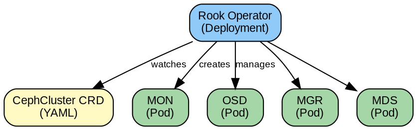
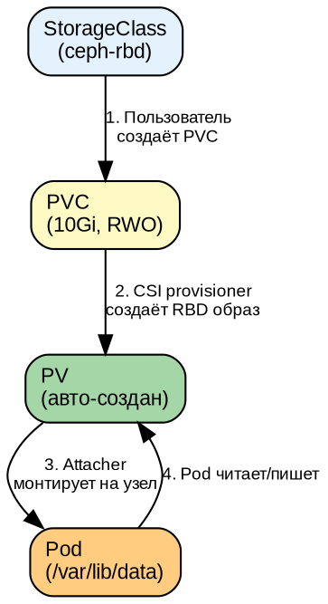
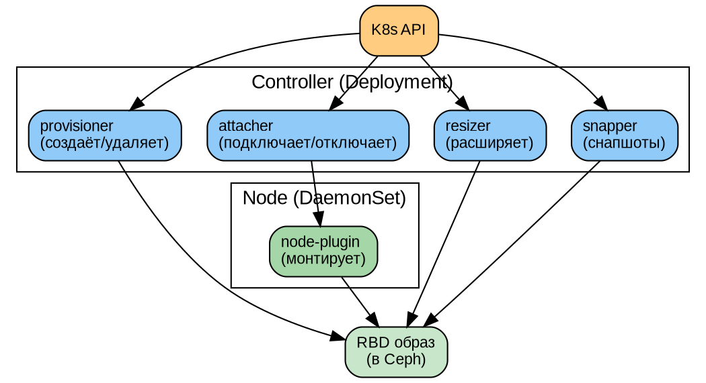
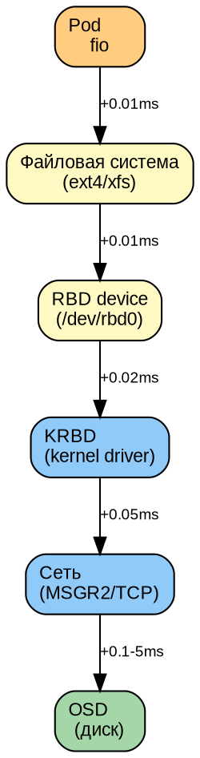

# Часть VIII. Kubernetes и CSI *(85 стр., 6 кейсов)*

> **Цель:** освоить интеграцию Ceph с Kubernetes — от архитектуры Rook до диагностики CSI и тюнинга производительности.
> **После этой части вы сможете:** развернуть Rook+Ceph, настроить RBD/CephFS тома, измерить и улучшить производительность, диагностировать 6 типовых отказов CSI.

---

## Глава 26. Ceph + Kubernetes: архитектура интеграции *(16 стр.)*

### 26.1. CSI (Container Storage Interface) *(3 стр.)*

**CSI** — стандартный интерфейс между Kubernetes и системами хранения. До CSI каждый вендор писал свой плагин, и они были несовместимы. CSI унифицирует:

```
┌─────────────────────────────────────────────┐
│ Kubernetes                                   │
│  PVC → StorageClass → PV                    │
│         ↓                                    │
│  CSI provisioner (sidecar)                   │
│         ↓                                    │
│  CSI driver (RBD/CephFS/NFS)                 │
│         ↓                                    │
│  Ceph Cluster                                │
└─────────────────────────────────────────────┘
```

**Компоненты CSI:**
- **Controller plugin** (Deployment): создаёт/удаляет тома, снапшоты
- **Node plugin** (DaemonSet): монтирует тома на узлах, где запущены поды
- **Sidecar-контейнеры:** provisioner, attacher, resizer, snapper, liveness-probe

```dot
digraph {
    bgcolor=white
    node [fontname="Arial" fontsize=11 fontcolor=black shape=box style="filled,rounded"]
    edge [fontname="Arial" fontsize=9 fontcolor=black]

    k8s [label="Kubernetes\nAPI Server" fillcolor="#FFCC80"]
    pvc [label="PVC\n(запрос тома)" fillcolor="#FFF9C4"]
    sp [label="StorageClass\n(тип тома)" fillcolor="#FFF9C4"]

    provisioner [label="csi-provisioner\n(sidecar)" fillcolor="#90CAF9"]
    attacher [label="csi-attacher\n(sidecar)" fillcolor="#90CAF9"]
    driver [label="CSI Driver\n(rbd/cephfs)" fillcolor="#64B5F6"]
    node [label="Node Plugin\n(DaemonSet)" fillcolor="#A5D6A7"]

    ceph [label="Ceph Cluster" fillcolor="#A5D6A7"]

    k8s -> pvc
    pvc -> sp
    sp -> provisioner -> driver -> ceph
    attacher -> driver
    driver -> node [label="mount"]
    node -> ceph [label="map RBD"]
}
```

---

### 26.2. Rook: оператор Ceph *(4 стр.)*

**Rook** — это Kubernetes-оператор для Ceph. Оператор — это контроллер, который следит за Custom Resources (CRD) и автоматически приводит реальное состояние кластера к желаемому.

**Архитектура Rook:**


**Reconciler (цикл согласования):**
```
1. Прочитать CephCluster CRD (желаемое состояние: "3 MON, 12 OSD")
2. Прочитать фактическое состояние (сколько MON/OSD запущено)
3. Сравнить → довести до желаемого (запустить недостающие)
4. Повторить
```

**Ключевые CRD Rook:**
- `CephCluster` — сам кластер Ceph
- `CephBlockPool` — RBD пул → StorageClass
- `CephFilesystem` — CephFS → StorageClass
- `CephObjectStore` — RGW (S3)

---

### 26.3. Ceph-CSI плагины *(3 стр.)*

**RBD CSI plugin:**
- `rbd.csi.ceph.com` — provisioner
- Создаёт RBD-образ для каждого PVC
- Поддерживает: создание, удаление, расширение, снапшоты, клоны

**CephFS CSI plugin:**
- `cephfs.csi.ceph.com` — provisioner
- Создаёт subvolume в CephFS для каждого PVC
- Поддерживает RWX (один том — много подов)

**NFS CSI plugin (Squid+):**
- Экспорт CephFS через NFS-Ganesha
- Полезен, когда ядро узла K8s не поддерживает CephFS

---

### 26.4. StorageClass, PVC, PV: жизненный цикл *(4 стр.)*



**Пример StorageClass (RBD):**
```yaml
apiVersion: storage.k8s.io/v1
kind: StorageClass
metadata:
  name: ceph-rbd
provisioner: rbd.csi.ceph.com
parameters:
  clusterID: 51fa3f5c-7da8-11f1-b7ed-bc2411ed0aef
  pool: k8s_rbd
  imageFeatures: layering
  csi.storage.k8s.io/provisioner-secret-name: ceph-secret
  csi.storage.k8s.io/provisioner-secret-namespace: rook-ceph
  csi.storage.k8s.io/controller-expand-secret-name: ceph-secret
  csi.storage.k8s.io/node-stage-secret-name: ceph-secret
reclaimPolicy: Delete
allowVolumeExpansion: true
```

**Access Modes (режимы доступа):**
| Режим | Описание | Пример |
|-------|----------|--------|
| `ReadWriteOnce` (RWO) | Один под читает/пишет | БД, один экземпляр |
| `ReadOnlyMany` (ROX) | Много подов читают | Конфигурация, статика |
| `ReadWriteMany` (RWX) | Много подов читают/пишут | Общее файловое хранилище |

**RBD поддерживает: RWO, ROX** (блочное устройство — один writer)
**CephFS поддерживает: RWO, ROX, RWX** (файловая система — много writers)

---

### 26.5. Практикум: Rook + Ceph *(2 стр.)*

```bash
# 1. Клонировать Rook
git clone https://github.com/rook/rook.git

# 2. Установить оператор
kubectl apply -f rook/deploy/examples/crds.yaml
kubectl apply -f rook/deploy/examples/common.yaml
kubectl apply -f rook/deploy/examples/operator.yaml

# 3. Создать кластер
kubectl apply -f rook/deploy/examples/cluster.yaml

# 4. Ждать (5-10 минут)
kubectl -n rook-ceph get pods
# rook-ceph-mon-a-xxx    1/1 Running
# rook-ceph-mgr-a-xxx    1/1 Running
# rook-ceph-osd-0-xxx    1/1 Running

# 5. Проверить статус Ceph
kubectl -n rook-ceph exec -it deploy/rook-ceph-tools -- ceph status
```

---

## Глава 27. CSI RBD: блочные тома *(18 стр.)*

### 27.1. RBD CSI: компоненты *(4 стр.)*



**Как работает создание PVC:**
1. Пользователь создаёт PVC → K8s вызывает CSI provisioner
2. Provisioner создаёт RBD-образ (`rbd create k8s_rbd/pvc-<uuid>`)
3. K8s создаёт PV с ссылкой на этот образ
4. При запуске пода: attacher вызывает node-plugin → `rbd map`
5. Node-plugin форматирует (mkfs) и монтирует (`mount`) в под

---

### 27.2. StorageClass: параметры *(3 стр.)*

```yaml
apiVersion: storage.k8s.io/v1
kind: StorageClass
metadata:
  name: ceph-rbd-ssd
provisioner: rbd.csi.ceph.com
parameters:
  clusterID: 51fa3f5c-7da8-11f1-b7ed-bc2411ed0aef
  pool: k8s_rbd_ssd              # SSD-only пул для быстрых томов
  imageFeatures: layering        # Минимальный набор функций
  imageFormat: "2"               # Формат образа RBD v2
  csi.storage.k8s.io/fstype: ext4
  csi.storage.k8s.io/provisioner-secret-name: ceph-secret
  csi.storage.k8s.io/provisioner-secret-namespace: rook-ceph
  csi.storage.k8s.io/node-stage-secret-name: ceph-secret
  csi.storage.k8s.io/node-stage-secret-namespace: rook-ceph
  # Опционально: шифрование
  encrypted: "true"
  encryptionPassphrase: "my-secret-passphrase"
reclaimPolicy: Delete
allowVolumeExpansion: true
mountOptions:
  - discard                     # TRIM для SSD (освобождать удалённые блоки)
  - noatime                     # Не обновлять время доступа (производительность)
```

---

### 27.3. Снапшоты и клоны томов *(3 стр.)*

**VolumeSnapshotClass:**
```yaml
apiVersion: snapshot.storage.k8s.io/v1
kind: VolumeSnapshotClass
metadata:
  name: ceph-rbd-snapshot
driver: rbd.csi.ceph.com
deletionPolicy: Delete
parameters:
  clusterID: 51fa3f5c-...  # Ваш FSID
  csi.storage.k8s.io/snapshotter-secret-name: ceph-secret
  csi.storage.k8s.io/snapshotter-secret-namespace: rook-ceph
```

**Создать снапшот:**
```yaml
apiVersion: snapshot.storage.k8s.io/v1
kind: VolumeSnapshot
metadata:
  name: my-pvc-snap
spec:
  volumeSnapshotClassName: ceph-rbd-snapshot
  source:
    persistentVolumeClaimName: my-pvc
```

**Восстановить из снапшота (клон):**
```yaml
apiVersion: v1
kind: PersistentVolumeClaim
metadata:
  name: my-pvc-restored
spec:
  storageClassName: ceph-rbd
  dataSource:
    name: my-pvc-snap
    kind: VolumeSnapshot
    apiGroup: snapshot.storage.k8s.io
  accessModes:
    - ReadWriteOnce
  resources:
    requests:
      storage: 10Gi
```

---

### 27.4. Расширение тома онлайн *(2 стр.)*

```yaml
# StorageClass: allowVolumeExpansion: true
# Затем:
kubectl edit pvc my-pvc
# Меняем storage: 10Gi → 20Gi

# K8s вызывает CSI resizer → rbd resize
# Файловая система расширяется онлайн (ext4/xfs)
# Под НЕ перезапускается!
```

---

### 27.5. Практикум *(6 стр.)*

**Полный цикл: PVC → снапшот → клон → расширение**

```bash
# 1. PVC + Pod
kubectl apply -f - <<EOF
apiVersion: v1
kind: PersistentVolumeClaim
metadata:
  name: test-pvc
spec:
  storageClassName: ceph-rbd
  accessModes: [ReadWriteOnce]
  resources:
    requests:
      storage: 10Gi
---
apiVersion: v1
kind: Pod
metadata:
  name: test-pod
spec:
  containers:
  - name: app
    image: nginx
    volumeMounts:
    - name: data
      mountPath: /data
  volumes:
  - name: data
    persistentVolumeClaim:
      claimName: test-pvc
EOF

# 2. Записать данные
kubectl exec test-pod -- sh -c "echo 'important data' > /data/file.txt"

# 3. Снапшот
kubectl apply -f snapshot.yaml

# 4. Удалить Pod + PVC
kubectl delete pod test-pod
kubectl delete pvc test-pvc

# 5. Восстановить из снапшота
kubectl apply -f pvc-restored.yaml

# 6. Новый Pod с восстановленным PVC
kubectl apply -f pod-restored.yaml

# 7. Проверить данные
kubectl exec test-pod-restored -- cat /data/file.txt
# "important data"  ← данные на месте!
```

---

## Глава 28. CSI CephFS: RWX-тома *(14 стр.)*

### 28.1. CephFS CSI: provisioner *(3 стр.)*

CephFS CSI создаёт **subvolume** — подкаталог в CephFS, изолированный от других subvolume. Каждый PVC — это отдельный subvolume.

**Kernel driver vs ceph-fuse:**
- `mounter: kernel` — быстрее (нативный драйвер ядра), но требует модуль `ceph.ko`
- `mounter: fuse` — медленнее (userspace), но совместимее (работает на любом ядре)

---

### 28.2. StorageClass *(3 стр.)*

```yaml
apiVersion: storage.k8s.io/v1
kind: StorageClass
metadata:
  name: cephfs
provisioner: cephfs.csi.ceph.com
parameters:
  clusterID: 51fa3f5c-...
  fsName: cephfs
  pool: cephfs_data
  csi.storage.k8s.io/provisioner-secret-name: ceph-secret
  csi.storage.k8s.io/provisioner-secret-namespace: rook-ceph
  csi.storage.k8s.io/node-stage-secret-name: ceph-secret
  csi.storage.k8s.io/node-stage-secret-namespace: rook-ceph
  mounter: kernel
reclaimPolicy: Delete
allowVolumeExpansion: true
```

---

### 28.3. Shared volume (RWX) *(3 стр.)*

```yaml
apiVersion: v1
kind: PersistentVolumeClaim
metadata:
  name: shared-data
spec:
  storageClassName: cephfs
  accessModes: [ReadWriteMany]
  resources:
    requests:
      storage: 50Gi
---
apiVersion: apps/v1
kind: Deployment
metadata:
  name: nginx
spec:
  replicas: 3
  selector:
    matchLabels:
      app: nginx
  template:
    metadata:
      labels:
        app: nginx
    spec:
      containers:
      - name: nginx
        image: nginx
        volumeMounts:
        - name: shared
          mountPath: /usr/share/nginx/html
      volumes:
      - name: shared
        persistentVolumeClaim:
          claimName: shared-data
```

**Все 3 пода читают/пишут в ОДИН том!** Это уникальная возможность CephFS, недоступная в RBD.

---

### 28.4. Практикум *(5 стр.)*

1. Развернуть Deployment с 3 репликами + RWX-том
2. Записать файл из пода-1
3. Прочитать из пода-2 (убедиться, что один и тот же том)
4. Замерить производительность (`fio` внутри пода)

```bash
kubectl exec deploy/nginx-replica-1 -- sh -c "echo 'from pod1' > /usr/share/nginx/html/shared.txt"
kubectl exec deploy/nginx-replica-2 -- cat /usr/share/nginx/html/shared.txt
# "from pod1" ← данные видны из другого пода!
```

---

## Глава 29. Производительность CSI *(20 стр.)*

### 29.1. CSI performance model *(4 стр.)*



**Где добавляется latency:**
- Bare-metal RBD: pod → ext4 → KRBD → сеть → OSD (~0.5–5 мс)
- CSI RBD: pod → ext4 → **CSI mount** → KRBD → сеть → OSD (+0.1 мс на CSI-оверхед)
- CSI CephFS (kernel): pod → CephFS kernel → сеть → OSD (~0.5–5 мс)
- CSI CephFS (fuse): pod → **FUSE userspace** → сеть → OSD (+0.2–1 мс на FUSE)

---

### 29.2. Бенчмаркинг fio в поде *(4 стр.)*

```bash
# Установить fio в поде (или использовать образ с fio)
kubectl exec -it test-pod -- bash
apt update && apt install fio -y

# Случайное чтение 4K (моделирует БД)
fio --name=test --ioengine=libaio --direct=1 --rw=randread \
    --bs=4k --numjobs=4 --size=1G --runtime=60 --time_based \
    --filename=/data/fio-test

# Результат:
# IOPS: 4523
# Latency avg: 0.88ms
# Latency p99: 2.04ms
```

**Сравнительная таблица (пример):**

| Режим | IOPS (4K rand) | MB/s (1M seq) | p99 latency |
|-------|---------------|---------------|-------------|
| RBD CSI | 4500 | 480 | 2.0 ms |
| CephFS CSI (kernel) | 4200 | 450 | 2.5 ms |
| CephFS CSI (fuse) | 2800 | 320 | 4.0 ms |
| Bare-metal RBD | 5200 | 520 | 1.5 ms |

**Выводы:**
- CSI-оверхед: ~10–15% к IOPS по сравнению с bare-metal
- CephFS kernel близок к RBD по производительности
- CephFS FUSE — значительные потери (~40%)

---

### 29.3. Тюнинг CSI *(4 стр.)*

```yaml
# StorageClass с тюнингом
apiVersion: storage.k8s.io/v1
kind: StorageClass
metadata:
  name: ceph-rbd-perf
provisioner: rbd.csi.ceph.com
parameters:
  pool: k8s_rbd_ssd
  imageFeatures: layering

  # ВАЖНО: тюнинг RBD
  rbd_op_threads: "8"              # Потоков для RBD-операций
  rbd_cache: "true"                # Включить кеш
  rbd_cache_max_dirty: "50331648"  # 48 MB dirty cache
  rbd_cache_writethrough_until_flush: "false"
  rbd_readahead_max_bytes: "4194304"  # 4 MB readahead

  # Блочное устройство
  blk_mq: "true"                   # Multi-queue
```

**Эффект тюнинга (типичный):**
- `rbd_cache=true`: +20–30% write IOPS (за счёт кеширования)
- `rbd_op_threads=8`: +15–20% параллельной записи
- `readahead`: +10–15% последовательного чтения

---

### 29.4. Rook vs external Ceph *(3 стр.)*

| Фактор | Rook-managed Ceph | External Ceph |
|--------|-------------------|---------------|
| Ceph в K8s | Да (Pods) | Нет (отдельный кластер) |
| Управление | Через K8s CRD | `ceph` CLI на кластере |
| Накладные расходы | +5–10% CPU/RAM на оператор | Минимальные |
| Latency overhead | +0.1–0.3 ms (доп. абстракция) | Нет |
| Подходит для | «Всё в K8s», dev/test | Production, high-perf |

---

### 29.5. Практикум *(5 стр.)*

1. Снять производительность CSI RBD (fio в поде)
2. Снять производительность CSI CephFS (fio в поде)
3. Снять bare-metal RBD (fio на узле)
4. Построить сравнительные графики
5. Grafana-дашборд для CSI latency

---

## Глава 30. Диагностика и отказы в CSI: 6 кейсов *(17 стр.)*

### 30.1. Кейс 1: PVC в Pending *(3 стр.)*

**Симптом:**
```bash
kubectl get pvc
# NAME       STATUS    VOLUME   CAPACITY
# my-pvc     Pending
```

**Диагностика:**
```bash
kubectl describe pvc my-pvc
# Events:
#   Warning  ProvisioningFailed  ... failed to provision volume
#   with StorageClass "ceph-rbd": rpc error: code = NotFound
#   desc = pool "k8s_rbd" not found
```

**Причины:**
- Пул не существует → создать
- StorageClass не найден → проверить `kubectl get sc`
- Ceph недоступен → проверить `ceph status`
- Secret не найден → `kubectl get secret -n rook-ceph ceph-secret`

---

### 30.2. Кейс 2: том не монтируется *(3 стр.)*

**Симптом:**
```bash
kubectl get pod
# NAME       READY   STATUS              RESTARTS   AGE
# test-pod   0/1     ContainerCreating   0          5m
```

**Диагностика:**
```bash
kubectl describe pod test-pod
# Events:
#   Warning  FailedMount  ... MountVolume.MountDevice failed
#   for volume "pvc-xxx": rpc error: code = Internal
#   desc = rbd: failed to map ...

# На узле:
dmesg | tail -20 | grep rbd
# rbd: image features 0x3d unsupported
```

**Причина:** `imageFeatures` в StorageClass не поддерживаются ядром узла. Решение: использовать `imageFeatures: layering` (минимальный набор).

---

### 30.3. Кейс 3: потеря связи с Ceph *(3 стр.)*

**Симптом:** Pod в `ContainerCreating`, долго (таймаут CSI — 5 минут).

**Диагностика:**
```bash
# Проверить подключение из CSI-provisioner
kubectl -n rook-ceph exec -it deploy/csi-rbdplugin-provisioner -- bash
ceph status
# Error connecting to cluster: No such file or directory

# Проверить сеть до Ceph MON
ping 10.0.1.10
telnet 10.0.1.10 6789
```

**Причины:** сеть K8s → Ceph недоступна, MON все down, конфиг Ceph в Secret устарел.

---

### 30.4. Кейс 4: отказ OSD под RBD-томом *(3 стр.)*

**Симптом:** приложение в поде сообщает об ошибках I/O или зависает.

**Диагностика:**
```bash
# В Ceph
ceph osd tree
# osd.5  down  0 1.00000

ceph pg dump | grep -E "degraded|inconsistent"

# В поде
dmesg | grep rbd
# rbd: rbd5: write error: (5) Input/output error
```

**Решение:** восстановить OSD (см. Часть IV кейс 1). До восстановления: кластер обслуживает I/O с других реплик, но degraded.

---

### 30.5. Кейс 5: восстановление из снапшота *(2 стр.)*

**Симптом:** случайно удалённые данные в поде.

**Решение:**
```yaml
# 1. Снапшот уже существует (создан ранее)
# 2. Создать PVC из снапшота
kubectl apply -f pvc-from-snap.yaml

# 3. Под с восстановленным PVC
kubectl apply -f pod-restored.yaml

# 4. Данные восстановлены
kubectl exec restored-pod -- cat /data/important.txt
```

---

### 30.6. Кейс 6: DR в K8s *(3 стр.)*

**Сценарий:** потерян весь кластер K8s. Остались только снапшоты PVC (в Ceph они сохранились, т.к. Ceph — отдельно).

**Восстановление:**
```bash
# 1. Новый K8s + Rook + подключение к тому же Ceph
# 2. Найти снапшоты:
rbd snap ls k8s_rbd/csi-vol-<uuid>

# 3. Вручную создать PVC из снапшота:
rbd clone k8s_rbd/csi-vol-<uuid>@snap-xxx k8s_rbd/pvc-restored-<new-uuid>

# 4. Создать PV с ручным указанием RBD-образа
# 5. Создать PVC → Pod
# 6. Приложение работает с теми же данными
```

---

| Навигация | |
|-----------|---|
| ← Часть VII | [part-VII.md](part-VII.md) |
| ↑ Оглавление | [TOC.md](TOC.md) |
| → Часть IX | [part-IX.md](part-IX.md) |
